# 2024北京智源大会-AI系统---P7-大模型高效可扩展并行策略研究-李士刚---智源社区---BV1DS411w7EG

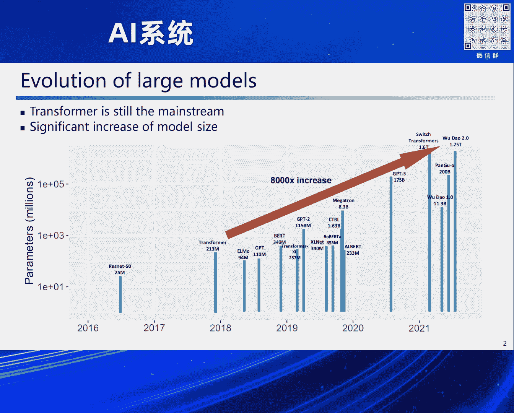

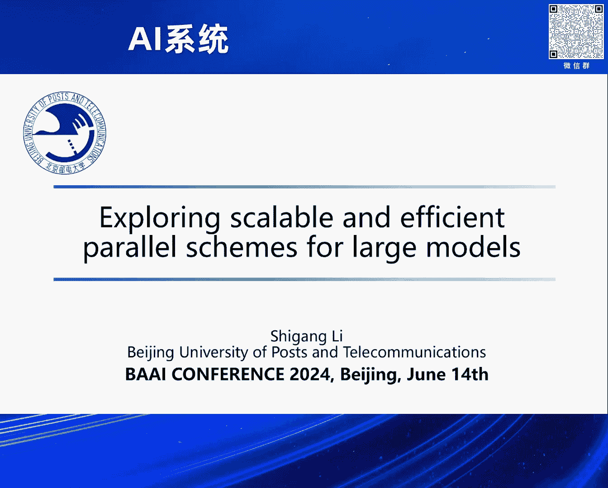

## 概述
在本节课中，我们将学习大模型训练中高效可扩展的并行策略。我们将探讨现有并行方法的挑战，并介绍一种基于SBP（Split, Broadcast, Partial Sum）模型的自动分布式并行框架AutoDDL。课程将涵盖3D分布式矩阵乘法、混合序列并行策略以及如何将二阶优化方法融入流水线并行以提升效率。

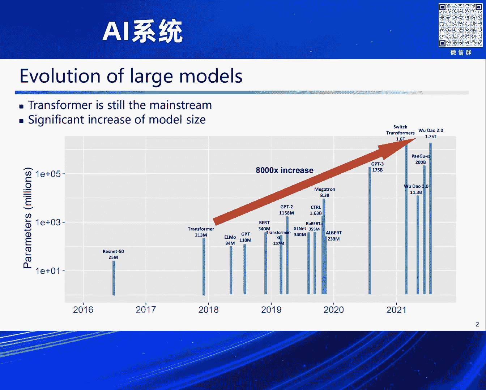

---

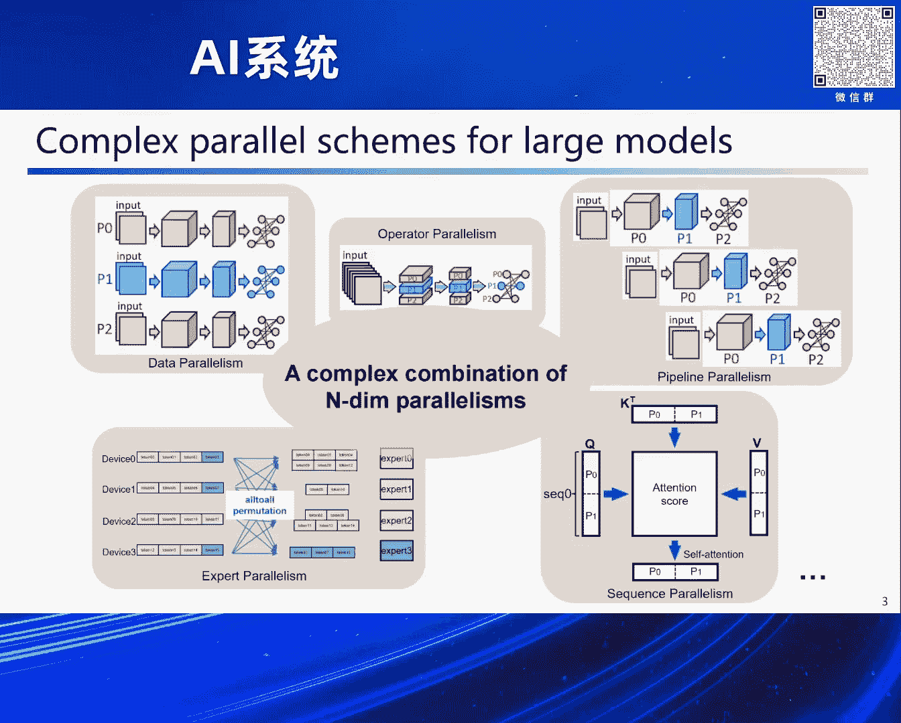

## Transformer架构与并行策略的挑战

当前大模型的主流架构仍然是Transformer。随着模型规模和能力的增长，其并行策略也变得越来越复杂，通常涉及多个维度的并行组合。这对系统开发者和性能优化人员带来了沉重负担。

因此，我们需要开发能够自动运行的分布式框架，以自动生成最优的并行策略和代码实现。虽然该领域已有许多工作，但仍面临一些挑战。

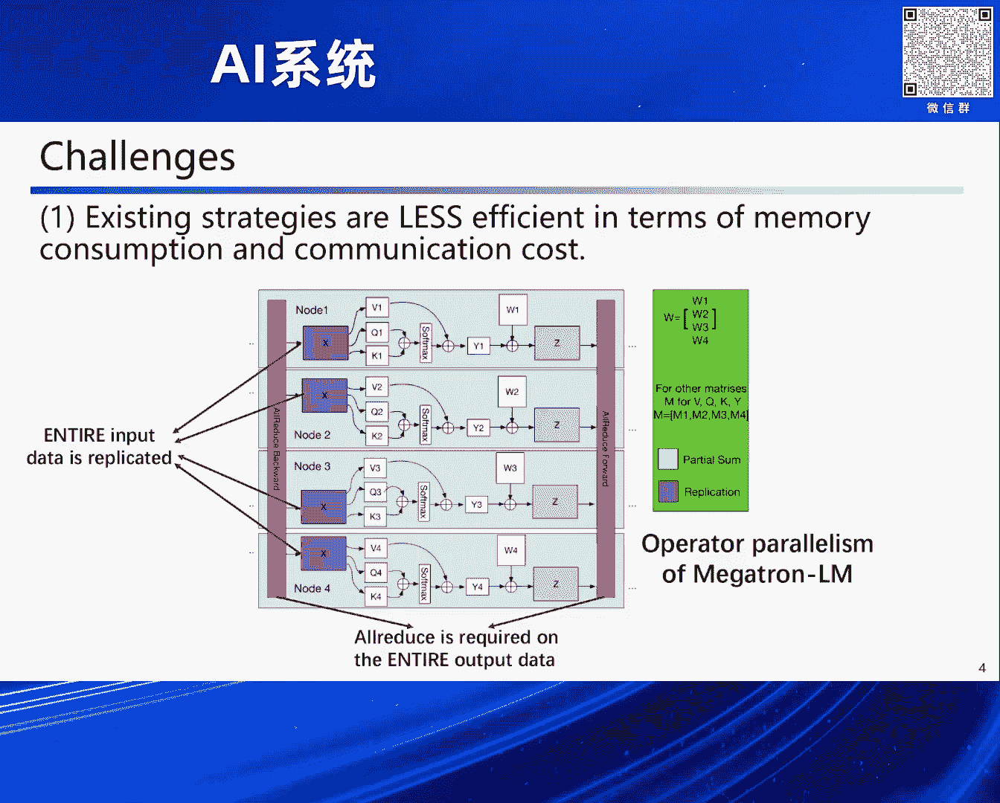

以下是现有并行策略面临的两个主要挑战：

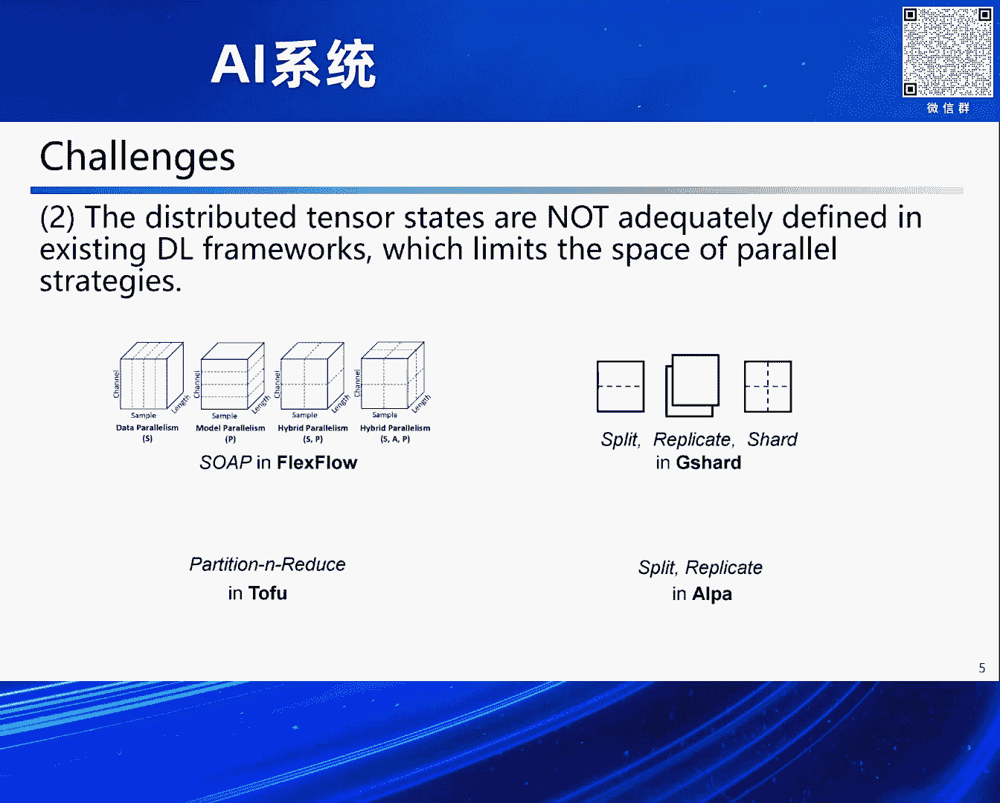

1.  **通信与内存开销高**：在已有的并行策略中，通信开销和内存开销并不高效。以Megatron-LM中的操作符并行为例，它需要将整个输入数据在多个进程上复制，进行本地计算后，再对输出数据进行一次All-Reduce操作。这种方法虽然简单，但内存和通信开销都较高。
2.  **框架描述能力有限**：现有的深度学习框架对分布式张量的描述能力有限，难以高效描述如2.5D或3D分布式矩阵乘法这类通信效率更高的并行算法。

---

## AutoDDL：基于SBP的自动并行框架

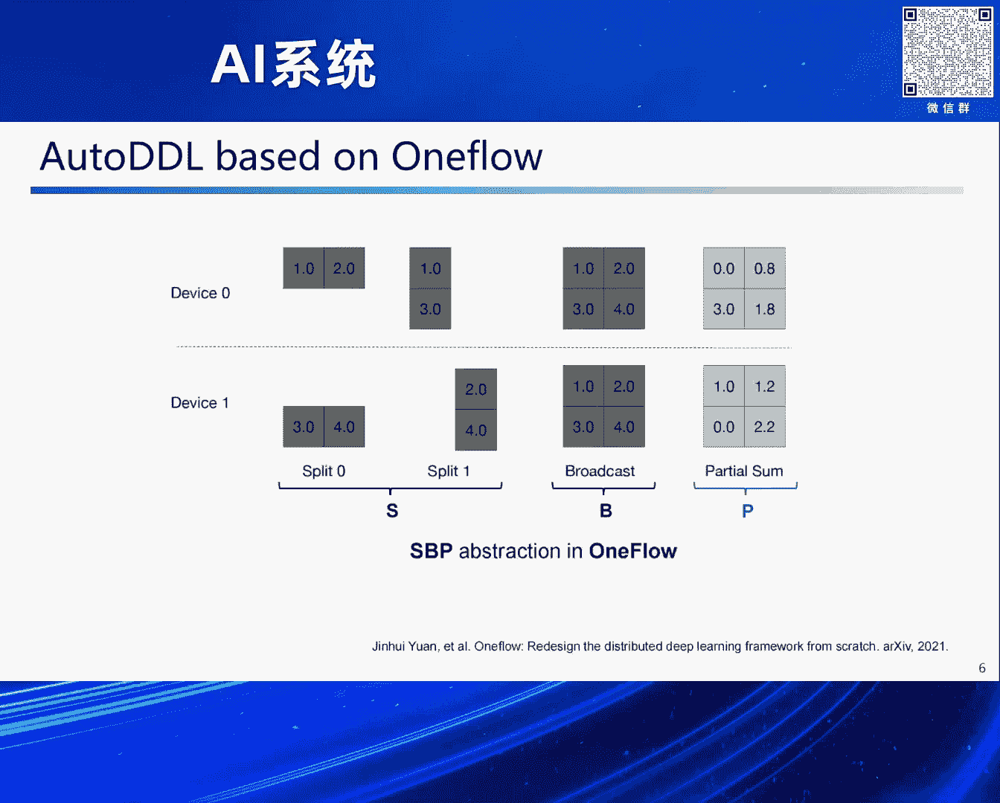

上一节我们介绍了现有并行策略的挑战，本节中我们来看看AutoDDL框架如何解决这些问题。

AutoDDL是基于OneFlow中的SBP框架提出的自动分布式并行框架。SBP定义了分布式张量的三种状态：
*   **S (Split)**：张量在某个维度上被切分。
*   **B (Broadcast)**：张量在所有进程上复制。
*   **P (Partial Sum)**：张量是部分和，需要经过一次All-Reduce操作才能得到完整结果。

`P`状态是相对于其他框架新增的，它代表了中间结果。由于我们定义了这种中间状态，可以更灵活地决定何时调用All-Reduce操作，从而为设计更高效的并行算法（如3D分布式矩阵乘法）提供了灵活性。

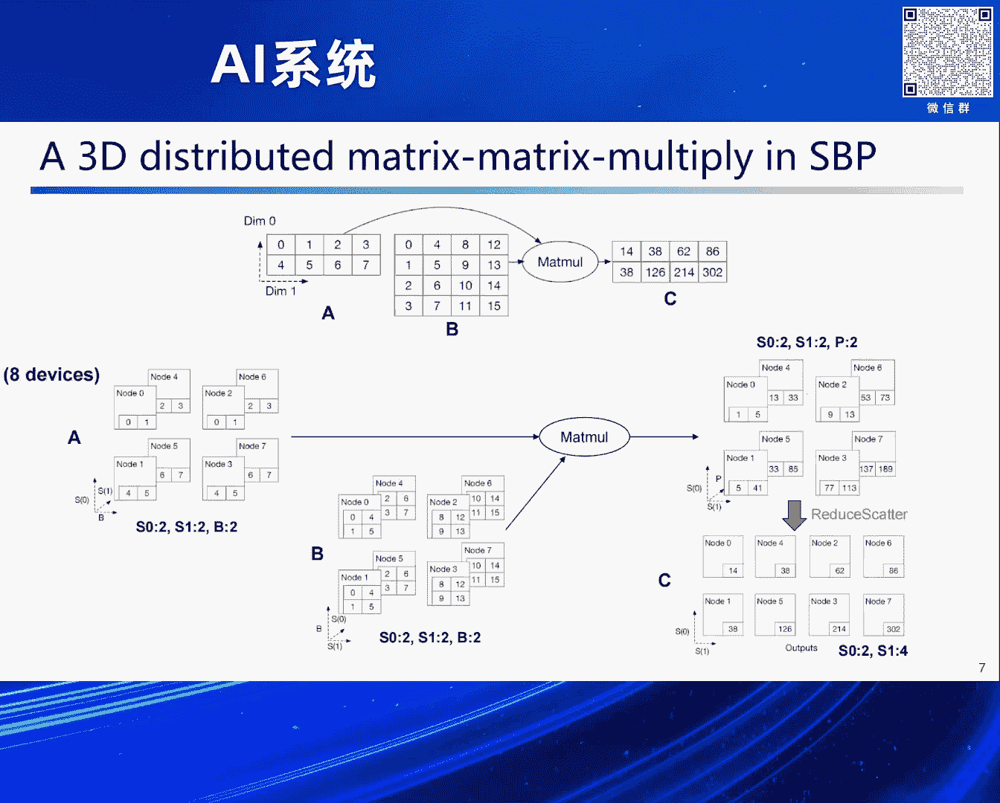

---

## 实现3D分布式矩阵乘法

了解了SBP模型后，我们来看看如何利用它实现3D分布式矩阵乘法。

我们以矩阵乘法 `C = A × B` 在8张卡上为例。
*   矩阵A的分布模式为 `S(0,2) S(1,2) B(2)`。这表示在A的第0维和第1维各切分成2份（共4份），然后将这4份数据复制（Broadcast）到2组进程上（共8个进程）。
*   矩阵B采用与A相同的分布方式。
*   进行本地矩阵乘法计算后，得到一个中间结果矩阵，其分布模式为 `S(0,2) S(1,2) P(2)`。`P(2)`表示这个结果是分布在2组进程上的部分和。
*   最后，调用一次Reduce-Scatter操作，得到最终的结果矩阵C，它也分布在8张卡上。

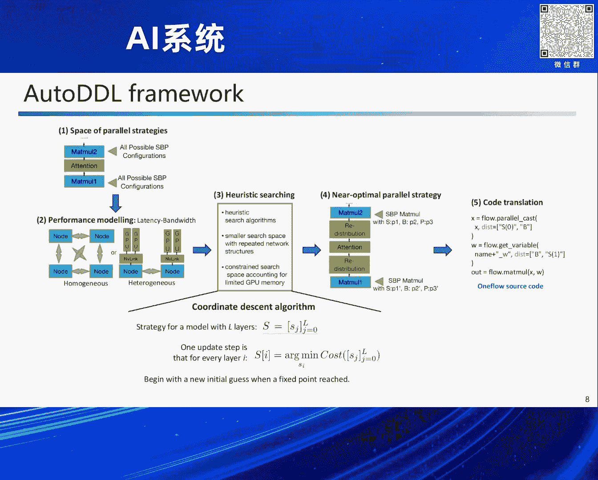

这种3D分布式矩阵乘法相比常见的1D或2D方法，通信开销更低。

---

## AutoDDL框架工作流程

接下来，我们深入了解一下AutoDDL框架的整体工作流程。

以下是AutoDDL生成并行策略的主要步骤：

1.  **构建搜索空间**：对于给定的神经网络，枚举每个操作符所有可能的SBP配置，从而构建端到端的并行策略搜索空间。
2.  **通信性能建模**：主要考虑同构和多机多卡异构两种网络架构，使用简单的延迟-带宽模型对通信开销进行建模。
3.  **启发式策略搜索**：由于搜索空间随操作符数量指数级增长，我们采用一种定制化的坐标下降启发式搜索算法。它可以并行搜索多个区域，有效避免陷入局部最优，更快地找到全局最优或近似最优策略。
4.  **插入数据重分布**：搜索到的最优策略可能需要在不相邻的操作符之间插入数据重分布操作（在OneFlow中称为Boxing），以满足输入输出数据间的依赖关系。
5.  **生成最终代码**：利用OneFlow框架，自动生成最终的并行执行代码。

---

## AutoDDL搜索策略的优势：以注意力机制为例

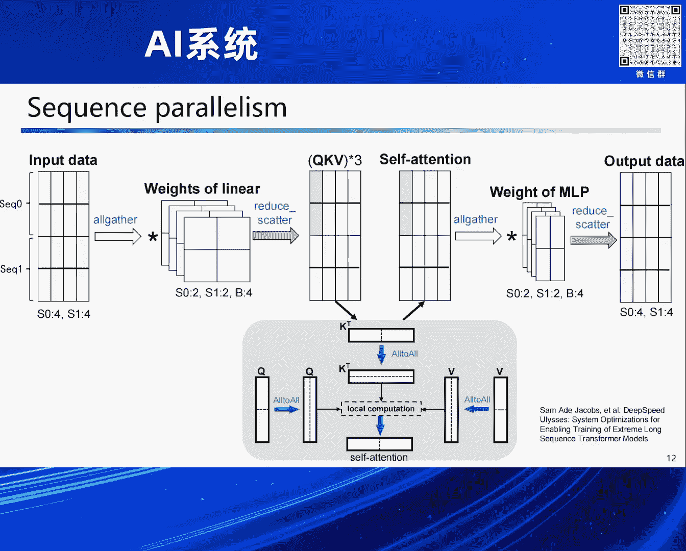

现在，我们通过一个具体例子来看看AutoDDL能搜索出哪些不同的并行策略。

我们以多头注意力（Multi-Head Attention）算子为例。
*   左图是Megatron-LM中常见的操作符并行实现方式。如果加上必不可少的数据并行维度，它可以被视为一种2D分布式矩阵乘法。
*   右图是AutoDDL搜索得到的一种并行策略。它与Megatron-LM最大的不同在于：**输入数据是在多个进程上进行划分的，而非完全复制**。在划分后的张量上进行本地计算，中间穿插两次All-Gather和两次Reduce-Scatter操作，最终得到结果向量。

与Megatron-LM相比，AutoDDL的策略虽然增加了通信次数，但**总通信量显著降低**（从 `O(N² / P^(1/2))` 降至 `O(N² / P^(2/3))`），同时输入输出数据的内存占用量也同比例降低。因此，AutoDDL搜索到的策略具有更好的并行可扩展性。

---

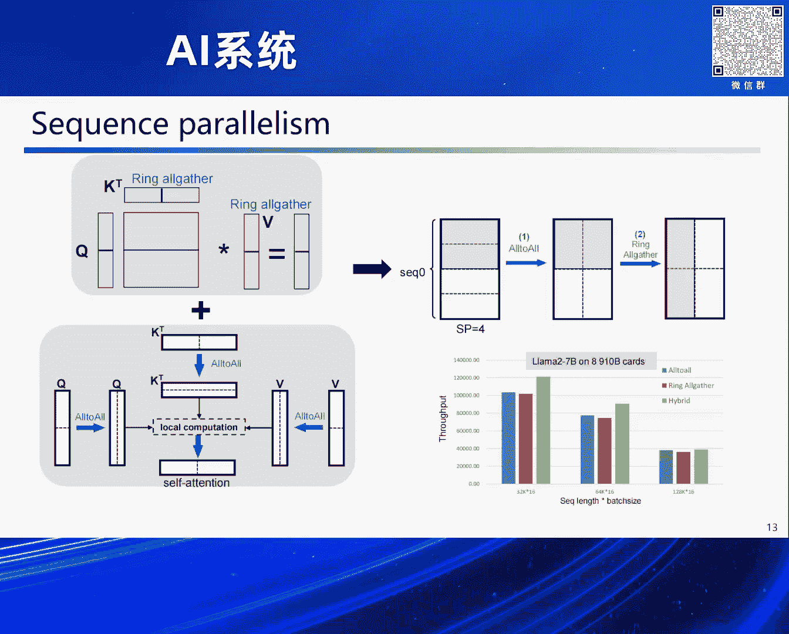

## 混合序列并行策略

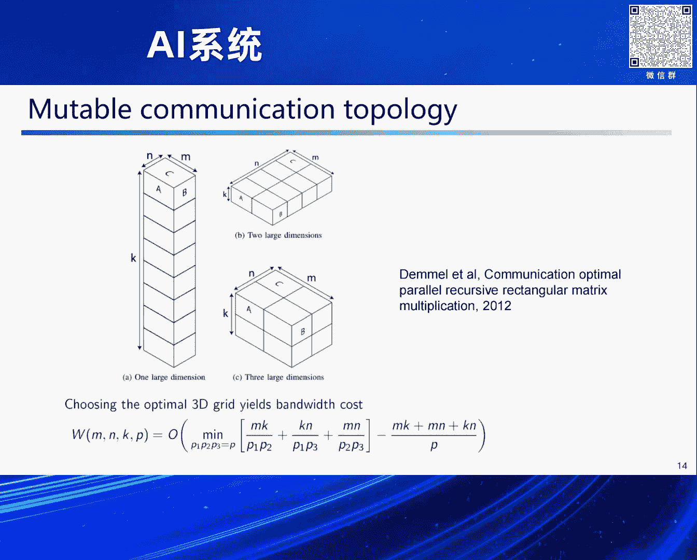

长序列处理是大模型训练和推理中的重要问题。本节我们来看看针对长序列的并行策略。

我们仍以多头注意力为例，展示其在AutoDDL中的实现。对于一个完整的长序列，我们将其划分到多个进程（卡）上，在进行自注意力计算时就需要序列并行。

当前主流的序列并行实现主要有两种：
1.  **基于Ring-AllGather的实现**：将完整的K矩阵和V矩阵通过环形通信收集到本地，与本地的Q矩阵进行计算。这种方法通信量高（与总数据量成正比，不随进程数增加而降低），但能较好地实现计算与通信的重叠隐藏。
2.  **DeepSpeed Ulysses中的All-to-All实现**：对Q、K、V三个矩阵分别调用一次All-to-All通信，使每个进程获得完整的输入序列，然后在本地执行类似FlashAttention的计算。这种方法通信量较低（与本地数据量成正比，随进程数增加而下降），但不易实现计算通信隐藏，且并行度受注意力头数限制。

AutoDDL将两种方法融合，提出一种**混合序列并行策略**：在一个维度上进行All-to-All通信，在另一个维度上进行Ring-AllGather，从而获得完整序列。初步测试表明，在Llama 2 7B模型上，对于32K、64K、128K等不同序列长度，混合策略相比单独使用Ring-AllGather或Ulysses都获得了明显的吞吐率提升。

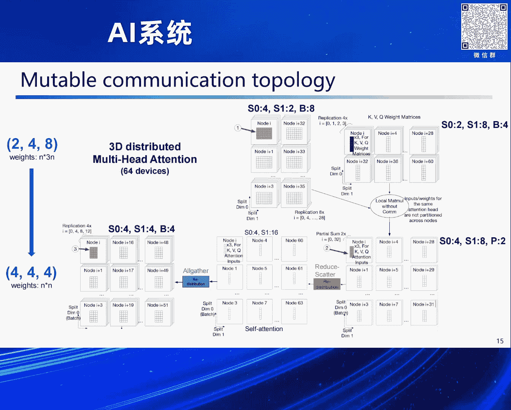

---

## 灵活的通信拓扑变换

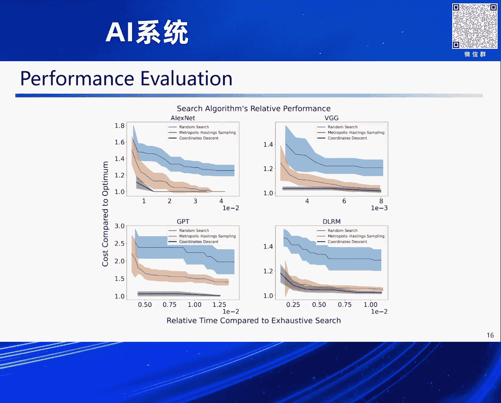

除了序列并行，AutoDDL还支持更灵活的通信拓扑变换，以进一步降低通信开销。

在深度神经网络中，经常会遇到矩形形状的矩阵运算。已有工作证明，对于矩形矩阵乘法，在矩阵更大的维度上分布更多的进程，才能得到全局最优的划分策略。

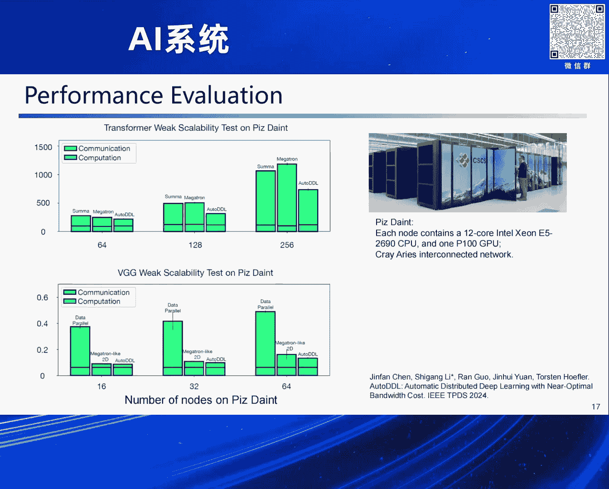

以注意力机制为例：
*   在第一个QKV线性映射层，其参数矩阵是 `N x 3N` 的矩形矩阵。AutoDDL在64张卡上搜索到的最优通信拓扑是 `2 x 8 x 4`，即在更大的 `3N` 维度上划分更多进程。
*   计算完成后，接下一个MLP层，其参数矩阵是 `N x N` 的方阵。对于方阵，最优通信拓扑是更均衡的 `4 x 4 x 4`。

AutoDDL通过在中间插入Reduce-Scatter和All-Gather操作，可以灵活地将通信拓扑从 `2 x 8 x 4` 转换为 `4 x 4 x 4`。这种灵活的通信拓扑变换能力，可以实现端到端更低的通信开销，这在现有并行框架中难以做到。

---

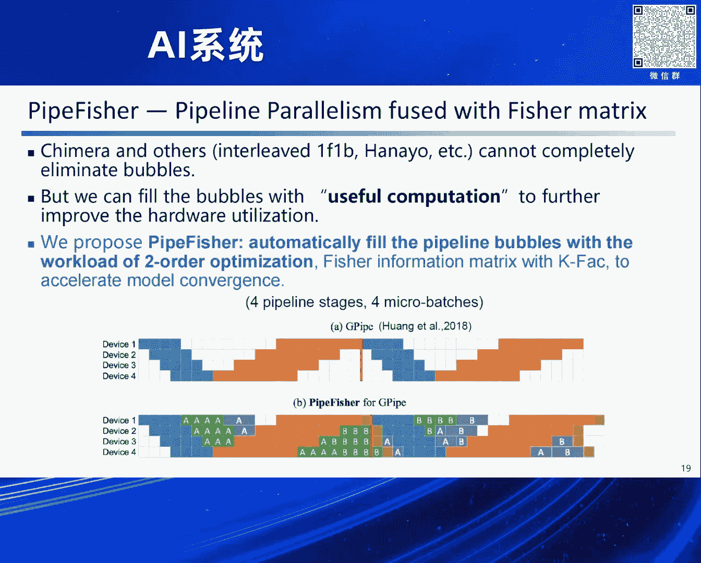

## 性能评估

我们通过实验来评估AutoDDL框架的性能。

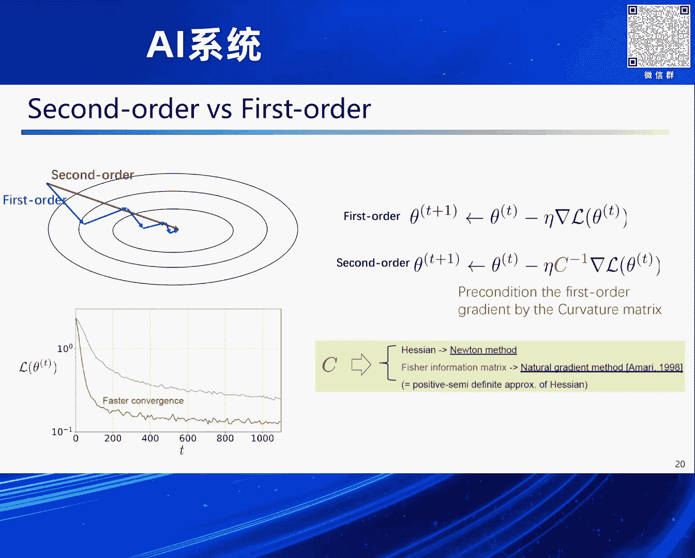

首先，在四个不同的神经网络上测试了AutoDDL所采用的启发式搜索算法的效率。相比于随机搜索和FlexFlow中使用的MCMC搜索方法，我们的启发式搜索方法能在更短时间内找到最优并行策略。值得注意的是，整个搜索过程基于性能模型进行评估，无需在实际机器上验证，因此在普通笔记本或台式机上即可快速完成。

其次，在Piz Daint超级计算机上对比了不同神经网络的最终性能。结果显示，**AutoDDL搜索到的最优并行策略，相比于手工实现的高度优化方案，仍能获得显著的性能提升**。以Transformer为例，相比配置最优的Megatron-LM并行策略，AutoDDL能获得30%的吞吐率提升，并且随着进程数（卡数）增加，其性能优势更加明显，这证明了其更好的并行可扩展性。

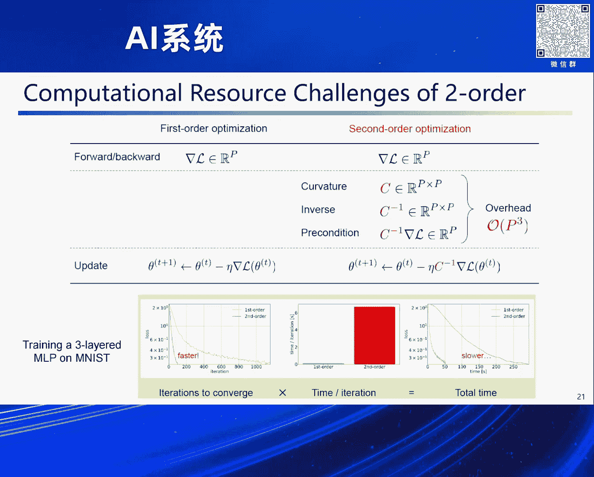

---

## 融合二阶优化的流水线并行

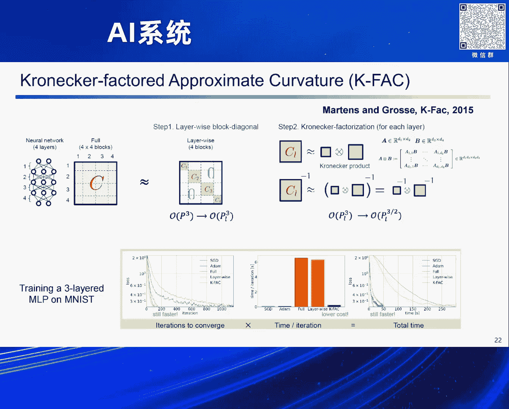

流水线并行面临的主要问题是流水线空泡（Bubble）。虽然已有许多工作（如我们之前提出的双向流水线并行机制PipeDream）来缓解空泡，但都无法完全消除。

本节我们尝试另一条技术路线：**在流水线空泡中填充有用的计算**，以提升硬件利用率。具体来说，我们在空泡中填入二阶优化方法的计算负载，以加快模型收敛速度。

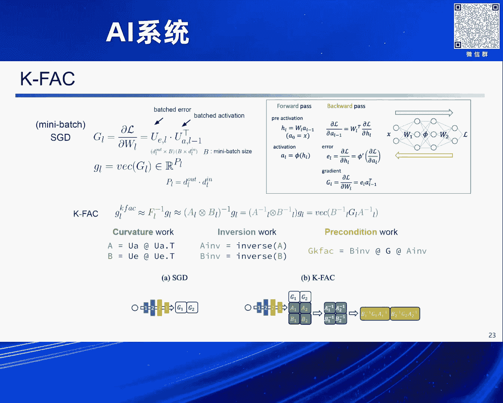

**二阶优化方法**（如自然梯度法）利用二阶导数信息更新模型，相比一阶方法（如SGD）拥有更多优化信息，能大幅提升收敛速率。其更新公式为：
`参数更新量 = 曲率矩阵的逆 × 一阶梯度`
然而，直接计算曲率矩阵及其逆的计算复杂度高达 `O(P³)`（P为参数量），对于大模型无法承受。

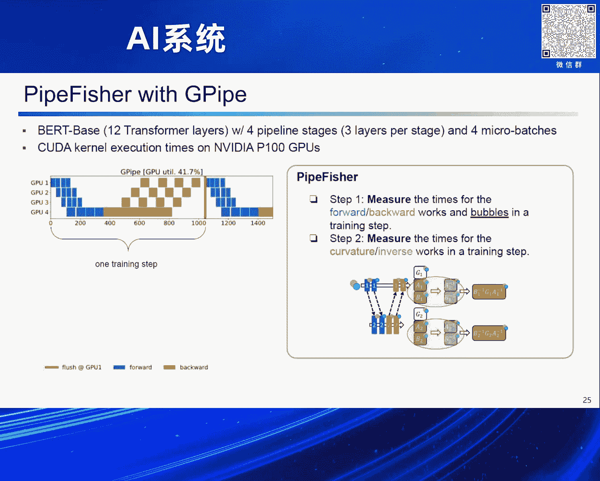

因此，我们采用近似的二阶优化方法K-FAC。K-FAC利用Kronecker因式分解，将大矩阵的求逆转化为两个小矩阵的求逆，大大降低了计算复杂度。我们将K-FAC的计算负载（计算曲率矩阵、求逆等）填充到流水线空泡中。填充原则是：只利用空泡时间，尽量不影响原有流水线的执行。这样，我们大约每1-2个训练迭代步就能更新一次曲率矩阵，显著提升了更新频率。

在BERT Large的预训练任务上，这种**融合了二阶优化的流水线并行方案**，相比使用传统一阶优化方法的方案，能将端到端的训练时间降低30%以上。

---

## 总结与展望

本节课我们一起学习了大模型高效可扩展并行策略的多个方面。

我们首先介绍了基于3D分布式矩阵乘法模型的AutoDDL框架，以及它如何自动搜索出更优的并行策略。接着，探讨了针对长序列的混合序列并行策略。最后，介绍了如何将二阶优化方法融入流水线并行，以利用空泡时间加速训练。

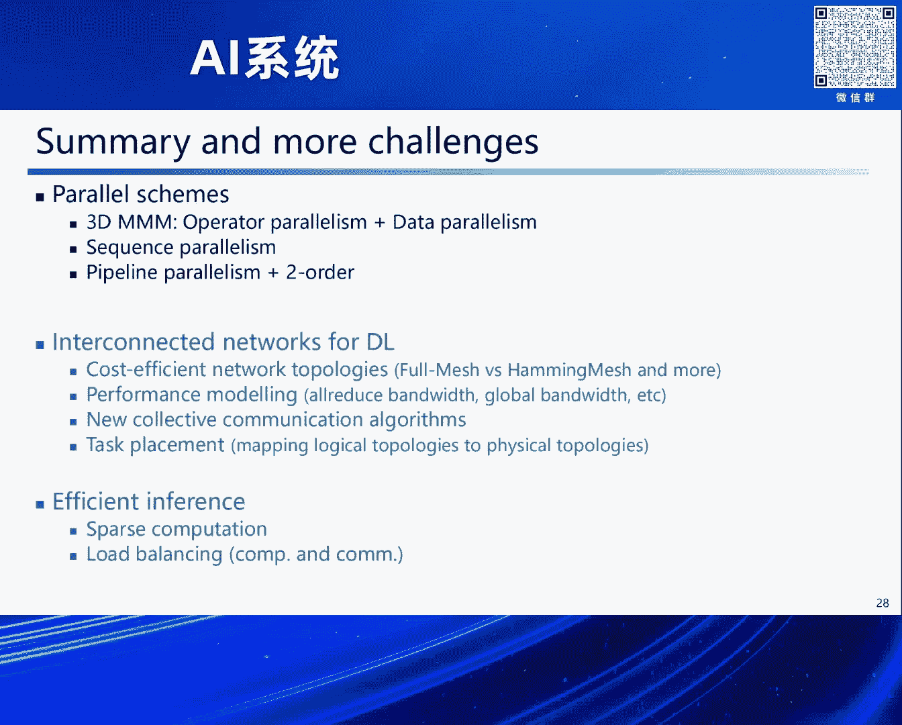

展望未来，大模型在互联网络拓扑和高性能推理方面仍面临一系列挑战。特别是在大模型推理阶段，自回归生成token的过程本质上是GEMV（矩阵-向量乘）运算，而非训练时的GEMM（矩阵-矩阵乘）运算，计算模式从计算密集型转变为访存密集型，这其中还有许多问题需要进一步研究和解决。