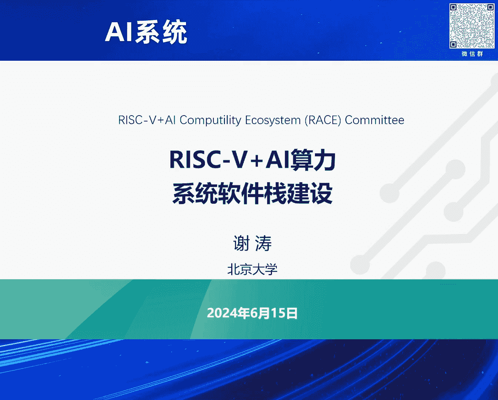
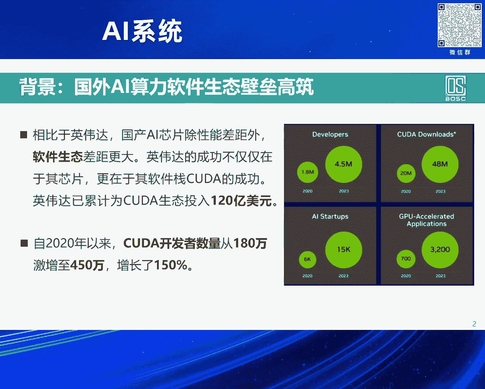
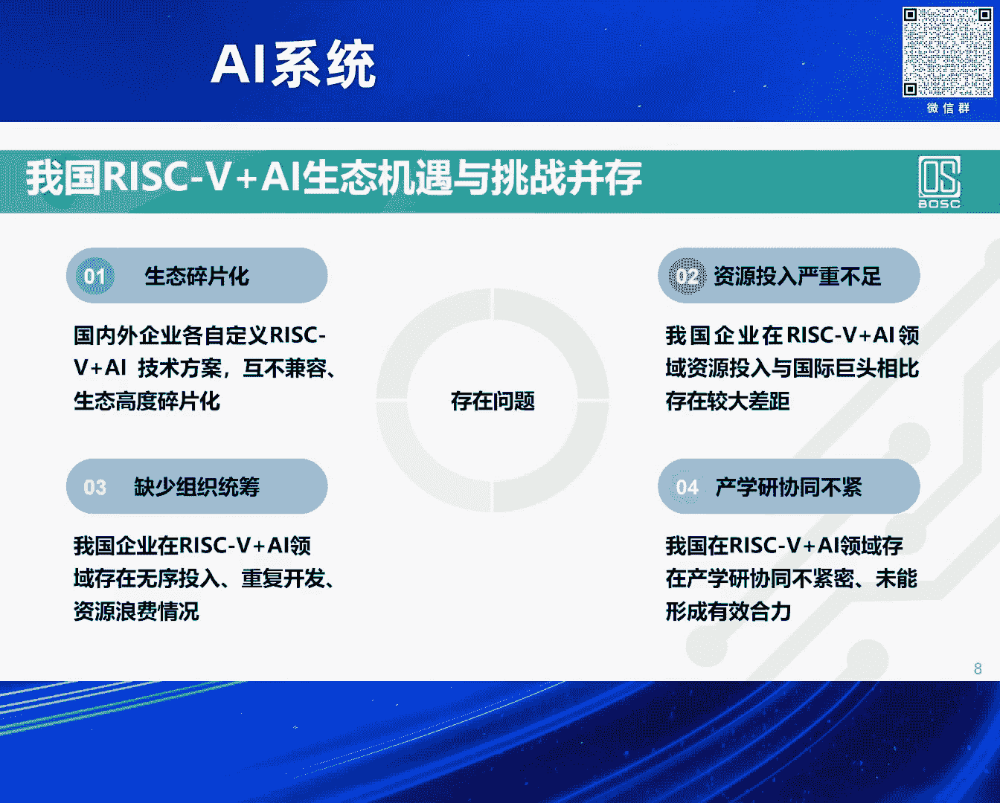
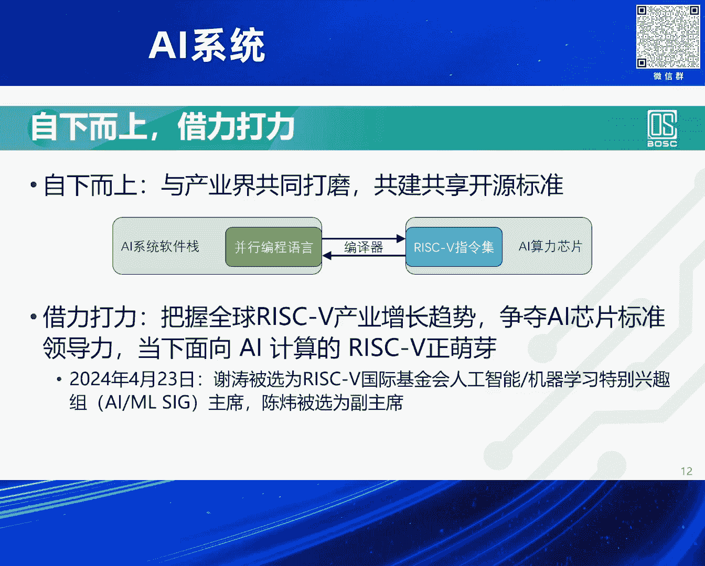
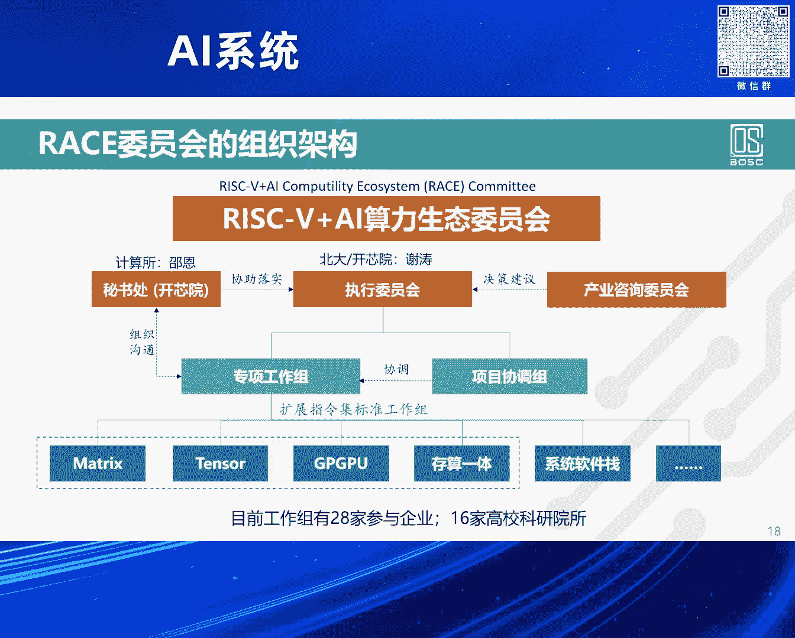
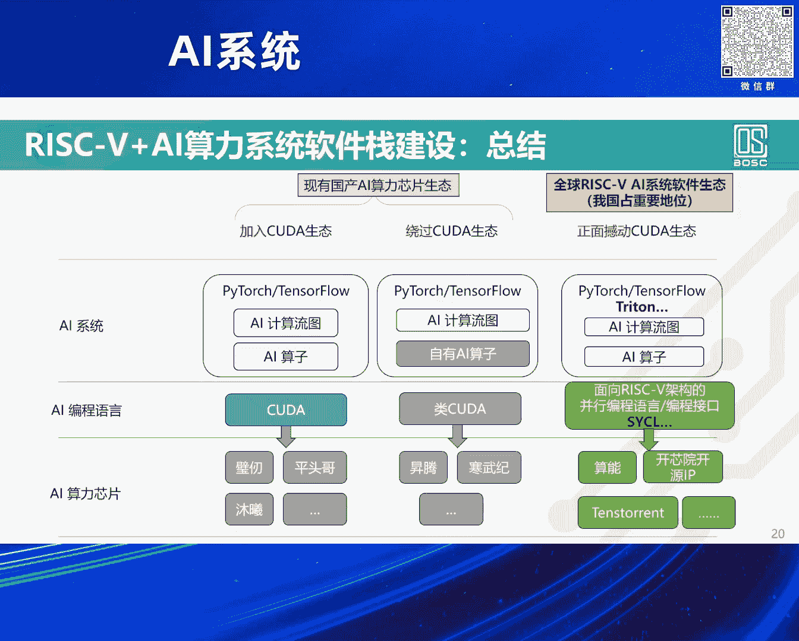

# 2024北京智源大会-AI系统---P8-RISC-V-AI算力系统软件栈建设-谢-涛---智源社区---BV1DS411w7EG

在本节课中，我们将学习RISC-V架构如何与AI算力结合，共同构建开放、繁荣的系统软件生态。我们将探讨当前AI芯片生态的挑战、RISC-V带来的机遇，以及构建统一软件栈的战略思路。

## 概述：AI算力生态的现状与挑战

当前，高性能AI算力芯片的获取面临困难，很大程度上需要依赖国产AI芯片的发展。国产芯片在性能等方面表现不错，但面临一个主要挑战是CUDA软件生态的壁垒。

CUDA生态由英伟达于2006年发起，在高校和产业界投入巨大。特别是近年来，CUDA开发者数量从2020年的180万激增到今年年初新闻报道的450万。

CUDA开发者指的是使用CUDA接口及CUDA C扩展语言来编写程序的开发者。在AI时代，AI算子就是用CUDA编写的。由于长期的生态建设，积累了如此庞大的开发者群体。

一个常见的想法是，让英伟达或其他AI芯片公司的软件工程师写出高度优化的算子实现，然后广大用户直接使用即可。但在当下的大模型时代，很难用一个通用的算子实现来支撑各种场景下的模型部署。

特别是在云端部署大模型时，即使是个位数的百分比算力优化，其带来的绝对成本节省体量也依然巨大。因此，业界有强烈的意愿进行进一步的极致算力优化。

这种优化难以“一劳永逸”，因为它是上下文敏感的。优化可能需要针对特定的芯片、甚至同一公司的特定代次芯片进行调整。另一个上下文是上层用户的输入和使用场景，这也会影响哪个算子实现能提供最佳的优化效果。这就是为什么需要450万CUDA开发者的原因。

## CUDA生态的发展策略与局限

观察英伟达CUDA软件生态的发展，可以发现一个策略思路。首先，其根基是闭源的，且只服务于自家的英伟达芯片。其次，通过自2006年，特别是大模型时代以来的投入，极大地增加了CUDA开发者的数量，使得整个生态向其靠拢。

为了应对当前生态的燃眉之急，一个常见做法是兼容CUDA。但兼容CUDA也带来各种限制，例如被其牵着鼻子走。新一代CUDA接口的发布可能最有利于英伟达下一代芯片，从而将竞争对手甩开数年。

从云端到终端，云端算力优化有极大的极致优化需求，因此拥有庞大的CUDA开发者。这有点像“城市包围农村”的策略，先攻克云端（城市）的高要求场景，再自然延伸到对算力优化要求相对较低的终端（农村）场景。

另一个策略是“人海战术”。由于英伟达CUDA底层越接近芯片越闭源，很难单纯依靠工具创新来覆盖所有长尾场景。因此，它采用了前期建设庞大开发者生态的策略。

## 国产AI芯片生态的挑战

反观国内，国产AI芯片公司中，有一部分选择兼容CUDA以解燃眉之急。除此之外，也有其他技术路线。但这导致了投入严重不足、碎片化且各自为政的局面，整体上难以形成强大的生态竞争力。

我们思考的问题是，除了兼容CUDA解决眼前问题，长远来看仍需发展。不仅是我们国家，全世界除英伟达外的公司都在思考如何不被单一厂商绑定。

纵观历史，当一家公司以闭源方式占据生态领导地位时，很难有第二家闭源生态能撼动它。但我们看到过用开源方式撼动闭源主导者的例子。例如早期的Linux撼动Windows操作系统，以及更近期由谷歌牵头的、对应多种硬件的安卓开放系统，挑战了只对应自家硬件的苹果iOS。

## RISC-V带来的新机遇

在这个大背景下，近年出现了一个具体的机会，那就是RISC-V。RISC-V是一个开放的指令集架构，由全球社区共同建设。

在大模型时代，AI算力需求也呈现出碎片化的特点，极度需要定制化来满足各种场景的需求，特别是在AIoT场景。因此，不仅是谷歌、Meta、特斯拉等巨头，一系列初创公司也在这个方向上投入并产出有竞争力的AI芯片产品。

我国利用RISC-V做AI芯片的企业也开始兴起。但同样面临机遇与挑战：生态碎片化问题自然继承了此前非CUDA路线国产芯片的困境；资源投入依然严重不足；缺乏统一组织统筹；产学研协同不够紧密。

我们看到很多产业联盟将公司聚集起来，希望形成标准让大家遵循。这个团结大家的出发点很好，但在执行上很难。因为联盟成员是友商也是竞品，制定标准时容易出现各家都加入有利于自己产品、不利于友商的条款，最终形成的可能是一个大杂烩式的“共识”，没有一家公司会真正遵循。另一种情况是“出工不出力”，联盟流于形式，无法凝聚真正的力量。

## RISC-V+AI的破局思路

那么，RISC-V加AI为什么有可能解决前面提到的、团结大家时实操上的困难呢？

首先，我们团结的目标不只是国内的一批企业或产学研机构，而是瞄准国际。目标是推动形成国内共识的RISC-V AI指令集扩展，并将其作为候选提案推向RISC-V国际基金会，最终成为国际标准。

成为国际标准的好处在于，整个国际开源社区（如LLVM）以及AI框架社区，自然会进行“上游”支持。这意味着开源软件系统的每次换代更新，都会自然地支持好你的指令集。这是一个巨大的福利，即我们不仅是自己团结产出，更是借力国际生态。

这是一个自下而上的思路。之前提到的“只利己、不利他”的方案不可能成为国际标准。为什么不真心合作，创造一个多赢的局面呢？这是一个重要的出发点和抓手。

我们以开源的RISC-V指令集为根，各家公司都可以基于此指令集进行定制。当然，如果你偏离了指令集标准，就需要自己投入软件工程师做适配。但比起原先各家都需要投入大量软件工程师（通常占芯片公司工程师的2/3）来构建整个系统软件栈，采用RISC-V方式可以极大降低这方面的投入。

这个策略有点像“农村包围城市”。在AIoT时代，我们先在终端侧做好定制化的芯片设计、指令集扩展和系统软件栈研发，支撑好端侧算力。待生态成熟后，再“包围”对算力优化有极致需求的云端市场。

我们并非要凭空在短时间内孕育出数百万使用RISC-V AI软件栈的开发者。在大模型时代，软件工程领域本身也受到冲击，许多相对低级的编程任务可以被自动化工具取代，但对中高级人才的需求依然很大。恰恰，这些主力的工具创新能力来自于国际开源社区。国内系统软件高端人才相对缺乏，因此我们必须善于“借力”。

宏观上有两大借力：一是借力RISC-V国际标准，吸引国际系统软件栈的支持；二是直接参与并借力方兴未艾的国际开源社区，例如已有的Triton、Intel主导的SYCL等优秀工作。

同时，我们也会在中间层，针对RISC-V的AI指令集扩展（如矩阵、张量扩展），定义一个介于Triton和SYCL之间的、中等抽象程度的算子接口及实现。

## 具体工作与进展

第一部分工作是以指令集共识为标准，在国际上推动，使国际开源社区支持RISC-V AI指令集扩展。今年4月，RISC-V国际基金会技术指导委员会主席官宣，将人工智能与机器学习列为2024年三大顶级战略优先级方向之首，这为RISC-V赶超ARM和x86带来了巨大机会。

RISC-V在技术上并非与ARM和x86有根本不同，但其开源开放的机制降低了创新门槛。以前，涉及CPU与协处理器协同设计的AI芯片只能由Intel、ARM、英伟达等大厂完成。RISC-V+AI使得更多中小公司和团队能够参与创新。其高度的可定制性和模块化设计，允许大家根据需求搭积木式地组合指令集扩展。其生态发展也秉承了开源协作的“正义”理念，发展速度特别快。

第二部分是关于系统软件栈的构建。Triton提供了更高的抽象，支持快速敏捷开发和迭代，其性能随着编译优化等生态发展越来越好。SYCL由Intel主导，它比更接近硬件的OpenCL抽象程度更高，编程更友好，性能也更好，其目标是对标并替代CUDA的抽象层次。我们的系统软件栈也会对SYCL提供支持。

在此背景下，今年3月底，依托北京开源芯片研究院作为发起单位，联合了一批相关高校、科研院所和企业，成立了“RISC-V+AI算力生态委员会”。我们已经开展了数月的工作，与众多企业交流迭代，并成立了多个工作组，目标是指令集标准或架构扩展标准，包括矩阵、张量、GPGPU、存算一体以及其上的系统软件栈。

## 总结

本节课我们一起学习了构建开放AI算力生态的路径。

现有的国产AI算力芯片软件生态主要有两种选择：一是“打不过就加入”，即加入CUDA生态；二是“自己干”，走闭源独立路线。英伟达从2006年干到现在积累了450万开发者，如果各自为战，我们需要对竞争的长期性和周期性有充分思想准备。

我们现在要推动的，是利用RISC-V+AI全球生态高速发展的机遇，特别是大模型时代带来的机会，构建一个能够撼动CUDA生态的系统软件栈。我们以开源指令集为根，借力国际标准与社区，采取“农村包围城市”的策略，旨在最终形成一个开放、繁荣、多赢的新生态。

---
**本节课中我们一起学习了：**
1.  **当前AI算力生态对CUDA的依赖及其挑战。**
2.  **闭源生态的局限性及开源生态的历史成功案例。**
3.  **RISC-V开放指令集为AI芯片带来的创新机遇。**
4.  **构建RISC-V+AI统一软件栈的战略思路与具体路径。**
5.  **通过国际标准与开源社区“借力”的重要性。**