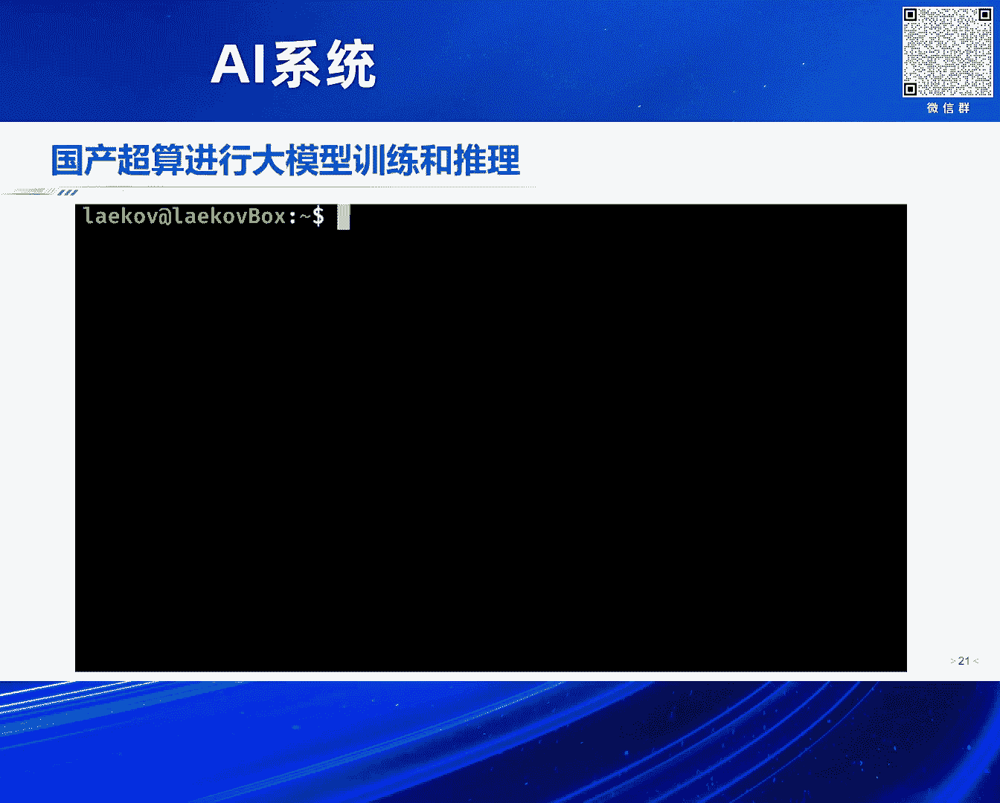
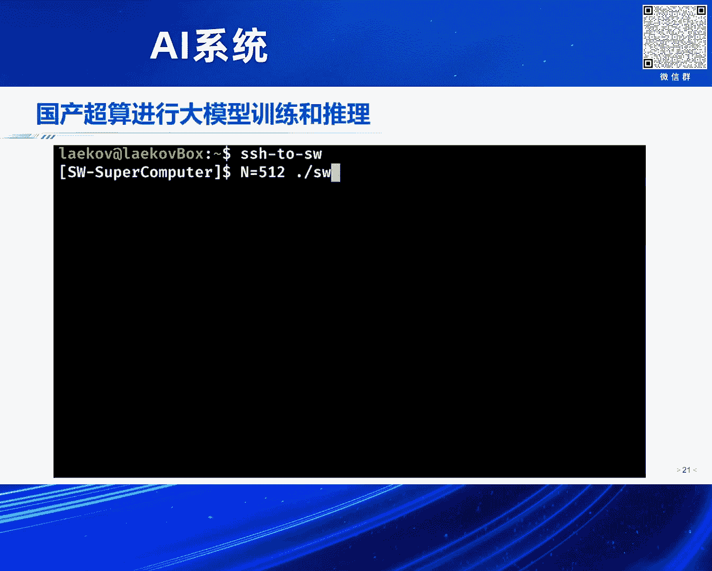
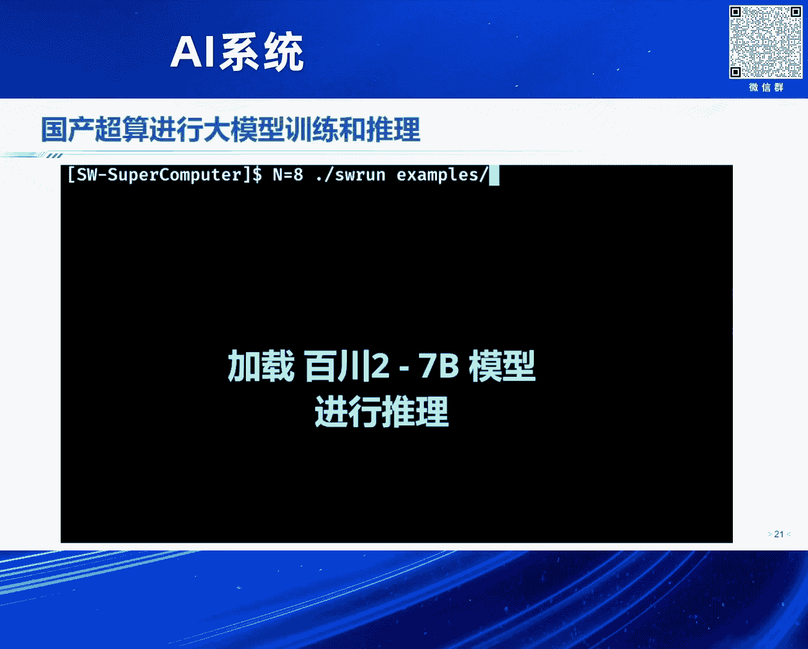

# 2024北京智源大会-AI系统---P9-八卦炉-面向国产智能算力核心基础软件-翟季冬---智源社区---BV1DS411w7EG

## 课程概述
在本节课中，我们将学习面向国产智能算力核心基础软件的关键挑战与解决方案。课程内容基于翟季冬教授在2024北京智源大会上的报告，将探讨如何构建和完善国产AI芯片的软件生态，以充分发挥其计算潜力。

---

## 背景与挑战
上一节我们概述了课程目标，本节中我们来看看当前智能算力发展的背景与核心挑战。

基于Transformer的大模型对算力产生了爆发式需求。这种需求贯穿模型研发、训练、微调到推理的整个流程。目前，算力开销是这波大模型产业的主要成本。在模型训练完成后，部署和推理的成本也主要由算力开销构成。

目前，在公开渠道仍难以获得国外的高端算力。中国正在大力发展国产算力，许多公司参与其中。然而，当我们实际使用国产算力时，仍存在一些需要改进的地方。其中一个核心挑战在于底层的软件生态。

一个有趣的现象是，尽管大模型企业需要大量算力，但许多已建成的计算中心其算力资源利用率并不充分。这中间存在一个巨大的鸿沟。其核心原因在于底层的算力软件生态尚不完善。

以下是国产算力软件生态面临的具体挑战：
*   与英伟达成熟的CUDA生态相比，国产芯片的软件栈在深度优化、兼容性和易用性上存在差距。
*   即使模型架构主流是Transformer，各家也会进行改进，架构本身也在不断变化。这使得在国产卡上高效运行各种模型变得更具挑战性。
*   非计算机专业的研究人员在选择算力平台时，由于软件生态的成熟度，往往更倾向于选择英伟达的硬件。

---

## 智能算力的关键软件栈
上一节我们讨论了国产算力面临的生态挑战，本节中我们来看看构成智能算力的十个关键软件层次。

智能算力的高效运行依赖于一个完整的软件栈。我们可以从下往上理解这十个关键层次。

以下是构成智能算力核心的十个软件层次：
1.  **调度器**：负责在大型计算中心中，高效调度和管理成千上万的加速卡资源。
2.  **内存管理**：为模型的训练和推理提供高效的内存分配与管理机制。
3.  **容错系统**：确保在大规模模型训练过程中，系统能够从硬件或软件故障中快速恢复。
4.  **并行文件系统**：支持训练和微调过程中高速读取海量数据。
5.  **编程语言**：为芯片提供高效、易用的编程接口。例如，英伟达有CUDA。
6.  **编译器**：将高级算子或计算图高效地编译并优化到底层硬件指令，是发挥硬件性能的关键一环。
7.  **算子库**：提供针对常见计算操作（如矩阵乘法、卷积）的高度优化实现。算子库的实现通常需要编译器的强力支撑。
8.  **通信库**：当计算任务扩展到多机多卡时，高效的节点间通信变得至关重要。
9.  **编程框架**：整合以上组件，为用户提供友好的编程接口。例如PyTorch、TensorFlow。
10. **并行策略**：在大规模训练或推理场景下，设计高效的模型并行、数据并行等策略。

---

## 实验室的研究视角与工作
上一节我们梳理了智能算力的软件栈，本节中我们来看看从研究视角如何切入，并介绍相关实践工作。

我们的研究从两个核心层面入手：**编译器**和**并行**。编译器是连接上层应用与底层国产芯片、发挥硬件极致性能的关键。并行技术则是应对大模型（如MOE模型）在单机多卡、百卡千卡乃至万卡规模下训练与推理挑战的核心。

我们可以在PyTorch框架下对这两层进行改造，使用户无需修改业务代码，即可充分发挥底层算力性能。

以下是我们在几个关键方向上的具体工作：

### 1. 编程语言：FreeTensor
针对一类**不规则的人工智能模型**，我们开发了领域特定编程语言FreeTensor。这类模型包括图神经网络、处理长序列的算法等，其计算模式并非规整的矩阵运算。
我们在PyTorch中进行了扩展，实现了显著的性能优化。与PyTorch原生实现相比，在英伟达平台上获得了上百倍的性能提升。该项目已在GitHub开源。

### 2. 编译器：iNet
为了挖掘更深层次的编译优化潜力，我们提出了iNet系统。传统优化通常在**计算图层**或**算子层**单独进行。iNet的核心创新在于将这两层优化打通，进行联合优化，从而发掘出更多的优化机会。
在英伟达A100上测试表明，相较于TensorFlow、TensorRT等工具，iNet在经典卷积模型和Transformer类模型上能带来最高近两倍的性能提升。

### 3. 大模型推理优化：FastDecode
大语言模型推理是**内存带宽密集型**任务。模型参数和中间生成的KV Cache会占用大量显存。FastDecode系统的核心思想是将模型参数与KV Cache分离，并将KV Cache移至CPU内存。
通过流水线并行设计，系统能同时发挥CPU和GPU的计算能力。这样做的好处是，Batch Size不再受GPU显存限制，并且可以整合CPU与GPU的内存带宽来共同提升吞吐量。实验显示，与vLLM等系统相比，FastDecode能将Batch Size提升百倍，GPU吞吐量提升1.8到14倍。

### 4. 大模型训练与MOE并行：FastMoE / SmartMoE
我们开发并持续维护了FastMoE系统，用于支持混合专家模型的并行训练。用户在PyTorch中添加一行代码，系统即可自动处理各种并行策略。该系统支撑了北京智源“悟道”大模型的训练。
后续的优化工作如FastMoE-on-POP和SmartMoE，进一步提升了性能，相较于DeepSpeed的MoE系统，可获得高达十几倍的加速。

---

## 国产算力实践：八卦炉系统
上一节我们介绍了在通用平台上的优化工作，本节中我们来看看如何将这些技术应用于国产算力平台。

我们将上述编译、内存管理、通信等技术整合，移植到国产算力平台，构建了名为“**八卦炉**”的软件系统。该系统部署在青岛的一个纯国产超算平台上，该平台拥有约10万个国产加速卡节点，算力规模相当于1.8万块英伟达A100。
“八卦炉”系统从底层编译器、内存管理到多机通信进行了全栈优化，使得PyTorch代码能够在该国产系统上高效运行。我们利用该系统成功训练了百万亿参数规模的模型，并支持了百川、LLaMA等主流大模型在该平台上的训练与推理。
国产超算平台由国家投资建设，使用成本相对较低。在此类平台上进行大模型训练或推理，相比租赁英伟达A100/H100，可以显著降低成本。

---

## 课程总结
本节课中，我们一起学习了面向国产智能算力核心基础软件的重要性与构建路径。

我们探讨了当前国产算力在软件生态上面临的挑战，系统性地介绍了智能算力所需的十个关键软件层次。通过研究团队在编程语言、编译器、大模型推理与训练优化等方面的具体工作，我们看到了通过软件创新大幅提升算力效率的潜力。最后，通过“八卦炉”系统的实践案例，我们了解到将先进软件技术移植到国产算力平台，并支撑大规模AI应用的可行性。

构建完善的国产智能算力软件生态，对于降低大模型在不同AI芯片上的迁移成本、推动中国人工智能产业发展具有至关重要的意义。这需要产、学、研各界在底层基础软件领域持续投入和共同努力。