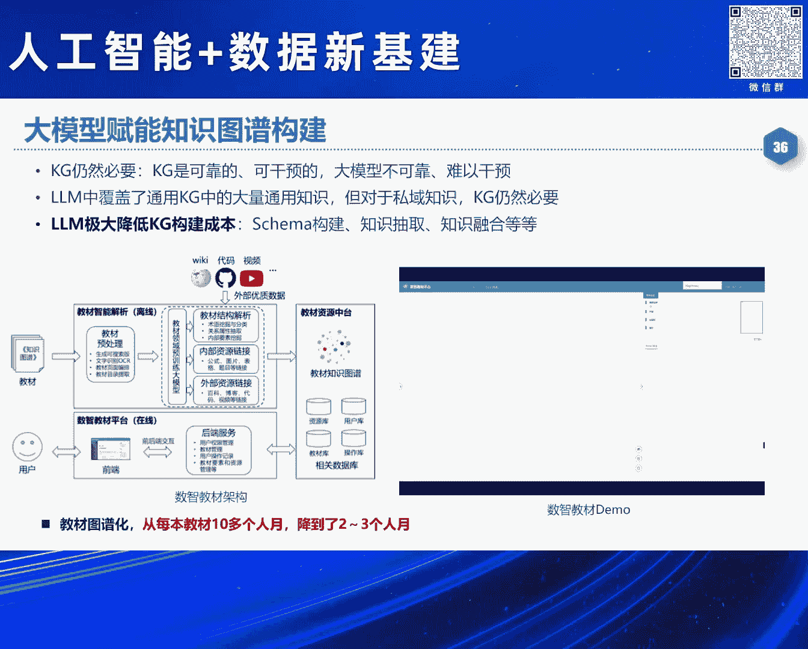
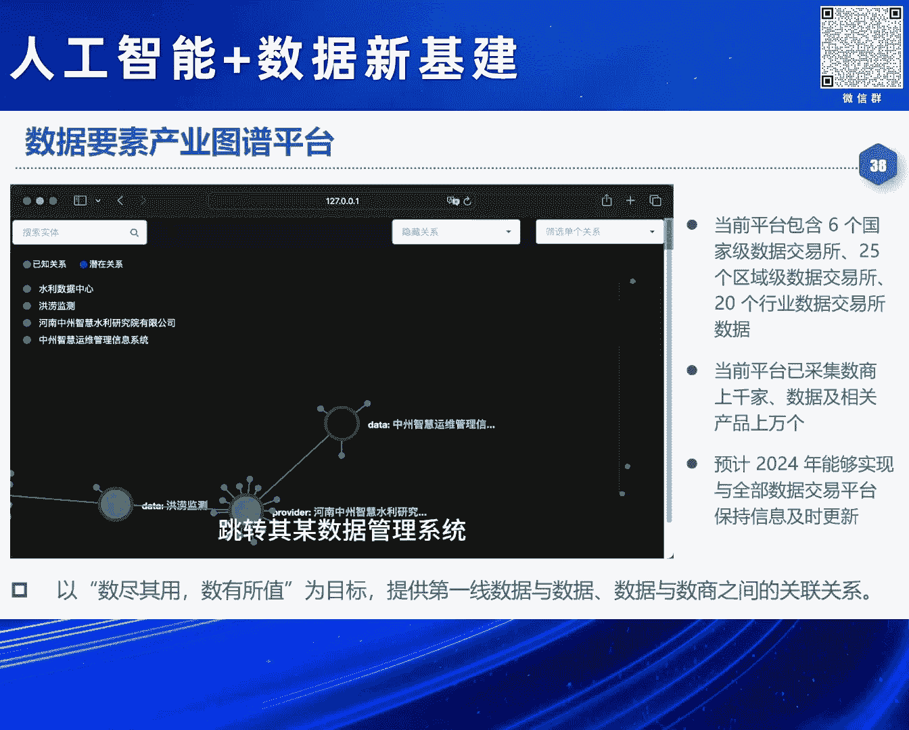
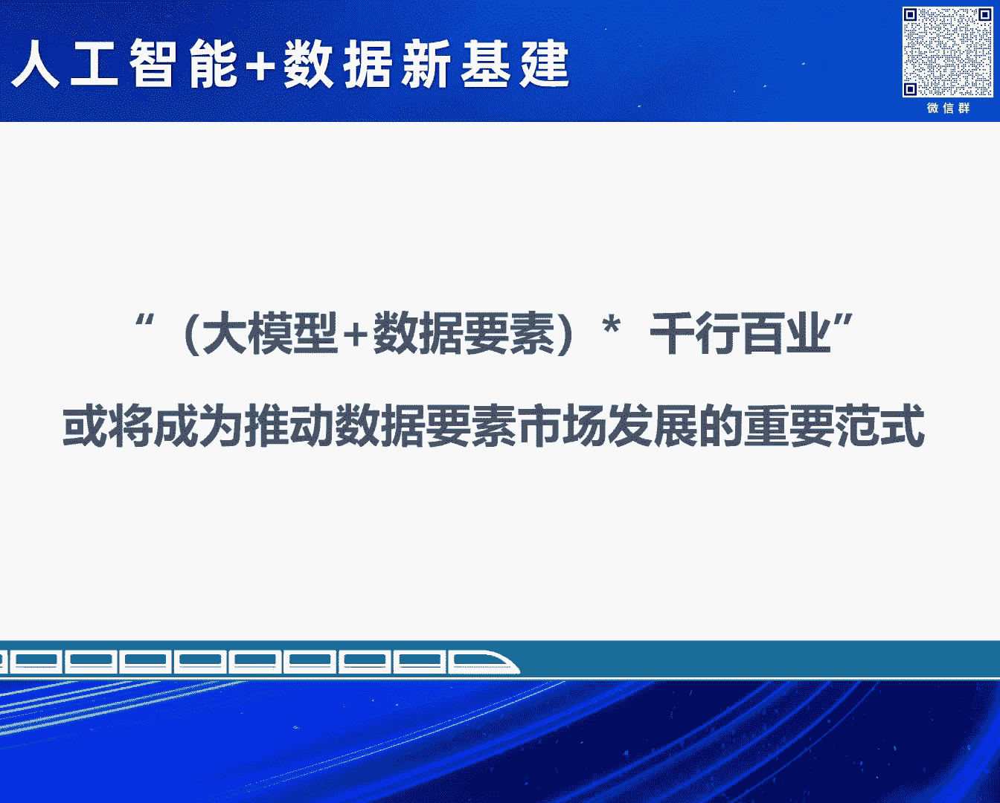

# 2024北京智源大会-人工智能-数据新基建---P10-大模型助力数据要素价值变现-肖仰华---智源社区---BV1qx4y14735
## 课程编号：P10

在本节课中，我们将学习大模型如何作为智能引擎，解决数据要素价值变现过程中的核心挑战。我们将探讨数据要素的新特征、当前面临的痛点，以及大模型如何凭借其认知与操控能力，为数据价值释放提供全新的、高效的路径。

---

### 数据要素时代的新特征与挑战

上一节我们介绍了课程的主题，本节中我们来看看数据要素在新时代下呈现出哪些新特征，以及这些特征带来了哪些挑战。

数据已成为新型生产要素，并对土地、劳动力、资本等其他要素起到越来越重要的支配作用。随着数字经济的增长，数据要素价值变现的需求日益迫切，进程也在加速。

然而，当前的理论与方法在实践过程中存在诸多堵点和痛点。从数据开放时的合规担忧，到数据融合与治理的复杂与高成本，再到数据应用多停留在表层分析，整个价值变现链条仍不顺畅。

究其根本，数据要素价值变现仍主要依赖人力，而数据本身日益复杂，人力已难以应对。这背后有几个重要原因：

以下是数据价值变现面临的核心挑战：

1.  **系统与数据日益复杂**：现代社会是人、机、物多元融合的复杂系统。制造业系统动辄涉及上万张关联表单，其复杂的“中国式表头”对传统方法构成巨大挑战，几乎没有人类专家能全盘理解。
2.  **数据内涵与特性发生显著变化**：数据从“符号化记录”变为“资源”，再变为“生产要素、产品、资产”。这带来了新的特性：
    *   **持续流动性**：数据需在生产、分配、流通、消费各环节流动才能释放价值，这对全链条自动化、智能化处理技术提出了高要求。
    *   **权属与安全可控性难题**：数据在流动中与多个主体交互，其权属确定和安全保障变得异常复杂。
    *   **开放的复杂生态环境**：数据需在异构、多变的系统中交互，对统一、标准化、可互操作的数据管理技术提出了要求。
    *   **动态增值过程**：数据价值在汇聚、分析、质量提升、关联融合等动态处理中持续创造，但现有方法很少为此设计。

当前数据科学的理论和方法远不足以支撑数据要素的价值变现。除了制度与基建，**技术供给的不足**同样是关键堵点。企业常因技术能力有限或成本过高而却步。

---

### 大模型：数据价值变现的智能新引擎

上一节我们分析了数据价值变现的困境，本节中我们来看看为何大模型有望成为破局的关键。

当数据要素价值变现变得日益困难时，人工智能的最新进展——大模型，可能正是解决问题的答案。大模型本质上利用人类已积累的数据，习得了对复杂世界的建模能力，成为了一个**海量的知识容器**。

更重要的是，大模型正在成为**模拟人类认知能力的新引擎**。它不仅能理解语言和常识，还在概念理解、问题求解、规划、价值判断等方面展现出强大能力。随着大模型成为各类智能体（Agent）的“大脑”，它有望实现与复杂世界的自主、自适应交互。

正因为具备了上述能力，大模型为数据要素带来了**全面的认知与操控能力**：

以下是具体表现：

1.  **认知数据的能力**：大模型能理解数据库元数据（Schema）中的概念及关系，并能发现数据实例中的逻辑错误，其能力不亚于甚至超过普通人类。
2.  **自主操控数据的能力**：通过强大的规划与工具使用能力，大模型可以自主完成复杂的数据查询、分析与可视化任务。例如，通过自然语言指令“对比上海和北京每年8月的平均温度”，大模型能自动规划并执行数据查找、统计、制表等一系列步骤。

原本由人类专家承担的“理解数据”和“操控数据”的工作，未来可以交给机器。因此，大模型必将成为驱动数据要素价值变现的核心智能引擎。

---

### 大模型应用的实践、挑战与未来展望

上一节我们肯定了大模型的潜力，本节中我们来看看其具体应用实践、面临的挑战以及未来的发展方向。

尽管前景广阔，但大模型在推动数据要素价值变现中仍面临巨大挑战。行业数据用于支撑严肃决策，这要求模型具备丰富的领域知识、复杂决策逻辑、宏观态势研判、精密规划、约束取舍及不确定性推断等能力，而当前大模型在这些方面仍有欠缺。此外，**幻觉问题、领域忠实度、可控性、可解释性以及高昂的成本**都是现实障碍。大模型对行业私域数据中专业、私有化表达的理解也存在鸿沟。

尽管如此，大模型已在诸多实践中展现出巨大价值。它提供了一种**端到端的价值变现路径**：将数据用于炼制行业大模型，再通过插件式组件释放价值，这极大简化了流程。同时，Transformer等架构为实现**统一的多模态数据价值变现**提供了可能。

以下是当前大模型在数据领域的一些关键应用方向：

1.  **智能数据治理**：数据治理代价高昂，且数据错误具有开放性（难以预设）。大模型凭借强大的开放理解能力，能有效清洗和规范不规范数据（如地址信息），并处理语料治理中的困难案例（Hard Case）。
2.  **知识验证与构建**：利用大模型验证知识库的正确性，并驱动知识图谱的自动化构建。例如，从教材中抽取实体关系，可将原本耗时数月的工作大幅缩短。
3.  **自然语言数据访问与分析**：用户可以直接用自然语言查询关系数据库，或驱动智能体（Agent）进行自动化的数据分析与可视化，降低了使用门槛。
4.  **数据智能运维**：实现数据库系统的智能运维，无需依赖传统的专业查询语言。
5.  **释放文档价值**：处理和理解千行百业的非结构化文档，提取其中蕴含的知识与信息。

最后，我们可以用一个简单的公式来总结未来的发展方向：

**`数据要素价值 = 大模型 × (治理好的数据 + 行业知识)`**

未来，我们需要一方面治理好数据、建设高质量数据集，另一方面利用数据炼好行业大模型。随后，大模型的能力又能反哺，让数据变得更好。二者深度融合，在千行百业的应用中不断反馈、验证与迭代，形成协同发展的正向循环。

---

### 课程总结

本节课中，我们一起学习了数据要素价值变现的现状与挑战，探讨了大模型如何凭借其世界建模、知识容器和认知引擎的能力，为这一难题提供智能化的解决方案。我们看到了大模型在数据治理、知识工程、智能分析等方面的具体应用实践，同时也认识到其在领域适应性、可控性和成本方面面临的挑战。最终，我们展望了“大模型+数据要素”深度融合、协同发展的未来路径。