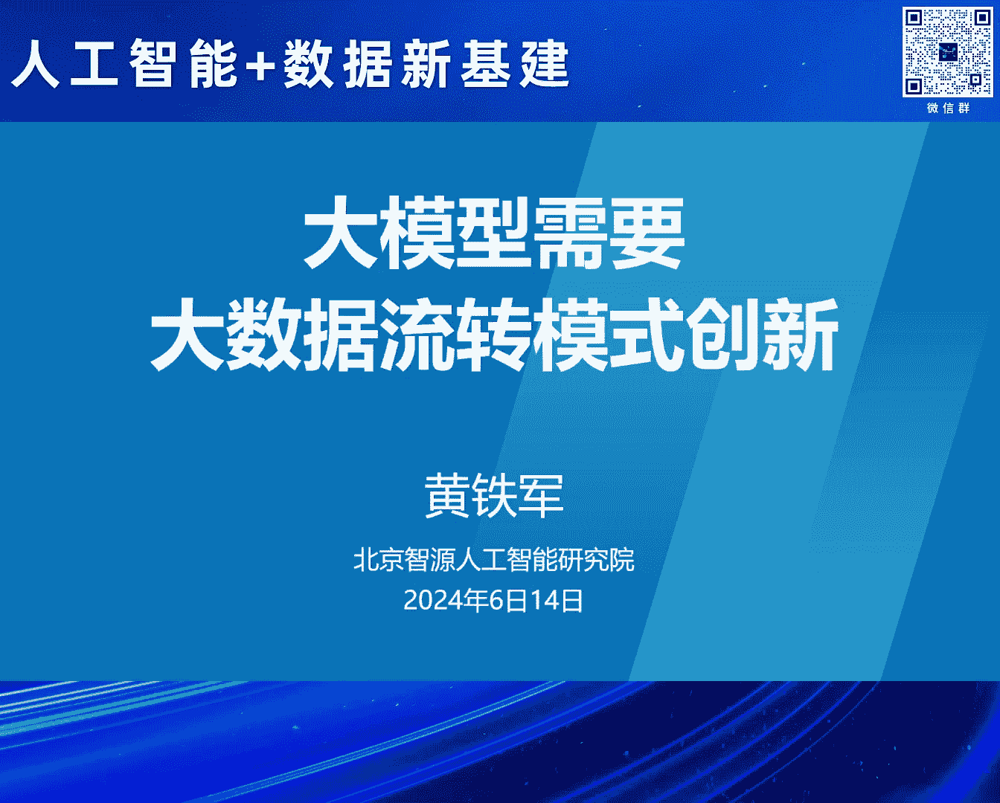
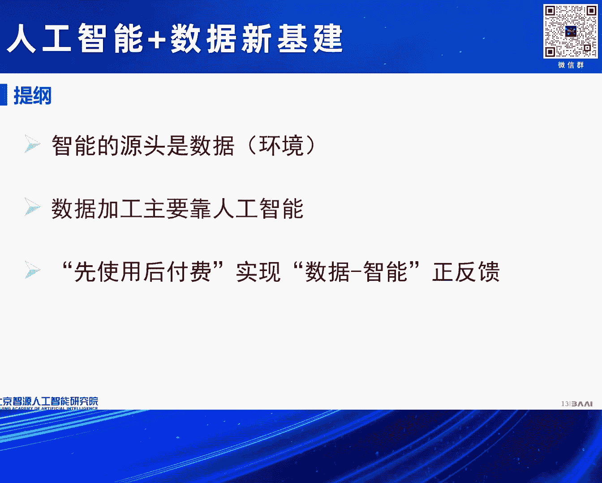
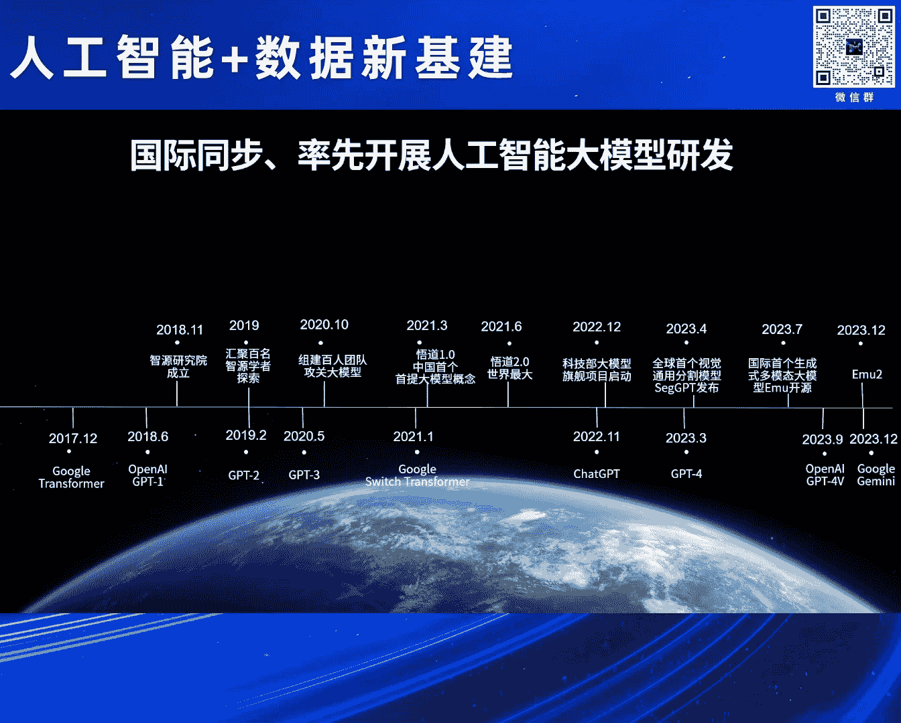
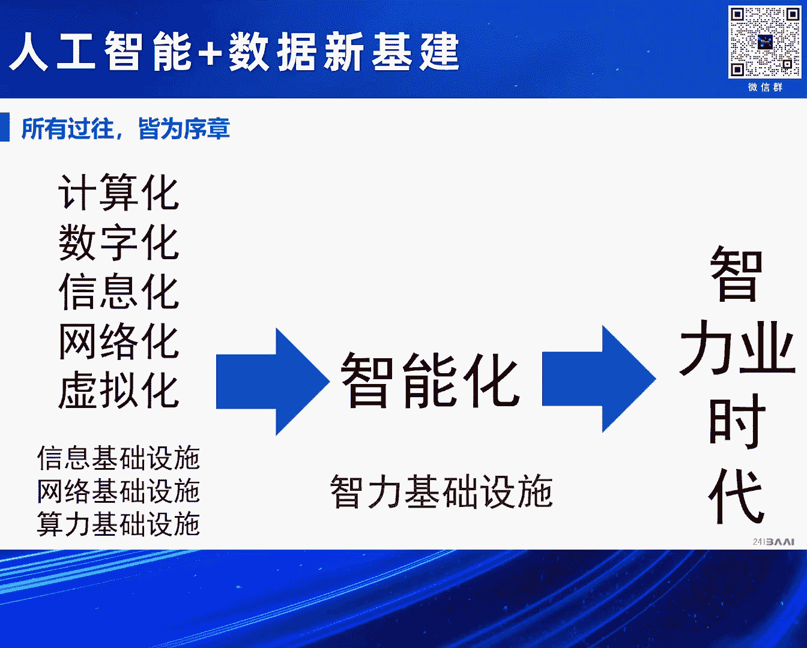

# 2024北京智源大会-人工智能-数据新基建---P2-大模型需要大数据流转模式创新-黄铁军---智源社区---BV1qx4y14735

在本节课中，我们将学习大模型时代下，数据作为智能源头的重要性、数据加工方式的变革，以及如何构建良性的数据流通模式以促进人工智能生态的健康发展。

---

## 智能的源头是数据 📊

上一节我们介绍了人工智能发展的宏观背景，本节中我们来看看智能的根本来源。所有智能，包括人类智能，其源头都是数据。人工智能发展初期，人们曾试图将人类的思维过程转化为算法和规则，或构建知识库，但这并未真正解决智能问题。

第三次人工智能浪潮的核心革命在于“从数据中学习”。经过多年探索，我们认识到真正的智能需要通过人工神经网络对数据进行处理才能产生。智能是主体（如人类或机器）为了适应环境而发展出的能力，而数据正是环境的一种表达。因此，智能本质上是环境和数据的高度凝练与投射。

大模型（如基于Transformer架构的模型）的成功印证了这一点。它们通过海量数据训练，学习数据单元（Token）之间的关系，并将这些关系映射为神经网络的参数。这个过程可以用一个简单的思想来理解：**一个个体（或一个数据单元）的含义，是由它与其他个体之间的关系所定义的**。大模型正是通过计算海量语料中Token的共现关系，从而“理解”了语言及其他模态背后的含义。

**核心公式/概念**：
*   **智能的涌现**：`智能能力 ∝ 数据规模 × 模型规模 × 算力规模`
*   **关系学习**：大模型通过`Transformer`等架构，学习序列中`Token`之间的关联权重，公式化表示为注意力机制：`Attention(Q, K, V) = softmax(QK^T/√d_k)V`

所以，人工智能的能力并非由研究者设计出来，而是从数据中“提炼”出来的自然规律的体现。随着数据规模、模型规模和算力的持续增长，这种能力还会不断增强。

---

## 数据加工：从人力主导到智能主导 🏭

既然智能源于数据，那么高质量的数据就至关重要。错误或低质的数据会导致模型产生偏见或错误，且后续纠正代价高昂。因此，数据需要经过清洗、去噪、格式标准化、内容筛选等多道加工工序。

过去，这些工作主要依赖人力，成本高、效率低，且对人员专业能力要求日益提升。然而，在大模型时代，数据加工的模式正在发生根本性变革。

以下是当前数据加工面临的核心挑战与转变：

*   **挑战**：数据量巨大，质量要求高，涉及价值观与安全审核，单纯依靠人力难以为继。
*   **转变**：利用人工智能，特别是大模型智能体（Agent），来替代大部分人工数据处理工作。
*   **模式**：构建由**智能体（Agent）主导的自动化数据产线**。用当前的AI处理当前的数据，训练出更优的模型，进而催生更高效的数据处理Agent，形成迭代升级的良性循环。
*   **展望**：预计未来90%以上的通用数据处理工作可由AI完成，人类则专注于更高层的审核、价值观对齐与流程设计。

这种智能数据产线模式，将是未来数据基础设施的核心组成部分，能极大提升数据处理的效率与规模。

---

## 构建数据与智能的正反馈循环 🔄

数据滋养智能，智能反哺数据加工，二者若能形成正反馈，将极大加速人工智能的发展。然而，当前数据流通领域存在一个关键障碍：将数据视为需预先高价购买的“物理资产”的交易模式。

这种“先付费，后使用”的模式，给尚未盈利的研发机构和企业带来了沉重的初始成本压力，抑制了创新活力，阻碍了生态形成。数据作为数字资产，具有可复制、可多次使用的特性，其流通模式应区别于物理商品。

因此，我们需要创新数据流转的体制机制。一个更合理的思路是建立“**先使用，后付费**”的收益分享模式。

以下是实现这一模式的关键步骤构想：

1.  **数据确权**：明确数据集的加工者与所有者，这是流通的基础。
2.  **使用记录**：模型训练方需清晰记录所使用的数据来源与数量。
3.  **收益挂钩**：在模型未产生商业收益时，数据方不收取费用；当模型获得商业成功时，再根据事先约定的规则，按数据使用比例向数据方分享收益。
4.  **技术保障**：需要配套的监管平台与技术（如区块链、智能合约）来确保确权、计量、计费和分成的公平、透明与可信。

通过构建这样的数据流通新模式，可以降低创新门槛，激励数据开放与共享，最终驱动“数据飞轮”高速旋转，让智能时代真正加速到来。

---

## 总结 📝

本节课中我们一起学习了三个核心观点：
1.  **智能的源头是数据**：大模型的能力是从海量数据中学习并提炼出来的，其智能水平随数据与模型规模增长而涌现。
2.  **数据加工迈向智能化**：未来数据产线将由AI智能体主导，自动化处理大部分工作，人类进行关键监督与设计。
3.  **需要创新的数据流通模式**：建立“先使用，后付费”的收益分享机制，打破数据流通壁垒，构建数据与智能相互促进的正反馈循环，是建设国家“智力基础设施”的关键。

最终，我们的目标是进入一个由“智力”驱动社会发展的新时代，如同电力解放了体力劳动，人工智能将解放并增强人类的智力劳动。