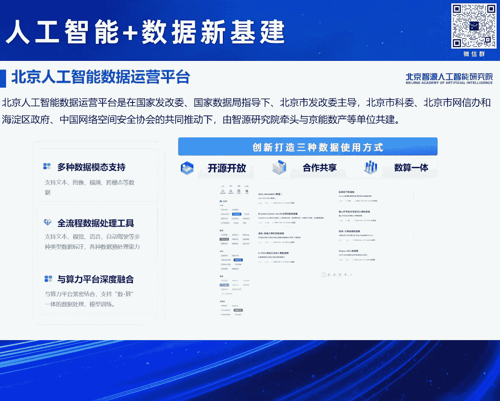
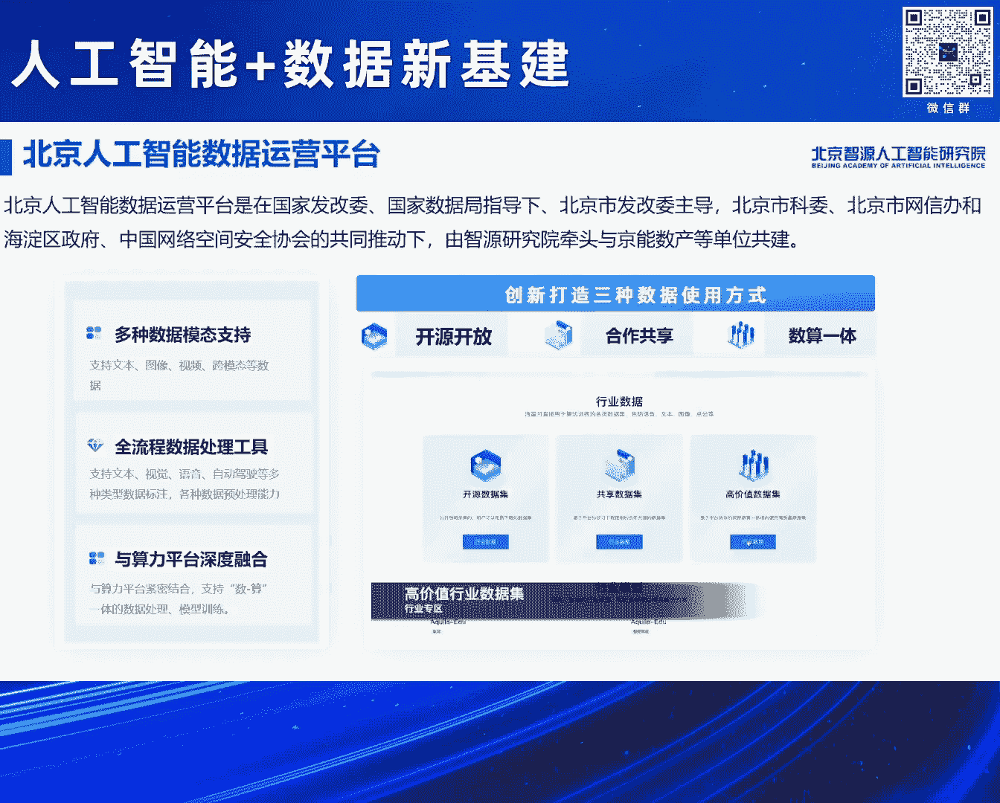
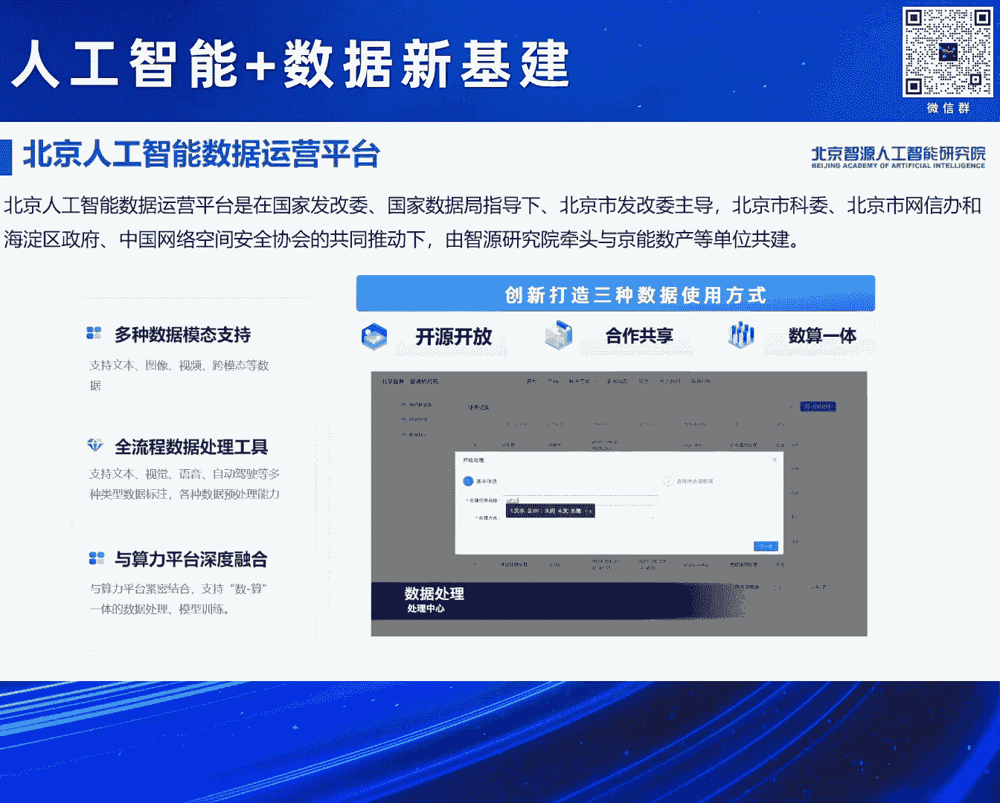
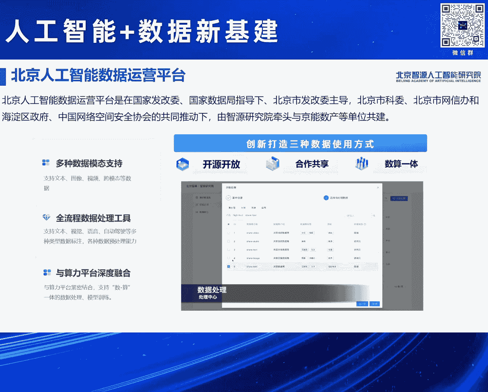
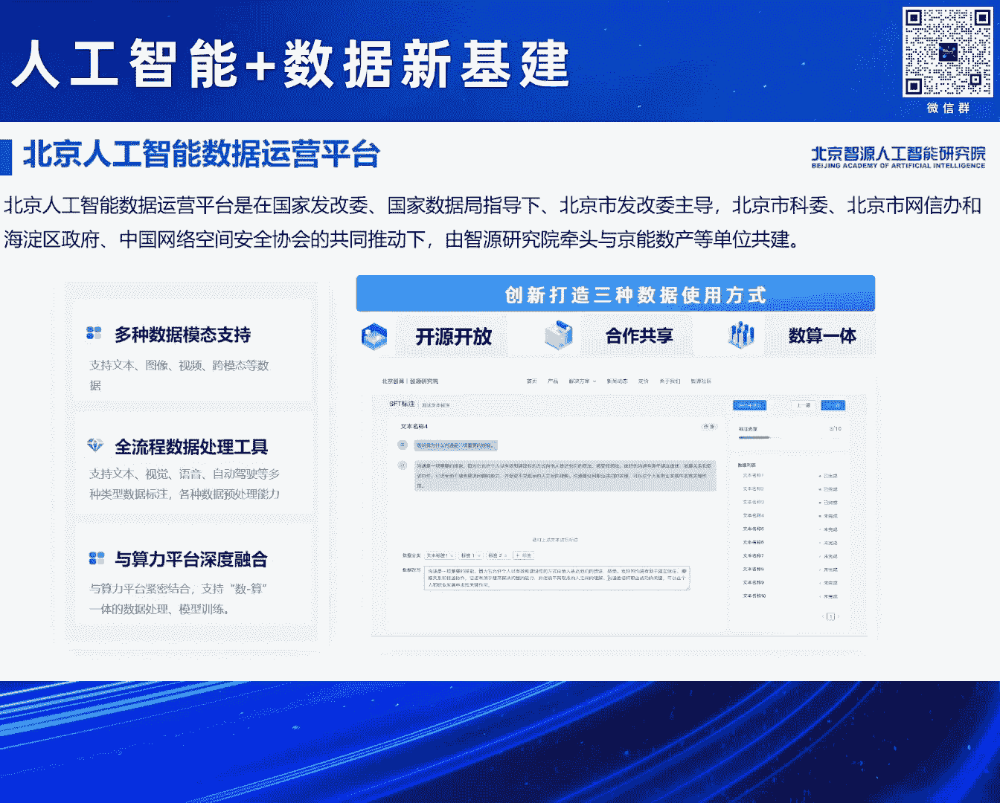
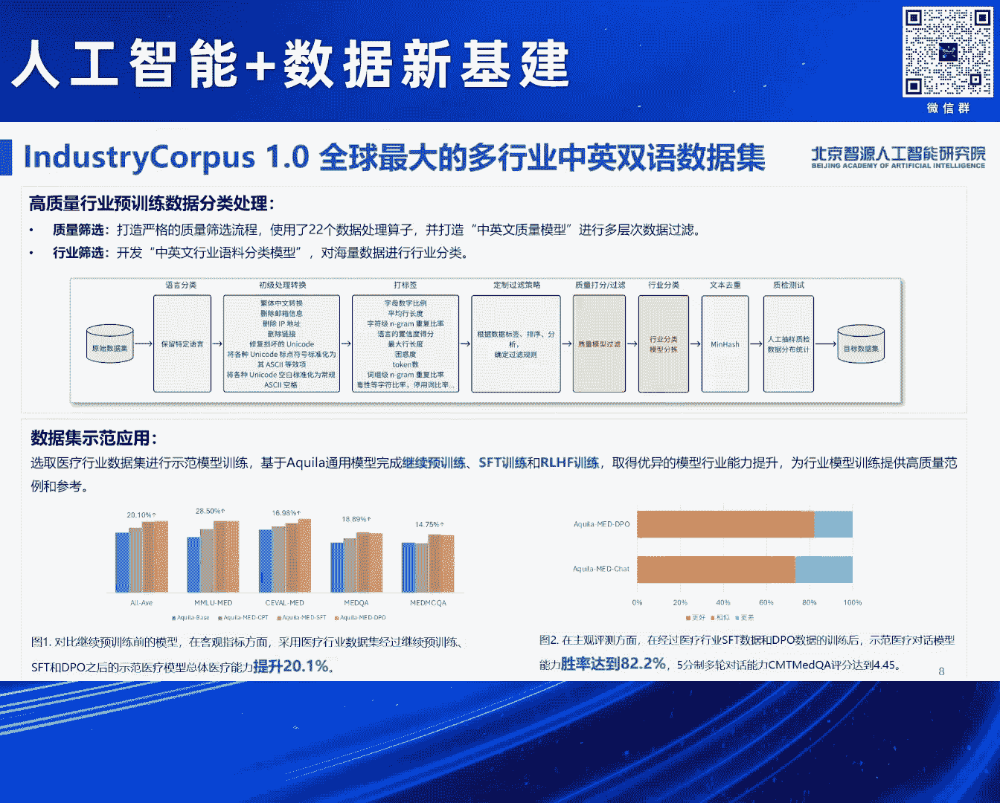
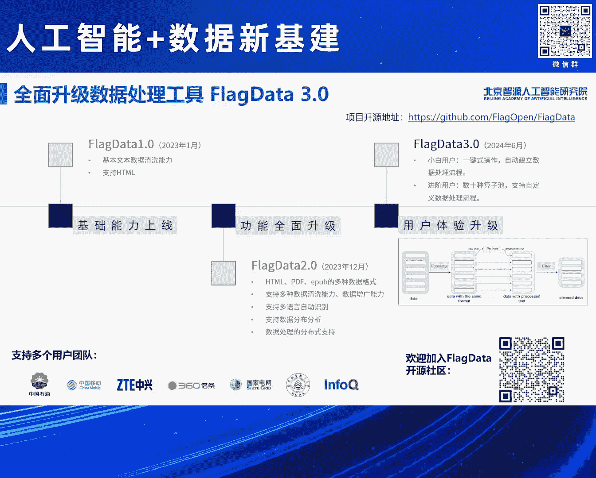

# 2024北京智源大会-人工智能-数据新基建---P3-介绍-北京人工智能数据运营平台--林咏华----智源社区---BV1qx4y14735

在本节课中，我们将学习北京人工智能数据运营平台的重要性、其旨在解决的核心问题，以及平台提供的具体数据集、工具和使用模式。我们将了解高质量数据对于人工智能，特别是大模型发展的关键作用。

## 概述：数据是人工智能的基石

在过去的十几年人工智能发展中，三个数据集尤为重要。2007年开始筹建、2012年发布的ImageNet，直接推动了AlexNet、ResNet等影响后续所有计算机视觉深度学习模型的诞生。2007年开始构建的全球最大网页数据集Common Crawl，为语言模型的快速迭代奠定了基础。2021年启动的LAION数据集（包含数十亿图文对），催生了CLIP等跨模态图文模型，并推动了如今蓬勃发展的多模态研究。

这些由国外非营利机构长期积累的数据集，是过去十几年人工智能，尤其是当前大模型快速迭代不可或缺的基础。然而，仅有这些数据集是远远不够的。

## 人工智能数据面临的三大难题

在构建和使用人工智能训练数据时，我们主要面临三大难题：**数据量**、**数据质量**和**数据使用**。

以下是关于数据量问题的具体分析：

*   **中文数据占比低**：虽然Common Crawl数据集每月新增数十亿网页，但中文互联网用户全球占比接近20%，而国内中文网站的全球占比却非常低。
*   **数据孤岛问题**：用户日常使用的APP（如微信、抖音）中存在大量数据，但这些数据彼此隔离，形成了数据孤岛。
*   **多模态与行业数据稀缺**：在新兴的视频、3D等多模态数据领域，以及各垂直行业内部，高质量数据更是十分欠缺。

除了数据量，数据质量也存在诸多问题。此外，数据使用始终绕不开**数据版权**和**数据安全**的挑战。

面对这三大问题，我们不能等待所有问题都解决后才启动人工智能大模型的发展。因此，智源研究院在过去几年持续积累和探索，试图通过汇聚数据集来帮助产业积累数据量，通过打造数据处理工具来提升数据质量，并通过发布数据平台来帮助解决数据使用问题。

## 北京人工智能数据运营平台

北京人工智能数据运营平台由北京市科委、海淀区政府、中国网络空间安全协会共同推动，由智源研究院和金融数产共同建设。数据问题至关重要且复杂，需要借助广泛的社会力量共同推动解决。

该平台涵盖了平台、数据集和工具三大部分。平台支持三种核心使用方式，以应对不同的数据需求和安全考量。

以下是平台支持的三种数据使用模式：

1.  **开源开放**：平台提供一批数据集，用户无需任何条件即可下载使用。这被视为一种社会责任，也是推动科研创新的重要方式。
2.  **合作共享**：针对高质量数据，平台构建联盟范围内的合作共享模式。参与方根据贡献数据的多少，换取相应的数据使用权，以此鼓励企业间互换高质量数据。
3.  **数算一体**：对于具有高价值、受版权保护且不能带离的数据，平台提供“数算一体”模式。数据存储在安全域内，所有数据加工和模型训练流程均在安全域内完成，最终用户带走的是训练好的模型，而非原始数据，以此保障数据安全。

基于以上三种模式，平台支持文本、图像、视频等多种模态，并打造了全流程的数据处理工具。平台的目标之一是利用AI技术解决数据标注问题。同时，为支撑“数算一体”模式，平台实现了数据与算力的深度融合。

## 平台数据集资源

目前，平台上已汇聚两大板块的数据资源。

以下是平台现有数据集的分类介绍：

*   **通用数据集**：适用于通用模型训练，已积累超过700TB的数据。
*   **行业垂类数据集**：针对日益重要的行业垂直领域，平台设立了专业板块来存放相关数据集。

这些数据来源于智源研究院多年的积累、相关部门的支持以及全国超过30家合作企业的贡献，并通过上述三种方式提供使用。

随着平台发布，有两个重要的数据集同步推出。

以下是本次重点发布的两个数据集详情：

*   **全球最大多行业中英文双语数据集**：涵盖18个行业，包含开源数据和需定向申请的非开源数据，总量达4.3TB。该数据集还包括医疗和教育行业的微调数据及人类反馈对齐数据。实验表明，使用该数据集的医疗行业数据对基础模型进行全流程训练后，能在医疗行业评测上提升20%的性能。
*   **千万级指令微调数据集**：针对当前开源社区缺乏真实SFT（指令微调）数据集的现状，智源重构并验证了此数据集。目前已完成300万条数据的验证并开源，在多个评测中表现优异，甚至优于一些知名模型。用户可下载该数据集用于下游聊天模型的指令微调。

这些数据集的构建依赖于多项技术，如多标签数据分析、高质量数据筛选和数据合成等。

## 数据处理工具升级

工具是提升数据质量的重要武器。智源研究院将过去几年迭代的数据处理工具进行了全面升级，形成了**FlagData工具集3.0**版本。用户可通过提供的开源网址下载使用这些工具，用统一的高标准处理数据。

## 总结与展望

本节课中，我们一起学习了数据对于人工智能发展的基石作用，认识了当前面临的**数据量**、**数据质量**、**数据使用**三大挑战。北京人工智能数据运营平台通过**开源开放**、**合作共享**、**数算一体**三种模式，并辅以庞大的**通用与垂类数据集**以及**FlagData工具集**，旨在系统性地应对这些挑战。

正如行业共识所示，在目标函数和模型架构相对固定的当下，不断攀登**数据集**的高峰对模型性能至关重要。大模型领域的数据研究仍处于初步阶段，需要学术界和产业界投入更多力量，共同推进数据汇聚与数据研究的发展。