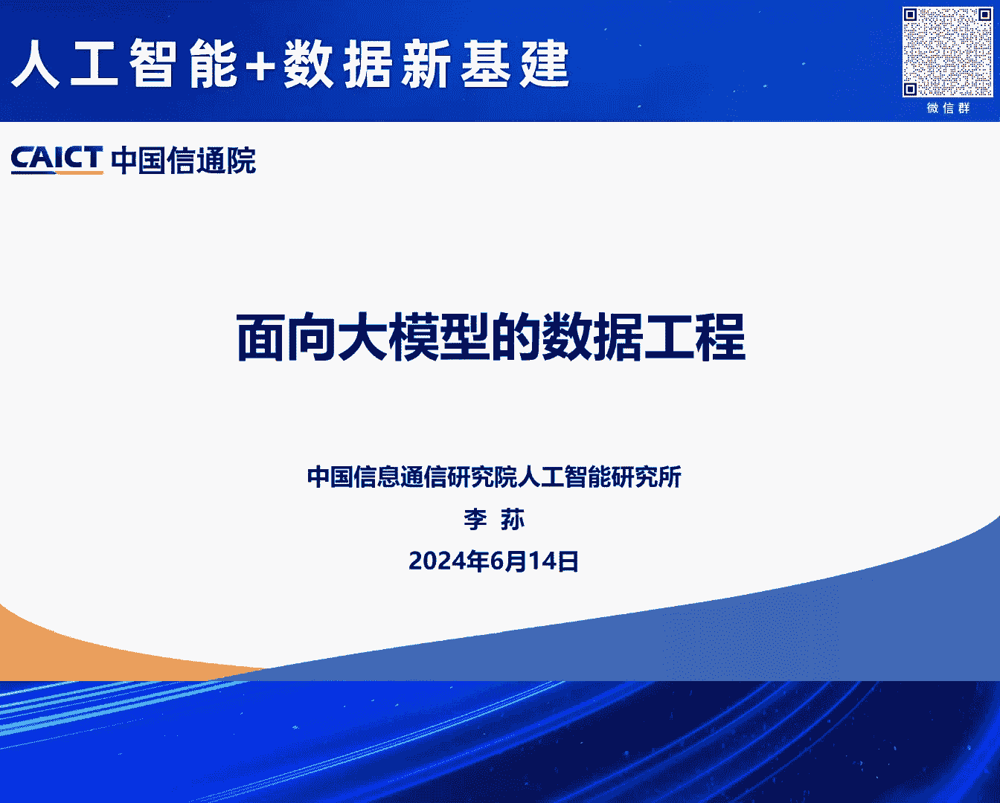
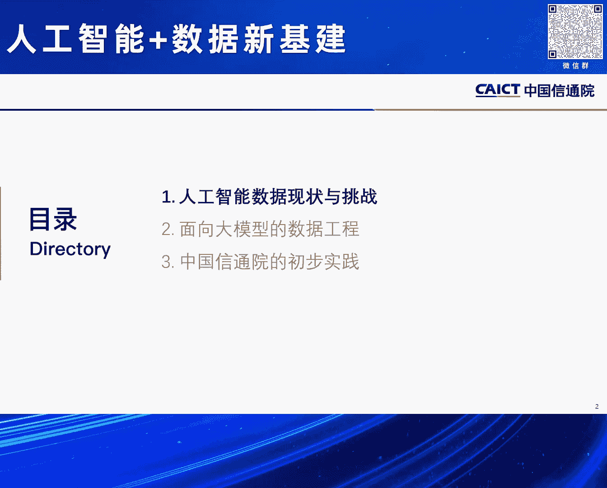
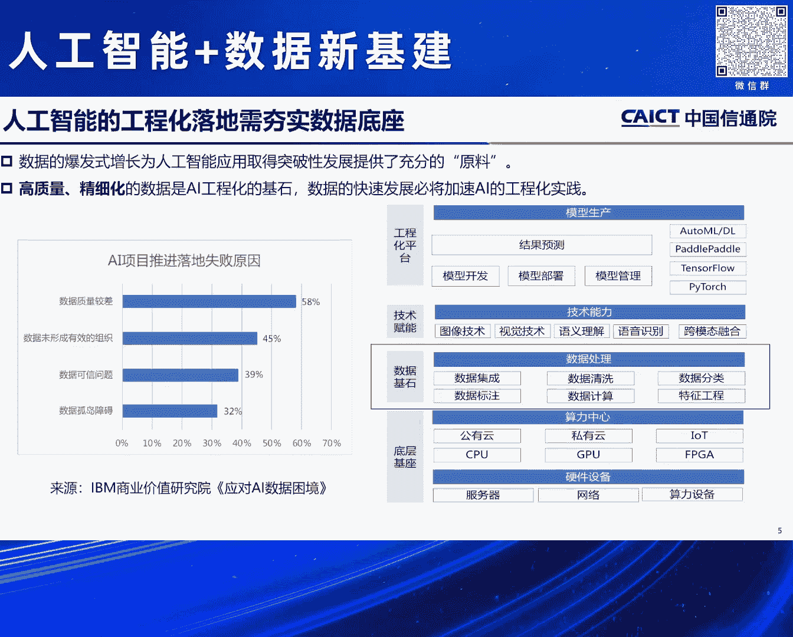
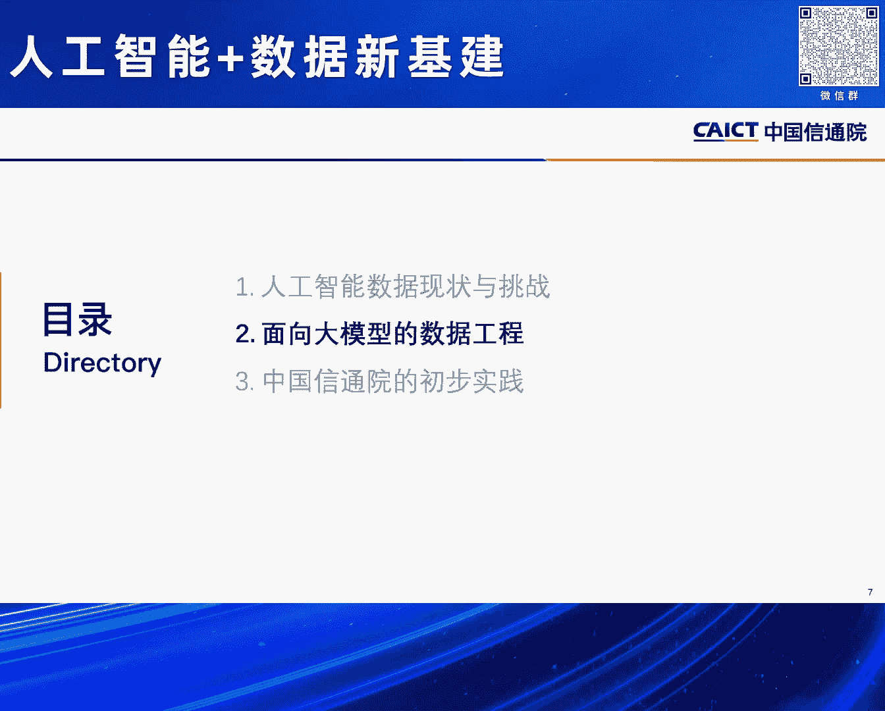
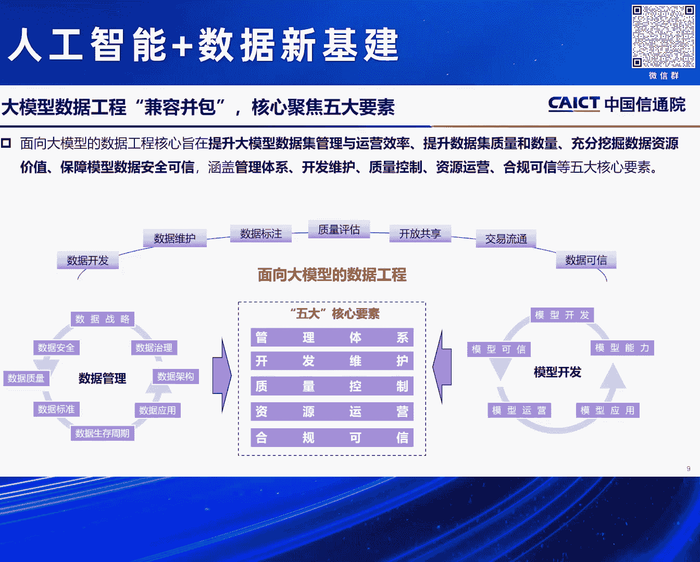
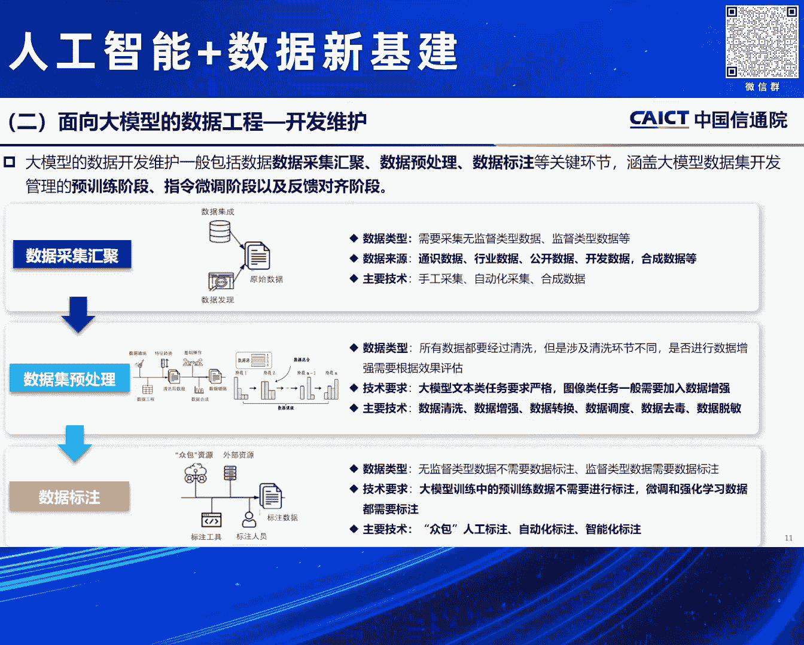
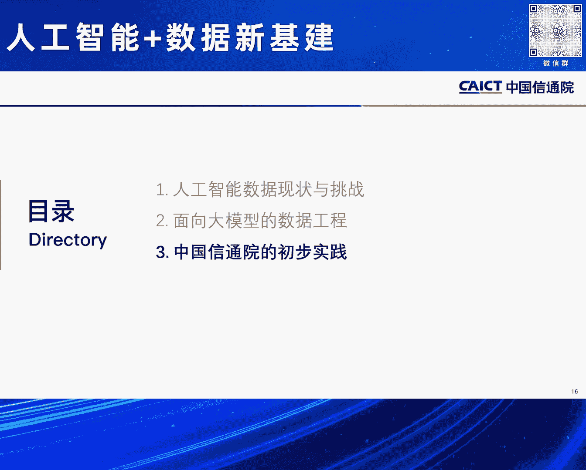

# 2024北京智源大会-人工智能-数据新基建---P7-面向大模型的数据工程-李荪---智源社区---BV1qx4y14735

## 概述
在本节课中，我们将学习面向大模型的数据工程。课程内容基于中国信息通信研究院李荪的分享，将探讨人工智能数据发展的现状与挑战，并系统性地介绍如何构建高效、高质量的数据工程体系以支撑大模型的训练与应用。

---

## 人工智能数据的现状与挑战

随着人工智能的发展，算法、算力和数据构成了其核心三要素。进入大模型时代，算法能力在理解和推理方面实现了质的飞跃。算力方面，国家推动的算力一体化也为人工智能基础设施提供了保障。

然而，数据的要求发生了根本性变化。大模型需要**非常大规模**且**类型多样化**的数据，尤其是多模态数据的对齐。这与上一代专注于NLP、CV等单点任务的小模型截然不同。

在大模型时代，数据之所以受到极高关注，是因为其对质量的要求极高。大模型预训练阶段投入成本巨大，涉及算力、人力和时间。如果数据质量不高，可能导致训练宕机或需要版本追溯，这些都与数据密切相关。

从2021年到2022年，人工智能顶尖学者提出了 **“以数据为中心的人工智能”** 理念。这标志着人工智能的发展重点正从以模型为中心转向以数据为核心，大模型的兴起印证了这一观点。

我们可以将数据比作第二次工业革命中的汽油。发动机和汽车如同算法和算力，而高质量的汽油（数据）的炼制、运输和加油站建设，则如同保证人工智能模型快速发展和应用落地的全产业链条。

国家政策层面也在不断推动高质量数据要素的供给，包括先行先试的数据制度、标准制定、市场交易和资源建设。2023年5月，国家提出建设**国家级数据标注基地**，旨在通过融入人类和专家知识，加工出高质量数据集，持续为人工智能提供“燃料”。

人工智能工程化落地是当前的重点方向，意味着技术从实验室走向产业。在此过程中，数据是连接底层算力基础设施与上层场景应用的关键环节。一个核心矛盾在于：数据通常由模型应用方拥有，而技术提供方缺乏数据。如何弥合“拥有什么数据”和“需要什么数据”之间的鸿沟，是工程化落地的关键挑战，这也引出了今天“面向大模型的数据工程”这一主题。

---

## 大模型时代对数据工程的新要求

进入大模型时代，数据在数量和质量上提出了“双高”要求。主流大模型的训练数据量（Token数）非常庞大，但目前用于训练的数据质量缺乏统一的评价标准，导致在训练和落地过程中需要投入大量时间进行数据处理。

大模型的训练和应用涉及多个环节，每个环节对数据的要求各不相同。因此，我们需要一个**高效、自动化**的数据工程体系。这套体系需要包含：
*   **统一的方法论**：管理不同阶段、不同类型的数据需求与制作。
*   **提升效率的工具**：大规模数据不能仅依赖人工标注，需要发展智能化标注技术，甚至利用大模型进行数据标注。
*   **持续更新的机制**：大模型是持续学习的，需要像人一样不断“喂食”新数据，因此需要建立数据更新机制。

此外，数据在整个大模型生命周期中持续与模型交互，因此需要建立**可信的全流程数据治理**体系，涵盖安全和治理机制设计。

---

## 贯穿大模型全生命周期的数据工程

接下来，我们拆解大模型从预训练到行业应用的全周期，看看每个阶段的数据需求。

大模型的训练周期通常包括：预训练 -> 微调 -> 通用大模型 -> 行业大模型。每个阶段涉及不同的数据集：
*   **预训练数据集**：规模巨大，类型多样。
*   **微调数据集**：包括指令数据、偏好数据等。
*   **提示工程数据**：用于引导模型执行特定任务。
*   **人类反馈强化学习数据**：用于对齐模型与人类价值观。

针对不同数据，有相应的处理方法和训练策略：
1.  **预训练阶段**：核心是数据的获取、过滤和清洗，但因其规模巨大，**数据质量评估**变得至关重要，直接影响训练成本和效果。
2.  **后续阶段**：涉及数据标注、提示工程等，需要引入跨领域、复合型的专业人才进行专家级标注。
3.  **测试与反馈**：数据与模型效果相互呼应。需要通过构建评测数据集，测试模型效果，从而明确模型需要学习什么样的数据，缺什么样的数据。

纵观整个流程，模型与数据**相生相息，密不可分**。因此，大模型的数据工程必须是**贯穿其全生命周期**的。

---

## 大模型数据工程的五大核心要素

我们将面向大模型的数据工程核心梳理为五大要素，融合了传统数据管理成熟度模型和模型开发对数据的要求，旨在提升数据供给效率、管理运营效率及数据质量。

以下是五大核心要素：

1.  **管理体系**
    *   **项目管理**：针对大模型数据工程全周期，进行资源分配、机制建立、进度控制、质量保证和风险管理，确保各类数据能按时、保质、保量、成本可控地交付。
    *   **组织建设**：需要有效融合大数据团队与人工智能团队，解决数据资源供给与模型开发需求之间的协同问题。
    *   **标准应用**：推动人工智能数据领域的标准制定与应用，例如定义“高质量数据集”，建立数据加工、开发、质量评估等操作规范。
    *   **人才管理**：培养既懂数据又懂模型的复合型人才，以及具备多学科背景（如医学、金融）的交叉领域人才。

2.  **开发维护**
    *   **数据采集与汇聚**：针对无监督数据，来源包括通用、行业及合成数据。方式有手工、自动化和合成。
    *   **数据预处理**：核心是清洗、增强、转换、调度、去重、脱敏等，使数据达到“可用”状态，避免模型偏差。
    *   **数据标注**：将数据变得“好用”，需要多背景人才。当前数据标注产业处于起步阶段，未来需要通过产业化升级提供更优质的数据集。

3.  **质量控制**
    *   **数据质量维度**：需从三个维度审视：数据本身的质量（涉及多个指标）、评估方法与工具、全流程质量控制。
    *   **质量映射**：需将模型效果与数据质量形成强映射关系，通过实时交互（如人类反馈）调整数据策略。

4.  **资源运营**
    *   人工智能数据集本身也是数据产品，具有资产属性。
    *   **运营管理**：包括资源目录管理、分级分类。
    *   **开放共享**：涉及对内（部门间）和对外（公共）的开放，需明确内容、要求和协议。
    *   **流通交易**：数据集可在数据交易所进行交易，未来市场空间广阔。

5.  **合规可信**
    *   数据质量直接影响模型输出的可信度。
    *   **安全性要求**：需保障数据的公平性、非歧视性、可解释性。
    *   **融合要求**：需同时遵守大数据领域的安全、隐私、审计、合规要求，以及人工智能领域对模型效果的要求。

---

## 相关研究进展与标准建设

最后，介绍一下中国信通院在该领域的一些研究工作。

中国人工智能产业发展联盟于2023年9月成立了数据委员会，聚焦为人工智能提供高质量数据集，推动标准、场景探索和技术攻关。

相关研究工作包括：
*   **大模型数据资源地图**：研究金融、通信、汽车、智慧城市等行业的数据来源（公开获取、采购、生态合作），并对行业数据进行分级分类和目录管理。
*   **人工智能数据产业图谱**：将数据标注产业视为贯通数据要素与人工智能的核心环节，其升级能双向赋能。目前产业链尚在发展中。
*   **标准研究**：正在推进五项关键标准：
    1.  **人工智能数据集质量通用评估方法**：定义高质量数据集，涵盖11个质量维度。
    2.  **人工智能数据生产标注服务能力成熟度评估模型**：提升数据标注服务商的能力标准。
    3.  **合成数据生成与管理能力要求**：应对未来数据短缺，规范合成数据发展。
    4.  **大模型数据开发管理能力要求**：涵盖前述五大核心要素。
    5.  **人工智能数据工程技术平台要求**：规范支撑数据工程的技术平台。

在质量评估方面，从传统的数据质量维度延伸出 **11性** 指标，并结合模型效果反馈进行验证，方法包括规则检测、人工抽样和模型效果验证。

此外，大模型的基准测试也至关重要。测试需贯穿全生命周期，形成从开发、选型、部署到持续监测的完整工作流。目前已有包含近300万条数据的测试数据集，涵盖多个行业。

---

## 总结
本节课我们一起学习了面向大模型的数据工程。我们认识到，在大模型时代，数据已成为驱动人工智能发展的核心燃料。一个完整的数据工程体系需要贯穿模型全生命周期，并围绕管理体系、开发维护、质量控制、资源运营和合规可信五大要素进行构建。通过推动相关标准、产业升级和技术创新，我们才能持续为人工智能提供高质量的数据供给，释放数据要素价值，并保障人工智能安全、可信地发展。