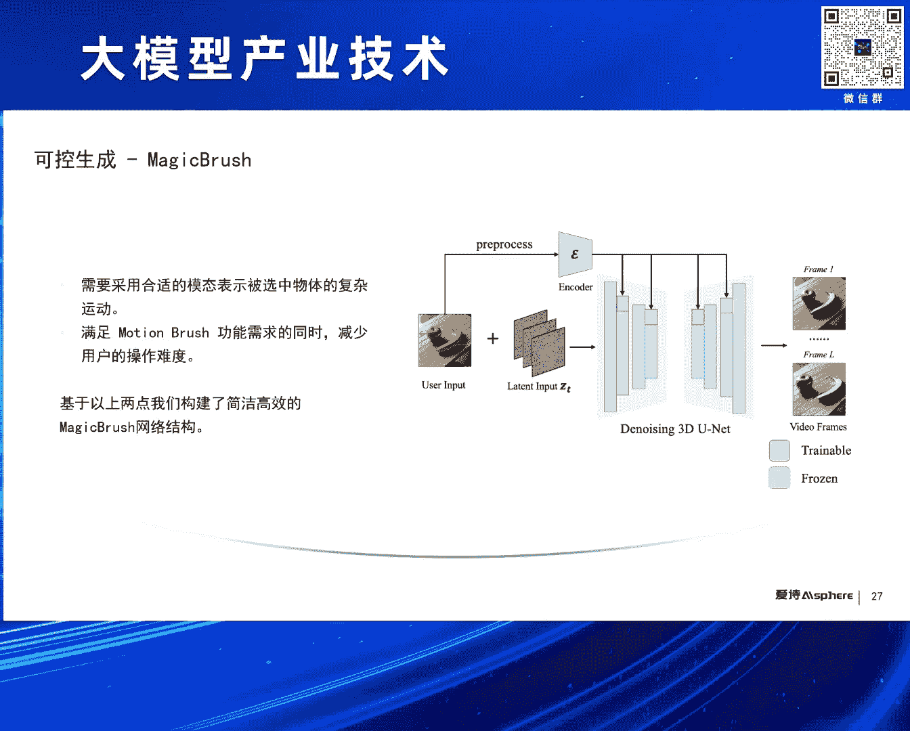
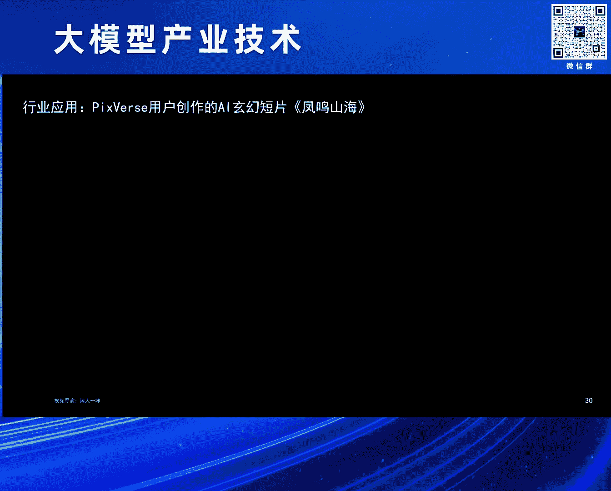
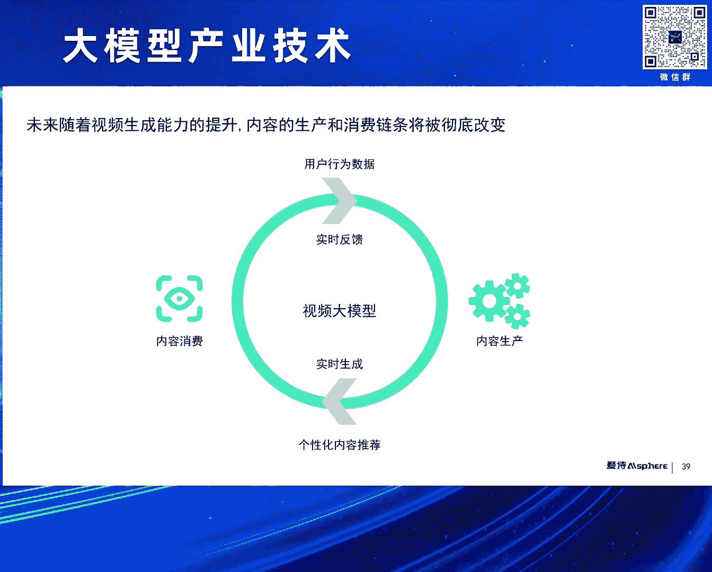
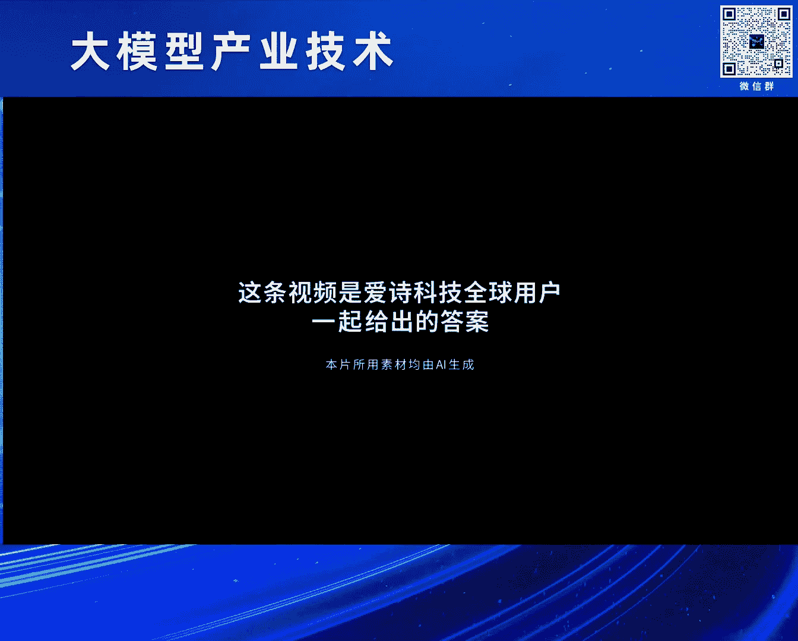
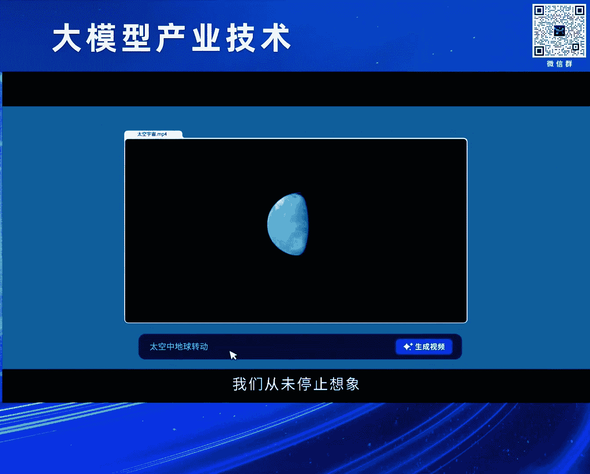
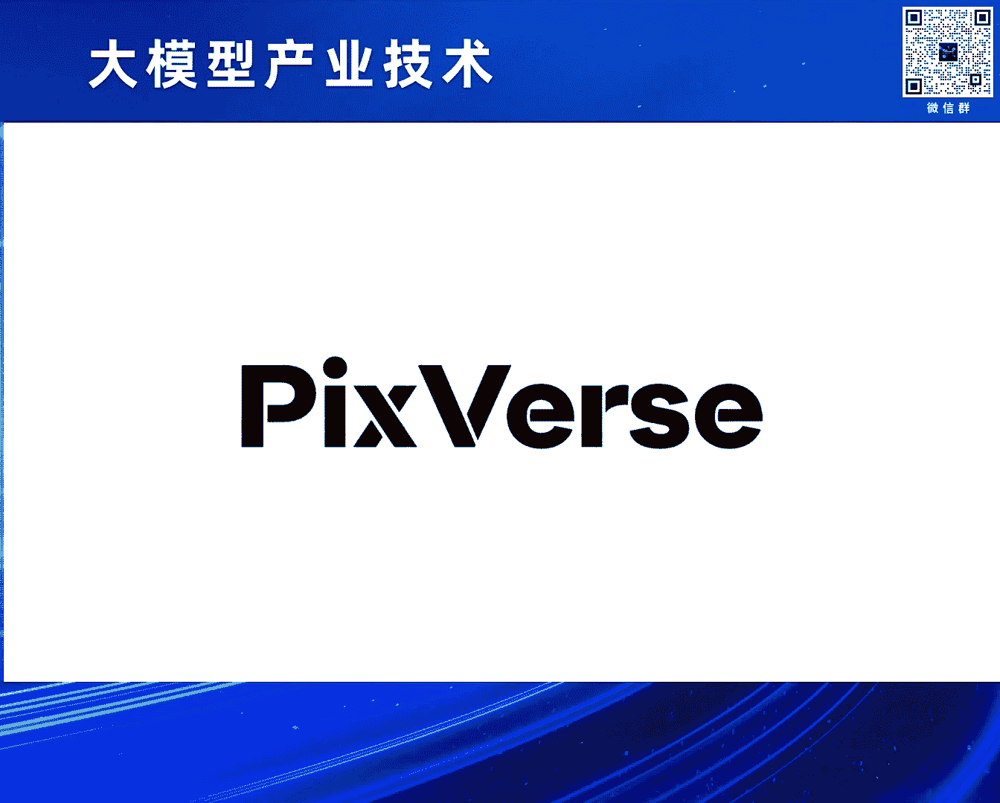
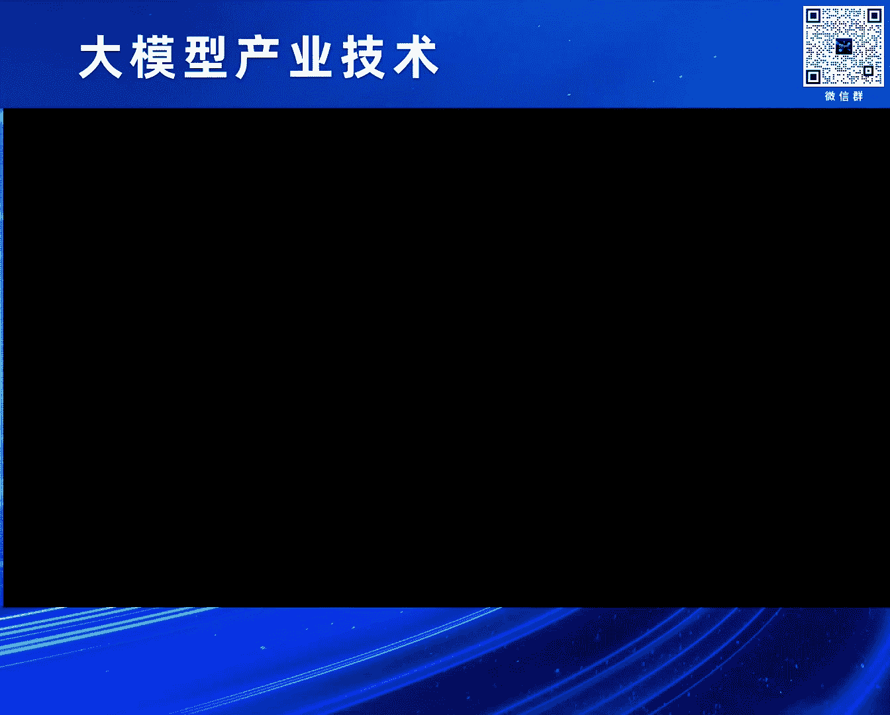

# 2024北京智源大会-大模型产业技术---P2-Al视频生成的过去-现在和未来-王长虎---智源社区---BV1HM4m1U7bM
## 课程编号：P2

在本节课中，我们将跟随王长虎先生的分享，系统性地了解AI视频生成技术的发展历程、核心技术原理、当前主流产品以及未来的挑战与方向。课程内容将涵盖从早期萌芽到SORA横空出世的整个演进过程，并深入探讨技术背后的关键概念。

---

### 概述：AI内容生成的浪潮 🌊

上一节我们介绍了课程的整体框架。本节中，我们来看看驱动本次分享的核心背景——AIGC（人工智能生成内容）浪潮的到来。

这一浪潮并非一蹴而就。它经历了漫长的技术积累。AIGC的萌芽最早可追溯至上世纪50年代。1957年，科学家们利用计算机创作出了第一首曲子。受限于当时的技术，所有尝试都停留在实验室阶段。

从上世纪90年代到本世纪10年代，是AI技术的沉淀累积阶段。此期间诞生了许多著名工作，例如第一部由AI创作的小说和全自动同声传译系统。但由于算法限制，这些工作仍难以真正面向普通用户。

2010年之后，随着生成式对抗网络（GAN）的出现，一系列生成式工作才真正开始面向用户。技术发展从图像生成到大语言模型，从文生图、文生视频，架构也从GAN演进到Transformer和Diffusion。从我们耳熟能详的ChatGPT、Midjourney到SORA，开启了一个新的篇章。

AIGC其实包含多种不同内容形式，包括语言、视觉、音频等。在ChatGPT出现后，大语言模型成为焦点。在SORA出现之前，视频生成赛道尚未如此火热。视觉大模型与大语言模型的主要区别在于，语言是人类文明对世界信息的抽象产物，而视觉在人类出现之前就已存在，是原生的。因此，人们对大语言模型的期望是模拟人脑、构建统一心智；而对视觉大模型的期望，则更侧重于模拟世界、构建世界。

---

### 影像呈现：从记录到生成 📽️

上一节我们探讨了AIGC浪潮的兴起。本节中，我们来看看视频生成的核心——影像呈现技术的演变过程。

视频生成本质上是通过对世界的理解来做影像呈现。影像呈现经历了从记录到生成的演变过程。

以下是图像呈现历史上的三个重要节点：
*   **史前壁画**：在3万多年前，人类已在岩壁上绘制、创作自己看到的世界，例如栩栩如生的狮群。
*   **摄影术诞生**：1826年，法国摄影先驱创作出第一张可以永久固定成像的图片。
*   **动态影像开端**：人类历史上第一个视频，使用了24台照相机拍摄马匹奔跑的画面，其缘起是关于马匹奔跑时四蹄是否同时腾空的辩论。

影像生成看似遥远，实则离我们很近。例如，传统的走马灯利用蜡烛热气驱动轮轴转动，轮轴上的剪纸光影投射在屏上形成动态画面。又如连环画，通过快速翻页即可呈现动态画面。

随着抖音、TikTok等短视频平台的普及和发展，视频生成真正走到了每个人手中。

---

### 视频生成的三种模式 🎞️

上一节我们回顾了影像呈现的历史。本节中，我们来具体看看AI视频生成的几种实现模式。

早期的视频生成主要基于检索完成。视频中的每一个素材都来自已有数据库，通过自动方式找到合适素材并进行拼接。现在依然能看到此类视频。

第二种是部分生成。这通常需要一个输入视频，然后通过AI技术进行局部生成。这种技术广泛应用于各种特效中，例如美颜、动漫风格转换、添加猫耳或狗头等元素。

第三种是我们现在常说的通用生成。它通过输入一段文本描述（Prompt）或一张图片，凭空生成视频。过去一年，这方面的进展飞速。

---

### 核心技术演进：GAN与Diffusion 🤖

上一节我们了解了视频生成的几种模式。本节中，我们来深入探讨支撑这些模式的两大核心技术：生成对抗网络和扩散模型。

自2014年起，视频生成技术已发展十年。随着GAN的出现，生成式技术才真正开始实用化。早期的GAN技术应用于前面提到的部分生成特效上，但对于通用视频生成，效果依然差强人意。

直到2020年Diffusion模型出现并击败了GAN，成为图片和视频生成的主流。从2023年开始，许多视频生成技术和产品逐渐出现，例如NVIDIA的VideoLDM、Google的VideoPoet，以及面向用户的产品Runway、Pika。今年春节，SORA横空出世，开启了一个新纪元。

**生成对抗网络（GAN）** 于2014年由Goodfellow提出。它源于博弈论中的零和博弈思想，通过生成网络和判别网络不断博弈，从而学习数据分布以生成高质量内容。

其优缺点明显：
*   **优点**：能够生成可控的、在特定目标下效果较好的内容。
*   **缺点**：训练难度大，需同时优化两个网络；多样性有限，难以进行通用生成。

GAN提出后，出现了许多变种，如CycleGAN、DCGAN、InfoGAN等，广泛应用于多种场景。也有研究人员希望将GAN技术应用于视频生成，例如2019年提出的DVD-GAN。它引入了3D卷积和RNN进行建模，并采用空间与时间双判别器，但生成的视频质量依然有限。

**扩散模型（Diffusion Model）** 于2015年提出，在2020年正式击败GAN后开始流行。它的主要思想是通过不断给图片加噪声来破坏数据分布，然后逆向地不断去噪以还原数据，在此过程中逼近数据分布，从而生成高质量内容。

早期Diffusion模型主要使用U-Net架构进行去噪，这是过去几年的主流模式。而Diffusion Transformer（DiT）的出现，验证了Transformer结构可以更好地进行缩放，生成更高质量的内容。因此，随着SORA的出现，Diffusion加Transformer的架构逐渐成为主流。

在Diffusion加U-Net架构下，一个经典的视频生成方法是NVIDIA提出的VideoLDM。它首次提出了一个有效且后来成为主流的工作流：生成关键帧、进行插帧、最后进行超分辨率。该方法使用Latent Diffusion加3D U-Net架构，能支撑多个任务，视频生成能力相比原有技术有很大提升。

除了GAN和Diffusion，也有研究人员希望用大语言模型技术解决视频生成问题。一个代表性工作是Google在去年底提出的VideoPoet。它采用Decoder-Only的自回归Transformer来端到端生成视频，允许多种模态输入，并用专有的Tokenizer将内容Token化。该工作效果出色，但与VideoLDM一样，并未产品化或开源。

---

### SORA的突破与影响 🚀

上一节我们介绍了GAN和Diffusion两大核心技术。本节中，我们聚焦于引发行业震动的SORA模型。

今年年初，SORA横空出世，进一步推动了行业发展。SORA采用的架构正是前面提到的Diffusion加Transformer，用Transformer模块替代了Diffusion架构中的去噪模块U-Net。同时，它也利用大语言模型进行Prompt增强和训练数据精细化打标，并在编码器和解码器方面做了创新。

关于SORA的解读非常丰富。在我看来，SORA最重要的贡献是验证了DiT（Diffusion Transformer）在视频生成中的**缩放定律**：模型越大、时空块（Patch）越小、可用高质量数据越多，生成效果就越好。

例如，在基础计算量一定时，生成的视频可能存在较多变形；但当计算量增加4倍到32倍时，生成质量变得非常好。SORA展示的例子中，当镜头平移或旋转时，物体和场景在三维空间中能保持更好的一致性，说明模型已具备一定的世界建模能力。在其发布的20秒、60秒长视频中，也展示了一致性能力，例如人物出画再入画时衣着保持一致。此外，例子中还呈现了物体间的互动建模能力，如咖啡杯中的小船行驶会带动咖啡波动，人咬汉堡后会留下牙印。

尽管SORA并未公开可测，披着神秘面纱，但它已极大地推动了行业发展，使得众多视频生成技术演进到GPT时刻，视频生成能力也进一步提升。

SORA出现后，许多优秀模型纷纷出现，大家都希望成为“中国的SORA”或“全球的SORA”。这里有一些开源模型（如Open-Sora），也有未开源但已产品化并可公测的模型。最近几天发展很快，例如快手发布的“可灵”视频生成能力、字节跳动的“即梦”图生视频能力都非常惊艳。

过去一年，无论数据量、计算量还是参数量都有了极大提升。例如，上海AI Lab在23年7月发布的ModelScope、Google在23年底的VideoPoet以及24年2月OpenAI的SORA，这些指标都有几十倍的增加。

今年5月，智源研究院携手中国传媒大学对全球上百个大模型进行了专业评测，其中包括一些视频模型。评测结果显示，PixVerse（我们公司的产品）排名在前三名。由于SORA无法公开测试仅作参考，前三名分别是Runway、PixVerse和Pika。可以看到，技术侧逐渐趋同，但视频生成能力最终需要面向用户。

---

### 主流产品分析：Runway, Pika, PixVerse 🏆

上一节我们看到了SORA带来的技术飞跃。本节中，我们来看看这些技术是如何通过具体产品服务用户的。

以下是三个主流产品Runway、Pika和PixVerse的简要分析：

**Runway** 是视频生成产品化的先行者。在它出现之前，生成能力更多体现在论文中。Runway公司成立于2018年，早期做机器学习模型平台，后来开发了许多AI视频编辑能力。去年3月，它发布了Gen-2文生视频能力，这是第一个产品化的文生视频能力，吸引了大量用户。其UI体现了丰富的AI编辑工具，超过20种，针对不同应用场景。它也是最早推出“运动笔刷”（Motion Brush）功能的，用户可以通过笔刷精准控制视频局部内容的变化与运动。

**Pika** 大家也非常熟悉。该公司成立于去年年初，从社区做起，承接了部分Midjourney用户将图变成视频的需求，社区用户成长很快。早期它重点发力图生视频。其特点是重视声音与口型，今年年初与ElevenLabs合作推出了AI口型和配音功能，也推出了AI音效生成功能，用户可通过Prompt控制或让AI自动匹配音效。

**PixVerse** 在评测中结果超过Pika，在用户侧每日访问量也已与Pika比肩。我们于今年1月正式上线，提供文生视频、图生视频等基础功能，但也有自己的特色功能，如固定角色生视频（Character-to-Video）。我们特别关注用户的可控生成，因为用户在创作时，有需求确保不同镜头中的人物保持一致，并希望更精确控制视频局部内容和背景的变化。

固定角色功能之所以重要，是因为现有视频生成时长较短，多为单镜头。但用户真正使用时，往往需要生成更长的视频（如广告片、剧情片），这需要集成多个镜头，且镜头间主角需保持一致。我们开发的这个功能允许用户上传一张图片创作角色形象，并基于此角色连续生成不同的视频。

我们也开发了“魔法笔刷”（Magic Brush）功能，其易用性和效果超过Runway。用户可以用笔刷涂抹区域选择物体，并勾画轨迹，该物体便会按轨迹运动。

过去一年，我们也经历了从Diffusion加U-Net到Diffusion Transformer的架构升级。创业早期资源有限，我们用最短时间达到了全球第一梯队的效果。当前，我们和许多同行一样，采用DiT架构，希望做出中国的、全球的SORA。未来也会探索更多可能性。

---

### 可控生成技术原理浅析 🔧

上一节我们对比了主流产品。本节中，我们深入一步，简单看看这些产品背后可控生成技术的原理。

首先是固定角色生视频（Character-to-Video）功能。要实现角色固定并融合到视频中，现有不同方法。

以下是两种典型方法的对比：
*   **LoRA**：每个角色ID都需要重新训练，训练成本大，但天花板高，保真度和美学性都很好。
*   **IP-Adapter**：只需训练一次，使用大量ID训练一个嵌入模块，然后插入生成模块。用户输入新ID时无需重新训练。优点是成本低、速度快，但问题是上限不够高，保真度和美学质量偏低。

针对这两种方法的问题，我们设计了一个新结构。基于IP-Adapter架构，我们增添了两个模块：为解决保真度问题，增加了一个判别模块，确保生成内容符合用户意图；为解决美学度问题，增加了一个强化学习模块以提升美学度。无论是主观对比还是客观指标，我们的方法都优于这两种方法。

其次是魔法笔刷（Magic Brush）功能。这里对比了学界一些典型工作。

左边的“DragNUWA”工作，其主要方法是将用户涂抹区域标签化得到语义信息，再将语义信息和区域信息转化为高斯热图，然后通过ControlNet注入到生成模型中。这个过程较复杂，且对局部控制不够精准，容易导致背景不稳定。对比可见，我们的方法能更精准地按意图运动。

另一个工作是“MagicVideo”。它的思路是先将用户输入转化为稠密光流，用SToD处理，最后将结果通过ControlNet注入到SVD中。这增加了一个新模块，导致训练难度更大、模型更臃肿，且对物体精准控制不够。

针对这些问题，我们开发了新算法。一方面在交互层面创新，让用户更方便控制物体运动；另一方面在模型层面大大简化了架构，无需基于ControlNet注入到SVD。用户输入经预处理后，通过一个编码器再经过预先训练好的适配器，即可注入到生成模型中。这样整个框架大大简化，效果好且高效。

---

### 当前应用与未来挑战 💡

上一节我们探讨了技术原理。本节中，我们来看看AI视频生成当前的实际应用和未来需要突破的技术挑战。

虽然生成的视频时长有限且多为单镜头，视频生成远未到ChatGPT时刻，但现阶段已有许多创作者利用AI视频产品创作有价值、好玩甚至能带来商业化收入的内容。

例如，有海外动漫粉丝根据1988年的日本动画《阿基拉》，用PixVerse重新生成了一个AI版预告片。也有国内创作者受央视电影频道邀请，以荆楚文化中的“凤”为主题，创作了关于楚庄王“一鸣惊人，问鼎中原”的故事片，其中的镜头均由PixVerse完成。当然，AI目前还代替不了导演，这些元素由专业的AI导演拼接成完整片子。

AI视频可用于叙事、讲故事、制作宣传片和广告。例如，一位海外导演因故无法现场拍摄，资金断裂，转而使用PixVerse创作了AI广告片。第一个广告片虽未直接赚钱，但带来了流量，随后便有人付费请他创作商业广告片，如啤酒广告。

接下来聊聊未来视频生成需要突破的技术方向。虽然DiT架构和SORA的出现极大提升了视频生成的稳定性和质量，但依然存在不足。

以下是未来需要努力的方向：
*   **更好的运动与世界建模**：当前生成的视频常出现违反物理或自然规律的违和感（如杯子突然违反重力跳起，液体莫名洒出；狗的数量时刻变化）。这导致用户需要频繁“抽卡”，尝试多次才能得到一次可用的结果。未来需通过更好的建模提升生成成功率。
*   **生成长视频**：虽然很多模型声称能做长视频，但产品化可用的往往只有几秒钟。这是因为生成长视频意味着误差累积，导致“抽卡”概率更低。如何生成长视频是重要挑战。
*   **多镜头场景生成**：现有能力多生成单镜头内容，但真实使用往往是多镜头组合。如何表达镜头语言并将其合理融入模型，生成电影级多镜头内容，是未来要解决的问题。
*   **实时生成**：当前生成一个几秒视频可能需要几十秒甚至几分钟。等待时间长意味着只有专业用户能用，且推理成本高。实现实时生成既能提升用户体验，又能极大降低推理成本。将模型部署在手机端，还能提供更好的隐私保护和交互体验。
*   **隐私与伦理挑战**：视频生成大模型同样面临深度伪造等挑战。如何确保技术不作恶、阻止恶意用户，需要技术与监管共同打磨、持续升级。

视频生成虽未达到ChatGPT时刻，但已在快速重塑视频创作工作流。当前，AI视频生成技术正逐渐替代演员、背景和摄像头。未来，它必将影响千行百业，包括游戏、影视、动漫、教育、广告等。我们不仅希望服务好专业创作者，更希望进一步降低使用门槛，实现技术普惠，让每天玩抖音、快手、TikTok的普通用户也能用起来、玩起来，能够“言出法随”地生成高美观度、高创意的视频。

---

### 总结

本节课中，我们一起学习了AI视频生成技术的发展全景。我们从AIGC浪潮的兴起谈起，回顾了影像技术从记录到生成的演变，分析了视频生成的三种模式。我们深入探讨了GAN和Diffusion两大核心技术原理，以及SORA模型的突破性贡献。接着，我们对比了Runway、Pika、PixVerse等主流产品的特点，并浅析了可控生成背后的技术逻辑。最后，我们看到了AI视频生成当前的实际应用案例，并展望了其在更好的世界建模、长视频生成、多镜头控制、实时化以及伦理安全等方面面临的未来挑战。整个领域正在快速发展，并逐步重塑内容创作的工作流，其未来影响值得期待。