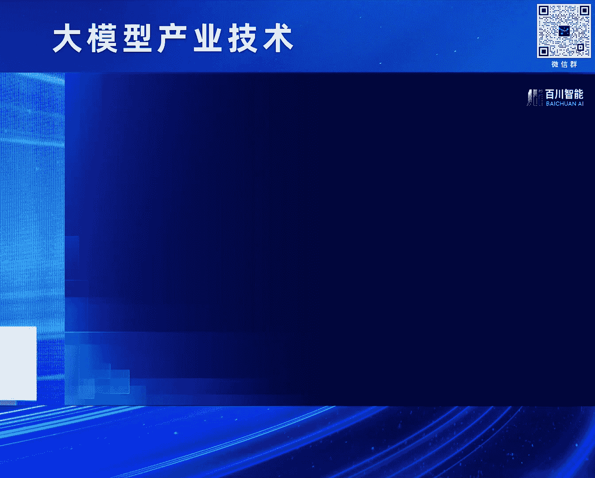
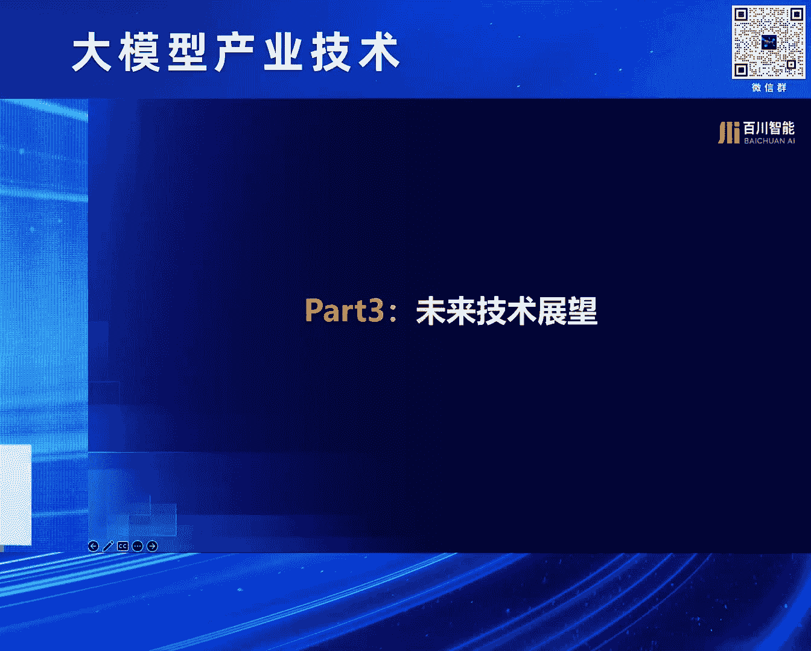

# 2024北京智源大会-大模型产业技术---P3-百川大模型技术与应用实践-谢剑---智源社区---BV1HM4m1U7bM

在本节课中，我们将学习百川智能在大模型技术演进与应用探索方面的核心实践。课程内容将分为技术探索与应用实践两大部分，涵盖从模型预训练、对齐优化到智能体（Agent）系统构建，以及原生应用的设计理念。

---

## 第一部分：百川大模型技术演进 🧠

百川智能是一家成立于2023年4月的年轻公司，但发展迅速。公司自成立起，以每月发布一个模型的节奏，推动了国内中文大模型的开源生态。从最初的7B、13B模型，到后续的53B模型，直至近期发布的旗舰模型百川4，公司在技术上进行了一系列探索。

上一节我们介绍了百川的发展历程，本节中我们来看看百川4模型在技术上的具体创新。

### 1. 预训练数据优化 📊

预训练中，数据质量至关重要。行业趋势正从依赖人类标准筛选数据，转向利用模型自身进行数据筛选与合成。

以下是我们在数据优化方面的主要工作：

*   **模型筛选数据**：我们使用百川3模型，通过特定指标来筛选高质量的训练数据。这与Meta在Llama 3中公布的工作类似。
*   **数据合成**：利用大模型自身生成知识密度高的合成数据。这包括对现有数据的改写，以及高质量数据的全新生成。

### 2. 位置编码的科学化探索 🔬

在扩展模型上下文窗口的训练中，如果使用RoPE位置编码，通常会有一个经验性的做法：基底（base）需要随窗口增大而增大，但具体关系并不明确。

我们的预训练团队对此进行了科学化研究。实验表明，要将上下文长度扩展到一定程度，其所需的RoPE基底存在一个理论下界（lower bound）。这项研究已形成论文公开发表，使得窗口扩展能力的设定更加科学。

### 3. 模型对齐的深入理解与创新 🎯

模型对齐（Alignment）是让模型行为符合人类期望的关键步骤。我们在此领域进行了原理探究与方法创新。

#### 探究对齐原理

我们试图理解预训练中获得的知识与通过对齐训练激发出来的知识之间的关系。

*   **认知能力（Cognitive Capability）**：我们将Transformer网络在最终逻辑层（logits）之前的嵌入（embedding）取出并进行聚类，以区分“好”与“坏”的表示。实验发现，这种能力随着预训练token数量的增加而持续提升。
*   **表达能力（Expressive Capability）**：即模型最终通过文字输出判断好坏的显性能力。研究发现，通过SFT或RLHF等对齐方法，这项能力确实在提升，但其上限并未超过模型内在的“认知能力”。

这项研究印证了一个重要观点：**预训练模型已经学习了大量知识，对齐训练更多是在有效地激发（illicit）这些知识**。相关论文已在今年的ICML上发表。

#### 创新对齐方法

在对齐方法上，我们也进行了多项创新：

*   **SFT阶段的模型融合**：我们探索了如何将不同模型的参数进行融合，以平衡效果而不显著增加计算量，这类似于传统机器学习中的集成（Ensemble）方法。
*   **强化学习的阶段化与迭代优化**：
    1.  **序列偏好优化**：针对不同维度的价值观对齐要求，我们将其区分并分步进行微调，避免了多目标难以平衡的问题。
    2.  **迭代式RLHF与RLAIF融合**：我们不仅使用人类反馈（RLHF），也融合了模型自身的AI反馈（RLAIF）。同时，采用迭代式（iterative）的强化学习，让模型能力像爬坡一样逐步提升。

### 4. 推理效率优化 ⚡

除了算法效果，推理成本与效率同样关键。我们与北京大学合作，在投机采样（Speculative Sampling）技术上进行了创新。

传统投机采样通过并行预测后续多个token来加速，但命中率有待提高。我们的工作将序列知识与并行解码结合，**显著提升了投机采样的命中率**，从而降低了推理成本。

### 5. 智能体（Agent）技术探索 🤖

我们认为，当前模型多处于“快思考”（System 1）模式，而要解决人类复杂任务，需要“慢思考”（System 2）能力，即进行规划、使用工具和长序列推理。

百川在智能体技术上进行了探索，并在GAIA基准测试中取得了全球第一的成绩。GAIA是一个评估模型处理复杂、多步骤现实任务能力的基准，题目对人类简单但对现有AI系统挑战巨大。

我们的系统在以下几个方面进行了重要探索：

*   **全局记忆管理**：为处理长序列规划，引入了全局记忆（Global Memory）管理机制。
*   **多智能体协作**：采用“心智社会”（Social of Mind）理念，让多个智能体通过对话与相互修正来提升任务解决能力。
*   **网页智能体**：将搜索增强从简单的网页摘要，进化为能够像人类一样操作网页（如点击、翻页）的“网页智能体”（Web Agent）。

相关技术报告和代码即将公开。

---

## 第二部分：百川原生应用探索 💡

在强大的大模型技术基础上，我们认为一个真正有用的AI助手应具备两个核心能力：懂搜索、会交互。基于此，我们开发了原生应用“白小印”。

以下是“白小印”应用的核心特点：

*   **懂搜索**：
    *   **定向搜索**：能根据问题类型（如找论文、查医疗信息）自动选择最合适的专业网站进行搜索。
    *   **多轮搜索**：将复杂问题（如“对比中美大模型行业差距”）拆解为多个搜索步骤，最终给出结构化解析。
    *   **结果嵌入**：将多轮搜索与分析的结果，有机整合到最终答案中。
*   **会交互**：
    *   **结构化呈现**：对于对比类问题（如“对比绍兴与宁波GDP”），能以表格等清晰形式呈现信息。
    *   **主动提问**：在用户需求不明确时（如“帮我写篇作文”），通过多轮互动引导用户澄清需求，从而提供更精准的结果。

“白小印”寓意“一呼百应，有求必应”，其形象融合了百川入海的理念。我们期待它能从工具进化为有温度的伙伴，践行“创造健康与快乐”的价值观。

---

## 第三部分：未来技术展望 🔭

最后，分享我个人对大型模型未来技术发展趋势的几点展望：

1.  **大（Scale Up）**：模型参数与数据规模将持续扩大，追求能力数量级的提升。
2.  **多（Multimodal）**：模态将从任意到任意（Any to Any）发展，并更加注重实时、自然的拟人化交互。
3.  **普惠（Affordable）**：在能力不变的前提下，推理成本将以超越摩尔定律的速度快速下降，推动技术普及。
4.  **长序列复杂任务（Long-horizon Tasks）**：突破当前“快思考”模式，使AI能像人类一样进行“慢思考”，完成需要长时间规划和多步骤执行的复杂任务，这是迈向AGI的关键。
5.  **自学习与进化（Self-learning & Evolution）**：探索不依赖人类监督数据，通过自我博弈、自我提升实现能力突破的路径，这将是未来的巨大挑战与机遇。

---

## 现场问答环节 💬

**提问**：在构建复杂推理网络时，除了外部智能体（Agent），在模型内部结合树搜索（Tree Search）等方式，这两条技术路径有何不同？

**回答**：我认为解决复杂任务最终需要双管齐下。外部智能体的规划、反思、调用工具，与模型内部通过树搜索（如结合MCTS）进行多路径推理探索，本质是同一类事情，都会增加计算成本。另一方面，必须将通过这些外部方法积累的数据和经验，重新训练回模型本身，以提升模型内在的复杂任务解决能力。因此，**外部系统增强与模型内部能力提升这两条路径必须协同并进**。

---

本节课中我们一起学习了百川大模型在预训练数据优化、科学化位置编码、对齐原理与方法创新、推理加速以及智能体系统构建等方面的技术实践，也了解了其“懂搜索、会交互”的原生应用设计理念，并对大模型未来的技术发展趋势进行了展望。