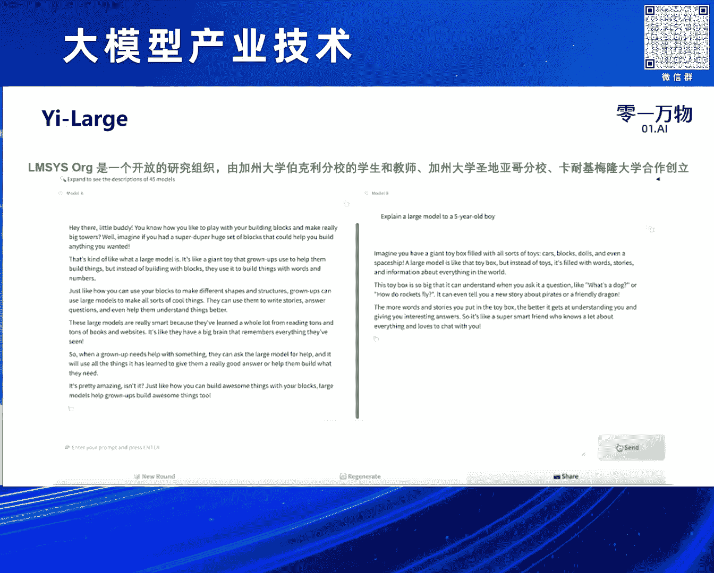
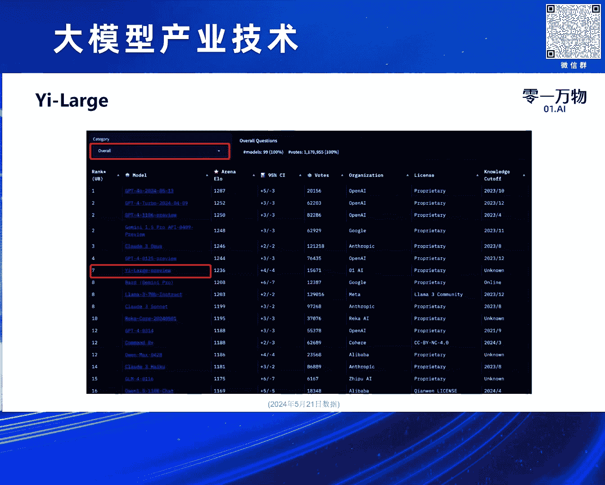
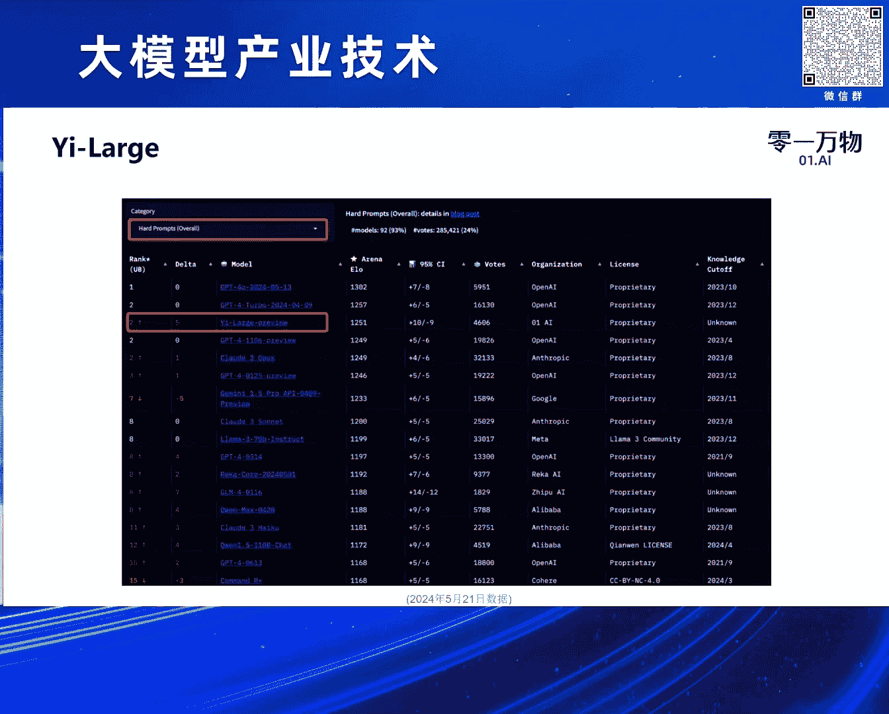
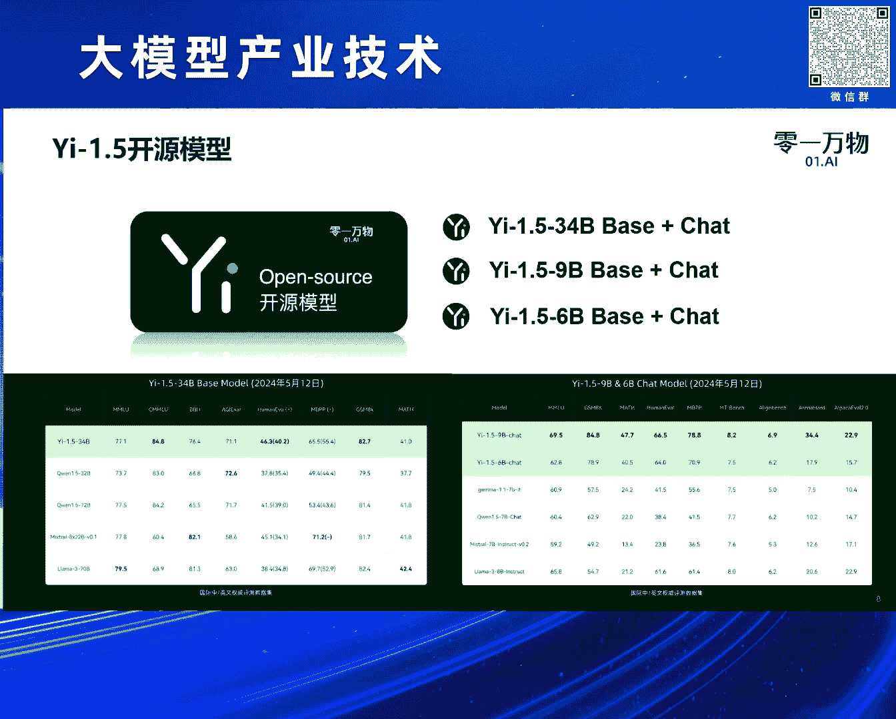
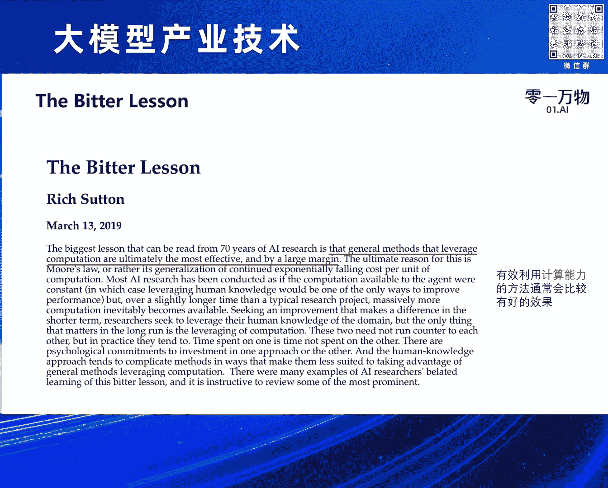
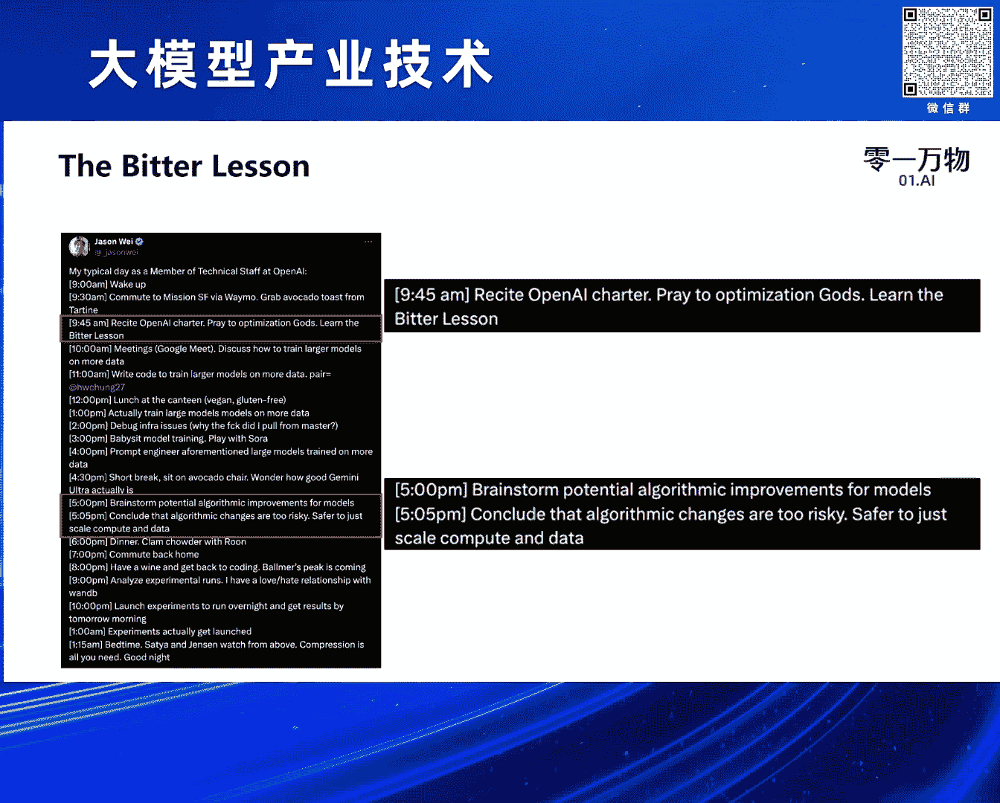
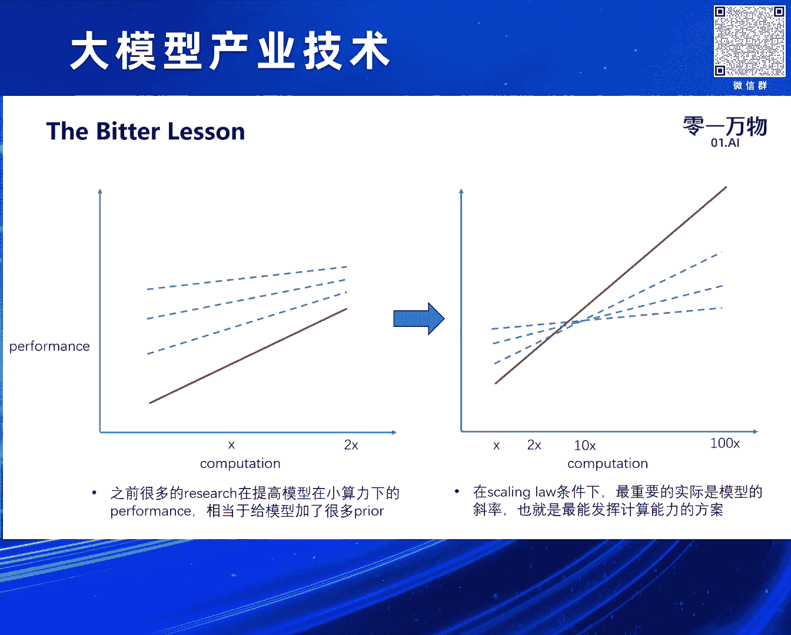
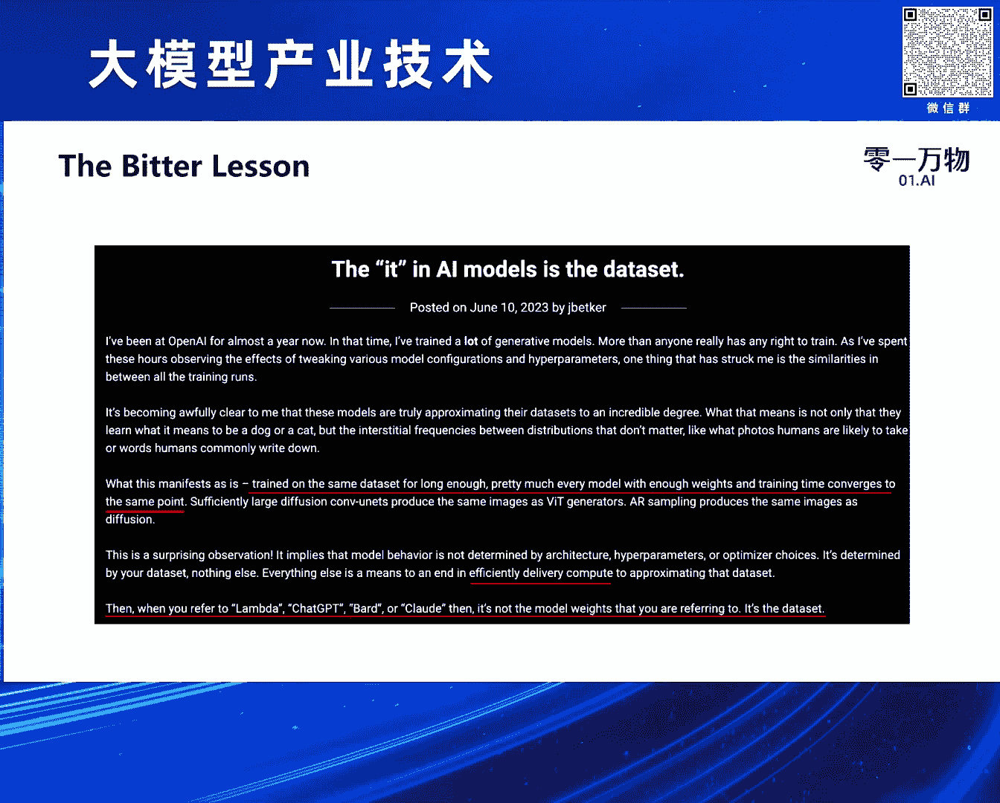
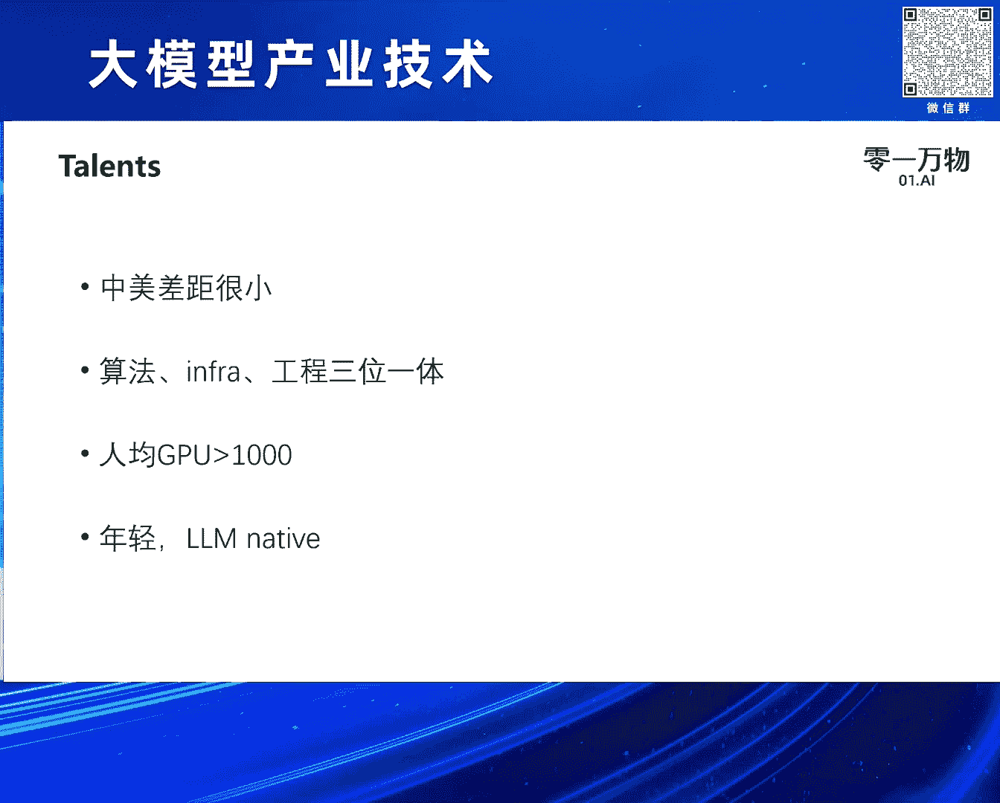

# 2024北京智源大会-大模型产业技术---P4-大模型训练方法论及Yi-Large的实践-黄文灏---智源社区---BV1HM4m1U7bM

## 课程概述

在本节课中，我们将学习大模型训练的核心方法论，并结合零一万物发布的 Yi-Large 模型实践案例，深入探讨 Scaling Law（缩放定律）、高质量数据工程、系统工程与人才观等关键议题。课程内容源自黄文灏在2024北京智源大会的分享。

## 模型发布与评测

首先介绍我们上个月发布的 Yi-Large 模型。这是一个参数量超过千亿的稠密模型。发布时，该模型在多项评测指标上已接近或超过 GPT-4、Claude、Gemini 等海外第一梯队模型。我们还有一个更大的 MoE 架构 Yi-XLarge 模型正在训练中。

评测分数自发布后经过进一步训练，仍有小幅提升。在评测过程中，我们发现公开评测数据存在较大偏差。例如，使用各种评测框架均无法复现 LLaMA 3 报告的成绩。最终我们选择采用各模型官方自行报告的成绩作为参考。GPT-4 和 Claude 的 API 评测也存在类似问题。

同时，许多评测题目是静态的，可能导致模型通过针对该领域构造数据进行定向增强。因此，在发布模型时，我们提出了“模用一体”（模型与应用一体化）的概念，希望寻找更贴近实际应用场景的评测数据集。

我们发现 OpenAI、Google 和 Anthropic 都认可一个名为 LMSYS Chatbot Arena 的评测集。该评测集的工作流程是：用户随机提出问题，不存在题目泄漏问题。后台随机选择两个模型生成答案，用户进行盲测选择。这种评测方式更接近实际产品中的 A/B 测试，题目分布也更贴近真实用户使用聊天机器人的场景，因此更加公平客观。

国际第一梯队厂商也将 LMSYS 作为重要的评测榜单。我们在发布约一周后获得了评测成绩。结果显示，我们的模型处于世界第一梯队，排名在我们之前的只有 OpenAI、Anthropic 和 Google 的模型。图中显示排名第七，是因为 OpenAI 提交了四个模型。

在中文能力排行榜上，我们与 GPT-4 并列第一。LMSYS 还有一个“困难提示词”排行榜，针对用户提出的复杂问题进行评测。在该榜单上，我们基本处于全球第二的水平。这些结果让我们对自己的模型充满信心。

我们在海外的产品中也进行了 A/B 测试。使用我们的模型与 GPT-3.5 比较时，用户留存和付费均有较大提升。与 GPT-4 比较时，数据基本持平。这进一步证明我们的模型训练效果不错。

除了闭源模型，零一万物也做了许多开源模型工作。去年11月发布的 34B 模型，曾在 Hugging Face 的 LLM Leaderboard 上排名全球第一。今年上个月，我们对开源模型进行了一系列更新，发布了 1.5 系列模型，这些模型都是开源的。

我们选择 34B 这个尺寸，是因为它在量化后可以在一张 4090 显卡上部署，方便用户进行 SFT 和提示词工程。该模型受到了国外开发者的好评，许多人基于我们的模型创建了多种版本。例如，Nous Research 的 OpenHermes 模型以及许多多模态模型的后端语言模型，都采用了 Yi 模型作为基础。

## 核心训练方法论

接下来，我将分享我们在预训练过程中坚持的核心方法论，主要包括以下四点：
1.  Scaling Law（缩放定律）
2.  The Bitter Lesson（苦涩的教训）
3.  高质量数据系统工程
4.  对人才的判断

### 1. Scaling Law（缩放定律）📈

当前很多人都在讨论 Scaling Law，包括其能否通向 AGI。首先，我们需要对 Scaling Law 有一个基本定义。它表示模型性能与所用资源之间的关系。简单来说，资源越多，模型性能越好。从这个层面看，Scaling Law 是成立的。

我们好奇的是 Scaling Law 能否通向 AGI。回顾过去几年的发展，横轴代表训练模型所需的计算量（FLOPS），呈指数级增长。纵轴代表模型在不同阶段的能力，例如 GPT-2 被视为学前儿童，GPT-3 是小学生，GPT-4 是高中生，未来模型或许能自动进行 AI 研究和工程。

关键问题在于：模型能力的提升是线性的还是指数级的？如果认为是线性的，那就意味着随着资源的指数消耗，模型能力仅线性增长。如果是指数级提升，那么两者关系更接近线性。右侧图表展示了不同模型在评测集上的表现。随着训练算力增加，模型多数能力都有巨大飞跃。

以上是广义的 Scaling Law。还有一个更狭义的定义，主要来自 OpenAI 的论文《Scaling Laws for Neural Language Models》。这篇论文的一作是 Jared Kaplan，他具有物理学背景。Scaling Law 的公式与物理定律（如万有引力定律）非常相似。物理学家擅长对经验性或系统性的实验结果进行建模和提炼。

以下是该论文的几个重点：
*   它是一个经验性公式，而非严格的数学证明公式，是通过大量实验结果用简单方程拟合而来的。
*   该公式非常有效，其中一个作用是计算资源的最优分配。给定算力预算，我们可以决定如何分配数据和模型参数。

论文中包含大量数学公式，其中最重要的可能是公式 1.5：

`L = (C / (N^α * D^β)) + L∞`

**公式解释**：
*   `L` 代表模型的损失（Loss），损失越低，模型能力越强。
*   `N` 代表模型的参数量。
*   `D` 代表模型训练使用的数据量。
*   带角标的 `C`, `α`, `β`, `L∞` 均为常数，通过训练小模型（如从百万到千万参数）进行大量实验后拟合得出。

拟合出这些常数后，根据目标模型的大小和参数，即可预测其训练损失。这个公式具有重要意义：

**第一，它印证了广义的 Scaling Law**。由于 `N` 和 `D` 都在分母，分母越大，损失越小，因此数据越多、参数越多，模型能力越强。

**第二，在给定算力条件下，可以找到最优配置**。算力 `C` 约等于 `6ND`。在此约束下，可以分析数据量和参数量的收益，找到使损失最低的最优参数与数据配比。

**第三，它具有很强的可扩展性**。通过在小模型上实验并拟合 Scaling Law 公式，可以预测大100倍模型的表现，节省大量算力。许多模型结构研究也可以基于此在小模型上进行。

关于最优配置，例如，选定算力为 `10^18` FLOPS。横轴是模型参数量，根据 `C=6ND` 可确定数据量 `D`。由此可以得到一个曲面，显示不同配置下的模型效果，最优解即为曲面的最低点。这对选择模型参数量和训练数据量具有重要指导意义。

有人质疑 Scaling Law，例如 LLaMA 3 使用了 15T 的数据，远超公式预测的“最优值”，但模型效果依然很好。这需要澄清：公式给出的是**给定算力下**的最优配置。如果像 LLaMA 3 那样固定模型参数（如 8B），那么算力越多意味着数据越多，模型性能可以持续提升。当然，根据公式，随着 `D` 变得极大，其带来的损失下降收益会逐渐减小。因此，可以预估使用 10T 数据和 15T 数据带来的损失增益差异。

**损失的可预测性**在 GPT-4 技术报告中有所体现。他们用远小于最终模型的算力（横轴是指数增长），训练了一系列小模型，并在特定能力上记录损失。通过这些点可以拟合出曲线，并精确预测两个数量级（100倍）以上大模型的表现。这正是利用了前述的 Scaling Law 公式。

我们在训练大模型时，也花费了很长时间建立这套 Scaling Law 系统，使得所有大模型的训练过程能够平滑过渡。

**衍生应用**：这种方法还可用于比较不同模型结构。例如，最近很多人讨论 Transformer 结构是否会被 Mamba、Griffin 等结构替代。固定数据和参数量，训练很小的模型并拟合 Scaling Law 公式，得到系数。如果 `α` 或 `β` 系数更优（使得损失项更小），则证明该模型结构的可扩展性更好。这很容易比较出不同模型结构在何种配置下表现更佳。

同样，该方法也适用于对 Transformer 结构本身进行修改时的比较。例如：
*   比较 Pre-norm（层前归一化）和 Post-norm（层后归一化）在不同条件下的优劣。
*   比较不同的注意力机制，如 Multi-Head Attention、Multi-Query Attention、Grouped-Query Attention 以及 DeepSeek 提出的 MLA 等。通过比较给定算力下训练损失的变化，可以对模型结构改动提供重要指导。

### 2. The Bitter Lesson（苦涩的教训）🍋

“苦涩的教训”源自 Rich Sutton 的一篇博客。其核心思想是：**能够有效利用计算能力的方法，最终往往能取得更好的结果**。这与 Scaling Law 是相辅相成的，两者需要结合起来看。我们优化的核心正是对计算能力的使用效率，而计算能力也是 Scaling Law 中最重要的部分。

OpenAI 的研究员 Jason Wei 曾在推特上分享他的每日工作时间表，其中有两点很有意思：
1.  他每天早上都会学习“苦涩的教训”（据其内部人员说，要“反复阅读并背诵”）。
2.  他每天下午5点会与团队讨论算法改进，但5:05就结束讨论，认为算法改动风险太大，团队应该专注于计算和数据的 Scaling。

结合 Scaling Law 来看，这反映了研究范式的变化。我曾在 MSR 从事研究工作，深感研究范式已发生巨大改变。

过去，算力增长相对平缓（例如每年翻倍）。在这种情况下，我们通常针对某种基线方法（如图中红线）进行各种优化研究。这些优化提高了方法的起点，催生了许多新论文。在那个时代，这种做法是有效的。

然而，在当前时代，算力可能呈指数级增长（例如每年增长十倍）。此时，方法的起点已不那么重要，**方法的斜率（即扩展性）变得更加关键**。为了提高起点而加入的各种先验知识，实际上可能会损害方法的泛化能力，从而降低其斜率。

因此，回过头看，之前的许多研究工作可能是在“雕花”——在小的算力范围内不断优化模型能力的起点。但从更大尺度看，这些工作可能变得意义不大。

这引出了一个有趣的讨论。去年我们发布 Yi-34B 模型时，有人说我们借鉴了 LLaMA 的结构，甚至有人说我们“抄袭”。我想从几个角度讨论：
1.  我们在开源时确实有做的不规范的地方（如变量命名），这是我们的问题。
2.  但如果说“抄袭”LLaMA 结构，则是无稽之谈。关于“借鉴”，有一些值得探讨之处。

现在有种说法是“没有 LLaMA 就没有中国大模型”，我完全反对这个观点。LLaMA 论文中对其架构的描述是：基于 Transformer 结构，只做了三处改动：
    *   将 Post-norm 改为 Pre-norm（实际上 GPT-3 已采用）。
    *   使用 SwiGLU 激活函数替代 ReLU。
    *   使用 RoPE 位置编码。
    因此，很多人（如 Tae 在推特上指出）认为这些改进大多由 Google 提出，将其统称为“LLaMA 架构”是没有道理的。LLaMA 自己的技术报告也称其为“Norm Architecture”，Norm 是其中多项技术的发明人。

我想说的是，从 2017 年 Transformer 提出到去年 LLaMA 发布，模型结构并没有太大变化，主要就是这三处改动。因此，**采用最简单的方法，专注于扩大计算规模（Scale up computation）即可**。

此外，在我们自己的训练实践中发现，遵循 LLaMA 的这些改动并不总能很好地扩展。例如，在 70B 参数规模上可能还行，但在训练 200B、300B 参数模型时会遇到很多瓶颈。这些改动并非在所有算力条件下都有效。

我们分享一些实验发现：
*   当模型参数超过千亿后，使用 Post-norm 可能比 Pre-norm 效果更好，只是需要将其调整得更稳定。
*   SwiGLU 比 ReLU 收敛更快，但计算耗时更长。在使用海量算力时，需要权衡其带来的额外训练时间与快速收敛之间的利弊。
*   RoPE 目前可能占 Transformer 或 GPT 系列模型训练时间的 10% 左右。在极大算力条件下，是否不用 RoPE 可以节省 10% 的时间，并用这部分时间换回收敛速度，这需要大量实验验证。而这些实验验证，就可以利用前面提到的 Scaling Law 方法进行。

OpenAI 一位员工写的一篇博客也很有意思。他指出：
*   在相同数据集上训练足够长时间（假设算力无限），所有模型都会收敛到同一个点，无论它是 Transformer 还是 CNN。区别在于哪个模型能更快地收敛到那个点。因此，有价值的正是对算力的有效使用效率。
*   如果所有模型在相同数据上训练都会收敛到同一点，并且假设当前发布的模型都已收敛，那么决定模型能力的其实就是**数据**。每个模型不代表其架构或训练过程，只代表了其原始数据的质量。这就引出了下一个要讨论的重点。

### 3. 高质量数据系统工程 🗃️

高质量数据是模型训练中最重要的环节之一。下图展示了 Yi 技术报告中一个复杂的数据处理流程。目前业界普遍重视数据，也都有类似的数据处理流程。

我加入零一万物后，前三个月并未让团队训练大模型，而是主要训练极小的模型以建立 Scaling Law 系统，其余时间全部投入数据工作。直到9月份数据准备就绪后，我们才开始训练模型，过程非常顺利。我们的每个模型基本上都是一次训练成功，并且在同等参数规模下对比其他厂商的模型表现更好。这证明了数据质量工作的极端重要性。

关于数据，一个常见问题是：**数据会用尽吗？** 根据之前一篇论文中的图表，如果数据线性增长，而当前我们对数据的消耗速度超过了这个增长率。对此，我分享一些个人观点：

**第一，数据增长的速度比预期更快**。特别是大语言模型出现后，网络上产生了大量由模型生成的数据。我们处理 Common Crawl 等数据源时，发现每年的数据量都有大幅增加。

**第二，合成数据**。目前有很多关于合成数据的研究，我们自己也在进行大量合成数据工作，并验证了其有效性。
下图来自 Falcon 团队对数据的分析，他们发现使用 2024 年的数据训练语言模型，效果优于使用 2023 年或更早的数据。原因是 2024 年的数据中已包含大量由 GPT-4 等模型生成的数据。这侧面验证了使用模型生成的数据来训练模型，可以持续提升模型性能。

**第三，多模态数据能提升模型智能**。这是我们在多模态预训练中的一个有趣发现。进行多模态训练不仅扩展了语言模型的能力，更能真正提升其智能水平。有一些非常理论的研究工作支持这一点，Ilya Sutskever 离开 OpenAI 后也曾点赞相关研究。

简单来说，其含义是：假设存在某个数据 `Z`，无论用语言描述还是用图像记录，在进行多模态模型训练后，这两种数据表征会越来越趋向于收敛到同一个表征空间。也就是说，它们在压缩时会压缩到同一个点。

基于这样的理论基础，我们可以认为多模态数据填补了语言模型数据的缺口。这样，我们未来就有海量数据可用。

### 4. 系统工程与人才观 👥

**第四点，大模型是极致的系统工程**。去年 ChatGPT 刚出现时，大家担心国内缺乏相关算法人才。实际上，在实践过程中我们发现，对系统能力的需求远大于对纯研究的需求。包括数据清洗、训练过程中的动力学调整等，都是非常细致的系统工程。我们需要做好每一环，抠好每一个细节，自然就能取得好成绩。

**大规模机器学习是一种实验科学**。很多人质疑深度学习缺乏数学解释。但 OpenAI 从一开始就认识到，大规模机器学习是实验科学，需要通过大量实验，用实验数据来得到近似的数学表示。这个过程与实验物理非常接近：通过大量实验消耗大量算力，获得大量结论，从而推动智能发展。

**需要复合型人才**。因为这是系统工程，所以我们需要既懂算法，又懂基础设施（Infra），又懂工程的复合型人才。过去国内人才可能在单一方面很强，但在处理复合型任务时会有些困难。因此，我们对团队的要求是：要懂算法，也要能写 CUDA 内核。

**最后谈谈人才观**。这是近期经常讨论的一点。我认为中美在人才方面的差距其实非常小。美国有一部分顶尖人才在 OpenAI、xAI 等机构，他们因拥有先发经验而领先。但国内聪明的人才一点也不少，而且现在大家非常重视大模型，投入了大量算力，因此涌现出许多能力很强的人才，我认为他们丝毫不比国外头部机构的人才差。其中有很多非常年轻的博士毕业生，展现出了巨大的潜力。

这些人才需要是算法、Infra、工程一体的复合型人才。过去那种算法很好但不太会写代码、不懂如何高效训练和调优的人才模式，在当前可能行不通。具备全面能力的复合型人才可以发挥巨大作用。

**对我们自身的要求**：我的团队一直只有十多人。我们要求人均拥有的 GPU 数量要超过一个阈值（例如1000张，这个数字可能有些随意，但核心思想是每个人需要有大量计算资源）。如果公司的总 GPU 数量没有相应增长，就不要盲目招人。否则，只会导致大家争抢计算资源。

我们坚持招聘非常年轻的博士毕业生，即所谓的“AI Native”一代。他们从开始做研究起就是“LLM Native”的，接触的第一个研究方向就是大语言模型。不像我们这一代，可能最初是从提升方法起点的视角看问题，而他们从一开始就重视方法的斜率和可扩展性（Scalability），这个视角非常重要。

## 课程总结

本节课我们一起学习了构建强大语言模型的核心方法论。我们从 Yi-Large 模型的评测实践出发，深入探讨了 Scaling Law 的理论与应用，理解了“苦涩的教训”所揭示的重视计算效率的研究范式转变。我们认识到高质量数据工程是模型能力的基石，而大模型训练本身是一项极致的系统工程，需要算法、工程与基础设施的深度融合。最后，我们讨论了在当下环境中，培养和吸引具备全面视角的复合型人才的重要性。这些原则共同构成了当前大模型训练与实践的关键路径。