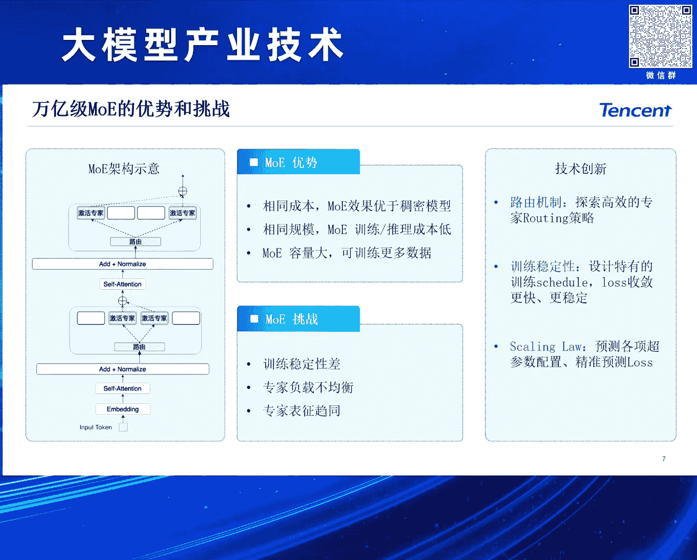
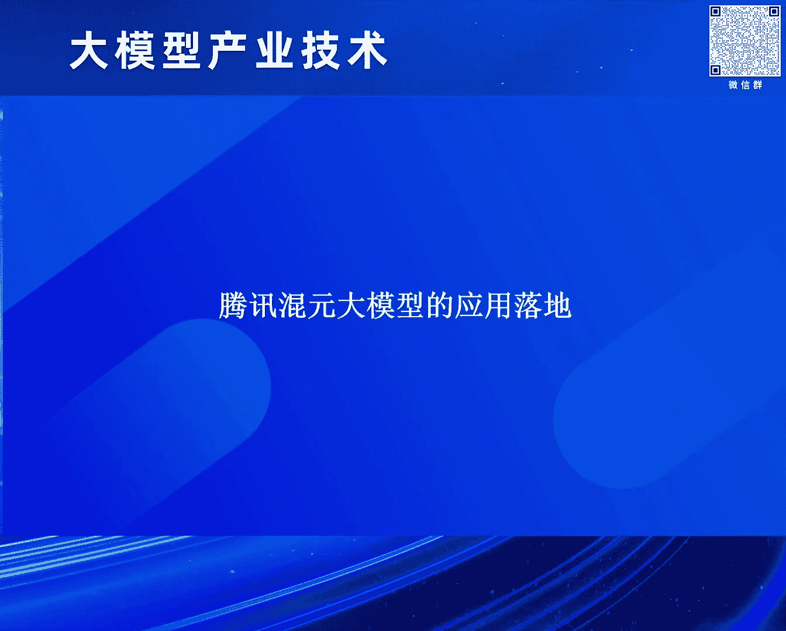
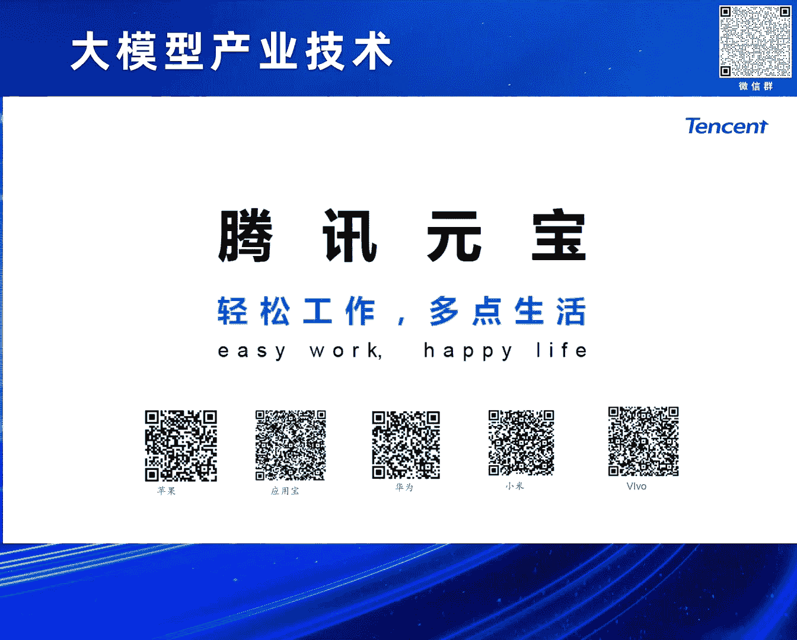

# 2024北京智源大会-大模型产业技术---P5-混元大模型的研发和业务应用之路-康战辉---智源社区---BV1HM4m1U7bM

## 概述
在本节课中，我们将学习腾讯混元大模型的技术研发历程、核心架构特点以及其在公司内外的广泛业务应用。课程内容基于康战辉在2024北京智源大会上的分享，旨在让初学者了解大模型发展的关键路径和实际落地场景。

---

## 大模型技术发展回顾 🔄

上一节我们概述了课程内容，本节中我们来看看大模型技术的发展脉络。

整个GPT的基础结构Transformer并非全新概念。标准的Transformer结构由Google在2017年提出，它是一个包含编码器（Encoder）和解码器（Decoder）的架构。

Transformer结构提出后，业界很快出现了三种不同的技术路径。

以下是三种主要的技术路径：
1.  **双向编码器路径**：以2018年的BERT为代表，采用了双向编码器结构，代表了上一代预训练模型的跨越式发展。
2.  **编码器-解码器路径**：以Google的T5为代表，这种结构一度成为当时最先进的模型。
3.  **仅解码器路径**：以OpenAI的GPT系列为代表，专注于生成任务。

在GPT-3时期，仅解码器路径并未立即显现出压倒性优势，包括腾讯在内的许多团队早期也采用了类似T5的编码器-解码器结构进行预训练模型研发。

理查德·费曼曾言：“如果我不能创造，我就不能理解。”在大模型领域，这可以解读为：**如果模型不能生成，它就不能真正理解**。这正是生成式模型的目标，它通过生成来解决理解和创造的问题，也是OpenAI遵循的核心信条。

OpenAI的成功可归结为四个关键方向的坚持，这为行业发展提供了重要启示。

以下是OpenAI成功的四个关键方向：
1.  **寻找正确的生成模型架构**：从早期的BP神经网络到2017年的Transformer，再到如今业界主流的仅解码器架构。
2.  **解决模型的扩展问题**：模型参数规模的增长速度远超硬件算力提升速度（摩尔定律）。解决方案包括大规模批次训练和低精度计算（如从FP32到FP16、BF16，再到FP8）。
3.  **发展上下文学习能力**：通过元学习（In-context Learning）技术，使预训练模型具备少样本甚至零样本学习能力，仅需任务描述和少量示例即可执行新任务。
4.  **实施对齐与强化学习**：通过指令微调、基于人类反馈的强化学习等技术，像教导孩子一样让模型学会区分对错，提升模型表现的下限。未来可能向自博弈（Self-play）方向发展，类似AlphaGo到AlphaZero的演进。

---

## 混元大模型的研发挑战与体系 🏗️

上一节我们回顾了大模型的技术发展，本节中我们来看看腾讯混元大模型在研发中面临的挑战及其技术体系。

研发大模型在算法、工程和应用层面均存在挑战。工程上需要强大的算力、高性能训练框架和一站式业务平台。算法上涵盖了大语言模型、多模态大模型等多种生成式AI模型。

混元大模型系列支撑了腾讯内部众多业务，并对外通过腾讯云服务千行百业。

以下是混元大模型的核心组成部分：
*   **算力基础**：依托超大规模EGS算力集群，包括星海服务器、自研RDMA网络、GPU集群，并支持国产异构芯片。
*   **训练框架**：自研Angel机器学习框架，支持万卡规模训练，相比DeepSpeed等开源框架，训练速度提升2.6倍，GPU利用率（MFU）达62%，迁移成本降低50%。
*   **推理优化**：自研推理框架比主流开源方案快1.3倍。例如，可将Stable Diffusion文生图的推理速度从10秒优化到3-4秒生成三张图，单图生成可在一秒内完成。
*   **模型家族**：
    *   **大语言模型**：覆盖从7B、13B的中小规模，到早期1760亿参数的稠密模型，再到最新的万亿参数混合专家模型。
    *   **领域模型**：包括代码模型、可信模型、检索增强模型等。
    *   **多模态模型**：混元VL视觉-语言模型，以及开源的文生图DiT模型。

混元的核心是万亿参数规模的混合专家模型。该模型经历了持续优化。

以下是混元大模型的演进与优化：
1.  **起点**：2023年9月推出千亿参数稠密模型，训练了2万亿token。
2.  **升级**：2023年底升级为万亿参数MoE架构，训练数据超过7万亿token。
3.  **优化**：通过采用合成数据、多种训练策略优化、对齐与强化学习算法升级，整体效果累计提升超过50%。

MoE架构已成为行业共识，其优势在于相同计算成本下，效果优于稠密模型，且扩展性更好。

然而，训练超大规模MoE模型存在挑战，包括训练稳定性差、专家负载不均衡、专家功能趋同等。

以下是解决MoE训练挑战的关键技术：
*   **高效路由机制**：设计更智能的专家选择策略。
*   **训练稳定性**：设计专门的训练计划、损失函数和技巧，使训练过程更平滑稳定。
*   **扩展律探索**：针对自身模型结构，从零开始探索数据、模型参数等要素的扩展规律。

长上下文支持已成为行业标配。混元MoE模型支持高效的超长注意力机制。

以下是长上下文支持的技术演进：
1.  **全注意力**：计算复杂度为序列长度的平方。
2.  **滑动窗口**：关注局部上下文。
3.  **外推与优化**：支持百万级上下文长度，并研究几乎无损的量化方案以支持更长上下文。混元Pro版API原生支持百万级上下文窗口。

数理能力是衡量大模型智能水平的关键。混元通过系统化方法提升数理能力。

以下是提升数理能力的方法：
*   **数据合成**：构建自动化的大规模数理数据合成与精炼流程，生成高质量的问答对。
*   **训练策略**：在预训练、有监督微调等不同阶段融入大量数理数据。
*   **方法应用**：采用思维链、程序辅助推理等技术解决高阶数学与推理问题。评测显示，混元在中文数理能力上整体接近GPT-4 Turbo，在小学和初中数学上超过GPT-4。

降低幻觉是提升大模型可靠性的核心。除了扩大模型规模、充分训练和对齐算法，还需解决模型对未知知识的处理问题。

混元引入了AI搜索能力来应对幻觉问题。

以下是混元AI搜索的架构与特点：
*   **信源权威**：整合微信搜一搜、搜狗网页搜索、自建垂类引擎及腾讯生态内容，确保信息权威性和时效性。
*   **智能体架构**：采用基于智能体的规划-执行机制，使大模型从“快思考”转向“慢思考”。
*   **领域精调**：在通用底座上，通过增量预训练和多任务精调，构建搜索领域的专属模型。

---

## 多模态模型与开源贡献 🎨

上一节我们深入探讨了混元大语言模型，本节中我们来看看其在多模态领域的进展。

混元VL多模态模型在中文场景下的整体能力与GPT-4V相当，能完成物体识别、场景理解、逻辑推理和内容生成等复杂任务。

混元文生图DiT模型是中文社区首个原生的开源DiT架构模型。

以下是混元文生图模型的关键优化：
*   **多模态语言模型**：支持多轮交互式编辑和聊天互动。
*   **DiT架构优势**：采用扩散Transformer架构，相比传统U-Net，具有更强的图像与文本信息捕获能力。该开源模型发布三周内获得了超过2300个Star，在业界处于领先地位。

综合评测显示，混元大模型在中文能力上与最新版GPT-4 Turbo总体相当，处于行业第一梯队。

---

## 混元大模型的业务应用落地 🚀

前面我们介绍了混元大模型的技术研发，本节中我们来看看其广泛的业务应用。

混元大模型已接入腾讯公司内部超过600个业务场景。

以下是几个典型的应用场景：
*   **腾讯会议AI助手**：支持会议中的实时问答、会后自动总结摘要和待办事项生成。
*   **腾讯混元ChatBI**：用自然语言进行数据查询、SQL代码生成、表格分析和数据洞察，降低数据分析门槛。
*   **腾讯文档AI助手**：支持文案创作、表格处理、文档格式转换（如转PPT、PDF）等。
*   **腾讯广告妙思**：高效生成广告素材，并利用AI加速素材审核流程，提升广告投放效率。
*   **微信读书AI问书**：支持在阅读过程中通过长按文本，直接针对书籍内容进行提问和获取相关知识。
*   **AI内容创作**：与新华社等机构合作，用于新闻写作、海报配图、创意宣传片生成等。
*   **腾讯元宝APP**：集成AI搜索、长文解析、AI写作、生图生视频等功能的AI助手，主打“轻松工作，多点生活”。

---

## 总结
本节课中我们一起学习了腾讯混元大模型的完整发展路径。我们从大模型的技术发展回顾开始，了解了Transformer架构演进的三种路径以及OpenAI的成功启示。接着，我们深入探讨了混元大模型在应对算法、工程挑战时构建的庞大技术体系，包括其万亿参数MoE架构、长上下文支持、数理能力提升和抗幻觉设计。此外，我们也了解了混元在多模态模型和开源方面的贡献。最后，我们看到了混元大模型在腾讯内外超过600个业务场景中的具体应用，从办公协作到广告营销，从内容创作到个人助手，展现了生成式AI技术强大的落地能力和产业价值。