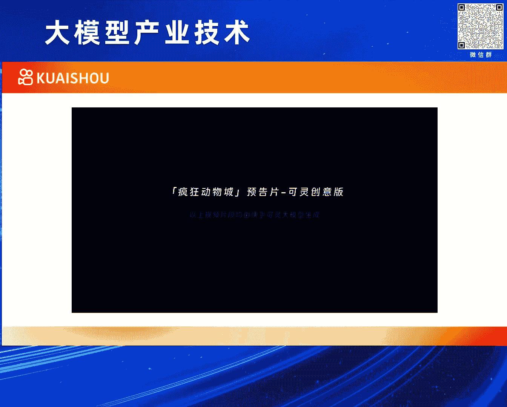
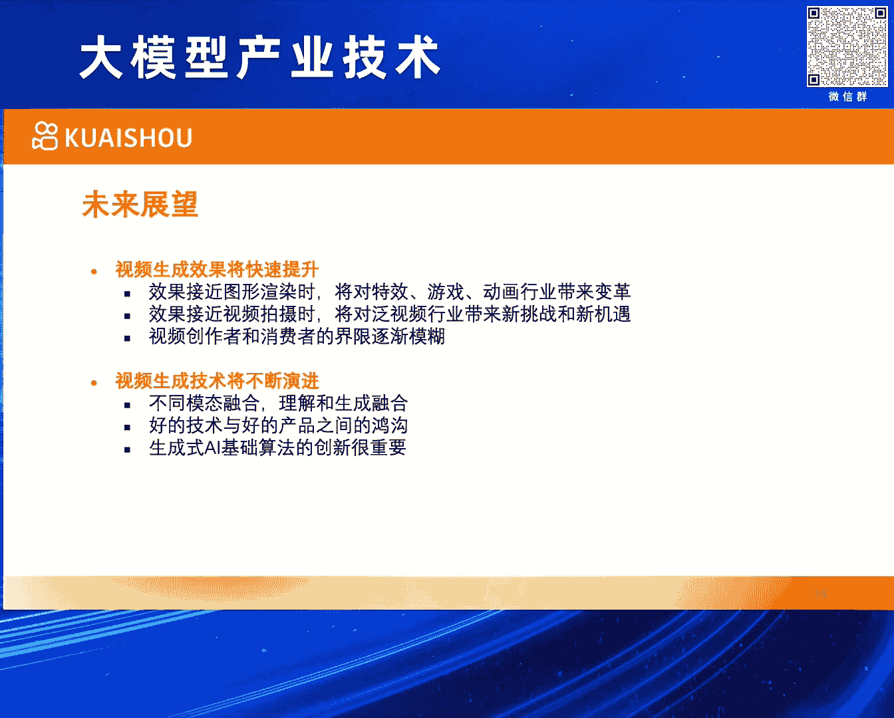

# 2024北京智源大会-大模型产业技术---P6-可灵-KLING--视频生成大模型-万鹏飞---智源社区---BV1HM4m1U7bM
## 课程编号：P6

在本节课中，我们将要学习快手“可灵”（KLING）视频生成大模型的核心概念、技术亮点与设计思路。课程内容基于万鹏飞在2024北京智源大会上的分享整理而成。

---

### 概述：什么是视频生成？

视频生成是通过生成式AI技术，将用户的多模态输入转化为一个视频信号的过程。

用户的输入本质上是多模态的。它可以包括文本、图像、动作描述或其他控制信息。最终输出是一个视频信号，对计算机而言，这是一个在二维空间上叠加了时间维度的三维信号。

用到的技术基础是生成式AI。从数学上可以简略理解为：从某种随机的噪声或信号出发，经过一系列计算和处理，得到一个目标信号。这个目标信号可以被视为在目标分布下的一个采样。

---

### 视频的三种获取方式

上一节我们介绍了视频生成的定义，本节中我们来看看视频信号通常有哪些获取方式。主要有以下三种：

1.  **相机拍摄**
    这是最熟悉的方式，例如用手机录制视频。其本质是将物理世界的光信号转化为像素信号。

2.  **图形渲染**
    例如游戏、动画和电影特效。其本质是将预设好的三维模型及材质信息，通过模拟物理现象的计算，生成像素信号。这个过程主要在计算机内完成，计算大多是确定性的。

3.  **视频生成**
    这是我们本节课讨论的重点。其本质是一种从目标分布中采样样本的技术，样本解码后即成为大家看到的视频。

这三种方式各有优缺点。相机拍摄成本低，但内容自由度受限于现实世界。图形渲染效果精美，但创作门槛极高。视频生成的内容自由度非常高，可以呈现天马行空的想象，但过去其效果的平均水平一直是个挑战。近期的新技术和产品正在有效提升其效果下限。

---

### 视频生成的主流技术路线

了解了视频的不同来源后，我们来看看实现视频生成有哪些技术路径。以下是当前主要的技术路线：

*   **扩散模型**
    这是目前最流行的方式。其核心思路是用一个神经网络去预测噪声。早期常用**CNN**，因其结构适合图像信号。现在更多转向使用**Transformer**，因为它被验证具有良好的扩展性。像Sora和快手的可灵都属于这个范畴。

*   **自回归模型**
    视频信号可以看作带有序列关系的信号，因此用自回归方法建模在概念上也很直接。虽然当前效果可能不如扩散模型，但它也是一个合理的技术路线。

*   **其他生成式AI方法**
    原则上，任何能够将随机信号转化为目标信号的生成式AI方法都可以用于视频生成，例如GAN等。

---

### 快手研发视频生成模型的优势

在探讨了技术路径之后，我们来看看快手公司在这一领域具备哪些独特优势。主要有以下几点：

1.  **天然的应用场景与需求**
    快手是一个拥有近4亿日活跃用户的短视频内容平台，视频创作是核心需求。这为技术研发提供了明确的方向和即时的用户反馈。

2.  **长期的技术积累**
    快手从诞生起就专注于帮助用户进行内容生产创作，在此领域有超过十年的技术积累和实战经验。

3.  **全面的大模型布局**
    快手在大模型领域布局全面，曾推出备受好评的“快意”大语言模型和“可图”文生图模型，为多模态生成奠定了坚实基础。

---

### “可灵”模型效果亮点

接下来，我们正式介绍“可灵”模型。如果用一句话描述，它是一个可以实际体验、且效果呈现了许多Sora级别特性的视频生成模型。

目前，其生成视频在硬指标上分辨率可达1080P，时长可达数分钟。线上体验版本为720P分辨率、5秒时长。自发布以来，申请体验量非常巨大。

以下是其六个核心效果亮点：

*   **大幅度的合理运动**
    视频生成与图像的核心区别在于时间维度。可灵通过3D时空联合注意力机制建模复杂运动，生成的视频中物体运动幅度大且合理，例如奔跑的马匹、弹吉他的熊猫。

*   **分钟级的长视频生成**
    模型具备生成分钟级长视频的能力，并能保持场景、主体和风格的高度一致性，例如展现四季变换的骑行视频或长达2分钟的火车窗外景色更替。

*   **模拟物理世界特性**
    生成的视频内容符合物理规律，例如流体倾倒、水面上升、用筷子夹取和咀嚼面条等复杂动态，体现了模型对真实世界的深刻理解。

*   **丰富的概念组合与想象力**
    能够将现实中不存在的概念进行合理组合并可视化，例如“小猫开跑车”、“杯子里的火山爆发”，完美呈现天马行空的想法。

*   **电影级的画面质感**
    生成的视频画质精美，细节丰富，动态自然，例如水中游动的鱼、花朵绽放的过程，画面品质达到较高水准。

*   **支持自由的视频宽高比**
    模型可以指定任意宽高比进行输出，并自适应生成合适的内容，例如生成适合手机竖屏或电脑横屏观看的视频。

---

### “可灵”模型的技术设计

看完了令人印象深刻的效果，本节我们来深入了解一下支撑这些效果背后的关键技术设计。主要包括以下几个方面：

1.  **隐空间的视频编码**
    直接在像素空间处理视频信号计算消耗巨大。可灵设计了一套**3D VAE**结构，能对视频进行高效压缩，在减少信息冗余的同时保持高画质和生成能力。

2.  **Transformer基础网络**
    采用**Transformer**结构进行扩散过程的噪声预测，并验证了其良好的可扩展性，这是大模型能力持续提升的关键。

3.  **时空信息联合建模**
    使用**3D时空联合注意力机制**，将时间和空间维度统一建模，扩大了模型的感受野，从而增强了其对复杂运动的建模能力。

4.  **文本编码扩展**
    利用大语言模型相关能力对输入文本进行编码，确保模型能够精准理解和响应复杂的文本指令。

5.  **高质量数据体系**
    构建了高度自动化的视频数据平台和精细的视频标签体系，用于筛选高质量训练数据。同时，研发了专门的视频描述生成模型，为视频数据生成对应的文本描述。

6.  **数据驱动的效果评估**
    建立了数据驱动的评估模型，能够高效、客观地评估新模型迭代的效果，大幅提升研发效率。

7.  **高效计算与训练策略**
    *   **算法**：采用**流匹配**等更先进的扩散模型求解方案，在效率和效果上具有优势。
    *   **训练**：使用大规模分布式训练集群。训练策略上采用分辨率由低到高、结合数据量与品质的方案。
    *   **推理**：模型具备良好的能力扩展性，支持不同宽高比输出、时序延展（延长视频、图生视频、插帧）以及多模态输入控制。

---

### 未来展望与总结

最后，让我们展望一下视频生成技术的未来发展趋势。

**效果与生态层面：**
视频生成的效果正在快速提升，部分案例已接近实拍或渲染质量。这将大幅降低视频创作门槛，提升创作效率，使得视频消费者与创作者的界限逐渐模糊，从而繁荣整个视频内容生态。

**技术与产品层面：**
技术仍在快速发展，不同模态以及理解与生成任务正在融合。需要认识到，拥有好的技术不等于拥有好的产品，两者之间存在巨大的鸿沟。将技术转化为成功的产品，需要在人机交互、工作流集成、满足细分需求等方面做大量工作。同时，生成式AI基础技术的持续创新仍是推动一切进步的根本。

---

### 课程总结

本节课中，我们一起学习了：
1.  **视频生成**的定义及其作为第三种视频获取方式的潜力。
2.  当前视频生成的**主流技术路线**，特别是基于Transformer的扩散模型。
3.  快手研发“可灵”模型的**优势**，包括场景、数据和技术积累。
4.  “可灵”模型在**运动幅度、视频时长、物理模拟、概念组合、画质和格式**等方面的六大效果亮点。
5.  支撑这些效果的**关键技术**，如3D VAE编码、时空联合注意力、高质量数据体系及高效训练策略。
6.  视频生成技术的**未来展望**，包括其对创作生态的影响以及技术产品化面临的挑战。

视频生成技术正在打开一扇新的大门，让每个人的创意都能更便捷地以动态视觉形式呈现。