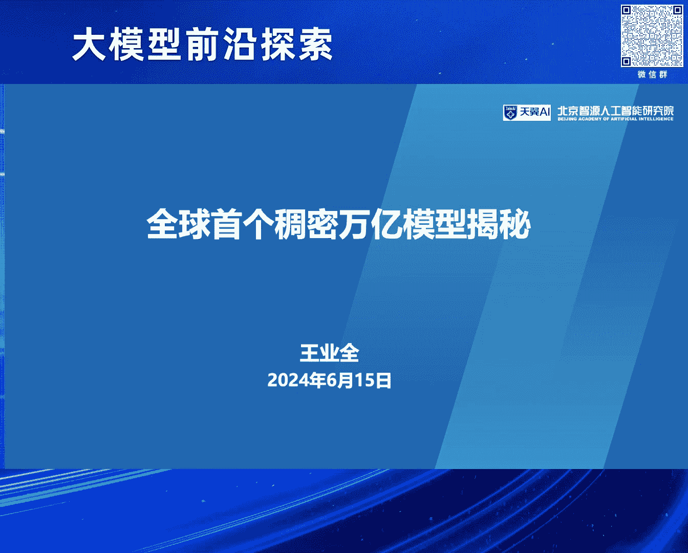
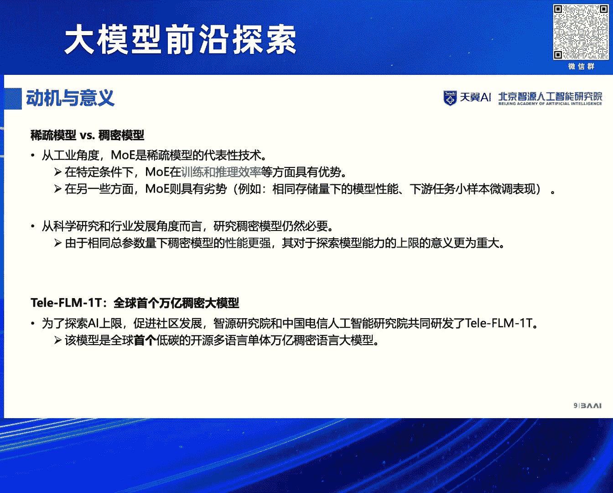
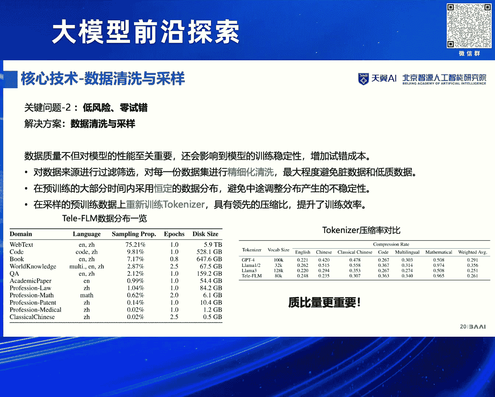
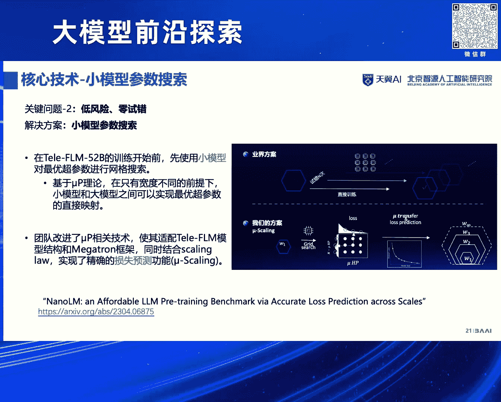
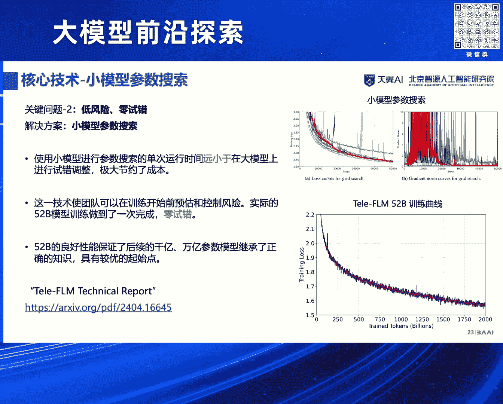
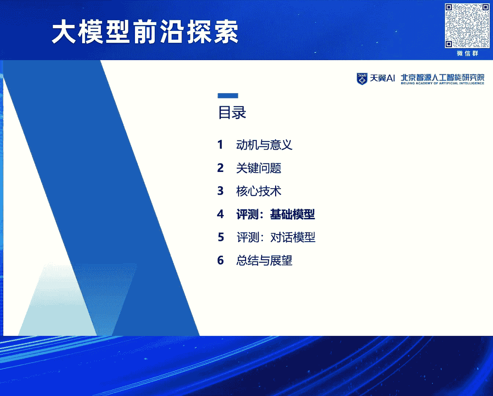
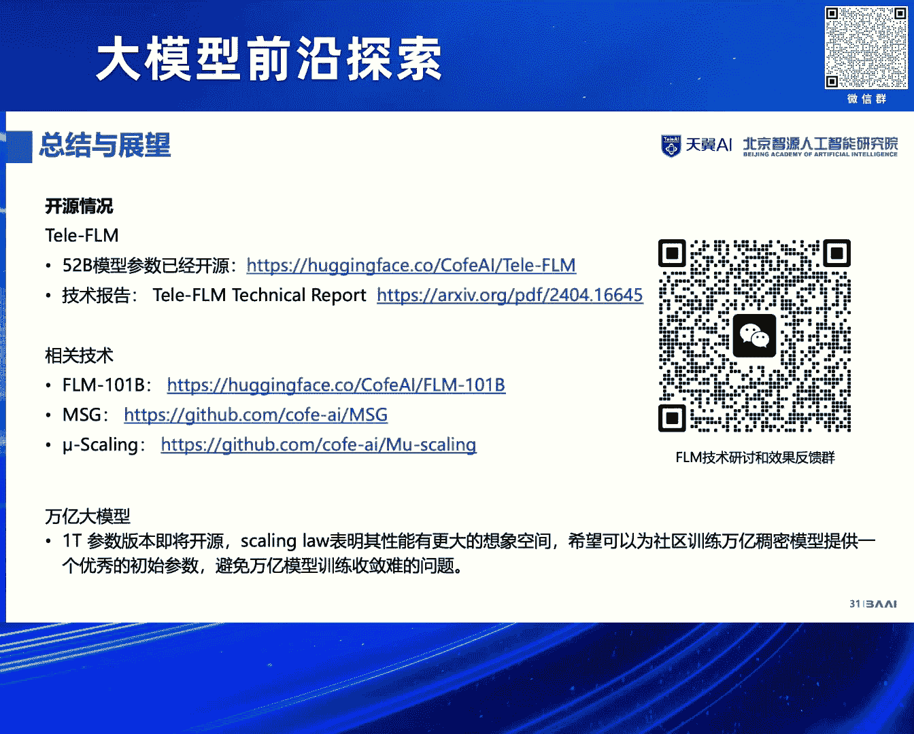

# 2024北京智源大会-大模型前沿探索---P2-全球首个稠密万亿模型揭秘-王业全---智源社区---BV1yS411A73A

在本节课中，我们将跟随王业全博士的分享，深入探讨全球首个稠密万亿参数大模型 **TeleFM-ET** 的研发动机、核心技术、关键挑战与评测结果。我们将学习到如何在大数据、大算力的背景下，通过创新的“生长式预训练”等技术，高效地训练出性能强大的稠密模型。

---

## 动机与意义 🎯

上一节我们回顾了大模型发展的宏观背景，本节中我们来看看研发万亿稠密模型的具体动机和意义。

首先，我们回顾大模型的发展脉络。OpenAI 是生成式大模型的核心驱动者。需要强调的观点是：GPT 能力的最大来源是其强大的**语言大模型**。后续的指令微调（SFT）、强化学习（RLHF）等阶段，主要目的是与人类价值观对齐，而非灌输更多知识。

成功训练大模型依赖三大支柱：**大数据**、**大算力**和**强算法**。

*   **大数据**：当前语境下的“大数据”与过去有本质区别。过去千万或亿级数据量已算庞大，而现在需要穷尽整个互联网的文本量，这带来了巨大的技术挑战。
*   **大算力**：过去依赖超算集群，现在则需要成千上万的GPU进行并行计算。例如，GPT-3在2020年就使用了上万张显卡进行训练。
*   **强算法**：算法创新依然至关重要。以LLaMA为例，它在GPT路线上的某些“细微”改进（在传统深度学习时代可能被视为“技巧”），却带来了模型能力的巨大提升，这值得算法研究者和工程师高度重视。

在这三大支柱的支撑下，我们可以训练出基础的语言大模型。在此之上，通过微调和对齐，就能得到常见的对话模型，如ChatGPT系列。

语言大模型的本质非常简单：**用前K个词预测第K+1个词**。例如，对于句子 “the cat sat on the mat”，模型会自左向右依次预测下一个词。这个简单本质的背后，蕴含着深刻的原理：当上下文足够长时，精准预测未来词汇的能力可能就包含了强大的智能。

对于产业界的朋友，常听到“模型参数规模”（如70亿、1000亿参数）。这里给出一个通俗解释：假设有一个简单模型 `y = a1*x1 + a2*x2 + a3*x3 + a4*x4 + b`，其中 `a1, a2, a3, a4, b` 就是模型参数，参数量为5。用历史数据拟合这个模型以得到参数估计值的过程，就类比于大模型的训练。当然，实际训练是极其复杂的系统工程。

以下是OpenAI的技术演进路线，它揭示了行业趋势：
*   2019年2月：GPT-2
*   2020年5月：GPT-3 (1750亿参数)
*   2022年12月：ChatGPT
*   2023年：GPT-4 (网传1.8万亿参数)
*   未来：GPT-5 (网传达百万亿参数量级)

OpenAI的路线说明了 **Scaling Law（缩放定律）** 的重要性：随着模型参数和数据量的增加，模型性能会持续提升，且目前尚未看到边界。这正是我们训练万亿模型的**核心动机**——探索模型规模带来的能力提升上限。

目前业界共识是模型规模仍不足够。国内外主流模型如千问1.5（千亿级）、Mixtral（1400亿）、DeepSeek（2000亿）、Grok（3000亿）、LLaMA 3（正在训练4000亿）等，都在沿此路线前进。

一个关键问题是：**稀疏专家混合模型（MoE）与稠密模型（Dense Model）的对比**。网传GPT-4是1.8万亿的MoE模型（由8个约3000亿的专家模型组成）。为何OpenAI选择MoE而非稠密模型？

回顾历史，智源于2021年发布了1.75万亿的MoE模型“悟道2.0”，但后续很多模型又回归稠密架构。原因在于：
*   **工业角度**：MoE在训练和推理效率上有优势。
*   **性能角度**：在相同参数量下，稠密模型在下游任务、小样本微调等方面的性能**显著优于**MoE模型。

因此，探索稠密模型的能力上限更为重要。此外，从科学研究和行业发展的角度（如对时效性要求不高的AI for Science领域），研发能力更强的稠密模型也很有必要。

综上所述，为了探索大模型能力上限并促进社区发展，智源研究院与中国电信人工智能研究院联合研发了 **TeleFM-ET**——全球首个低碳、多语言的单体万亿稠密语言大模型。

---

## 训练万亿模型的关键问题 ❓

了解了研发动机后，我们来看看实现这一目标面临哪些核心挑战。

以下是训练万亿稠密模型必须解决的三个关键问题：

1.  **高效训练**：据估算，即使拥有庞大的千卡甚至万卡集群，训练一个稠密万亿模型也可能需要**三年到十年**。一旦因设置或数据错误导致训练失败，时间成本将无法承受。这是目前万亿模型多采用MoE架构的根本原因。因此，我们的核心问题是：**如何在有限的算力内，高效完成既定规模的稠密模型训练？**

2.  **超参数敏感性与风险控制**：大模型训练对超参数（如学习率LR）极其敏感。不合适的设置会导致高昂的试错成本，最终模型性能不可预期。关键问题是：**能否形成一套成熟的方法论，在训练前就确定最优超参，实现训练过程的“零调整、零试错”？**

3.  **对开源社区的贡献**：我们坚持开源路线，希望将探索出的核心技术、模型参数等开放给社区，推动整体进步。因此，**确保核心技术完全开源**是我们的另一个关键目标。

---

## 核心技术揭秘 ⚙️

面对上述挑战，研发团队是如何攻克难关的呢？本节将揭秘背后的核心技术。

首先，需要更新对大模型的认知：当前的大模型不仅仅是一个算法，更是一个**复杂的系统工程**。它涉及底层硬件、数据、框架、效率优化等多个层面。

以下是核心技术的几个维度：

*   **数据质量至关重要**：我们的核心经验是：**无论多么重视数据质量都不为过**。数据获取、清洗、去重、打分每个环节都至关重要。特别是“如何定义高质量数据”是一个根本性问题（例如，广告、特定类型的信息是否一定是低质量数据？）。数据去重的挑战随规模指数级增长，处理全网数据是极大的系统工程。
*   **框架与效率优化**：对于大多数团队，直接采用成熟的优化技术即可，如BF16精度、Flash Attention、梯度检查点（Gradient Checkpointing）等。效率提升方面，我们重点采用了 **Moe Gating（专家门控）** 和 **生长技术（Growth）**。

基于这些认知和技术积累，我们发展出了FM系列模型。其演进分为三代：
1.  **第一代（预言代）**：针对语言模型的事实幻觉问题（如“奥巴马的妻子是张女士”语法正确但事实错误），我们在训练中引入**因果信号**，区分事实与语法，提升生成质量。
2.  **第二代**：针对大模型训练成本高的问题，我们研发了**生长技术**来训练千亿模型。在去年9月，仅用约70万元人民币的成本就训练出了达到GPT-3水平的千亿级模型。
3.  **第三代（TeleFM-ET）**：融合前两代技术，与中国电信合作推出全球首个万亿稠密模型。它采用**损失预设技术**保证训练稳定性，评测显示其语言能力接近GPT-4，且所有核心技术均已开源。

**生长式预训练（Growth Pretraining）** 是本次的核心突破。传统训练中，模型规模从始至终固定不变。而生长技术的思路是：**目标虽是训练千亿/万亿模型，但我们从较小的模型（如十亿级）开始训练，逐步“生长”到目标规模**。

这引出了两个核心问题：
1.  生长对模型能力是增益还是损害？
2.  到底能节省多少成本？

成本节省预估有三种情景（B, C, D），我们选择了节省大于50%的D策略。令人惊喜的是，实验证明生长技术**不仅没有损害模型能力，反而有微弱提升**。原因在于：小模型初期优化空间小，优化效率高；通过一系列技术手段（如权重保真），在生长过程中能很好地保留并提升能力。

生长可以在多个维度进行：**隐藏层宽度、注意力头数量、模型层数、FFN中间层维度**。在万亿模型训练中，我们成功实现了所有维度的同时生长。

生长算法的核心是**生长算子**和**生长流程**。具体细节可参考开源的技术报告和代码。

以下是TeleFM-ET万亿模型的**具体生长路线**：
1.  **第一阶段**：训练一个500亿参数的模型，使用2.0T tokens的数据量。
2.  **第二阶段**：将500亿模型生长到千亿规模，使用0.3T tokens数据量进行训练。
3.  **第三阶段**：将千亿模型生长到万亿规模，使用约0.015T tokens数据量完成训练。

**训练框架优化**同样关键。我们集成了3D并行、序列并行、异构存储、自动评估等技术，并将生长技术集成到了Megatron框架中。最终，联合研发团队使用**112台A800 GPU，在4个月内**完成了从百亿、千亿到万亿模型的训练。

**数据策略**方面，我们公开了完整的数据配比信息（当前很多模型已不再公开此信息）。关键观察有三点：
1.  对数据源进行严格清洗，最大限度避免脏数据和低质数据。
2.  训练中采用恒定的数据分布，避免中途调整引发不稳定。
3.  在采样后的预训练数据上重新训练了Tokenizer，获得了领先的压缩比，提升了训练效率。
核心结论：**质比量更重要**。即使目标是优秀的中文模型，我们数据中英文占比约为2:1，中文仅占约30%，但因保证了质量，最终模型效果出色。

**超参数搜索**方面，我们实现了“小模型搜索，大模型应用”的方法论。在训练开始前，使用非常小的模型进行大量的超参数网格搜索，找到的最优参数可以直接应用于后续大规模的模型训练，并能保证收敛。这使我们实现了万亿模型训练中的 **“零调整、零试错”** 。同时，52B小模型的优秀性能也为后续千亿、万亿模型提供了良好的知识起点。

---

## 模型评测结果 📊

核心技术保障了模型的成功训练，那么它的实际表现如何呢？本节我们来看详细的评测结果。

评测分为**基础语言模型**和**对话模型**两部分。

**基础模型评测**最直观的指标是**损失函数值（Loss）和困惑度（PPL）**。
*   **中文评测**：TeleFM是当前**最优的中文基础模型**，优于千问1.5 72B和LLaMA 3 70B。
*   **英文评测（BPB指标）**：TeleFM 52B的英文能力接近LLaMA 3 70B。值得注意的是，我们的训练数据量为2T tokens，参数量为52B；而LLaMA 3 70B的数据量为15T tokens。我们的模型表现超过了包括LLaMA 2 70B在内的其他所有对比模型。

**对话模型评测**主要针对中文能力，包含外部和内部评测。
*   **外部评测（AlignBench）**：结果显示，我们模型的语言能力特别强，基本达到**GPT-4中文语言能力的96%**，总体能力达到GPT-4的80%。需要说明的是，我们的模型仍是纯语言模型，而GPT-4是多模态模型，在多模态能力上不可比。
*   **内部评测（TeleEval）**：显示中文对话能力达到**GPT-4的93%**，与外部评测结果高度吻合。

---

## 经验总结与展望 🔮

最后，我们来总结本次万亿模型研发的核心经验，并展望未来。

以下是我们的主要实验经验：

1.  **数据方面**：质量与数量并重，且**质量优先**。我们的实践表明，即使中文数据比例不高（约30%），只要保证了高质量，模型效果依然出色。
2.  **超参数方面**：基于小模型的**网格超参数搜索**非常有效，能节省大量试错成本，避免巨额算力浪费。
3.  **训练效率与稳定性**：监控损失（Loss）曲线是关键。实践表明，损失曲线偶发的“尖峰”是正常的，模型大概率能够自我修复。需要持续观察梯度范数（Gradient Norm），它与损失曲线的关系复杂。需要警惕的是**持续上升的梯度范数**，这可能导致训练发散。

**开源情况**：目前所有核心技术均已开源。社区可以通过相关渠道获取技术细节、参与研讨和反馈。

---

## 总结

本节课中，我们一起学习了全球首个稠密万亿模型TeleFM-ET的研发全貌。我们从大模型发展的**动机**出发，探讨了面对**高效训练、超参敏感、开源贡献**等关键问题的挑战。随后，深入揭秘了以**生长式预训练**为核心的**系统工程化解决方案**，包括对数据质量的极致追求、创新的生长算法、以及小模型超参搜索等方法。评测结果表明，该模型在中文基础能力和对话能力上均达到了接近GPT-4的顶尖水平。最后，我们总结了**数据质量优先、超参预搜索、监控训练稳定性**等宝贵经验。这项研究不仅验证了Scaling Law在稠密模型上的持续有效性，也为社区提供了全套开源技术方案，推动了大模型技术的探索与发展。