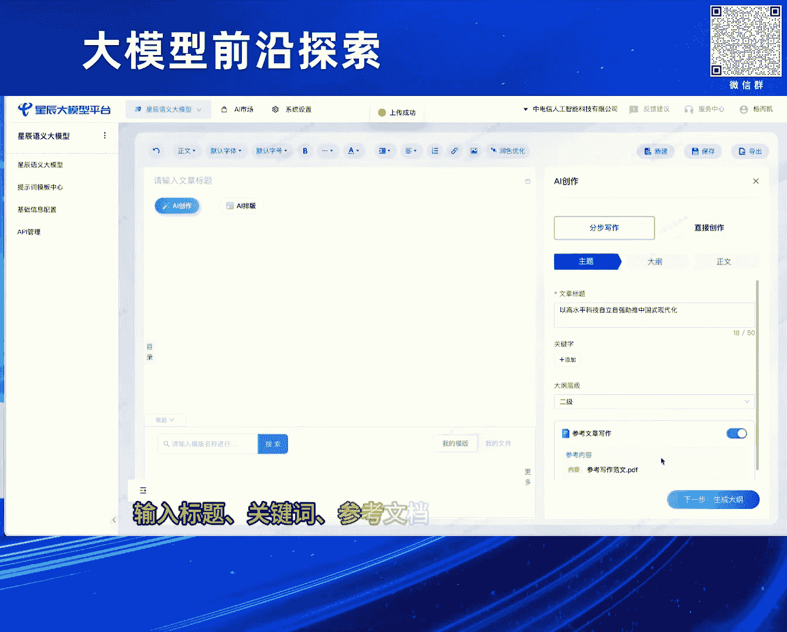
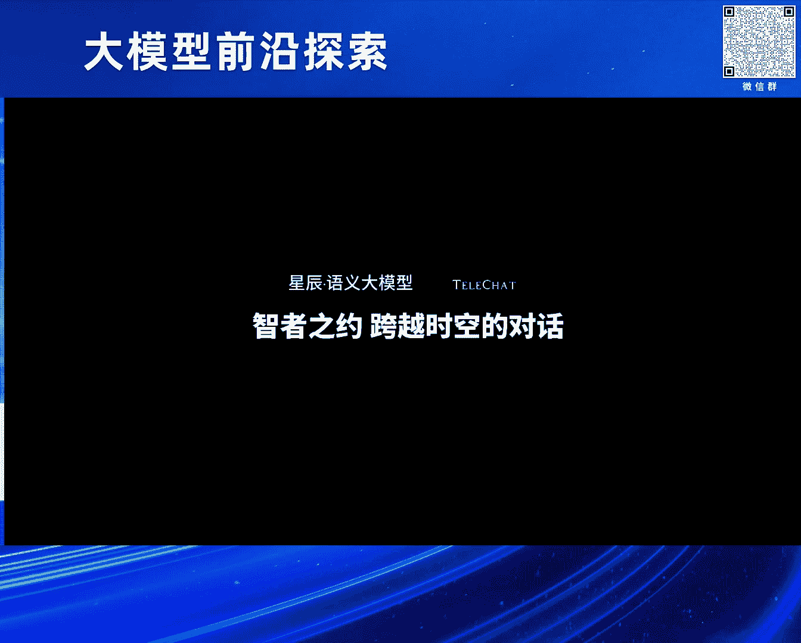
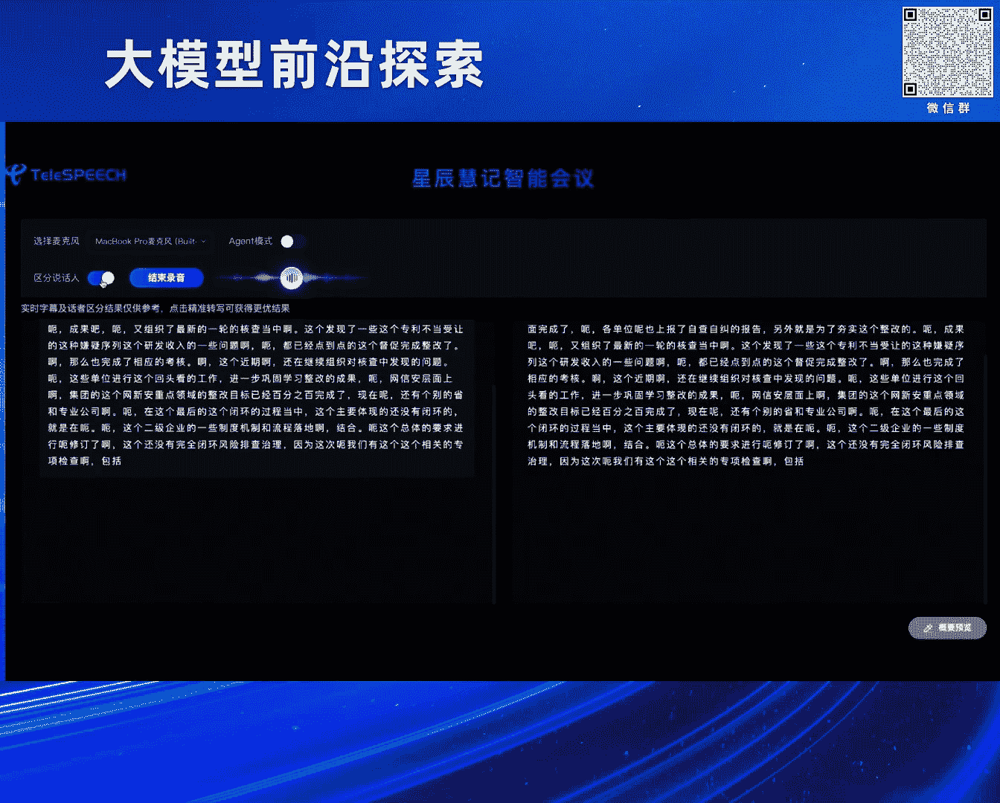
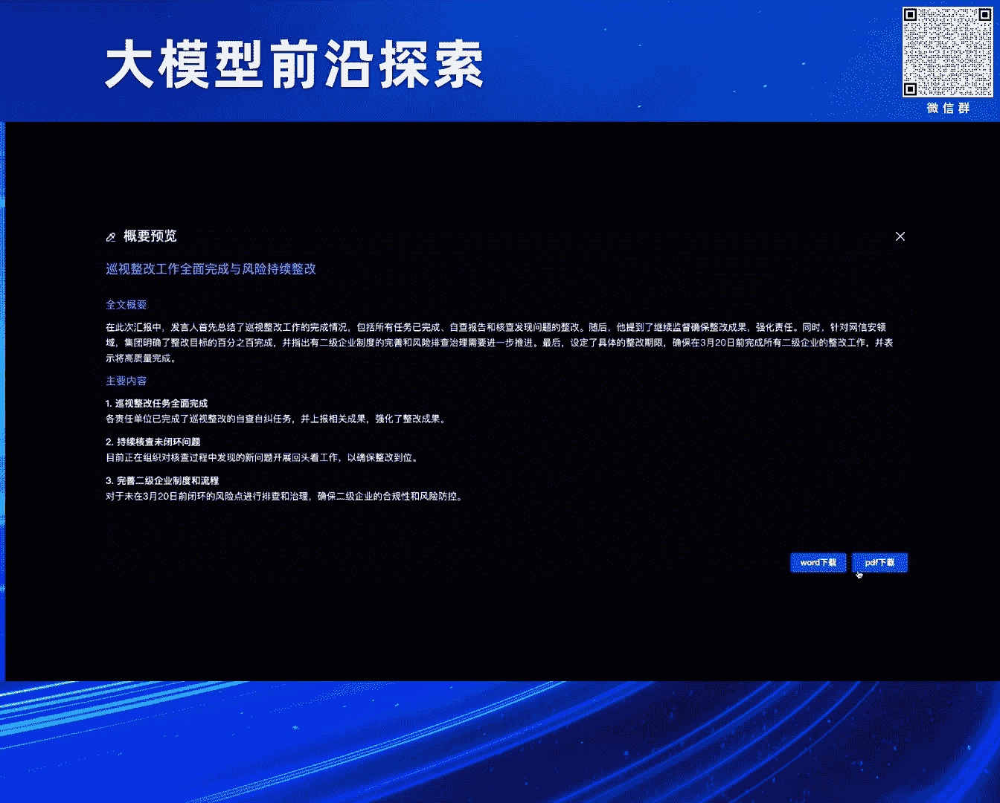
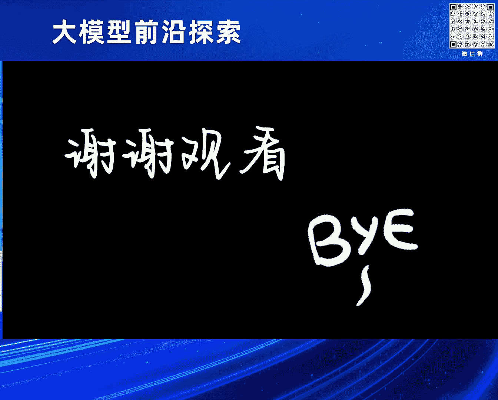

# 2024北京智源大会-大模型前沿探索---P3-大模型精细化微调和对齐方案-宋双永---智源社区---BV1yS411A73A

在本教程中，我们将学习大模型精细化微调和对齐方案的核心概念与实践方法。课程内容基于中国电信人工智能研究院宋双永博士的分享，涵盖从数据质量优化到模型对齐，再到场景化应用的全过程。

---

## 第一部分：大模型精细化微调 📈

上一节我们介绍了课程的整体框架，本节中我们来看看大模型精细化微调的具体思路。

在模型微调阶段，数据策略经历了从“数量取胜”到“质量为王”的转变。早期阶段，为了快速追赶，研究者倾向于收集海量数据。例如，在2023年初，训练数据量常以百万甚至千万条计。然而，后续研究发现，使用少量但高质量的数据集（如仅1000条）也能训练出效果出色的模型。这促使业界重新思考数据数量与质量的平衡。

以下是数据策略转变的两个核心对比：

*   **数量取胜阶段**：数据量巨大，但可能缺乏全面性。例如，即使拥有数千万条数据，若其中缺少数学类数据，模型的数学能力将存在短板。此阶段数据格式多样，答案风格不统一，不利于模型高效学习。
*   **质量为王阶段**：追求数据的高质量与全面性。数据量可能较少，但要求覆盖尽可能多的能力维度，且同类问题的答案格式需尽量规范统一，以降低模型学习难度。

此外，需注意基础模型训练数据与微调数据的配合。若基础模型在某领域数据不足，仅靠微调阶段强行补充，可能导致模型产生严重的“幻觉”问题。因此，提升微调数据质量的同时，也需审视并完善基础模型的数据全面性。

---

## 第二部分：高质量数据筛选方法 🔍

上一节我们探讨了数据质量的重要性，本节中我们来看看如何从海量数据中筛选出高质量的部分。

数据筛选方法主要分为两类：通用型方法和任务指向型方法。

以下是几种常见的数据筛选方法：

*   **IFD方法**：一种通用筛选思路。其核心是计算同一条数据在“有提示”和“无提示”两种情况下模型生成答案的得分差值。差值越大，表明数据质量越高，因为合理的提示理应带来更好的输出。但该方法在两种情况下得分都极高或极低时容易误判。
*   **Super-Floating方法**：在IFD基础上改进，旨在提升筛选效率。它尝试使用小参数模型进行数据过滤，再将结果用于大模型训练，但会因模型差异引入一定误差。
*   **NGAS方法**：一种任务指向型方法。它评估一个候选样本加入训练后，对一组固定测试样本的损失降低情况（即训练增益）。通过计算产生正增益的样本比例来给候选样本打分。
*   **LESS方法**：同样是任务指向型方法。它直接评估候选样本的梯度方向对降低测试集损失的程度。实践表明，在重点任务上，LESS方法的效果通常优于NGAS。

基于上述方法，可以构建一个针对重点能力（如逻辑推理、认知理解等）的数据优化流程。该流程结合数据筛选与拒绝采样等技术，并需在迭代中不断优化不同能力维度数据的混合配比，以实现通用能力的协同提升。

经过精细化微调优化后，模型的综合对话能力可得到显著提升（例如提升约8%），尤其在逻辑推理、缓解幻觉、数学计算等关键短板上进步明显。

---

## 第三部分：大模型偏好对齐 🤝

上一节我们介绍了如何通过精细化微调提升模型能力，本节中我们来看看如何让模型的输出更符合人类的偏好。

偏好对齐，狭义上指在通用微调之后，进一步让模型学习人类的喜好，以生成更符合人类期望的结果。目前主流方法如DPO，其学习方式与SFT有本质区别。

以下是SFT与DPO的核心区别：

*   **SFT**：可视为**点对点**学习。模型直接学习每一条给定的问答数据，目标是将给定的答案模式拟合好。
    *   `Loss_SFT = -log P(答案 | 问题)`
*   **DPO**：可视为**成对对比**学习。模型同时看到针对同一问题的“好答案”和“坏答案”，通过比较来学习人类的偏好。
    *   `Loss_DPO = -log σ(β * (log P(好答案|问题) - log P(坏答案|问题)))` 其中σ为sigmoid函数，β为调节参数。

DPO实践通常采用迭代方式进行：
1.  使用SFT模型作为初始模型。
2.  用该模型为一批问题生成多个候选答案。
3.  人工标注这些答案的优劣，形成“好-坏”答案对。
4.  使用这些成对数据通过DPO目标函数训练模型，得到新版本的模型。
5.  重复步骤2-4，迭代优化，使模型输出不断逼近人类偏好。

通过DPO对齐，可以在逻辑推理、安全问答、特别是缓解事实性幻觉等方面，进一步显著提升模型的表现。

---

## 第四部分：场景化能力建设与应用 🚀

上一节我们探讨了让模型更“听话”的对齐技术，本节中我们来看看如何将这些技术转化为实际的产品和应用。

基于前述技术积累，中国电信已将一系列模型开源，并完成了对多种国产化芯片的适配。在应用层面，重点打造了多个场景化能力。

以下是四个典型的落地应用场景：

*   **行文写作（星辰绘笔）**：模拟人类写作过程，先根据题目和参考文献生成大纲，用户可修改大纲，再基于大纲和参考文献生成详细文章，并支持句子的扩写、续写和改写。
*   **智能客服**：包含在线自动问答与离线辅助人工客服两大功能。其中，“大模型知识采编”能力利用统一模型，从非结构化的产品文档中精准抽取关键信息，替代了传统上需要为每类信息单独训练小模型的繁琐流程，极大提升了效率。
*   **辅助经营分析**：属于智能取数的特定应用。实现从数据自动查询、结果可视化到自动分析与报告生成的全流程，是当前大模型落地的重要方向。
*   **高精度会议纪要生成**：在保证高精度语音转写和说话人分离的基础上，利用大模型生成会议整体摘要以及每位发言者的要点总结。

---

## 总结 📝

本节课中我们一起学习了：
1.  **精细化微调**的核心在于从追求数据数量转向追求数据质量与全面性，并介绍了IFD、LESS等数据筛选方法。
2.  **偏好对齐**通过DPO等成对对比学习方法，使模型输出更符合人类喜好，尤其在缓解幻觉方面效果显著。
3.  **技术落地**需要将模型能力与具体场景结合，如行文写作、智能客服、数据分析等，并通过产品化实现价值。

通过数据质量优化、偏好对齐迭代以及深入的场景化打磨，大模型的能力得以不断精进，并最终服务于多样化的实际需求。