# 2024北京智源大会-大模型前沿探索---P4-大小模型协同训练初探-敖翔---智源社区---BV1yS411A73A
## 课程编号：P4

在本节课中，我们将要学习大小模型协同训练的基本思想、两种核心范式及其具体应用。我们将探讨在资源有限的情况下，如何利用大语言模型作为工具来辅助和增强传统小模型的训练与性能。

---

### 大模型时代的背景与挑战

上一节我们介绍了课程的整体目标，本节中我们来看看当前大模型热潮的背景以及我们面临的现实挑战。

生成式人工智能大模型（如GPT-4、SORA）的出现，以其强大的生成、意图理解和分析推理能力，深刻改变了人工智能的研究格局。然而，构建和训练这类大模型需要海量的算力、数据以及工程团队，这通常是大型科技公司或拥有雄厚资源的机构才能承担的。

对于高校或小型研究机构而言，既缺乏大规模算力，也缺少特定行业的专有数据积累。因此，一个可行的思路是将大模型视为一种高级工具，用以辅助我们日常关于小模型的研究。这便催生了“大小模型协同训练”这一研究方向。

---

### 小模型的持续价值

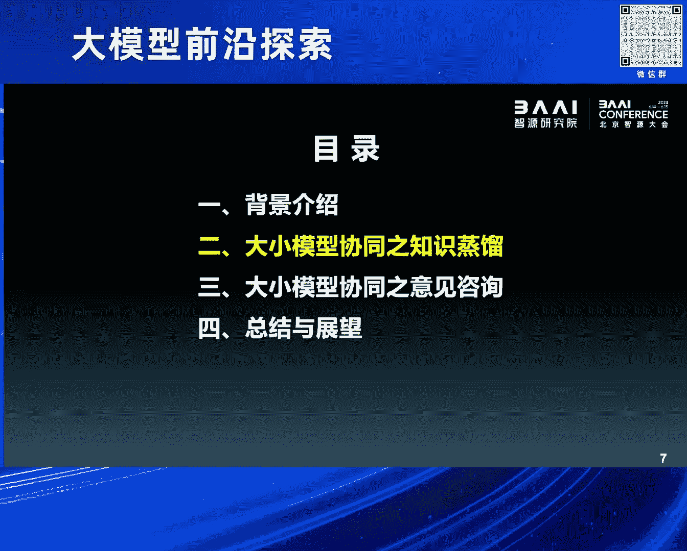

上一节我们提到了利用大模型的必要性，本节中我们来看看为什么小模型在当今时代依然不可或缺。

在大模型出现之前，人工智能研究长期专注于各种“小模型”。例如，处理时序数据常用**LSTM**，处理关系数据常用图神经网络**GNN**，图像生成领域则有**GAN**模型。这些模型在各自的专业领域内都曾是或仍是性能卓越的代表。

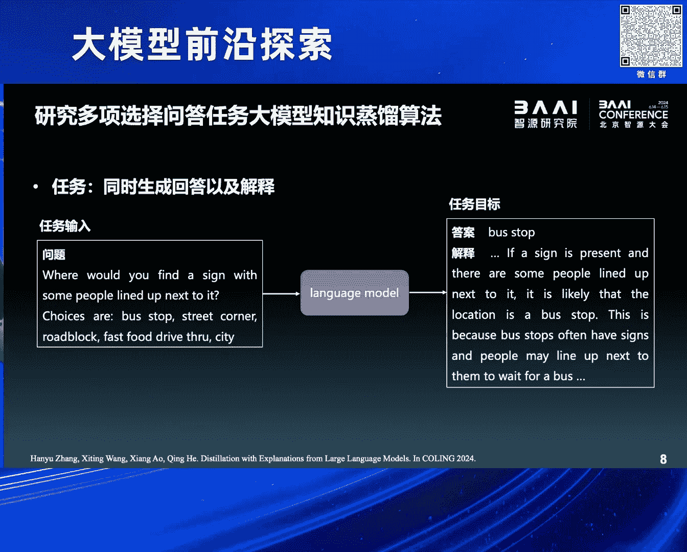

大模型的出现并未完全取代小模型，原因有二：
1.  **端侧轻量化部署**：大模型参数量巨大，计算耗电，难以在手机等终端设备上高效、隐私安全地运行。
2.  **特定专业任务**：在一些非常专业或要求输出严格一致的领域，大模型的生成式、灵活性特点可能导致表现不佳或结果不稳定。

因此，当前的研究重点之一是如何让大模型指导并优化小模型，使其在新时代发挥更大作用。

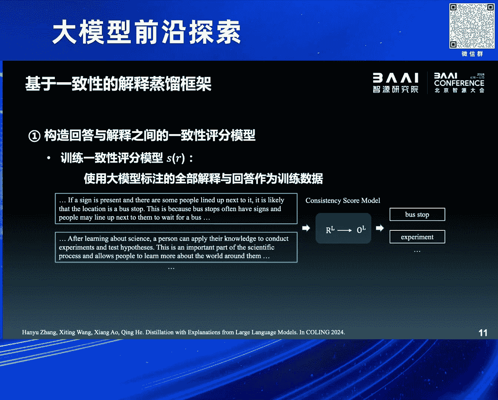

---

### 协同训练范式一：大模型作为教师（知识蒸馏）

上一节我们明确了小模型的价值，本节中我们来看看第一种协同训练范式——知识蒸馏。

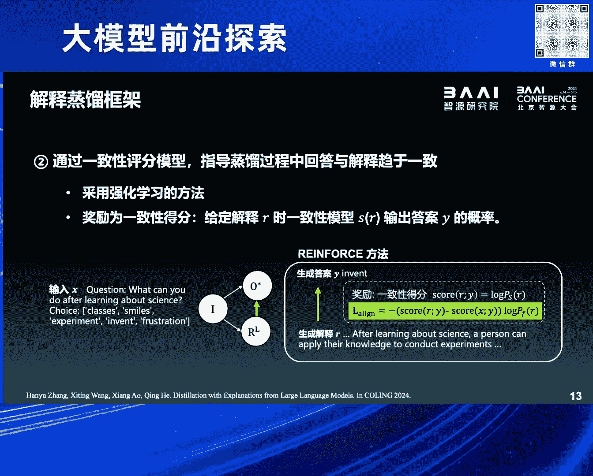

知识蒸馏是一种传统思路，其核心是让大模型充当“教师”，小模型作为“学生”，通过模仿学习来优化小模型。我们以一个“问答-解释”任务为例进行探索。

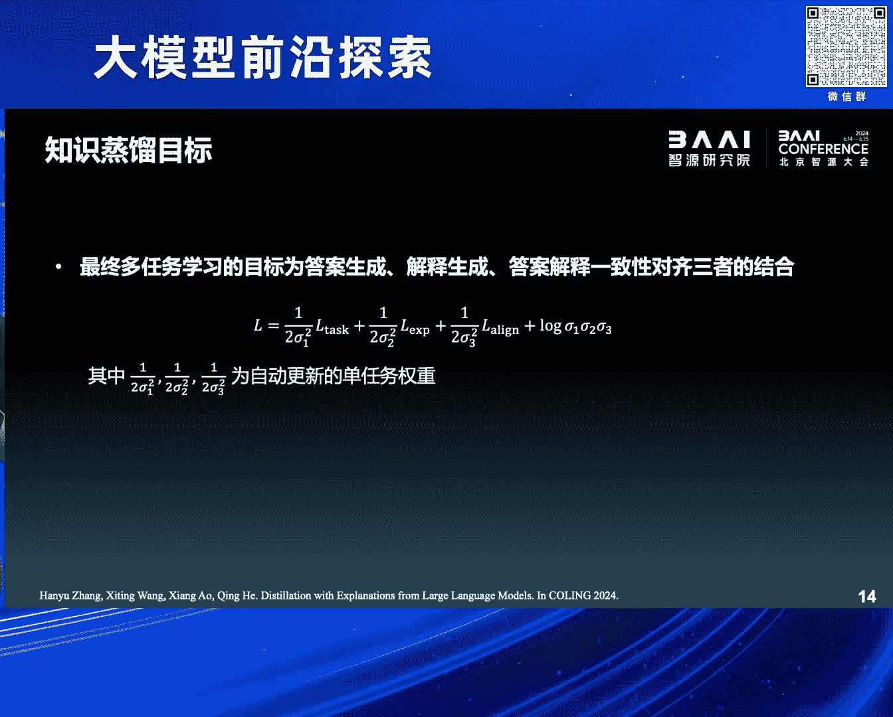

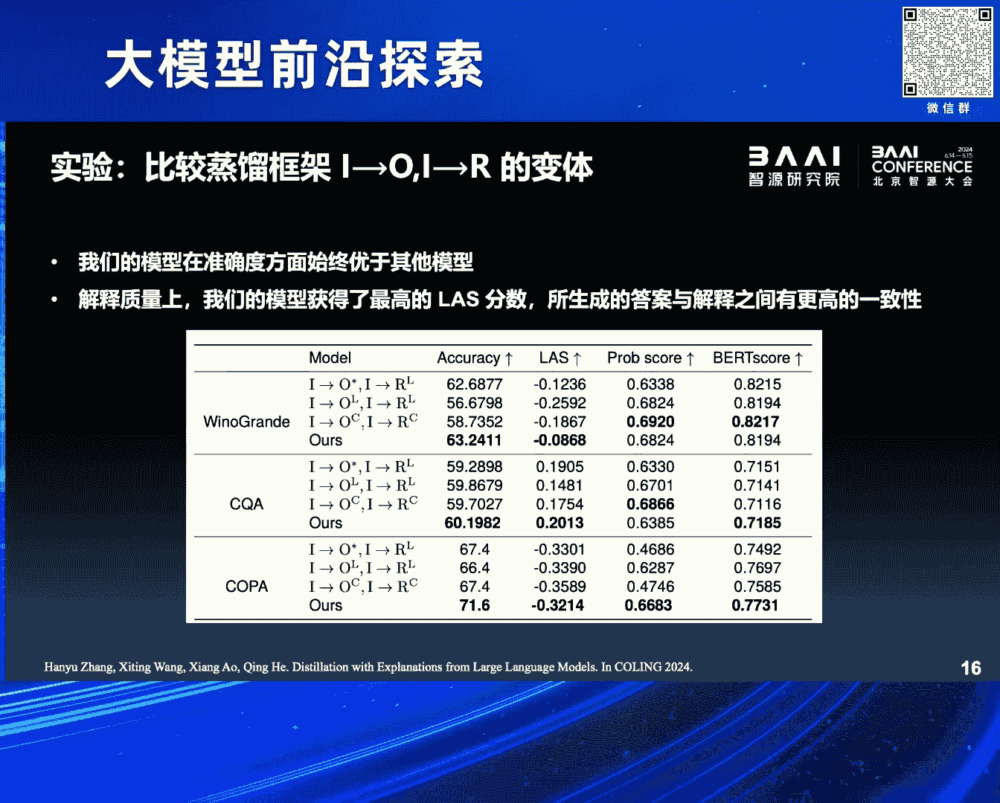

**任务定义**：
*   **输入**：一个问题。
*   **模型**：一个参数较少的语言模型（小模型）。
*   **输出**：包含两个字段：1) 问题的答案；2) 对该答案的解释。

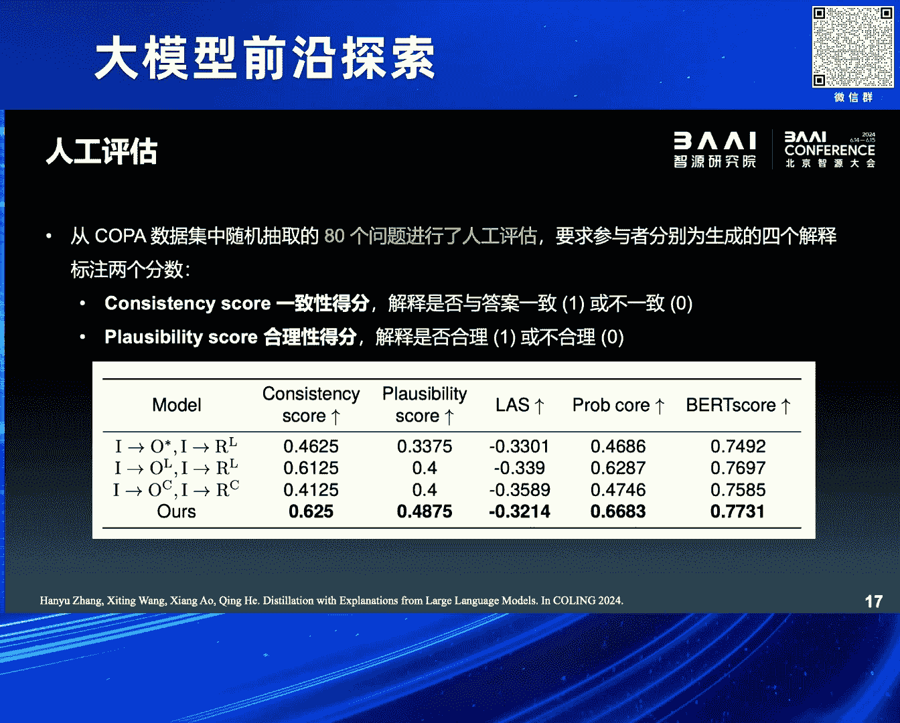

该任务面临的挑战是缺乏包含“解释”的标准训练数据。我们利用大模型的生成能力来构造数据。

**方法步骤**：
1.  **数据生成**：向大模型提问，让其生成答案及相应的解释。
2.  **数据质量洞察**：我们发现，即使大模型回答错误，其生成的解释与错误答案之间也常保持逻辑一致性（即“自圆其说”）。
3.  **一致性过滤**：为了利用高质量数据，我们训练一个**一致性评分模型**，用于评估大模型生成的“答案-解释对”的逻辑一致性。
4.  **协同训练**：小模型通过最小化三部分损失进行学习：
    *   答案预测损失
    *   解释生成损失
    *   答案与解释的一致性损失

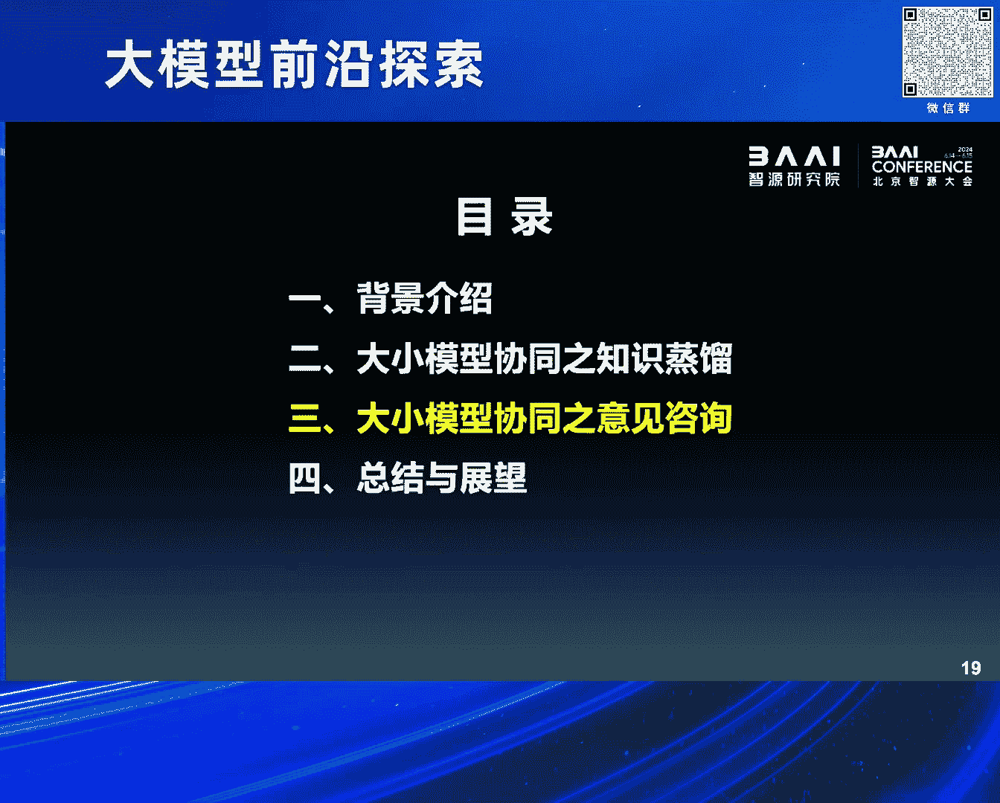

**公式表示**：
总损失函数可以概括为：
`L_total = L_answer + L_explanation + λ * L_consistency`
其中，`λ` 是权衡一致性强度的超参数。

**实验结果**：该方法在多个基准测试上相比传统蒸馏框架取得了性能提升，并且人工评估显示其生成的答案和解释更合理。

---

### 协同训练范式二：大模型作为顾问（迭代咨询）

上一节我们介绍了基于数据生成的静态协同，本节中我们来看看一种更动态的交互范式——迭代咨询。

我们将研究对象从NLP任务转向图神经网络（GNN）。目标是让大语言模型与GNN在训练过程中动态交互，提升GNN在节点分类等任务上的表现。

现有范式存在局限：
*   **大模型作为预测器**：完全用大模型处理图数据，未利用GNN的专长。
*   **大模型作为增强器**：仅用大模型做一次性的节点属性增强，交互不充分。

我们提出新范式：**大模型作为顾问**。其核心是一个在GNN训练过程中的咨询循环。

**框架步骤**：
以下是该范式的关键步骤：

1.  **选择咨询点（疑难杂症）**：并非所有节点都需咨询。我们通过训练多个不同参数的GNN，筛选出预测方差大的节点，视为“疑难杂症”。
2.  **构建咨询请求（自动提示工程）**：将疑难节点的邻居信息、属性、标签及GNN的预测结果，组织成文本描述（如同病历），提交给大模型。
3.  **获取专家回复**：要求大模型回复：1) 预测的节点标签；2) 推理解释。
4.  **利用专家反馈**：
    *   若大模型预测正确，则将其解释文本作为节点属性的补充，**增强语义信息**。
    *   若大模型预测错误，则假设问题源于图结构噪声，对节点邻域进行**剪边去噪**，简化结构。
5.  **迭代优化**：将增强或去噪后的图数据反馈给GNN继续训练，循环此过程，直至模型收敛。

**代码逻辑示意**：
```python
for epoch in training_epochs:
    # 1. GNN前向传播与预测
    predictions, variances = gnn_model(graph)
    # 2. 选择高方差节点作为咨询点
    hard_nodes = select_hard_nodes(variances)
    # 3. 为每个咨询点构建Prompt
    prompts = build_prompts(graph, hard_nodes, predictions)
    # 4. 咨询大模型并获取回复
    llm_advice = query_llm(prompts)
    # 5. 根据回复类型处理图数据
    if llm_advice.is_correct:
        graph = enhance_node_attributes(graph, hard_nodes, llm_advice.explanation)
    else:
        graph = denoise_graph_structure(graph, hard_nodes)
    # 6. 用更新后的图继续训练GNN
    gnn_model.train_on_updated_graph(graph)
```

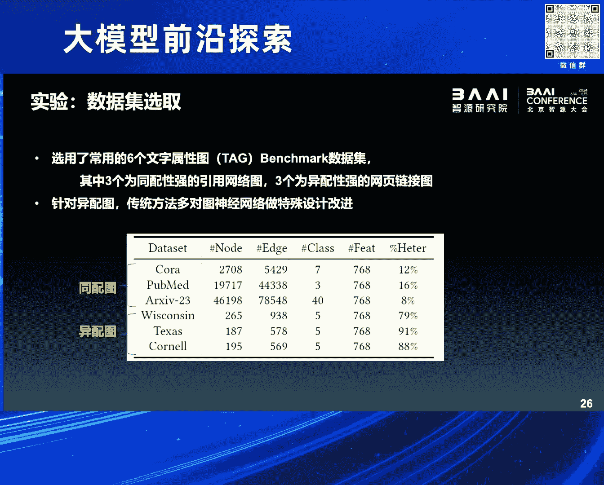

**实验结果**：该范式能使经典的GNN模型性能提升至与近年SOTA模型相当甚至更优的水平，并且在同配图与异配图上均表现稳定。

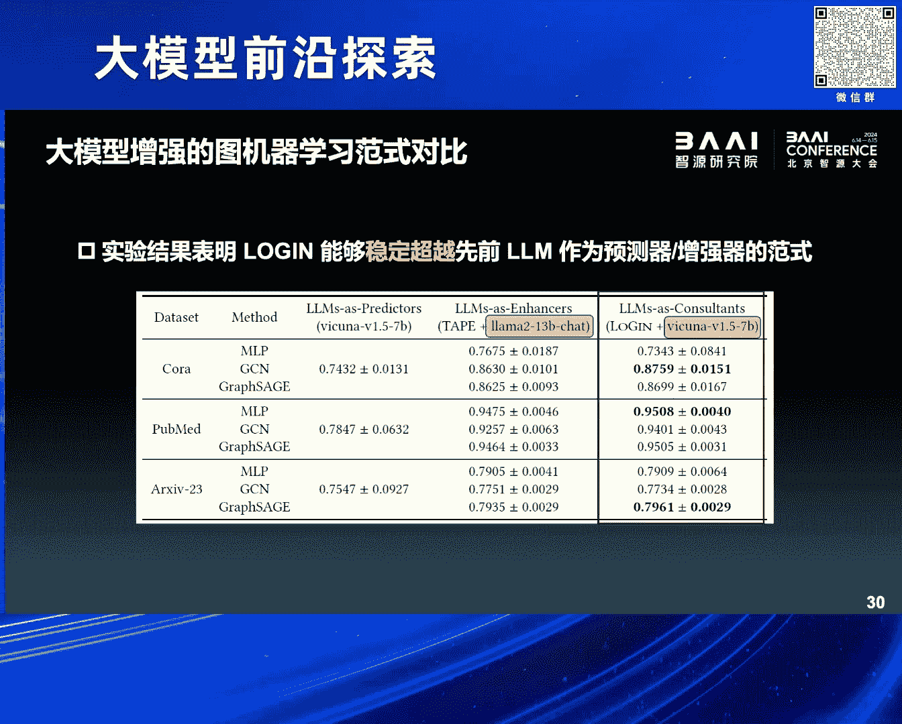

---

### 总结与展望

本节课中我们一起学习了大小模型协同训练的两种核心范式。

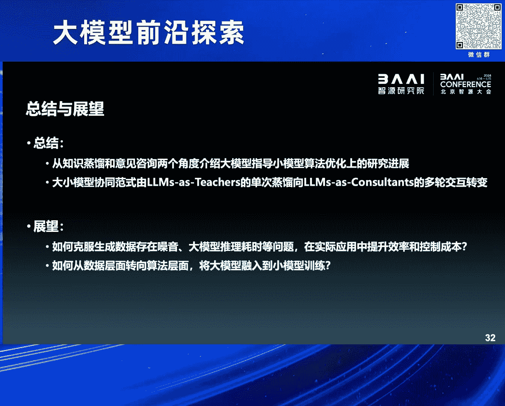

首先，我们探讨了在资源受限背景下，将大模型作为工具来辅助小模型研究的必要性。接着，我们深入分析了两种协同范式：
1.  **知识蒸馏（教师范式）**：利用大模型生成训练数据，并通过一致性过滤提升数据质量，从而在“问答-解释”任务上优化小模型。
2.  **迭代咨询（顾问范式）**：在GNN训练中引入动态咨询循环，让大模型针对疑难节点提供建议，通过属性增强或结构去噪来迭代提升GNN性能。

当前工作主要聚焦于**数据层面**的协同（数据生成、增强、去噪）。未来的研究方向可能包括：
*   **效率与成本**：优化交互流程，降低大模型调用开销，提升整体训练效率。
*   **算法层面协同**：探索如何将大模型的能力更深层次地融入小模型的**损失函数设计**或**架构改进**中，实现更本质的算法协同。

通过本节课的学习，我们希望你能理解，在“大模型时代”，传统小模型并非失去价值，而是可以通过巧妙的协同设计，借助大模型的强大能力，焕发新的生机。