# 2024北京智源大会-大模型前沿探索---P5-大模型下的机器学习理论研究反思与机遇-黄-雷---智源社区---BV1yS411A73A

在本节课中，我们将回顾机器学习理论的发展历程，探讨其在深度学习和大模型时代下面临的挑战与机遇。我们将从传统的统计学习理论框架出发，分析其在特征工程、深度学习及大模型三个不同阶段的适用性与局限性，并介绍一些前沿的理论研究工作。

---

## 机器学习理论的传统框架 📐

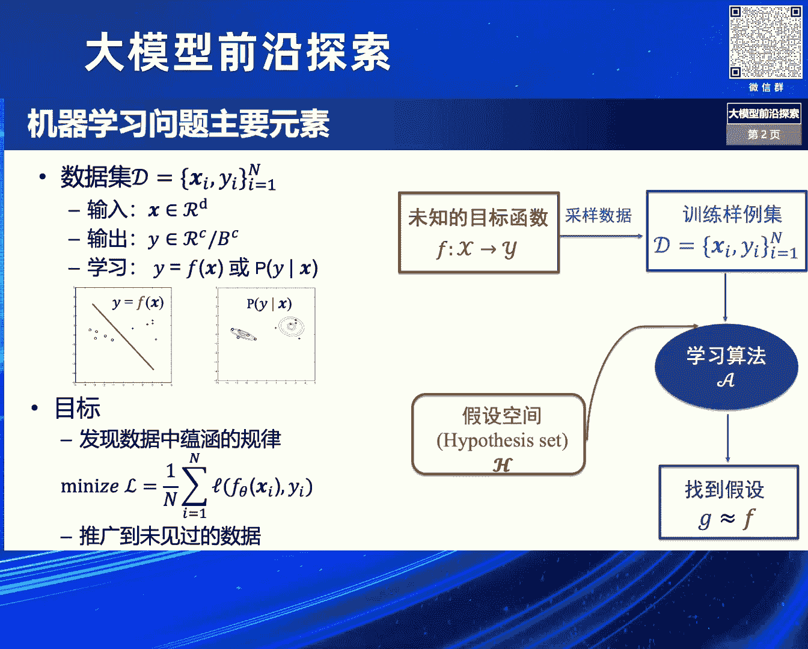

上一节我们介绍了课程概述，本节中我们来看看机器学习理论的传统框架是如何建立的。

机器学习问题的主要元素包含两个方面。主流（主边）的讲述方式，常见于当前的深度学习课程，其核心是：给定一个包含输入和输出的数据集，目标是学习一个函数或条件概率分布。其目标是发现数据中蕴含的规律，具体方法是定义一个损失函数，并通过优化方法最小化它，期望模型能推广到未见过的数据。

在深度学习兴起之前（约2000年左右），机器学习通常按另一种（右边）方式讲授。它强调：一个学习任务源于一个未知的目标函数。通过采样得到一个数据集，然后一个学习算法会从一个给定的假设空间（即模型类）中寻找合适的假设。如果找到的假设 `g` 近似于目标函数 `f`，则认为该任务是可学习的。这个定义非常明确，其中“假设空间”的概念对应到今天的大模型，例如，一个确定了参数数量和连接方式的 Transformer 架构就构成了一个假设空间，每一种参数配置就是一个假设。

那么，机器学习的理论框架是如何建立的呢？这个框架主要源于统计机器学习，因为它强调泛化能力。泛化能力来源于统计学，核心是大数定律。如果可以量化，通常使用霍夫丁不等式。该不等式确保了训练集上的经验误差与期望误差（即泛化误差）之间的差距，其概率可以被一个项所界定。如果这个项小于1，则界定有意义；如果很大，则意义不大，因为概率值本身不会超过1。这个框架缩小了泛化误差的估计范围。

之后，理论研究者希望将这个框架扩展到任意的假设空间。通过概率方法，可以得到一个表达式，其中出现了一个关键变量 `M`，即假设的数目。对于简单模型，假设数目是可数的；但在实际中，很多模型的假设数目是不可数的（例如线性模型有无穷多种参数配置），因此这个表达式意义有限。这里，`N` 是样本数量。这个表达式建立了模型复杂度（假设数目）与性能之间的桥梁。

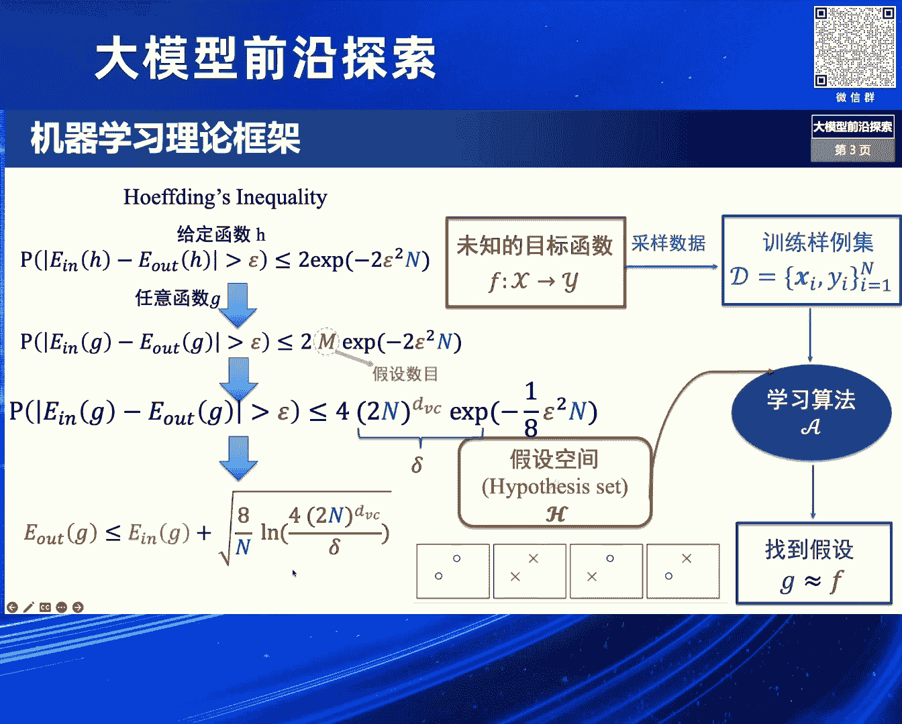

理论研究者又向前推进了一步，致力于处理无限的假设空间。这引入了“打散”和VC维等概念。最终可以得到一个表达式，将泛化误差与训练误差、样本数量 `N`、模型VC维 `D_VC` 以及一个概率参数 `Δ` 联系起来。VC维用来衡量模型打散数据的能力，即其表达能力。大模型的表达能力非常强。这个表达式建立了机器学习的一个理论框架。

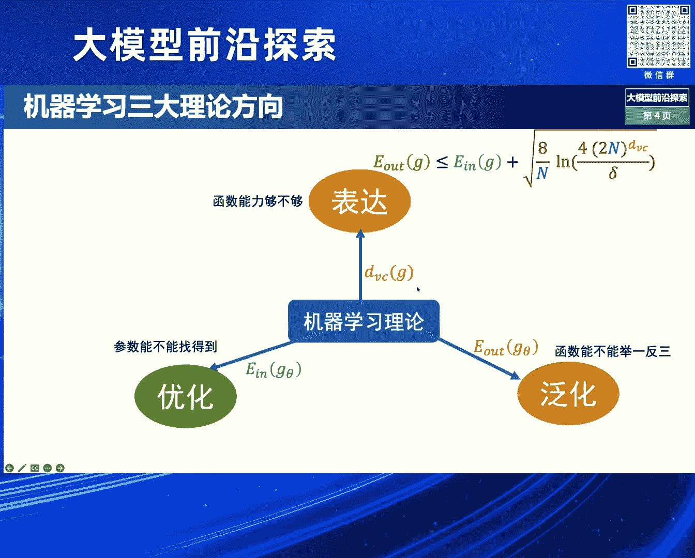

我们如何看待这个表达式呢？它的一边是泛化误差，另一边是训练误差。它表明，如果你得到了一个较小的训练误差，那么你的泛化误差与训练误差的差异不会超过这个上界。这个上界与训练样本数量、模型表达能力（VC维）相关，`Δ` 则代表了该不等式以 `1-Δ` 的概率成立。这就是传统的机器学习理论框架。

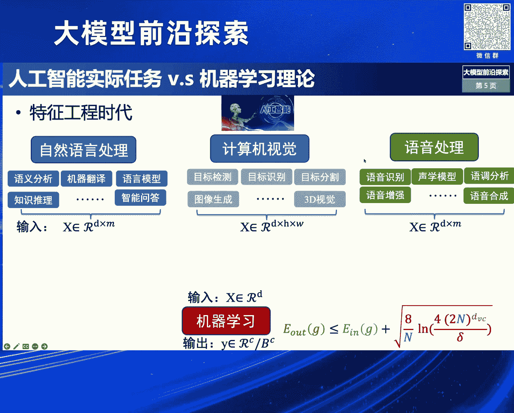

---

## 不同时代的挑战与机遇 🚀

上一节我们介绍了传统的理论框架，本节中我们来看看这个框架在特征工程、深度学习和大模型时代分别遇到了哪些问题和机遇。

沿着上述理论表达式，机器学习理论之后大致分成了三个研究方向：
1.  **表达能力**：给定一个假设空间，其函数表达能力是否足够？即理论上能否用该模型分开所有训练数据。
2.  **优化**：理论上模型能够分开数据，但能否通过算法找到对应的参数配置？
3.  **泛化**：学到的函数能否举一反三，在未见数据上表现良好？

这个表达式将机器学习的三个核心方向统一了起来。

### 特征工程时代

在特征工程时代，机器学习理论的定义基于输入是固定维度 `d` 的向量空间，输出是实数空间（回归）或离散空间（分类）。表达式是在此基础上建立的。

然而，人工智能的实际任务（如自然语言处理、计算机视觉、语音处理）的输入并非如此简单。例如，NLP的输入是变长的向量序列，图像的宽高也是变化的。这使得机器学习理论似乎对实际应用无用。

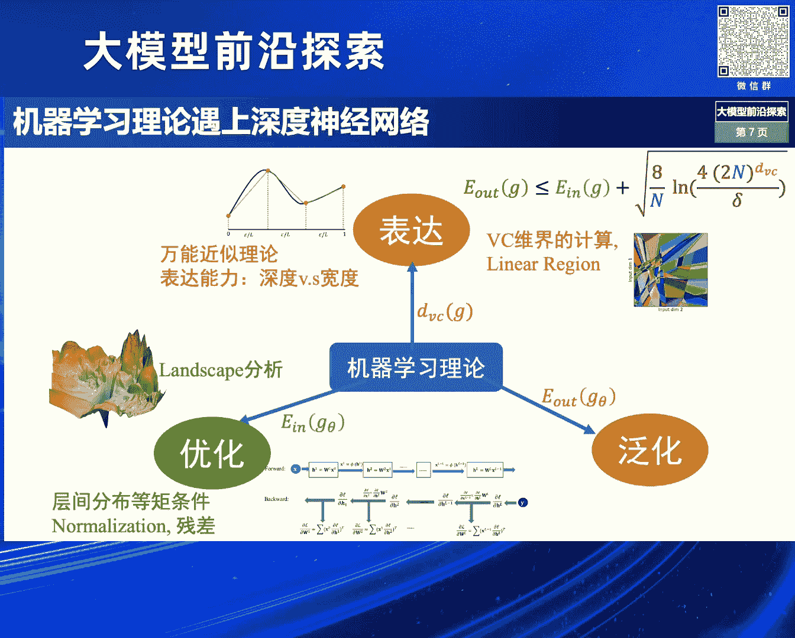

但幸运的是，当时处于特征工程时代。各个领域的研究者会先提取特征，将原始数据转换为固定维度的向量表示。搞机器学习理论的人因此可以不管具体问题，只假设输入 `X ∈ R^d`，然后基于线性模型等发展理论，分析其表达能力和优化收敛性，并引入先验知识得到更精细的泛化上界。他们将实际问题和理论之间的鸿沟，交给了应用领域的研究者去通过特征工程填补。

### 深度学习时代

到了深度学习时代，问题出现了。深度学习处理视觉或语言问题时是端到端的，其直接处理的输入就是原始的、形式各异的信号（如图像像素、文本序列），输出也可能很复杂。在这种情况下，传统的机器学习理论基本上无法直接应用。

当机器学习遇上深度神经网络时：
*   **表达能力**：深度神经网络的表达能力很强，有坚实的理论基础，例如神经网络的万能近似定理。该定理证明，给定任意函数，都可以用神经网络去拟合。也有一些理论工作尝试计算神经网络的VC维。
*   **优化**：这是深度学习发展中最关键的部分。从2006年到2015年，训练技术取得巨大进步，特别是批量归一化（BN）和残差连接（Residual）的出现，使得训练深度网络变得稳定。
*   **泛化**：从严格的机器学习理论角度，深度神经网络的泛化目前缺乏好的理论结果，只有一些经验性发现。但从计算机视觉或NLP的应用角度看，研究者通过融入领域知识（如设计具有平移不变性的网络架构、使用数据增强）来提升泛化能力。

理论发展困难的主要原因在于：
1.  **输入形式各异**：理论假设输入是固定维向量，但实际任务的输入维度是变化的，数学上难以刻画。
2.  **网络架构各异**：从MLP、RNN到CNN、Transformer，每种架构都需要单独进行复杂的理论分析。
3.  **输出更复杂**：任务被设计得越来越复杂。

这就形成了一个巨大的鸿沟：应用工程飞速前进，而机器学习理论仍守着传统的一亩三分地，导致理论成果似乎与深度学习的实践脱节。

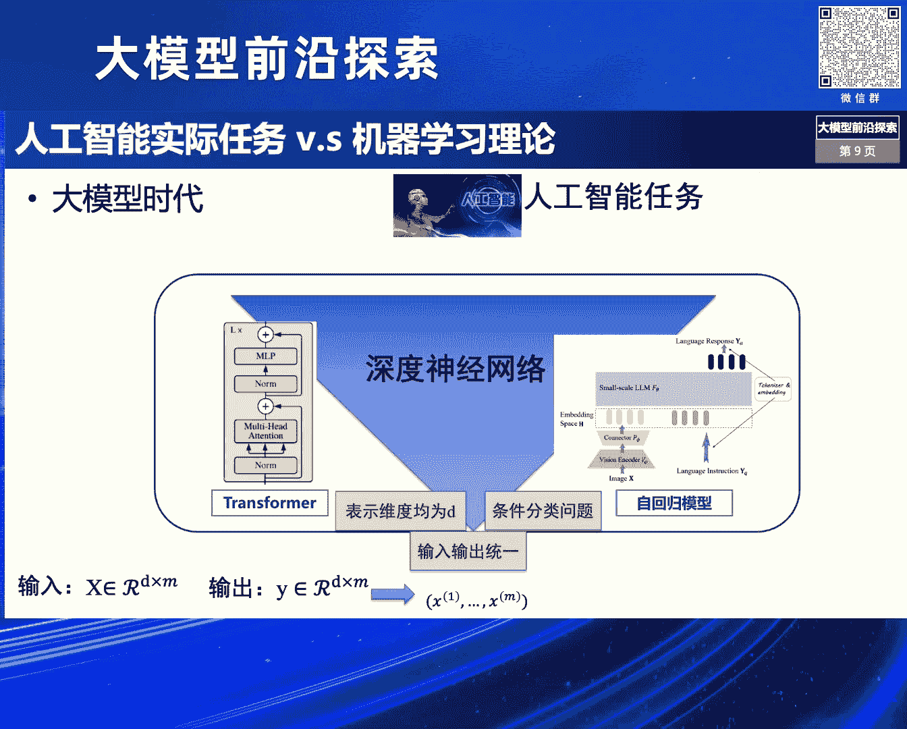

### 大模型时代的机遇

大模型时代带来了新的机遇，主要体现在“统一”上：
1.  **任务统一**：大模型将所有任务的输入和输出都统一为序列形式（如自回归的下一词预测）。在NLP中，输入和输出空间变得一致。
2.  **架构统一**：主流大模型都使用Transformer架构。Transformer每一层的维度是固定的（例如 `d_model`），这使得层与层之间的数学空间刻画成为可能，简化了分析。
3.  **问题统一**：大模型将所有问题本质上转化为条件分类问题（预测下一个token）。

在这三种统一之下，为理论研究带来了机遇。

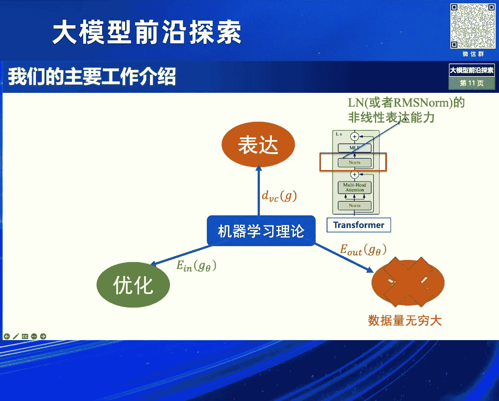

此外，大模型训练通常强调海量数据。根据 Scaling Law 等经验规律，只要训练损失降下去，泛化效果通常也不错。这从研究角度提供了一个新视角：如果数据近乎无限，问题就更多地变成了一个纯粹的优化问题，而暂时不必过分纠结于传统的、基于有限数据的泛化理论。这释放了机器学习理论发展的空间，使其可以更专注于**表达能力**和**优化**这两个核心问题的讨论。

现在的研究，从抽象角度看，就是讨论表达能力和优化之间的权衡。模型越大，参数越多，拟合能力（表达能力）通常越强。同时，人们发现越大的模型优化起来也可能更简单（得益于更好的架构和优化器）。因此，核心变成了表达能力和优化之间的权衡。如果模型既有强大的表达能力，又能被有效优化，那么它就是有意义的。

在表达能力方面，仍有研究空间。例如，现代神经网络中的归一化层、残差层等在传统理论中分析不足。在优化方面，针对这种固定维度的表示空间，研究其训练动态对网络训练有帮助。

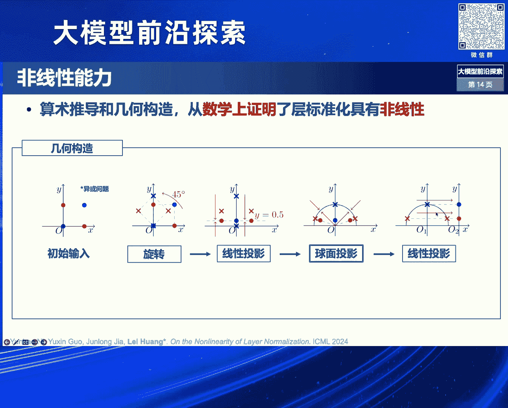

---

## 前沿研究工作示例 🔬

上一节我们探讨了大模型时代带来的机遇，本节中我们将快速浏览基于上述思路的一些具体研究工作。

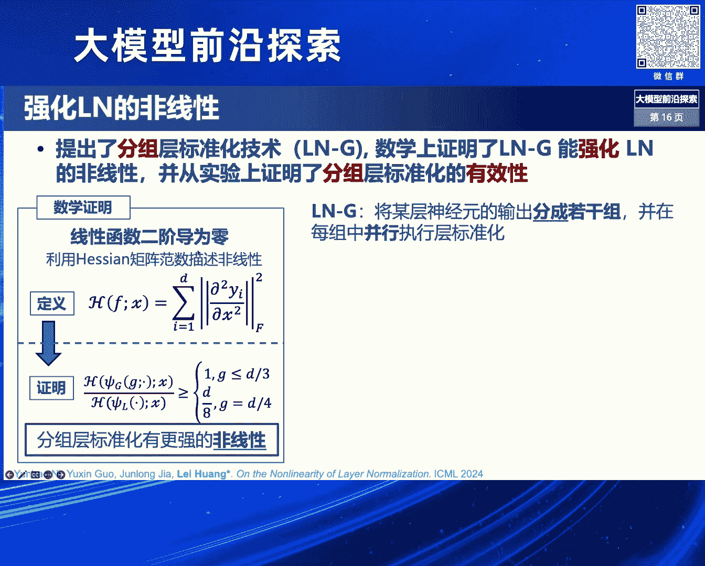

以下是我们在相关方向的部分工作：

### 1. 归一化层的非线性表达能力

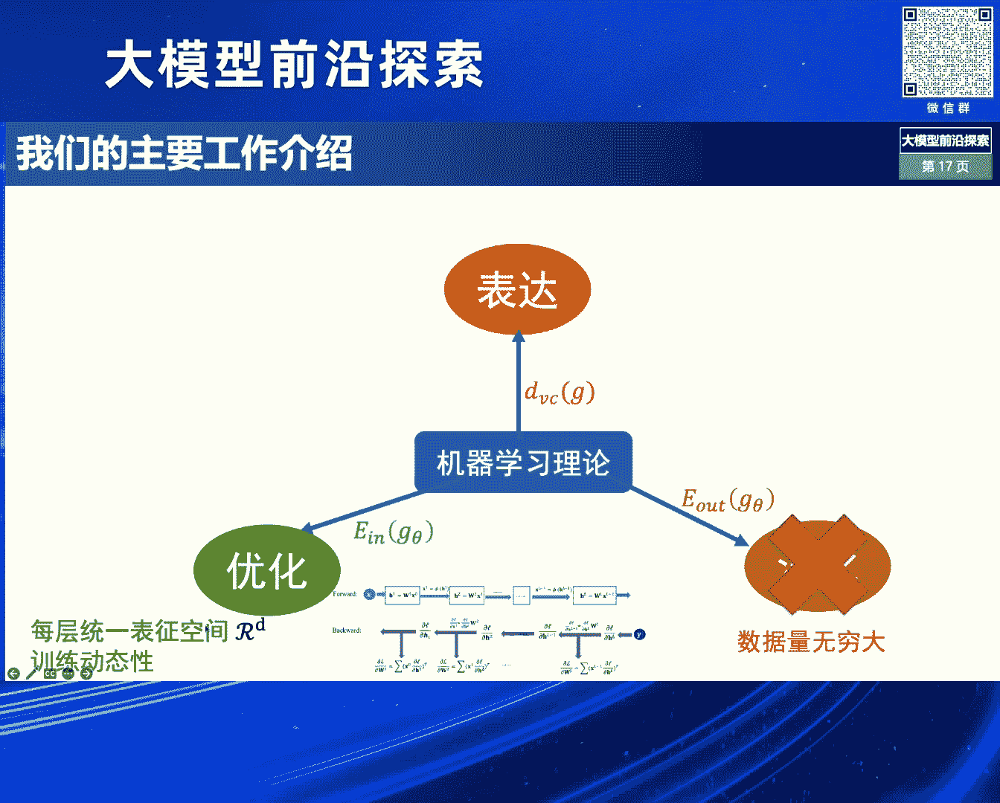

我们首先从理论上证明了层归一化（LayerNorm）和RMSNorm等归一化操作的非线性表达能力。

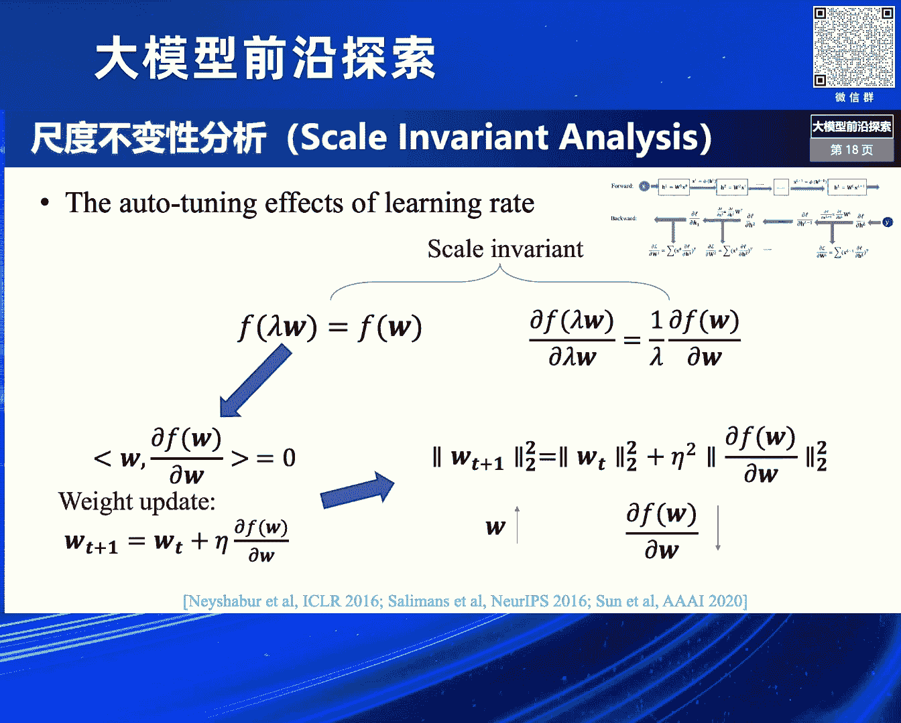

我们知道，层归一化是Transformer中的基础模块。即使为了效率使用RMSNorm，它也属于一种缩放操作。该操作本质上是将向量投影到一个球面上。我们从数学上，通过算术推导和几何构造，证明了LayerNorm和RMSNorm具有非线性表达能力。

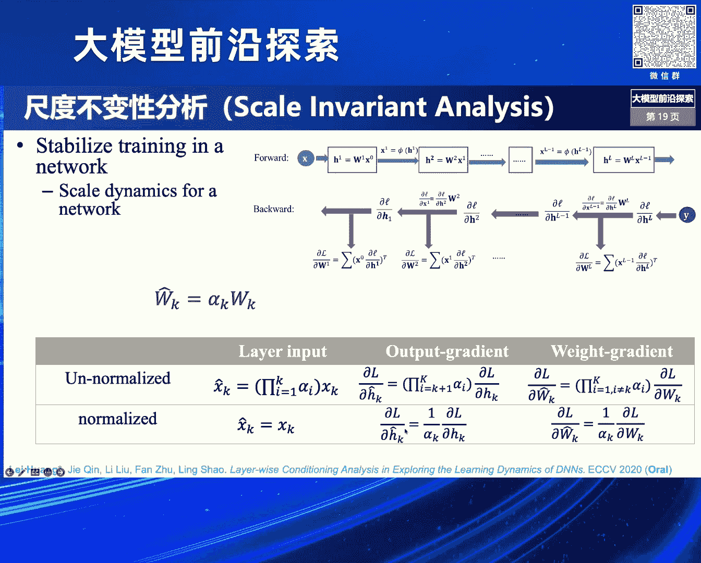

证明思路简述：
*   **算术推导**：我们提出了一个指标，并证明仅通过叠加各种线性层，无法突破该指标的下限。但如果在中间加入LayerNorm，则可以突破这个下限。
*   **几何构造**：线性分类器无法解决某些几何问题（如异或问题）。我们发现，通过使用这种缩放投影，可以构造性地解决此类几何问题，证明其非线性。

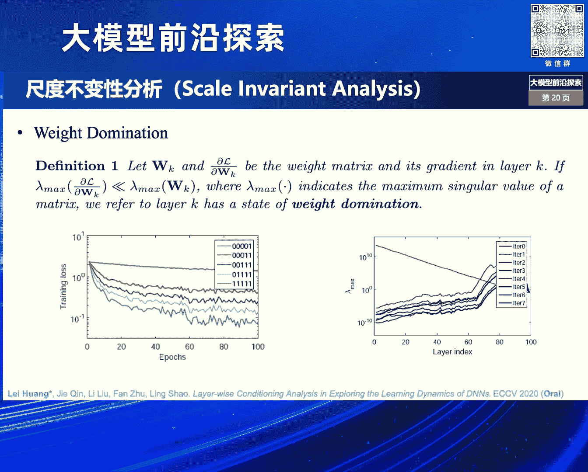

我们最重要的结论是：一个线性层加一个层归一化层构成的网络（称为LNNet），具有万能分类能力。这是以往理论中没有的。我们证明了无穷深的LNNet（每层节点数大于3，若用RMSNorm则大于2）可以完全分类任意给定的有限样本集。这个证明将机器学习问题转化为了一个算法性的“嵌入”问题，我个人非常喜欢这个结果，认为它有写入教科书的价值。

基于这个结果，我们可以很快推导出网络的VC维下界。对于一个L层的网络，其VC维至少是 `L+2`。这个理论目前还比较初步，但有很多改进空间。此外，从实用角度，我们发现将LayerNorm分组（GroupNorm）可以理论上增强其非线性，这对网络设计有启发，但也可能因约束过强而限制模型能力。

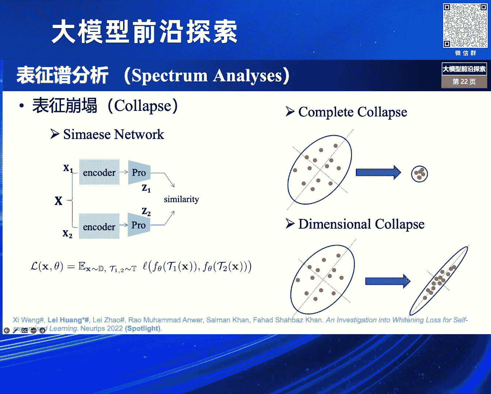

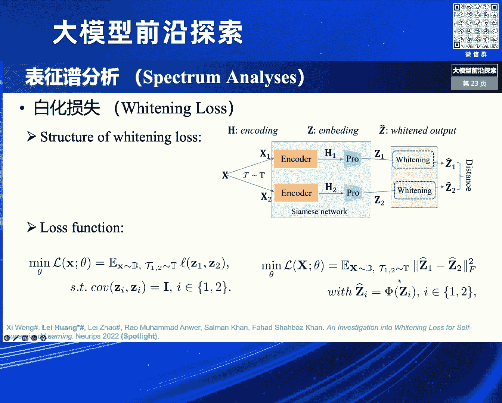

### 2. 优化中的尺度不变性与谱分析

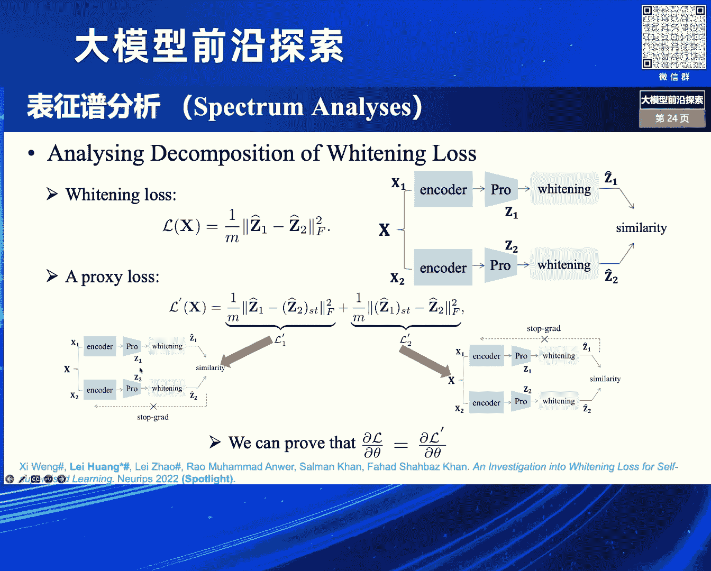

在深度神经网络训练中，尺度不变性分析非常重要。例如，对使用归一化层的网络，将其某一层的权重放大 `α` 倍，其输出表示可能保持不变。这种性质有助于训练稳定。我们分析了网络中每一层的尺度受哪些因素影响，并指出在尺度不变网络中，每层的尺度主要受该层自身参数影响。这虽然稳定了训练，但也可能导致某些层在训练中“休眠”（梯度太小而不更新），这解释了为何有些网络剪枝有效。

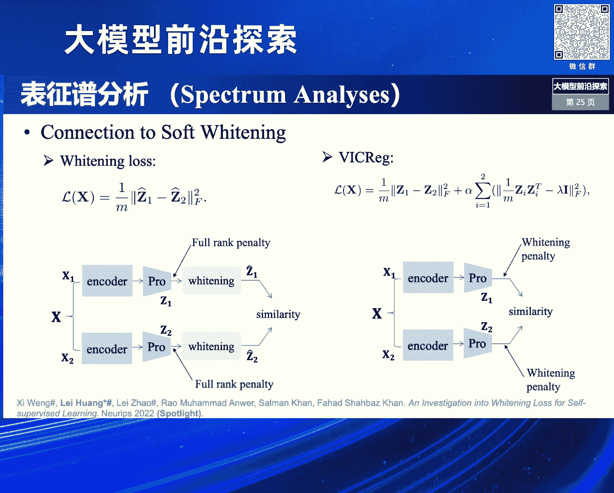

比尺度更进一步的工具是谱分析，即数据协方差矩阵的特征谱。在传统机器学习中，满秩、白化的表示通常有利于优化。在深度学习中，如果每一层的表示也满足这种属性，通常能得到好结果。例如，在视觉自监督学习（如SimCLR）中，容易发生表征坍塌或维度坍塌。为了解决这个问题，许多方法（如白化损失）被提出，其目的是鼓励表征的协方差矩阵接近单位阵，防止坍塌。我们分析了“硬白化”和“软白化”方法的不同效应，并证明在白化损失下，当学习率无穷小时，表征的奇异值秩在训练中保持不变。这些分析有助于诊断训练过程。

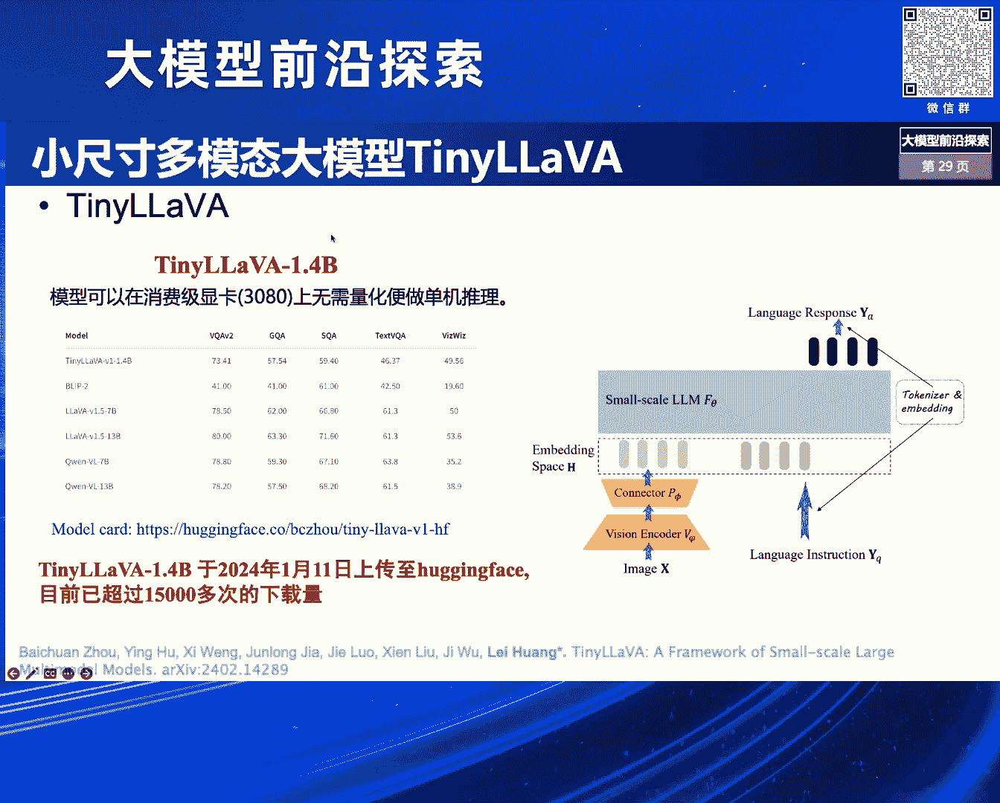

### 3. 实践：小尺寸多模态大模型与开源平台

基于上述分析，我们也进行了实践，训练了一个小尺寸的多模态大模型 **Taiyi（太乙）**。例如，我们早期开源的 Taiyi 1.4B 模型，可以在消费级GPU（如3080）上进行推理。我们训练了不同规模的模型并进行了基准测试。在这个过程中，我们发现代码质量非常重要。

因此，我们联合开发并开源了一个名为 **Taiyi Learning Factory** 的项目。这是一个模块化、易扩展、可复现的多模态代码平台，集成了最新方法，方便定制多模态模型。该平台采用软件工程的设计理念，特别适合高校和研究机构在有限算力下进行大模型研究、分析和理论验证。

---

## 总结 📝

本节课中，我们一起学习了机器学习理论从传统统计框架到深度学习时代的发展脉络。我们看到了传统理论在特征工程时代的间接应用，在深度学习时代因输入、架构、任务的异构而面临的挑战，以及在大模型时代因“统一”而迎来的新机遇。这些机遇使得理论研究可以更聚焦于表达能力和优化等核心问题。最后，我们通过一些具体的研究工作（如归一化层的理论分析、优化动态研究）以及实践项目（小尺寸多模态模型和开源平台），展示了如何在这些新机遇下开展探索。大模型时代为机器学习理论研究者提供了重新审视和贡献的宝贵机会。