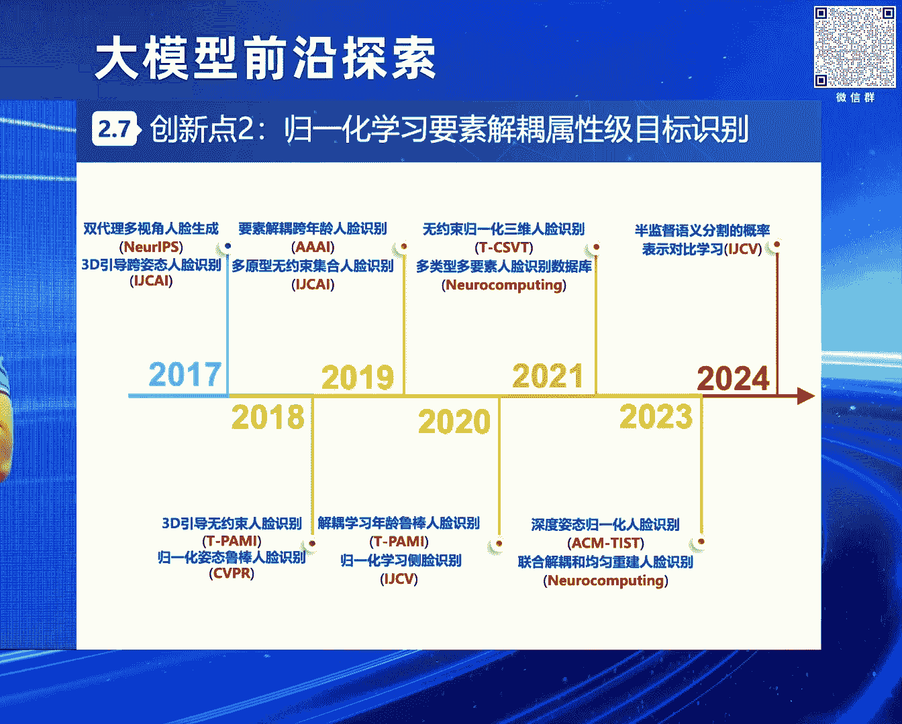
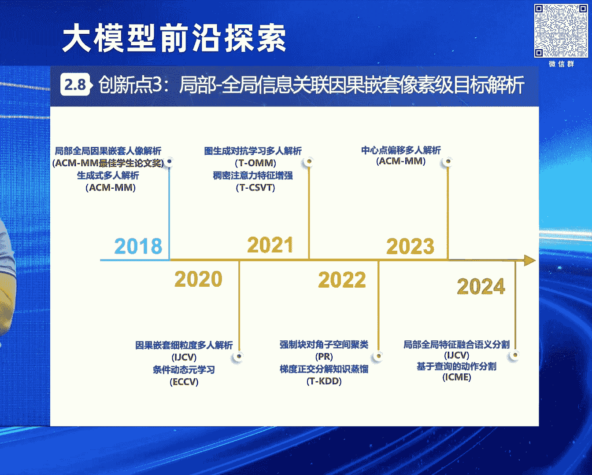

# 2024北京智源大会-大模型前沿探索---P6-无约束感知理解-从视觉垂域建模到多模态统一与多任务协同-赵-健---智源社区---BV1yS411A73A

在本节课中，我们将学习赵健博士分享的关于无约束条件下视觉目标感知理解的研究历程与前沿思考。课程将从具体的视觉垂域问题出发，逐步扩展到多模态统一与多任务协同的通用模型构建，探讨如何应对复杂现实场景中的挑战。

---

## 概述：视觉目标感知理解的重要性与挑战

视觉目标感知理解旨在从图像或视频中获取人、车、物等目标的关键信息与关联属性。多年来，它一直是人工智能领域的核心科学问题，在国防、公共安全及民生经济等领域有广泛应用前景。

然而，在无约束条件下，视觉目标感知理解面临诸多挑战。各种内外在因素的耦合影响，为目标信息的求解与建模带来了困难。

---

## 第一项研究：多模融合学习的态势感知 🎯

上一节我们概述了领域面临的挑战，本节中我们来看看第一个具体的研究方向：态势感知。

为了保障某要地的低空安全，需要对微小型无人机等可疑目标的时空关键信息进行感知取证，并辅助反制手段进行管控。在多模融合学习的态势感知中，核心研究如何融合红外、可见光等多元信息的互补优势，实现目标空间位置等状态信息的检测，及其运动轨迹等趋势信息的预测。

**挑战在于**：在无约束或非配合条件下，目标在运动过程中不断受到速度、背景、障碍物等因素影响，导致视觉观测多变，使得态势信息获取不精确。

**传统方法的局限**：在RGBT弱小目标跟踪场景中，传统方法主要基于一阶交互和静态模板，导致力度单一、表征低效。

**我们的创新思路**：提出**双流知识迁移的多模融合实例级目标跟踪**方法。该方法通过多阶耦合双流级联，联合感知全局与局部信息，实现多阶信息融合互补、时空线索联动建模和层级知识级联迁移。

此外，我们构建了大规模多模融合无人机跟踪基准数据集（NTUAV）。该数据集的有效标签量超越了此前相关数据的35.9%。我们持续在该领域深耕，在国际上首次提出反无人机跟踪问题，并持续在CVPR、ICCV等顶会组织相关研讨会与挑战赛，推动领域发展。

**方法效果**：在复杂环境及多重遮挡条件下，我们的方法相比此前最优方法，相对精度提升了19.95%。相关算法获得了中国人工智能大赛A级证书及CVPR比赛奖项。成果已落地于国家重要部门，并与中国花样滑冰协会合作开发了相关系统。

---

## 第二项研究：要素解耦学习的属性关联 👤

在掌握了目标的态势信息后，下一步是识别其属性。本节我们探讨属性关联问题。

在突发公共安全事件中，需要对实施违法行为的关注目标的面部特征进行感知，识别其身份信息以实施追查布控。在要素解耦学习的属性关联中，需要研究如何通过充分挖掘目标内在属性的耦合结构及其相互关联关系，发现属性间复杂依赖，实现目标身份、类别等信息的精确识别。

**挑战在于**：在无约束条件下，目标常受到姿态等内在属性耦合，以及视角、分辨率等外在因素的干扰，导致属性识别结果不够精准。

**传统方法的局限**：传统方法主要通过合成图像直接学习，导致分布差异和属性耦合的挑战。

**我们的创新思路**：提出**规划学习要素解耦的属性级目标识别**方案。通过多属性依赖关系建模和归一化学习要素解耦，可以理清属性耦合结构，统一处理各种挑战性因素，实现各类关联属性的归一化学习。

**方法效果**：相比马尔奖得主A. Zisserman的Fisher Vector等经典算法，相对识别精度提升超过50%。在大姿态、极端姿态等条件下，识别精度也得到大幅提升。我们将该方法开源为`face-evolve`库，在GitHub上获得超3000星标和700余次复刻，并适配了百度PaddlePaddle、清华Jittor等国产深度学习框架，被官方引入。

相关算法获得了ICCV 2021口罩人脸识别竞赛冠军、美国NIST无约束人脸识别竞赛所有赛道冠军、微软百万名人识别竞赛所有赛道冠军。成果成功落地于国家重要部门及蚂蚁金服可信人脸识别系统，服务覆盖1.2亿用户。

---

## 第三项研究：因果嵌套学习的语义理解 🔍

识别目标属性后，需进一步理解其精细化语义信息。本节我们进入语义理解层面。

在聚集性活动中，重点目标常藏匿于人群中。需要分析不同目标的详细特征，理解其精细化语义信息，实施精细检索。因果嵌套的语义理解主要研究如何逐步建模复杂场景，实现由粗到精信息的渐进式反馈，将高复杂度任务向低复杂度任务分解转化，最终实现精细化语义理解。

**挑战在于**：在无约束条件下，人群中的目标可能因距离远导致轮廓模糊，且因交互或遮挡问题严重，导致场景复杂度多元，使得语义理解不够精细。

**传统方法的局限**：传统方法多采用基于级联的多阶段独立处理方式，导致特征无关联、语义易混淆。

**我们的创新思路**：提出**局部全局信息关联的因果嵌套像素级目标解析**方案。通过局部与全局的关联以及因果嵌套学习，实现特征协同优化和语义因果推理。

此外，我们构建了大规模细粒度语义理解数据集。在数据规模上超越此前工作五倍，在标注类别上超越三倍，已被多个国际知名机构广泛使用。

**方法效果**：相比MH-Parser等经典方法，在保证性能有提升的同时，推理速度提升了十倍。相比ResNet作者何恺明的Mask R-CNN，平均精度提升13.95个百分点。相关成果获得ACM Multimedia最佳学生论文奖、新加坡模式识别协会金奖，并成功落地于国家重要部门及奇虎360等单位。

---

## 从视觉垂域到多模态统一与多任务协同 🚀

在长期的研究与实践中，我们发现仅利用视觉信息往往不够全面，仅研究专用智能或针对特定问题的模型，其认知能力有限，无法应对多模态、非完整信息感知理解的新需求。

人类的感知本质上是多模态的，但每种模态下的信息往往是不完备的。如何针对多模态非完整信息条件，获取更精确的目标画像进行感知理解，我们思考从三方面扩展：
1.  **模态扩展**：从视觉模态扩展到多种模态融合。
2.  **模型扩展**：从各垂域专用模型扩展到跨域通用模型。
3.  **场景扩展**：从单一、低复杂度场景扩展到多样化、高复杂度场景。

最终愿景是构建一个**多模态、多任务联合驱动的通用模型**。这既符合国家需求与指引，也是国际研究前沿。

我们设计了如下研究架构，针对 **“探究多模态非完整信息语义对齐和多任务协同机理”** 这一科学问题，从四个层面入手：
1.  **多元融合**：解决多模态理解问题。
2.  **通用模型设计**：解决模型架构问题。
3.  **多任务学习**：解决多任务协同机理问题。
4.  **增量学习**：解决模型持续优化问题。

以下是各层面的研究思路：

**1. 多模态建模与语义对齐**
*   **目标**：实现多元异构信息的优势互补与交互协作，得到信息融合的通用学习框架。
*   **核心**：
    *   多模态数据的离散结构表示。
    *   特征与语义空间的对齐。即将不同模态数据在隐空间解耦，利用强鲁棒性的离散表征空间建模数据，同时引入语义空间对齐机制，实现多模态信息在隐空间的真正对齐。

**2. 通用模型设计与轻量化**
*   **目标**：编码不同尺度的多模态信号，提取模态间与模态内的复杂交互关系，并在多任务学习中减小计算量。
*   **核心**：
    *   多尺度数据的长程建模。
    *   多模态联合表征学习。

**3. 多任务学习机理**
*   **目标**：设计轻量化的多模态输入、多类型任务一体化模型架构，实现多任务联合处理。
*   **核心**：研究清楚多任务学习的机理与机制。因为多任务学习中，有些任务相互促进，有些相互抑制。弄清机制才能更好地进行多模态、多任务统一学习与表示。

**4. 增量学习与持续优化**
*   **目标**：构建统一优化框架，持续处理现实世界中的连续信息流，构建共享表征空间，增强模型的小样本、零样本学习及泛化能力，让模型在实际问题中不断迭代进化。

目前，我们正基于这些方向进行研究探索，相关成果将陆续发布。

---

## 总结与展望 🌟

本节课我们一起学习了无约束感知理解从视觉垂域建模到多模态统一与多任务协同的研究路径。

我们回顾了三项层层递进的研究：
1.  **多模融合态势感知**，解决目标状态与趋势信息获取问题。
2.  **要素解耦属性关联**，解决目标身份与类别精确识别问题。
3.  **因果嵌套语义理解**，解决目标精细化语义解析问题。

进而，我们探讨了未来的扩展方向：通过**多元融合、通用模型设计、多任务学习与增量学习**，构建能够应对多模态、非完整信息挑战的通用感知理解模型。

人工智能发展日新月异，未来虽不确定，但我们相信会越来越好。我们愿与各界同仁一道努力，让更多不可能变为可能。

---

## 问答环节 💬

**观众提问**：关于无人机距离控制和识别问题，我曾尝试使用透视空间和坐标定位，但难以聚焦和控制精确距离。看到视频中使用了光谱，但觉得光谱干扰因素大。是否可以考虑使用建筑物坐标或地标来解决？

**赵健博士回答**：您提的很好。在实际应用解决反无人机问题时，通常包含三个子系统：预警探测、防御处置和指挥控制。与感知相关的主要在预警探测部分。

预警探测本身就是一个**多模态**系统。除了视觉设备（即带转台的光电探头，包含红外与可见光视场，并集成激光测距），还包括雷达探测设备和无线电频谱侦测设备。因此，实际是通过多模态融合来解决目标位置及其他关键信息的探测问题。

当然，在进行学术研究时，由于我们更多关注多媒体、CV等领域，因此主要聚焦于如何在视觉范畴内更好地解决目标状态与趋势信息的感知问题。