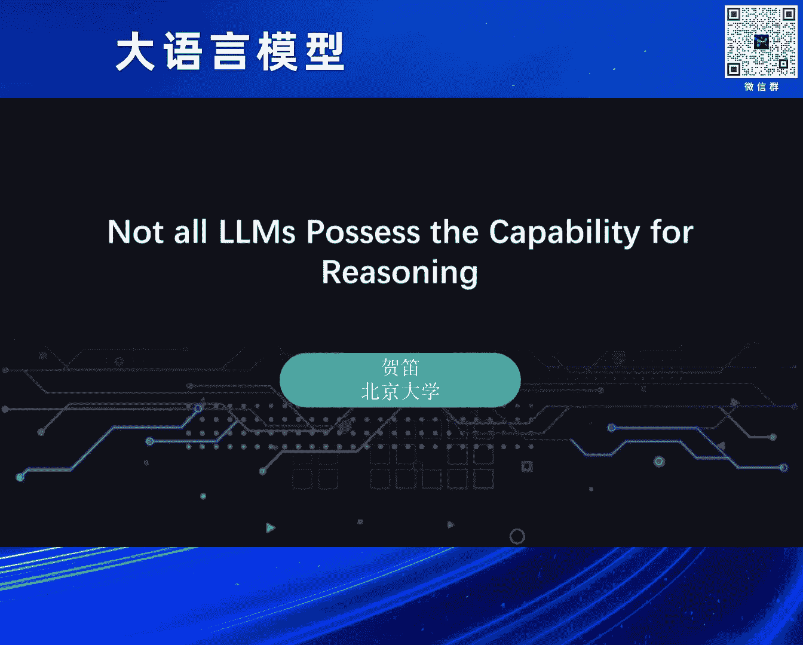
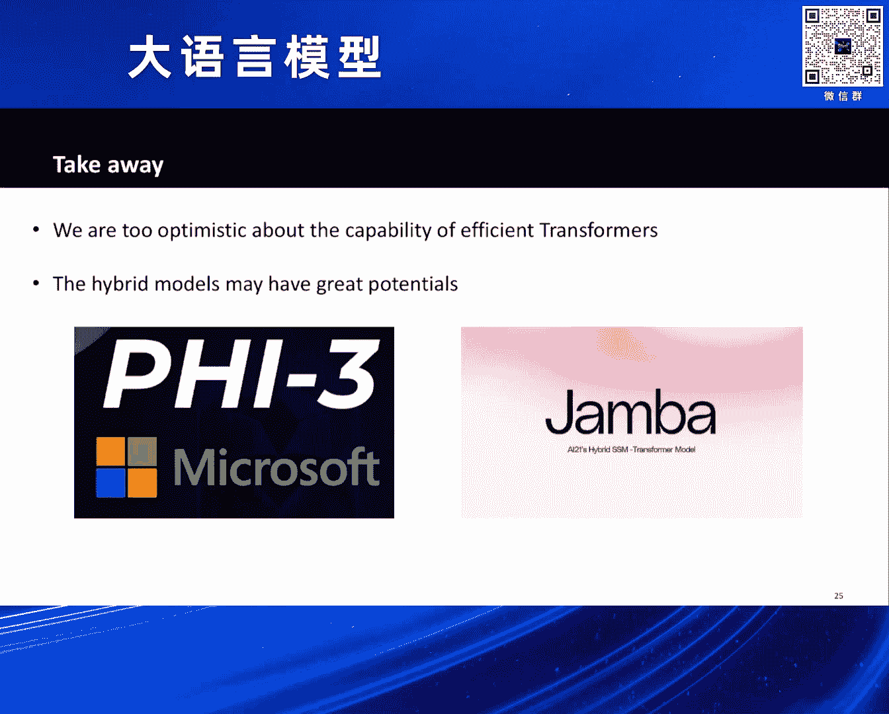

# 2024北京智源大会-大语言模型---P2-是否所有Transformer结构都具备思维链推理能力--贺-笛---智源社区---BV1zE421N7UJ

## 概述

在本节课中，我们将探讨大语言模型的核心架构——Transformer及其各类高效变体（Efficient Transformers）的理论表达能力。我们将重点关注一个核心问题：**这些旨在提升计算效率的模型变体，是否依然具备像标准Transformer那样进行复杂思维链（Chain-of-Thought）推理的能力？** 我们将从理论分析和实验证据两个层面来解答这个问题。

---

## Transformer的核心地位与挑战 🏆

大语言模型是当前工业界、学术界和创业界共同关注的热点。其强大能力背后，**Transformer模型结构**是最关键的技术支柱之一。当然，英伟达等公司提供的强大算力支持也功不可没。

然而，Transformer并非没有竞争对手。国内外已有大量研究工作试图挑战其“王座”。这主要是因为Transformer存在一个显著问题：**效率问题**。其核心机制**自注意力（Self-Attention）** 在处理长序列时速度非常慢，导致模型理解和生成长序列内容需要耗费大量时间。

为了解决这个问题，学术界和工业界设计了多种方法，它们统称为 **高效Transformer（Efficient Transformer）**。

---

## 高效Transformer的主要技术路线 🛣️

以下是几种基础的高效Transformer技术路线：

1.  **稀疏注意力（Sparse Transformer）**：通过减少需要计算的**键值对（Key-Value Pair）** 数量来提升效率。代表工作包括GPT-2。
2.  **低秩注意力（Low-Rank Transformer）**：通过降低序列长度等维度的计算复杂度来提升效率。代表工作如Meta的Informer。
3.  **线性注意力（Linear Transformer）**：通过简化**Softmax**中的计算来提升效率。

以上三种基础方法可以相互组合，衍生出众多模型变种。例如，目前知名的S4、Mamba（及其Mamba-2）、国内的RWKV、微软的RetNet等模型，都围绕类似思路试图降低Transformer的计算开销。

---

## 模型选择的根本问题 ❓

面对如此多的Transformer变体，一个根本性问题随之产生：**在实际任务中，我们该如何选择模型？或者说，究竟哪一个模型能完美替代标准Transformer？**

为了回答这个问题，我们首先设想几种可能的情况。假设我们有一个任务A，目标是使用类Transformer结构来解决它。

*   **情况一**：所有高效Transformer都能以相同的模型宽度和深度解决任务A，且速度比标准Transformer快。那么，高效Transformer无疑是更好的选择。
*   **情况二**：所有高效Transformer都无法解决任务A，但标准Transformer可以。那么结论是，这些高效Transformer可能“不奏效”。如果任务A至关重要，从理论上证明高效Transformer无法解决，那么这条技术路线可能就走不通。
*   **情况三（棘手情况）**：高效Transformer也能解决任务A，但需要比标准Transformer更多的参数（如更深的层数或更宽的宽度）。这时，我们需要仔细计算和比较两种模型解决该任务的总计算时间。

第三种情况引出了一个核心的理论问题：**这些不同网络结构（Transformer, RWKV, Mamba, RetNet等）的表达能力上限究竟是什么？它们能做哪些任务，不能做哪些任务？**

---

## 深度学习理论：从通用近似定理到新挑战 📚

表达能力的上限是深度学习理论中的一个经典问题。早在20世纪80年代，**通用近似定理（Universal Approximation Theorem）** 就指出：一个足够宽、足够深的神经网络（如MLP）可以在连续空间内逼近任何连续函数。

然而，这个理论对现代大语言模型的指导意义有限，原因在于它的两个关键假设与大模型的实际情况不符：

1.  **输入/输出空间**：定理假设输入和输出是**连续（Continuous）** 空间中的值。但大模型的输入和输出都是离散的**词元（Token）**，来自一个有限的词汇表。这是一个**序列到序列（Sequence-to-Sequence）** 的映射，而非连续空间上的映射。
2.  **计算精度**：大模型的训练和推理都使用**有限精度（Finite Precision）**，如BF16或FP16。在这种精度限制下，模型内部的表示和计算在某种意义上都不是连续的。

因此，在“模型非连续映射”和“任务非连续”的现代设定下，传统的表达能力理论意义不大。这意味着，**我们对于当前所使用的语言模型的能力上限和局限实际上知之甚少**。我们需要开发适用于当前实际情况的新理论。

---

## 新理论聚焦：思维链与推理能力的关键作用 🔗

近期理论研究主要围绕理解大模型的表达能力展开。其中，学术界特别关注大模型解决**推理、数学和规划问题**的能力，因为这些是相比之前的BERT模型所展现出的新能力。

在新的理论假设下（考虑序列到序列映射和低精度训练），我们得到了一个重要结论：**在大语言模型中，思维链（Chain-of-Thought, CoT）对于规划和推理至关重要。**

为了说明这一点，需要两方面的理论支撑：

1.  **直接生成答案的局限性**：理论上可以证明，如果希望一个Transformer**直接生成**复杂问题（如四则运算）的答案，这是**不可行**的。因为直接生成答案所对应的计算复杂度类别是**TC⁰**，这是一个非常小的复杂度类别。而许多推理和规划问题的复杂度远高于TC⁰。
2.  **思维链带来的能力提升**：相反，如果可以引导Transformer**逐步生成答案**（即使用思维链），先生成第一个中间步骤，再基于此生成下一步，如此反复直至最终答案，那么其表达能力将远超TC⁰。这是因为在长思维链中，模型执行了多次Transformer操作，所带来的非线性能力提升远大于直接生成答案。

一个最新的工作结论是：**Transformer结合思维链后，能够在多项式步骤内解决所有的P问题**。这为Transformer（尤其是结合COT后）的表达能力提供了一个非常强的刻画。

---

## 核心问题：高效Transformer具备推理能力吗？ ⚙️

上一节我们介绍了标准Transformer结合思维链后的强大推理能力。现在，我们回到最初的核心问题：**那些旨在提升效率的Transformer变体，是否同样具备解决复杂推理问题的能力？**

我们选择了一个有代表性的推理问题作为切入点：**动态规划（Dynamic Programming）** 问题。假设推理长度为L，标准Transformer结合COT解决此类问题的计算复杂度为 **O(L²)**。

然而，理论分析给出了一个令人遗憾的结论：**我们之前提到的许多高效Transformer（如Sparse Transformer, Linear Transformer）本身并不具备解决任何动态规划问题的能力。** 也就是说，对于一个已经确定深度和宽度的恒定大小的高效Transformer模型，理论上可以证明它无法解决所有动态规划问题。

这是一个比较负面的结果，它告诉我们，许多高效结构在解决复杂推理问题时可能会遇到**本质性的困难**。

---

## 高效Transformer获得推理能力的代价 💰

既然恒定大小的模型不行，那么什么样的高效Transformer才有可能解决推理问题呢？理论给出了答案：**你需要一个比标准Transformer更大的模型。**

具体来说，我们的研究展示了两种特定高效Transformer的情况：

*   对于**Sparse Transformer**和**Linear Transformer**，如果希望它们具备解决推理问题的能力，那么其模型的**隐藏层宽度（Hidden Dimension）** 需要随着序列长度L增长，其增长规模大约是 **√L**。

关键在于，即使在这种宽度随长度增长的设计下，这些高效Transformer解决动态规划问题的计算复杂度也变成了 **O(L²)**，这与标准Transformer无异。

这意味着：**如果你希望一个高效Transformer能够解决推理问题，你就不能使用和标准Transformer一样大的模型，而需要一个更大的模型。但当模型变大后，这些“高效”模型也就失去了其速度优势。**

---

## 实验佐证 🧪

我们在相对简单的任务上进行了实验，例如四则运算。实验比较了三种模型结构：标准Transformer、Linear Transformer和Sparse Transformer。

以下是实验的核心观察：

*   横轴代表模型维度（Dimension），纵轴代表问题难度，颜色越亮代表模型解决了该问题。
*   **标准Transformer**：在相对较小的维度上就能高效解决大部分问题（图中黑色点很少）。
*   **Linear Transformer 和 Sparse Transformer**：需要比标准Transformer更宽的模型宽度才能解决相同问题（图中黑色点很多）。
*   例如，对于“最长上升子序列”问题，Sparse Transformer即使在维度达到512或1024时也无法解决，而标准Transformer在维度为256时即可解决。

这些实验有力地佐证了我们的理论发现。

---

## 总结与展望 🎯

本节课我们一起学习了关于Transformer及其高效变体理论表达能力的核心内容。

1.  **对高效Transformer的能力需保持谨慎**：我们可能对许多所谓“高效”Transformer的能力过于乐观。近期一系列理论工作（包括我们自己的工作）表明，**高效Transformer在解决复杂推理问题上可能并不高效**，其与标准Transformer之间的能力差距可能非常大，甚至难以跨越。
2.  **混合架构（Hybrid Model）成为新方向**：正因为看到了纯高效结构的局限性，近期一个热门方向是采用**混合模型**。例如，微软的Phi-3模型在其技术报告中就提到使用了混合层。Mamba团队的最新工作也发现，一个由45%的Mamba层、5%的密集注意力层和50%的MLP层组成的混合模型，能达到最佳的效果和效率平衡。

总而言之，理解不同模型结构的理论能力上限，对于在实际中选择和设计合适的大模型架构至关重要。标准Transformer结合思维链在推理方面展现出强大而稳固的理论基础，而许多高效变体要获得同等能力则需要付出额外的代价。混合模型可能是未来兼顾效率与能力的一个有前景的方向。