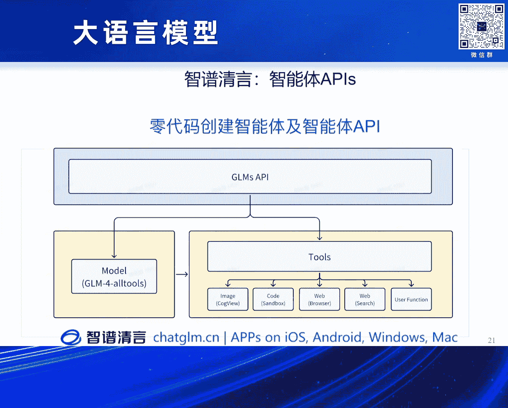
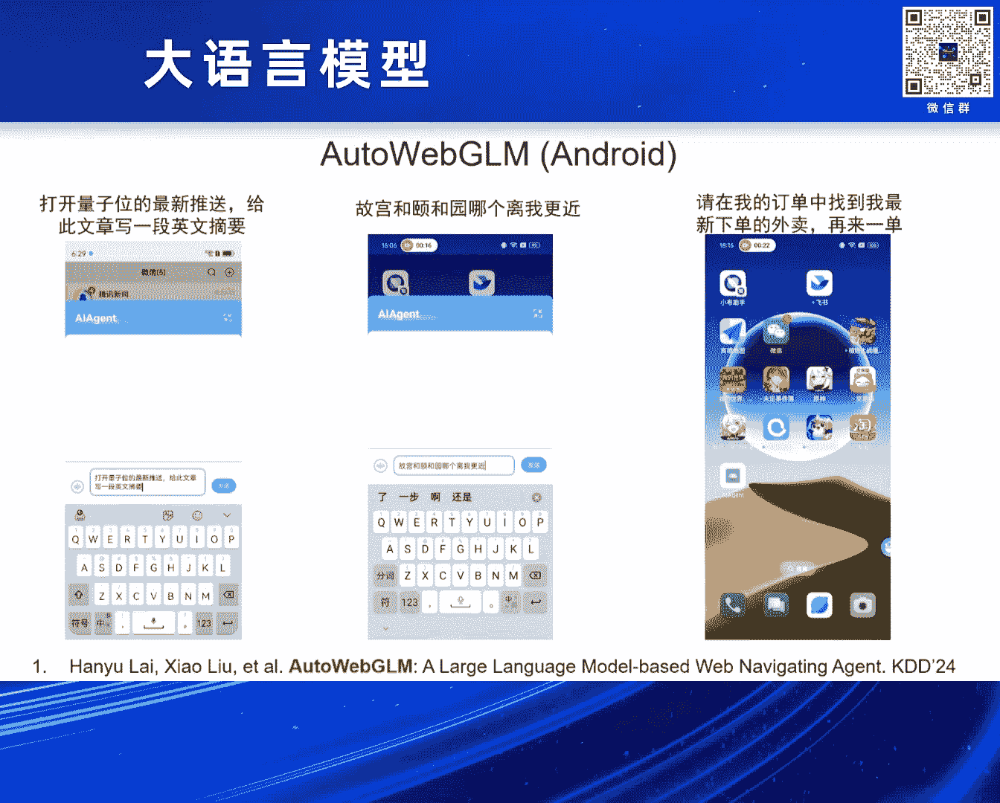
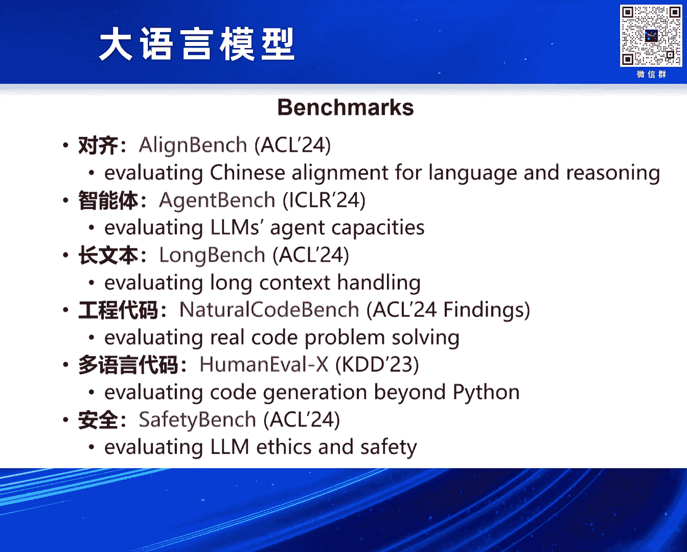
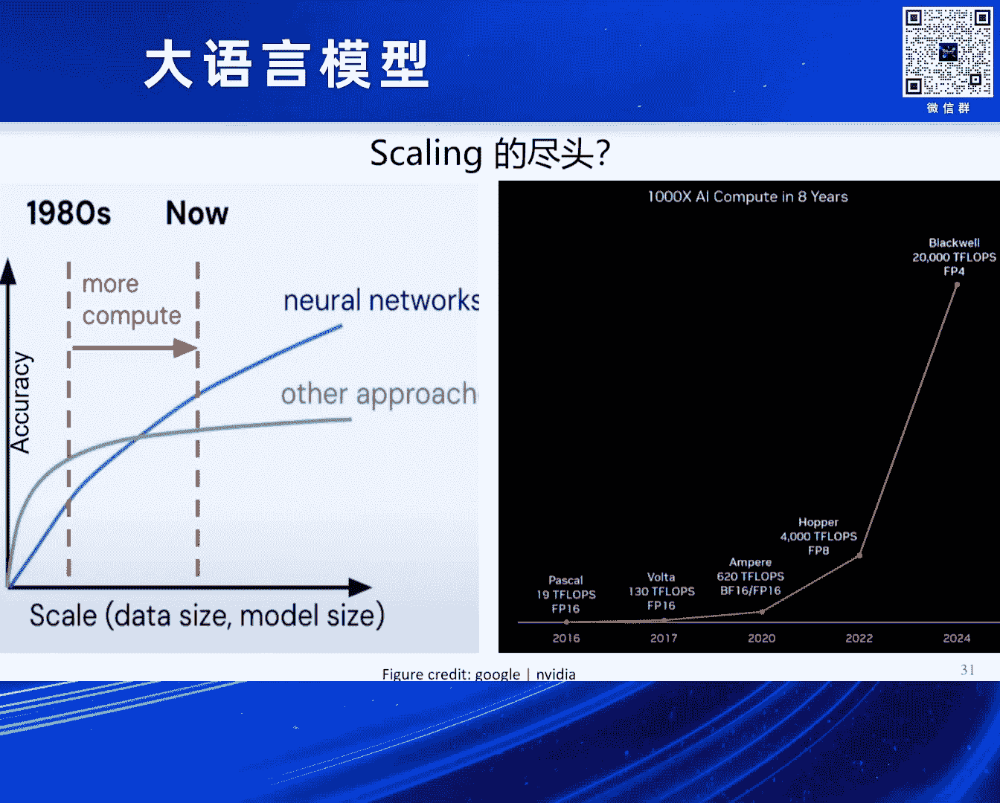

# 2024北京智源大会-大语言模型---P3-理解与探索大模型能力涌现--东昱晓----智源社区---BV1zE421N7UJ
## 课程编号：P3  

在本节课中，我们将学习大语言模型能力涌现现象的本质、如何通过预训练损失（loss）来理解和预测模型能力，以及如何构建具备长上下文处理和智能体（Agent）能力的大模型。我们将通过具体实验、技术策略和实际案例，深入探讨这些核心概念。

---

## 概述：大模型能力涌现的重新审视  

过去的研究认为，大模型的能力涌现（Emergent Ability）主要与模型参数量或计算量达到某个阈值相关。然而，最近的实验表明，**预训练损失（loss）** 才是更关键的因素。当损失降低到一定程度时，模型会在复杂任务上突然表现出能力跃升，这种现象与模型大小无关。

---

## 核心发现：损失（Loss）是关键指标  

上一节我们介绍了能力涌现的传统观点，本节中我们来看看基于损失的新视角。我们通过训练不同规模的模型（从1.5B到32B参数），并在固定计算预算下观察它们在各种任务上的表现，得出了一个重要结论：**模型在目标任务上的性能与预训练损失高度相关，而与模型参数量关系不大**。

具体来说，在数学推理（如GSM8K）和知识问答（如MMLU）等复杂任务上，当预训练损失降低到约2.2时，模型性能会出现显著提升，即“涌现”现象。这可以通过以下公式概括：

**涌现条件：**  
当预训练损失 \( L < L_{\text{threshold}} \) 时，模型在任务 \( T \) 上的性能 \( P \) 出现非线性提升。

```python
# 伪代码：判断能力是否涌现
def is_emergent(loss, threshold=2.2):
    if loss < threshold:
        return True  # 能力涌现
    else:
        return False  # 能力未涌现
```

---

## 实现长上下文处理：技术与策略  

有了对能力涌现的理解，我们接下来探索如何提升模型的实际能力，特别是处理长上下文（Long Context）的能力。这对于构建智能体至关重要，因为智能体任务通常涉及多步决策和外部工具调用，需要模型处理很长的输入序列。

以下是实现长上下文处理的关键策略：

1.  **预训练与外推（Pre-training & Extrapolation）**：在预训练阶段逐步增加序列长度，使模型学会处理更长文本。
2.  **对齐阶段优化（Instruction Tuning for Long Context）**：在对齐（微调）阶段，专门使用长文本指令数据，确保模型在长上下文任务上表现良好。
3.  **数据混合与损失加权（Data Mixing & Loss Weighting）**：精心配比长、短文本数据，并对长文本的损失贡献进行加权，以平衡模型在不同长度输入上的性能。
4.  **训练效率优化（Packing & Sorted Batching）**：采用数据打包（Packing）和排序批处理（Sorted Batching）技术，减少因序列长度不一造成的计算浪费（气泡时间），将训练效率提升2-3倍。

通过上述策略，我们成功将模型的上下文长度从常规的4K/8K逐步扩展到128K，乃至最新的100万token（约200万汉字）。

---

## 构建智能体（Agent）能力：数据与训练  

模型具备长上下文能力后，下一步是赋予其智能体能力，即让模型能够自主规划、调用外部工具（如搜索引擎、代码解释器）来完成复杂任务。实现这一目标的主要挑战在于**数据收集**。

智能体任务的数据不是简单的问答对，而是一个包含多步决策、可能分支和外部交互的轨迹（Trajectory）。为此，我们设计并开源了AgentInstruct数据集。

以下是构建智能体能力的核心步骤：

1.  **环境模拟与数据生成**：在六个模拟环境中让模型自主探索，生成大量的智能体任务轨迹数据。
2.  **混合训练与泛化**：仅使用约1800条高质量的轨迹数据与通用指令数据混合进行微调，模型就能获得强大的智能体能力，并能泛化到未见过的任务上。
3.  **能力保持**：在提升智能体能力的同时，通过数据配比和训练技巧，确保模型在MMLU、代码等通用任务上的性能不下降。

```python
# 伪代码：智能体任务执行流程
def agent_execute(task, model):
    thought = model.plan(task)  # 规划
    if need_tool(thought):
        tool, params = model.select_tool(thought)  # 选择工具
        result = call_external_tool(tool, params)  # 调用工具
        answer = model.process_result(result)  # 处理结果
    else:
        answer = model.generate(task)  # 直接生成
    return answer
```

---



## 多模态与具身智能体：视觉与界面交互  


智能体不仅需要处理文本，还需要像人类一样理解并操作图形用户界面（GUI）。我们进一步探索了多模态模型在智能体领域的应用。

以下是相关模型与技术的介绍：

1.  **CogVLM（视觉语言模型）**：在冻结的大语言模型旁接入一个视觉编码器，以较低成本实现图像与语言的对齐。
2.  **CogAgent（视觉智能体模型）**：针对手机、电脑屏幕等高清图像，引入交叉注意力（Cross-Attention）机制，使模型能以较低计算开销同时处理低分辨率概览和高分辨率细节，从而精准操作UI元素。
3.  **Auto Web GUI**：通过强化学习（DPO）和拒绝采样等技术，训练模型自动完成网页操作任务，例如商品筛选、信息填写等。

这些技术使模型能够“看懂”屏幕并执行点击、输入等操作，向真正的具身智能迈进一步。

---



## 总结与展望  



本节课中我们一起学习了：

1.  **能力涌现的新视角**：大模型的能力涌现更紧密地与预训练损失（loss）挂钩，而非单纯的模型规模。
2.  **长上下文处理**：通过预训练外推、对齐阶段优化和训练技巧，可以高效地扩展模型的上下文处理能力。
3.  **智能体能力构建**：核心在于高质量的轨迹数据。通过少量数据混合训练，即可让模型获得强大的规划与工具调用能力，且不影响通用性能。
4.  **多模态智能体**：通过视觉语言模型和专门架构，让模型具备理解和操作图形界面的能力。



当前，无论是从模型规模扩展（Scaling Law）还是硬件算力增长来看，大模型的发展远未触及天花板。未来的挑战与机遇在于如何更高效、更智能地进行扩展，这需要算法、工程与理论研究的共同突破。希望本课程内容能为你探索大模型的世界提供有益的启发。