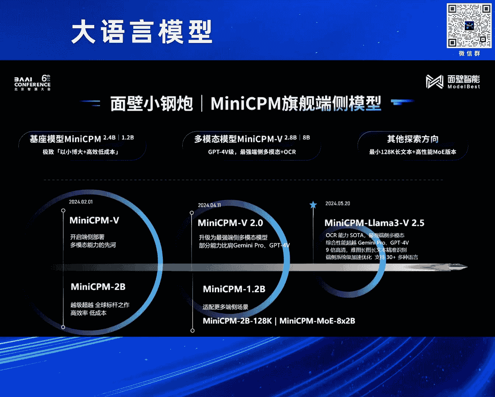
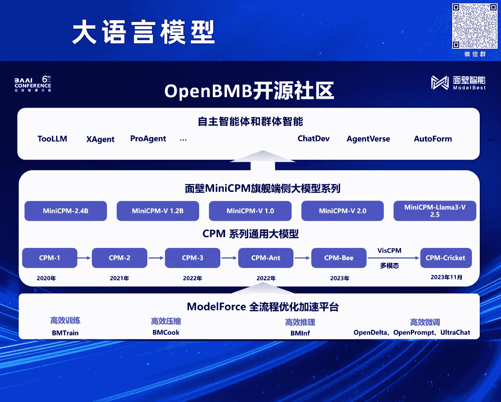

# 2024北京智源大会-大语言模型---P5-小钢炮MiniCPM是如何炼成的--曾国洋---智源社区---BV1zE421N7UJ

## 概述

在本节课中，我们将跟随曾国洋老师的分享，深入探讨MiniCPM系列端侧大语言模型的训练技术、核心发现与实践经验。课程将涵盖从模型压缩趋势、训练方法优化到多模态能力扩展的全过程，旨在为初学者清晰地揭示如何在有限参数量下打造高性能模型。

---

## 1. 端侧大模型的必然趋势 📈

上一节我们介绍了课程背景，本节中我们来看看为何端侧模型会成为大模型发展的必然方向。

从历史数据观察，达到GPT-3（175B）初始知识水平的模型，其参数量正随时间推移而持续减小。研究发现，模型的知识密度大约每八个月提升一倍。这意味着，随着训练技术的进步，越来越多的知识可以被压缩到更小的模型中。

这类似于计算机硬件的发展历程：从占据数个房间的庞大机器，到如今可握于掌中的智能手机。因此，大模型向端侧（如手机、嵌入式设备）发展是技术演进的必然结果。在多模态领域，这一趋势同样显著。

---

## 2. MiniCPM系列模型简介 🤖

在理解了趋势后，我们正式介绍本节课的核心——MiniCPM系列模型。

今年早些时候，我们发布了MiniCPM系列，主要包括：
*   **MiniCPM 1.0**：包含2B和1.2B参数版本。
*   **MiniCPM-V**：支持多模态的版本。
*   **MiniCPM-V 2.5**：多模态模型的升级版。

最初发布的MiniCPM 2B模型是一个意外的成果。它在多项评测中达到了与同期知名模型（如Mistral、Gemma）相当的水平，这在当时的小规模参数量模型中是非常出色的表现。其成功源于我们在训练方法上的多项探索。

---

## 3. 核心训练技术探索 ⚙️

上一节我们了解了模型概貌，本节中我们深入其核心训练技术。

训练大模型时，调整超参数成本高昂，且不同规模模型的最优超参数不同。我们采用了一个基于 **μP（Maximal Update Parametrization）** 的框架。该框架能对参数进行归一化，使得不同规模的模型可以共享一套最优超参数集。

以下是我们的关键发现：

### 3.1 学习率（Learning Rate）的优化

实验表明，**学习率**是对模型效果影响最显著的单一超参数。一个合适的学习率不仅能加速训练，也关乎最终收敛的性能。

通过复现μP相关工作并进行验证，我们发现设置学习率为 **`lr = 0.01`** 能取得非常好的效果。这也是MiniCPM训练中选择0.01作为学习率的原因。

### 3.2 学习率调度器（LR Schedule）的创新

确定了初始学习率后，学习率在训练过程中的变化策略（调度器）同样关键。我们深入研究了常用的余弦退火（Cosine）调度器，发现其效果高度依赖于预设的总训练步数。

我们进行了大量实验，最终提出了一个更简单有效的调度策略：**WSD（Warmup-Stable-Decay）调度器**。

以下是WSD调度器的三个阶段：
1.  **Warmup（预热）**：学习率从0线性增长至目标值（如0.01）。
2.  **Stable（稳定）**：在相当长的时间内保持恒定的高学习率，使模型快速学习。
3.  **Decay（衰减）**：逐步降低学习率，使损失（Loss）快速下降并收敛到更优值。

**公式表示**：`lr_schedule = WSD(warmup_steps, stable_steps, decay_steps)`

WSD的优势在于：
*   **灵活性强**：无需在训练前精确设定总步数，可随时中断或继续训练，只需在最后执行Decay阶段即可优化模型。
*   **效果显著**：实验显示，在Decay阶段后，模型能达到比Cosine调度器更低的损失。

### 3.3 数据效率与模型缩放

我们验证了 **Chinchilla缩放定律**，该定律描述了在给定计算预算下，模型参数量与训练数据量之间的最优配比。

使用相同的数据配方，采用我们的训练方法得到的MiniCPM 2B模型（最终loss约2.4），其知识水平相当于遵循Chinchilla定律训练的约9B参数模型。这就是MiniCPM能以小博大的核心原因之一。

---

## 4. 多模态能力扩展：MiniCPM-V 👁️🗨️

在强大的文本基座模型基础上，我们为其扩展了视觉理解能力，推出了MiniCPM-V。

我们发现，**图文多模态模型的性能极大依赖于其文本基座的能力**。因此，我们将强大的MiniCPM作为基座，使其在多模态任务上能超越参数量数倍于自身的模型。

### 4.1 挑战：高分辨率图像编码

多模态模型面临一个共同挑战：如何统一编码不同尺寸、尤其是高分辨率的图像。现有方案存在局限：
*   **GPT-4V的切片重叠法**：在计数等任务中，可能因物体在切片重叠处被重复计算而出错。
*   **LLaVA-1.5的填充法**：在极端长宽比图像上效果不佳。

### 4.2 解决方案：动态分辨率编码

我们提出了**动态多分辨率编码**方法。其核心思想是：将高分辨率图像分割成多个块时，应尽量使每个块的长宽比接近模型视觉编码器（ViT）预训练时的最佳比例。

**算法思路简述**：
1.  计算输入图像总像素与训练时单图像素的标准倍数 `N`。
2.  枚举所有能将图像切分为 `N` 个块的可能方案。
3.  从所有方案中，选择**每个子块的长宽比最接近预训练标准**的方案作为最终切分方式。

这种方法能自适应处理各种分辨率、长宽比的图像，包括非常长的图文，并实现精准的OCR（光学字符识别）。

### 4.3 效果展示

基于此技术的MiniCPM-V 2.5（结合了更强的基座如LLaMA-3）在综合能力上达到了GPT-4V的水平，并在OCR任务上表现突出。

以下是其能力的部分体现：
*   **精准OCR**：识别中英文、票据信息，并可按JSON格式进行信息抽取。
*   **复杂图像理解**：理解流程图、提取表格信息等传统难点任务。
*   **跨语言多模态**：结合模型的OCR与多语言能力，实现对多种语言图文的理解。

---

## 5. 总结与展望 🌟

本节课中我们一起学习了MiniCPM系列端侧大模型的炼成之路。

我们首先分析了**端侧模型是大势所趋**，然后介绍了**MiniCPM系列模型**。其核心技术在于**训练方法的深度优化**，包括使用μP框架确定最优学习率、创新性地提出**WSD学习率调度器**，以及高效利用数据遵循缩放定律。在此基础上，我们通过**动态多分辨率编码技术**为其扩展了强大的多模态能力，使其在极小参数量下实现了媲美顶级大模型的效果。

展望未来，我们将继续沿着“大模型摩尔定律”推进，目标是让**GPT-3.5水平**的模型真正流畅运行在手机等端侧设备上，并持续为模型添加更多模态的支持。端侧AI的能力必将随着硬件发展与算法进步而越来越强。