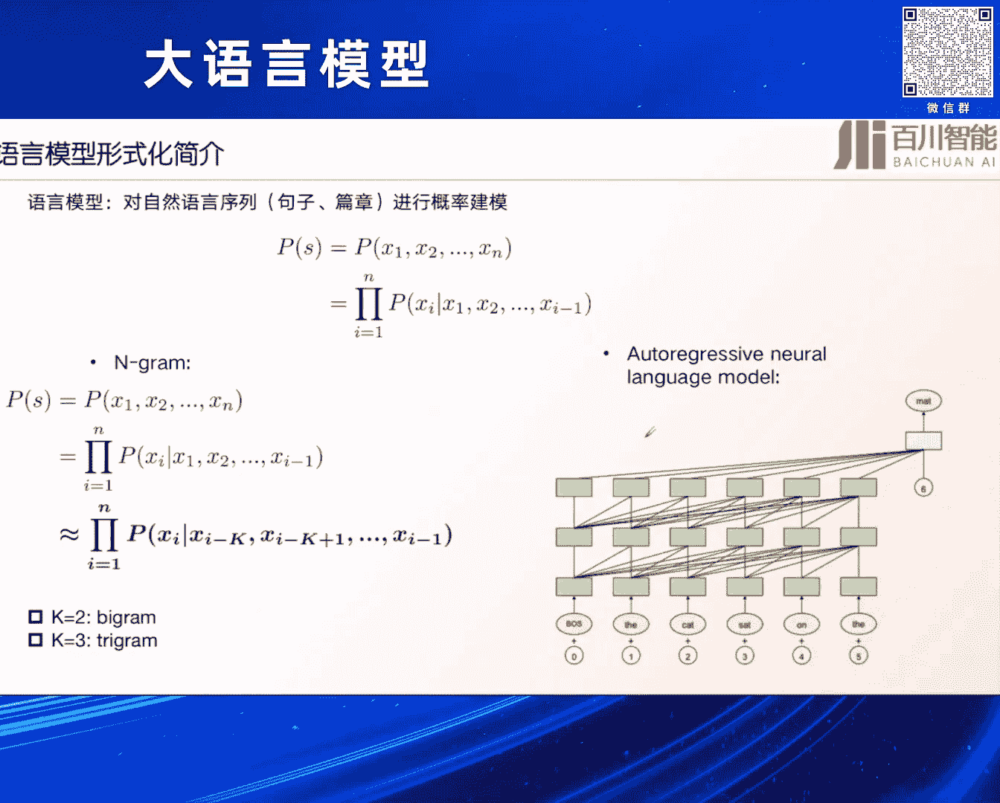
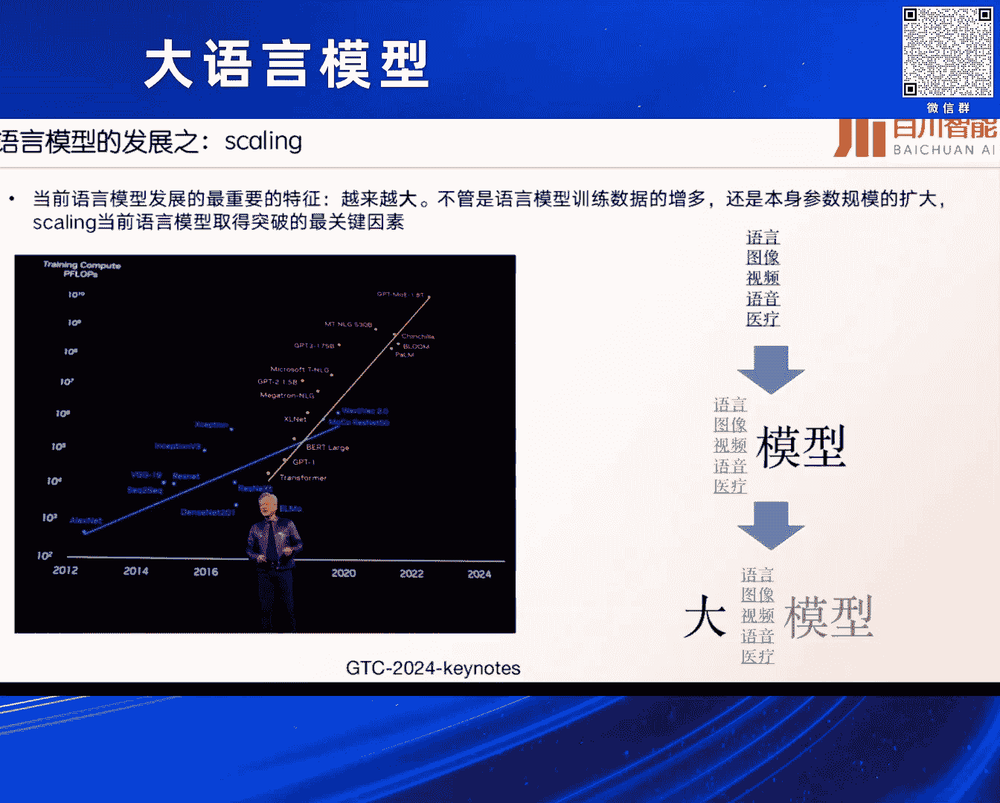
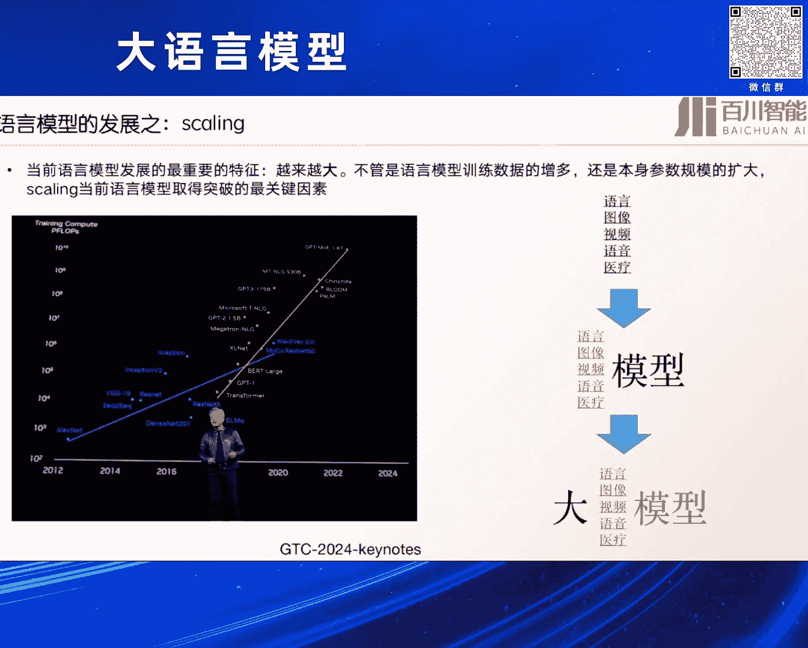
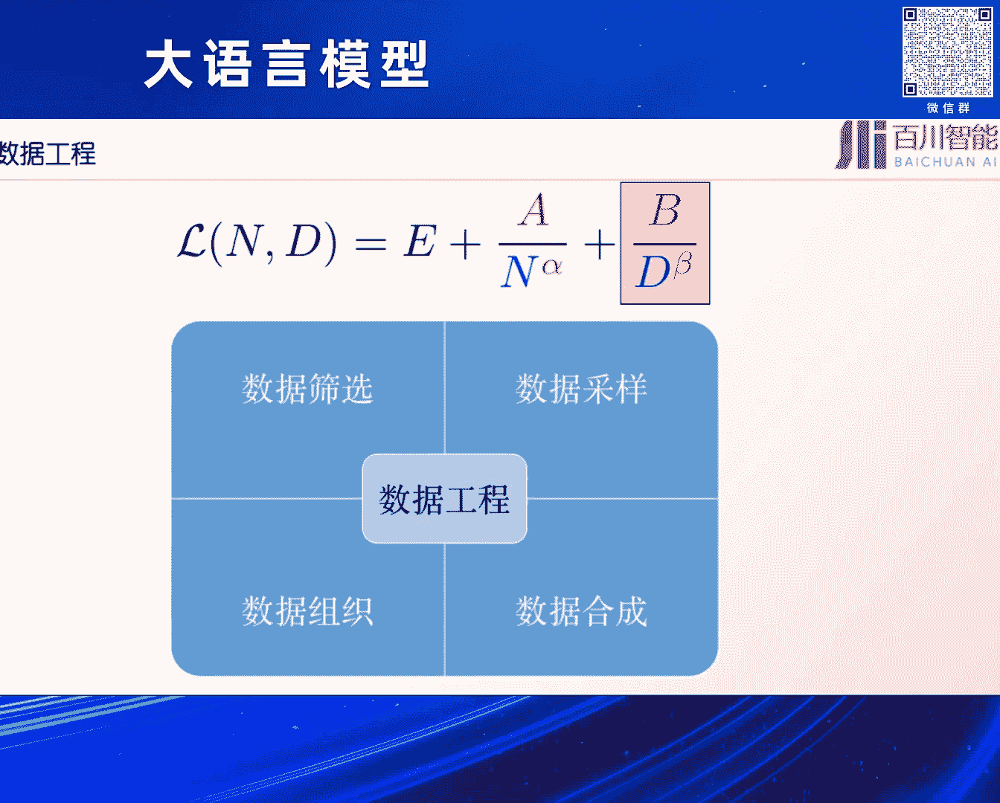
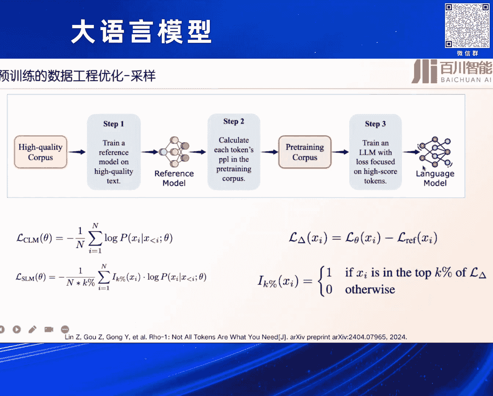

# 2024北京智源大会-大语言模型---P6-大语言模型预训练的效率优化-王炳宁---智源社区---BV1zE421N7UJ

## 课程概述

在本节课中，我们将学习大语言模型预训练阶段效率优化的核心方法与思路。课程内容将围绕如何在不盲目扩大模型规模和数据量的前提下，通过优化模型结构、训练方法和数据工程，在单位时间内获得更高的模型性能。

---

## 为什么要进行效率优化？

上一节我们概述了课程目标，本节中我们来看看效率优化的必要性。

大模型时代的一个显著特征是模型和数据规模巨大。提升模型能力的一个关键方法是遵循扩展定律，即不断扩展模型参数和训练数据量。然而，在实际训练中，除了无限制地扩展规模，我们还需要思考如何在单位时间内，让模型从数据中学习到更多、更有效的知识，实现更高的智能压缩效率。这正是当前大语言模型预训练和微调阶段都在努力的方向。

---

## 核心原理：扩展定律

理解了效率优化的目标后，我们需要了解其背后的核心指导原则——扩展定律。

语言模型本质上是对语言序列的概率进行建模。其核心是根据前面的词序列预测下一个词的概率，即“下一个词预测”。传统的语言模型如N-gram基于前几个词进行预测。而现代大模型普遍采用自回归模型范式，依靠神经网络根据前面若干个词直接预测后续词。

当前语言模型发展的一个重要特征是规模越来越大，无论是训练数据还是参数规模。扩展定律被认为是通往通用人工智能道路上最重要的突破性因素之一。从模型发展历程看，早期我们专注于特征工程和特定任务的模型，2010年后深度学习兴起，我们研究如何用单一模型处理多种任务。而2022年后，大家普遍认识到“做大模型”是统一各种能力的关键。

扩展定律可以形式化地表达为对损失函数的预测。语言模型的损失可分为一个不可降低的下界和一个可降低的残余损失。无论模型多大、数据多少，损失最终会趋近于一个下界。而通过扩大参数规模、增加数据量或延长训练时间，可以降低残余损失。这就是扩展定律的基本思想。

目前对扩展定律有多种表达方式。例如，OpenAI提出损失与数据量、计算资源和参数量三个指标相关，并通过训练不同规模的模型来拟合定律。另一个经典表达来自Chinchilla，它将损失视为一个幂律函数。

我们当前进行的许多优化工作，无论是模型结构优化还是训练方案调整，本质上都是在优化这个扩展定律，目标是让损失降得更低。然而，扩展定律的存在性虽然被广泛接受，但对其具体参数的拟合却非常脆弱和粗略。最近的研究表明，需要非常多的参数样本才能准确拟合出定律中的超参数。如果拟合错误，会对结果预估产生巨大影响。

因此，提升模型性能不仅可以通过“暴力”扩大模型尺寸和增加数据量来实现，还可以通过以下更高效的方式优化扩展定律中的参数：
*   设计更好的模型结构来提升参数效率。
*   使用更高质量的数据来提升数据效率。
*   应用更好的训练技巧来同时优化参数和数据效率。

---

## 模型结构优化

上一节我们介绍了扩展定律是效率优化的总纲，本节中我们来看看如何从模型结构层面进行优化。

### 注意力机制优化

Transformer架构的核心是注意力机制，但其计算复杂度与序列长度的平方成正比，在处理长文本时效率低下。因此，许多工作致力于降低其复杂度。

以下是几种主要的优化思路：
*   **稀疏注意力**： 将全连接的注意力矩阵变为稀疏的，例如Blockwise Attention，将复杂度从O(N²)降低到更小的级别。
*   **注意力模式改进**： 研究发现，当前模型对序列开头部分的注意力关注过多。基于此，StreamingLLM等工作提出了对注意力机制的改造，取得了不错的效果。

### 替代架构探索

除了优化注意力机制，也有研究探索全新的模型架构来替代Transformer。

*   **循环神经网络复兴**： RNN因其递归特性，理论上非常适合序列建模，但在大模型时代一度被忽视。最近，Mamba、RWKV等基于状态空间模型或类似RNN结构的新架构重新受到关注。它们通过递归机制将历史信息压缩在一个固定状态中，避免了计算复杂度随序列长度平方增长的问题，在长文本处理和效率上展现出潜力。
*   **基于记忆的方法**： 这类方法将信息存储在内部或外部的固定容量记忆中，以减少对历史信息的直接依赖，同样旨在控制计算复杂度的增长。

### 模型冗余与本质空间

当前的大语言模型可能存在显著冗余。例如，实验发现将模型末尾的若干层直接移除，对模型性能影响甚微。这提示我们，模型优化可能需要寻找一个更紧凑的“本质空间”来表示知识。

这类似于深度学习中的“彩票假设”：只有当模型足够大时，才能从中找到一个性能优良的紧凑子网络。未来的模型优化可能需要致力于更高效地找到这个本质空间，从而降低大模型的训练和推理代价。

---

## 训练方法与超参数优化

在讨论了模型结构之后，我们转向训练过程本身的优化。

### 优化器选择

优化器的选择对训练效率至关重要。目前大语言模型预训练普遍使用AdamW优化器，但这并非绝对真理。

*   **Adam vs. SGD**： 在传统机器学习中，关于Adam和SGD孰优孰劣存在争议。但在大语言模型领域，Adam通常表现更好。一个关键原因是Adam引入了二阶动量信息，缓解了损失函数曲面的“尖锐性”，使得优化过程更平滑，更容易找到好的极小值点。
*   **处理长尾数据**： 研究表明，Adam在处理低频（长尾）数据模式时比SGD更具优势。这对于学习小众语言或罕见模式非常重要。
*   **最新进展**： Sophia等新型优化器通过对二阶信息进行近似，在大语言模型训练中实现了比Adam更快的收敛速度。

### 超参数与训练策略

模型结构和优化器确定后，超参数设置和训练策略是影响效率的关键。

以下是几个重要的优化方向：
*   **模型初始化**： 良好的初始化能让模型更快收敛到好的解。例如，Tensor Programs等方法通过小模型来指导大模型的参数初始化。
*   **批量大小与学习率**： 寻找批量大小和学习率之间的最佳关系。研究表明，在一定范围内，采用合适的学习率衰减策略比追求某个精确的固定值更为重要。
*   **学习率调度**： 分阶段的训练策略（如预热、稳定、衰减）在大模型时代被证明非常有效。
*   **精度优化**： 采用混合精度训练，甚至FP8训练，可以显著减少显存占用并提升计算速度，但这与硬件支持紧密相关。

需要注意的是，许多训练技巧和超参数设置是在较小规模模型上调试得到的。当模型规模急剧扩大时，这些经验是否依然有效，目前尚无完全定论，这是效率优化面临的一个潜在风险。

---

## 数据工程优化

最后，我们探讨如何从数据层面提升训练效率。

数据工程的优化主要包括数据的筛选、采样、合成和组织。这里重点介绍采样策略的优化。

### 数据采样策略

当前不同模型采用不同的数据采样方法，但大多基于启发式规则，缺乏科学指导。

*   **基于扩展定律的领域配比**： 近期研究提出，可以依据扩展定律，先训练小模型来探索不同数据领域的最佳混合比例，然后将此比例应用于大模型训练。这种方法可以用更少的数据量达到更好的模型困惑度。
*   **细粒度Token采样**： 另一种思路是在句子内部进行细粒度采样，区分重要和不重要的Token。例如，ReaLM等方法通过优化Token级别的采样，在较短时间内训练出了性能优异的模型。

这些数据层面的优化，同样旨在单位时间内让模型学习到更有效的信息，从而提升扩展定律中的参数效率。

---

## 课程总结

本节课中，我们一起学习了大语言模型预训练效率优化的核心思路与方法。

我们首先明确了效率优化的目标是在有限资源下获得更高性能。接着，深入理解了指导这一切的扩展定律原理。然后，我们从三个主要方向探讨了优化手段：
1.  **模型结构优化**： 包括改进注意力机制、探索RNN等替代架构，以及思考如何减少模型冗余。
2.  **训练方法优化**： 涉及优化器选择、超参数调优以及训练策略的制定。
3.  **数据工程优化**： 重点是设计更科学的数据采样和配比策略。

所有这些工作的核心，都是围绕优化扩展定律中的关键参数，力求在单位时间内最大化模型的能力提升。然而，我们也需认识到，许多现有技巧本质上是人为引入的归纳偏置。从长远看，遵循扩展定律的第一性原理，持续扩大规模以涌现更高级的智能，可能仍是更根本的路径。效率优化则是在这条道路上，让我们走得更快、更稳的关键助力。