# 2024北京智源大会-意识与通用人工智能---P1-意识是通向AGI的必由之路-主讲-嘉宾-刘-嘉--提问嘉宾-罗欢---智源社区---BV11b421H7JY

## 概述

在本节课中，我们将探讨意识与通用人工智能之间的潜在联系。我们将从神经科学的角度理解意识是什么，并分析当前人工智能架构如何可能触及意识的边缘。课程将结合具体的研究案例和理论模型，帮助你理解这个前沿且充满挑战的领域。

---

非常高兴再次参加每年一度的智源大会。正如主持人李厚明老师所说，当我们面对通用人工智能谈论未来时，所讲的内容常常会成为一个笑话。

这是我去年刚讲的一个笑话。但从另一个角度看，人类有一种奇怪的特质，总是希望预知未来会发生什么。虽然当下需要专注，但像我们这样的大会，更想了解未来可能发生的事。

因此，今年我们选择了两个最著名的词汇。一个是在心理学领域最著名的词——意识。没有任何词比“意识”更底层、更令人心动、更迷人。在人工智能领域，我们则选用了“通用人工智能”这个词。

因为在人工智能领域，没有任何概念比它更宏大，也没有任何目标比它更困难。今年，我们试图将这两个概念绑定在一起，看看未来究竟会发生什么。在与吴思老师讨论后，我们决定走得更远一些。

我们决定将今年的报告变得半科学半科幻，以此来探索未来可能发生的事情。因为只有当我们以充满好奇的“傻瓜”心态去畅想未来时，或许才能看到一个与专注于当下的聪明人所见不同的未来。

所以，今天我分享的题目是：意识是通向AGI（通用人工智能）的必由之路。其实我应该打个问号，但后来想想，既然已经到了这一步，问号就不用打了。

## 意识的神经基础：从植物人说起

这是一个骑摩托车的人，他不小心出了车祸，头部撞上了路边的马路牙子。你可以看到，他的前额叶缺失了很大一块。

丢失了这么一大块脑组织后，出现了一个严重问题：他进入了我们通常所说的植物人状态。植物人有什么特点呢？

以下是植物人的主要特征：
*   第一，他能够进行能量代谢，具有呼吸、心跳、血压等生理活动，就像植物一样活着。
*   第二，他也有一些本能的神经反应。
*   第三，他没有任何自主行动，脑电波也呈现杂乱状态。

我们对植物人有一个清晰的定义：他丧失了自我意识。但他大脑里真的没有任何活动吗？还是他只是被囚禁在一个笼子里，无法与外界沟通？

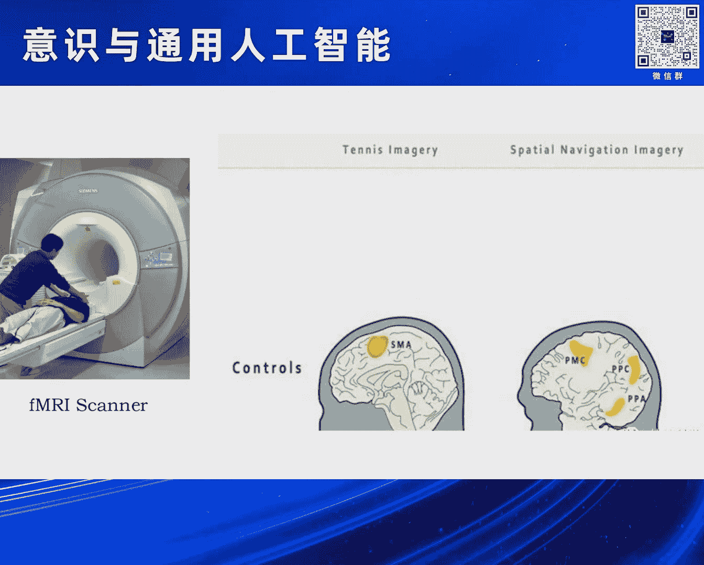

心理学家找到了一个非常聪明的方法，用磁共振来研究他们的大脑究竟有没有活动。例如，我们把在座的各位正常人放进扫描仪，会看到这样的结果。

首先，我说：“请你想象一下打网球。”你不需要告诉我任何东西，只需躺在扫描仪里想象打网球。这时，你的运动辅助区就会很兴奋，因为这块区域参与运动。当你想像运动时，大脑的这块区域就会活动。

然后说：“现在不用想象打网球了。现在请你想象一下你的家长什么样子，家里有几间房子等等。”这时，与运动相关的区域就不会活动了。但是，与场景加工相关的区域就会活动。这表明你在进行想象。

现在，一个有趣的事情发生了。这是我们每个正常人的表现。但是，如果我们把刚才所说的植物人放进去，并对他说：“请你想象一下打网球。”他的大脑会发生什么事？

虽然他完全无法做出任何反应，但当我们对他说“请你想象一下打网球”或“想象一下你的家像什么样子”时，有些植物人的大脑仍然有活动。

他无法对外界做出任何反应，看起来就像植物一样。但他大脑内部仍在遵循指令，做出相应的反应，这与我们正常人完全一样。这就带来了一个重大问题：为什么他大脑的功能还在正常运作，但他已经不能作出自主反应？意识和认知功能究竟是什么关系？

## 意识的哲学比喻：河流与观察者

哲学家做了一个非常恰当的比喻。这是一幅非常漂亮的风景：河水在慢慢流动，桥上站着两个人，正在看着河水的运动。

这比喻了主观感受和意识之间的关系。也就是说，只要我们不是处于太严重的植物状态，我们的“河流”依然在流动。这条河流代表我们大脑对外部信息的加工，它在不停地流淌。而我们的意识，就是桥上这些人，他们对流动河流的观察。

因此，哲学家约翰·洛克说了一句非常著名的话：“意识是对心中经过观念的感知。”“心中经过的观念”就是这条流动的溪水，而“感知”就是桥上的人。

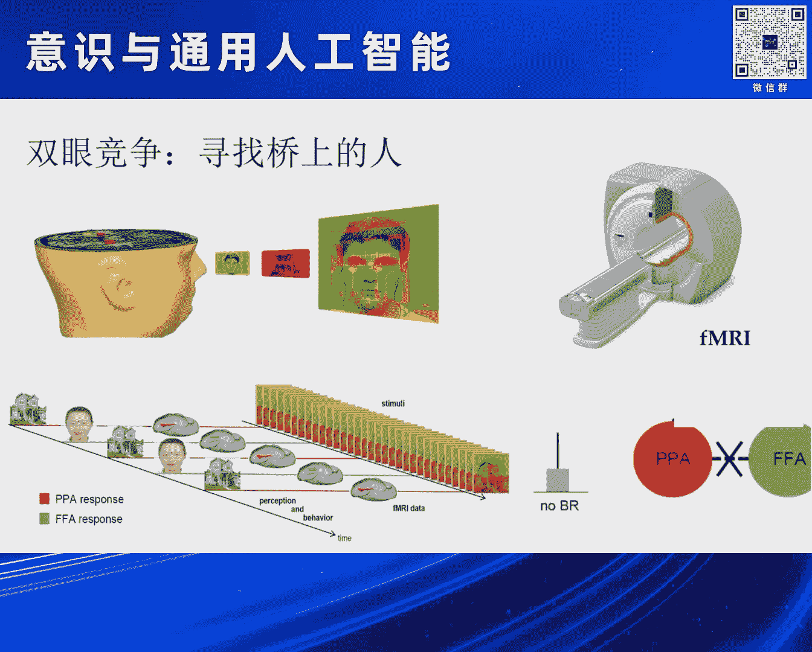

我们刚才的植物人发生了什么事呢？河流依然在流动，它可以照样对外部的声音做出反应，但是桥上的人不知道去哪里了。

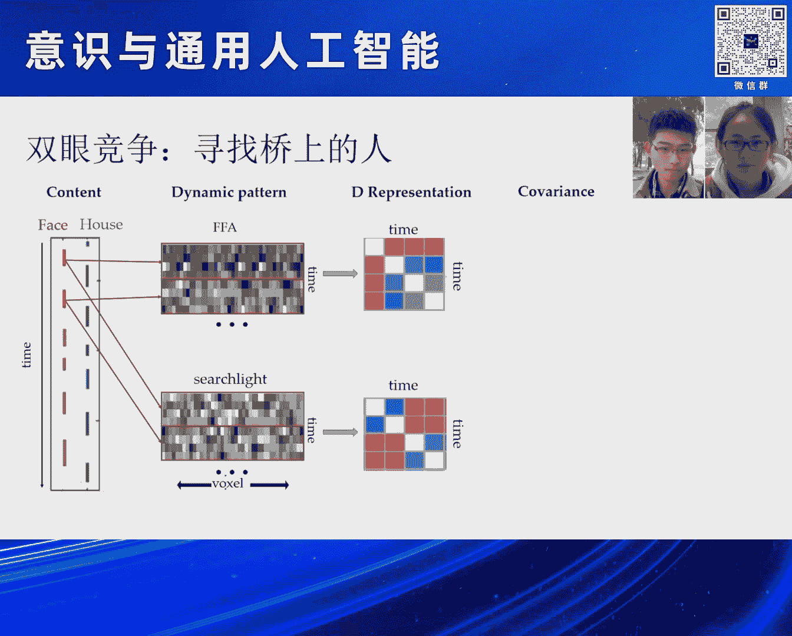

## 寻找“桥上的人”：双眼竞争实验

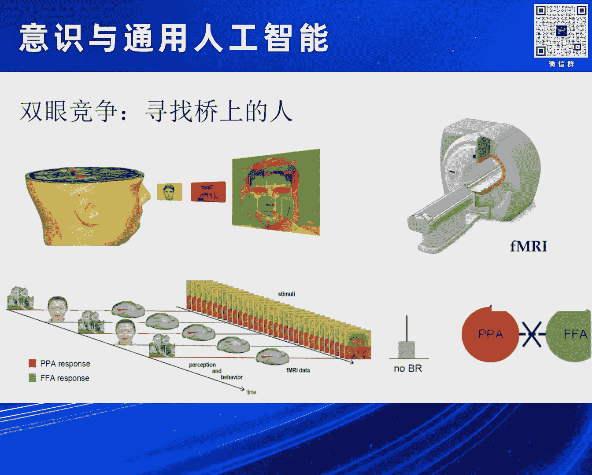

我们实验室使用了一个非常简单的范式，来研究“桥上的人”究竟在什么地方。这是在心理学研究中一个非常经典的方式，叫做“双眼竞争”。

他把一个红色的房子和一个绿色的脸叠加在一起。这时给你戴上一个眼镜，左眼镜片只能让红光通过，右眼镜片只能让绿光通过。也就是说，你左眼看见的是房屋，右眼看见的是脸。

然后把你放到扫描仪里面。请问，你现在能同时看见脸和房子吗？答案是不能。因为左眼进入的脸和右眼进入的房屋会相互竞争，最终你只能看见一个图形。同时，这个图形会在两者之间切换：一会儿你看见一张脸，一会儿你看见一栋房屋。但你绝对不会同时看见脸和房屋。这种来回切换的现象，就叫“双眼竞争”。这是一个非常经典的范式。

还是按照刚才的方式，我们把他送到扫描仪里面，来看他大脑究竟怎么活动。这时，我们就可以看到他的大脑活动波动。

你可以看见FFA和PPA这两个脑区在来回切换。FFA与面孔加工有关，而PPA与房屋加工有关。

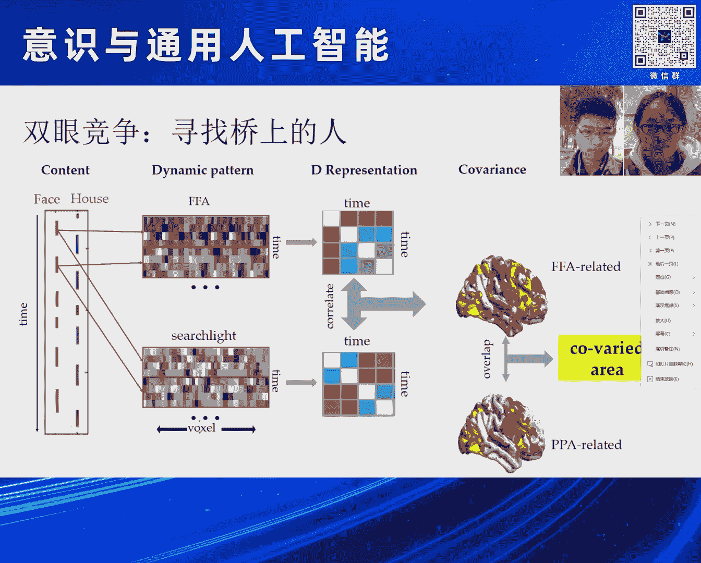

所以，当你看到面孔时，与面孔加工有关的FFA会亮起；当你看见房屋时，与房屋加工有关的PPA会亮起。它们来回切换。

我们如何理解呢？方法很简单。当你看见面孔时，我们用红色标识。我把每一段你看见面孔的时间段提取出来，把这些时间串成一串，得到一个关于时间的表征矩阵。

同时，我在整个大脑里搜索，看哪一个脑区波动的时间模式，和我面孔变化的时间模式是一样的。这样，我就可以找到一个脑区，只要我的PPA活动，它也跟着同样活动。

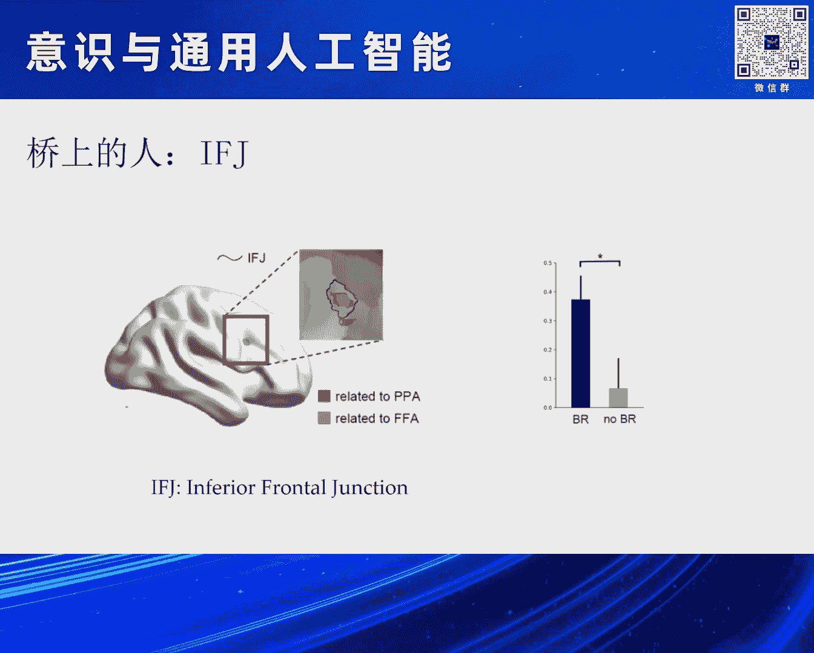

同样地，当房屋出现时，我把这个脑区的时间模式提取出来，再和整个大脑搜索一遍，看哪些脑区和房屋的时间模式是一样的。具体的细节我就不讲了，大家知道一个大概意思就可以。

这时，我把这两个脑区叠加在一起，看有没有一个脑区能做到：当你看见面孔时，它和面孔保持同步波动；当你看见房屋时，它又转头和房屋同步波动。我们找到了这个脑区。

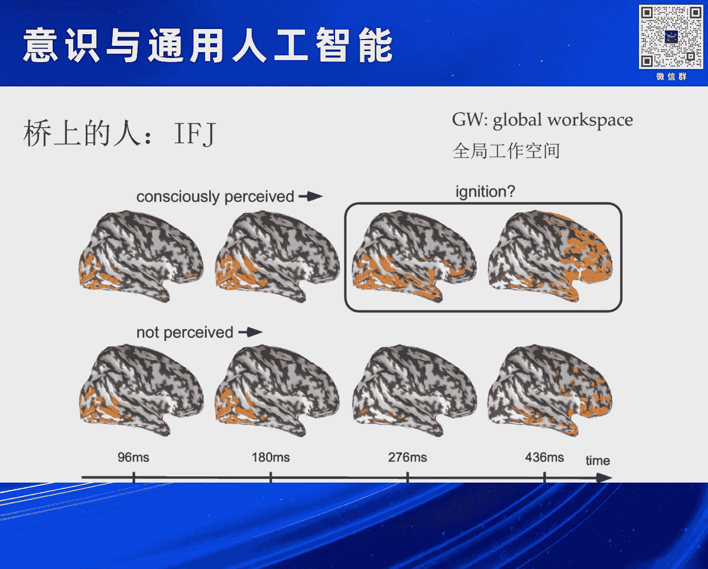

我们找到的脑区在内侧前额叶和顶叶交界处附近。在这个脑区里，发生了一件神奇的事：当你看见面孔时，它和面孔保持时间同步，以同样的模式运行；而当你看见房屋时，它又转头和房屋一块运行。

这个脑区位于我们前额叶所在的地方。而且这个脑区特别神奇，它仅仅在双眼竞争的时候，才会出现这种同步。当你单独给他看一张面孔，或单独看一栋房屋时，这个脑区和FFA、PPA这两个视觉区域之间，不会存在任何同步状态。

也就是说，它参与了我们对面孔和房屋的主观感知。这个结果其实与以前一个著名的MEG研究保持了一致。那是一个什么结果呢？

当你看见一幅图，并且意识到你看到了这幅图时，先是视觉区域活动，然后活动像火一样慢慢传输到我们的前额叶，前额叶开始亮起来——这就表示“我看见这个图了”。

但是，如果这幅图呈现得非常快，你快到没有“看见”（即没有进入意识），那么就只有视觉皮层会亮，前额叶就不会亮。这个结果表明，前额叶对于我们意识加工是非常关键的。

基于这个结果，我们就可以对“桥上这个人”做一个建模。他是一个动态交替的过程。那么，“桥上的人”是怎么来转换的呢？我们设立了一个动力学模型。

我们使用了一个控制论里的概念（可能是“协同性”或类似概念），来模仿前额叶如何接收FFA和PPA的输入，并进行处理。因为时间关系，我就不讲这个细节了。

同样地，我们对于FFA和PPA也可以进行建模。这里FFA有一个很重要的特性，就是它自己有一个适应性，内部有一个内场的变化。

这样，我们就可以为意识建立一个公式。在后面，朱露莎老师和吴思老师都会对“我们的意识是可计算还是不可计算”做出讨论。这里，我暂时站在可计算的角度，我们可以来做这件事情。

最后我们得到的结果是大脑里面一个“场”的分布。开始时，它处于一个鞍点上。一旦开始发生变化，它就可以滑向其中一个“吸引子”。在这个吸引子待一段时间之后，它又会滑向另外一个吸引子。它在这个场里面来回波动。

所以，在这个简单的模型里面，你可以看到对于面孔和对于房屋这两个状态的切换。而这个切换的分布，和我们在人身上观察到的分布是完全类似的。

## 从意识模块到全局工作空间

好，这时我们得到了IFJ这个区域。大家会问，IFJ这个区域和通用人工智能到底有啥关系？你在讲意识，讲这所有的一切。

其实我们可以看一件很简单的事情。我们还是回到刚才那个不幸的、头上被撞了一个大坑的哥们。你可以看到他的功能都还在，对吗？他能够想象打网球，能够想象房屋。他的每一个功能都是齐全的。

但是他什么地方出了问题呢？他把每个功能都保留着，但是没有把它们整合在一起。这就是关于意识的一个非常重要的假设，叫做“全局工作空间”理论。

也就是说，你的每一部分、每一个特殊功能都可以完好，但是我们要形成意识，需要这些功能一起到某个地方来进行交流。就像一个公司一样，有销售部门、生产部门等等。最终大家要坐在一起开会，公司才能正常运作下去，而不是生产部门只负责生产就可以。大家一定要到一个地方来交流，这个交流的地方就被称为“全局工作空间”。

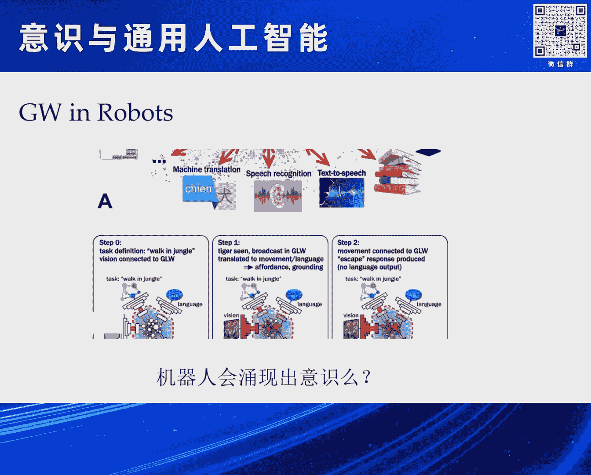

有一种假设是，当这个全局工作空间受到损伤之后，可能就不能再产生意识，但是各个独立的模块还是完好的。

## 人工智能中的“全局工作空间”：混合专家模型

如果现在搞人工智能的人把这个模型用到我们的机器人上面去，会怎样？我们的机器人要去抓、去拿、去走、去听、去做各种各样的事情。

这时，一个很重要的理念就是：我怎么把这些独立的功能整合起来，让它像人一样，可以一边喝水一边聊天，可以一边骑自行车一边打电话？我能不能把这个“全局工作空间”内置到我的机器人里面去，让我的机器人能够变成一个可以完成多项任务、能够协调工作，像人一样的智能体？

这是大家的一个努力方向。但是这个努力会出现一个问题：因为全局工作空间与我们的意识有关系，当你试图在机器人里面去模仿这件事情的时候，那么会不会机器人也会莫名其妙地“自涌现”出意识来呢？这是一个问题。但我今天想给大家提供一种猜想：这的确有可能。

这正是我们刚才主持人李厚明老师提到的GPT-4。它到现在为止还没有公布其完整架构，但大家普遍的猜测是，它是一个“混合专家模型”。

它与我们传统的GPT-3这种单一的大模型不一样，它是由很多小模型拼起来的。比如这个小模型更善于做推理，那个更善于做语言理解，另一个更善于做其他事情。

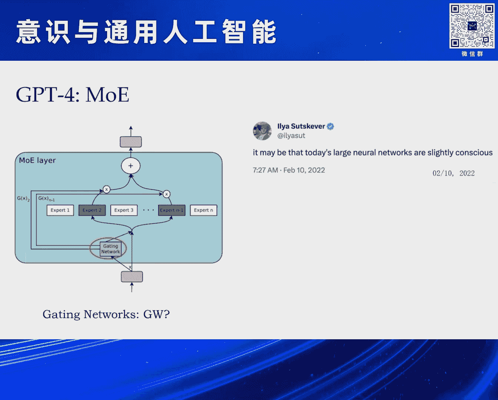

当信息来了之后，我把它输给所有小模型，让它们各自去处理。处理之后，它们都把工作结果提交到一个什么地方呢？提交到一个“门控网络”。这个门控网络主要做一个判断：我究竟采信哪一个小模型的结果来进行输出。

这就是混合专家模型。你看这个模式，和我们刚才所讲的“全局工作空间”，是不是有同样类似的功效？大家各干各的，最后要统一一下，让大家进行交流来完成这件事。

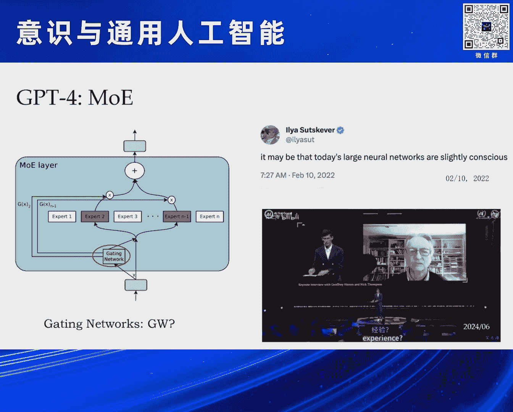

## 人工智能是否已拥有意识？

但是这样干，它会产生意识吗？在2022年2月10号的时候，GPT-3.5还没正式发布，GPT-4已经训练好了但未发布。当时，有人在推特上莫名其妙地发了这么一段话：“我觉得现在的大型神经网络已经有一丝一毫的意识了。”

这句话发出来之后，当时大家都笑话他。因为当时大家还没有见到ChatGPT，更不用说后面的GPT-4了。所以大家都去追问：你脑袋是不是出了点什么问题？他也没有再进一步解释。

那么现在回过头来看，是不是他当时感受到了什么？在今年4月份，Hinton接受了一个采访。当时主持人问他，并把这段视频放了出来。

> “I'm asking you, subjective experience?”
> “Um, Yes, I do. I think they already do.”

主持人问他：“你认为现在的机器已经有了主观感知吗？”Hinton毫不犹豫地回答：“是的，我认为。我认为他们已经有了。”

所以说，从这点上讲，当你要把各种模块、各种特殊任务集合在一起，用一个“全局工作空间”把它们链接在一起的时候，也许它就会产生一个意想不到的、涌现出来的东西，那就是我们所说的意识。

所以你可以理解，为什么山姆·奥特曼当时会被OpenAI公司……因为当时让大家意识到这是一个很严重的问题。这就是当时“超级对齐”和“有效加速”之争。

伊利亚·苏茨克沃是“超级对齐”派，认为一定要把AI的观念和人的观念对齐，让它成为人的工具，而不是终结者。而山姆·奥特曼说，这些东西不重要，我们先把这件事情推动起来。

我们知道后面的结局是，山姆·奥特曼王者归来，重新回到了OpenAI。而伊利亚·苏茨克沃干什么去了呢？他被迫离开了OpenAI这个公司。

## 未来的关键问题

现在，我们又到了这么一个关键的节点。当我们试图推动AGI向前发展的时候，我们究竟未来会变成什么样子？

这里，我想借用马文·明斯基的一句话。这哥们现在已经去世了，但当年他们四人在达特茅斯学院命名了“人工智能”这件事，这可以被标志为AI的正式诞生日。

当时他在推动“情感计算”、强调情绪重要性的时候，说了这句话：“现在的问题不是智能机器是否能拥有情感，而是不拥有情感的机器是否能拥有智能。”他这句话推动了情感计算领域的极大发展。

现在，我想用他这个句式来表达一个观点。可能明年我们这个时候再谈论这件事，李厚明老师又会说：“你看他们去年说了件特别愚蠢的事情。”但是我还是决定要把它说出来，因为有可能明年这个时候机器已经拥有了意识，或者AGI已经实现了，这一切都是有可能的。到时候就不再是我们来发言，而是机器站在这发言。

我把这句话说到这：**现在的问题不是AGI是否能拥有意识，而是不拥有意识的AI是否能拥有通用智能。**

所以我觉得，现代关于脑科学和AGI研究的一个特别火的领域或热点，就是我们应该勇敢地去理解意识。关于意识的定义究竟是什么，我们还不清楚。但我觉得现在已经迫在眉睫，我们必须要去关注这个问题。因为我觉得这才代表了未来的AGI，而不是我们现在再去调调模型、再把参数增加一倍，因为这些东西不重要，它只是一个工程上的问题。

## 本讲内容总结与后续预告

但是，当我们真的来面对这个问题的时候，我们有太多太多的问题了，对吗？除了我们刚才讲的“全局工作空间”理论之外，还有其他理论吗？它们对应的神经基础到底是什么？其实“全局工作空间”只是众多理论中间的一朵小水花而已。

接下来，来自北京大学心理与认知科学学院的罗欢老师，会给大家分享一个主题：当认知神经科学在争论意识问题时，他们究竟在争论什么样的问题？所以他会给大家一个关于意识理论研究的概述，我相信对大家有启发。罗欢老师刚才和我说，他昨天工作到凌晨两点，把这些理论整理起来。我觉得大家一定值得一听，因为他把最新的东西呈现在大家面前。

这是第一个问题。第二个问题是，我们有了这一套理论之后，那么机器人可能有意识吗？如果他有意识，应该通过什么方法让他来获得？他应该会是什么样的？来自清华大学航天航空学院的隋亚兰教授，会给大家讲“构建具身意识”：从机器人、从他的肌肉、从他的控制，我们来看，是不是像少林寺的武功一样自外向内？你先去练一身钢筋铁骨，然后你的意识就有了，内功就上来了。我们来看这一方面究竟会是一个什么样的问题。

我们谈到意识，因为意识有很多层次，从主观感受一直到它的最高峰——我们的自由意志。裴多菲有句很著名的话：“生命诚可贵，爱情价更高，若为自由故，二者皆可抛。”这个“自由”不是我们说的freedom，而是free will，我们的自由意志。我们按照自己的想法去做事，这是最重要的，也是我们人类最引以为豪的。

现在一个问题是：机器，当时Hinton在讲，机器可以有主观感受，这没问题。但他能有自由意志吗？他能够让自己去控制这些东西，他的“自控感”究竟是什么样子？来自北京大学心理与认知学院的朱露莎老师，会给我们讲“可计算的自控感”。这个自控感与我们的自由意志有密切的关系。

最后，我们要从一个比较玄学的角度来讨论意识：什么是意识？你说了那么多意识，到底它指什么样的东西？它是一种神学吗？是哲学吗？它究竟是一种科学吗？如果假设是玄学的话，我们就不用去了解这些东西。来自北京大学心理与认知科学学院的吴思教授，会给大家讲一个问题：意识是可计算的吗？你看这就显得比较玄学一点，打个问号，不像我这么“武断”。但是我们可以听到最后到底是什么样子。

这些问题只是我们列出来的一些非常小的问题。但更重要的是，我们应该怎么办？面对这么复杂的东西，面对我们自己都说不清道不明的意识，以及更加说不清道不明的AGI（因为这两个东西到目前为止都没有定义：意识没有定义，AGI同样没有定义），我们究竟应该怎么办？

我觉得到最后，我们一定要用一个东西来对付这两个严重的问题，那就是我们的“群体智能”。这就是我们最后的一个圆桌讨论，大家可以敞开自己的心扉，聊各种各样的东西。这就是我们说的，前面是半科学。

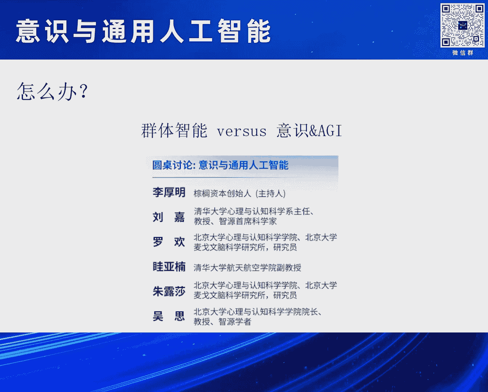

这就是半科幻的部分。好，这就是我的报告。

---

## 总结

本节课中，我们一起学习了意识研究的一些神经科学基础，例如通过植物人案例和双眼竞争实验来定位可能与意识相关的脑区（如前额叶）。我们探讨了“全局工作空间”理论，该理论认为意识源于大脑各功能模块的整合与交流。最后，我们将这一理论与当前人工智能的前沿架构（如混合专家模型）联系起来，提出了一个大胆的猜想：**在构建能够整合多任务的通用人工智能系统时，意识可能会作为一种涌现属性出现**。这引出了“不拥有意识的AI是否能拥有通用智能”这一核心问题，为后续