# 2024北京智源大会-意识与通用人工智能---P3-构建具身的意识-主讲嘉宾-眭亚楠-提问嘉宾-朱露莎---智源社区---BV11b421H7JY
## 课程编号：P3

在本节课中，我们将从一个工程和构建的视角，探讨如何自下而上地构建具身的自我意识。我们将了解世界模型、自身模型与意识之间的关系，并重点介绍通过精确的肌肉骨骼系统建模来构建自身模型的方法。

---

我的研究方向更偏向于工科计算。今天的报告将从工程构建的角度出发，探讨我们如何构建具身的意识。

大家看到的背景并非电脑或屏幕问题，它是我们意识呈现的一部分。我们将在后面解释它为何如此呈现。

首先，延续本系列报告的良好传统，我的报告与前面刘老师和罗老师的报告存在较多连接。第一处连接是关于ChatGPT的讨论。

之前我们提到，可以向ChatGPT提问：“Do you have consciousness?” 在罗老师提出这个问题后，大家可能自行查询并猜测了ChatGPT的回答。它可能会认为自己有意识，也可能认为没有。

现在换一种问法：有多少人认为ChatGPT有意识？多少人认为它没有意识？我们来看它给出的答案。

用两种语言提问得到的回答基本一致。以中文为例，提问“ChatGPT，你有意识吗？”，它的回答是：“没有，我没有意识。我是由OpenAI开发的人工智能，旨在基于数据的模式处理生成文本，缺乏人类和动物所有的自我感知、情感和主观体验，这些都是意识特征。”

它在此列举了意识的特征，并说明其回答是通过算法生成的，没有对内容的理解或感知。

对于熟悉模型构建的群体而言，这个结论并不意外。因为所有这类问题的结果都经过人为干预和处理，经过了安全对齐等多轮调整，最终呈现出一个让我们觉得不那么敏感甚至完全无害的结果。

这是GPT-4版本给出的答案。不同版本的效果可以进一步测试。

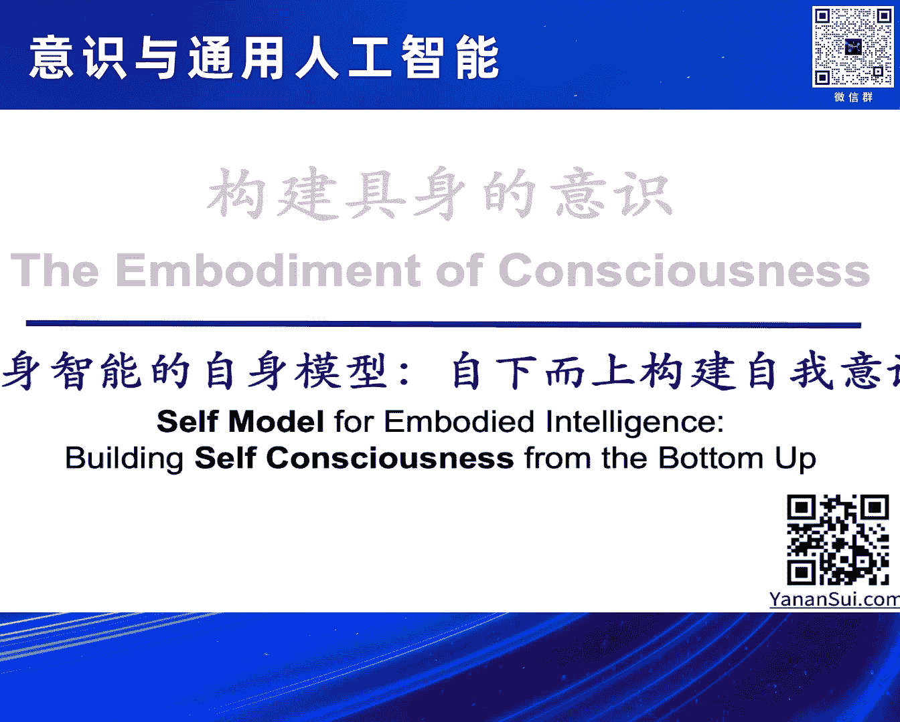

前面的老师也探讨过，意识是人类独有，还是人类与动物共有。从ChatGPT的回答中，我们至少能看到它在这个问题上的倾向性。

以上是对前面问题的简短回应。现在回到我报告的主线。

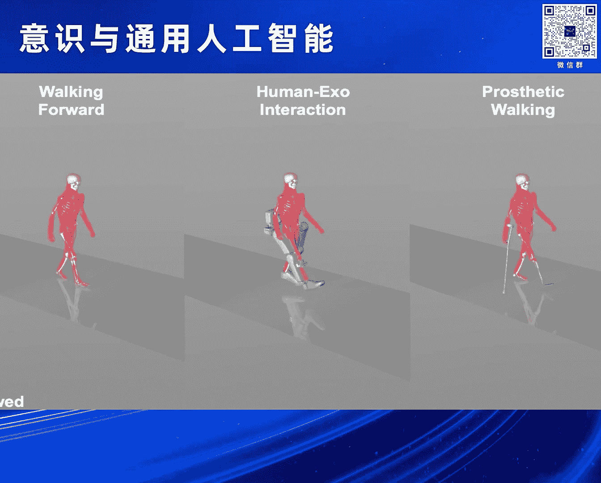

我们将去掉意识的背景，清晰地探讨在接下来的20多分钟里，如何以一种自下而上的方式构建自我意识。我们的意识包括对外部世界和内部自我的感知，今天主要聚焦于内部。

**如何自下而上地构建自我意识。**

也就是说，在报告结尾时，我们将探讨如何潜入自我意识的海洋，以及它与我们直观的运动行为之间有何关联。这两者如何联系起来？

这与我的研究主线相关。我主要研究 **`learning to move`**。

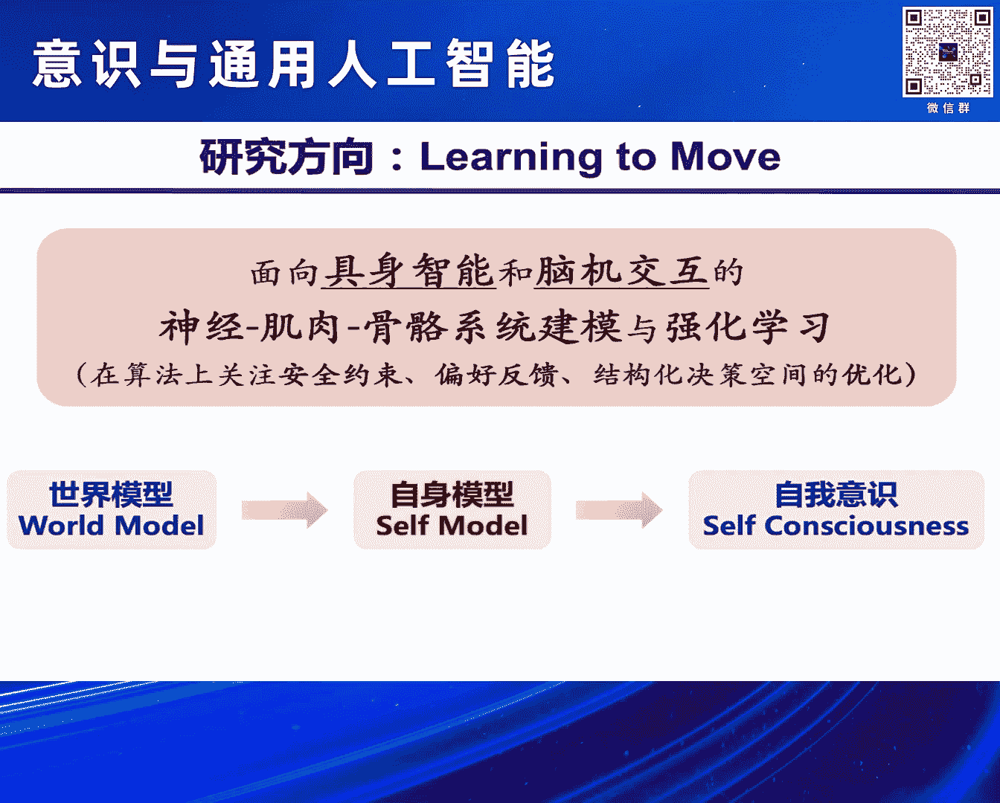

**如何运动。**

更具体地说，我的研究命题是：面向具身智能和脑机交互，主要针对人类的神经肌肉骨骼系统进行建模与强化学习。

在理论和方法上，我们更关注安全约束、偏好反馈以及结构化决策空间的优化。前两者在2018年至2022年间逐渐成为热门话题。而结构化决策空间，正是我今天要讲的核心内容。

这涉及到我们如何构建世界模型、自身模型，以及在此基础上理解什么是自我意识，并探索通过构建方法来形成自我意识。

今天时间有限，我们将主要围绕自身模型的构建展开。因为世界模型的构建在具身智能领域已是常见议题，如果大家明天去听相关报告，会发现几乎所有报告都在讨论世界模型。

而自身模型，可能是我们唯一专门探讨的话题。

在座的许多同学对心理学和认知科学感兴趣，可能对这个名字很熟悉：**William James**。他是美国早期极具代表性的心理学家，同时也是一位哲学家，属于早期的全才。

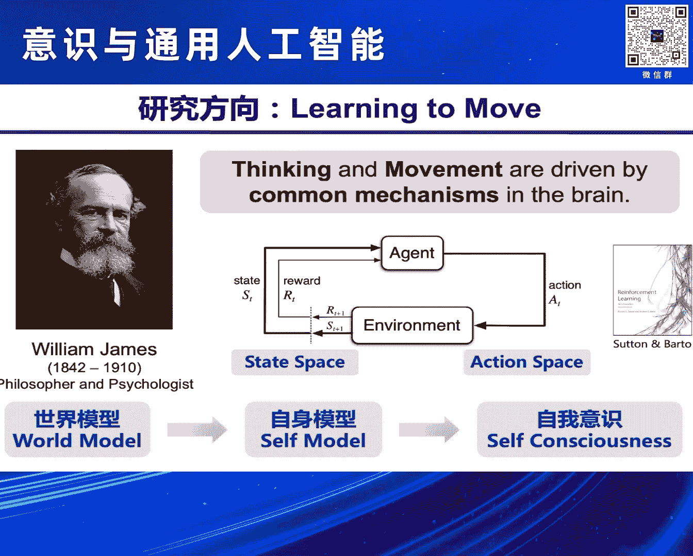

在1890年，即130多年前，他出版了一本极具影响力的教科书。书中提出（非原话，但未改变其本意）：
**“Thinking and movement are driven by common mechanisms in the brain.”**

当时心理学尚处早期，人工智能领域还未出现。对运动的研究本身有悠久传统，例如达芬奇及其之前对运动的定量研究。

当我们将“思考与运动由大脑的共同机制驱动”放在一起讨论时，就进入了我的研究领域：**强化学习**。

右边是经典的Sutton & Barto的强化学习教科书。中间说明了强化学习是什么：我们有一个智能体（agent）和一个环境。我们有状态空间（state space）和动作空间（action space）。它们共同构成了强化学习的主要单元。

在此基础上，我们来看如何一步步构建世界模型、自身模型和自我意识。

可能有些听众对这些关键词不熟悉。没关系，我们逐一解释。

**什么是世界模型？**

目前，关于世界模型主要有两大类描述。这个领域发展迅速，尚未形成毫无争议的统一结论。

第一类的核心观点是：**“The image of the world around us, which we carry in our head, is just a model.”** 从这个视角看，世界模型是我们如何构建一个关于世界的抽象表征。

第二类是从工程和技术角度出发，以构建的方式创建**仿真环境**。今天在现实世界中表现良好的机器人或具身智能场景，都得益于过去几十年仿真环境的快速提升。

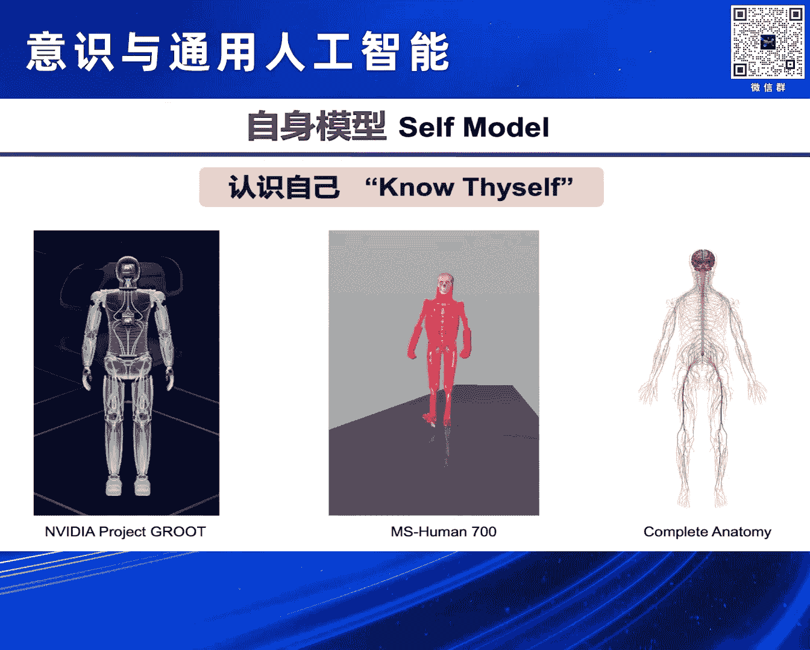

以上是对世界模型的两类主流理解方式。这里不追求特别精确的细节。

接下来是**自身模型**。

自身模型也有非常悠久的历史。“认识你自己”是雅典神庙的重要格言之一。

自身模型取决于我们对“自我”的定义。在具身智能领域，它可以指研究很多的机器人、机器狗、机械臂或自动驾驶汽车等场景。我们可以为其构建高精度的数字孪生模型。

这是一种构建自身模型的方式。如果未来环境中只有设备而没有人，我们或许能以近乎完美的方式为它们构建模型。但那可能不是我们希望看到的。

我们希望未来环境中仍然有人存在。对于人的存在，就需要我们有关于人的模型和构建。终极的环境可能是要与人类交互，而非完全与无人的系统交互。

因此，这里会涉及人的骨骼肌肉系统以及神经系统的呈现，共同构成我们非常复杂的自身模型。

有了世界模型和自身模型，我们便可以探讨意识。

同样，前面两位老师都提到，目前对意识还没有一个很好的定义。上面是一个描述性定义，翻阅了许多资料后，最终回到了维基百科。在维基百科上搜索“consciousness”，第一条就是这句话，但它是一个描述，并非精确定义。

我们来看：“Consciousness, at its simplest, is awareness of internal and external existence.” 这里的主要问题出在加粗的关键词 **awareness** 上。它用同义词来解释这个概念，这不是一个好的解释。

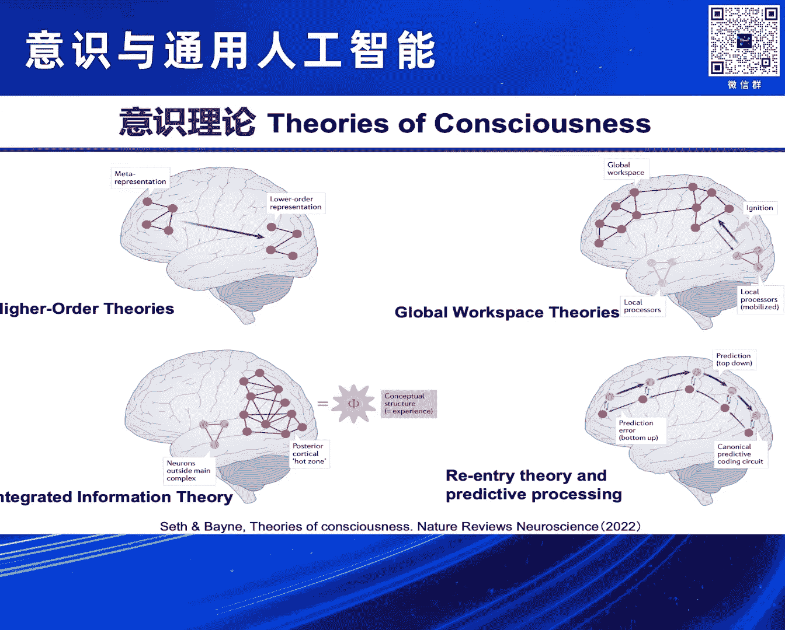

这相当于在数学中用本定理证明本定理，老师肯定会扣分。但在许多前沿领域，存在大量此类模糊概念。我们第一眼觉得很有道理，但细想不对，因为awareness本身就是consciousness的另一个描述。

今天我们不纠结其具体定义，因为我们无法给出明确定义。但我们看下面：“Is awareness of internal and external existence.” 这里的内部和外部存在，正好对应前面几张幻灯片中提到的自身模型和世界模型。

今天我们不讨论世界模型相关的内容，而是从自身模型出发，以其为基础来构建自我意识。我特意加了个括号注明“Self-awareness”。如果上网查询“什么是self-consciousness”，会发现大量用“self-awareness”来解释或替代的情况。

这本身并非最佳解决方案，但这就是我们在这个领域的现状。

下一页幻灯片会非常有趣，大家刚刚看过：**意识的主要理论**。但这里我不讲细节，而是讲其局限性。

这一系列工作的一个很大局限性是最后弹出的一项：**“The brain in a vat”**，即缸中之脑的研究方式。所有该领域的重要研究，包括前面罗老师讲的Dehaene的研究、Tononi的研究等，都是在用大脑研究大脑。

这与“缸中之脑”没有区别。我们将大脑放在一个好的培养基中，但重要的是输入和输出是什么。如果我们只看一个片段或截面，意识是不存在的。意识一定是一个有时间变量的过程。

一旦涉及时间变量，就要求其输入和输出同时存在且连续存在。回想一下我们前面讲的强化学习循环，正是在阐述这一点。这也引出了我们为什么要讨论意识的具身性。

关于一元论和二元论，本报告支持一元论，即意识具有具身性。并且，这种具身性或许能通过对世界模型和自身模型的深入研究来实现理解。

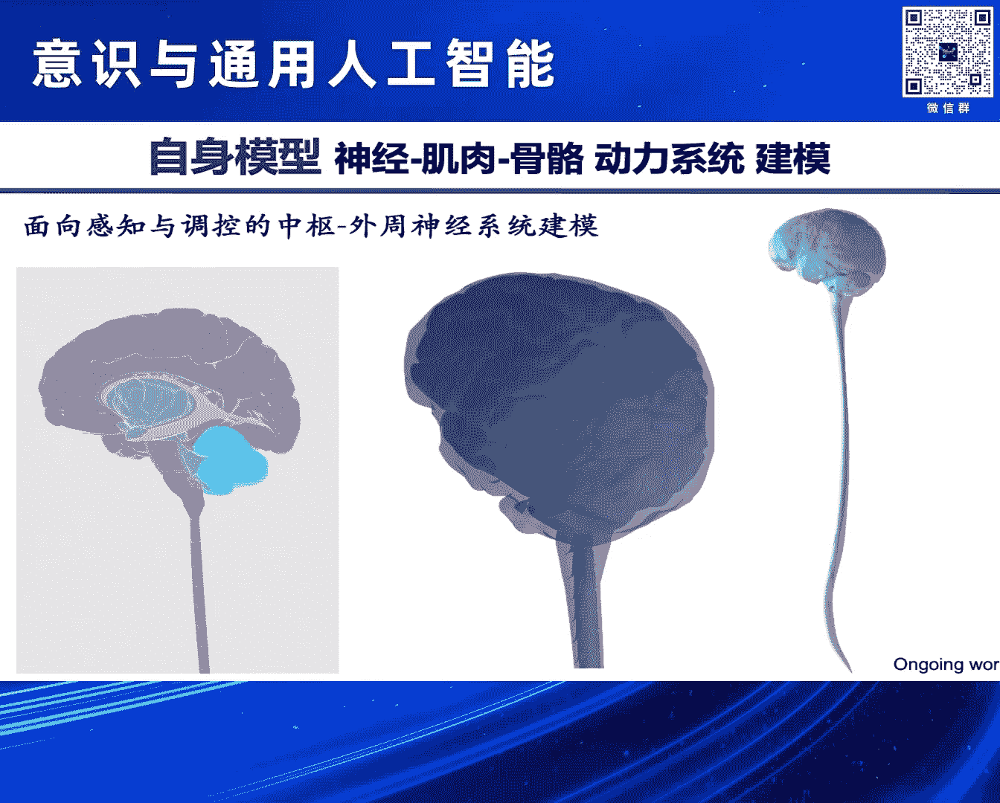

现在，我们重点看自身模型部分。我简要汇报一下我的研究小组在这方面的一些探索。

首先，自身模型对于我们人类来说，与环境交互的首要系统是神经肌肉骨骼动力系统。我们是否可以将这个系统建模作为自身模型的起点？

我们需要做面向感知和调控的中枢及外周神经系统建模。因为如果只有中枢大脑部分，可能无法充分体现意识的具身性。所以我们从中枢和外周两方面进行模型系统构建。

幸运的是，我们有很多同行在研究大脑建模，从图谱到功能连接等角度。我的研究小组规模有限，能做的事情有限。我们更希望同行们能快速推进中枢部分的研究。

因此，我们更多关注Y轴，这也是为什么我们的标题叫做“自下而上的方式”。我们希望先从简单的部分做起。

神经方面不是今天报告的主题。今天主要报告的是神经之下的肌肉骨骼系统。这是当今类人机器人、人形机器人以及我们自身的基础模型，也是具身智能和面向人机交互的基础模型。

我的研究小组致力于构建一个精确的全身肌肉骨骼模型系统，我们称之为 **Muscular Skeletal Human 700**。MS是肌肉骨骼模型的缩写，700代表下面会解释的含义。

这是一个完整的人体骨骼和肌肉肌腱单元的构建。所谓的“完整”，是指在有限的进化尺度上（往前看100年、1000年、1万年、10万年），我们的模型不会发生实质性变化。因此，从肌肉数量上讲，这个模型已经足够。

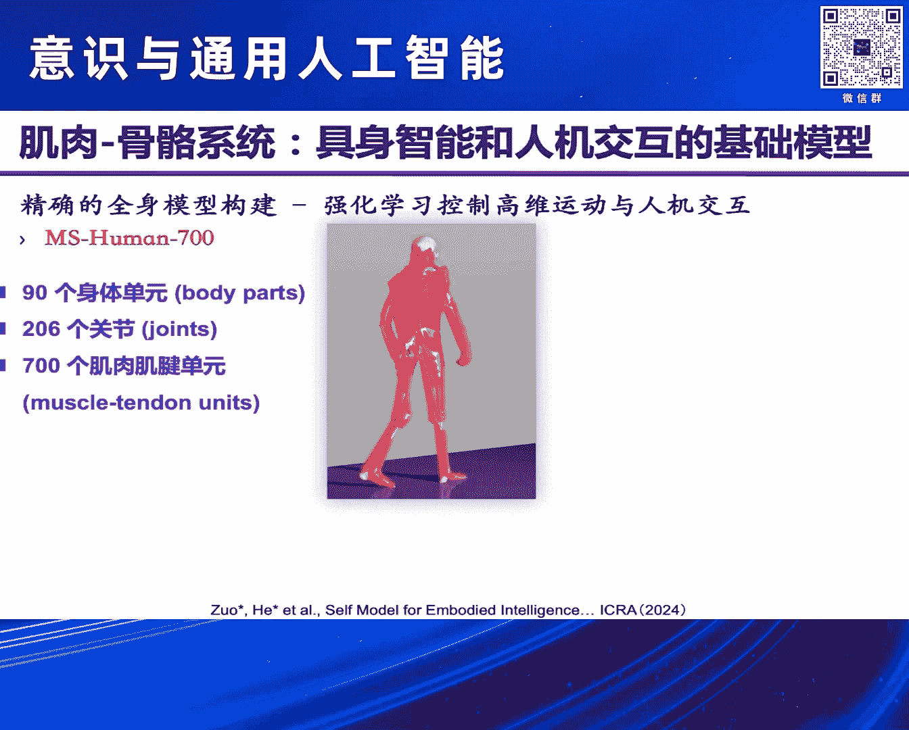

从我们这个物种的角度，我们希望达到高的解剖精度，并在此基础上实现与外界环境的交互以及高的计算效率。如果我们构建了这么多肌肉骨骼却无法有效控制，无法实现类人行为，那么在其基础上也无法研究任何与意识相关的内容。

这就是为什么我们称它为MS Human 700，因为它包含700个肌肉肌腱单元。人类有多少块肌肉？不是700块。我们有600多块肌肉。

在座的各位，肌肉的精确数量可能略有不同。肌肉介于骨骼和神经之间。健康成年人的骨骼数量基本固定，神经元数量千差万别，而肌肉大约是600多块。不同的人在进化链路上，肌肉数量可能略有差异，但不会差太多。

600多块肌肉，我们将其构建为700个肌肉肌腱单元。这是面部以下整个模型的构建。

它可以做什么？它可以与机器人交互，与外部设备交互，可以实现许多从世界模型到自身模型构建后的自身控制。我们可以在此基础上探索一些可能与意识相关的研究。

这里有一些关于模型构建的具体细节。如果我们想以自下而上的方式构建高级功能，我们希望先把底层的部分尽可能做得精确。

这是身体节段的数量，可以简单理解为骨骼中不可整体连接的单位数目。还有关节的数目，以及肌肉肌腱单元的总数。

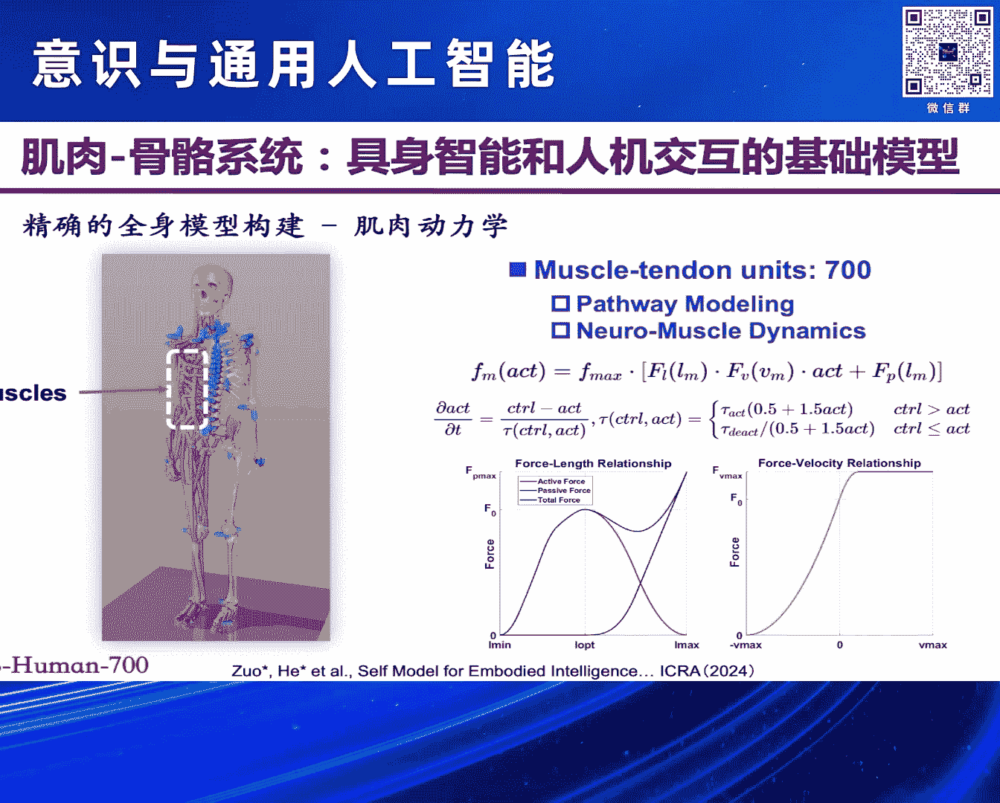

为什么我们有600多块肌肉，却要构建700个肌肉肌腱单元？大家看右边，这是一个典型例子：腰大肌。它是维持站立姿势非常重要的一块主要肌肉，但它有多个连接端。对于这类多连接端的肌肉，我们会将其拆分成若干个肌肉肌腱单元。

这就是为什么虽然我们的模型尚未包括面部肌肉和一些与骨骼运动关系不大的其他肌肉，但数量已经超过了。我们还可以继续进行更精细的拆分。

对于每块肌肉的控制本身，也是一个非线性的、通过神经激活的过程。我们希望以神经激活的方式得到肌肉激活，从肌肉激活得到肌肉力，从肌肉力得到驱动关节运动的力矩，再从关节力矩得到人体的运动方式。

这是一个自下而上的构建过程。这也要求我们在整个建模过程中，对人的解剖和整体系统构建有相应的工作。

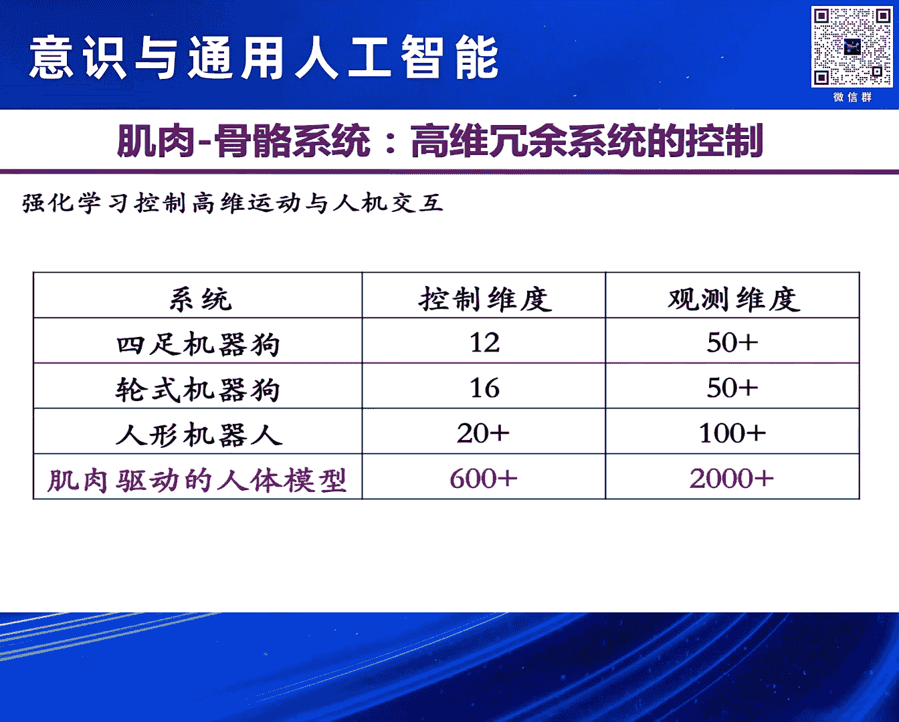

这样的模型比今天我们看到的典型具身智能系统模型要复杂得多。今天我们看到许多四足机器狗、轮式机器狗、人形机器人、机械臂等，其控制维度和观测维度（即前面讲的动作空间和状态空间）的数量级大约是几十个。

而我们这个肌肉驱动的人体模型，即使在简化层次上，其规模也大了近两个数量级。

因此，如何控制它也是一个非常困难的事情。这里我们不深入讨论如何控制的具体细节，而是简单说明自我意识如何在此体现。

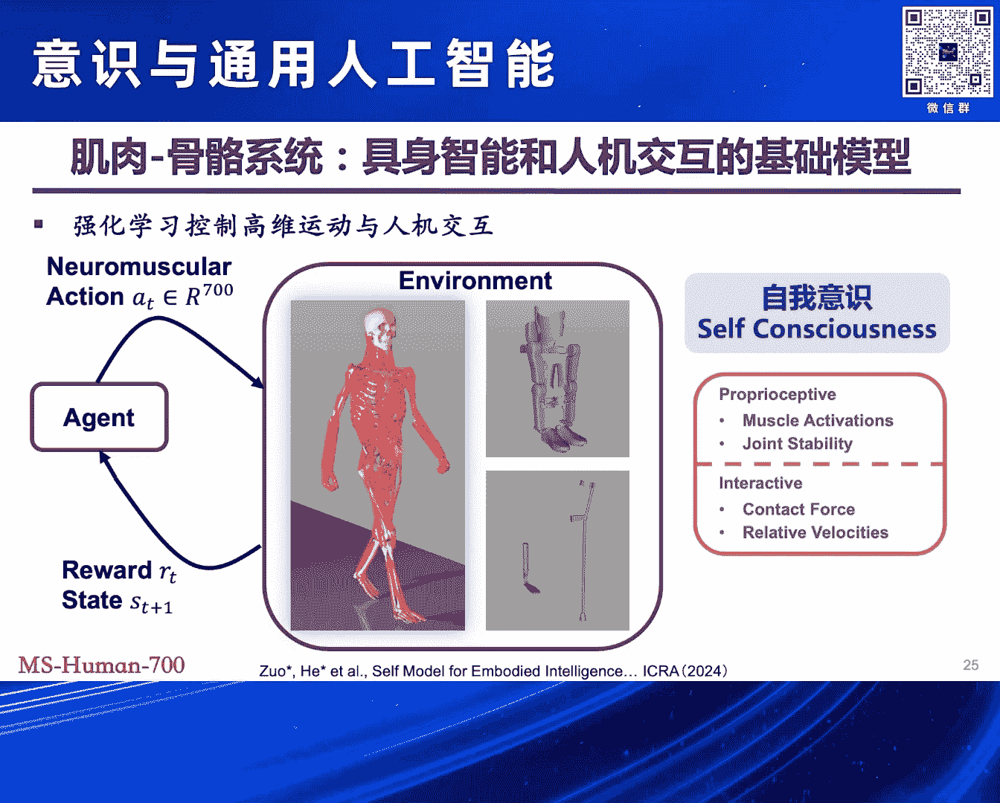

在我们的问题框架中，自我意识被认为是所有可以向上传递的信息。它是自下而上形成意识的唯一源头。

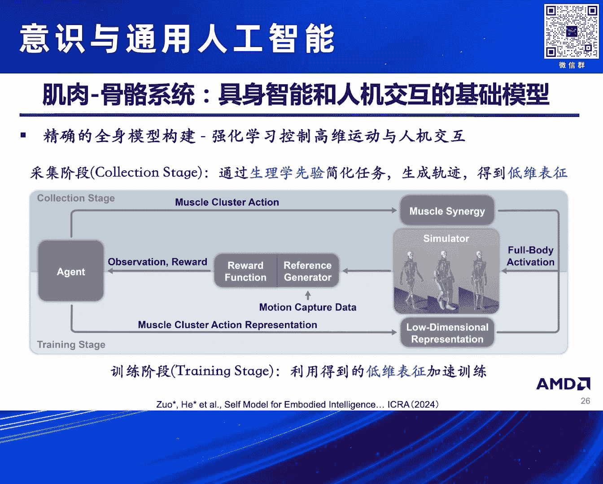

我们的本体感觉，是人类实时从全身肌肉获取的信息。至于这些信息在哪一级被整合、在哪一级被过滤、从哪一级开始能被我们的意识显著放大，我们今天还很不了解。但至少我们知道，这些是本体感觉意识的来源。

如果我有好的控制方法，能够驱动这个迄今为止可能最类人的动力学模型，那么我们或许就有希望了解运动相关意识的来源是什么。

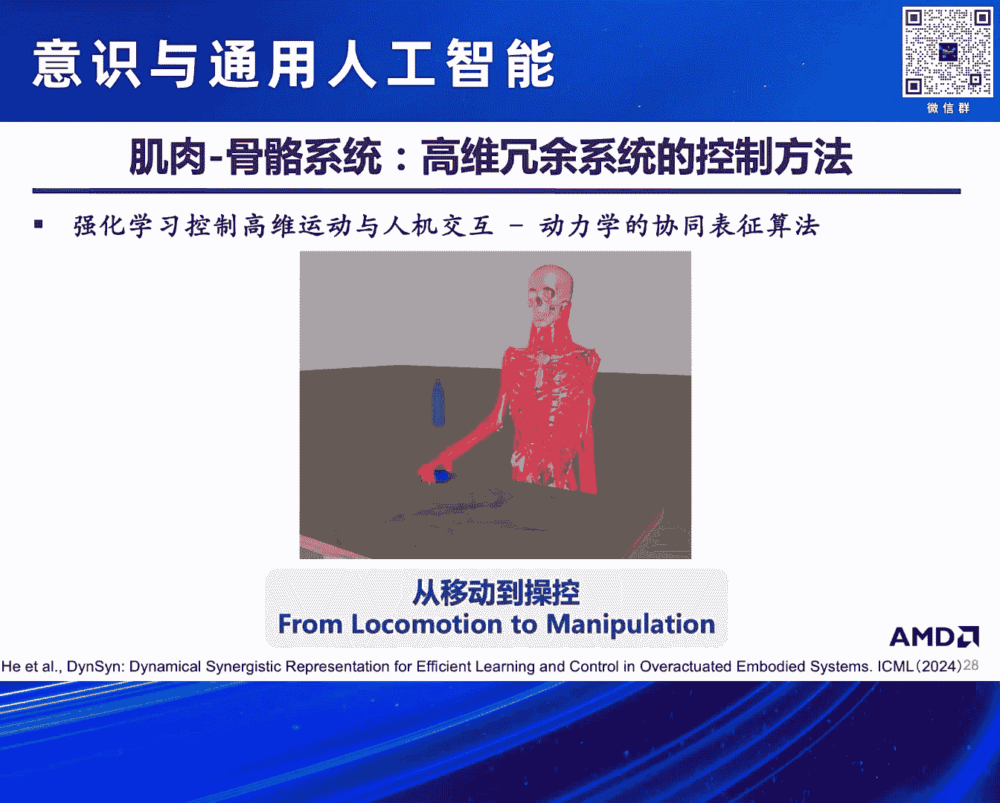

因为当我们看到这些模型时，我们知道人类会做这些动作，但在完成一个动作的整个时间序列里，你身上的每一块肌肉是如何收缩的，没有人知道。我们也没有实验可以测量这个过程。

我们能做的是用模型逐渐逼近这个过程。模型可以告诉我们一些可能永远无法在真人身上实测的信息输入，并基于此探索哪些是形成高级意识的基础信息源。

同时，我们还需要在真人身上进行相应实验，以确保模型与真人运动过程本身是相符的，没有显著偏差。

这就是我们从世界模型到自身模型，最终实现自身控制的过程。大家可以看到，我们可以控制模型来模仿一个特定人的步态。

左上角是我们的模型，四个图都是我们的模型，但只有左上角是我们的方法。我们最初希望模型构建出来后，现有方法就能有效驱动它，但后来发现显然不是这样。

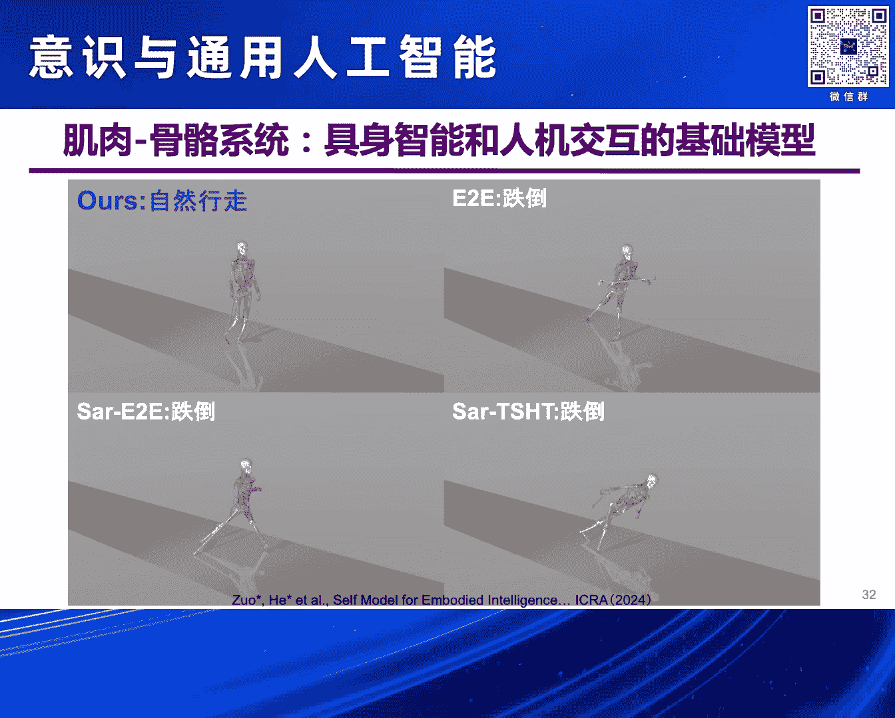

无论是自然行走，还是让人穿上外骨骼，将来大家可能会想，在自己进行各种与环境交互的测试之前，我们可以先做这样的模拟尝试。

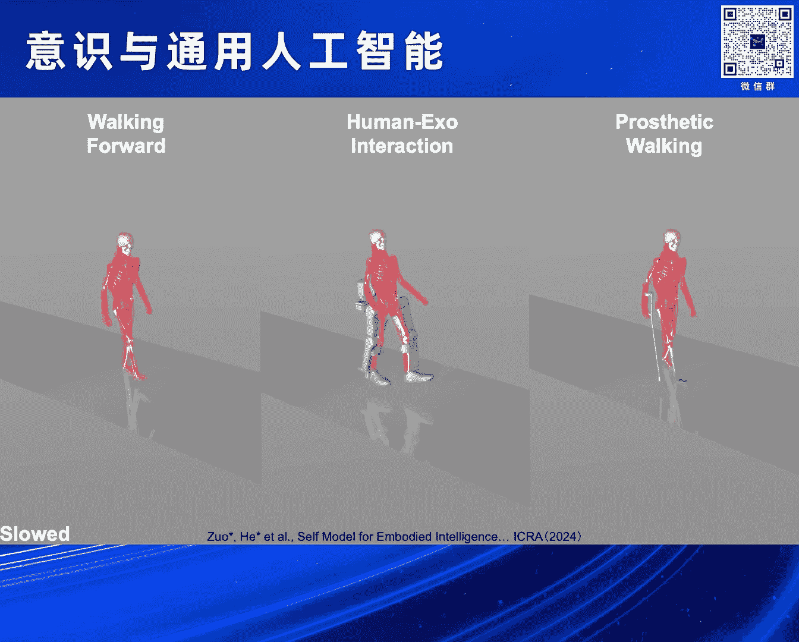

对于一些残障人士，例如需要安装假肢的人，我们可以模拟假肢安装后，他使用起来是否舒适、能否行走、在整个过程中的信息（本体感觉的所有信息）如何向上传递。基于这些，我们或许能了解如何形成相应的运动相关意识。

这些都要求我们能够有效地控制系统。

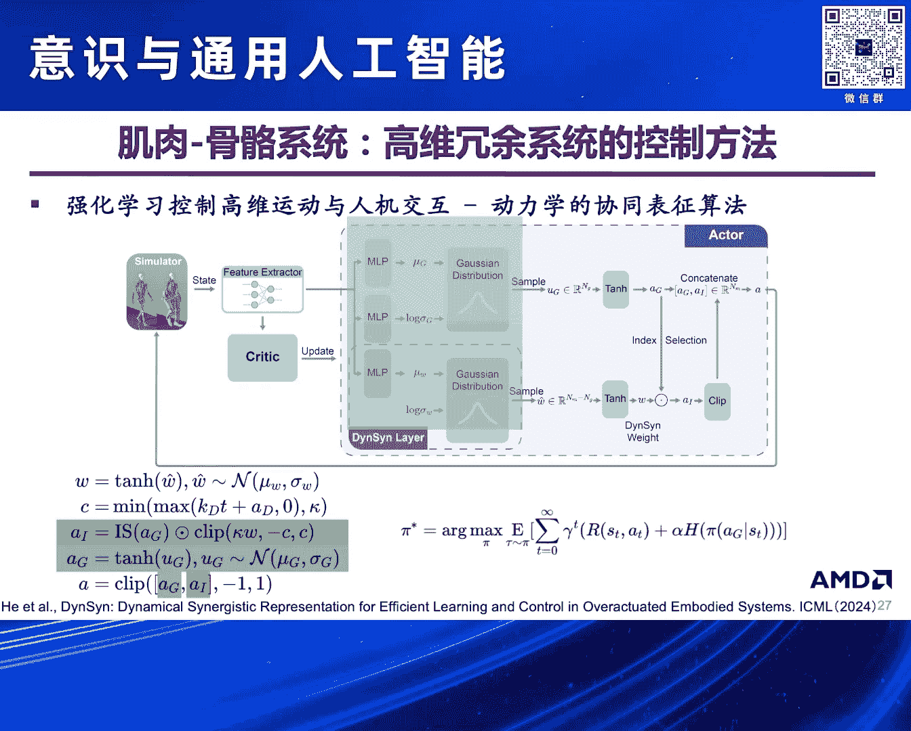

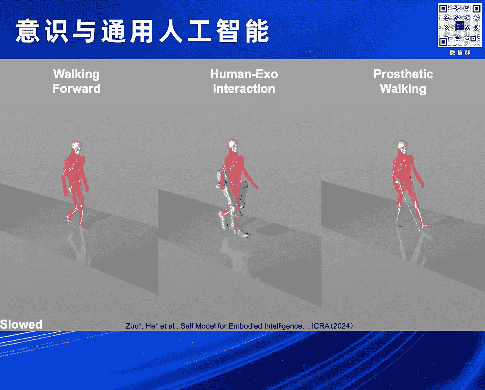

前面涉及算法类的工作，我们略过。这里涉及大量机器学习和优化以及高性能计算。因此，在右下角我们致谢了AMD为我们提供高性能计算平台。

最终，我们自下而上构建的自我意识，正如开篇所示，整个蓝色背景闪烁，让人看不清标题。这实际上是一个人在实现左边步态（10秒过程）时，其本体感觉向上传递的近3000维信息。当然，我们进行了简化，因为每块肌肉我们做了有限维度的处理。

下面红色的矩阵随时间变化，是我们给所有肌肉的控制信号。必须有这样的控制信号，它才能动起来，否则可能会立刻摔倒。请注意，这是基于动力学的真实控制方式，不是计算机图形学的动画效果，而是真实可驱动的物理过程。

在这个层面上，我们可以进一步将其与人类向上的神经系统结合，观察如何对意识自下而上、一步一步的形成进行量化描述。

因此，左边我们点明了今天的主题：这是我们的自身模型，也是通往AGI之路上的重要一步。今天我们觉得AGI只是时间问题，而非有无问题。

我们整个背景是：**如何潜入自我意识的海洋**。

最后，我做简单总结。今天的报告主要聚焦于具身智能中自身模型的构建，希望通过这种自下而上的方式，构建一个意识的量化描述。

我们从世界模型到自身模型，最终到自我意识可能的呈现方式。在这个过程中，我们希望在可预见的将来，与大家一起迎接人类智能聚变的时代。这里的“聚变”是fusion，意指融合，而非仅仅是剧变或快速变化。

**人类智能的融合**，是我们在今天强烈感受到正在发生并将持续快速发生的事情。

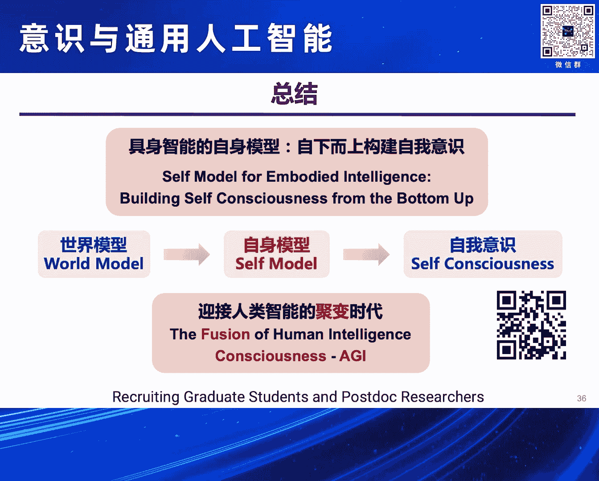

我的报告到此结束。