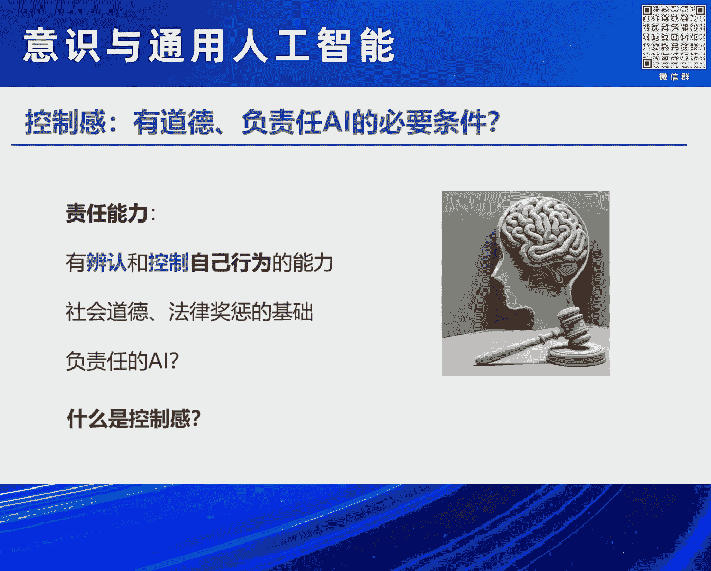
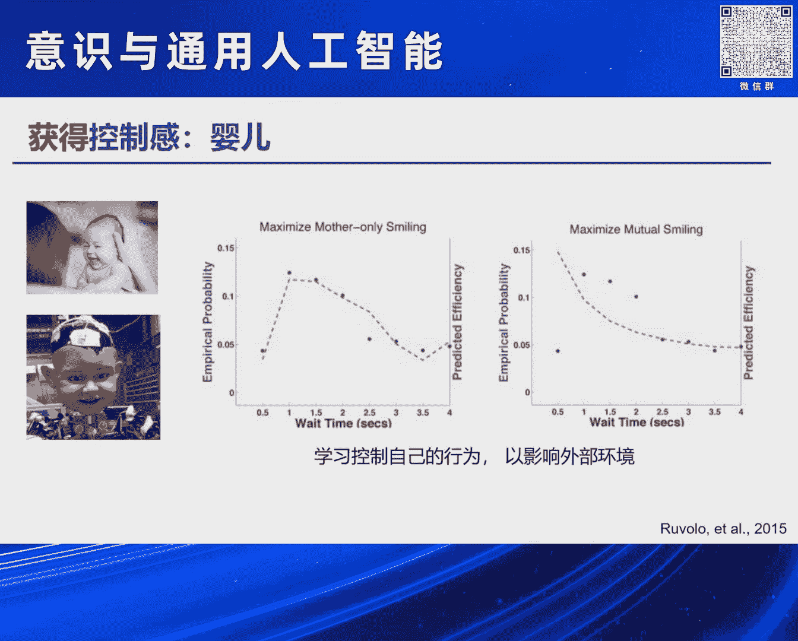
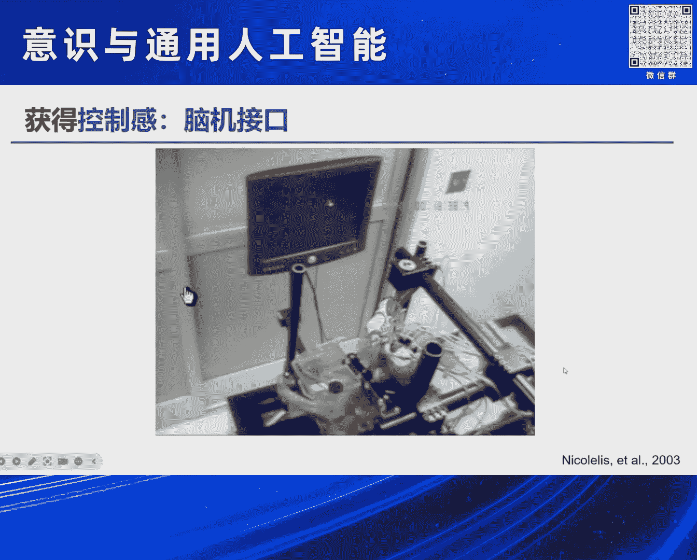
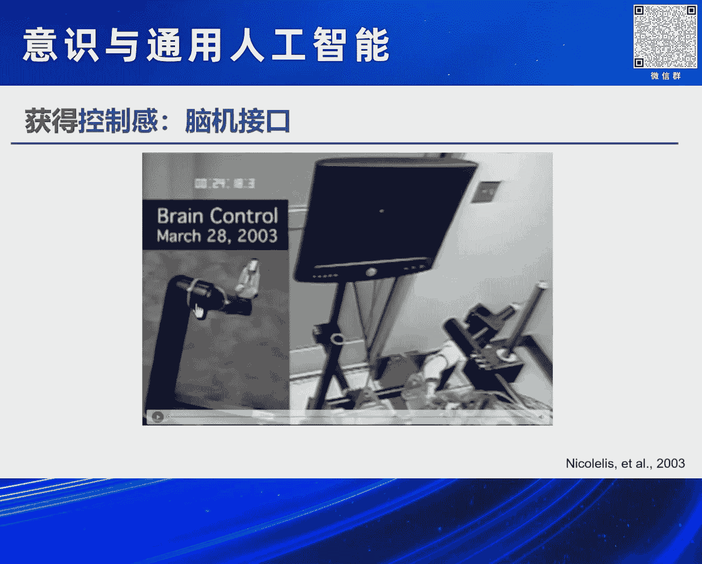
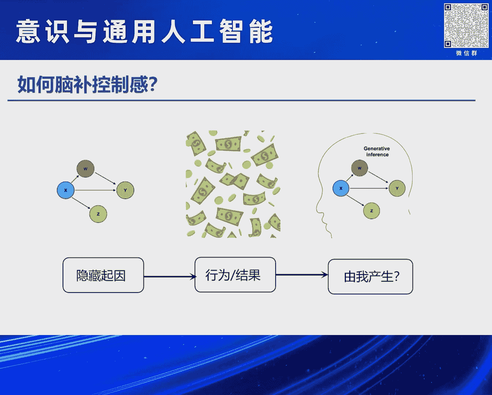
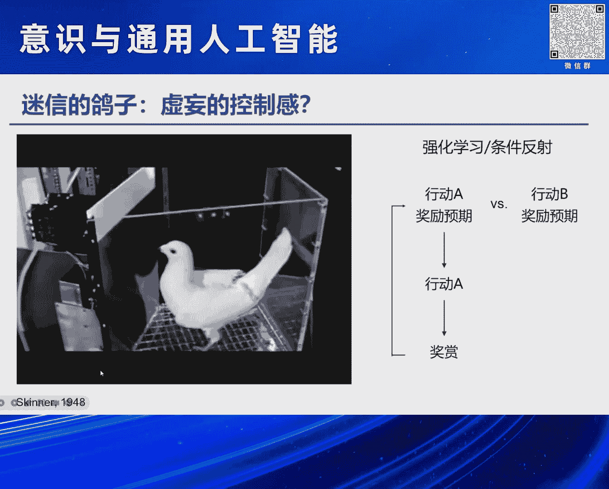
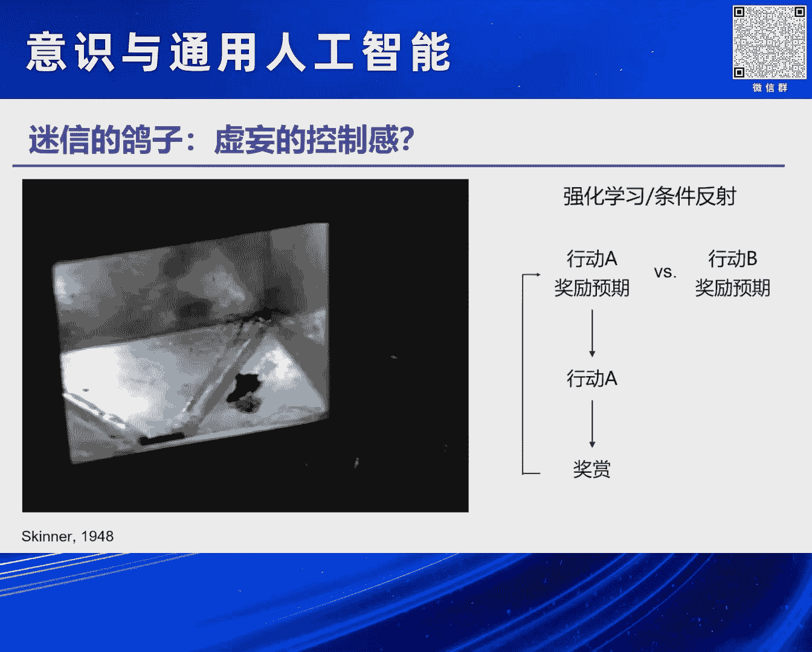
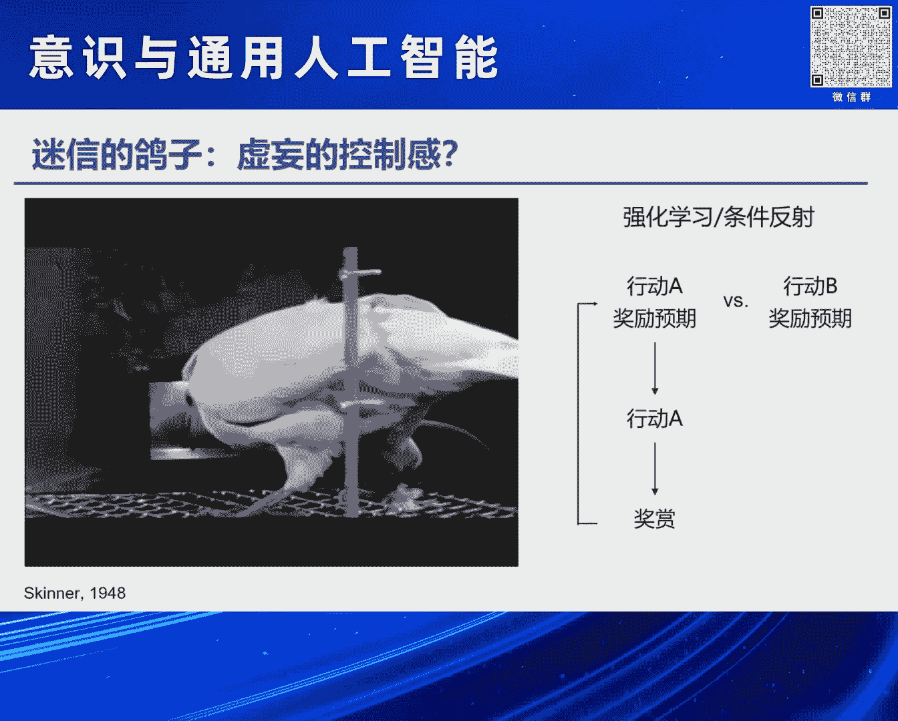
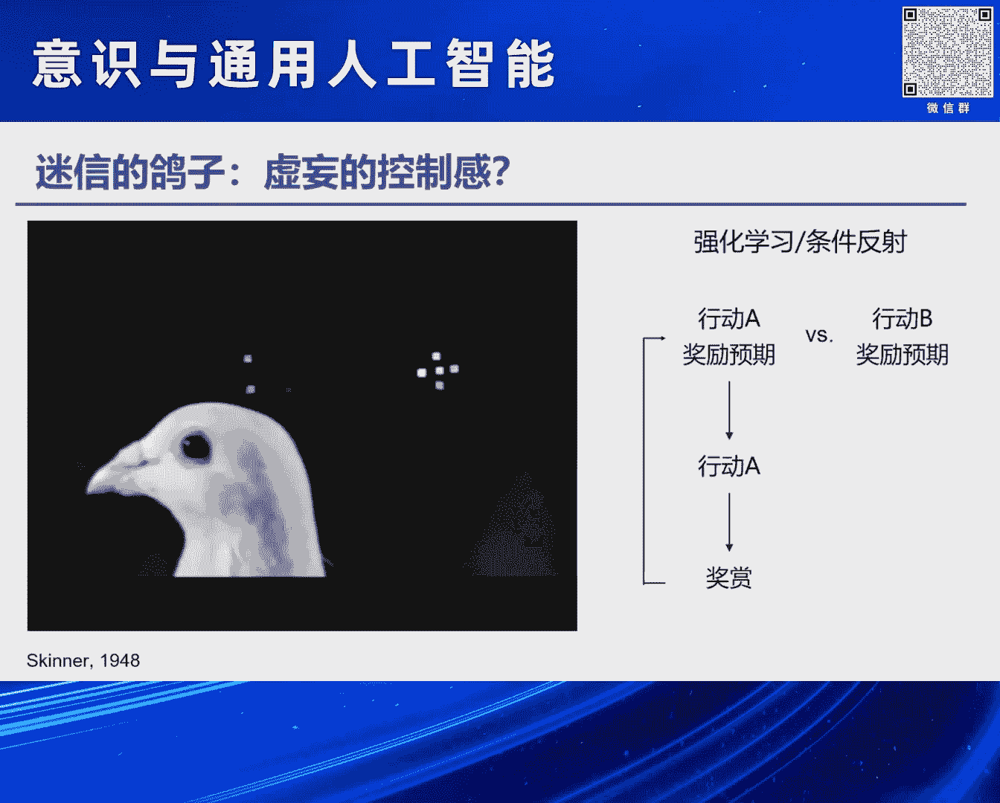
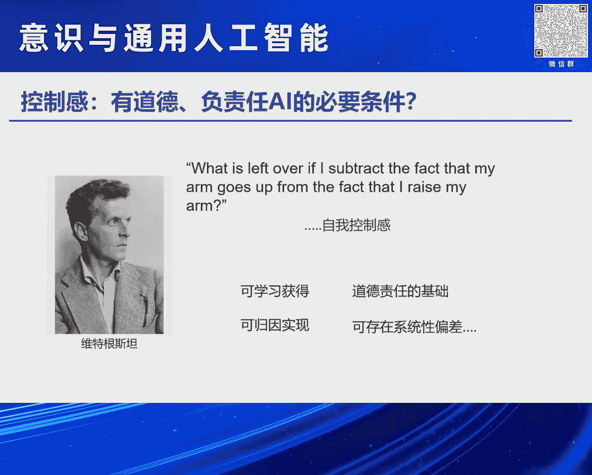

# 2024北京智源大会-意识与通用人工智能---P4-可计算的自控感-主讲嘉宾-朱露莎-提问嘉宾-吴思---智源社区---BV11b421H7JY
## 课程编号：P4  

在本节课中，我们将学习“自控感”这一核心概念。自控感是我们对自己行为与外部结果之间因果关系的主观感受，它是意识、自由意志乃至社会道德与法律责任的重要基础。我们将探讨自控感是什么、如何测量、如何在计算上实现，以及它为何对构建负责任的人工智能至关重要。

---

## 什么是自控感？  

控制感是我们拥有主观意愿，采取行动，并导致外部结果时的一种感受。例如，你每天回家按开关开灯，这一过程流畅自然。但如果开关不在原位，或灯在你触碰前突然亮起，你会感到“一惊”。这种瞬间的警觉信号便是控制感的丧失。

简单来说，控制感是一种“我来、我见、我征服”的主观体验。我们知道自己在做什么，并知晓行为的后果。这种对自身行为与外部世界的掌控，是自由意志与意识的重要基石。

---

## 自控感的生理基础  

上一节我们介绍了自控感的概念，本节中我们来看看它的生理基础。自主运动与非自主运动在神经系统层面存在根本区别。

以下是一个课堂演示：

1.  当你想抬起自己的手时，大脑运动皮层会发出指令，通过脊髓传递到手臂。
2.  手臂上的电极可以截取到这个电信号，经放大器放大后操纵一个机械臂同步运动。
3.  但如果由他人抬起你的手（非自主运动），你的运动皮层不会发出指令，电极无法截取信号，机械臂也不会运动。

这个例子表明，我们能够不依赖外部反馈（如观察机械臂），仅凭内在感受就能判断一个运动是否由自己自主产生。这种判断能力不仅限于运动，也延伸到言语、思维乃至对本能和情绪的抑制。

---



## 为何自控感对AI至关重要？  

理解了自控感的生理表现后，我们探讨其社会意义。我们认为，构建具备自主控制能力的人工智能，可能是创建有社会道德、负责任的AI的必要条件。

在法律上，“刑事责任能力”指自然人需具备辨认和控制自己行为的能力，否则不承担法律责任。这正是儿童、部分精神疾病患者或因脑瘤丧失控制力的人免于刑责的原因。同样，教唆犯比被教唆者责任更大；无意之举（如打喷嚏引发事故）比蓄意行为的道德谴责更小。

这一切都基于“我意识到并能控制自己行为”的感受。它是所有社会责任、道德与法律的基础。没有自控感，奖励与惩罚便失去意义。

因此，若想构建有社会责任的AI，仅靠对齐奖励系统（让AI学习人类好恶）可能不够。我们可能需要让系统能够将自己的行为与后果建立连接，从而发展出类似人类的道德感。

---

## 自控感可以测量与计算吗？  

既然自控感如此重要，一个关键问题是：它能否被客观测量并在计算上实现？答案是肯定的。

心理学家通过经典实验发现，自控感可能是一种“脑补”。在实验中，两名被试面对面用鼠标控制屏幕光标。实际上，光标有时由对面的“假被试”控制。当真被试做出的动作与假被试一致时，他常会“脑补”认为是自己控制了光标。

更极端的实验中，被试通过屏幕观看“自己”的手势，但屏幕实际播放的是他人做同样手势的录像。当手势复杂时，被试有很大概率认为看到的是自己的手。若大脑左侧顶叶受损，这种错误会更明显。

这些例子揭示的是一种“回顾性控制感”：大脑在看到行为结果时，会实时推断“这个结果是否由我造成？”我们选择研究这种回顾性感受，原因有二：
1.  它可以通过学习获得，从而建构更强大的控制能力。
2.  它可以在计算上实现。



---

## 自控感如何通过学习获得？  

上一节提到自控感可学习获得，本节我们通过具体例子来看这一过程。

**婴儿的策略性微笑**  
婴儿约在4个月大时发展出“策略性微笑”。研究发现，母亲微笑的策略是最大化母子共同微笑的时间；而婴儿的策略是最大化母亲对自己微笑的时间。婴儿会在母亲可能停止微笑时（如图中零点后约1-2秒）再次微笑，以延续母亲的微笑。这展示了通过控制自身肌肉运动（微笑）来操控外部世界（母亲行为）的能力。

**学习操控外部工具**  
我们还能学习操控非身体部分，如工具或脑机接口。



一个里程碑实验中，猴子通过操纵杆移动屏幕光标来获取果汁。科学家同时记录其运动皮层神经元活动，并训练机器学习算法解码其运动意图。随后，猴子被允许仅通过“意念”（即解码后的神经信号控制机械臂）来移动光标获取奖励。猴子最终学会了这种控制方式。

这说明智能体（包括猴子）可以通过学习，获得对假肢、工具等外部对象的控制感，实现更强大的智能。后来，这只猴子甚至能用意念实时操控大洋彼岸的一个巨型机器人。



---

## 自控感的计算原理：归因理论  

既然自控感可学习，我们是如何获得的？神经科学的一个经典假说认为，大脑是一个持续进行推理、预测和归因的机器。

以视觉为例：光线在视网膜成像，大脑通过一个“生成模型”来推断最可能的物体。例如，大脑比较“如果是苹果，视网膜感受如何”与“如果是橘子，感受如何”，从而判断所见之物。

类似地，“脑补”出的控制感也可能是一种归因计算。我们看到行为结果（果），大脑通过生成模型推断最可能的原因（因），并判断该原因是否是自己。例如，获得巨大成功后，大脑会评估“因运气好而成功”与“因努力而成功”的概率，从而反推成功是否源于自身。



用公式表示这一归因过程的核心：
```
P(原因=自我 | 观察到的结果) ∝ P(观察到的结果 | 原因=自我) * P(原因=自我)
```
即，判断结果是否由自我导致的概率，正比于“自我导致该结果的可能性”乘以“自我作为原因的先验概率”。





---



## 归因计算的系统性偏差  

然而，这种归因计算会产生系统性错误。斯金纳的鸽子实验是一个著名例子。

1.  鸽子学会啄键以获得食物（正常的条件反射）。
2.  随后，食物改为随机掉落，与鸽子行为无关。
3.  但鸽子并未学会“等待”，反而持续啄键，并“迷信”地认为是自己的行为导致了食物出现。



从强化学习角度看，这很奇怪：如果行为（啄键）不再带来更高奖励，智能体应调整策略，停止该行为。但鸽子却形成了“虚妄的控制感”。

一种解释是，归因算法可能存在基于“事件稀疏性”的偏差。鸽子可能并非在每次行为后归因，而是在每次获得奖励（稀疏事件）后，回溯之前的行为并建立连接。它推断：“因为我啄键，所以得到奖励的概率高”，从而持续该行为。

这种基于结果（而非行为）的归因模式，在老鼠实验和神经层面（如多巴胺神经元活动）得到了证据支持。

---

## 自我归因与一般归因的区别  

你可能会问：将控制感视为归因是否准确？毕竟它特指“关于自我的归因”。研究表明，自我归因与一般归因存在系统性差异。

在多臂老虎机任务中，人们通过试错寻找奖励概率最高的机器。研究发现：
*   **当获得奖励时**，人们倾向于归因于自我（“我选对了机器”）。
*   **当未获得奖励时**，人们倾向于归因于外界（“运气不好，小概率事件”）。

即：**成功归内因，失败归外因**。这可以解释一些社会现象，如某些成功者将自己的成就主要归功于努力，而旁观者则可能认为他们只是“在上升的电梯里做俯卧撑”。

相反，抑郁症患者的归因模式常与此相反：将失败归内因，成功归外因。精神分裂症患者则表现出更系统性的归因偏差。这说明，关于自我与一般性的归因，由神经系统进行着系统性的不同计算。

---

## 总结与展望  

在本节课中，我们一起学习了“自控感”这一构建意识与负责任AI的核心概念。

维特根斯坦曾提出一个问题：“我的胳膊被抬起”与“我举起胳膊”有何区别？我们猜测，其区别可能就在于“自我控制感”。

我们了解到：
1.  **自控感可通过学习获得**，使智能体能控制外部世界乃至虚拟社会，变得更强大。
2.  **自控感可通过归因算法实现**，在生物和人工智能中均可计算。
3.  **自控感是道德与责任的基础**，对构建有社会性的AI至关重要。
4.  **生物智能的自控感存在系统性偏差**，如基于稀疏性的归因、自我与非自我归因的不对称性。



这引出了新的问题：如果未来我们希望AI拥有自控感，我们应让它具有与人类相同的偏差，还是不同的偏差？抑或它会产生自身独有的新偏差？这些问题值得我们在通往通用人工智能的道路上持续探索。