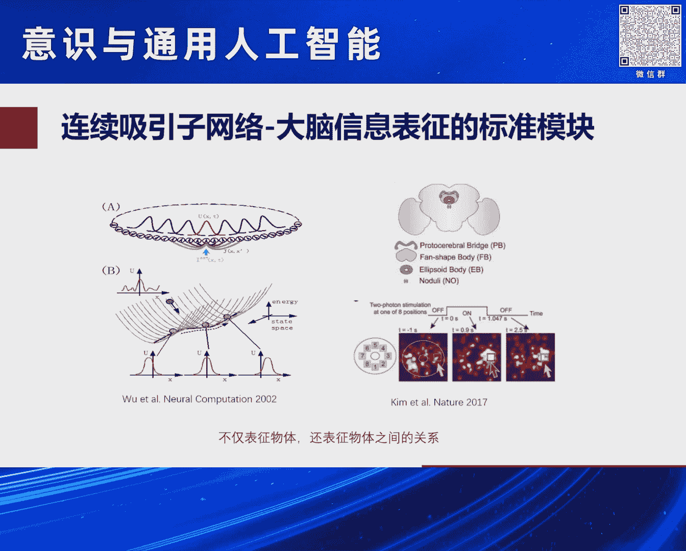
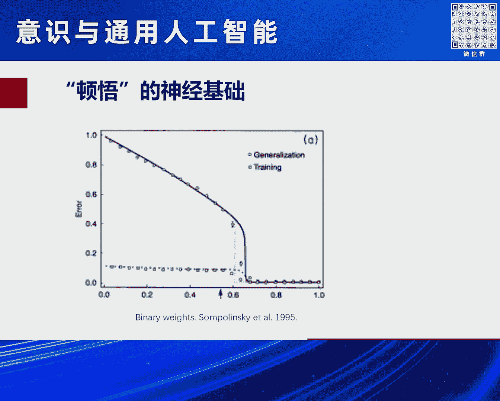
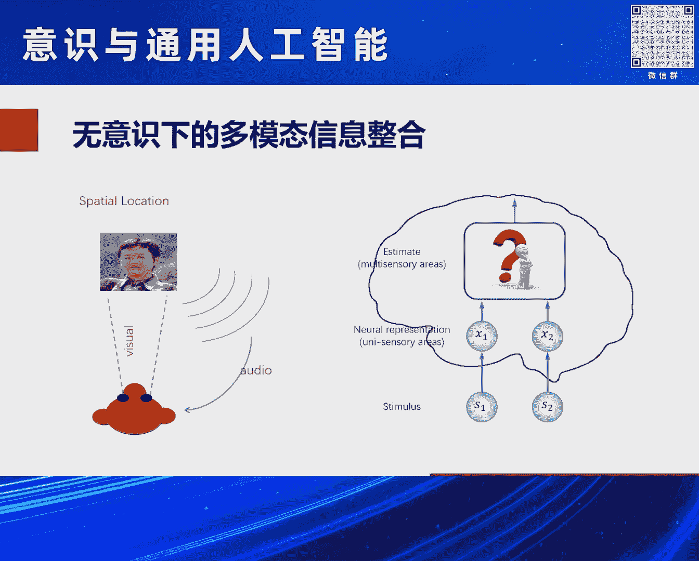
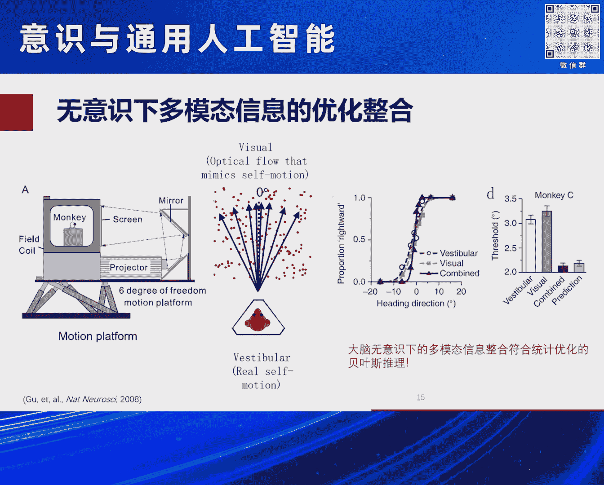
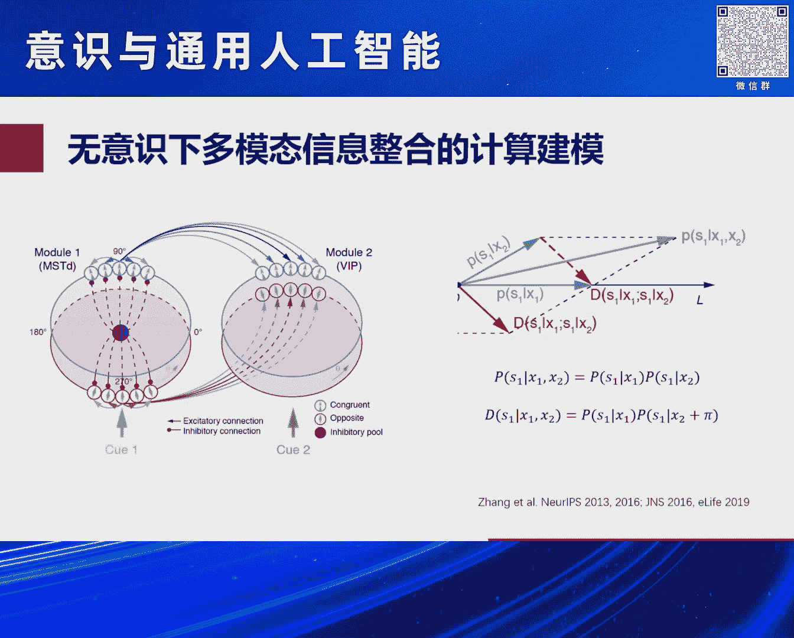
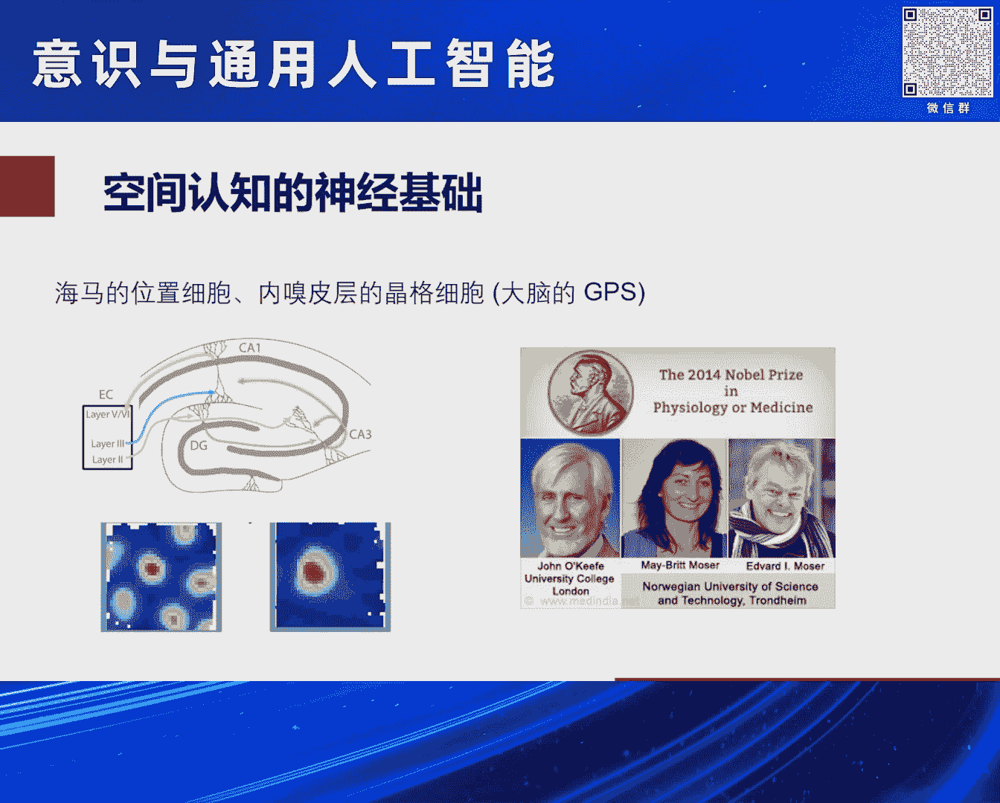
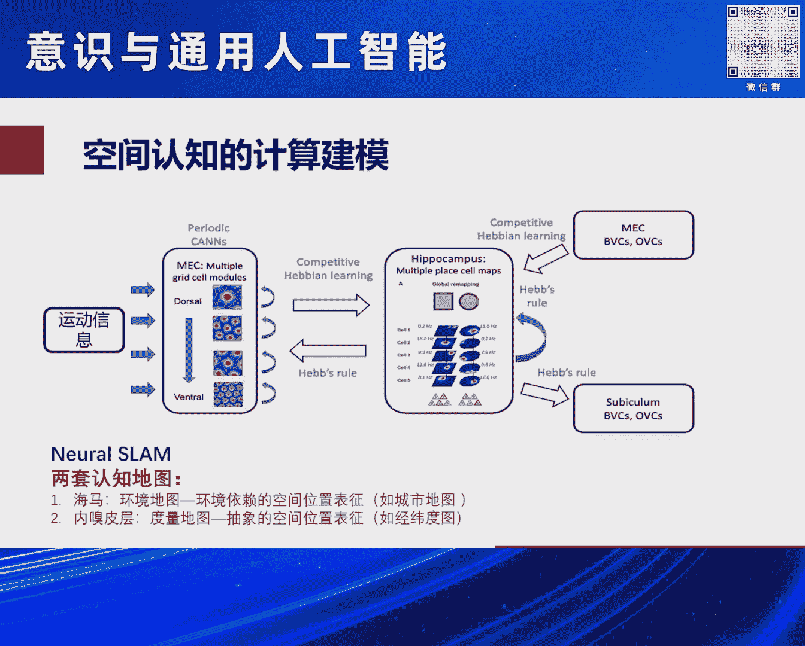
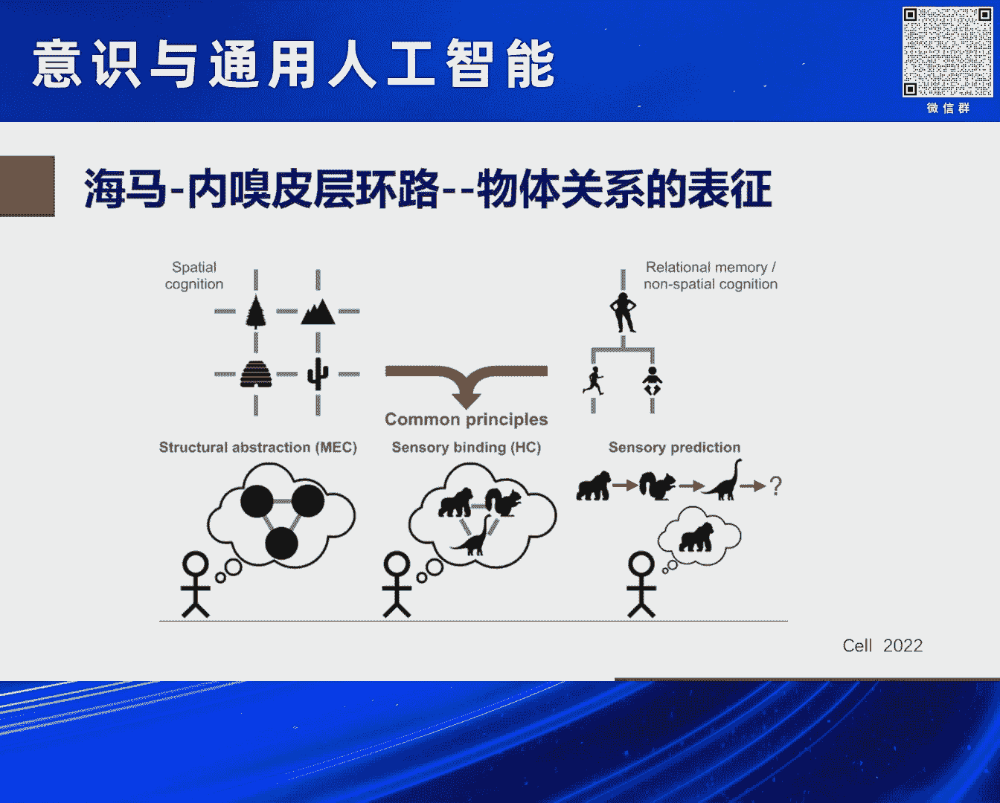
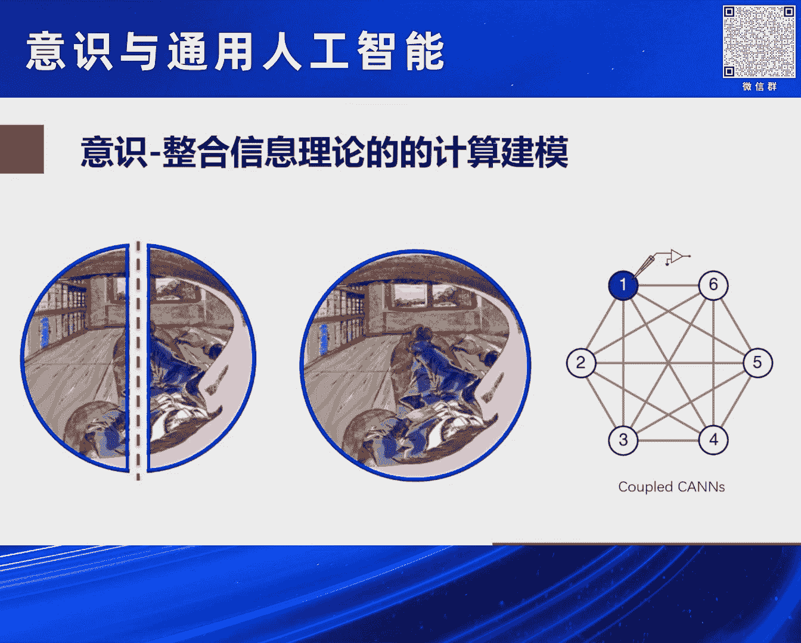
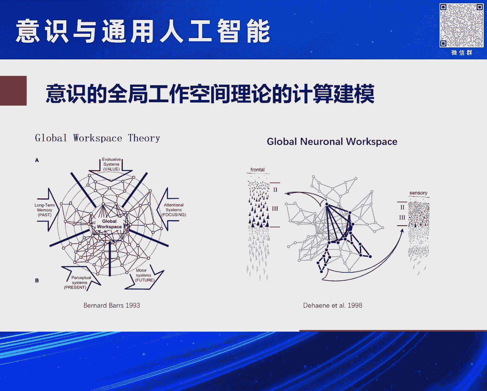

# 2024北京智源大会-意识与通用人工智能---P5-意识是可计算的吗---吴-思----智源社区---BV11b421H7JY

## 概述

在本节课中，我们将探讨一个核心问题：意识是否可以被计算？我们将从不同学科的观点出发，分析意识的本质，并探讨通过计算建模来理解和模拟意识的可能性。课程将结合哲学、计算机科学、神经科学以及具体的计算模型案例，旨在为初学者提供一个清晰、全面的理解框架。

---

## 一、问题的提出与初步探索

报告者最初提出了一个宏大的问题：“意识是可计算的吗？”。为了寻求答案，他首先咨询了大型语言模型GPT。GPT的回答虽然全面，但并未给出明确结论，只是指出了问题的复杂性。

GPT的回答主要分为三类观点：
*   **哲学观点**：意识是一种主观体验（现象性）。有人认为其具有独特性质，无法简化为物理或计算过程；也有人认为可以通过某种形式进行计算。
*   **计算机科学与人工智能观点**：研究者试图通过模拟大脑的计算过程来创建具有某种意识的人工系统（例如图灵测试），但目前仍面临技术和理论障碍。
*   **神经科学观点**：意识是大脑活动的产物。通过研究大脑的结构与功能，可以理解其机制。随着科技发展，我们可能更好地理解并模拟意识。

然而，GPT的总结是：目前尚无被广泛接受的方法能完全解释或计算意识，其本质可能超出了当前科学与技术的范畴。这个回答并未解决问题，因此需要我们自己深入思考。

---

## 二、核心概念的澄清：什么是“可计算”？

在探讨意识是否可计算之前，必须澄清“意识”和“可计算”这两个概念的含义。

长久以来，**主观体验（意识）** 与 **科学方法** 存在脱节。科学追求可量化、可实证、可预测的客观规律；而主观体验是个人真切的、有时难以言说的感受。报告者认为，既然主观体验是真实存在的，我们就应该像对待其他科学问题一样，尝试对其进行更清晰、更量化的描述。

那么，这里的“可计算”具体指什么？早期的认知科学有“认知即计算”的观点，将认知过程类比为计算机的符号加工系统，认为大脑是遵循理性法则处理感官输入的信息处理器。但这种“软件（认知）与硬件（身体）分离”的观点可能是不准确的。

报告者提出的“可计算”，指的是 **神经计算建模**。具体而言，就是用计算建模的方法来模拟或解析主观经验背后的神经机制。这是一种 **涌现的计算**。

**涌现** 是指一个复杂系统通过自组织产生出与组成元素截然不同的复杂行为和功能。其特点是无法根据局部性质预测整体行为。生活中的鸟群、蚁群以及当前的大语言模型，都展现出涌现现象。

大脑的计算正是典型的涌现计算。大脑由约 `10^11` 个神经元和 `10^15` 个连接组成，单个神经元功能简单，但构成的复杂网络能产生无法从局部预测的整体功能。这就是 **心智网络** 的观点：网络状态在外部输入和内部先验知识（储存在神经元连接中）的共同驱动下演化，最终达到一个稳态（心智状态），涌现出特定功能。

这种基于网络状态演化的涌现计算，与现代计算机的串行计算有本质不同。报告者团队长期关注的 **连续吸引子网络** 就是大脑信息表征的一种标准模块，它能将先验知识储存在网络连接中，从而表征物体及其之间的复杂关系。

**总结来说**，报告者认为，意识或主观体验可能是大脑神经网络通过涌现的动力学方式产生的。

---

## 三、涌现计算与主观体验的例证

为了说明大脑的涌现计算如何可能产生主观体验，报告者引用了一个经典的计算神经科学工作。

研究者训练一个神经网络完成分类任务。他们发现，随着训练数据量的增加，网络分类误差的下降并非平滑的。在某个临界点，误差会突然急剧下降，精度大幅提升。研究者将这种现象与禅宗的“顿悟”体验类比。

这个模型的关键在于，神经元的连接模式是类似“0/1”的二值模式。这提示我们，像“顿悟”这样的主观体验，其神经基础可能就源于大脑中复杂的、类似二值模式的突触连接网络在完成学习任务时表现出的涌现特性。

这个例子表明，大脑特定的结构和计算方式，可能赋予了我们神奇的主观体验。

---

## 四、无意识下的高效计算

在探讨意识之前，我们先看看大脑在 **无意识** 状态下能完成哪些高效计算。一个典型的例子是 **多模态信息整合**。

我们通过眼、耳、口、鼻等多种感官感知世界，大脑会无意识地将这些信息整合起来，从而获得比单一感官更优的感知结果。例如，在听报告时，我们不仅听声音，还会看演讲者的口型（唇读），这种视听整合能显著提高语音识别的清晰度。

神经科学家通过实验（如研究猴子如何整合视觉和前庭觉信息来判断运动方向）证明，在无意识状态下，大脑进行的是一种 **统计上最优的贝叶斯推理**。相比之下，在有意识时，我们反而容易犯各种非理性的错误。

报告者团队用计算建模（两个相互连接的连续吸引子网络）成功地复现并解释了这一机制。模型不仅完美地执行了贝叶斯推理式的信息整合，还能进行信息分离。这说明，无意识下的计算可能更为高效和优化，这是生物长期进化的结果。

---

## 五、从空间认知到具身认知

**空间认知** 是我们获取、组织、利用和更新空间信息的基础能力。哲学家康德认为，空间和时间是我们认识世界的基本形式。空间认知的重要性在于，它可能是理解 **具身认知** 的突破口。

**具身认知** 认为，我们的身体结构、活动方式以及感觉运动体验，决定了我们如何认识世界。例如，我们以身体为中心定义了上下、左右、远近等空间关系，随后又将这种空间隐喻拓展到描述更抽象的关系和情感上，如“拔高”地位、“贬低”他人、“关系亲密”或“思想边缘化”。

从神经生物学看，这可能源于进化的保守性。低等动物负责空间感知的脑区（如海马体），在高等动物进化出新皮层处理更复杂的语言、文化时被“复用”了。我们利用已有的空间处理“工具”来处理抽象关系。

在空间认知的神经机制研究中，海马体的 **位置细胞** 和内嗅皮层的 **网格细胞** 构成了大脑的“GPS”系统，这项发现获得了诺贝尔奖。这两套系统是互补的：
*   **海马位置细胞**：依赖环境线索（视觉、嗅觉），编码**具体、局部**的位置信息，形成**环境依赖的地图**（如北京市地图）。其编码鲁棒但低效。
*   **内嗅皮层网格细胞**：依赖自身运动线索，编码**抽象、全局**的空间关系，形成**度量地图**（如经纬度坐标）。其编码高效但对噪声敏感。

通过计算建模（如连续吸引子网络），可以将这两套系统整合，模拟大脑同时进行 **同步定位与地图构建** 的过程。大脑的神奇之处在于，它同时构建了具体的环境地图和抽象的空间概念地图。

更令人惊奇的是，有研究尝试用模拟海马-内嗅皮层的计算环路，去学习非空间的、抽象的关系（如家族谱系）。结果发现，海马环路学会了表征具体关系，而内嗅皮层环路则学会了表征抽象关系。这强有力地支持了“进化保守性与复用”的假说，也表明我们复杂的认知和关系表征，可能建立在空间认知的神经基础之上。

---

## 六、意识理论的计算建模前景

回到“意识是否可计算”的主题，报告者分析了当前两个主流的意识理论，并认为它们都具备用计算建模进行探索的潜力。

1.  **信息整合理论**：该理论认为，当大脑各区域间的信息被高度整合时，意识就产生了。例如，观察一张被分割的图片时可能无法理解，一旦图片拼合，意识瞬间让你“看出”是什么。报告者认为，可以扩展之前多模态信息整合的模型，用多个连续吸引子网络模拟不同脑区，从数学上探索信息整合达到意识状态的机制。
2.  **全局工作空间理论**：该理论认为，大脑有多个专门模块，意识产生于信息被广播到一个“全局工作空间”供各模块访问。这种架构同样可以用现有的计算建模工具进行构建和模拟，尽管目前尚未在大尺度模型上实现。

---

## 七、总结与展望

本节课我们一起探讨了“意识是否可计算”这一深刻问题。

报告者的观点总结如下：
1.  **意识是可计算的吗？** 答案是 **肯定的**。这是一种基于当前AI和脑科学发展现状的信念。对比大脑，现有大语言模型的动力学已经简单很多，却能产生令人惊讶的类智能行为。如果构建更贴近大脑结构与动力学的模型，产生意识是可能的。
2.  **实现的路径是什么？** 路径在于构建 **“类脑认知大模型”** 。这比当前的语言模型更接近真实的大脑，因为意识源于大脑。
3.  **现在是合适的时机吗？** **是的**。过去意识研究曾是禁区，但如今AI、脑科学和计算建模的飞速发展，使我们有可能正式对主观体验进行科学的、计算化的解释。
4.  **从哪里入手？** 应从 **具身认知** 入手，特别是从已有大量实验证据、神经机制相对清晰的 **空间认知** 开始。通过计算建模理解这个基础，有望在未来逐步揭开更复杂的主观体验与意识之谜。

**本节课中，我们一起学习了**：从多学科视角审视意识问题，理解了“涌现计算”和“神经计算建模”的核心概念，通过顿悟、无意识整合、空间认知等实例看到了用计算模型解释心智现象的可行性，并展望了通过构建类脑模型来探索意识前沿的理论前景。