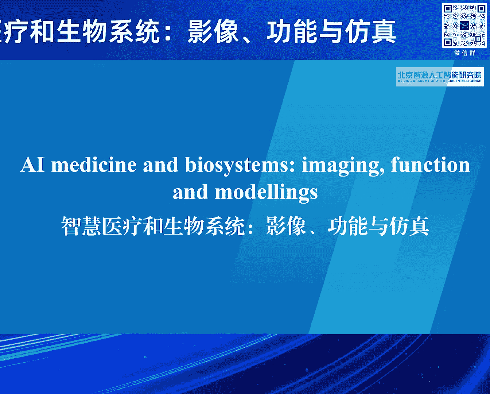
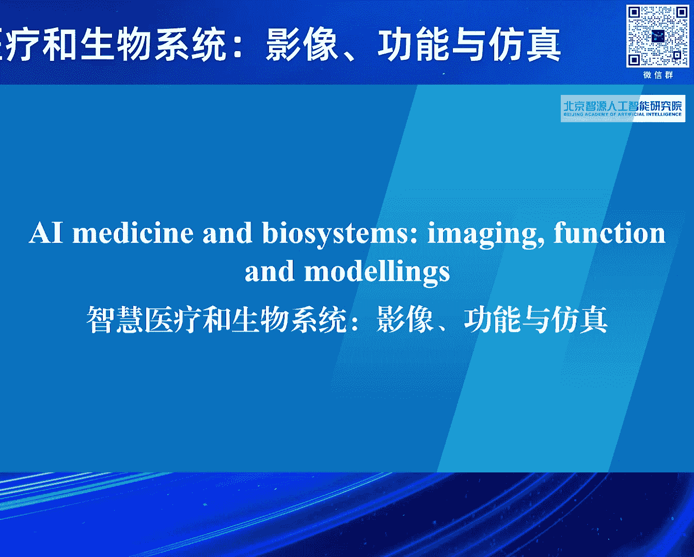
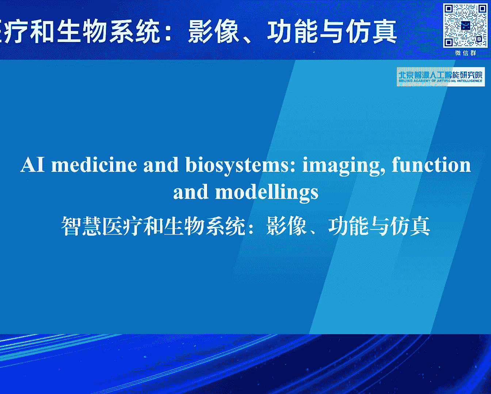
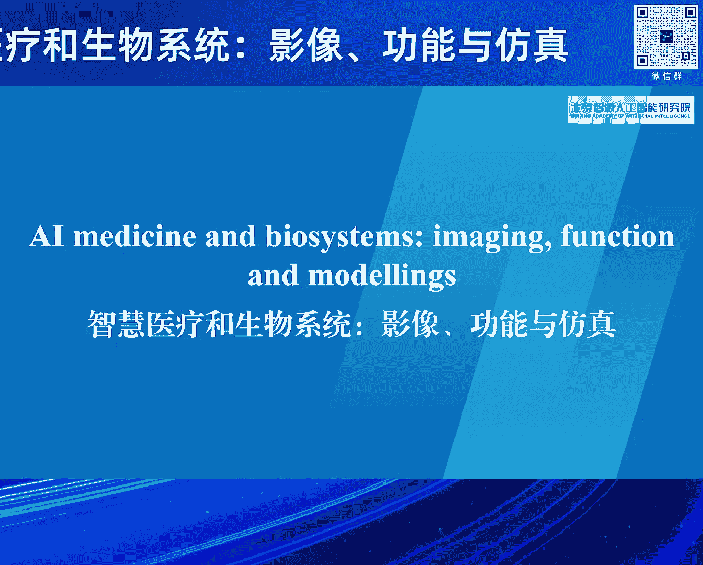

# 2024北京智源大会-智慧医疗和生物系统-影像-功能与仿真---P1-论坛背景与嘉宾介绍-张恒贵---智源社区---BV1VW421R7HV

在本节课中，我们将学习2024年北京智源大会“智慧医疗和生物系统”主题论坛的背景信息，并了解本次论坛的核心议题与参会的重要嘉宾。

---

人工智能的迅速发展，为智慧医疗和生命计算领域带来了新的机遇。相关研究已成为计算科学、生物医学工程以及临床医学等交叉学科的前沿热点。

同时，该领域的发展也面临着许多亟待解决的重大挑战。因此，我们召开了本次论坛。

本次论坛将聚焦于智慧医学研究的相关热点，探讨人工智能在医学与生物医学工程方面的研究进展、当前成果与未来规划。

为了深入探讨这些议题，我们邀请到了国内外多位著名专家。

以下是今天与会的主要专家名单：

*   英国皇家工程院院士、曼彻斯特大学教授 FRANGE
*   欧洲科学院院士、西湖大学 金要储 教授
*   牛津大学 雷明 教授
*   北京大学第一医院 李建平 教授
*   北京安贞医院 龙德勇 教授
*   北京大学人民医院 朱天刚 教授
*   哈尔滨工业大学 王宽泉 教授
*   中山大学 张赫叶 教授
*   浙江大学 夏林 教授
*   北京大学 鸿森达 教授
*   北京航空航天大学 李帅 教授
*   北京航空航天大学 潘建清 教授
*   哈尔滨工业大学 李清澈 副研究员
*   智源学者、北京大学 马雷 副研究员
*   北京大学第一医院 李玉曦 教授
*   北京建筑大学 随栋 副教授

以及各位列席专家。

本次论坛的另一个重要初衷，是吸引更多有志之士关注并加入智慧医疗这一充满潜力的研究领域。

---

本节课中，我们一起学习了2024智源大会智慧医疗论坛召开的背景、核心讨论议题以及强大的嘉宾阵容。论坛旨在汇聚顶尖智慧，共同应对挑战，推动人工智能在医疗健康领域的创新与发展。