# 2024北京智源大会-智慧医疗和生物系统-影像-功能与仿真---P3-健康信息学定量分析研究-张贺烨-主持人-马雷---智源社区---BV1VW421R7HV

## 概述

在本节课中，我们将跟随张贺烨教授的报告，学习如何将机器学习技术应用于心脏影像处理。课程将涵盖从研究动机、技术挑战到具体应用案例的完整流程，重点介绍如何利用人工智能技术提升心血管疾病的诊断与治疗水平。

---

## 心血管疾病的研究意义

心血管疾病在全球范围内，尤其是在中国，依然是导致死亡的主要原因。然而，研究数据显示，自2012年起，中国农村地区的心血管疾病死亡率开始显著高于城市地区。这一差异提示我们，开发先进的图像处理算法和无创诊断方法，并将其应用于医疗条件相对落后的农村地区，具有重要的社会意义和研究价值。

## 关注心脏影像的原因

在心血管疾病诊断中，除了非影像筛查方法（如心电图、血压测量），影像诊断技术（如超声、CT、MRI）能够提供更丰富的心脏结构和功能信息。因此，将机器学习应用于这些影像的分析，可以极大地提升图像识别与理解的效率，从而辅助医生进行更精准的诊断。

## 医学图像处理的挑战与机遇

很自然地，在医学图像处理领域，我们首先会借鉴计算机视觉的技术。计算机视觉中的目标定位、目标分割和视频运动追踪等任务，与医学图像分析有诸多相似之处。

以下是计算机视觉技术在医学图像中的一些应用对应关系：
*   **目标定位**：对应心脏在影像中的定位。
*   **目标分割**：对应血管内/外膜的分割。
*   **运动追踪**：对应超声影像中的斑点追踪技术。
*   **多视角分析**：对应血管造影中不同角度的识别。

然而，直接将计算机视觉模型应用于医学图像并非总能成功。例如，尝试使用Meta的SAM模型处理心脏超声或OCT图像时，效果并不理想，需要进行大量调试。

医学图像处理面临的核心挑战在于成像机制的巨大差异。超声依靠声波反射，CT依靠X射线透射衰减，MRI依靠电磁共振，这与计算机视觉主要处理的自然光成像原理完全不同。成像机制的不同必然对图像处理方法提出独特挑战。

更重要的是，在心血管图像分析中，我们不能仅仅关注结构信息，还必须关注功能学信息，例如血管内的血流速度和压力状态。如何从结构图像中无创地计算出这些功能参数，是医生非常关注的焦点，也是研究的难点。

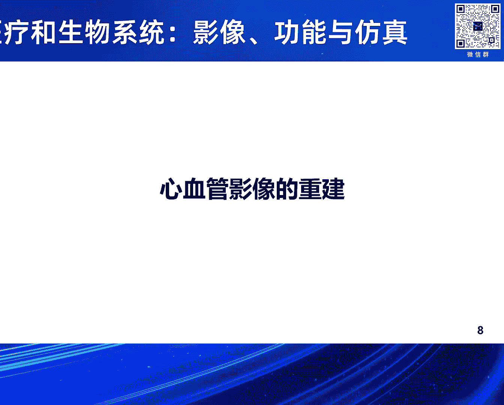

## 引入新知识以应对数据稀缺

通过对计算机领域和医学图像领域的调研，我们发现，在自然图像处理中实现模型泛化性的常用方法是改进学习模型，例如增加数据量、训练大模型。

在医学图像领域，我们当然可以从计算机视觉中学习新技术来构建新模型。但受限于医院的数据量，医学影像通常难以获得大规模的训练样本。在训练样本本身受限的情况下，如何实现模型的泛化性成为一个极具挑战性的问题。

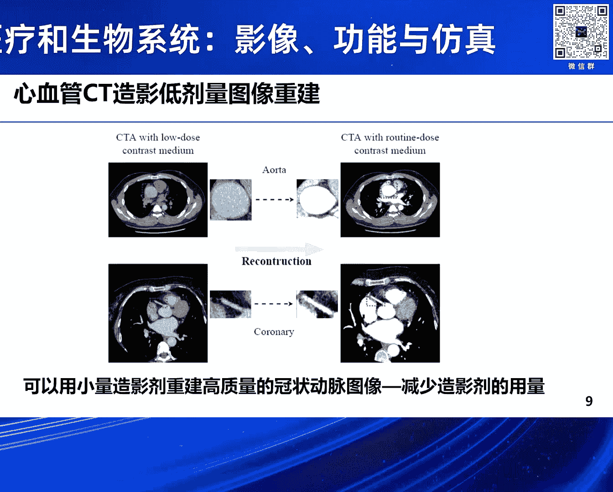

因此，我们课题组的一个重要思路是引入新的知识。这些新知识包括与结构相关的先验信息，以及我们近期重点关注的物理信息。

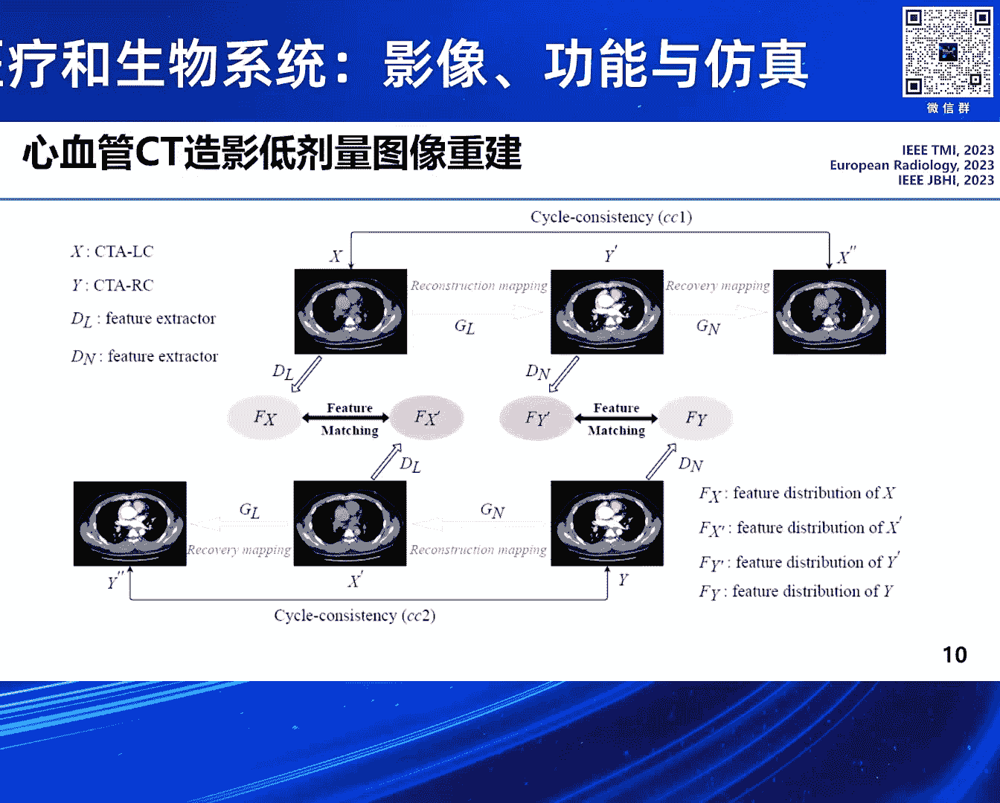

具体而言，我们探索如何将流体力学方程、固体力学方程以及电动力学方程嵌入到学习模型中。将这些物理信息模型整合进来，有助于降低模型对海量样本数据的需求。当你把新的知识加入到模型中后，很自然地，你需要针对小样本量的场景进行模型设计。这时你会发现，你不再需要为应对样本量不足而进行特殊设计。

## 应用案例一：低剂量造影剂下的高质量成像

我们近期关注的一个方向是造影剂的使用。在CT成像中，通常需要向静脉注射造影剂以获得清晰图像。然而，造影剂对肾功能不全或有过敏风险的患者存在影响。医生自然希望使用尽可能少的造影剂来获得高质量的成像效果。

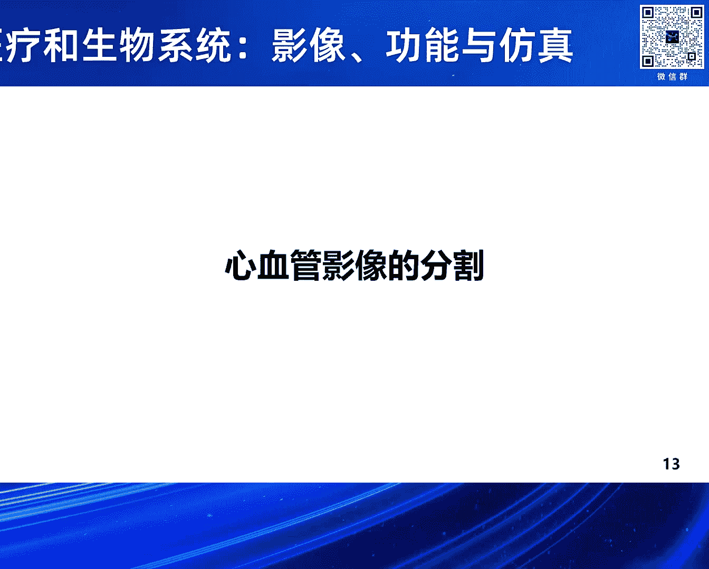

为此，我们与安贞医院影像科合作，在符合伦理要求的前提下，对同一病人进行了多次扫描：一次使用少量碘对比剂，另一次使用正常剂量。我们的目标是研究能否从低剂量造影剂图像中重建出高质量的冠状动脉图像。

在我们的方法中，采用了CycleGAN模型进行图像对比和重建。这是因为我们拥有的数据部分是配对的（同一病人有两种剂量图像），部分是不配对的（不同病人只有一种剂量图像），CycleGAN适合处理这类情况。

在146名患者的数据集上，我们进行了量化评估。从图像质量上看，将重建后的低剂量图像放入安贞医院的标准影像工作站进行主动脉重建后，结果显示，诊断所需的主动脉结构非常清晰，完全处于临床可接受的状态。这项视觉上与质量上都成功的重建工作，证明了人工智能确实能够提高成像质量，并降低患者对造影剂的摄入。相关成果已发表在 *European Radiology* 期刊上。

## 应用案例二：多模态心脏影像分割

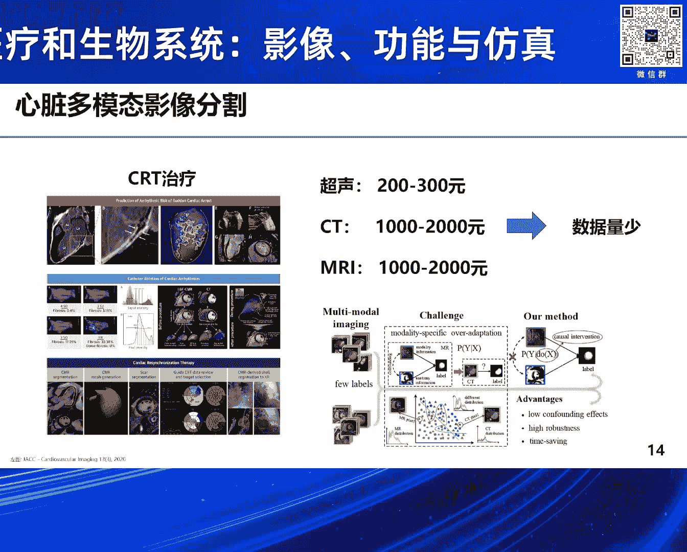

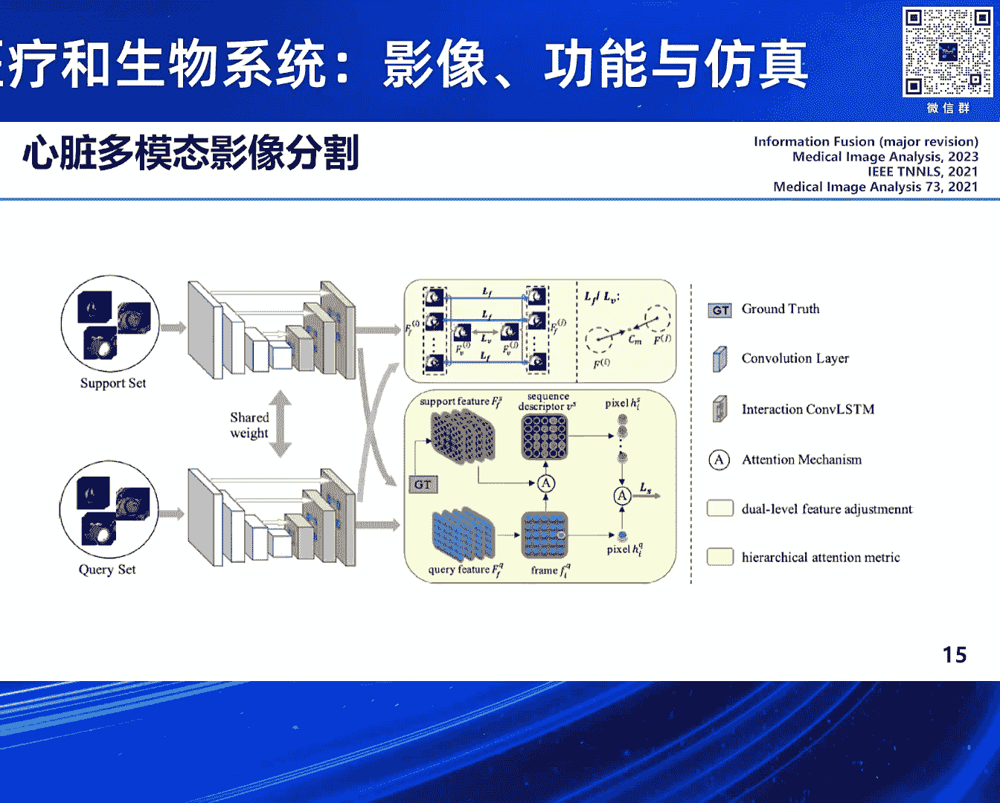

图像分割是许多后续辅助诊断工作的基础。我们重点关注如何利用多种模态的心血管影像。正如前面金老师提到的，不同医院可能拥有不同模态的优势数据（如超声、MRI），但单个中心的数据往往稀疏。能否利用不同人、不同模态的数据进行多模态分割，对于结构性心脏病或心脏再同步化治疗具有重要意义。

在术前，医生希望将不同模态的心脏影像分割结果融合到同一患者的解剖结构上，以制定更好的治疗策略。这面临一个现实问题：不同检查费用差异大（超声约200元，CT约1000元，MRI约1000-2000元），导致单一中心收集全模态数据非常困难。

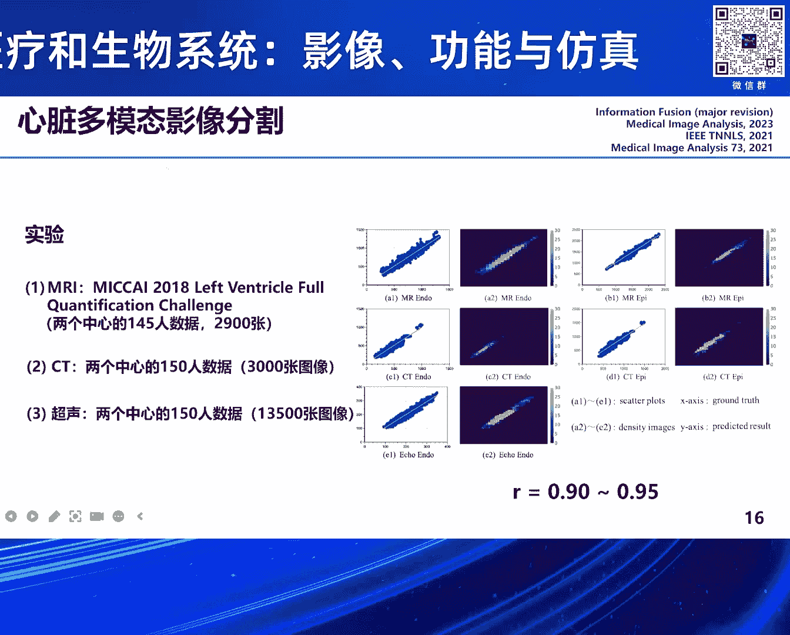

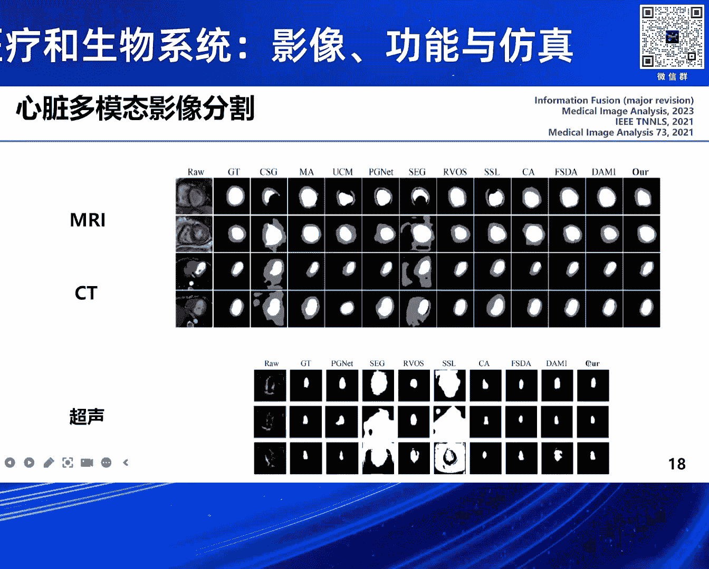

我们的思路是采用元学习的方式，利用不同模态数据共有的信息——心脏结构。无论模态如何，人的心脏都具有四个腔室（两个心室、两个心房）这一共同结构。将这种结构先验知识融合到模型中，可以帮助模型理解不同模态、不同视角下的心脏结构信息。

我们设计了一个相对简单的元学习网络结构。在两个数据集上进行了验证：一个是2018年的公开小数据集，另一个是我们合作的安贞医院（CT）、深圳医院和广州陆军总医院（超声）的私有数据。结果显示，模型在MRI、CT和超声影像上对心内膜、心外膜的分割结果吻合度很好，分割精度令人满意。

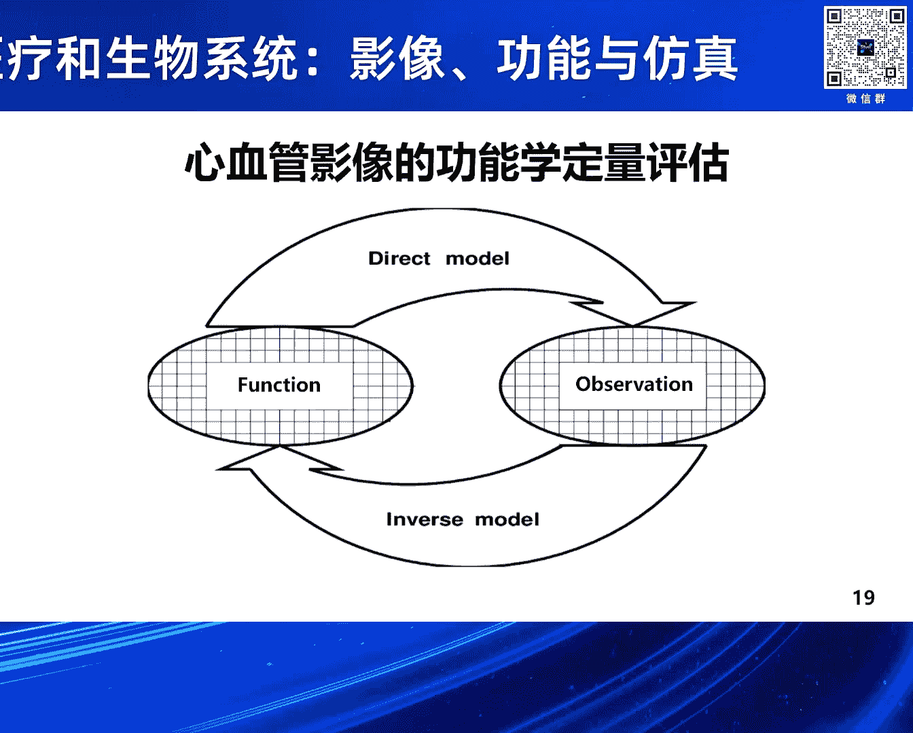

## 应用案例三：功能学定量评估——以冠脉血流储备分数为例

我们课题组另一个重要方向是如何进行功能学的定量评估。从数学角度看，这通常是一个逆问题：功能决定了结构和临床观察，但临床上我们通常只能得到观察数据，如何从中反推出功能参数挑战很大，且常是病态问题，难以求解。

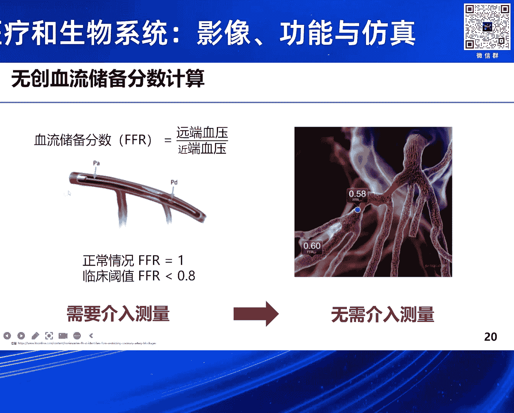

这里我们以冠脉血流储备分数为例。FFR的定义很简单，是狭窄处远端压力与近端压力的比值。公式为：
**FFR = P_distal / P_proximal**
正常情况下若无狭窄，FFR应等于1。若存在狭窄导致FFR降至0.8以下，则通常需要植入支架治疗。

美国HeartFlow公司采用计算流体力学仿真的技术，基于术前的CTA扫描图像，通过仿真计算FFR值，而无需使用介入导丝进行有创压力测量，这项技术很有意义。

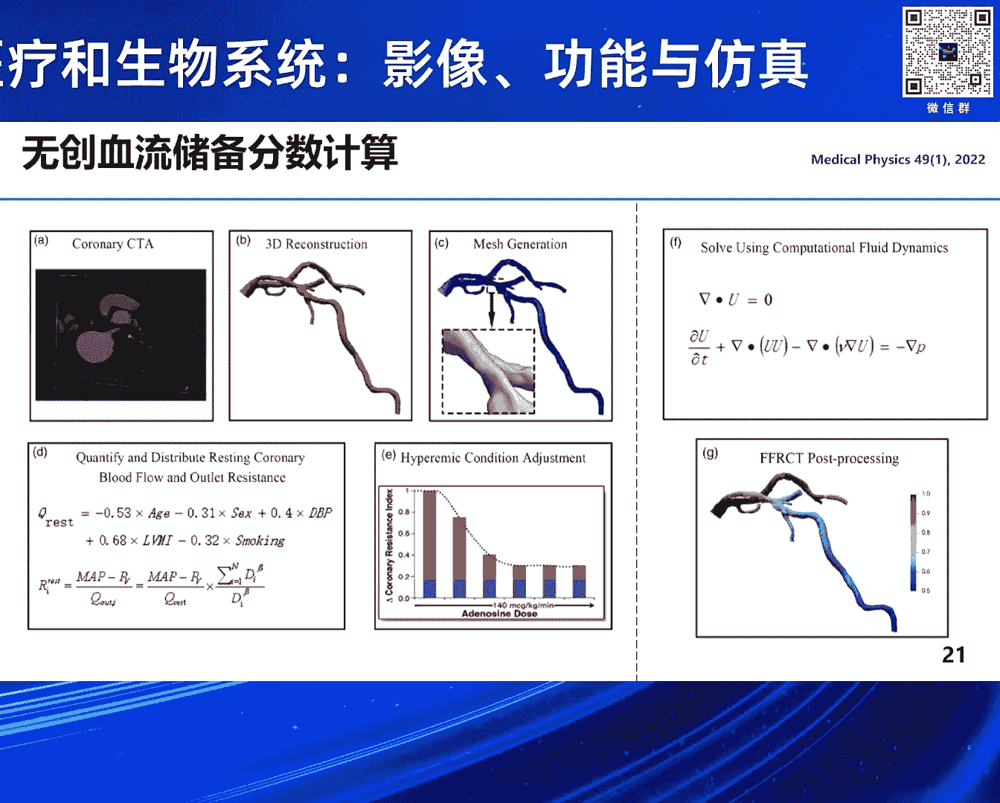

我们首先尝试并改进了这项仿真技术，调整了流体边界条件。在221名患者（实际为301例数据）的测试中，我们的仿真结果与金标准吻合度较好，相关成果作为封面文章发表在 *Medical Physics* 期刊上。

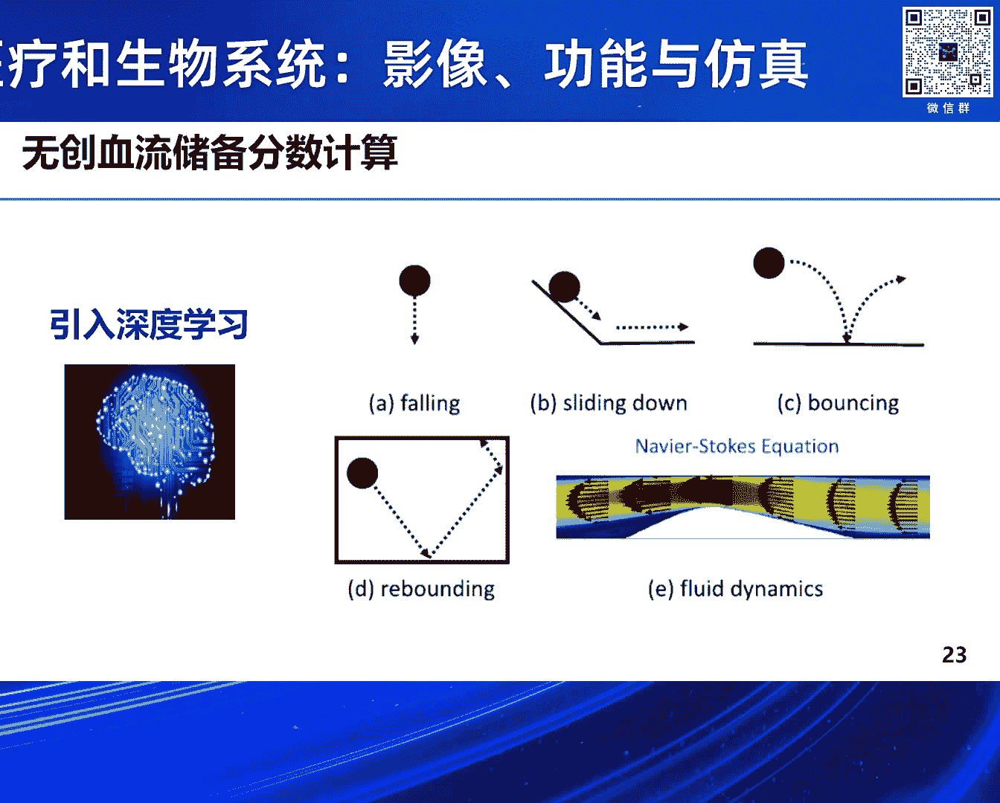

完成仿真后，我们产生了一个更有趣的想法：能否用深度学习替代仿真，让模型学习物理行为？这在计算机视觉领域已有探索，例如学习小球运动或流体力学模式。

在我们的工作中，我们利用前面构建好的流体力学仿真模型来生成训练样本。**请注意，所有训练样本均来自仿真模型，未使用任何真实患者数据。** 在训练时，我们使用树状LSTM网络来提取血管的形态特征。训练数据是仿真的血管结构及其对应的压力数据。测试时，则完全使用真实患者的血管数据。这对于计算机模型而言很有意思，因为它的训练数据和测试数据完全来源不同，更能证明模型的泛化能力。

这项与深圳科亚医疗合作的工作，在13000例仿真数据上训练，并在180例真实血管数据上测试。结果显示，无论以0.75还是0.8为临界值，模型的AUC（曲线下面积）效果都很好。后续科亚公司使用了更大规模的数据进行训练，在泛化能力上取得了更优的结果。我们基于较小数据量完成的初期工作已发表在 *Neural Networks* 期刊上。

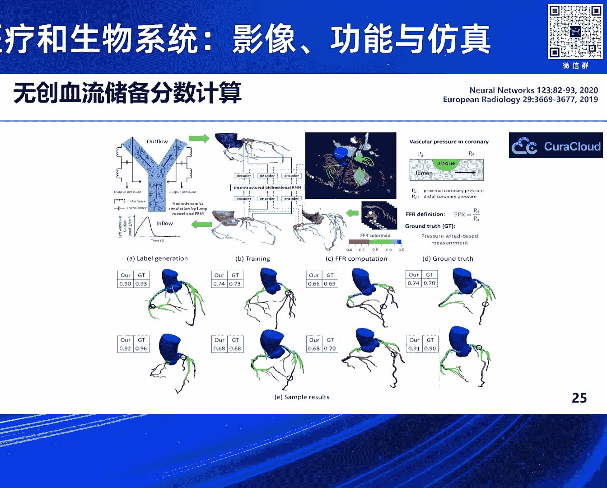

我们后续在冠状动脉功能多参数评估（如IMR）方面，以及与西南医院、北京大学第一医院合作在主动脉方面的研究工作，也即将投稿。欢迎大家关注我们的后续工作，并期待更多的合作机会。

---

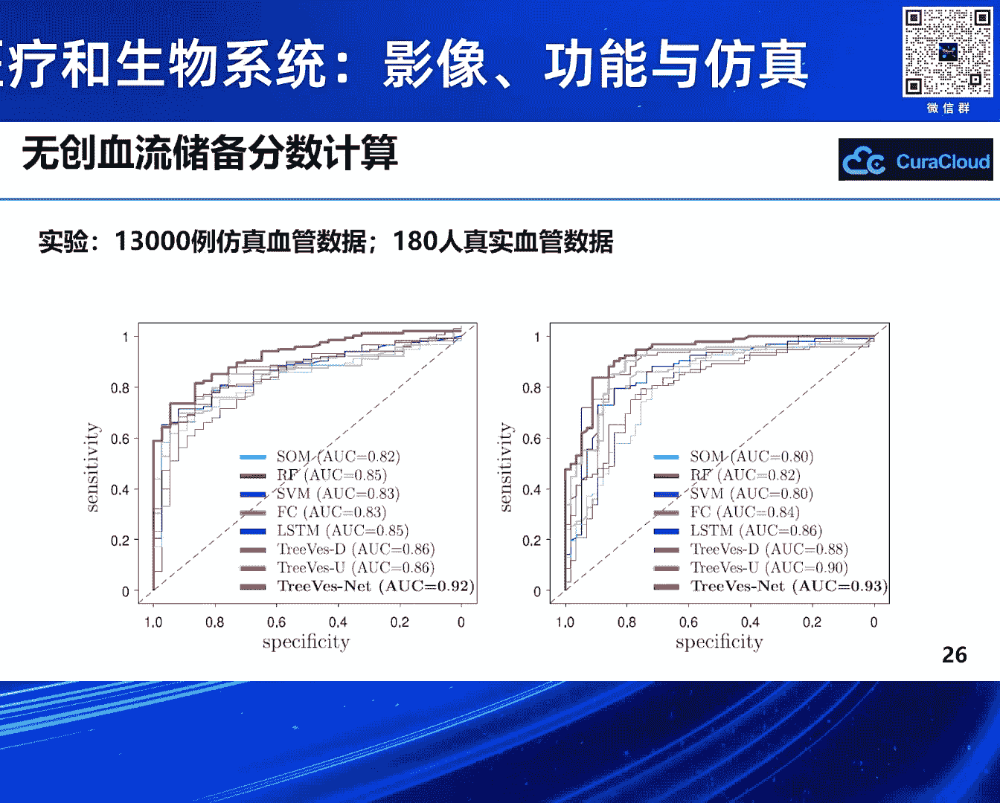

## 总结

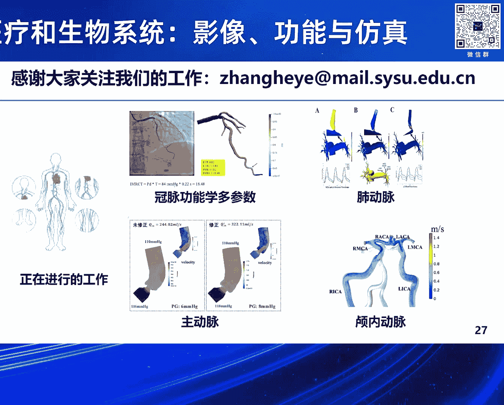

本节课我们一起学习了基于机器学习的心脏影像处理。我们从心血管疾病的研究意义出发，探讨了将计算机视觉技术应用于医学图像时面临的独特挑战，特别是数据稀缺和成像机制差异的问题。我们介绍了通过引入物理信息等新知识来应对这些挑战的思路，并具体展示了三个应用案例：低剂量造影剂下的高质量图像重建、多模态心脏影像分割，以及利用深度学习模型从结构图像中无创计算血流储备分数等功能参数。这些工作表明，人工智能技术有望在提升心血管疾病诊疗水平、降低医疗成本方面发挥重要作用。