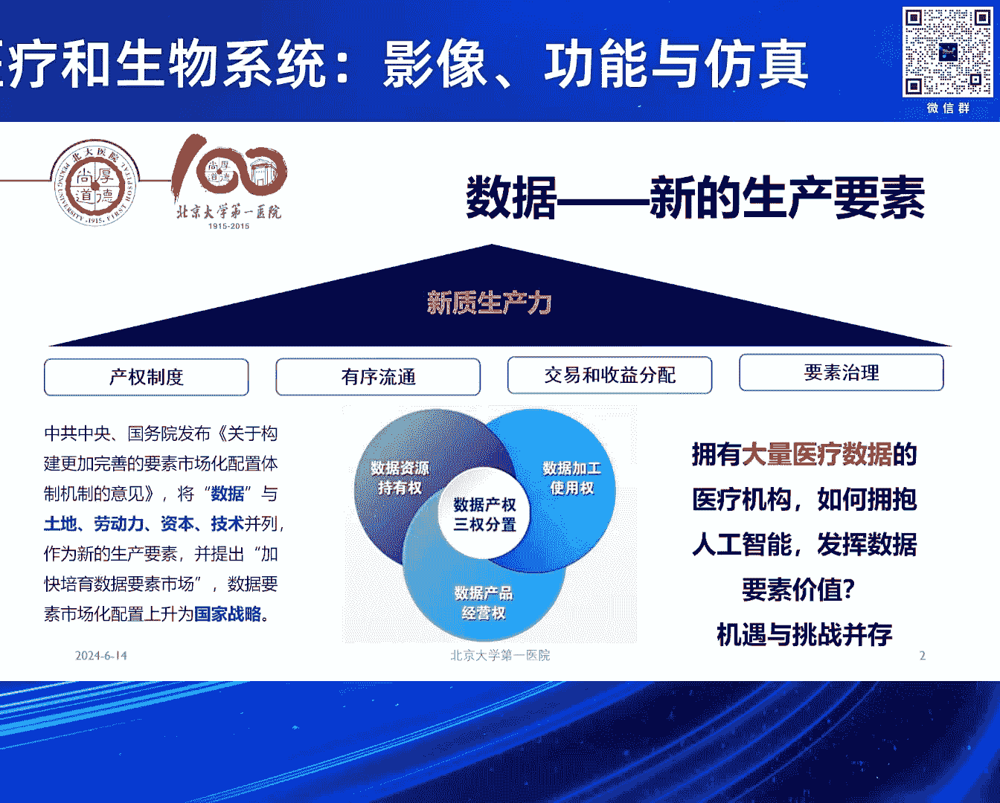
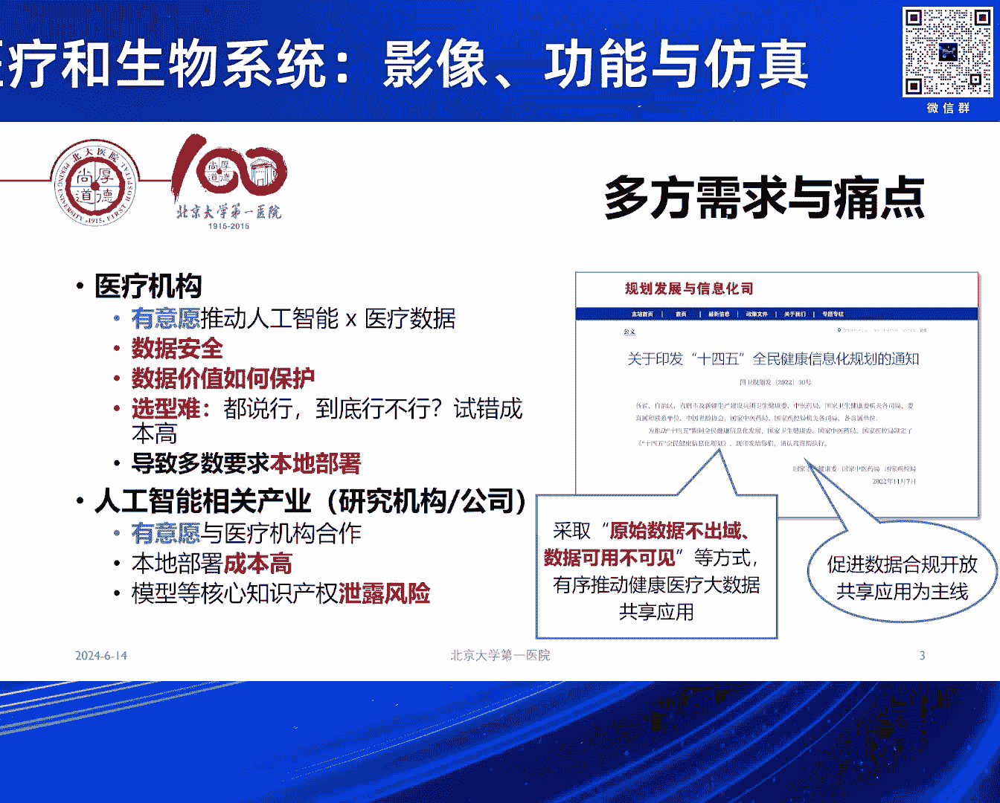
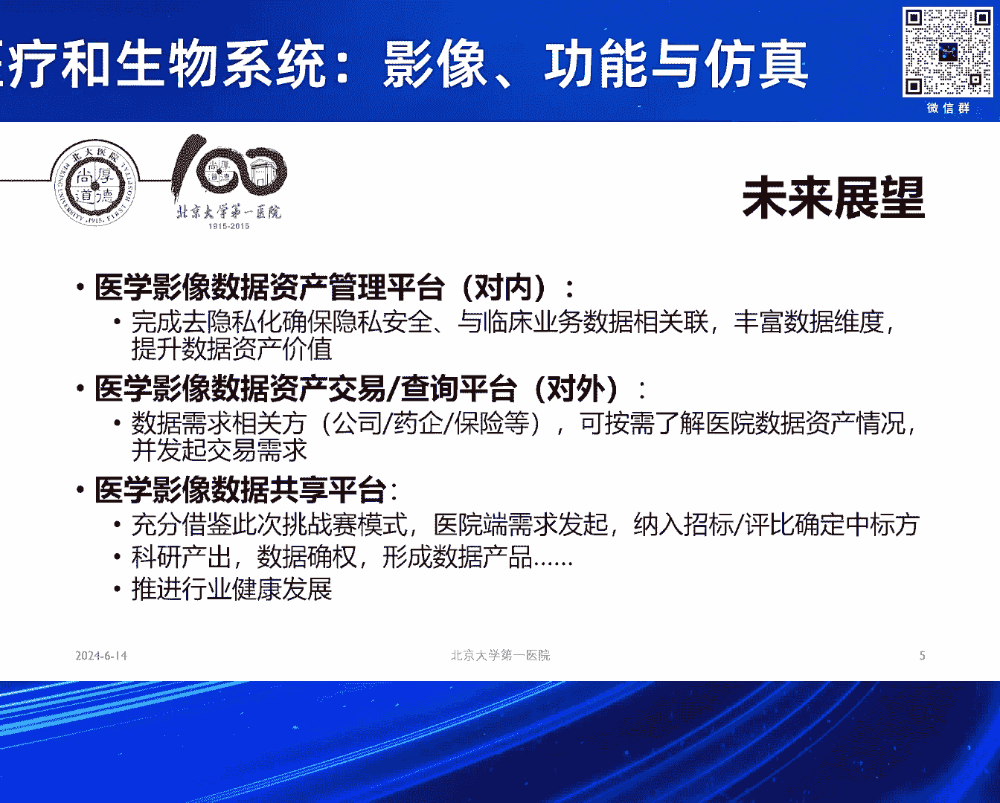
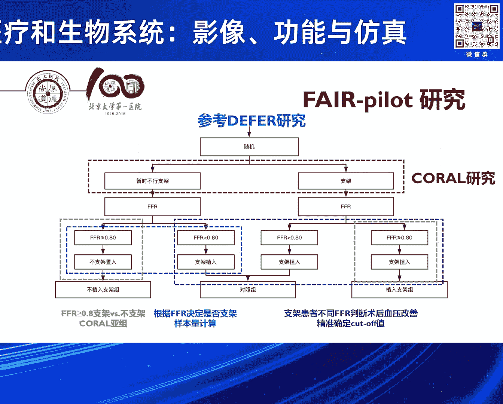
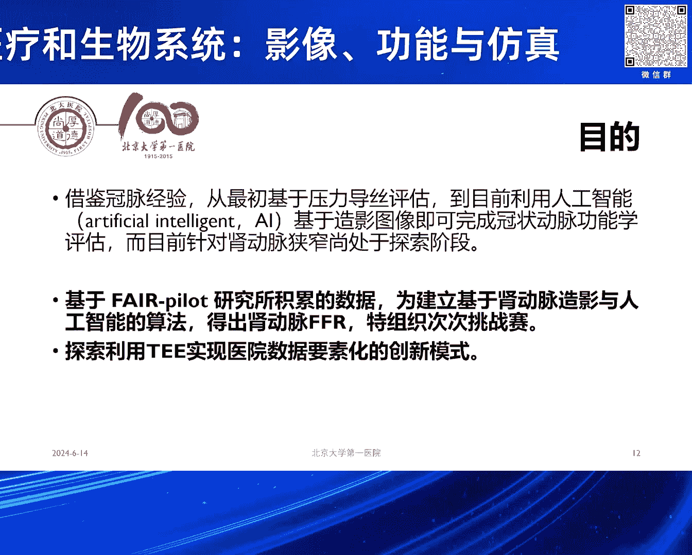

# 2024北京智源大会-智慧医疗和生物系统-影像-功能与仿真---P5-基于可信执行环境的AI医学影像挑战赛发布-李建平-主持人-李昱熙---智源社区---BV1VW421R7HV

## 概述
在本节课中，我们将学习由北京大学第一医院李玉溪主任介绍的“基于可信执行环境的AI医学影像挑战赛”。我们将了解该挑战赛发起的背景、核心痛点、技术解决方案以及具体的竞赛任务。课程将重点阐述如何利用隐私计算技术，在保护医疗数据安全的前提下，推动人工智能在医学影像领域的应用与发展。

---

## 一、 挑战赛背景与痛点

感谢李建平主任的精彩报告。接下来由李玉溪主任介绍基于可信执行环境的AI医学影像挑战赛。李玉溪是北京大学第一医院信息中心副主任、心内科副主任医师，擅长常见心血管疾病的临床评估与诊治。

他尤其专注冠脉及高血压介入治疗，参与多篇心血管疾病大型临床研究项目，以第一作者发表SCI论文十余篇。

医院的数据非常宝贵。中国的专家可能没有这个感受，但如果真的去欧美，要跟医院合作使用数据真的很难。国家整体的战略数据，将来是新的生产要素。拥有大量医疗数据的医疗机构，有意愿拥抱人工智能，让这些数据真正发挥作用。

但是这里面有需求，也有痛点。医院很有意愿与人工智能的研究机构、公司合作，但这里面存在数据安全问题。中国的医疗机构很缺乏数据安全的防范能力。

数据价值如何去保护也是一个问题。一旦这些数据，哪怕是脱敏的数据给到了任何第三方，未来实际上就失去了这份数据本来可能有的价值。

合作模式也存在困难。到底谁做得好，很难有一个条件来证实。因为大家都说做得好，但到底好不好，其中的验证成本很高。

这导致的一个后果就是，医院会要求所有人必须来医院内部合作。很多工作都必须到医院里面去做。这对于研究机构和公司而言，无疑增加了成本。公司也会有顾虑，担心把自己的核心算法模型放在医院，会有被其他竞争者接触的风险。

## 二、 解决方案：可信执行环境（TEE）

在这样的背景下，国家提出了可能实现“原始数据不出域，数据可用但不可见”的目标。

从这样的过程中，我们提出了一个大胆的想法。好在有张教授和智源研究院的支持，使得我们能够利用这样的一个机会。

我们最初的想法，是想利用众多人工智能学会开展的测评竞赛模式。这是一种很成熟的模式：提出一个任务，让参与者在同一个公平的平台上竞争，看看到底谁做得好。但关键是如何解决上述痛点。

现在，智源研究院以及提供技术支持的荣安数科公司，提出了基于**可信执行环境（TEE）**的技术路线。

在这个技术路线之上，我们希望通过这个小小的尝试，能够打造未来的生态模式。例如，医院将来可以对内建设医学影像数据资产管理平台。这些数据可以很好地去隐私化，我们可以整理出数据的维度、病人的临床资料、随访时长等信息。

对外，我们可以形成一个交易或查询平台。未来任何第三方，如公司、药厂、保险企业，需要了解医院数据时，我们可以提供信息。这就有可能进行后续的数据确权以及良性的合作。

最后，如果有这样一个隐私计算平台，就能够提供一个更公平的竞争和选型环境，甚至有可能改变未来很多招标的流程和模式。

## 三、 竞赛初衷：肾动脉功能学评估

这次的竞赛前期特别感谢张教授、智源研究院以及今天在座的各位专家团队的大力支持。

下面我以简短的时间，跟大家汇报一下我们这个竞赛发起的初衷和一些简单的细则。

背景是冠脉功能学很重要。我们这次的竞赛其实是围绕肾动脉。肾动脉是引起高血压和缺血性肾脏病的一个非常重要的病因。

肾动脉狭窄的治疗方式就是药物和支架。但介入治疗到目前为止，几个大规模的随机对照试验（RCT）研究也都是阴性结果，这与稳定性冠心病的情况如出一辙。

过去这些研究回过头来分析，肯定有一些可能的偏移问题。例如，纳入了很多狭窄程度并不重的患者。另外，那些非常严重的患者，因为这是随机对照研究，医生和患者都不愿意参与。因为一旦参与，可能会被随机分到药物治疗组，但医生和患者都觉得应该放支架。这些病人的数据并没有进入RCT。

这导致的一个直接后果是，欧美现在基层的医生基本不再给大医院推荐做肾动脉支架的病人。最后一篇RCT研究是2014年发表的，到现在已经过去了10年。

在去年，欧美的专家认识到，这个RCT其实影响了很多病人，很多病人可能耽误了最佳救治时机。所以在去年，发表了一篇最新的关于肾血管性高血压血运重建的专家立场声明。其中说明不是所有的病人都不该做，而应该去挑选合适的病人。

问题来了：我们怎么去挑选？目前无论是中国、美国还是欧洲的指南，都没有一个特别确定的标准来界定什么病人该放支架，什么病人不该放。

我们回想到，冠脉是走过了这样一个循证的历程。最早我们就是基于造影，超过70%狭窄就放支架，70%以下不放。但一系列的研究，甚至用假手术对比的随机对照研究，都没有看到阳性结果。

随着压力导丝，到后续基于冠脉造影的人工智能技术（如QFR、CFR、FFR），现在积累了大量的循证医学证据，证明基于功能学的支架治疗优于过去基于造影的判断，甚至优于单纯的药物治疗。

我们的这个工作，就是希望看看能不能把同样的功能学理念引入到肾动脉评估中。

在这个基础上，我们在临床中已经开始了探索。我们最早的一例病人是2019年开始做。当时这个病人通过了功能学的评估，也获得了非常良好的预后，到现在随访超过5年，他的血压和肾功能都保护得很好。

我们就想把它转化成为一个循证的证据。在李院长牵头下，我们开展了所谓“FIRE Pilot”的一个研究。这个研究完全是一个随机对照研究的设计。我们有很好的前期的研究方法，中间也给病人进行了多模态的影像评估，包括肾动脉超声、磁共振，当然也有我们术中的造影和FFR测量的肾动脉压力参数。我们就是希望看看这样的方法是否可行。

在Pilot研究中，目前我们已经完成了所有病人的入组，正在进行随访。我们总共随机了106例患者。现在已经有了一些初步的数据分析。今年这个主要研究可能也要在今年的欧洲心脏病学年会上进行汇报。

## 四、 挑战赛任务与数据

在这个过程中，我们就希望能够开展这样一个临床挑战赛。

它的背景和初衷有两个：
第一，将来一定要像冠脉一样，跨过压力导丝，进入利用影像和人工智能算法直接得出肾动脉功能学指标的阶段。
第二，就是刚才的背景，有没有可能通过隐私计算的方式，探索出一个新的创新合作模式。

我们把Pilot研究的106个病人的数据全部进行了汇总。我们提供了一批样例数据，希望大家能够在这个基础上开展人工智能算法的研发工作。

这些数据我们提供了几类样例：
1.  **术中的肾动脉造影图像**：动态的DICOM原始格式、去隐私化的数据。并且在这里面我们进行了QCA软件的标注，由专业医生完成了狭窄程度和狭窄部位的标注。
2.  **手术过程中的压力导丝数据**：测得的肾动脉的FFR值，包括远端的平均压、病变近端的平均压以及基线的压力数据。

在这个过程中，我们很遗憾确实只能提供少量的数据。在医学领域，很多场景下我们只有小数据，还没有大数据。但是我相信，在人工智能非常专业的专家团队的带领下，即便用这些小数据，也应该能够探索出未来的方法。

我们初步计划会提供10例标注好的样例数据。每一例都有病人肾动脉的详细直径、狭窄、病变的直径、参考血管数据，以及FFR值、术中的压力结果和我们的影像。

最终我们希望拆分成三个任务：
1.  **任务一**：识别血管狭窄的关键帧。因为一个造影图像从空白到填充造影剂，里面有很多帧，需要识别出最能体现狭窄的关键帧。
2.  **任务二**：根据关键帧的图像，完成图像中狭窄区域的勾勒和分割。
3.  **任务三**：完成肾动脉FFR值的人工智能算法预测。

智源研究院以及我们合作的隐私计算团队，给大家提供了运行的硬件和软件环境。后续期待各位专家如果有兴趣，可以跟我们进一步合作。

## 五、 总结与启动

关于整个挑战赛的背景和任务，我简单就汇报到这。

最后，我们再次邀请张恒贵教授、李建平副院长以及李亚聪老师，一起来进行一个简短的挑战赛发布仪式。

我们特别感谢大家见证我们这个“肾动脉功能学计算的、基于隐私环境下的计算挑战赛”的正式宣布启动。

---

## 总结
本节课中，我们一起学习了“基于可信执行环境的AI医学影像挑战赛”的完整介绍。我们了解了医疗数据共享的痛点、**可信执行环境（TEE）**作为“数据可用不可见”的解决方案、以及本次竞赛聚焦的肾动脉功能学评估的临床背景。竞赛旨在利用少量但高质量的标注数据（包括造影图像和压力导丝FFR值），通过三个具体任务（关键帧识别、狭窄分割、FFR预测），推动AI在肾动脉疾病精准治疗中的应用，并探索一种基于隐私计算的新合作生态模式。