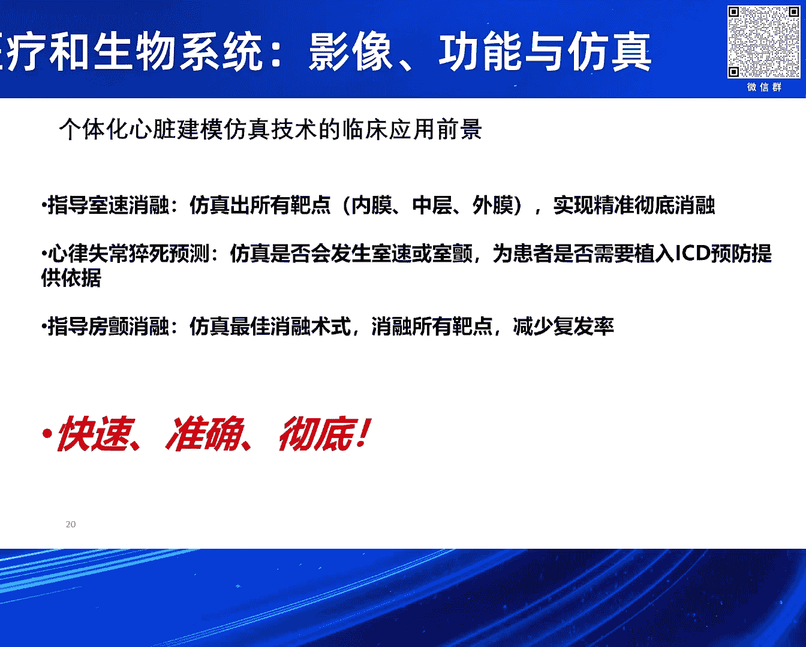

# 2024北京智源大会-智慧医疗和生物系统-影像-功能与仿真---P6-个体化心脏建模仿真技术及其临床应用前景-夏灵-主持人-王宽全---智源社区---BV1VW421R7HV

## 📘 概述

在本节课中，我们将学习个体化心脏建模仿真技术的基本原理及其在心律失常治疗中的临床应用前景。我们将了解如何利用患者的心脏磁共振影像构建三维数字心脏模型，并通过计算机仿真来预测心律失常的起源、规划消融靶点以及评估猝死风险。这项技术旨在解决传统电生理标测的局限性，实现更精准、高效的心脏疾病诊疗。

---

## 🧠 第一部分：心律失常治疗的挑战与现状

上一节我们概述了课程内容，本节中我们来看看当前心律失常临床诊疗面临的主要挑战。

心律失常是心脏疾病诊治的难点。其他心脏疾病（如结构性心脏病）可通过影像检查直接观察病灶，但心律失常与心脏电活动异常相关，在常规影像中“看不见”。

*   **正常心律与失常心律对比**：
    *   正常心脏的兴奋传导非常有规律。
    *   当心脏特定区域（如心尖）受到异常刺激时，电活动会变得紊乱，导致心跳过快（心动过速）甚至心室颤动。心室颤动是致命的，必须立即进行电除颤。

治疗心律失常的关键在于找到并消融异常电活动的起源点（靶点）。目前的主流方法是经导管射频消融术。医生将导管经血管送入心脏，通过释放射频能量破坏异常组织。

然而，确定消融靶点本身是一大挑战。临床上主要依赖心内电生理标测系统（如强生公司的CARTO系统或雅培的EnSite系统）来逐点测量心脏内膜的电活动。

当前标测技术存在以下问题：

1.  **耗时**：手术中需要反复诱发心律失常并进行标测，这个过程占据了大量时间。
2.  **维度局限**：虽然系统显示三维心脏模型，但导管主要接触心内膜，因此标测实质上是二维的。对于位于心外膜或心肌中层（心肌壁内）的靶点难以探测。
3.  **可能遗漏潜在靶点**：临床诱发通常只在少数几个预设点进行刺激，可能无法诱发出所有潜在的异常通路，导致消融不彻底，复发率较高。

---

## 🏗️ 第二部分：个体化心脏建模的原理与方法

上一节我们介绍了传统标测技术的局限，本节中我们来看看个体化心脏建模仿真技术如何提供新的解决方案。

该技术的核心思想是：**为每位患者构建一个专属的、包含解剖结构与电生理特性的数字心脏模型，并在计算机中进行仿真，预测心律失常的发生机制。**

以下是构建与使用个体化心脏模型的关键步骤：

1.  **数据获取与模型构建**：
    *   对患者进行心脏磁共振扫描，特别是使用钆对比剂延迟增强序列。这项技术可以清晰显示心肌的疤痕组织（完全坏死的细胞）和灰区（存活但功能受损的细胞）。
    *   利用人工智能技术，全自动地从影像中分割出心脏的三维几何结构，并区分健康心肌、疤痕和灰区。这大大提升了建模效率。
    *   公式示例：模型构建可视为一个图像分割与三维重建的过程，其输出是一个包含不同组织标签的网格模型 `M = {vertices, faces, labels}`，其中 `labels ∈ {健康心肌, 疤痕, 灰区}`。

2.  **赋予电生理属性**：
    *   在结构模型的基础上，为其赋予生物物理特性。
    *   这包括心肌纤维的走向（各向异性），以及不同类型心肌细胞（如心内膜层、中层、心外膜层）的动作电位模型。
    *   代码示例：电传导仿真常使用反应-扩散方程来描述，例如 `∂u/∂t = ∇·(D∇u) + I_ion(u, w)`，其中 `u` 是膜电位，`D` 是扩散张量（反映纤维走向），`I_ion` 是离子电流。

3.  **虚拟刺激与仿真计算**：
    *   在数字模型上，按照美国心脏协会的标准，在多个位置（如19个点）施加虚拟的电刺激（模拟引发心律失常的早搏）。
    *   运行仿真计算，观察电波在包含疤痕和灰区的复杂结构中的传导情况，看是否会形成导致心动过速的折返环路。

---

## 💡 第三部分：临床应用场景与案例

上一节我们讲解了如何构建和仿真心脏模型，本节中我们通过具体案例来看看这项技术的三大临床应用方向。

### 场景一：指导室性心动过速消融

*   **目标**：精准定位消融靶点，实现一次性彻底消融。
*   **过程**：通过仿真，可以计算出维持心动过速的关键峡部（通常是疤痕与健康组织交界处的缓慢传导区）。这些位置可能位于心内膜、中层或心外膜。
*   **案例效果**：仿真计算出的消融靶点（青色区域）与临床医生实际手术中确定的靶点（红色区域）高度吻合。仿真还能发现传统标测可能遗漏的潜在靶点，有望降低复发率。

### 场景二：预测心脏性猝死风险，指导ICD植入

*   **目标**：更准确地判断患者是否需要植入植入式心律转复除颤器（ICD）。
*   **现状问题**：目前主要依据左心室射血分数（LVEF<35%）来决定是否植入ICD，准确率有限（约20-30%），导致该植入的未植入，不该植入的反而植入。
*   **仿真方法**：在患者模型上进行广泛诱发测试。如果在多个刺激点都能诱发出恶性心律失常（如室速/室颤），则判定为高风险。
*   **案例效果**：
    *   正向案例：对一例扩张型心肌病患者仿真，诱发出频率为178次/分的室速，与实际心电图记录的180次/分高度一致。该患者随后植入ICD，并在数月后成功放电除颤，验证了预测的准确性。
    *   反向案例：一例房颤术后患者，仿真显示其猝死风险极高，但未接受ICD植入建议，数月后猝死。
    *   统计：在北京安贞医院的初步研究中，该方法的预测准确率达到了96%。

### 场景三：优化房颤消融策略

*   **目标**：为房颤患者规划更彻底的消融线路，降低复发率。
*   **方法**：利用心脏磁共振识别心房纤维化区域。在包含纤维化结构的左心房模型中进行仿真，找出所有可能维持房颤的折返环路或关键驱动灶。
*   **案例效果**：针对一位多次消融后复发的难治性房颤患者，仿真发现了多个位于左心房和右心耳的折返环。据此规划了新的消融线路（包括必要的肺静脉隔离和其他线性消融），术后患者长期未复发。
*   **优势总结**：该方法有望实现 **快速、准确、彻底** 的消融。
    *   **快速**：术前完成仿真规划，节省术中标测时间。
    *   **准确**：仿真能发现心内膜、中层、心外膜等各层的靶点。
    *   **彻底**：通过在电脑上对多个区域进行虚拟诱发，尽可能找出所有潜在靶点，力争一次手术解决。

---

## 🎯 总结

本节课中我们一起学习了：

1.  **个体化心脏建模仿真技术** 通过整合患者的心脏磁共振影像与计算生理学，构建出能反映个人心脏结构（疤痕、灰区）和电功能的三维数字模型。
2.  该技术主要应用于三大临床场景：**指导室速的精准消融**、**预测猝死风险以优化ICD植入决策**、以及**规划更彻底的房颤消融策略**。
3.  其核心价值在于弥补传统心内标测的不足（如维度局限、耗时、可能漏靶点），通过 **“在电脑上先模拟”** 的方式，实现更**快速、准确、彻底**的心脏电生理治疗，最终目标是降低手术复发率和改善患者预后。

这项技术代表了计算医学在心血管领域的前沿应用，是连接基础研究、工程技术与临床实践的重要桥梁。

---

