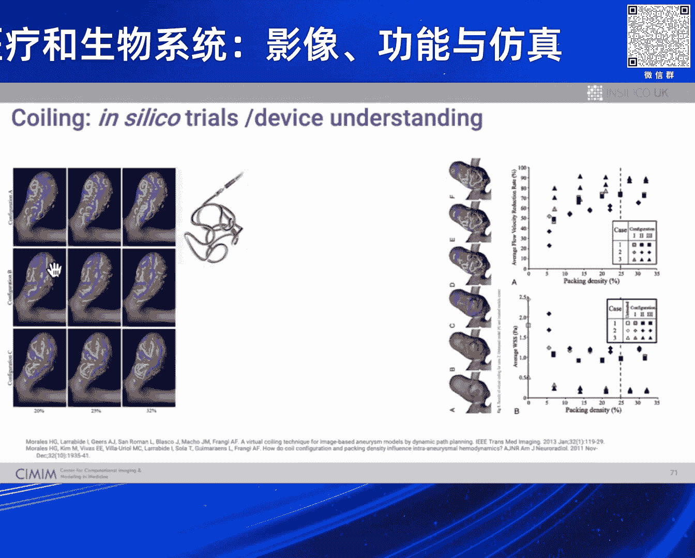
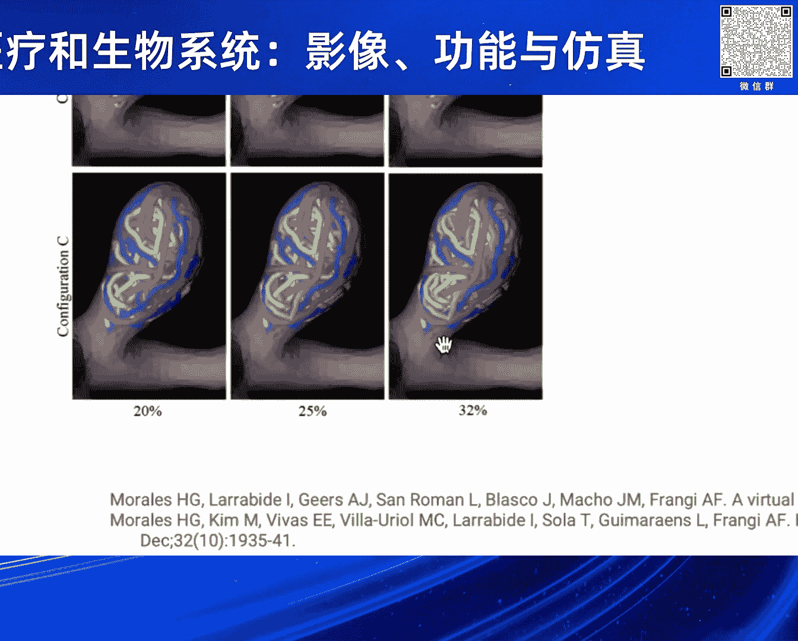
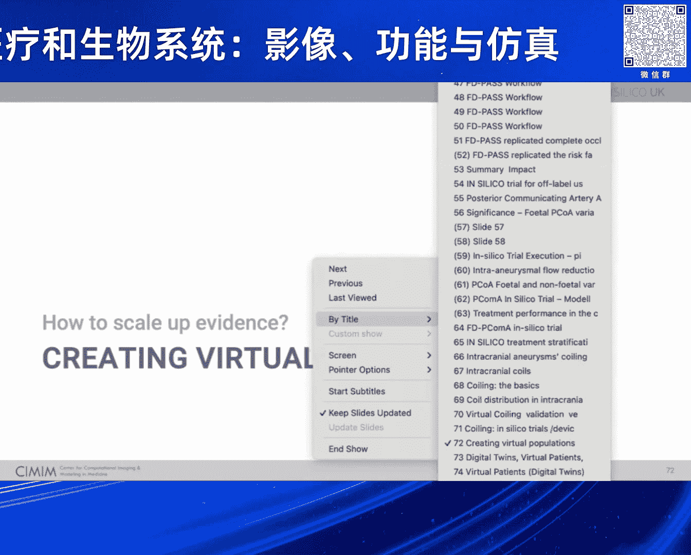

# 2024北京智源大会-智慧医疗和生物系统-影像-功能与仿真---P7-On-trials-and-tribulations--Alejandro-Frangi---智源社区---BV1VW421R7HV

## 概述
在本节课中，我们将学习 Alejandro Frangi 教授关于医疗产品创新中“硅试验”的演讲。我们将探讨如何利用计算建模与仿真技术，以更快、更可持续的方式开发更安全的医疗器械，并理解其在现代医疗监管与研发中的关键作用。

---

## 医疗产品创新的现状与挑战
当前，医疗产品（无论是药品还是医疗器械）的创新过程非常漫长，需要经历多个阶段以确保安全性和有效性。这些阶段包括台架试验、动物试验和人体测试。然而，每种方法都存在局限性，它们并不总能像我们预期的那样有效确保安全。

在医疗器械领域，开发一个新设备的平均成本约为四到五百万美元，且从概念验证到上市后研究的每个阶段都有很高的损耗率和失败概率。一项研究指出，超过50%的医疗器械召回是由于设备设计问题。例如，在美国，过去十年中许多通过FDA许可的设备导致了大量死亡和严重不良事件。这表明我们面临一个严重的问题。

---

## 硅试验：一种新的范式
上一节我们介绍了当前医疗产品创新面临的挑战，本节中我们来看看一种潜在的解决方案：硅试验。

硅试验是指在高度受控的虚拟条件下，使用基于计算机的测试和详细的预测模型，来模拟真实世界的情况。其核心思想是“首先，不要伤害到模拟”。在许多其他行业（如汽车和航空航天），在实体制造和测试之前，大部分工作都依赖于模拟。这些行业同样面临多尺度、高度监管和充满不确定性的复杂问题，但它们已经成功实现了从实体到虚拟的转型。

我的问题是：为什么我们不能在医疗保健领域做同样的事情？

---

## 硅试验的优势与目标
硅试验的目标不是取代一切，也不是将人体随机对照试验视为完美的黄金标准。我们知道随机对照试验本身也存在局限性，例如选择偏差，以及在罕见病、儿科或联合治疗等领域实施的实际或伦理困难。

我们提倡的是整合多种证据来源。如果你有三个证据来源，就应该结合它们；如果有四个，就更应该如此。通过结合硅试验、台架试验、动物试验和人体试验的证据，我们可以更全面地评估一项技术，从而可能减少所需的人体试验规模，甚至在某些情况下替代部分试验。

以下是硅试验可能带来的具体影响：
*   **优化试验设计**：通过更好地理解效应大小，可以设计出更高效的人体试验。
*   **降低风险**：识别出注定失败的技术，避免让患者暴露于不必要的风险，也节省公司的研发资本。
*   **补充证据**：在缺乏足够患者数据的领域（如罕见病），硅试验可以提供关键的补充证据。

一个著名的案例显示，一家制造商通过硅试验方法，使其产品提前两年上市，减少了约250名不必要的患者参与试验，节省了约一千万美元的试验费用，并让更多患者提前获得了治疗。

---

## 实施硅试验的现状与障碍
目前，硅试验正处于发展的活跃期。监管机构如美国FDA已开始更新指南，将建模与仿真纳入考量和证据生成框架。英国和欧洲也出现了相关的实践社区，致力于制定良好的模拟实践标准。

然而，广泛采用仍面临一些障碍：
*   **监管不确定性**：行业对建模与仿真的监管要求存在不确定性。
*   **模型质量参差不齐**：现有模型的成熟度和可信度标准不一。
*   **人才短缺**：缺乏具备足够建模、仿真及证据评估技能的专业人员。

---

## 案例研究：脑动脉瘤分流装置的硅试验
现在，我们通过一个完整的端到端案例，来看看硅试验如何付诸实践。这个案例围绕用于治疗脑动脉瘤的分流装置展开。该装置像一个密集的网状支架，植入载瘤动脉后，可以改变血流，促使动脉瘤内形成血栓并最终闭合。

传统的研发路径中，每种新装置都需要进行漫长的随机对照试验，整个过程可能长达七年，而技术迭代很快。在硅试验中，我们可以采取不同的方法。

首先，我们需要一个代表目标人群的解剖模型库。例如，在英国，我们正尝试在地区层面建立这样的库，以获得成千上万的解剖模型。

对于每个解剖模型，我们执行以下步骤：
1.  **植入设备**：在虚拟模型中植入目标装置。
2.  **定义成功指标**：例如，“最大时间平均速度减少百分比”，用于衡量动脉瘤颈部血流减少的程度。
3.  **模拟不同生理状态**：如休息、运动（压力）和高血压状态，观察同一装置在不同条件下的表现。
4.  **模拟物理与生化过程**：计算血流动力学，并模拟与凝血相关的生化途径。

通过这种管道，我们可以进行大规模的虚拟实验。在一项发表于《自然通讯》的研究中，我们成功地用硅试验复现并扩展了传统临床试验的发现。

研究发现，对于同一患者和同一装置，高血压生理状态会导致更显著的血流减少，但也可能引发血栓延伸至重要的分支血管，造成缺血风险。这解释了为什么在某些临床试验中，患者的反应率较低——可能因为许多患者并未得到良好的高血压控制。硅试验帮助我们揭示了这种设备、解剖结构和生理状态共同作用产生的新行为。

此外，硅试验还能用于：
*   **理解标签外使用**：评估设备在获批适应症之外患者群体中的效果。
*   **促进健康公平**：分析监管证据对不同种族或族裔群体的公平性。
*   **优化治疗策略**：例如，在动脉瘤弹簧圈栓塞术中，硅试验可以帮助确定最佳的“填塞密度”，避免过度治疗（增加破裂风险）或治疗不足（导致复发）。

---

## 总结与展望
本节课中，我们一起学习了医疗产品创新的现状与挑战，并深入探讨了“硅试验”这一新兴范式。

我们了解到，医疗产品创新正处在一个拐点，法规需要现代化以跟上技术发展的步伐。建模与仿真在未来监管路径中不可或缺，这既是技术挑战（需要开发正确的模型），也是一场文化转变（需要建立患者和监管机构对模拟证据的信任）。

起点虽小但很重要。我们应该在那些硅试验能产生最大影响的领域率先开始。对于企业而言，理想的研发路径应优先考虑模拟，只有当无法通过模拟得出结论时，再转向传统的台架、动物和人体试验。

希望本次课程能让你对硅试验感到兴奋，并考虑加入这一领域的探索。通过共同努力，我们有望以更快、更安全、更公平的方式，将创新的医疗产品带给患者。

---
**掌声鼓励** 👏