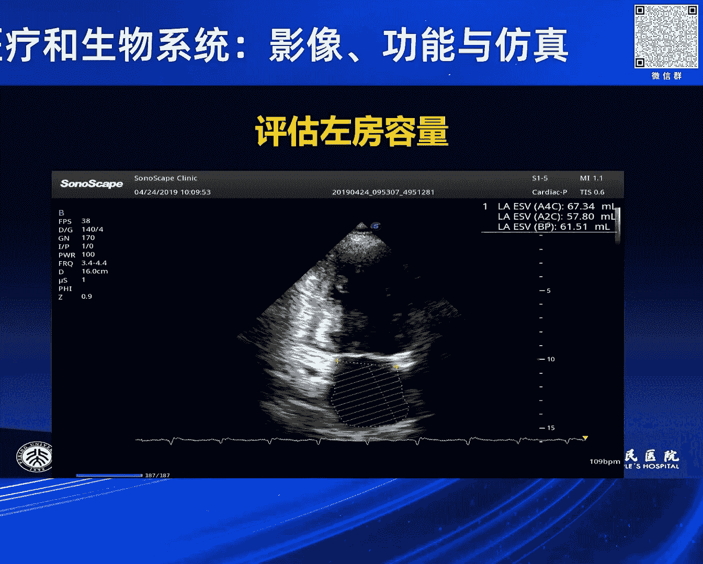
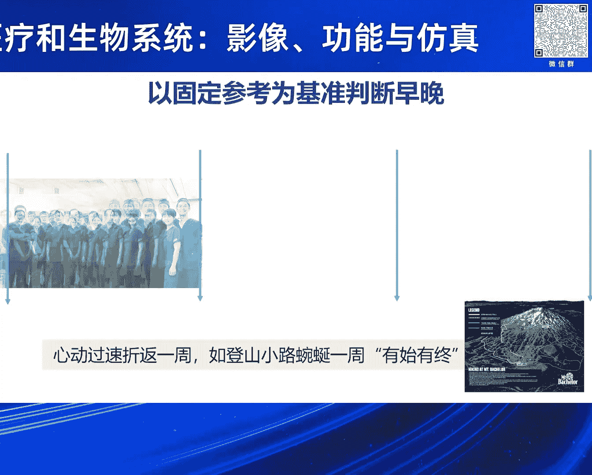
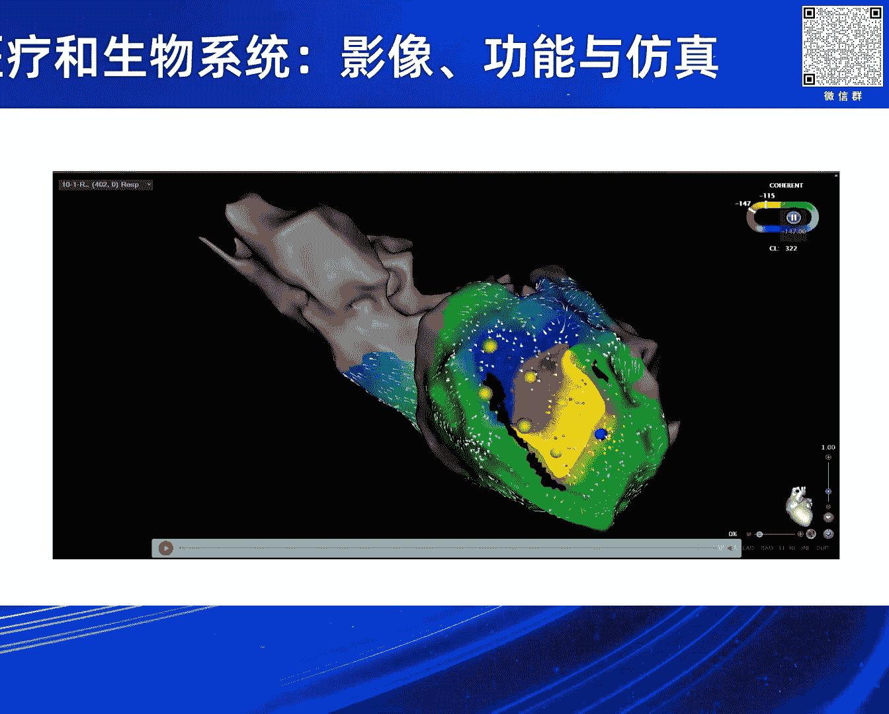
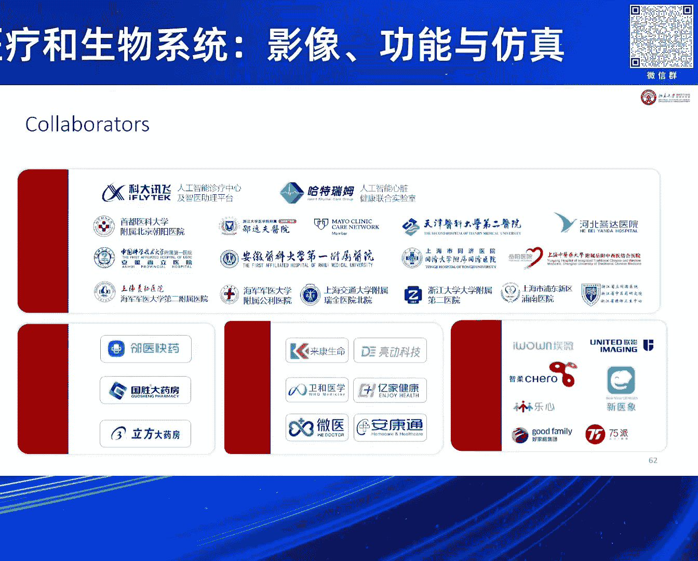
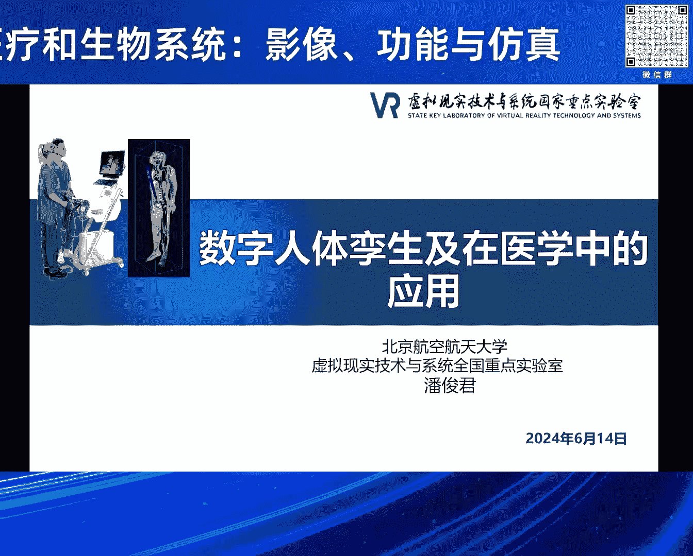
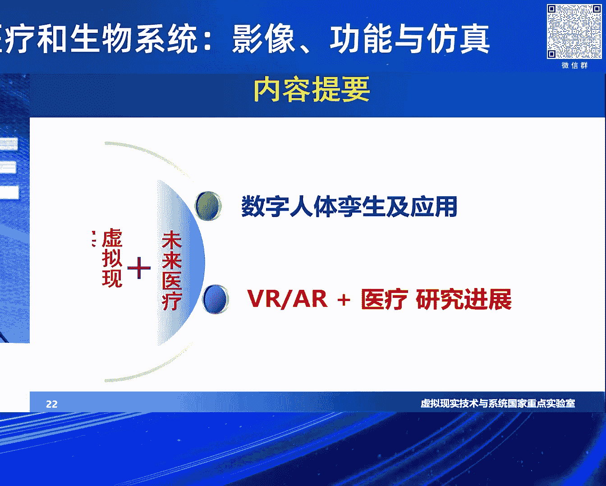

# 2024北京智源大会-智慧医疗和生物系统-影像-功能与仿真---P8-智慧医学与生命系统目前挑战与应对策略---智源社区---BV1VW421R7HV

## 概述 📘

在本节课中，我们将学习智慧医学与生命系统领域当前面临的挑战与应对策略。课程内容涵盖心脏影像学、人工智能辅助诊断、心律失常的计算机模拟、心脏医学图像智能分析、医疗时序数据处理以及数字人体孪生技术等多个前沿方向。我们将探讨如何将人工智能、大数据和计算模型与临床医学深度结合，以推动精准医疗的发展。

---

## 第一部分：超声医学人工智能辅助诊断的困惑与挑战 🩺

尊敬的各位专家，我们进入下一个专题：智慧医学与生命系统的挑战与应对策略。第一位讲者是来自北京大学人民医院的朱天刚教授。朱教授长期从事心血管疾病的临床、科研和教学工作，在顶级期刊发表论文150余篇。

朱教授的报告题目是《超声医学人工智能辅助诊断的困惑与挑战》。朱教授首先指出，当前医疗领域的数据存在“数据大”而非“大数据”的问题。他以一个体检中心的数据为例，说明大量数据因质量问题而无法有效利用。

人工智能在医学领域的应用热点主要集中在服务管理、辅助诊断和智能知识提升层面。驱动人工智能发展需要三大要素：**大数据**、**大模型**和**大算力**。

在医学影像领域，人工智能在放射科（如肺结节、肺部感染CT诊断）的应用已较为成熟。然而，在心脏诊疗场景中，检查手段（如心电图、心脏超声、CT、心肌核磁、冠脉造影等）往往是“铁路警察各管一段”，而心脏是一个包含电传导、机械、内分泌和管道系统的整体。理想的人工智能诊断平台需要融合这些多模态数据。

目前，国内外医学影像AI公司主要集中在放射科和病理领域，致力于心脏超声AI研究的公司较少。心脏超声AI的发展面临诸多挑战。

以下是心脏超声AI面临的主要挑战列表：
*   **图像数据量大**：超声影像数据存储需求巨大，曾导致医院服务器过载。
*   **流程与标准不统一**：不同医院、不同医生的图像采集流程、测量参数和报告格式差异很大，缺乏统一标准。
*   **数据质量与标注**：缺乏高质量、标准化的图像标注数据集，数据同质性差。
*   **算法与模型局限**：不同疾病需要不同的计算模型，现有模型的泛化能力和结果可解释性有限。
*   **临床数据整合困难**：单一影像数据不足以支撑复杂疾病的诊断，需要整合临床、检验等多源数据。

面对这些挑战，朱教授提出了未来的发展方向：推动工作流程、数据获取和图文报告的标准化与规范化。同时，开发不依赖心电图、能自动识别心脏周期并进行内膜勾画的技术，以适应中国临床高效的工作节奏。最终目标是构建一个融合多模态影像数据的云平台与AI大模型系统。

---

## 第二部分：计算机模拟技术在心律失常诊疗中的应用 ⚡

上一节我们探讨了心脏影像AI的挑战，本节中我们来看看计算机模拟技术在心律失常领域的应用。第二位讲者是来自北京安贞医院的龙德勇教授。龙教授主要从事心房颤动等心律失常的导管消融治疗。

龙教授的报告题目是《计算机模拟技术在心律失常诊疗中的应用》。他指出，心脏电生理研究与生物电原理相同。心电图是诊断心律失常的主要工具，它反映了心脏电活动的时间和空间向量。

人工智能在心电图分析领域展现出巨大潜力。它不仅能进行快速准确的房颤识别，还能通过一份心电图预测患者的性别、体型甚至未来数年发生房颤或猝死的风险。国内已有团队证明，AI读心电图的水平可以超过心电图医师。

在心律失常机制研究方面，计算机模拟技术至关重要。例如，折返（reentry）是许多心动过速的机制，其概念最早便来源于计算机模拟。通过将密集电极置于心脏表面，可以重建心脏的等势图，分析电激动的顺序，这类似于分析地形图或气象图。

以下是计算机模拟与AI在电生理领域的应用方向列表：
*   **体表心电图深度分析**：超越传统参数，实现疾病预测与风险分层。
*   **腔内电信号标测**：利用导管电极和计算机技术，重建心脏三维激动顺序，精准定位心律失常起源。
*   **三维导航系统**：基于磁场或电场定位原理（类似GPS），构建心脏三维模型，实现无X射线的精准手术。
*   **智能急诊辅助系统**：开发能达到专科医生水平的AI系统，辅助基层医生快速诊断心律失常，降低院外猝死率。
*   **机器人导管导航**：研究磁导航等机器人技术，实现导管的精准全向运动。

龙教授总结道，医生非常希望拥抱计算机和人工智能技术，这在医疗领域有巨大的应用前景，未来有望替代许多急诊和门诊的初级工作。

---

## 第三部分：多病理阶段心肌缺血的多尺度建模与药物作用机制研究 🔬

上一节我们了解了心律失常的计算机模拟，本节我们将深入细胞和分子层面，探讨心肌缺血的仿真建模。第三位讲者是来自哈尔滨工业大学的李清策研究员。李研究员致力于利用计算科学方法解决生物医学问题。

李研究员的报告题目是《多病理阶段心肌缺血的多尺度建模与药物作用机制研究》。心肌梗死或缺血的发展包含多个阶段（如缺血早期、晚期、短期心梗、长期心梗），不同阶段心肌细胞的生理功能不同。

研究团队通过多尺度建模方法来研究其机制：首先从心肌细胞离子通道的生理功能出发，用数学模型描述其电活动；然后整合缺血病变过程中的各种生物化学变化因素；最后将细胞模型扩展到组织和整个心脏层面，仿真电信号的传导。

通过构建包含多病理阶段的心脏电生理模型，并在二维、三维组织以及真实心脏几何上进行仿真，他们成功模拟了心肌缺血后折返性心律失常（如螺旋波）的产生过程。分析发现，即使在没有结构性传导障碍的情况下，由于缺血区域细胞兴奋性改变与快速刺激的共同作用，也可能引发折返。

基于此模型，团队进一步筛选抗心律失常药物的作用靶点。他们测试了胺碘酮等多靶点药物，发现其在缺血条件下效果不佳。通过敏感性分析，他们找到了几个关键靶点，并发现降糖药**格列苯脲**（通过作用于IKATP通道和降低细胞外钾浓度）在仿真中表现出优秀的抗心律失常效果，这为药物新用途的发现提供了线索。

---

## 第四部分：心脏医学图像智能分析方法研究 🖼️

前面我们讨论了生理仿真模型，本节我们聚焦于医学影像本身的人工智能分析方法。第四位讲者是来自哈尔滨工业大学的王宽全教授。王教授团队主要从事计算心脏学和医学图像分析研究。

王教授的报告题目是《心脏医学图像智能分析方法研究》。心脏影像分析是AI在医疗领域的重要应用方向，涉及超声、核磁共振（MRI）、CT等多种模态。

王教授团队在多个心脏结构（心室、心房、冠脉）的影像分析上取得了系列成果。在心脏MRI方面，他们研究了左心室自动检测、无需分割直接估计心室容积和射血分数的方法，以及左心房的高精度分割和图像配准技术。

在心脏超声方面，他们开发了三维左心室分割的半监督学习框架，将先验图谱知识集成到模型中，提升了在有限标注数据下的分割性能。

在冠脉CTA分析方面，他们利用强化学习技术自动追踪冠脉中心线，并采用Transformer与卷积网络融合的模型，自动检测和定量分析冠脉狭窄程度。

在血管内光学相干断层成像（OCT）方面，他们实现了斑块的自动跟踪和导管伪影的去除。这些工作大多已开源，并集成了可用的系统平台，推动了心脏影像AI向临床应用的转化。

---

## 第五部分：医疗时序数据的人工智能算法及其应用 ⌚

从影像回到信号，本节我们关注另一类重要的医疗数据——时序数据。第五位讲者是来自北京大学的洪申达教授。洪教授的研究方向是医疗时序数据的人工智能算法及其在临床和可穿戴设备中的应用。

洪教授的报告题目是《医疗时序数据的人工智能算法研究及其在临床和智能可穿戴的应用》。心电信号（ECG）是典型的医疗时序数据，具有无创、一致、稳定的特点，有望成为进入千家万户的健康监测手段。

人工智能正在拓展心电信号分析的边界。传统方法主要分析波形特征诊断心律失常，而基于深度学习的AI模型能够从心电信号中挖掘出前所未有的信息，例如预测左心室功能、房颤风险、甚至全因死亡风险。

洪教授团队在算法层面进行了多方面探索：开发了灵活的心电信号专用卷积神经网络骨架；研究了结合专家特征的模型、适用于小数据的自监督学习算法；并探索了心电信号与大语言模型的对齐，实现零样本学习和报告生成。

团队致力于将算法转化为实际应用：开发了获得医疗器械注册证的单导联心电仪和长程心电监测设备；在设备上集成了心室功能评估、心脏年龄预测、阵发性房颤管理等多种创新功能。他们的目标是让已有百年历史的心电图技术重新焕发活力，弥补院外健康管理的空白。

---

## 第六部分：数字人体孪生及其在医学中的应用 👤

最后，我们将视角从单个器官或系统提升到整个人体。第六位讲者是来自北京航空航天大学的潘俊君教授。潘教授的研究方向是虚拟现实、计算机动画和手术导航。

潘教授的报告题目是《数字人体孪生及其在医学中的应用》。数字人体孪生是通过几何、物理、生理建模，在数字空间中构建的真实人体的虚拟副本，是虚拟现实技术在医学领域的高级目标。

数字人体可以从抽象层次（几何、物理、生理、智能人体）和空间尺度（从原子、分子、细胞到组织、器官、系统）进行构建。其终极愿景是为个体创建从微观到宏观的数字化备份，用于个性化的药物测试、手术预演，甚至延长“数字生命”。

在现阶段，数字人体孪生技术已广泛应用于医学领域：
*   **手术规划与预演**：在虚拟平台上规划手术路径、预演手术流程，提高成功率。
*   **手术训练与评价**：通过高仿真的虚拟手术模拟器训练外科医生，减少对动物和尸体的依赖。
*   **新术式研究与转化**：验证和推广新型手术技术（如经自然腔道手术）。
*   **增强现实手术导航**：将虚拟模型与真实手术视野融合，精准引导手术操作。

潘教授团队在腹腔镜手术模拟、脊柱微创手术AR导航、角膜移植手术导航等方面取得了多项成果，并实现了部分技术的产业化转化，体现了虚拟现实与医学紧密结合的巨大价值。

---

## 总结 🎯

本节课中，我们一起学习了智慧医学在心脏与生命系统领域的前沿进展与挑战。我们从朱天刚教授那里了解到心脏超声AI面临的标准化、数据整合等现实困境；跟随龙德勇教授探索了计算机模拟在揭示心律失常机制和辅助精准治疗中的作用；通过李清策研究员的工作，看到了多尺度建模在理解疾病机制和发现药物新靶点方面的威力；在王宽全教授的分享中，领略了AI在心脏多模态影像分析中的强大能力；洪申达教授向我们展示了如何将心电AI算法落地到可穿戴设备，服务院外健康管理；最后，潘俊君教授为我们描绘了数字人体孪生这一未来医学的宏伟蓝图。

这些报告共同揭示了一个趋势：智慧医学的发展需要医学专家与人工智能、计算科学、工程学等领域的研究者紧密协作，共同攻克数据、算法、模型和临床转化中的难题，最终实现从疾病诊断、机制理解到治疗规划、健康管理的全链条智能化，造福人类健康。