# 2024北京智源大会-智能驾驶---P2-AI深度赋能-长安智驾落地的实践与思考-梁锋华---智源社区---BV1Ww4m1a7gr

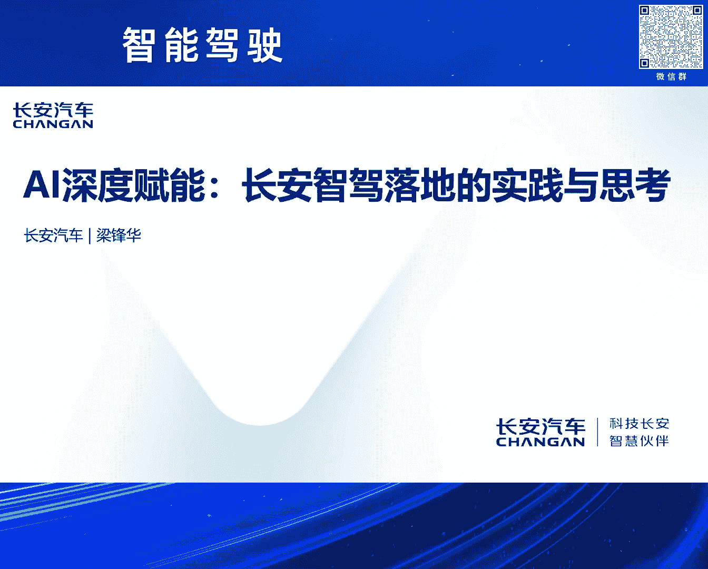

## 课程概述

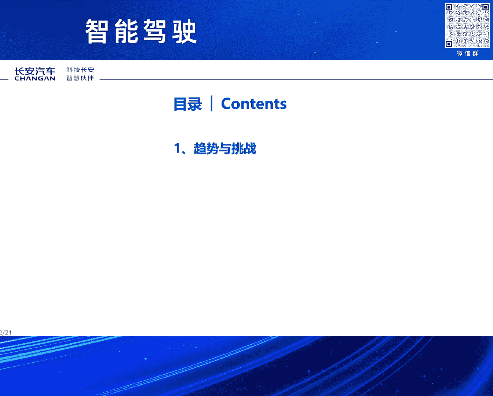

在本节课中，我们将学习智能驾驶技术的发展趋势、行业面临的挑战，以及长安汽车在智能驾驶领域的落地实践与思考。课程内容基于长安汽车梁锋华先生在2024北京智源大会上的分享整理而成。

---

## 第一部分：智能驾驶的趋势与挑战

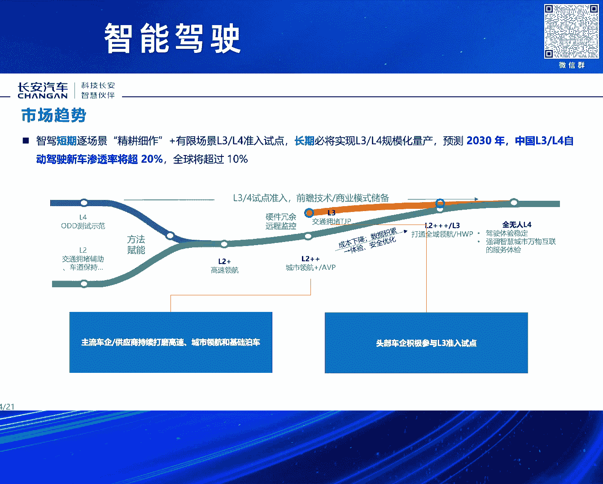

智能驾驶整体上是一个场景持续演进的过程。它主要从两个维度展开：一是场景的持续覆盖，二是功能等级从“可用”到“好用”再到“等级提升”的持续进步。

### 场景覆盖的演进路径

以下是智能驾驶场景覆盖的主要演进方向：

*   **从简单到复杂**：技术首先应用于简单的驾驶环境。
*   **从高频到低频**：优先解决用户最高频使用的场景。
*   **从单车道到全场景**：具体路径为：**单车道 -> 高速公路 -> 城区道路 -> 停车场**。

当前，行业在场景覆盖上已进入后期阶段，尤其是以城区领航为代表。现在行业进入了“精耕细作”的阶段，主要围绕两个核心：

1.  **持续提升用户体验**，以建立用户对系统的信任感和购买意愿。
2.  **不断提升安全性**，这是智能驾驶最关键的基石。

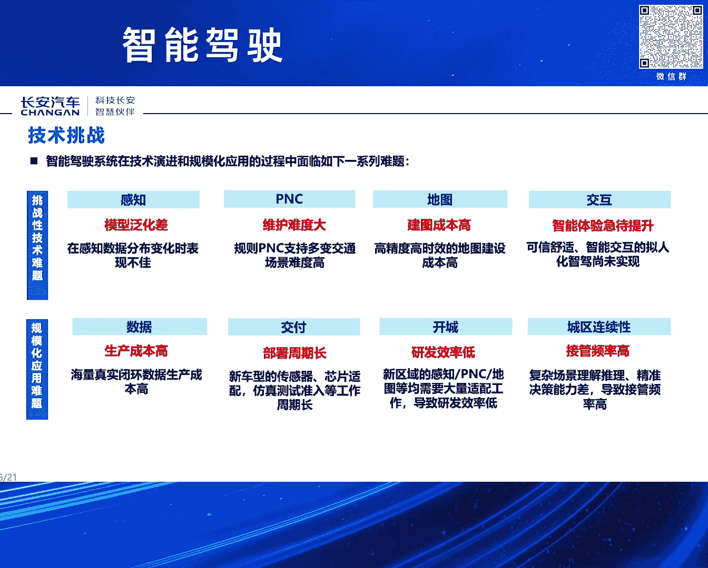

随着这些问题被解决，高等级自动驾驶（L3级以上）的商业化已进入前夜，其典型标志是智能网联汽车的准入试点。

### 用户需求与行业现状

从用户需求侧观察，智能驾驶的渗透率正在快速提升。这体现在两个维度：一是用户基数在扩展（L2级功能正成为标配），二是用户的实际使用时长和月活跃度在快速提升。

数据显示，单用户的平均月活相比2021年已翻倍。同时，对于车企而言，用户总使用时长的增长是数量级的变化。这庞大的用户体量对智能驾驶的安全和体验提出了更高要求，也让开发过程“如履薄冰”。

### 技术层面的核心挑战

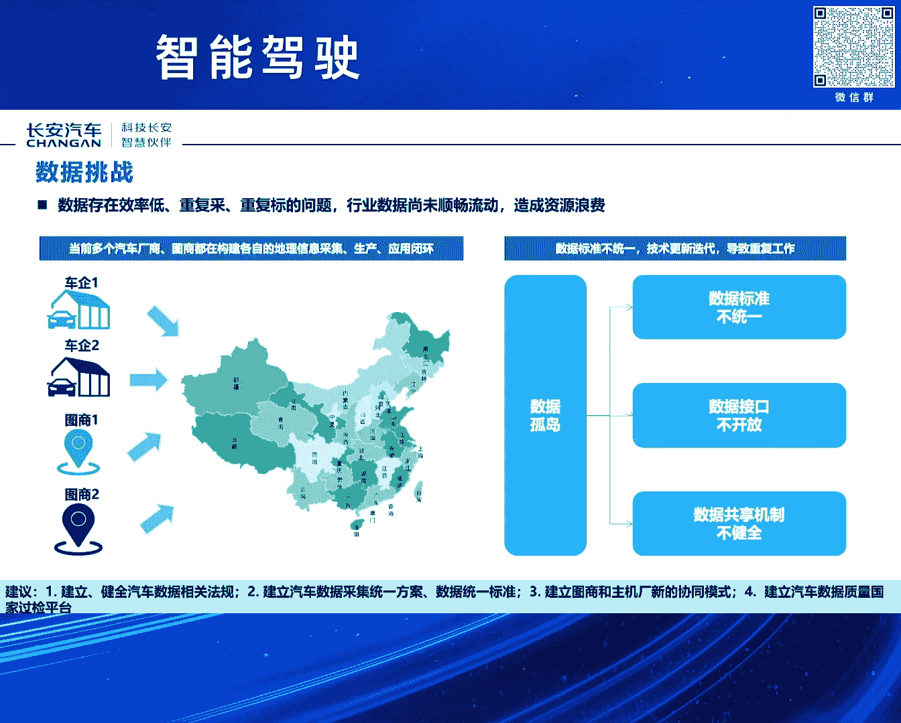

当前主流的“经典智能驾驶”路线在技术上面临诸多挑战：

*   **模型泛化能力**：AI模型处理复杂、罕见场景的能力有限。
*   **规控（PNC）维护难度**：传统规划与控制算法需要针对大量特殊案例（Corner Case）逐一解决，效率低下。
*   **高精地图成本**：制作与维护高精度地图的成本高昂。
*   **拟人化程度**：系统驾驶风格与人类习惯的贴合度有待提高。
*   **数据难题**：包括数据采集、标注生产成本高，效率低。
*   **研发与部署效率**：整体研发和将算法部署到车端的效率需要提升。

### 数据、地图与成本问题

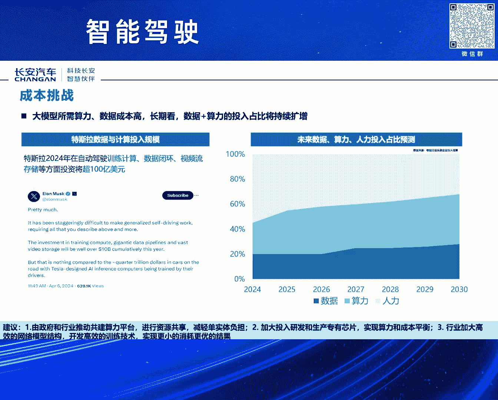

数据是当前行业的巨大痛点。数据生产效率低，存在重复采集和标注问题。数据之所以尚未成为真正的“资产”，核心在于标准不统一导致数据无法在行业间流动和复用。

我们希望国家能完善数据法规、统一标准，并发挥国家级数据平台的作用，尤其在解决长尾场景问题时，行业协同至关重要。

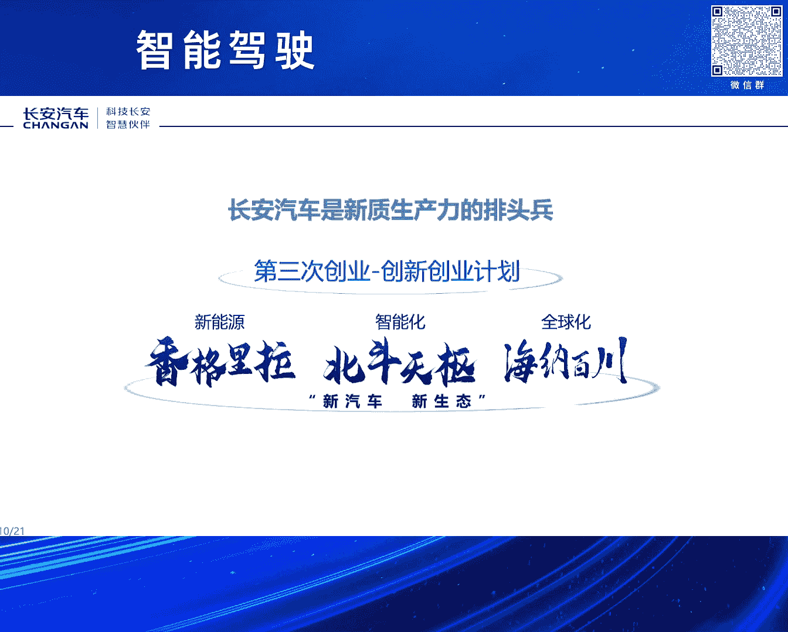

在地图方面，需要建立图商与整车厂之间的新型协同模式。车企拥有天然的车辆数据采集能力，应将其价值发挥出来，以提升地图鲜度并降低成本。

在成本结构上，**人力（算法）、算力、数据**是三大成本中心。目前，人力成本占比在下降，而算力和数据成本持续扩大。行业需要在专用芯片、算力平台共建以及更高效的算法上共同努力，推动成本优化。

---

上一部分我们探讨了行业面临的普遍挑战，接下来我们看看长安汽车是如何应对这些挑战并推进技术落地的。

## 第二部分：长安汽车的智能驾驶实践

长安汽车自2017年启动“第三次创业——创新创业计划”，并持续迭代至7.0版本。公司核心战略包括“香格里拉”新能源战略、“北斗天枢”智能化战略和“海纳百川”全球化战略，旨在构建“新汽车、新生态”。

### 发展里程碑与自研历程

长安在智能驾驶领域取得了多项里程碑：

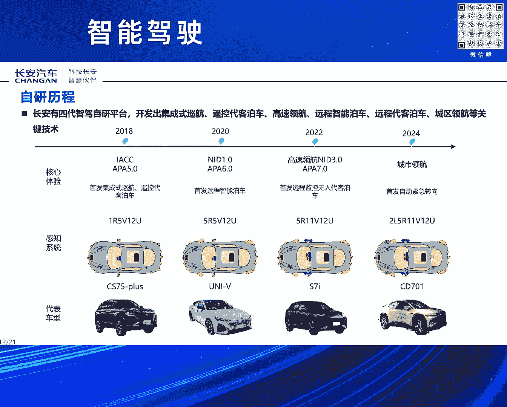

*   进入首批L3级智能网联汽车准入试点。
*   牵头制定了《汽车驾驶自动化分级》国家标准（2021年版）。

在自研方面，长安已完成四代智能驾驶平台的研发：

1.  **第一代（2018年）**：实现**L2级辅助驾驶**，首发集成式自适应巡航（IACC）与遥控代客泊车（APA）。
2.  **第二代（2020年）**：推出**NID 1.0**高速公路辅助驾驶系统，并全球首发量产远程智能泊车系统。
3.  **第三代（2022年）**：量产**高速领航（NID）** 与**远程代客泊车（AVP）** 系统。**此系统具备L3级能力**，是本次准入试点的基础。该平台创新性地采用了**预碰撞安全系统**，为极限工况提供安全保障。
4.  **第四代（研发中）**：**SDA高阶智能驾驶平台**，旨在彻底解决城市领航等全场景问题，计划于今年量产。

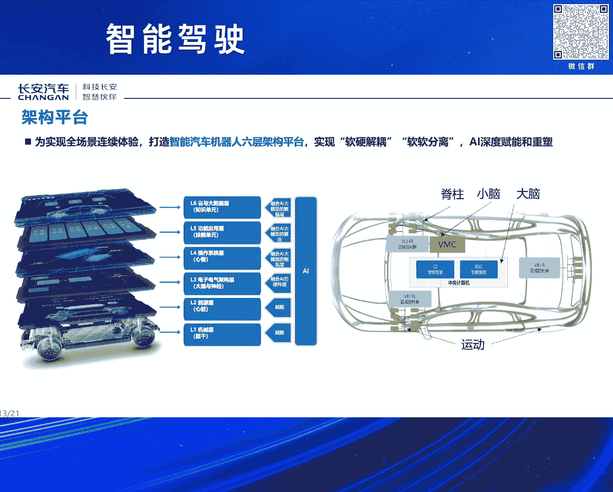

长安的自研比例持续提升，从第三代平台开始，核心算法已全部由长安自主开发。

### 技术架构与算法能力

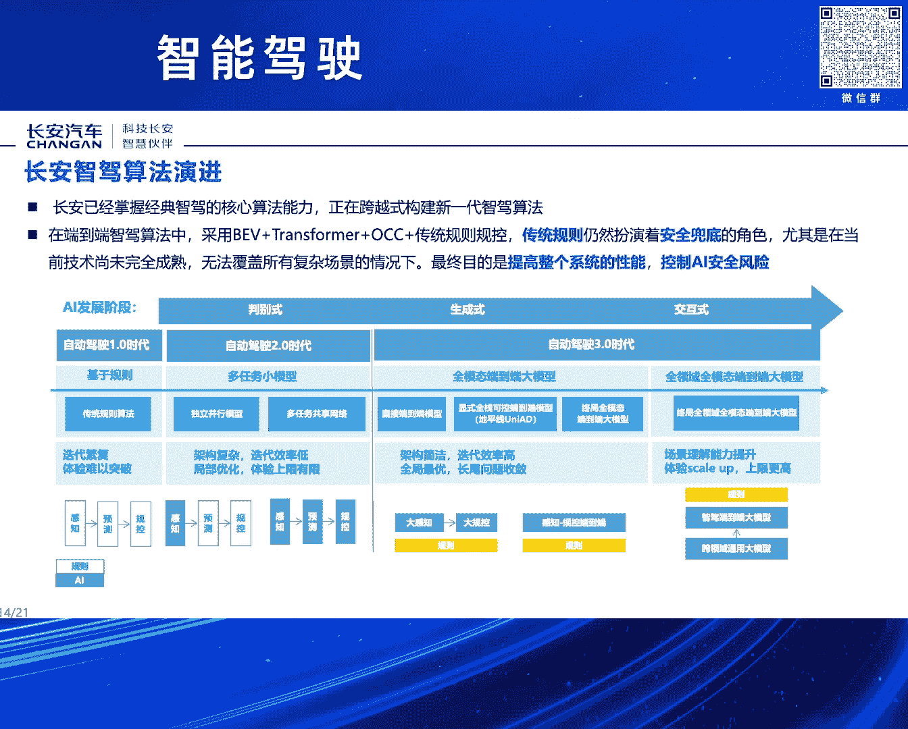

智能驾驶必须基于优秀的整车架构。长安打造了面向“未来智能机器人”的六层架构平台：

*   **L1 机械层**：对应车辆的物理执行机构。
*   **L2 能源动力层**：对应车辆的动力系统。
*   **L3 电子电气架构与硬件**：对应车辆的“神经网络”和硬件基础。
*   **L4 操作系统**：对应车辆的“小脑”，负责底层调度。
*   **L5 应用算法层**：对应车辆的“大脑”，承载智能驾驶等核心算法。
*   **L6 云端大数据层**：对应车辆的“云端智慧”，用于持续学习和进化。

在算法上，长安已掌握经典智能驾驶所需的全套核心算法，并正在跨越式构建以**端到端智能驾驶**为特征的新一代算法。我们认为，在可见的未来，经典架构与端到端架构将并存，经典架构主要负责保障系统性能的“下限”安全。

长安的算法实力也通过国际赛事得到验证，例如曾在UCS榜单获得第一，并在2024年CVPR会议上的端到端大模型赛道获得创新奖。

### 数据闭环与测试验证体系

长安建立了相对完备的数据闭环体系，通过自动化工具提升数据挖掘、4D-BEV数据产线、自动标注等环节的效率，其中静态真值自动化效率提升了95%。

在测试验证方面，长安构建了新的测试体系以确保安全可靠，其核心包括多支柱协同测试策略和系统性能安全模型。重庆复杂的“8D”城市交通环境为长安提供了天然的、高效的测试场地。同时，体系引入了 **UN R157法规中的驾驶员模型**，用于对自动驾驶系统进行标准化的性能安全评估。

### 安全与体验评价体系

安全是智能驾驶稳健落地的基石。长安构建的新安全体系旨在实现 **“全车全生命周期”** 和 **“复杂人机耦合系统”** 的伴生安全。这意味着安全不仅仅是智能驾驶系统本身的安全，更是与整车结构安全、功能安全、预期功能安全、网络安全一体化的系统工程。长安已获得多项相关体系认证（如ASPICE、功能安全ASIL D等）。

在体验评价上，核心是让系统驾驶比人更安全、更舒适、更符合人类习惯。长安将评价指标客观化、工具化、自动化，让系统能够自我评估，以持续提升用户体验。

### 开放合作的理念

智能驾驶是一个超级系统工程。长安坚持开放、互信、共赢，与全球伙伴开展“产品合伙、技术合伙、前沿合伙”等多领域深度合作，包括联合开发、数据共享与标准统一等，以期降低行业整体成本，共同推动技术进步。

---

## 课程总结

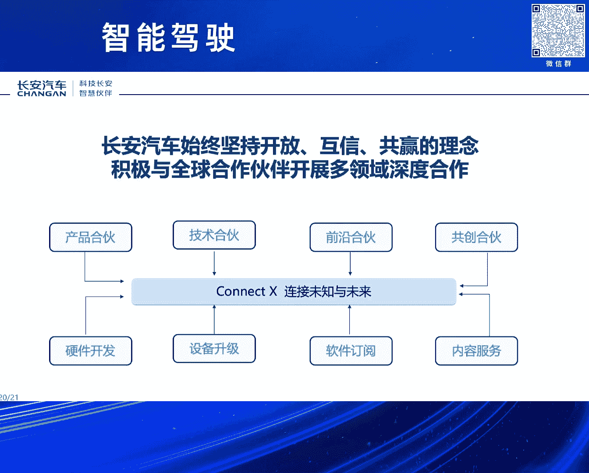

本节课我们一起学习了智能驾驶从场景覆盖到等级提升的发展趋势，剖析了行业在数据、成本、技术泛化等方面面临的挑战。同时，我们也深入了解了长安汽车在智能驾驶领域的自研历程、技术架构布局，以及在数据闭环、测试验证、安全体系构建和开放合作方面的具体实践。智能驾驶的发展道阻且长，需要产业链上下游的共同努力与深度协同。