# 2024北京智源大会-智能驾驶---P3-小鹏汽车AI大模型量产实践-马-君---智源社区---BV1Ww4m1a7gr

## 概述

在本节课中，我们将学习小鹏汽车如何将AI大模型技术应用于智能驾驶的量产实践。课程将探讨AI大模型为汽车行业带来的历史性机遇、面临的核心挑战，以及小鹏汽车在感知、规划、座舱等领域的实际落地案例与技术架构。

---

## AI大模型：汽车行业的历史性机遇

上一节我们介绍了课程的整体框架，本节中我们来看看AI大模型为何被视为汽车行业的重大机遇。

AI大模型成功的实质是**技术驱动市场**。回顾科技发展史，工业革命等重大变革均由技术驱动，而非市场预先感知。以ChatGPT和Sora为代表的AI大模型技术正展现出类似的颠覆性潜力，其发展速度日新月异。

目前，几乎所有科技巨头都已进入AI大模型领域。更重要的是，大模型正在从云端走向用户终端。例如，Apple Intelligence的出现标志着大模型开始与用户日常使用的设备（如手机）深度集成。考虑到汽车是个人与家庭最重要的移动终端之一，AI大模型在手机行业的爆发式发展，预计也将在汽车行业快速复制。

从国家层面看，AI大模型也受到高度重视，相关示范应用正在推进，标准体系开始建设。这为技术落地提供了良好的宏观环境。

---

## AI大模型赋能智能驾驶的核心价值

上一节我们探讨了宏观机遇，本节中我们聚焦于智能驾驶这一具体领域，看看AI大模型能带来哪些根本性改变。

AI大模型带来了走向**全场景无人驾驶**的历史性机遇。原因如下：

1.  **技术特征契合**：大模型的核心技术，如**自回归、基于提示词和上下文的理解、长序列注意力机制**等，与人类司机的观测和决策行为模式高度相似。这为其迁移到自动驾驶场景提供了天然优势。
2.  **智能涌现能力**：大模型具备“智能涌现”的特性，即能产生超越预设规则的、更优的解决方案。在智能驾驶中，这意味着车辆可能做出更拟人、更巧妙的操作。
3.  **学术与工程基础**：目前，AI大模型在自动驾驶领域已有优秀的学术成果（如相关CVPR最佳论文）和企业的量产探索，证明了其落地的可行性。

---

## AI大模型车载量产的六大挑战

前景虽然美好，但将庞大的AI大模型部署到资源有限的车载系统上面临严峻挑战。上一节我们看到了价值，本节我们来剖析必须克服的困难。

将AI大模型成功应用于汽车，必须满足两大前提：**前装量产**与**全链条应用**。具体挑战可分为以下六点：

以下是实现**前装量产**必须解决的三大工程挑战：

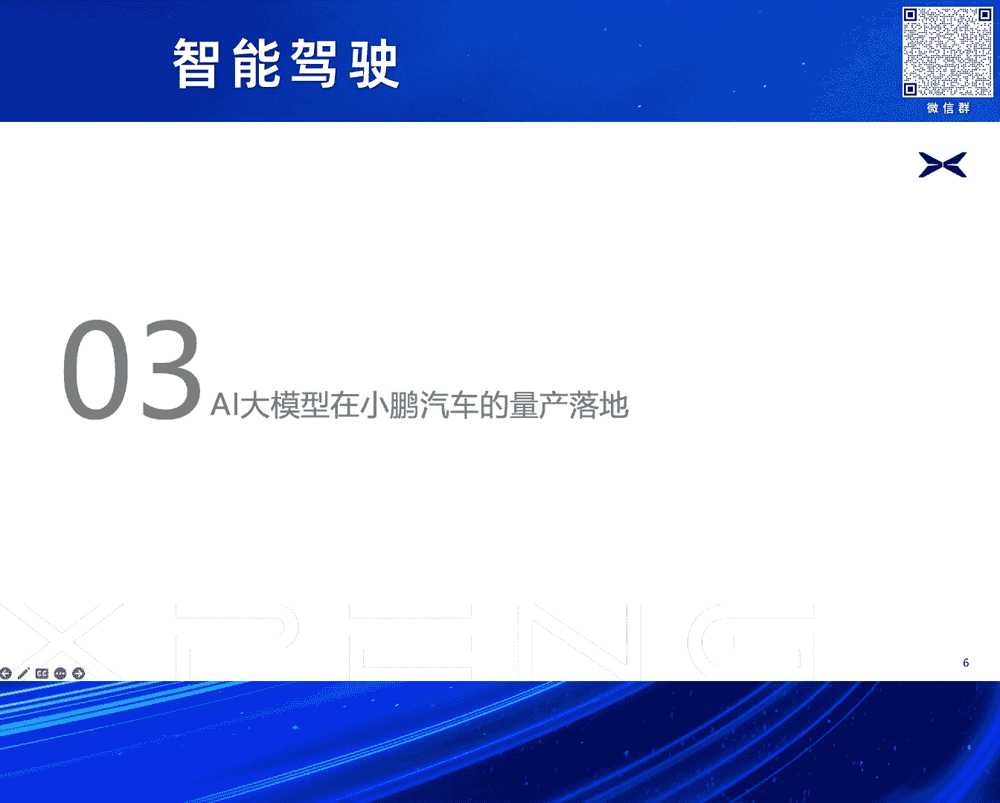

1.  **有限车规算力的适配与优化**：车载芯片和域控制器的算力与云端服务器相比非常有限。必须对AI大模型进行裁剪和优化，以适应车规级硬件。
2.  **先进网络的车端部署适配**：大模型的复杂网络结构和算子（operator）需要在车端硬件上得到支持，并满足严格的延迟（latency）要求，这涉及大量的工程适配工作。
3.  **有限性能系统的总体调优**：车载系统是一个性能受限的整体，不仅包括AI算力（TOPS），还涉及CPU、内存带宽、传感器、各类总线（如PCIe、以太网）等。需要进行系统级的总体调优，并在成本可控的前提下做出取舍。

以下是实现**全链条全场景应用**必须构建的三大能力：

4.  **全自动数据标注**：大模型处理的是长序列视频数据，传统人工标注方式成本高昂、效率低下。必须建立高效的全自动标注能力。例如，小鹏的实践将某项标注任务从2000人年缩短至16.7人天，效率提升约**45000倍**。
5.  **高效计算训练基础设施**：训练大模型需要高效的智算中心。关键不在于单纯堆叠GPU数量（“万卡”），而在于如何通过高效的集群互联、网络优化和AI基础设施（AI Infra）建设，最大化训练效率。
6.  **自动化仿真与工程验证**：作为主机厂，必须建立自动化的仿真测试体系，并经过严格的分步骤实车验证，确保功能的安全与可靠，才能最终推向量产。

---

## 小鹏汽车的量产实践：XNet、XPlanner与XBrain

在理解了挑战之后，本节我们深入小鹏汽车的具体实践，看如何通过架构革新将大模型落地。

小鹏汽车将传统的串联式感知-规划-控制链路，进化为了基于神经网络的端到端架构，即 **XNet、XPlanner 和 XBrain** 三位一体的网络。这个架构仿生了人类司机的眼睛、大脑和小脑。

*   **XNet（感知之眼）**：基于BEV（鸟瞰图）和Transformer的深度视觉感知网络。它实现了：
    *   感知范围达**1.8个足球场**面积。
    *   支持**50+类**目标物分类。
    *   搭载占据网络（Occupancy Network），实现通用障碍物检测。

*   **XPlanner（规划之脑）**：基于大模型的路径规划网络。上线后效果显著：
    *   前后顿挫减少 **50%**。
    *   速度卡死减少 **40%**。
    *   安全接管减少 **60%**。

*   **XBrain（场景理解之脑）**：负责复杂场景与语义识别。例如：
    *   隧道、高架桥场景识别。
    *   潮汐车道、待转区、特殊路牌文字识别。

通过这三大模型的端到端协同，小鹏汽车的智能驾驶能力获得了跨越式提升。

---

## 数据驱动与持续迭代体系

模型上车只是第一步，如何让它持续学习和进化至关重要。上一节介绍了静态模型，本节我们来看动态的成长体系。

小鹏汽车构建了高效的数据驱动迭代闭环：

1.  **快速模型迭代**：可实现**两天一次**的模型迭代，预计18个月内智能驾驶能力提升**30倍**。
2.  **海量数据积累**：学习人类驾驶精华里程已超**10亿公里**，每日新增高质量Clip（视频片段）约**10万公里**。
3.  **严苛验证体系**：
    *   **实车验证**：超过 **646万公里**，覆盖全国 **1972个** 城市和区县。
    *   **仿真测试**：积累超过 **2亿公里**，并利用生成式大模型技术（如“Anything in Anything”）制造罕见Corner Case（极端场景），丰富测试场景。

---

## 量产效果展示与应用扩展

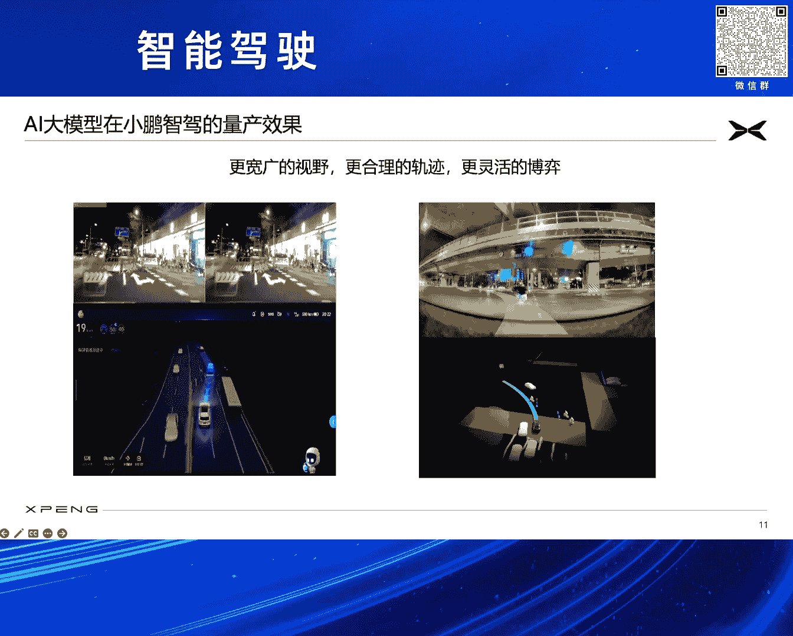

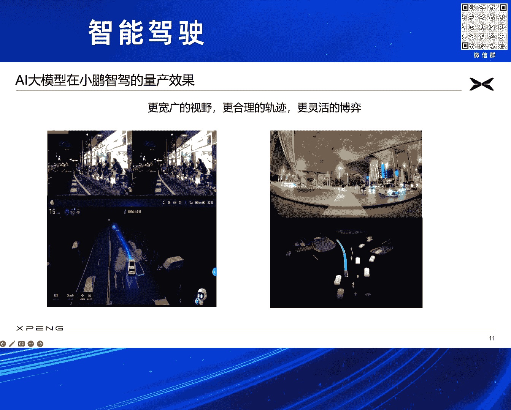

经过系统的工程化落地，AI大模型在实际道路上的表现如何？本节我们通过实例来看效果，并了解其应用范围的扩展。

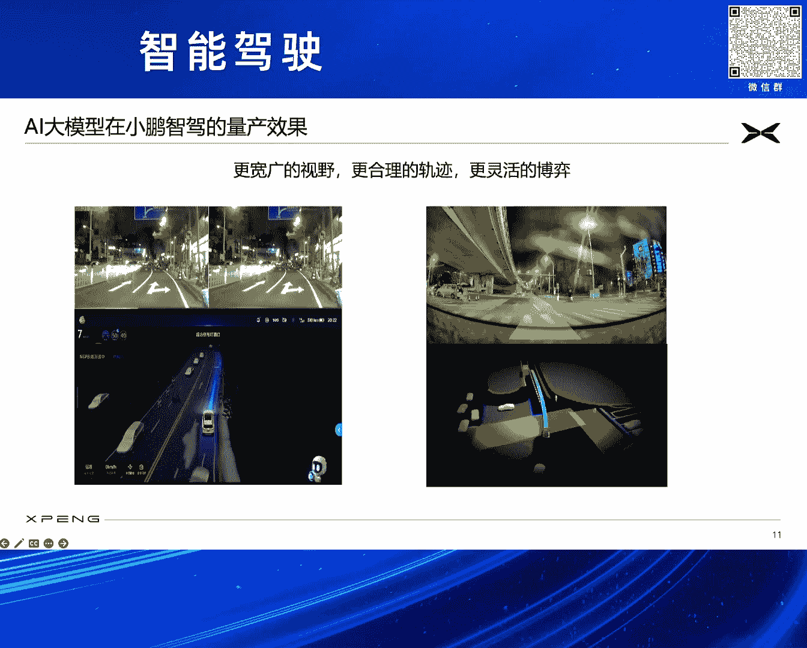

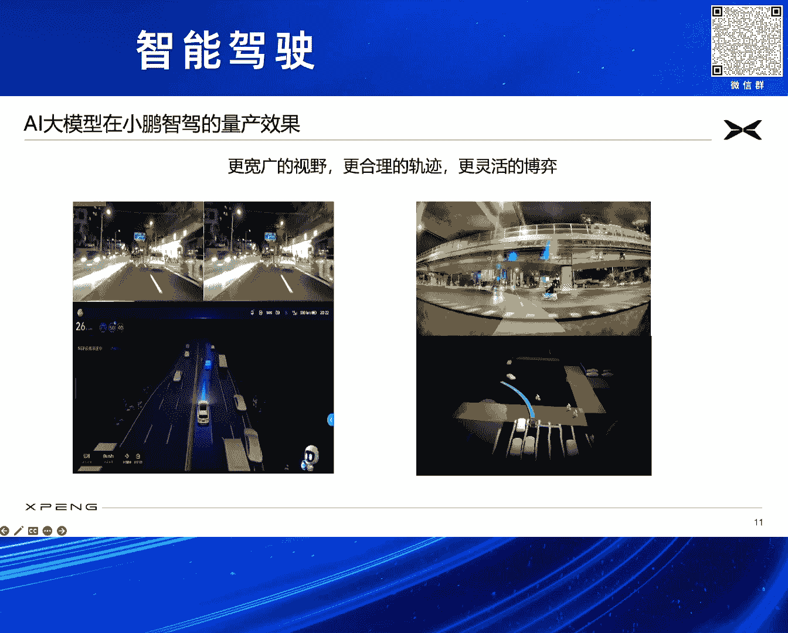

在实际量产车辆上，AI大模型系统展现出强大优势：

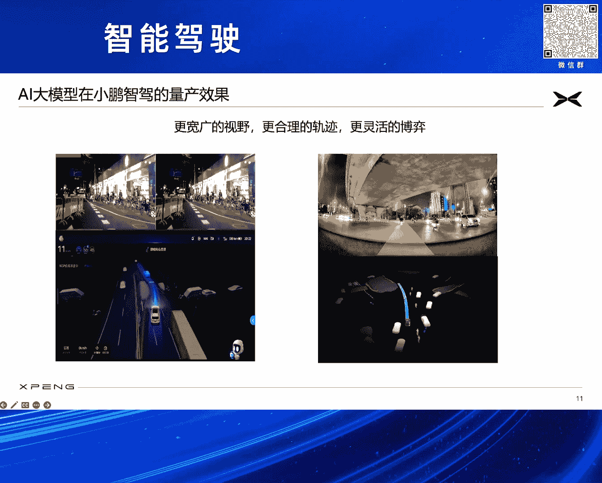

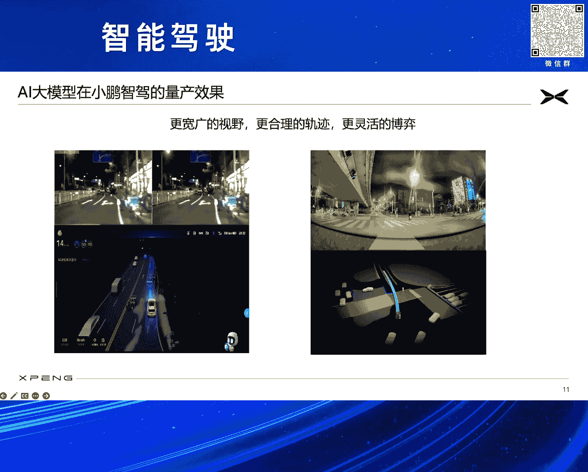

*   **复杂场景应对**：在夜间、窄路等复杂环境下，能实现360度无死角感知，精准识别动静态障碍物。
*   **拟人化规划**：在立交桥下、电动车逆行等混乱场景中，能规划出流畅、自然、拟人化的行驶路径，体现出良好的博弈能力。

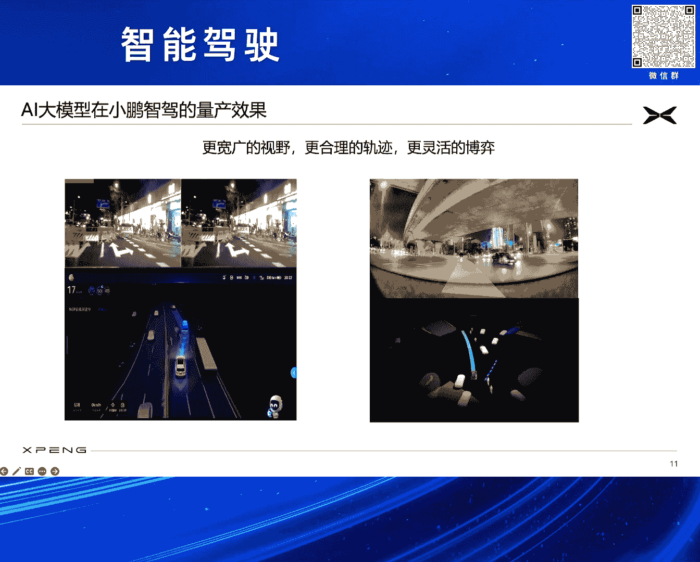

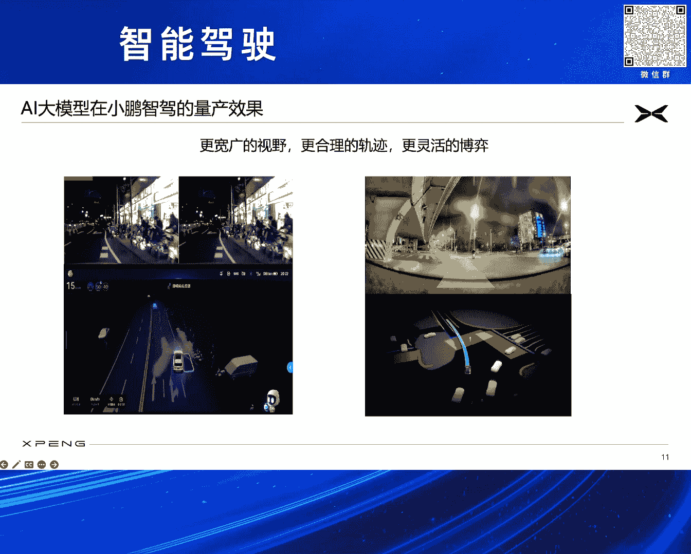

此外，AI大模型的能力已扩展到智能驾驶全场景：

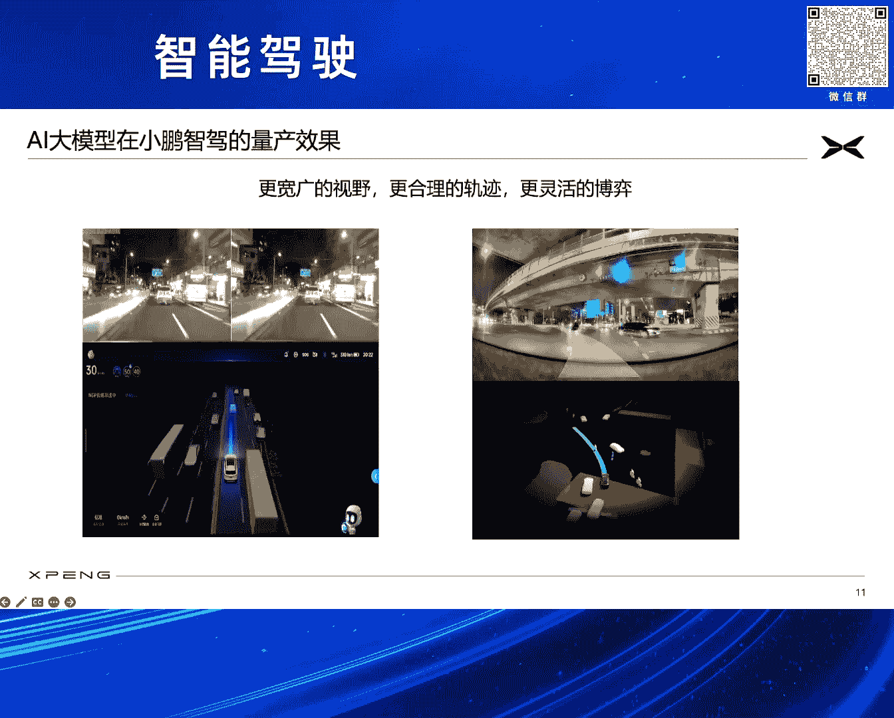

*   **AI泊车**：实现全球首个量产的离车泊入、迎宾出库功能。
*   **AI代驾**：用户可自定义路线（最多10条，每条最长100km），系统通过云端学习实现精准记忆与复现。
*   **无图XNGP**：基于大模型，计划在后续OTA中实现“全国都能开，每条路都能开”的无图高阶智能驾驶。

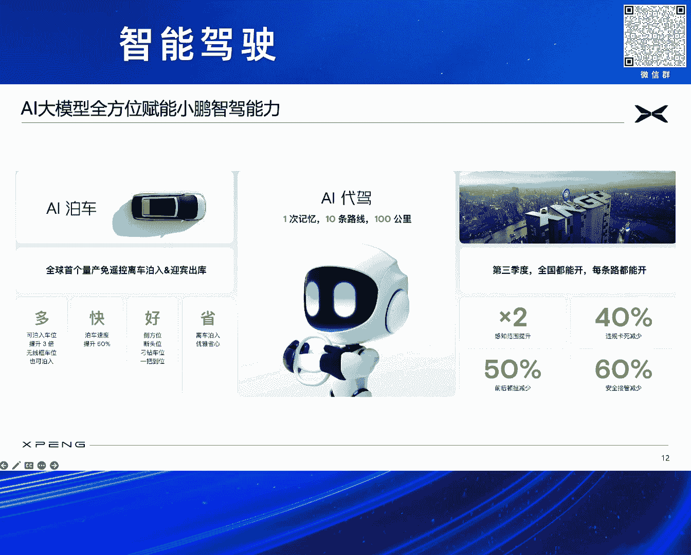

展望2025年，小鹏汽车目标是在AI大模型加持下，在中国实现**类L4级**的智能驾驶体验，并将技术推广至海外市场。

---

## AI大模型在智能座舱的应用：AI天玑

AI大模型的赋能不仅限于驾驶，也深刻改变了人车交互。本节我们看看它在智能座舱领域的应用。

小鹏汽车在最新的OTA中，发布了全球首个在智能座舱落地的**全域大语言模型**——AI天玑系统。

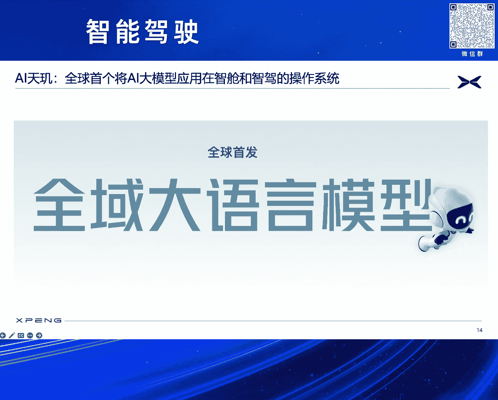

新一代的“小P”语音助手，在云端和车端大模型的共同加持下，能力得到全方位提升：
*   **用车管家**：深度理解车辆功能与状态。
*   **百科问答**：拥有丰富的知识库。
*   **内容创作**：协助用户进行文本创作。
*   **场景识别**：结合视觉感知，识别前方物体并进行提醒。

其交互更加自然、智能，能够准确理解用户的多轮、复杂指令（例如：“先去中关村，再去望京，最后到首都机场”），并直接规划路线。

---

## 总结

本节课中，我们一起学习了小鹏汽车AI大模型的量产实践全景。我们从**历史机遇**出发，分析了AI大模型为智能驾驶带来的**技术革命**，并深入探讨了车载量产面临的**六大核心挑战**。随后，我们详细拆解了小鹏的解决方案：通过 **XNet、XPlanner、XBrain** 三位一体的端到端架构实现技术落地，并依托**数据驱动**和**快速迭代**体系让系统持续进化。最后，我们看到了该技术在行车、泊车、记忆驾驶等全场景的优异表现，以及向**智能座舱**领域的成功扩展。这一切实践表明，AI大模型正成为推动智能驾驶迈向全场景、拟人化体验的关键驱动力。