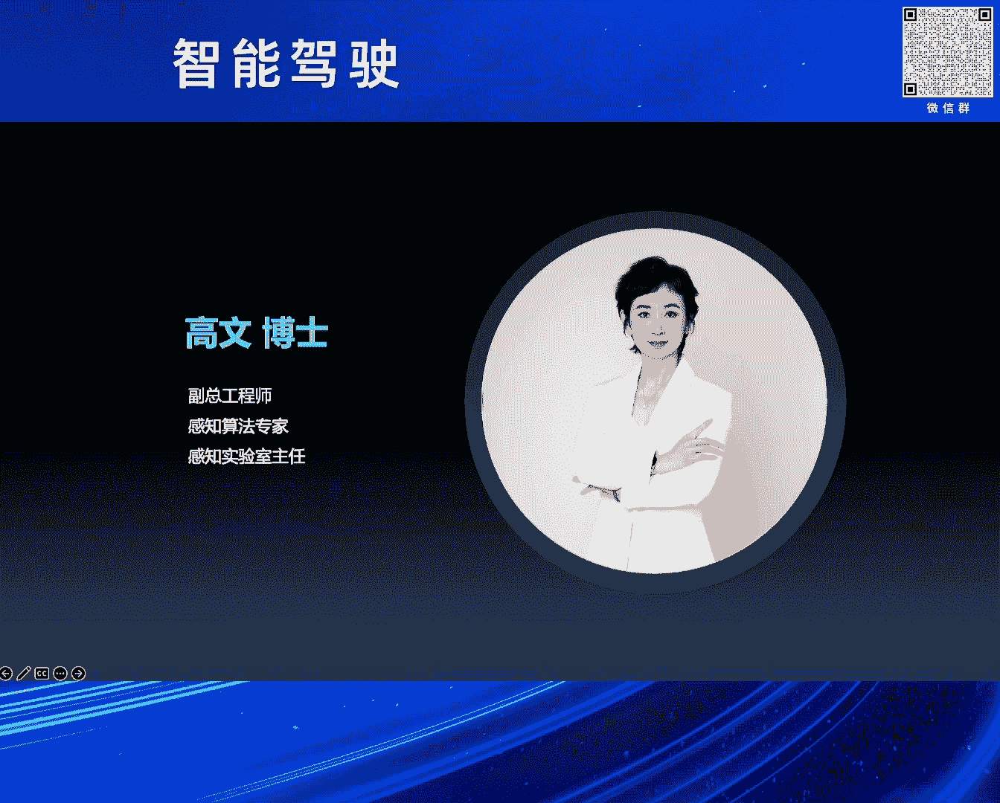
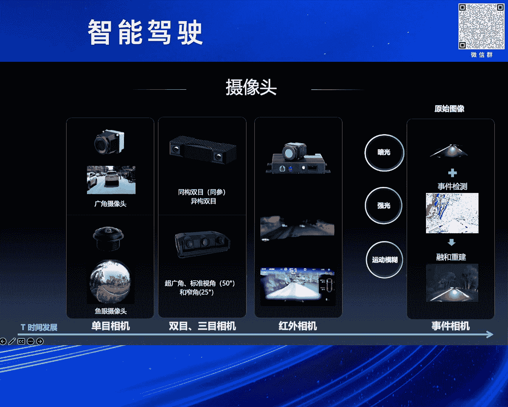
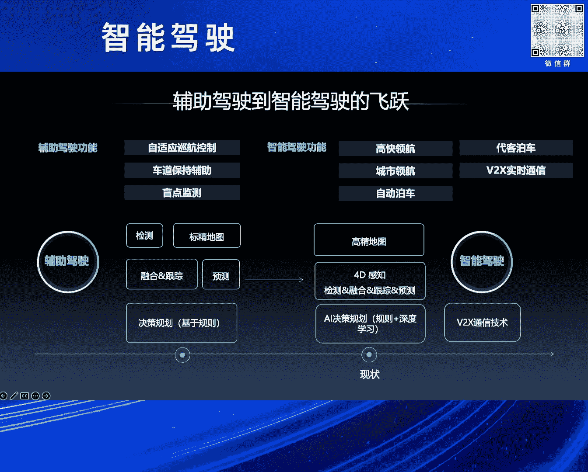
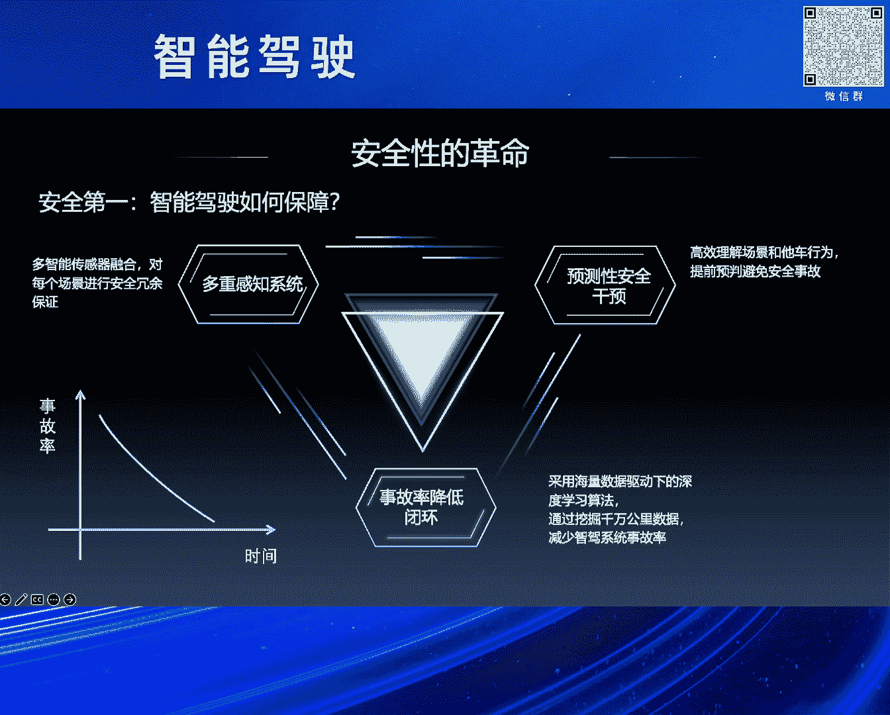
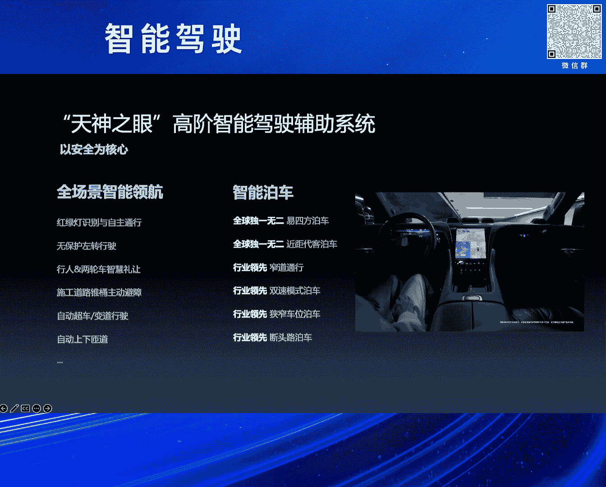

# 2024北京智源大会-智能驾驶---P4-比亚迪智驾与智舱开发工作实践-高-文---智源社区---BV1Ww4m1a7gr

在本节课中，我们将学习比亚迪在智能驾驶与智能座舱开发方面的具体实践。课程内容将涵盖感知传感技术、智能驾驶功能趋势以及智能显示应用，旨在为初学者清晰地展示智能汽车技术的发展脉络与核心概念。

## 概述

感谢刘主任的介绍和组委会的邀请。很高兴与大家在智源相聚。此前，黄教授阐述了人类完成驾驶任务的认知过程，以及大模型思维在智驾中的作用与未来展望。法旺主任同步了智能驾驶汽车产业的现状与发展方向。梁总和马总分享了长安汽车与小鹏在智驾及AI大模型方面的实践。接下来，将由我带来比亚迪在智驾和座舱开发工作方面的实践分享。

从1876年奥托发明往复活塞式四冲程内燃机，到1885年本茨发明世界上第一辆汽车，再到1886年戴姆勒成功发明世界上第一辆四轮汽车，汽车诞生之初的使命是代步工具。经过138年的发展，汽车的产品属性增加了许多，其中最重要的两个是安全和体验。其使命也转变为兼具智慧与温度的伙伴。下面我将从三个方面进行分享。

## 第一部分：感知传感

我们与车辆作为一个整体，需要感知什么？这大致可分为三个方面。

以下是需要感知的三个主要方面：
1.  **环境感知**：感知道路交通标识、障碍物、交通参与者等动静态目标，做到“看得清环境”。
2.  **自身感知**：感知自车的位置、速度、方向、姿态，以及驾驶员与乘车人的生理心理状态、动作、手势、语音、空气等，做到“看得清自己”。
3.  **物联感知**：感知实时路况、道路信息、行人信息等，实现车路云协同，“看得清交通”。

谈到感知，就必须提及传感器。以摄像头为代表的视觉传感器、GNSS和V2X定位传感器、激光雷达/毫米波/超声波雷达等雷达传感器、麦克风/压力/嗅觉等感官传感器，以及惯性测量单元、角编码器等姿态传感器，共同构成了感知传感链。

车载摄像头正从市场角、波段等多方向、多维度发展，以提升探测距离、弱光环境适应能力及动态响应速度。其技术从单目基础识别演进到双目立体测距，再集成红外成像以应对夜间场景，并引入事件相机快速捕捉动态变化，逐步增强智能驾驶的感知能力。

上一节我们介绍了视觉感知，本节中我们来看看毫米波雷达的发展。其发展可从两个里程碑角度观察。

**发展里程碑**：
*   **萌芽期（约1940年起）**：始于实验室，主要应用于军工领域。
*   **开发期（上世纪80年代起）**：各国积极投入研发，尤以欧美为主。
*   **普及期**：毫米波雷达进入应用阶段。中国起步较晚，但现已逐步实现国产化。

**技术里程碑**：
毫米波雷达共经历了七代迭代。工艺上从砷化镓到锗硅，再到CMOS的进化，性能更优，集成度更高，体积更小，重量更轻。功能上从测距、测速加水平角的3D，发展到测距、测速、水平角、俯仰角的4D，再到增加抗干扰能力的4.5D，角度分辨率越来越高，抗干扰能力也越来越强。

接下来，我们探讨另一种重要的传感器——激光雷达。激光雷达利用脉冲激光的飞行时间进行物体距离探测。

以下是激光雷达的关键发展节点：
*   **20世纪60年代**：休斯实验室研制出世界上第一台激光器。
*   **80年代**：加入了扫描机构。
*   **2005年**：在第二届DARPA无人车挑战赛上，参赛车辆出现了360度多线束旋转式激光雷达方案。七支完赛队伍中有六支搭载了64线旋转式激光雷达，激光雷达自此“一战成名”。
*   **2017年**：全球第一款车规级激光雷达（四线一维转镜方案）量产交付。
*   **2022年**：国产半固态激光雷达量产，价格逐渐下降，正向千元内迈进。

同时，激光雷达在功能上进行了细分，如前视、补盲、高线数长距等。经过20年发展，其光场生成方式与收发单元技术路线趋于收敛，但Flash固态、OPA以及FMCW等技术仍在蓬勃发展。

## 第二部分：智能驾驶功能及趋势

智能驾驶技术从定位、感知、规划到通信，都经历了全面的革新与更迭。从减少驾驶负担到逐渐释放双手，技术的每一步都向着更安全、更智能的方向迈进。智能驾驶技术以预防为主，通过全天候监控和即时响应，为用户编织一张无形的安全网。

比亚迪的DiPilot智能驾驶辅助系统，以“天神之眼”为设计理念，以安全为设计初衷。它依托先进的电子电气架构和全栈自研能力，为智驾提供整车系统级解决方案，实现整车全场景的陪伴、辅助和救助。

该系统以安全为核心，结合电机、云辇等控制技术，实现起步制动更平稳，大曲率弯道行驶更丝滑。其功能包括全场景智能领航、全球独有的易四方泊车、行业领先的窄道通行、双速泊车模式以及断头路泊车等，为用户带来极致舒适与极致安全。

行业普遍理解的L3级别相较于L2，核心区别在于安全要求是**控制冗余**。而仰望U8的易四方技术，不仅实现了控制冗余，更实现了**机械冗余**。

易四方概念车是行业首款无制动踏板、无转向柱结构、无转向电机的汽车，实现了驱动、制动和转向三合一。它首次实现了车辆在传统制动和转向系统都失效的情况下，仍具备制动和转向的能力，体现了强大的易四方机械冗余能力，超越了L3级别的冗余要求。因此，仰望U8成为全球首款具备L3技术底座的量产车。

## 第三部分：智能显示

最后，我们来看智能显示技术如何为增强安全、车内娱乐及人机交互带来新方式。

舱内显示屏从最初的仪表，演进到中控屏、副驾屏、后排屏、空调屏、车门旋钮屏等，这些主要是从用户体验出发。

而从极致安全体验出发的技术包括：
*   **透明A柱**：补充驾驶视野盲区。
*   **电子后视镜**：减少视野遮挡，增强夜视感知效果。
*   **AR-HUD（增强现实抬头显示）**：将导航等信息投影到驾驶员前视区域，避免驾驶员视线频繁切换至中控屏，降低风险。结合AI可实现导航增强显示、多功能补盲等。
*   **全息投影显示技术**：在紧急情况下，将虚拟方向盘等操作设备投影到必要位置，驾乘人员可在全息空间操控汽车，确保安全。

此外，智能显示还能让主驾、副驾及后排共享屏幕，让欢乐在家庭间传递；完美兼容手机生态，让车载应用开发更便捷，实现人-车-手机无缝互联；通过3D显示技术打造沉浸式体验，让汽车成为用户的“第三生活空间”；混合现实技术则能打破虚实边界，为用户带来前所未有的科幻感受。

## 总结

本节课中，我们一起学习了比亚迪在智能驾驶与智能座舱领域的实践。我们从感知传感技术入手，了解了环境、自身及物联感知的范畴，以及摄像头、毫米波雷达、激光雷达等传感器的发展。接着，我们探讨了智能驾驶功能的发展趋势，并以DiPilot系统和仰望U8的易四方技术为例，深入理解了安全冗余的核心概念。最后，我们看到了智能显示技术如何在提升安全与体验方面发挥关键作用。

从未来科技驶入现实，回想1995年译制片《霹雳游侠》中的KITT，它不仅无坚不摧，能说多国语言，陪伴主人公的喜怒哀乐，还能完全接管汽车进行自动驾驶，是一个兼具智慧与温度的伙伴。那时的想象，如今正通过物联网、自动驾驶、有温度的人机交互、环境感知追踪、多维感官监测与氛围提醒相结合，逐步升级为现实。

汽车不再仅仅是硬件为主的工业化产品，更是一个自学习、自进化、自成长的软硬兼备的智能化终端。心有所信，方能远行。让我们汽车人一道共同努力，创造美好的明天。