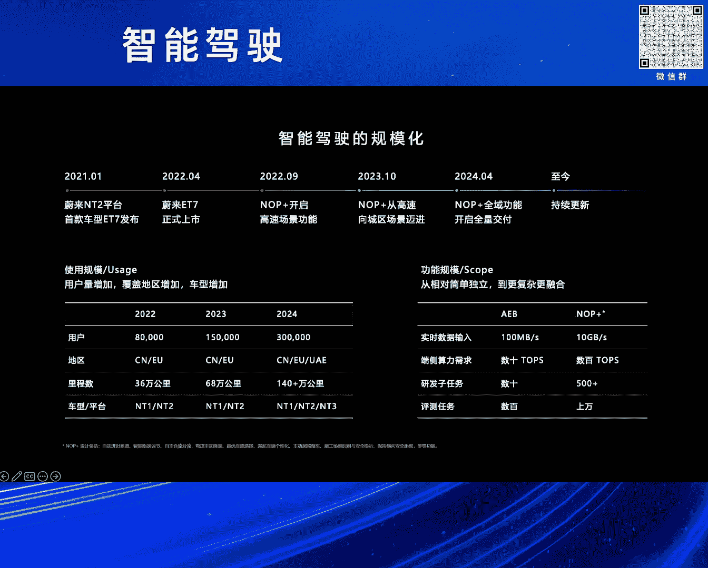
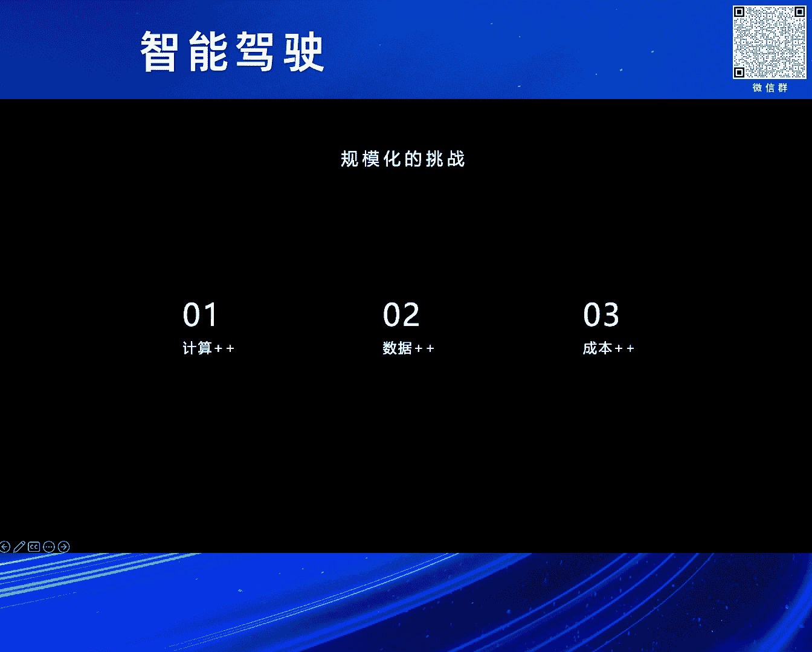
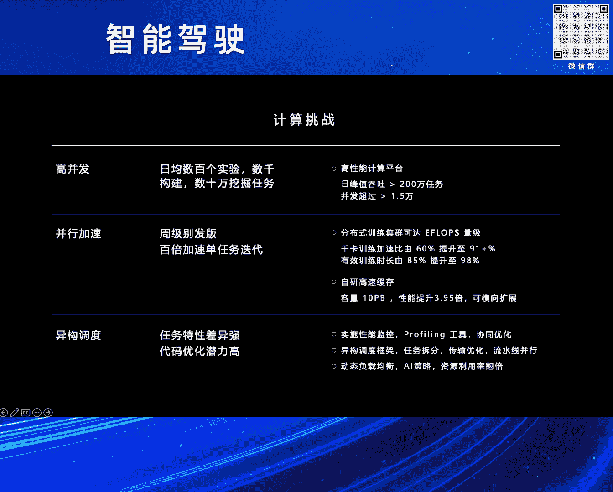
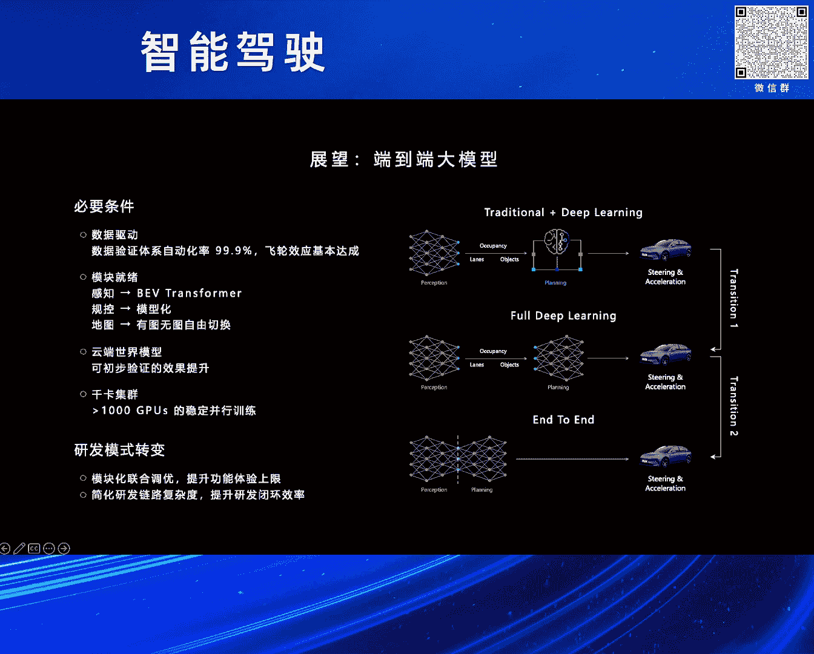
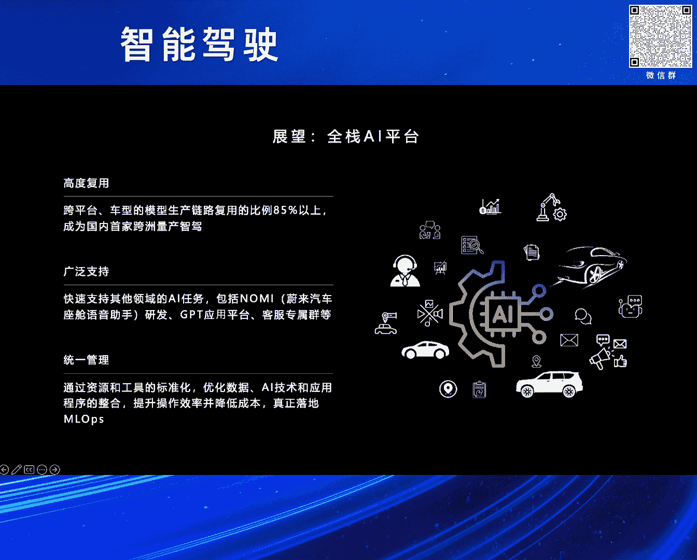
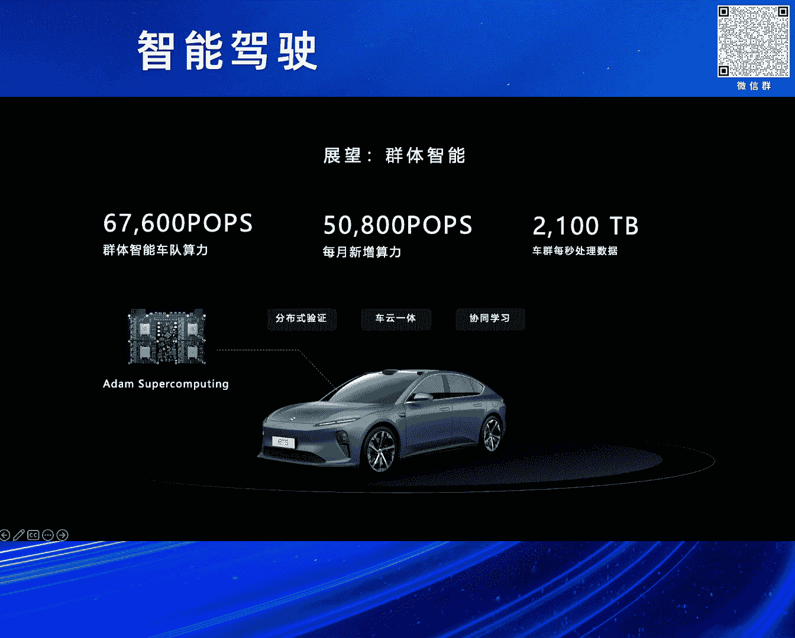

# 2024北京智源大会-智能驾驶---P5-自动驾驶大规模应用的挑战及展望-白宇利---智源社区---BV1Ww4m1a7gr

## 课程概述

在本节课中，我们将学习蔚来汽车智能驾驶负责人白宇利分享的内容，探讨自动驾驶技术在大规模应用过程中面临的核心挑战，以及未来的技术发展方向。我们将从计算、数据和成本三个维度深入分析，并展望端到端大模型、全栈AI平台和群体智能等前沿技术。

---

## 1. 蔚来汽车与蔚来智能驾驶简介

首先，感谢组委会的邀请和刘主任的介绍。各位下午好，我是来自蔚来人工智能平台的白宇利。今天下午有机会与大家交流自动驾驶，聊一聊大规模应用下的挑战和展望。

我的风格可能与前面几位嘉宾有所不同，更偏向于量产工程落地，而非纯学术探讨，时间也比较简短。我先简单介绍一下蔚来汽车和蔚来智能驾驶。

蔚来汽车是一家全球领先的电动汽车品牌，致力于为用户创造愉悦的生活方式。蔚来智能驾驶旨在解放精力、减少事故，提供安全、放松的点到点智能驾驶体验。

2023年，汽车界最权威的安全测试机构Euro NCAP启用了新规。在主动安全新增的百余项场景测试中，蔚来智能驾驶表现出色，助力蔚来成为首个达成五星安全评估的汽车品牌。

下面介绍蔚来智能驾驶的组成，主要包含四个部分：感知系统、车端超算、核心算法以及整车平台。这里要着重介绍两块内容。

第一块是感知系统。蔚来的感知系统拥有33个高性能传感器，分辨率非常高，并且全系标配了激光雷达。

第二块是车端超算。蔚来是第一家在车上全系标配四颗Orin X芯片的企业，算力总量达到1016 TOPS。第二代整车平台NT2.0全系标配了这些配置。这不仅在当前，即便放眼现在，也重新定义了量产车的智能驾驶系统，树立了高端智驾的新标准。

---

## 2. 蔚来智能驾驶发展历程

接下来，我想介绍几个蔚来智能驾驶的关键时间点。

2021年1月，蔚来发布了NT2平台的首款车ET7，这标志着蔚来走向了全栈自研智能驾驶的新时代。

2022年4月，ET7上市。我们仅用了一年多时间，就交付了智能驾驶功能。同年9月，NOP+在高速场景开始交付。

2023年10月，NOP+从高速拓展到城区。到2024年4月，全域领航辅助就向所有NT2平台的车主全量推送了。从全量推送的过程来看，我们仅花了六个月，而特斯拉的FSD整整花费了3年时间。当然，我们还在持续更新，不断优化智能驾驶的技术和功能体验。

---

## 3. 定义“大规模应用”的挑战

既然今天要讲大规模应用的挑战，我们首先需要定义一下“大规模”是什么。

我认为“大规模”主要有两个方面的含义：一是使用规模，二是功能范围。

首先，从用户量上看。在我们的第二代平台，用户量从2022年的8万，增长到2023年的15万，进而到2024年预计将远超30万，基本上每年翻一番。

其次，从覆盖的范围和区域上看。2022年，ET7在中国交付，同年也在欧洲完成了交付。2023-2024年，我们进一步拓展了欧洲多个国家，并新增了中东地区。

再次，我们聊聊里程。从2022年高速城快约36万公里，到2023年10月发布城区时目标为68万公里。如今，我们全域领航辅助的可用里程已经超过了140万公里。

最后，要讲的是车型和平台。2021年以前，我们的NT1平台是经典的“886”车型。到2022年，我们新增了NT2平台。现在，九款在售的全系车型都已更新到第二代车载平台上。2024年，搭载NT3自研平台的蔚来第二品牌“乐道”也即将开始交付。

这些都是从“量”的维度来看。从功能上看，蔚来智能驾驶体系也开始支持多个车型、新老三代平台同台、多个国家、多个区域的功能交付，挑战其实非常大。

我们来看功能规模，从最简单的独立功能，到后面更复杂的融合系统。例如我们经常谈到的AEB（自动紧急制动）功能，发展到现在的NOP+全域领航辅助功能。

从最开始数据每秒百兆字节的大小，到现在每秒可以产生10GB的数据。10GB每秒相当于一秒钟看完两部4K电影。

我们端侧的算力也在急剧增长。从最开始可能小于10 TOPS的算力，到现在蔚来车载平台上有上千TOPS的算力。在这个算力规模下，跑一个100B参数的大语言模型都绰绰有余，我们的车载平台完全有能力支持。

从研发任务看，以前可能小到几十项，现在大到上百项。从最开始感知侧重车辆、行人、障碍物的检测，到现在大家开始讨论GOD（通用障碍物检测）、MAI（多智能体交互）等复杂的融合系统，从功能上都是一个大幅的提升。

从评测任务看，最开始小到几百项，现在大到上万项。不仅是评测种类多，验证里程的要求也逐渐增加。

说到这里，大家可能会想，这么大的规模，这么多的场景，背后有哪些挑战？以及如何支持这么大的场景变化？接下来，我将与大家一起深入探讨蔚来是如何应对这些问题的。

---

## 4. 核心挑战一：计算

我将后面的挑战分为几块来讨论，主要是计算、数据和成本。我们先说一下计算的挑战。

蔚来自动驾驶研发每天要进行数百个实验、数千次构建、数十万个挖掘任务的执行。这些高并发任务都需要一个非常强大的计算平台来支持。

我们自研的高性能计算平台能够支撑200万次任务的日间峰值吞吐，并且可以支持瞬时并发超过1.5万个节点。大家也常说“天下武功，唯快不破”。从发现问题到解决问题、发布版本，更短周期的迭代是我们一直优化的目标。

为了解决超大型任务的性能瓶颈，我们自己设计并研发了一套大规模分布式训练计算集群。在这个集群里，我们可以做到单任务量级超过EFLOPS。我觉得在行业里，这个集群的规模一定是顶级的。

当然，在规模之外，性能和稳定性是非常重要的。我们的整个训练集群性能也非常好。以我们在云端训练大模型为例，我们能做到训练加速比达到91%，有效训练时长大于98%。

为了支持这样高性能的训练集群，我们也需要上下游组件的支持。为此，我们也有自研的缓存系统。以缓存系统为例，我们可以做到横向扩展性能超过同类商业存储软件的近四倍。

整体上，智驾研发任务差异非常大，又在不同的硬件上运行。如何让它们都能高效、合理地运行，也需要花费巨大时间来优化。我们可以通过性能剖析工具、协同优化，实现异构调度、任务拆分和传输优化，包括流水线并行等多方面的努力，动态地把负载均衡做好，大幅提升整体的有效利用率。

---

## 5. 核心挑战二：数据

当然，强大的算力只是一方面。没有大量数据的支持，计算就无从谈起。

智驾的场景数据，我愿意简单分成三类：训练数据、验证数据和反馈数据。

对于训练数据，随着自动驾驶的发展，每年对数据的需求都是几十倍的增长。近三年来，我们有近万倍的增长。量产车上的海量、高质量数据是蔚来智能驾驶的护城河。每秒产生PB级的数据，让我们从不担心数据供应。但是，如何通过自动化产线、自动化标注，使得这些数据参与到云端模型的训练和功能迭代之中，是面临的难题。

为此，我们建立了500多种标准化的标注工艺和100多条自动化产线。通过云端的世界模型参与到自动化流程之中，将整个标注的自动化效率提升到99.9%以上。

第二块是验证数据。像刚才前面的同事也讲到，对于整车上的测试，尤其是软件测试，传统的测试模式最终功能还是要上实车验证，方法大多数是通过自建车队。而如今，在多版本、快节奏的并行验证需求下，区区几百辆车是远远不能满足需求的。

为此，我们以NOP+开城拓路为例。一般情况下是要一个城一个城地开，开完之后用车去验证。但是，我们可以结合自有车队，利用车上额外的一颗Orin芯片，用群体智能的方式，大批量验证这些道路的可用性。原定于三个月要完成的NOP+开城拓路验证任务，我们缩短到更短的时间就能完成。

在这里，我们也要强调一下，大规模、十万量级规模的并行测试任务对于平台的压力是什么。我们需要能做到在小时级别（这里我们能做到四小时级别）完成十万规模车辆、98%任务下发的成功率，立刻能展开测试任务。数据验证也无需回传到云端，大幅提升了验证效率，降低了数据传输成本。

我们的群体智能可以同时支持150万个验证任务的并行测试，每日可以验证的里程数超过1500万公里。

最后要讲的是反馈数据。量产车每天能产生数百万条接管事件和潜在接管事件。但是，如何有效地完成筛选和压缩，将最有价值的数据上传到云端，并且通过自动化分析，是数据闭环里最关键的一步。

我们通过车端复杂的价值筛选算法和缓存机制，将万分之一最有价值的数据上传到云端进行分析。并且，我们通过5%以上的自动分拣率，促使反馈迭代的数据飞轮真正运转起来。

---

## 6. 核心挑战三：成本

当然，行业总会调侃蔚来的研发成本高。但我们实际上在研发过程中，还是非常在意成本效率的。因为我们知道，长期主义需要建立在短期成本可行性之上。因此，在研发上的巨大投入，并不是无节制的支出，而是对长期技术布局的重要要求。

面对百倍的算力需求，我们打通了车端边缘计算的能力，使得端云总算力达到260亿TOPS。这个算力规模相当于100个分布式的千卡计算集群。通过我们车端的计算和筛选、生命周期管理，以及车端的缓存和数据压缩技术，可以大大减少数据回传量，降低流量成本。

另外，智驾的研发周期性强，波动很大。碰到发版的时候，大家一定都遇到过资源上的波峰。蔚来人工智能平台在规划之初就是一个混合云架构。我们在自研的智算中心之外，也接入了多个混合云节点，能通过弹性上云、分时定价来优化调度，有效地将波峰波谷控制到10%以下。

最后，我们要讲研发任务的种类多、节奏快，如何平衡研发交付和资源的有效利用，解决资源占用高但利用率低的问题。我们通过多维的成本分析工具和运营机制，有效地将研发价值和资源利用率做了关联。通过运营机制，我们每年能优化研发运营成本数千万元。

在这里我要表达的是，很大程度上，做相同的事情，用一倍的成本跟用一半的成本是完全不一样的。研发体系对于研发成本的在意，本质上是对技术上更高的要求。

---

## 7. 未来展望：端到端大模型

谈完了挑战，我们也可以展望未来。在脚踏实地的同时，我们也仰望星空。自动驾驶的发展充满了无限的可能。接下来，我愿意分享几个关键方向的看法，包括端到端的大模型、全栈的AI平台以及群体智能技术。

第一点，端到端大模型大家听得很多。但是，它不是什么灵丹妙药。如果以目前的模型架构只能做到70分，你无法通过把端到端大模型上了车就能做到100分。因为这说明你现在的工程效率还远没有使你的模型架构达到上限，问题还很多。

其次，现在的模型架构转换也无法一夜之间完成。在我看来，要做到端到端大模型，需要满足以下几个关键的先决条件。

首先是数据飞轮。大家讲数据飞轮讲得很多，但落地效果好的寥寥无几。飞轮真的转起来了吗？里面的核心就是数据验证体系的自动化率。我认为在这里至少要能达到99.9%以上才能“飞”起来。在各个模块上也是，尤其在讲端到端之前，规控是不是能全面模型化了？感知是不是可以上BEV Transformer去量产了？地图是不是可以实现有图无图的全面自由切换？

另外，我们在讲大模型时，更愿意给它定义为云端的环境模型、云端的世界模型。在这里，模型架构和研发方式的转变，需要有初步能力去验证，并且把模型应用到研发和验证流程之中，发挥作用。

最后，我们要讲千卡集群。我最近看到有同事引用了马斯克的一条推特。在6月4号，马斯克在社交媒体上讲了一件事情：特斯拉在部署英伟达芯片，但没有地方放置，只能放在仓库里。后来，特斯拉也在新的德州工厂里开辟了新的空间，用于容纳5万片H100芯片用于FSD的训练。

5万片H100对大家来讲只是听起来很疯狂。我们说如果想要做端到端大模型，1万块H100总是需要的。在这里，如果你不能做到千卡级别的并行训练，那万卡的训练基本是不可能的。

举我前面的例子，在我们优化之前，千卡训练的有效时长只有85%，加速比只有60%。考虑故障率和加速比，万卡的真实性能乘上去就只有不到1200卡了。但是，有效的训练时长提升到98%，加速比提高到91%，这样才有可能扩展到万卡，大概也能做到八九千卡的规模，我们才能去使用它。

毋庸置疑，在数据量足够大、算力也足够充足的情况下，端到端模块的联合优化，是有可能整体提升系统功能和体验上限的。但是，正如千卡和万卡的例子一样，如果没有很好的工程化效率和质量，端到端带来的研发链路简化、闭环效率的红利，其实都会被低效的工程效率吃掉。

---

## 8. 未来展望：全栈AI平台

第二块要讲AI平台。不仅在智能驾驶的大背景下，最近我们也看到大语言模型出圈了，AI平台开始受到更广泛的关注和讨论。随着基础模型能力的通用化，我们也看到了一个机会，就是全栈AI研发平台的可能性。

全栈AI平台，我理解，不仅仅可以支持自动驾驶的研发任务。最近我们还支持了集团之内的NOMI（蔚来内部的智能座舱助手），还有内部的NEO GPT应用平台、客服专属群。

正如我们可以跨平台、跨地区、多车型地进行模型产线交付一样，实现了85%以上的模块复用度，让我们也成为国内第一个可以跨洲量产智驾的汽车企业。2022年3月，我们在国内量产的ET7交付了自研的NOP功能。在同年的9月，我们的智驾算法就上线了欧洲的ET7，并且建立了功能安全、智驾安全等大规模量产的能力。这也得益于我们有高度可复用的全栈AI能力。

全栈AI平台统一管理，优化数据、AI技术应用的整合，提升了效率，并且降低了整个研发成本，才能真正实现我们所谓的MLOps。大家也应该知道，MLOps在绝大多数企业落地时其实都不是特别好。因为一个好的研发工具，在我们看来，不仅仅要适应于企业内部的研发流程，还应该适应于它的不同阶段。生搬硬套地把这些工具强塞给企业的AI研发里是不太现实的。

我们在设计全栈AI平台时，特别注重它的灵活性和适应性，确保满足各个阶段的需求。就像是建一个高效的引擎，各个部件可以完美配合，可以有效地最大限度提升性能和效率。

---

## 9. 未来展望：群体智能

2023年9月，蔚来第一次的未来科技日上，我们首次介绍了群体智能技术。群体智能是蔚来智能驾驶技术未来发展的重要方向。

蔚来群体智能具备强大的计算能力，达到670亿TOPS，能够每秒处理2.1PB的数据。通过优化并发和实验，一定程度上我们实现了真正的车云一体化，进行分布式的验证和协同学习。

正如我前面提到的，在AEB的道路验证、NOP+全域领航开城拓路，包括世界大模型的数据迭代上，群体智能都发挥了其强大优势和无限潜力。它让我们量产的功能可以持续、高效地迭代，不断为用户提供更安全、更舒适、更加个性化的智驾功能体验。

就像在赛车队在赛道上可以通过协同作战实现最佳战绩，我们的量产车队也可以通过协同学习不断进步和提升。

我们也相信在不远的将来，我们自己的自研芯片会进一步整合、定制这些功能和能力，以推动智能驾驶和通用AI技术的发展。

让我们设想，智能驾驶汽车在没有执行智驾任务时，其余时间也是可以进行推理计算的。通过闲时复用，将算力共享给其他智能应用，就像分布式的云一样。那将为整个智能驾驶，乃至整个人工智能行业带来巨大的算力提升，真正实现车联网和云计算的结合。

---

## 10. 课程总结

我今天的分享就到这里结束，感谢大家聆听。最后，我给大家播放一部小小的影片，让大家感受一下我们在蔚来是如何做智能驾驶的，包括他们的结果是怎样的。

感谢大家。

（影片内容：领航开始，即将开始领航换电...）

---

在本节课中，我们一起学习了自动驾驶大规模应用所面临的三大核心挑战：**计算**、**数据**和**成本**，并探讨了蔚来汽车通过自研高性能计算平台、自动化数据产线和混合云架构等工程实践来应对这些挑战。同时，我们也展望了未来发展的三个关键方向：**端到端大模型**、**全栈AI平台**和**群体智能**，认识到强大的工程化能力和高效的研发体系是实现技术突破和规模化应用的根本保障。