# 2024北京智源大会-智能驾驶---P6-自动驾驶3-0时代-大模型重塑汽车智能化路线-贺-翔---智源社区---BV1Ww4m1a7gr

## 课程概述
在本节课中，我们将学习自动驾驶技术从硬件驱动到数据驱动的演进历程，并深入探讨如何利用大模型技术构建一个具备“完美感知”与“人类级决策”能力的自动驾驶系统。课程将分享实践中的核心思路、技术架构、遇到的挑战以及具体的解决方案。

---

## 自动驾驶技术演进的三阶段 📈

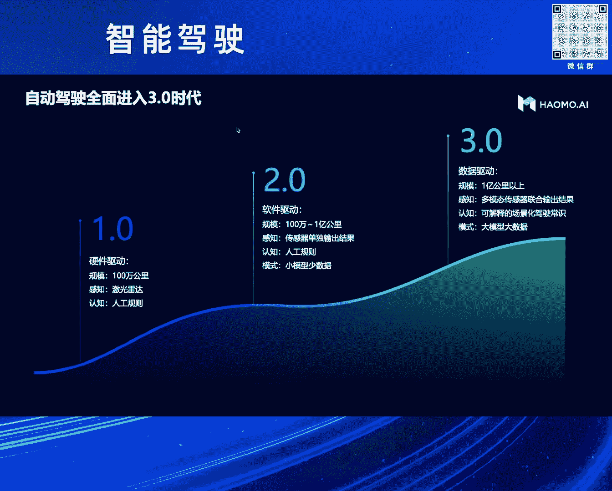

根据过去几年自动驾驶技术的发展历程，我们可以将其演进路线分为三个阶段。

**第一阶段：硬件驱动**
此阶段的核心是依赖硬件堆叠，特别是激光雷达等传感器。

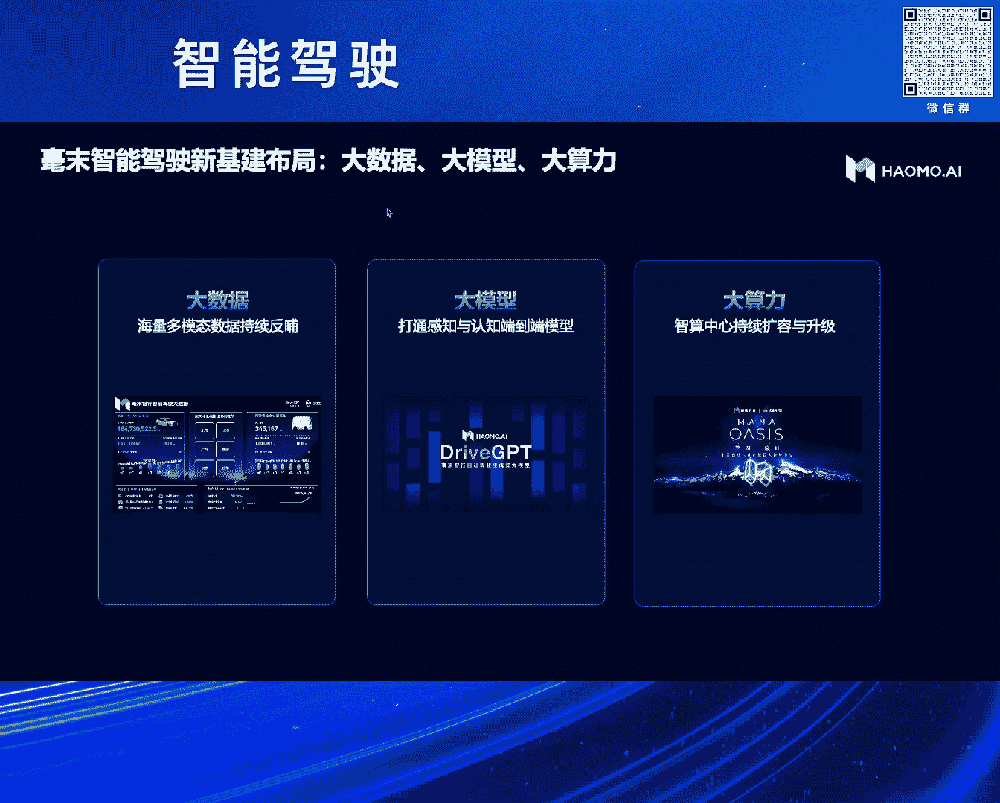

**第二阶段：小数据与小模型驱动**
目前绝大多数公司处在此阶段，主要使用有限的数据和较小的模型来解决感知、认知和决策规划问题。

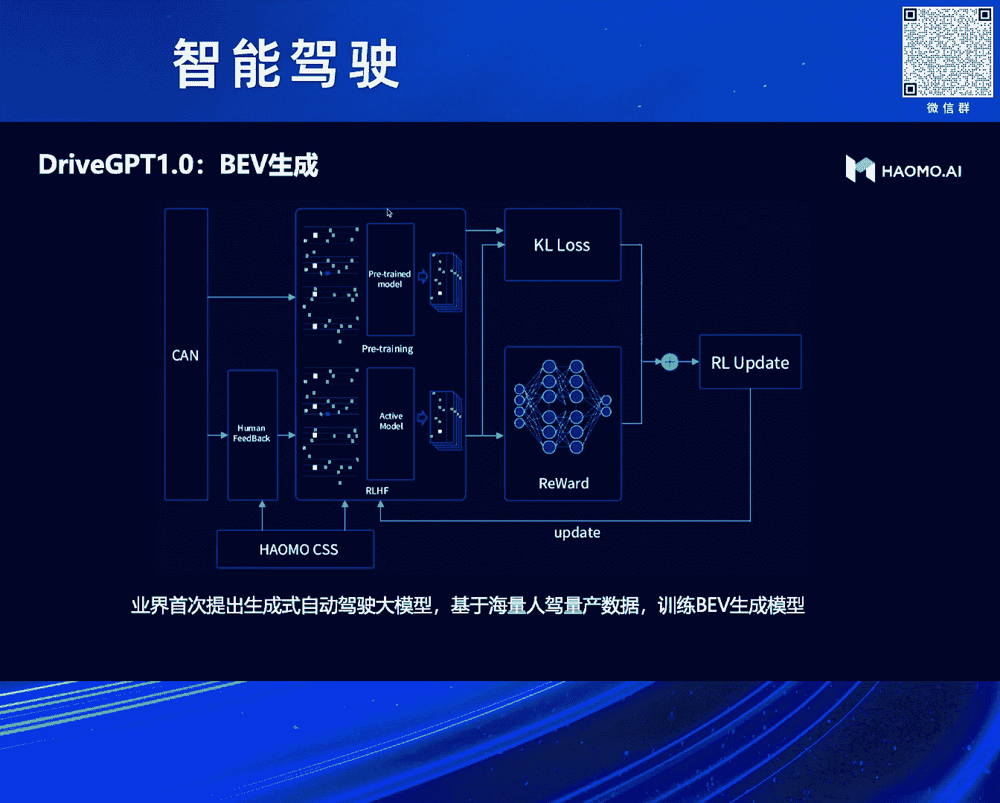

**第三阶段：数据驱动（自动驾驶3.0）**
我们判断未来将进入此阶段，其核心特点是**大数据、大算力、大模型**。

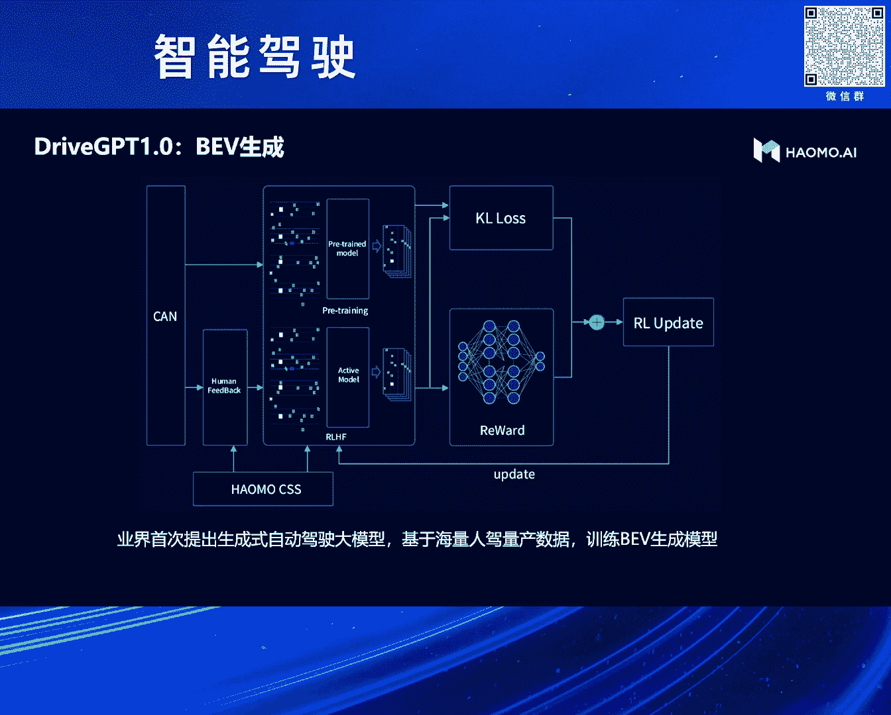

上一节我们介绍了自动驾驶技术的三个演进阶段，本节中我们来看看在3.0时代，我们应该聚焦于做什么。

---

## 自动驾驶3.0时代的核心任务 🎯

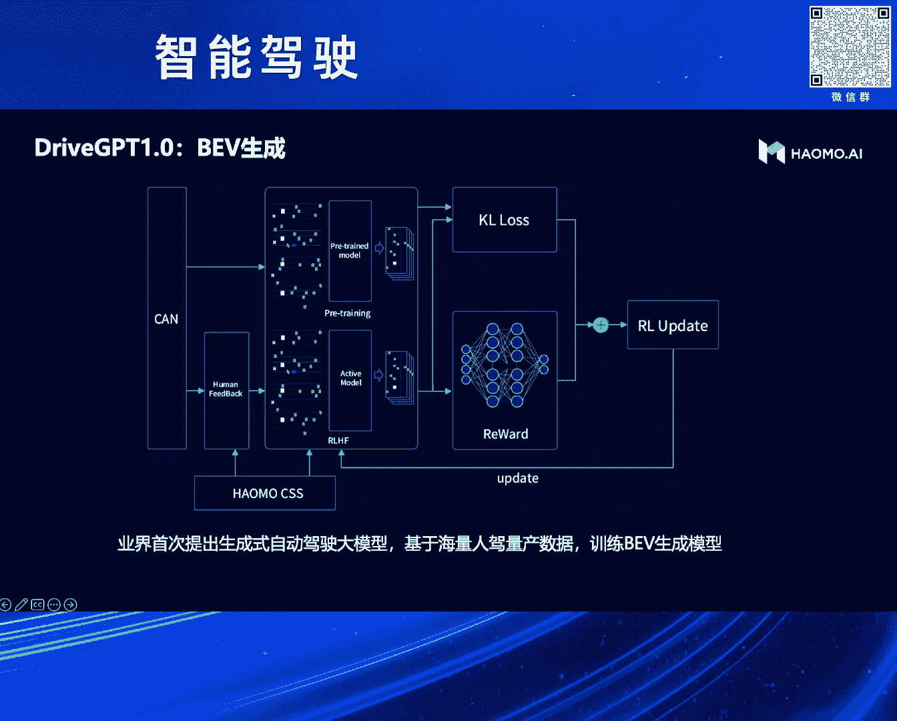

在3.0时代，我们应聚焦于三个关键词：**大数据、大模型、大算力**。本节课将主要分享大模型的具体实践，包括如何构建以及如何应用于整个数据系统。算力部分将不详细展开。

我们为何会选择生成式技术路径？这背后有一段研发历史，我们将在课程最后回顾。

我们选中的路径是：**通过生成式方式，并基于BEV（鸟瞰图）生成来解决自动驾驶问题**。

然而，在研发过程中我们遇到了许多挑战。最初我们设想简单：利用大量量产车回传的数据，将世界表达为BEV视图，再通过生成式大模型预测未来的BEV，从而解决自动驾驶任务。公式可简化为：
`未来BEV = 生成式模型(当前BEV序列)`

但在长达半年的训练中，我们发现了两个主要问题。

以下是我们在训练中遇到的核心挑战：

1.  **数据质量问题**：量产车回传的数据主要是感知结果，而非原始视频（成本限制）。这些感知结果基于传统的“白名单”标注方式，并不完美，存在漏检、误检，例如在城市中车道线模糊或逆光条件下识别不佳。基于不完美的感知结果去学习驾驶决策，存在先天不足。
2.  **数据分布与成本挑战**：量产车数据的地域和场景分布非常好，覆盖各种复杂情况。这既是优势，也是巨大挑战。要训练一个能应对如此复杂场景的“老司机”模型，成本极高。例如，特斯拉训练类似模型花费约1000亿美元。作为资源有限的公司，我们必须找到大幅降低成本的路径。

面对这些挑战，我们重新思考了自动驾驶大模型的任务定义。

---

## 重构任务：自动驾驶大模型的三大目标 🧩

在经历初期尝试后，我们将自动驾驶大模型的任务调整为循序渐进的三个阶段。

**第一阶段：构建通用感知能力**
首先需要解决感知不完美的问题。我们目标是构建一个“通用感知”模型，与传统基于固定类别标注的感知不同，它应具备：
*   **2D能力**：能看懂图片纹理。
*   **3D能力**：能理解三维空间。
*   **4D能力**：能融合时序信息。
*   **识别万物**：能理解物体是什么，接近人类的感知水平。

**第二阶段：实现人类级驾驶决策**
在拥有完美感知的基础上，目标是实现类似人类的驾驶决策。其与规则式决策的核心差异在于**具备世界知识**，能够理解交通规则、场景上下文并进行推理，而非依赖大量人工定义的静态规则。

**第三阶段：全链条全局优化**
在前两者都实现后，将它们整合进行端到端训练，以追求全系统性能的全局最优。

基于以上目标，我们设计了整体的技术架构。

---

## 整体架构设计：感知与决策的双轮驱动 ⚙️

我们的整体架构分为两大部分：

*   **左侧 - 感知大模型**：本质上是一个**4D编码器（4D Encoder）**，负责将看到的现实世界编码到一个四维（空间+时间）的特征空间中。
*   **右侧 - 认知决策模型**：在获得对世界的完美认知后，模型需要利用这些信息做出驾驶决策。我们初期采用**BEV生成**作为表现形式。

为了应对之前提到的**高昂训练成本挑战**，我们在架构中引入了两个关键的“外挂”模型，以利用外界已有的知识：

1.  **感知大模型中的多模态大模型**：用于对齐图像特征与文本特征，使模型获得“识别万物”的能力，而不仅仅是看懂纹理。
2.  **认知决策模型中的大语言模型（LLM）**：用于注入“世界知识”（如交通标志含义、驾驶常识），使决策模型能够理解人类世界的运作规律，这是成为“老司机”的必要条件。

通过这种设计，我们得以用数千张GPU卡完成训练，这是一条在算力有限情况下的可行路径。

接下来，我们具体看看感知大模型是如何构建的。

---

## 感知大模型：如何实现“完美感知” 👁️

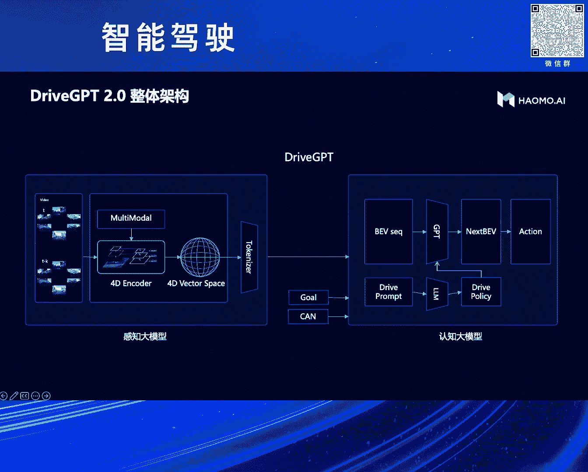

我们的感知大模型构建流程如下，目标是实现之前定义的2D、3D、4D及识别万物能力。

以下是构建感知大模型的具体步骤：

1.  **输入与2D编码**：将摄像头视频序列输入。首先通过一个**自监督的图片编码器**提取图像纹理特征，得到2D编码。
2.  **多模态对齐（识别万物）**：将上述2D编码与**外部多模态大模型（如CLIP）** 的文本特征进行对齐。这使得模型获得的特征具备了语义理解能力，能够识别万物。
3.  **升维至4D空间（3D+时序）**：利用**视频下一帧预测**任务，强制模型学习3D空间和时序信息。核心思想是：如果模型能准确预测车辆移动后的下一帧图像，它必然理解了3D场景几何和运动。我们通过NeRF等渲染技术实现下一帧的生成，并与真实帧对比。公式可表示为：
    `预测帧 = 渲染模型(当前帧特征, 相机运动)`
    通过最小化预测帧与真实帧的差异，模型学会了4D空间编码。
4.  **输出**：最终，我们得到一个对世界的**4D编码**，它包含了丰富的几何、语义和时序信息，实现了“完美感知”。

我们可以通过一个实际案例来观察效果。

---

## 实践案例：感知大模型效果演示 🎬

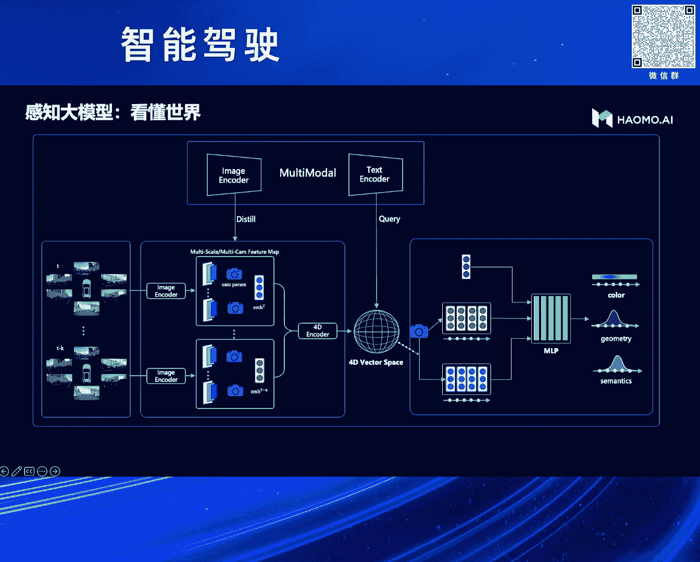

我们使用量产车回传的数据进行测试（示例中展示了前视和后视摄像头画面）。模型能够输出多种结果：

*   **三维重建**：可生成鸟瞰图（BEV）和前视角三维场景，并支持自由视角切换。
*   **全要素输出**：在单一模型中同时完成语义分割、实例分割、光流估计、深度估计等任务。
*   **复杂场景处理**：即使在复杂的路口绑定场景中，也能稳定输出分割、光流、深度等信息。

这为后续的自动标注、仿真等任务提供了强大基础。

上一节我们构建了“完美感知”，本节中我们来看看如何在此基础上进行决策。

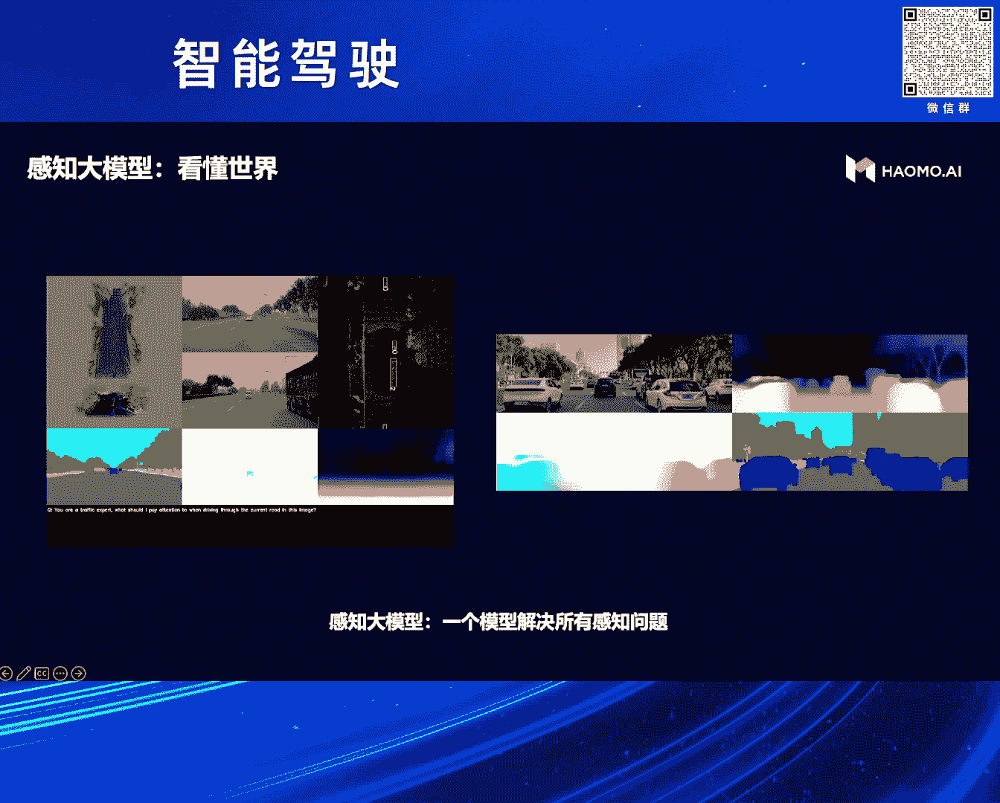

---

## 认知决策模型：从BEV生成到世界模型 🧠

我们延续了生成式（GPT）的思路，但改进了输入。

*   **改进输入**：将之前效果不佳的、来自量产车的感知结果，替换为我们新建的“完美感知”模型的输出。我们将4D空间编码拍扁为BEV图，并**Token化**，作为生成模型的输入。
*   **引入世界知识**：将感知模型“看到”的世界描述（Token序列）输入给**大语言模型（LLM）**。LLM扮演“副驾驶老司机”的角色，解释场景并给出驾驶建议。这为决策模型注入了宝贵的世界知识和常识推理能力。
*   **训练目标**：模型的任务是**生成未来的BEV Token序列**。通过这种方式，决策模型能够基于对未来的预测来规划动作，更接近人类驾驶逻辑。

这种结合显著降低了训练难度和成本，加速了模型收敛。

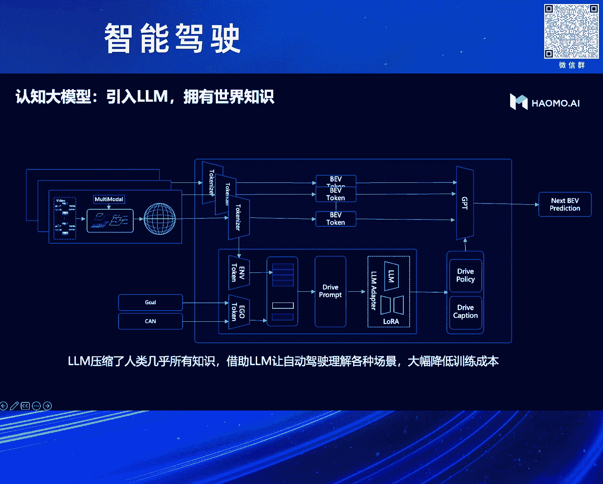

我们同样有一个实际案例来展示其理解能力。

---

## 实践案例：认知决策模型理解交通场景 🚦

在一个复杂路口场景中，模型需要理解各种交通标志牌。纯粹用自动驾驶数据训练很难理解这些标志的含义，因为缺乏对应的语义标注。

借助大语言模型的外挂，我们可以轻松地将视觉感知与标志牌语义关联起来。例如，模型可以识别出“禁止驶入”、“限速”等标志的含义。虽然目前对汉字的理解仍有提升空间，但对通用符号的理解已相当不错。

今年，我们将生成任务进行了重要扩展。

---

## 技术前沿：从BEV生成到3D世界生成 🌐

我们意识到，仅生成BEV或2D图像还不够。真正的自动驾驶基础模型应该能建模和生成3D世界。

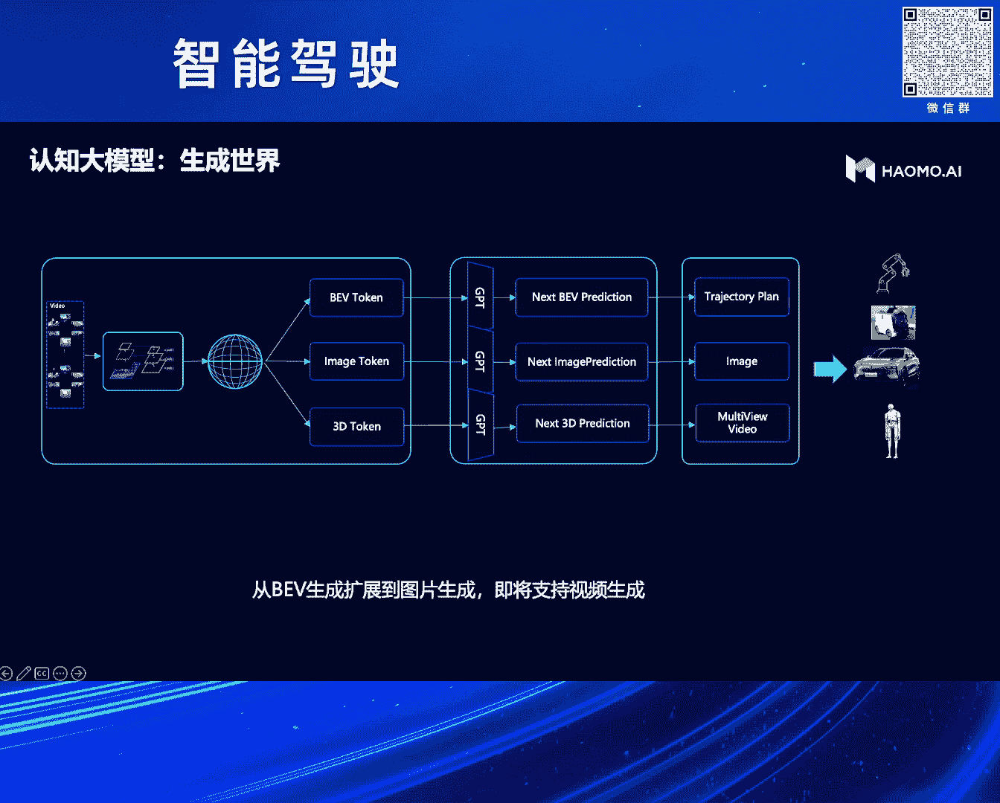

1.  **多视角图像生成**：我们已经实现将4D空间编码解码为图像Token，并用GPT式生成器**生成环视的多摄像头下一帧图像**。这比Sora等通用视频生成模型更难，因为它要求多视角间保持严格的几何一致性。目前生成图像质量很高，但文字（如标志牌）生成仍是乱码，这是一个待攻克的难题。
2.  **3D Token生成（进行中）**：这是更本质的挑战。我们正在研究能否直接生成**未来世界的3D Token**，即预测车辆行动后整个3D场景的变化。这需要保持三维空间和时序的高度一致性。只有解决了3D世界生成，才能渲染出可用于训练和评测的、符合物理规律的一致性多视角视频。

以下是我们目前已实现的部分效果演示。

---

## 效果演示：BEV生成与图像生成 🖼️

*   **BEV生成**：输入当前时刻的BEV图，模型可以预测未来几秒的BEV序列。这已经能解决自动驾驶中的许多预测与规划问题。
*   **多视角图像生成**：生成的多摄像头图像视觉效果逼真，除文字部分为乱码外，其他细节肉眼难以区分真伪。这证明了模型对场景纹理、光照、几何的强大理解能力。

目前，视频级别的生成仍在攻关中。

大模型不仅用于最终驾驶，在上车之前，它更能赋能整个数据闭环系统。

---

## 大模型赋能数据智能体系 🔄

目前将参数量巨大的多模态和语言模型直接部署在车端仍有困难。因此，我们主要用大模型赋能云端的工具链，构建数据智能体系。

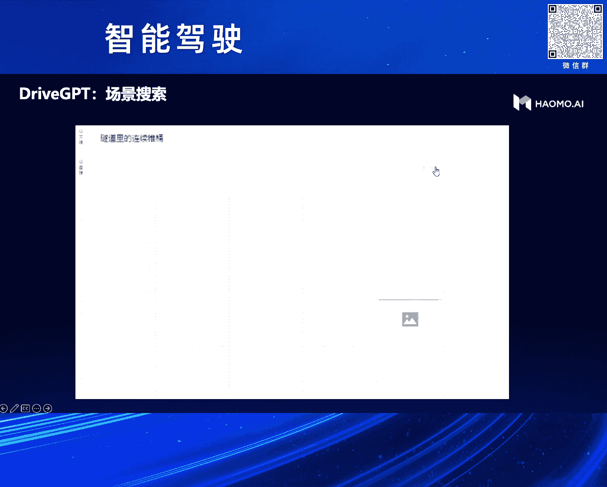

我们的MaaS（模型即服务）数据智能体系覆盖数据采集、管理、标注、筛选、标签化全流程，底层均由大模型驱动。

以下是引入大模型后，数据工作流效率提升的几个例子：

1.  **智能数据检索**：在海量数据（如十亿级图片）中，可以用自然语言描述复杂场景（如“六个行人走过斑马线”）进行精准检索，无需预先定义标签。
2.  **定向数据生成**：可以手绘几条车道线，指定生成不同天气（晴天、雪天）、不同场景（环岛、弯道）的数据，极大丰富训练集。
3.  **数据风格迁移**：对采集的真实数据，可进行天气、光照、纹理的风格迁移，增加数据多样性。
4.  **场景理解与解释**：大模型可以对驾驶场景进行描述，提炼关键元素（如“路口”、“公交车”、“行人”），用于场景聚类、特征分析和问题诊断。

让我们回到最初的那个“模糊车道线”案例，看大模型如何解决问题。

---

## 案例闭环：用大模型解决“模糊车道线”问题 🔁

面对传统感知在模糊车道线场景下效果差的问题，大模型赋能的数据系统可以如下解决：

1.  **智能检索**：输入“城市模糊车道线”等描述，系统从海量数据中找出所有类似场景。
2.  **数据补充**：如果检索到的数据量不足，可以使用**定向生成**功能，通过Prompt生成大量类似场景的合成数据。
3.  **高效训练**：利用检索和生成的数据，快速训练或微调感知模型，从而解决该长尾问题。

最后，让我们回顾一下整个研发历程，分享走过的弯路。

---

## 研发历史回顾与经验总结 🛣️

我们的自动驾驶大模型研发始于2022年，历程如下：

1.  **初期尝试（Seq2Seq）**：受互联网机器翻译启发，最初将自动驾驶视为序列到序列任务（图像序列到驾驶动作），但发现任务过于复杂。
2.  **第一次简化（BERT风格）**：改用量产车回传的对齐数据（感知结果+驾驶动作），以BERT方式训练，让模型预测被掩码的驾驶动作。效果有所提升，但将决策原因归结于当前感知，这与人类基于未来预测做决策的逻辑不符。
3.  **转向生成式（GPT-1.0）**：将任务重新定义为**生成未来的BEV**，这更符合人类驾驶的预测性思维。这就是我们最初发布的自动驾驶生成式大模型1.0版本。
4.  **发现瓶颈，提出“完美感知”**：在1.0版本实践中发现，如果感知输入不完美，决策模型上限很低。因此在2023年初，我们启动了“完美感知”大模型的研发，并最终实现了2D/3D/4D/识别万物的统一模型。
5.  **当前与未来**：目前我们正在将“完美感知”与“认知决策”模型进行端到端整合训练，目标是实现从感知到决策的全局最优，让自动驾驶系统真正具备像老司机一样理解世界、应对复杂场景的能力。

---

## 课程总结 📚

本节课中我们一起学习了：

1.  **自动驾驶技术**从硬件驱动到数据驱动（3.0时代）的演进脉络。
2.  在3.0时代，构建自动驾驶系统的核心在于利用**大数据、大算力、大模型**，并重点分享了**大模型**的实践路径。
3.  我们将任务分解为构建**通用感知大模型**和**人类级认知决策模型**两大目标。
4.  详细介绍了感知大模型如何通过**自监督学习、多模态对齐、下一帧预测**来实现2D、3D、4D及识别万物的能力。
5.  阐述了认知决策模型如何基于**生成式架构**，并引入**大语言模型作为世界知识外挂**，来做出更智能的驾驶决策。
6.  探讨了从BEV生成向更本质的**3D世界生成**演进的技术前沿。
7.  展示了大模型如何赋能**数据智能体系**，实现高效的数据检索、生成与管理，形成解决问题的闭环。
8.  回顾了研发历史上从Seq2Seq到BERT再到GPT思路的转变，以及“完美感知”提出的必要性，为实践者提供了宝贵的经验参考。

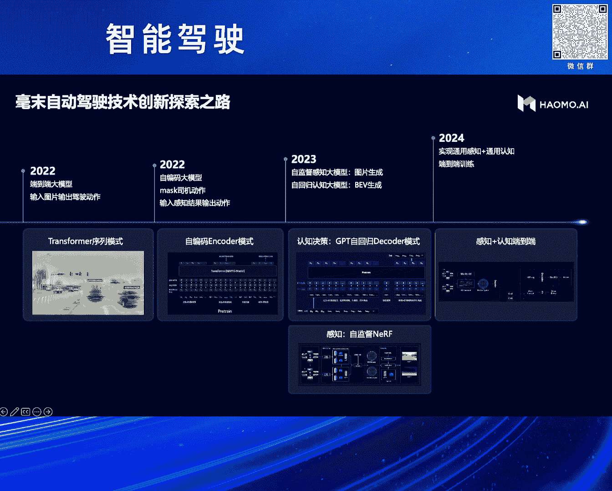

通过本课程，希望你能够理解构建新一代数据驱动自动驾驶系统的核心思想、关键技术挑战与可能的解决路径。