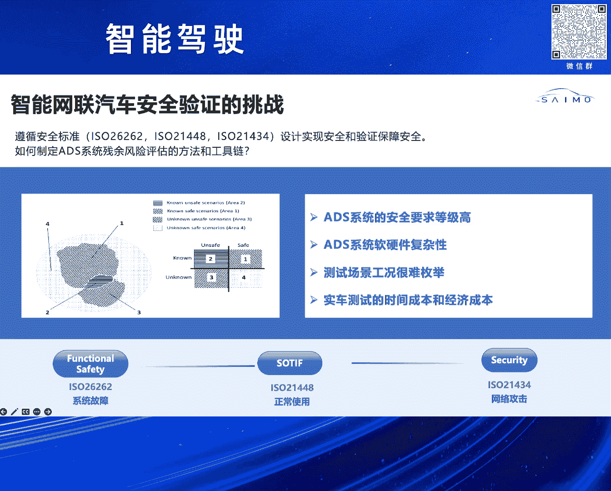
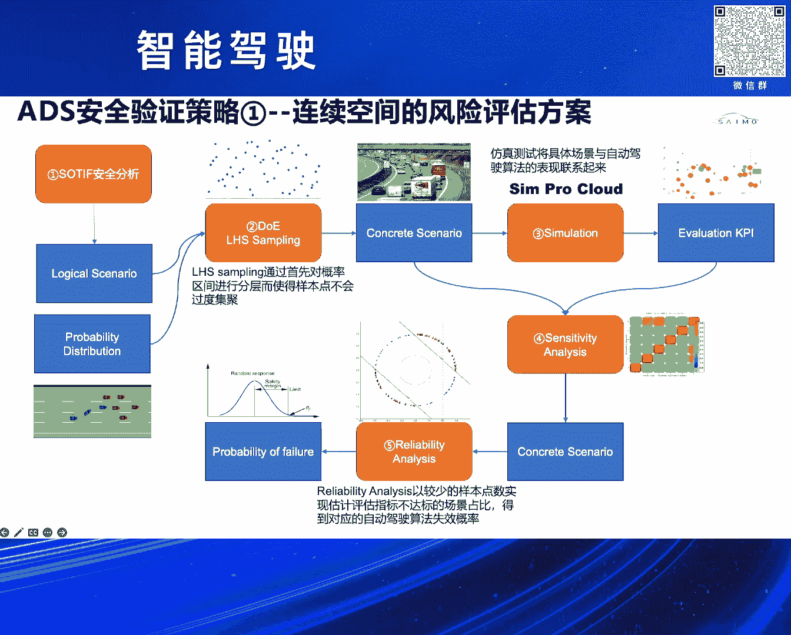
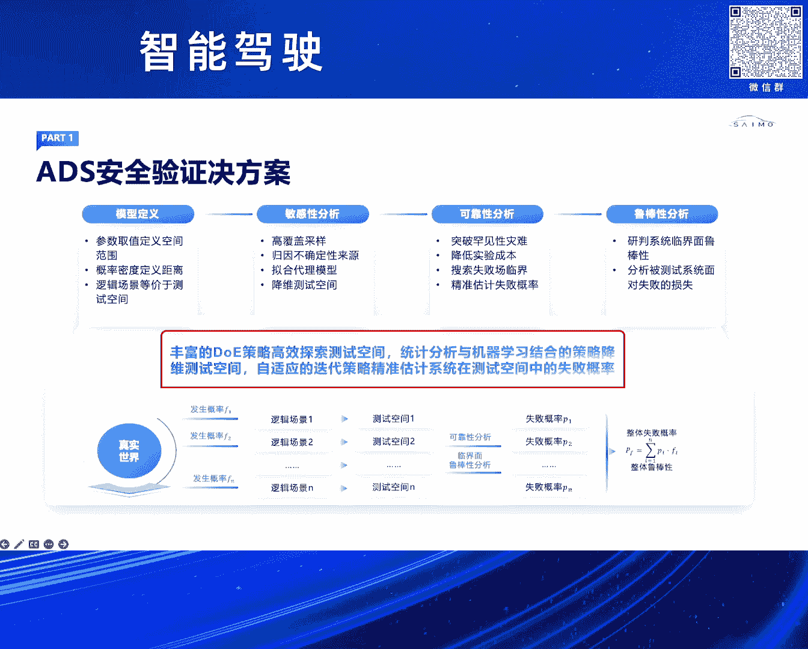
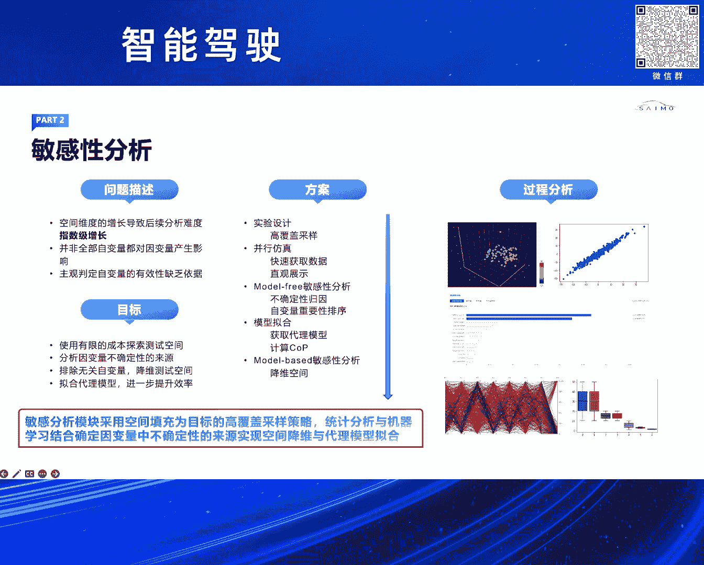
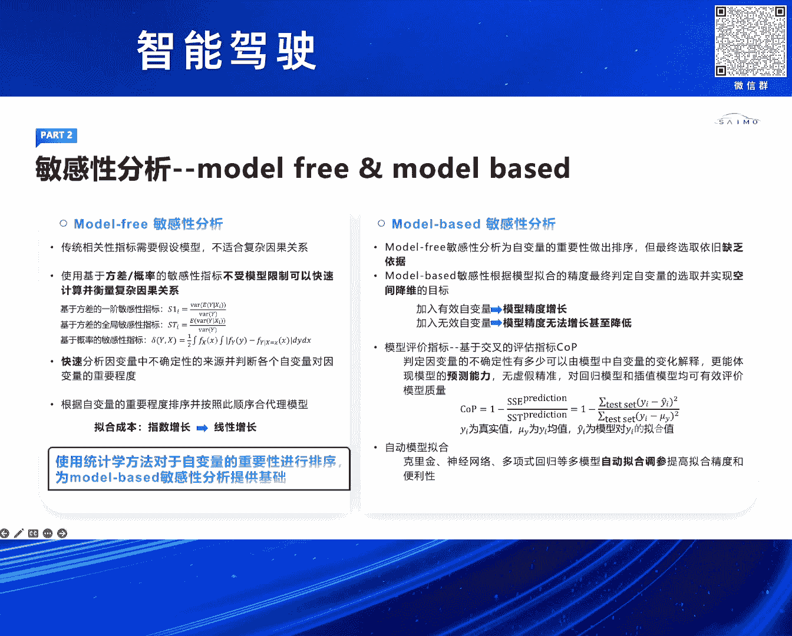
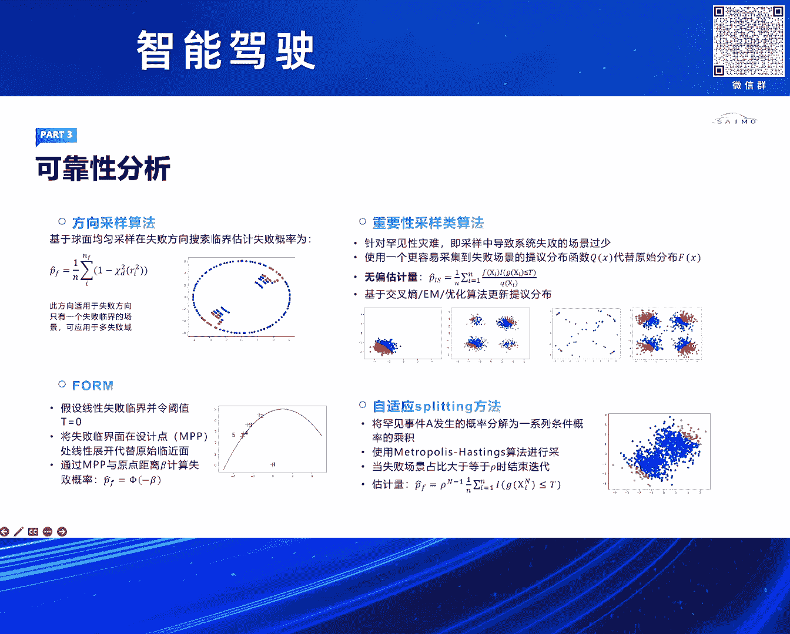
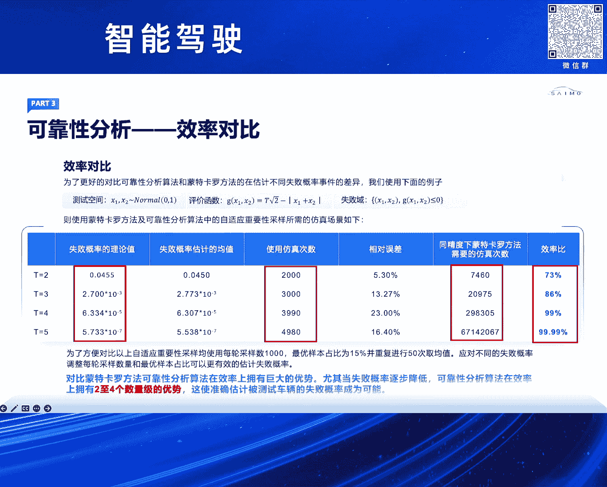
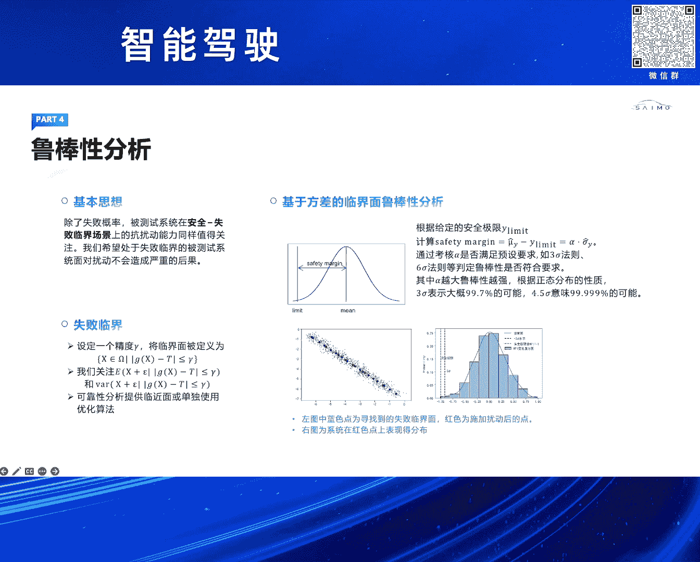
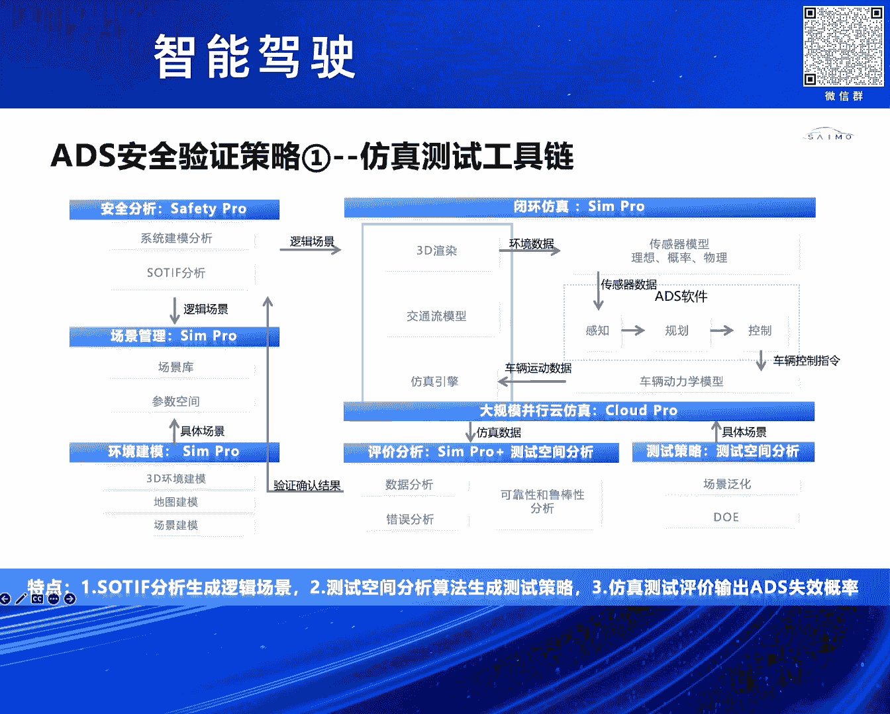
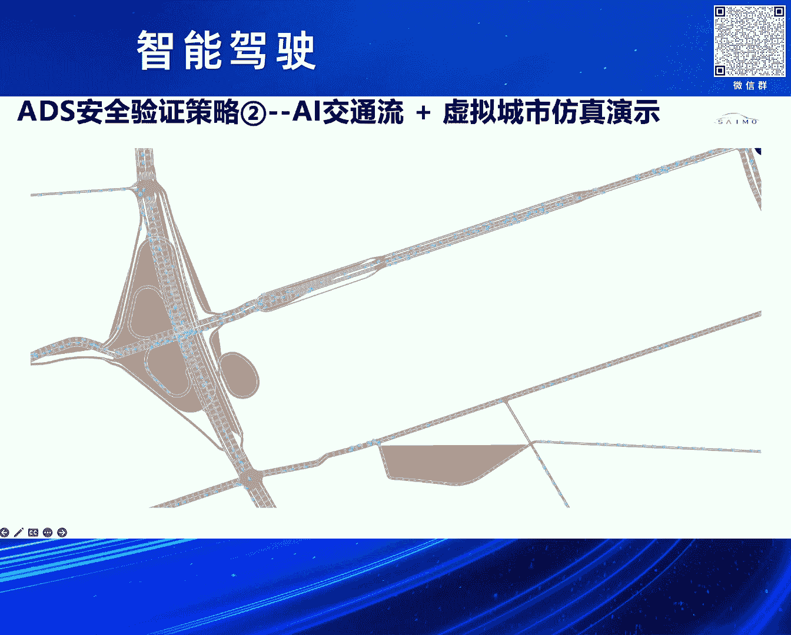

# 2024北京智源大会-智能驾驶---P7-智能网联汽车安全验证策略和仿真工具链-杨-强---智源社区---BV1Ww4m1a7gr
## 课程编号：P7

在本节课中，我们将学习智能驾驶系统安全验证所面临的挑战，并深入探讨赛木科技提出的两种核心验证策略：针对连续测试空间的量化风险评估方法，以及针对离散测试空间的大规模AI交通流随机测试方法。

---

### 智能驾驶系统安全验证的挑战

上一节我们了解了课程的整体框架，本节中我们来看看智能驾驶系统在安全验证方面面临哪些具体挑战。

随着自动驾驶等级提升至L3及以上，安全责任的认定发生了变化。自动驾驶系统需要通过设计和验证来确保安全，这带来了一系列要求。

功能安全标准ISO 26262旨在解决系统内部硬件随机性失效和系统性失效的问题。其目标是确保系统本身内部没有问题。

网络安全标准ISO/SAE 21434则关注外部攻击风险。由于自动驾驶系统是联网的，可能存在外部攻击，需要通过相关安全设计来抵御。

预期功能安全（SOTIF）关注的是系统设计层面的天然缺陷。例如，感知传感器对某些光照条件或识别范围存在局限。SOTIF的安全分析和设计旨在验证这一领域的安全性。

同时，自动驾驶系统的软硬件非常复杂，难以通过分解各个模块来彻底解决安全问题。

此外，自动驾驶安全验证的一个重大难点在于“长尾问题”。我们很难通过有效的方法去枚举所有测试场景。传统软硬件测试的场景通常是确定的，因此能较好地确保安全性。而自动驾驶系统的一大挑战在于其工况的不确定性，难以枚举。

结合ISO 21448标准，在安全验证领域提出了一个重要问题：如何制定自动驾驶系统残余风险的验证方法和工具链。

---

### 安全验证的核心策略：测试空间划分

上一节我们探讨了安全验证的挑战，本节中我们来看看赛木科技提出的核心解决思路。

基于场景的测试是验证自动驾驶系统安全性的有效方法，但如何构建场景至关重要。

对于L2级系统，通过专家经验或手工搭建场景，基本可以确保其安全等级。但对于L3及以上级别，很难通过手动方式或专家经验来构建一个全面、有效的场景集合。因此，需要寻找一套系统性的方法来解决场景构建问题。

借助SOTIF的四象限分析，重点关注如何验证危险场景。对于已知的危险场景，可以将其归入已知-已知范畴，基本可以确保覆盖。但对于未知的风险场景，验证则非常困难，因为很难找到这些场景的边界。

我们的思路是将对自动驾驶系统的测试验证，转化为一个测试空间探索的问题。测试空间参数探索在航天航空等领域应用较多。

测试空间可以进一步细分为连续空间和离散空间。

连续空间是有边界的。例如，一个测试场地虽然很大，但总能在一定范围内限定其边界。

离散空间则很难通过建模找到系统的边界。

针对这两种不同的测试空间，我们的方案是：
*   **针对连续空间**：通过SOTIF安全分析定义一个带有边界的逻辑场景。这个逻辑场景可以被视为一个边界明确的空间。然后结合我们的测试空间分析工具及场景生成器，生成具体场景进行测试。
*   **针对离散空间**：通过构建大规模的AI交通流，进行随机测试。

总结来说，我们将测试空间划分为两大类型，并制定相应的验证策略和仿真工具链。

---

### 连续测试空间的风险量化评估方案

上一节我们介绍了测试空间划分的策略，本节中我们详细看看针对连续空间的风险量化评估方案。

以下是该方案的实施步骤：

1.  **安全分析与逻辑场景定义**：首先通过SOTIF安全分析构建逻辑场景。安全分析分为安全设计（通过修改系统规避风险）和验证（对无法调整的潜在危险进行测试）两部分。安全工程师将识别的危害转化为仿真工程师可用的逻辑场景。逻辑场景是一个带有边界和参数分布的空间，例如 `逻辑场景 = {参数1: [最小值, 最大值], 参数2: [最小值, 最大值], ...}`。

2.  **实验设计与采样**：获得逻辑场景后，需要进行采样。均匀采样（如蒙特卡洛）覆盖率高，但对高维空间需要极多样本，即使利用云端并发仿真，测试成本也过高。因此，我们需要一种高效的实验设计方法，用少量样本点覆盖空间，并估算系统失败概率。

3.  **具体场景生成与仿真测试**：完成实验设计后，基于逻辑场景生成具体场景，并利用云端大算力仿真平台进行测试。

4.  **参数敏感性分析**：获得仿真数据后，进行参数敏感性分析。目的是消除对自动驾驶系统关键性能指标影响不大的因子，实现降维。

5.  **可靠性分析迭代**：敏感性分析后，进入下一轮仿真测试迭代，进行可靠性分析。可靠性分析旨在通过系统失败概率（如碰撞或TTC违规）来估算自动驾驶系统未来的失败概率。如果一个系统的失败概率是 `10^-4` 或 `10^-5`，则认为不够安全；如果达到 `10^-7` 或更低，则认为在实车路测中基本不会发生。

整个方案针对连续空间，提供了一套可从数学上论证、在工程上可量化输出风险评估指标的方法。

---

### 测试空间分析工具链详解

上一节概述了连续空间的评估流程，本节中我们深入讲解支撑该流程的测试空间分析工具链。

整个验证思路分为几个核心环节：

1.  **模型定义**：即定义逻辑场景，借助安全分析工具完成。
2.  **敏感性分析**：在定义好的测试空间中，通过高采样或拟合代理模型对参数进行分析，实现降维。
3.  **可靠性分析**：在高维连续空间中，有效搜寻所有失败域，并对系统整体失败概率进行估算。
4.  **鲁棒性分析**：在已识别失败风险的区域，增加扰动（噪声），测试系统的鲁棒性。

通过敏感性、可靠性、鲁棒性分析，对从ODD分析中给定的一个特定区域或空间进行全面的安全验证，最终输出失败概率。

#### 敏感性分析

敏感性分析主要做什么？它借助仿真，分为两个阶段：

*   **第一阶段：Model-Free 分析**：对相关敏感性参数进行排序，但不决定参数是否影响自动驾驶系统的KPI。
*   **第二阶段：Model-Based 分析**：结合机器学习算法，最终筛选出对整个自动驾驶行为有影响的场景因子（例如前车距离、自车速度等）。

重点是，我们基于敏感性分析算法，用较低的样本点填充整个空间，并结合统计和机器学习方法，确定因变量中不确定因子对整体空间的影响。

第一阶段通过统计分析找到应变量的优先级。
第二阶段（Model-Based）要解决的问题是：当增加新的影响因子或场景定义时，它对结果的影响有多大。如果增加因子后模型精度提升，则该参数重要；如果模型精度指标下降，则该参数无用。经过敏感性分析，我们可以得到重要的场景参数，为后续仿真测试降维。

#### 可靠性分析

可靠性分析旨在通过对测试空间失败域的搜寻（覆盖所有失败域），结合样本点设计和仿真测试，估算系统的失败概率。

传统方法如蒙特卡洛采样所需样本点极多。对于一个成熟系统，其失败概率可能低至 `10^-6` 或 `10^-7`，蒙特卡洛采样会面临“维数灾难”，工程上无法实现。因此，需要可靠性分析算法来评估极低失败概率。

以下是几种常用的可靠性分析算法：
*   **方向性采样**：沿各个维度进行采样和失败率搜索。
*   **自适应重要性采样**：通过不断迭代，依据上一轮结果搜寻下一个可能存在的失败域，从而全面覆盖整个参数空间。

我们进行了一个实验对比。使用一个失败概率为 `10^-7` 的测试函数。从对比表格可以看出，当失败概率低至 `10^-7` 时，可靠性分析算法大约需要5000次仿真即可估算出概率，而蒙特卡洛采样则需要超过6700万次。可靠性分析算法将效率提升了四个数量级。

#### 鲁棒性分析

鲁棒性分析是在完成可靠性分析、已搜寻到失败域临界面的基础上，通过增加扰动来观察系统的安全裕度。如果安全裕度落在六西格玛范围，则认为鲁棒性很好；如果是三西格玛，则定义了系统在未来可能存在扰动下的安全边界范围。

---

### 基于工具链的仿真验证流程

上一节我们深入分析了各项工具，本节中我们来看看如何将它们整合成完整的仿真工具链。

基于测试空间分析工具（敏感性、可靠性、鲁棒性分析）的理论，我们制定了整套仿真工具链：

1.  **安全分析工具（Safety Pro）**：输出逻辑场景。
2.  **云端仿真平台**：接收逻辑场景。
3.  **测试空间分析工具**：制定测试策略（如采样、实验设计），生成具体场景。
4.  **云端仿真平台（大算力）**：执行大规模并发仿真测试。我们自研的仿真引擎支持最高1000Hz仿真，覆盖毫米波、激光、摄像头等物理传感器（模拟不同光照、噪点），并结合27自由度动力学模型进行闭环测试。
5.  **结果反馈**：仿真结果返回给测试空间分析工具进行可靠性与鲁棒性分析，最终结果再反馈回安全分析阶段。例如，若失败概率为 `10^-4`，则需重新进行系统设计；若为 `10^-7`，则认为在该场景下足够安全。

整套工具链已在云端集成，并实现商业落地。我们的安全分析工具Safety Pro和仿真引擎SYMPO已通过功能安全ASIL D等级认证，确保了工具链的可靠性和置信度。

---

### 离散测试空间的风险评估：AI交通流

上一节我们完成了对连续空间验证的讨论，本节我们转向离散测试空间的解决方案。

离散空间相比于连续测试空间，很难通过数学方式建模并求解边界。我们的解决方案思路是引入随机交通流。

在构建交通流时，我们思考是采用传统的基于规则的模型，还是数据驱动的模型。我们的理解是，传统的交通流模型（多源自国外）很少包含中国本土交通规则，其变道、跟车等模型难以逼近真实的中国交通流。因此，我们认为应该构建基于中国实际交通流数据的AI模型，包括宏观和微观交通流模型。

我们的方案是：
1.  采集宏观和微观交通流数据。
2.  基于数据训练AI模型。
3.  结合云端仿真平台进行闭环测试验证。

宏观交通流模型预测整个城区不同道路的车流密度、速度和流量。微观交通流模型（可理解为数据驱动的驾驶员模型）预测单车在复杂工况下的行为（如变道、超车、减速）。

确定交通流模型后，结合云端解决方案（虚拟城市）进行测试。虚拟城市类似于数字孪生，基于高精度地图和高拟真度3D模型构建。对于L3及以上城区自动驾驶验证，除了在特定片段场景下测试，还需要在连续空间下进行验证。AI交通流模型正是为了解决这个问题。

#### AI交通流模型设计

*   **宏观模型**：结合道路拓扑信息和交通流动态，采用非线性时空图神经网络。模型输入为地图信息和宏观交通流数据，主干网络采用四种不同的时空图神经网络，通过Stacking后融合算法输出对特定道路流量、密度、速度的预测。
*   **微观模型**：是一个数据驱动的驾驶员模型。网络结构包括光栅化、主干网络（基于BEV+Transformer架构）、编码解码器，最终输出多模态预测（如直行、左转、右转的概率），选择最高概率的轨迹。模型还加入了后优化模块来提升推理准确性。

#### 离散空间验证工具链

针对离散空间的验证工具链如下：
图的左边结合了基于真实数据训练的AI交通流模型和虚拟城市，生成海量交通流数据。
数据输入到分布式的仿真节点。我们采用分布式仿真，将计算量大的传感器感知信息计算分解到每个并行容器中，实现实时仿真。
目前性能可支持5000+交通车和100+主车进行并发测试。虽然基于规则的模型可能支持更多车辆，但AI模型在推理逼真度上更具优势，且我们正在进行大量并行计算优化。
最终，整个平台能进行实时分析，提取关键NG场景。

---

### 总结

本节课中我们一起学习了智能驾驶系统安全验证的策略与工具链。

我们首先分析了自动驾驶安全验证在功能安全、网络安全和预期功能安全等方面面临的挑战，特别是“长尾问题”和场景枚举困难。

针对这些挑战，赛木科技提出了基于测试空间划分的验证策略：对于**连续测试空间**，采用从SOTIF分析、实验设计、敏感性分析、可靠性分析到鲁棒性分析的量化评估流程，通过高效的算法（如可靠性分析算法）在可接受的仿真次数内评估极低失败概率；对于**离散测试空间**，则通过构建基于中国真实交通数据训练的AI宏观与微观交通流模型，结合虚拟城市和分布式云仿真平台，进行大规模、高逼真度的随机测试。

这两套方法共同构成了应对预期功能安全中未知危险场景验证的完整解决方案。