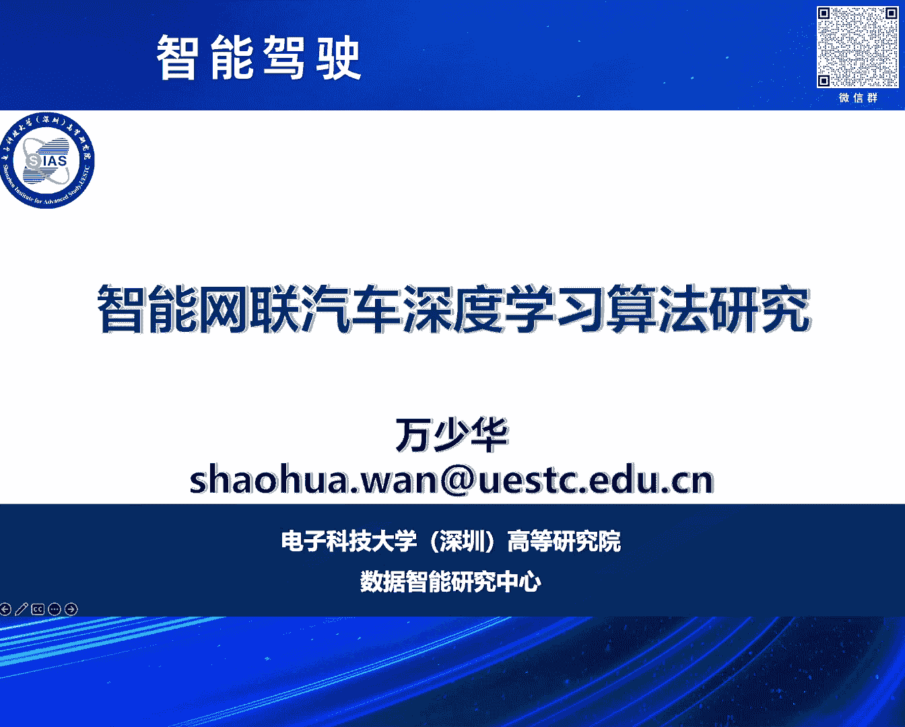
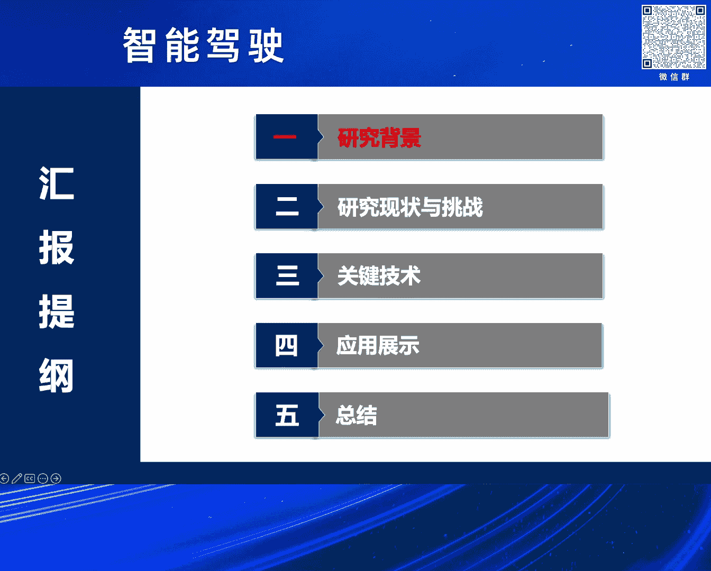
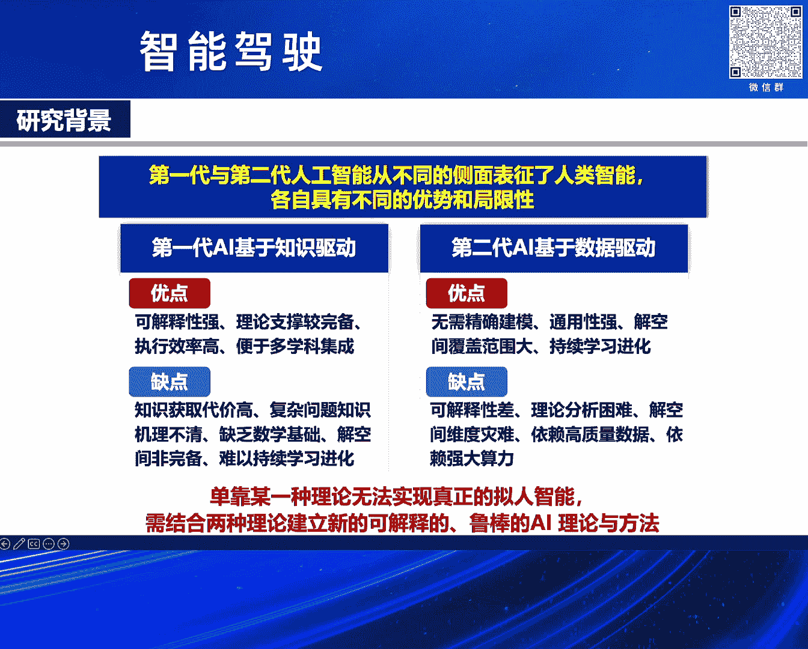
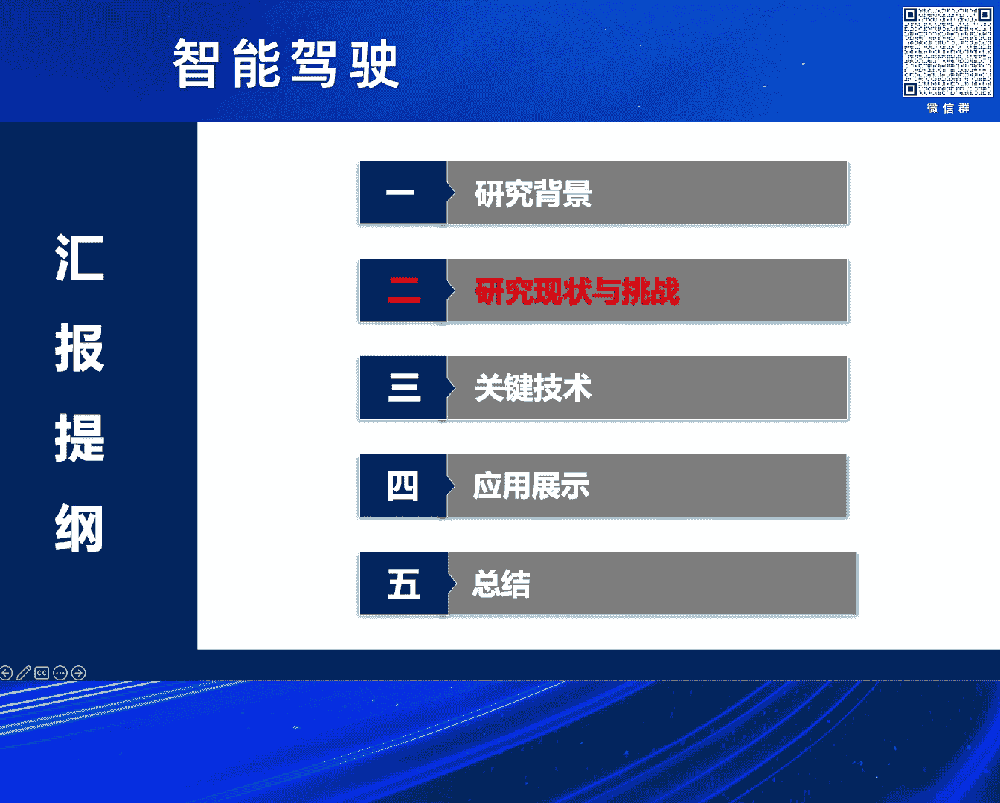
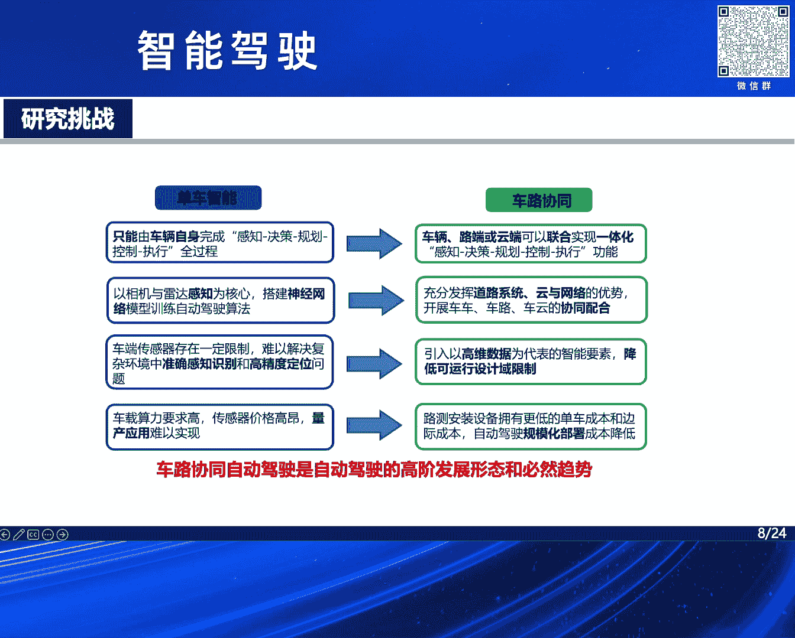
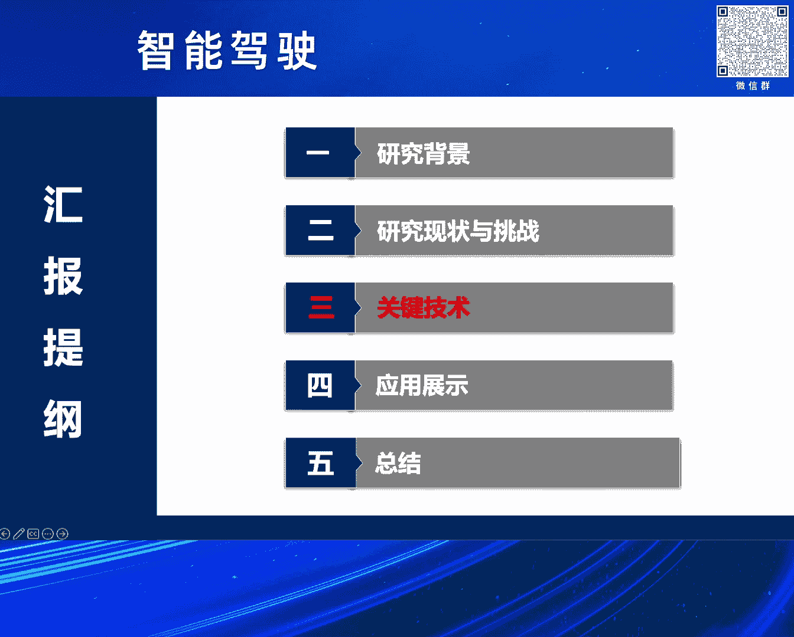
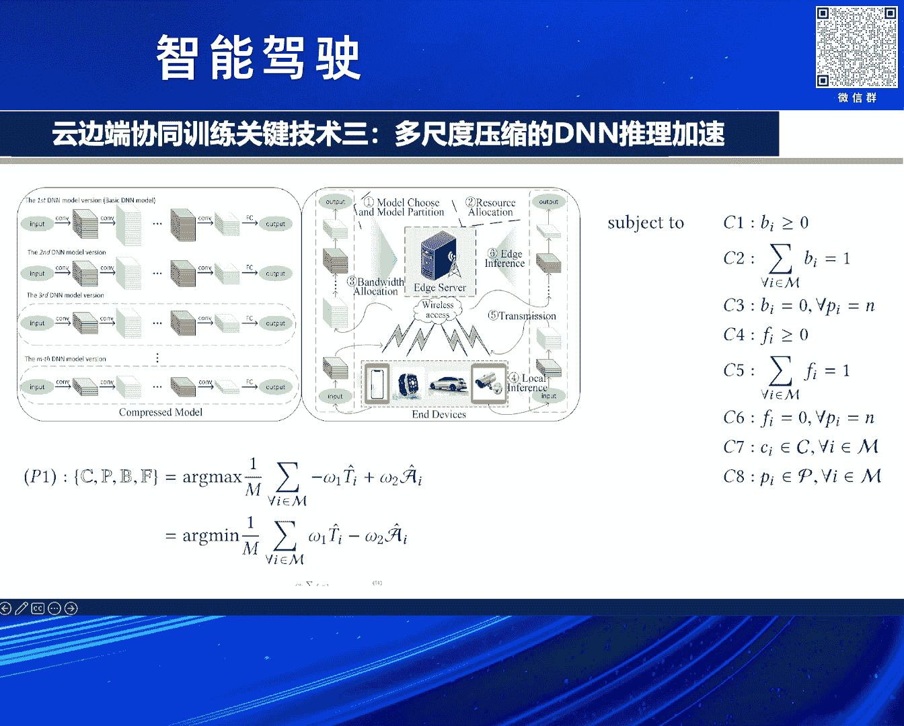
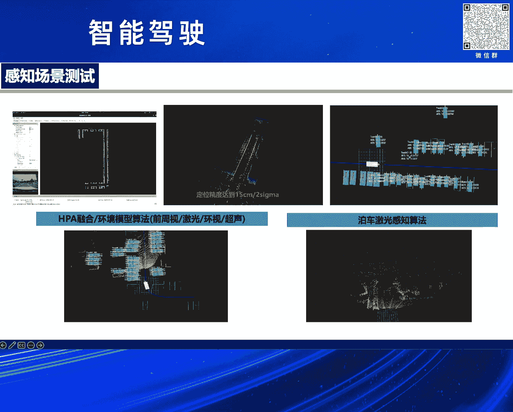
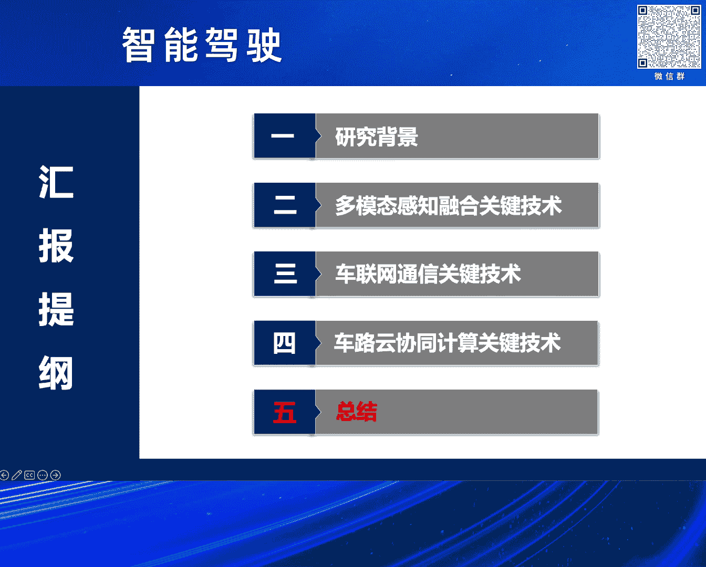
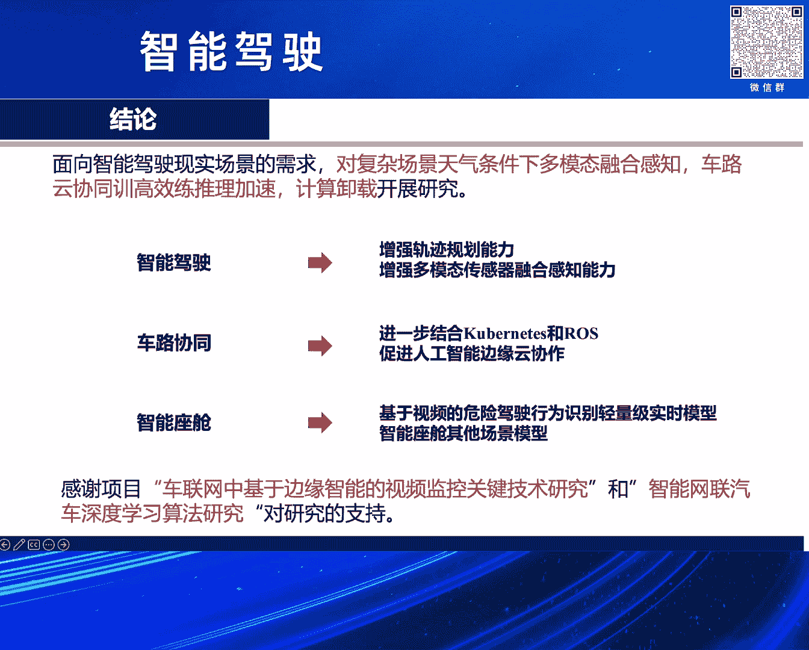

# 2024北京智源大会-智能驾驶---P8-智能网联汽车深度学习算法-万少华---智源社区---BV1Ww4m1a7gr
## 课程编号：P8

在本节课中，我们将要学习智能网联汽车领域深度学习算法的研究背景、现状、挑战以及相关实践工作。课程内容涵盖从单车智能到车路协同的演进，以及如何利用多模态融合、云边端协同等技术解决复杂环境下的感知、决策与计算问题。

---

### 研究背景 🌍

人工智能驱动的车联网，是实现智能驾驶的根本保障。随着通信、感知与计算技术的发展，无线通信网络正向更高的移动性和更复杂的场景延伸。云计算与人工智能使得智能网联汽车的计算走出智能座舱，提供了高可靠性、大带宽、低延迟的通信传输。边缘计算降低了服务延迟，使体验能够做到强实时。车路协同是必然趋势，它能够将预训练好的模型卸载到边缘节点，降低延迟，提供定制化与个性化服务，同时降低数据上传至云端带来的隐私泄露风险。

智能驾驶是必然趋势。第一代与第二代人工智能从不同侧面表征了人类智能，各有优势与局限性。单靠某一种理论无法实现真正的拟人智能。需要结合理论，建立新的可解释、鲁棒的AI理论和方法。数据驱动与知识驱动相结合是重要方向。

解决交通安全与拥堵等民生问题是关键。每年都有大量交通事故与交通拥堵发生。例如，特斯拉曾将白色汽车误判为天空导致事故，谷歌也发生过类似事件。因此，实现更加可靠、安全、节能和舒适的智能驾驶是必然趋势。全球都在积极推动，自动驾驶系统的核心技术已成为全球战略制高点。中国制造2025和2035远景规划确定了智能驾驶为核心战略内容。今年6月，智能网联汽车的准入和道路管理规范试运行通知也已发布，加速推动其高质量发展。美国、欧盟和日本也在积极推进。

---

### 研究现状与挑战 ⚙️

上一节我们介绍了智能驾驶的背景与趋势，本节中我们来看看当前的研究现状与面临的挑战。

百度专注于路侧感知，因为感知是提供信息的基础，需要做到全方位、多角度、多视角和多模态的感知。中国联通基于移动边缘计算的新架构进行研究。华为基于V2X（车与万物互联）技术，包括车与路侧基础设施的新型部署，实现了多场景下的应用。

车路协同的实现需要分阶段推进，不可能一蹚而就。其中，感知任务在车路系统中具有重要地位，因为它是提供信息的基础，即协同感知。

以下是学术界关于车路协同与协同感知的一些研究概况。

单车智能面临安全性、运行设计域以及经济性方面的挑战。首先，安全性方面，单车智能在特定场景下，其辅助驾驶系统存在应对不足和失效的风险，安全性有待提升。其次，运行设计域方面，在雨天、雾天、雪天等恶劣天气的长尾场景，以及“鬼探头”现象下，感知能力仍有待提升。最后，为了做到全方位、多视角、多模态的融合感知，需要在单车部署更多传感器和高性能通信设备，这自然导致单车成本的增加。

单车智能与车路协同并非完全对立。单车智能指在车辆本身完成自动感知、规划、决策和控制执行的全过程，搭载神经网络进行自动驾驶算法。车路协同则实现车路云一体化，实现感知决策一体化，充分发挥道路、路侧、云和边缘计算的协同配合。这两种技术各有优势与不足，它们的融合是未来的趋势。车路协同能够实现自动驾驶的上限，而在车路系统中，仍然需要单车智能。

---

### 科学研究与实践 🧪

上一节我们分析了现状与挑战，本节中我们将介绍针对这些挑战所进行的一些科学研究与实践工作。

以下是本团队研讨的几个核心科学问题：
1.  **高移动性与动态拓扑**：车辆网络具有高移动性和动态变化的拓扑结构。
2.  **异构与海量数据**：车端产生异构、海量的数据。
3.  **新型体系架构**：需要适应通信与计算需求的新型整体体系架构。
4.  **精准感知**：需要实现多模态、多视角的精准感知。
5.  **模型轻量化与可解释性**：复杂的深度学习模型需要轻量化、模型分割、压缩等知识蒸馏技术。
6.  **低延迟服务**：面向数据时效性和缓存卸载，需要实现低延迟、高可靠、强实时的服务，例如将训练好的模型卸载到路侧或边缘服务器。

#### 1. 感知技术：不良天气条件下的感知

我们首先关注感知技术，特别是在不良天气条件下的感知。

**工作一：基于多模态融合的未知天气端到端自动驾驶**
*   **针对问题**：不良天气条件下，多元异构数据难以融合；多阶段自动驾驶存在误差累计。
*   **解决方案**：提出了一种新的端到端架构。该架构接受两个输入：二维RGB图像和BEV（鸟瞰图）图像。通过**灵活映射**和**弹性解耦**两种方法，以及多头注意力机制和CNN来融合多模态数据，获得更可靠的驾驶环境感知。此外，还输入路径点和车辆速度信息，用于高级导航引导和车辆控制。
*   **核心方法**：
    *   `灵活映射` 与 `弹性解耦`：提高融合特征的鲁棒性，避免不良天气下性能下降或特征丢失。
    *   经过联合映射、弹性结构、多层规划机制和多层注意力机制，最终形成灵活的特征向量。
*   **评估**：在仿真系统中对端到端自动驾驶算法性能进行评估，在复杂多变场景下验证模型。性能指标包括驾驶得分（DS）、路线完成率（RC）和每公里违规数（IS）。实验在多个区域（Town01-Town05）进行，结果显示本方法在各项指标上均具优势。

**工作二：互学引导的语义感知增强**
*   **针对问题**：恶劣天气下物体检测不可避免。现有研究多集中于区域检测和语义分割，但未考虑两个任务间的相互作用。
*   **解决方案**：提出了**CEMGN（互学引导的直线度增强互图网络）**，使两个任务相互激励，提高各自任务的鲁棒性。
*   **核心方法**：
    *   构建双任务（语义分割和边界区域检测）的直线度增强模块，将特征图转化为图特征，提高任务鲁棒性，降低欧几里得空间的特征损失。
    *   使用`INTEGRAPH`推理来估计任务间差异，提取模块的高级特征。
*   **评估**：在Cityscapes和Foggy Cityscapes数据集上验证，交并比（IoU）达到80%左右，在雾天扰动下性能波动低于1%。实验表明，本方法在平均准确率和平均交并比上均占有优势。

**工作三：复杂城市环境下的交通要素识别**
*   **针对问题**：城市环境复杂，交通要素（如车辆）识别困难。
*   **解决方案**：改进了YOLO模块，加入通道注意力机制。
*   **核心方法**：
    *   引入`High Resolution`模块到YOLO中。
    *   低分辨率网络特征与高分辨率网络特征并行连接，以降低低分辨率网络特征的信息丢失。
*   **评估**：在Cityscapes数据集和自制数据集上进行性能对比，指标包括误检率和漏检率，结果显示本方法性能更优。

**工作四：交通流量预测**
*   **针对问题**：单一的深度学习方法面临过拟合风险。
*   **解决方案**：使用动态权重融合两种模型，提高预测精度和泛化能力。结合了**LSTM模型**和**SAE（堆叠自编码器）模型**。
*   **评估**：使用MSE（均方误差）指标，值越小表示预测值与真实值差距越小。实验结果显示本方法的MSE值最小。

---

#### 2. 云边端协同训练关键技术 🖥️📱

接下来，我们看看如何通过云边端协同来优化训练与推理过程。

**工作一：车载编码联邦学习**
*   **针对问题**：联邦学习带来高通信开销，对高隐私数据构成巨大挑战。
*   **解决方案**：提出车载编码联邦学习，旨在压缩通信量，降低模型更新频率和大小，从而降低通信成本。
*   **核心策略**：
    1.  **本地训练策略**：减少通信轮次。
    2.  **部分客户端参与**：并非所有客户端每轮都参与。
    3.  **约束上传时间**。
    4.  **高效聚合策略**。
*   **评估**：验证了通信成本的降低以及收敛速度的提升。

**工作二：基于增量训练的DNN计算卸载**
*   **针对问题**：计算卸载算法存在灾难性遗忘问题，模型需要重新训练以提高准确性。
*   **解决方案**：提出一种增量训练方法，减少训练通信成本，提高快速收敛能力。
*   **对比算法**：与随机卸载、本地计算、贪心算法（Greedy）等基线方法对比。
*   **优化目标**：灵活优化，同时考虑延迟和能量消耗。当参数 `β = 0` 时优化延迟，`β = 1` 时优化能量。

**工作三：多尺度压缩的DNN推理加速**
*   **针对问题**：边缘环节的动态性、车辆的动态性以及终端设备的多样性，对模型划分提出了重大挑战。
*   **解决方案**：将问题建模为一个混合整数优化问题，灵活优化模型选择（延迟敏感型或计算密集型）、模型分割点以及带宽等资源分配，以最大化推理准确性和延迟之间的权衡。
*   **系统架构**：云端进行离线训练，边缘进行在线推理。
*   **决策内容**：
    1.  DNN模型版本选择。
    2.  资源分配决策。
    3.  根据任务属性（计算量重或延迟敏感）进行动态优化。

**工作四：模型分割与轻量化技术**
*   **针对问题**：在资源受限的车端或边缘端部署计算密集的大模型非常困难。
*   **解决方案**：提出模型划分与计算卸载策略。考虑DNN模型的最优分割点随计算资源分配变化的问题，改进粒子群优化（PSO）算法。
*   **轻量化实践**：改进YOLO模型，使用`Dense Block`和`Residual Block`，并在块之间添加池化层以减少特征丢失。将视频分析任务转移到边缘端。
*   **结果**：模型压缩后，准确率略有下降，但检测速度（FPS）得到显著提升。

---

#### 3. 深度强化学习与计算卸载 🤖

最后，我们探讨如何利用深度强化学习来优化动态环境下的计算卸载。

**工作一：移动感知的深度强化学习卸载**
*   **针对问题**：车辆高动态性、拓扑时变性以及卸载任务的数据依赖性，使得高效卸载面临巨大挑战。
*   **解决方案**：构建车路系统计算卸载模型，提出考虑响应时间和能耗的优化问题，并设计基于深度强化学习的移动感知相关任务卸载方案。
*   **方法**：将最优任务卸载方案表述为一个受约束的马尔可夫决策过程（CMDP），利用深度强化学习解决感知决策序列问题。

**工作二：深度强化学习用于资源分配**
*   **针对问题**：车内网/车际网资源负载不均衡，资源受限且需求动态。
*   **解决方案**：提出多目标资源分配方案，将其建模为多目标优化问题，并开发一种基于非支配排序的遗传算法（NSGA）来解决。
*   **结果**：实验表明，该方案能将延迟改进26%，整体资源可用性提高42%。

---

### 应用展示与总结 🎯

本节课中我们一起学习了智能网联汽车深度学习算法的多个方面。

我们面向智能驾驶现实场景的需求，围绕以下三个方面的关键技术展开研究：
1.  **复杂场景感知**：针对不良天气条件（雪、雨、雾），研究多模态融合感知。
2.  **高效训练与推理**：研究车路云协同的高效训练和推理加速技术。
3.  **智能计算卸载**：研究基于深度强化学习的计算卸载技术。

未来的智能驾驶希望能够实现：
*   **多模态融合**：全视角、多模态、多智能体融合，提高感知精准度。
*   **车路协同深化**：实现大小模型协同，促进知识共享。
*   **轻量化部署**：结合边缘计算，部署更加轻量级、实时的模型，推动技术落地。

本研究得到了国家自然科学基金和深圳市重点基金的支持。

---