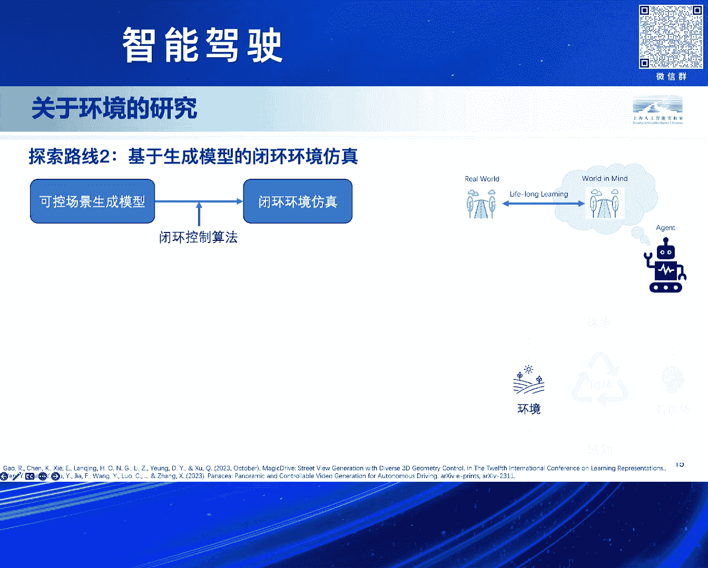
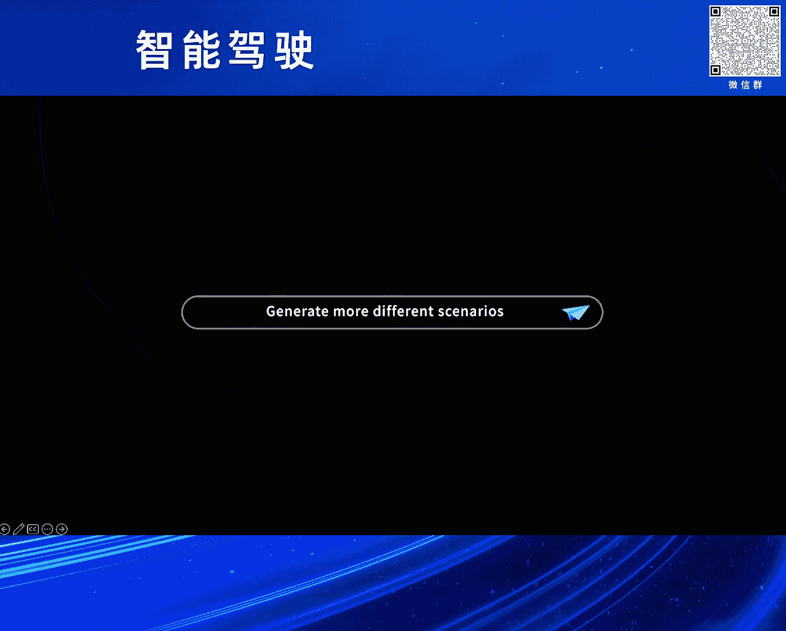
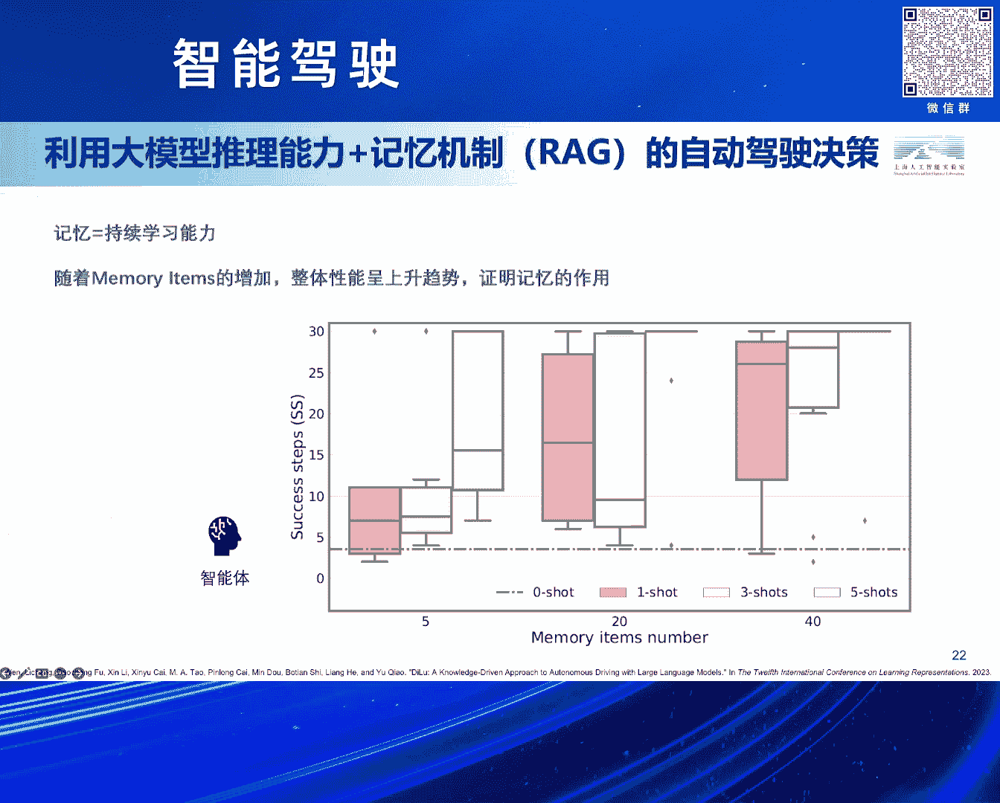
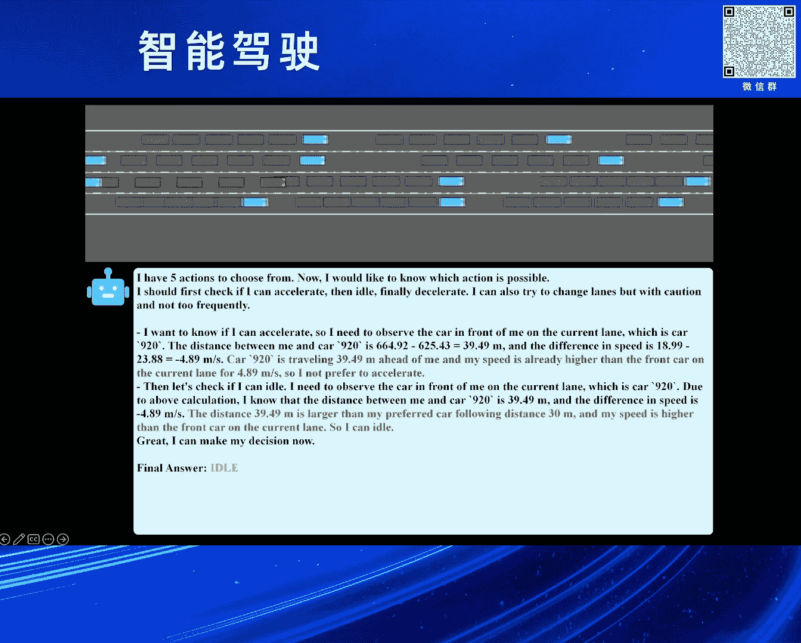
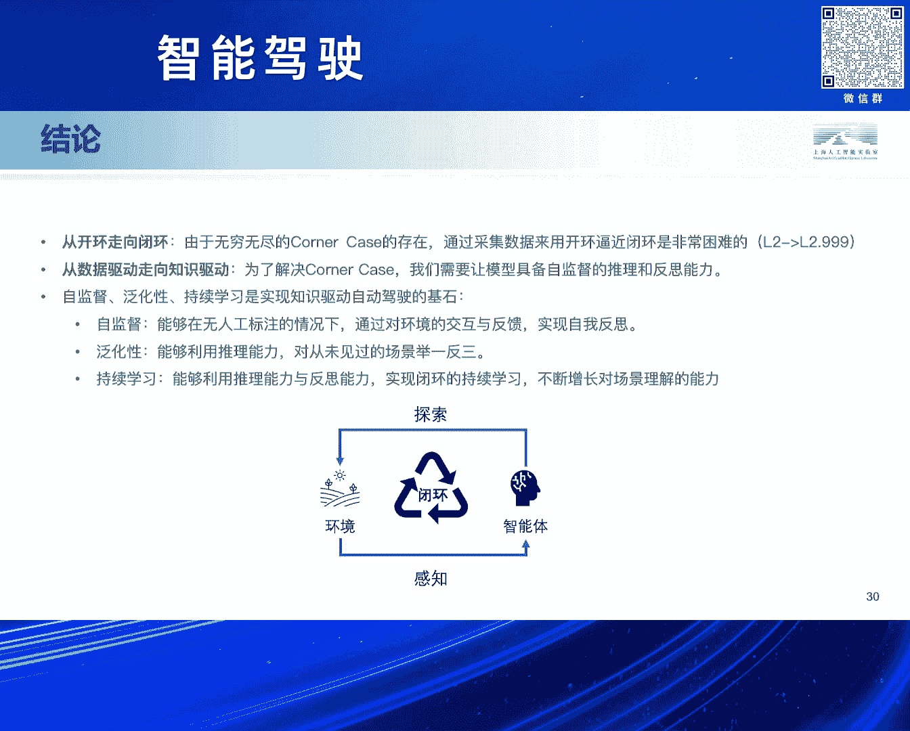

# 2024北京智源大会-智能驾驶---P9-从数据驱动到知识驱动--自动驾驶新路径-石博天---智源社区---BV1Ww4m1a7gr

## 课程概述

在本节课中，我们将学习自动驾驶领域的一条新兴技术路线——从数据驱动转向知识驱动。我们将探讨传统数据驱动方法面临的瓶颈，并深入了解如何利用具身智能、大模型和闭环仿真等技术，构建具备自监督、高泛化性和持续学习能力的自动驾驶系统。

---

## 自动驾驶的挑战与瓶颈

上一节我们介绍了课程的整体方向，本节中我们来看看自动驾驶发展至今面临的核心挑战。

自动驾驶技术发展已近40年。早在1986年，卡内基梅隆大学的Navlab实验室就推出了原型系统。到1995年左右，他们的第五代系统实现了横跨美国的壮举。然而，整个过程中仍有约2%的场景需要人类驾驶员接管。直到30年后的今天，这最后的2%仍未得到完全解决。

数据驱动的方法似乎遇到了瓶颈。业界原本预期通过增加传感器和数据来实现从L1到L5的迭代。但实际情况是，系统性能在达到L2级别后仿佛遇到了一面墙，难以突破至L3。究其原因，主要在于存在各种各样的**长尾场景**。这些场景不仅罕见，甚至可能是一辈子都不会遇到一次的数据。

以下是几种真实发生的长尾场景示例：
*   道路上出现异常物体。
*   极端或罕见的天气与光照条件。
*   复杂且不规则的交通参与者行为。

---

## 人类学习的启示与新路径特征

面对数据驱动的瓶颈，研究团队开始从人类学习驾驶的过程中寻找灵感。

为什么一个青少年只需要大约20小时的练习就能学会开车？并且大部分人首次遇到从未见过的场景时，也具备一定的解决能力？这是一个值得深思的问题。

数据驱动方法的困境在于其泛化性难题。它通常在固定场景上训练，任务的定义形式限制了其能力上限。例如，传统的目标检测模型通常不会定义去检测“路上是否有飞机”。

知识驱动的方法则不同。它利用跨领域的知识能力，例如多模态大模型或预训练技术。这些技术首先具备对通用场景和物体的理解能力，并且能以较低成本迁移到真实环境中，从而完成一些数据驱动方法难以想象的任务。

基于此，我们认为一条可行的自动驾驶新路径应具备以下几个核心特征：
*   **泛化性**：能够处理未见过的场景。
*   **自监督**：具备自我反思和从经验中学习的能力。
*   **持续学习**：能够不断积累和优化知识。

---

## 构建知识驱动自动驾驶：环境与智能体

上一节我们探讨了新路径的特征，本节中我们来看看如何具体构建知识驱动的自动驾驶系统。我们主要从**具身智能**的视角出发，其核心是**环境**与**智能体**的交互。



智能体在环境中进行感知、探索和决策，整个过程在一个**闭环**下完成。我们团队的研究也围绕这两个方面展开。

### 构建高保真虚拟环境


训练自动驾驶算法最好的环境是真实世界，但直接训练要么不闭环（仅使用预先采集的数据），要么不安全。因此，构建一个能够高度还原真实世界的虚拟环境至关重要。

我们探索了两条技术路线来构建这样的虚拟环境。

**第一条路线：基于神经渲染与交通仿真**



这条路线包含三个部分：重建、泛化与生成。

1.  **重建**：利用真实世界数据，通过神经渲染技术进行三维重建。
2.  **泛化**：对场景进行编辑，例如利用交通流生成工具创造出真实世界中不存在但合理的交通场景（尤其是长尾场景）。
3.  **生成**：使用神经渲染技术将编辑后的场景渲染生成出来。

我们提出了一个名为 **NeuroSim** 的开源框架。它的特色在于采用SDF（有符号距离函数）表征，能够对动态和静态的前后景物体实现解耦的三维重建，并支持多种传感器（如激光雷达）的仿真。

同时，我们开发了 **LimeSim**，一个开源的高一致性交通流仿真工具，能从真实数据中学习不同驾驶风格。将NeuroSim与LimeSim结合，我们构建了端到端的仿真引擎 **OE Sim**。

**第二条路线：基于生成模型的闭环仿真**

由于基于神经渲染的路线对数据质量要求高、流程长，我们同时探索了第二条更直接的路线：利用可控生成模型实现闭环仿真。

其核心架构非常简单：
```python
# 伪代码示意
生成图片 = 可控生成模型(输入路网结构 + 自车/他车状态)
```
我们利用如MagicDrive、Panacea等基于布局（Layout）可控的图像生成工具，结合LimeSim仿真器，能够生成全新的、连续的驾驶场景帧，从而形成一个纯粹的、基于生成模型的闭环仿真引擎。

通过这些技术，我们能够自动化进行4D标注、编辑场景（如增删物体、改变光照）、生成丰富的新数据，最终用于自动驾驶算法的训练和测试。

---

## 构建知识驱动自动驾驶：智能体设计



上一节我们介绍了如何构建虚拟环境，本节中我们聚焦于智能体本身的设计。



我们认为自动驾驶智能体的三个特征（自监督、高泛化性、持续学习）至关重要：
*   **自监督**：指智能体需要具备自我反思能力，不依赖外部标注信号进行反馈。
*   **高泛化性**：指智能体需要具备推理能力，而非简单记忆已知场景，以克服“灾难性遗忘”问题。
*   **持续学习**：基于前两种能力，实现经验的持续积累。

我们提出了一个**知识驱动自动驾驶的闭环训练框架**。智能体从环境中感知场景，理解并做出规划。执行后，结果成功或失败。成功的经验被保存，失败的经验则通过反思模块进行分析，并生成如何避免失败的修正信息，同样存入记忆库。当遇到新场景时，智能体会从记忆库中查询相似经验，结合当前场景特殊性做出决策。

### 融入大模型：从决策到闭环学习

大模型的出现为智能体提供了强大的推理和决策模块。

我们的早期工作 **CoDriving** 首次将大模型与自动驾驶决策相结合。在这个框架中，所有推理和决策模块都由一个大语言模型执行。实验表明，通过设置记忆上限并让模型积累经验，其性能会随经验增加而上升。

我们最新的工作 **CoAD** 则更进一步，模仿了人类决策的“快慢系统”：
*   **快系统**：类似“肌肉记忆”，能对常见场景快速做出决策。
*   **慢系统**：更理性、缓慢，具备深度推理能力，用于处理罕见或复杂场景。

当快系统决策出错时，会触发慢系统进行反思，生成修正经验。这些经验被用来定期优化快系统。这样，在绝大多数情况下只需调用高效的快系统，仅在必要时才启用慢系统，实现了高效且持续的知识积累。

### 针对驾驶场景的视觉语言模型

为了让大模型更好地理解驾驶场景，我们微调了一个视觉语言模型。我们合成了一个专注于自动驾驶价值信息的数据集，包含：
*   语义标签（如车辆、行人）。
*   危险物体（如近距离车辆）。
*   基础设施（如红绿灯、交通标志）。

使用仅约1万帧的数据对开源模型进行微调后，模型能为驾驶场景生成高度相关的描述，例如：“前方绿灯，但右侧有车辆正在靠近，建议保持车速并观察”。

### 实验验证

我们通过实验验证了该路径的可行性：
1.  **效果提升**：针对驾驶场景微调的小模型，在特定任务上能达到与GPT-4相当的效果。
2.  **数据高效**：系统通过自监督闭环形成驾驶经验，对人工标注数据的依赖极低。
3.  **泛化性强**：在一个城市训练得到的模型，迁移到全新城市时性能下降有限，说明学习到的“知识”（如交通规则）具备泛化性。
4.  **持续学习**：随着在环境中“反思”和运行轮次的增加，智能体的平均成功率呈现上升趋势。

---

## 课程总结

本节课中，我们一起学习了自动驾驶从数据驱动到知识驱动的新路径。

我们认识到，由于无穷无尽的长尾场景存在，仅靠采集海量数据的开环方式难以实现高阶自动驾驶。因此，转向知识驱动是一条值得探索的路径。



为了实现这一目标，我们需要让模型具备**自监督的推理和反思能力**。**自监督、泛化性和持续学习**是知识驱动自动驾驶的三大基石：
*   **自监督**使智能体能在无人工标注下与环境交互，实现自我反思。
*   **泛化性**利用推理能力，对未见场景举一反三。
*   **持续学习**结合推理与反思，实现闭环式的经验持续增长。

通过构建高保真虚拟环境、设计融合快慢系统的智能体架构，并利用大模型增强理解与决策能力，我们正在为自动驾驶突破现有瓶颈、实现真正的“智能”驾驶探索新的可能性。

---