# 2024北京智源大会-生成模型---P2-视频生成前沿进展-卢志武---智源社区---BV1DS411w7hz

在本节课中，我们将学习视频生成领域的主要挑战、当前主流的研究范式以及最新的技术进展。我们将从视频生成的难点出发，梳理两种核心的技术路线，并介绍包括Sora、Pika、Runway等在内的代表性模型，最后展望未来的发展方向。

## 第一部分：视频生成的三大核心挑战 🧩

上一节我们介绍了课程概述，本节中我们来看看视频生成面临的具体困难。视频生成相对于图像生成要困难得多，主要原因在于其需要考虑时间维度上的连续性。这导致了以下几个核心挑战。

### 挑战一：内容一致性难以保证
视频由多帧图像构成，生成时必须保证时间维度上的内容一致性。这种一致性体现在多个方面，例如故事情节的连贯性、人物身份（ID）的稳定性以及人物动作的流畅性。一个常见的失败案例是使用当前较好的开源模型 **Stable Video Diffusion (SVD)** 生成的视频中，人物可能出现肢体数量或动作不连贯的问题。

### 挑战二：计算资源消耗巨大
视频生成对计算资源的需求极高，无论是训练还是推理阶段。生成一张图片可能只需不到一秒，但生成一个仅5秒的720P高清视频（约120帧），就需要一次性生成所有帧。这不仅耗时，更关键的是对显存（GPU Memory）的占用极大，常常导致无法生成长视频，这是一个矛盾。

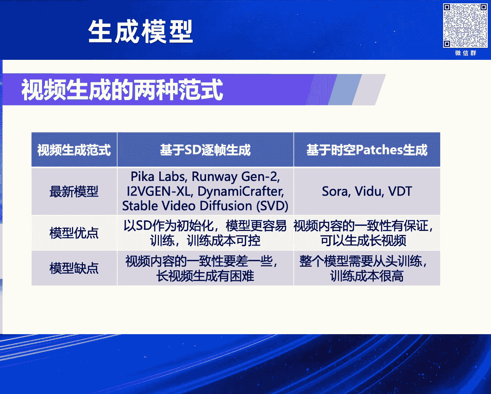

### 挑战三：可控生成极为困难
图像的可控生成（如通过ControlNet）已相对成熟，但视频的可控生成要困难得多。视频涉及更多额外因素，例如镜头角度、人物动作等。在视频生成本身尚未完善的情况下，实现精细的可控生成更具挑战性，但并非无法研究。

## 第二部分：视频生成的两种主流范式 🛠️

尽管挑战重重，但研究者们提出了多种方法。我个人观点认为，现有研究大致可分为两类范式。

以下是两种范式的核心思想：

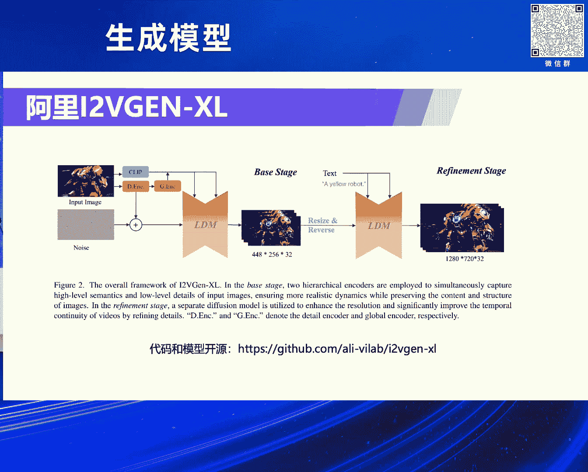

1.  **基于Stable Diffusion的逐帧生成范式**：以预训练的 **Stable Diffusion (SD)** 模型为基础，先生成单帧图像，再通过额外模块（如时间卷积、注意力机制）来建模帧间连续性，保证视频连贯性。
2.  **时空Patch整体生成范式**：将整个视频视为一个3D整体（时空块）进行一次性生成。这种方法天生保证了连续性，但缺点是需要从头开始训练，没有强大的预训练模型可用，对算力和数据要求极高。

目前，基于第一种范式（逐帧生成）的代表性工作包括：**Pika**、**Runway Gen-2**、阿里、腾讯的开源模型以及 **Stable Video Diffusion (SVD)**。
基于第二种范式（整体生成）的代表性工作包括：**OpenAI Sora**、**生数科技的Video** 以及我们团队的 **VDTR**。

## 第三部分：逐帧生成范式的最新进展 📈

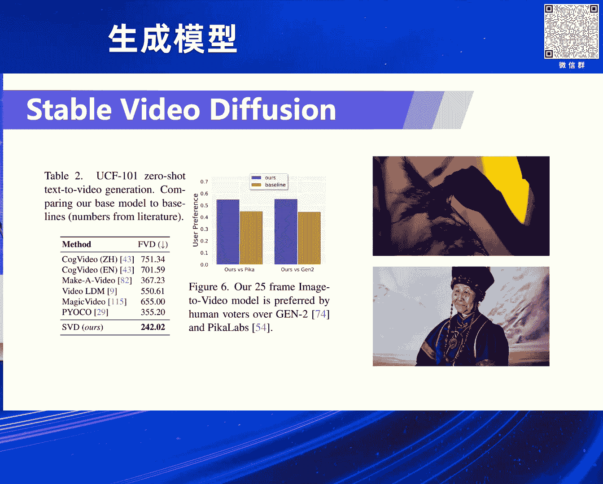

上一节我们介绍了两种范式，本节中我们详细看看基于SD逐帧生成方法的最新进展。

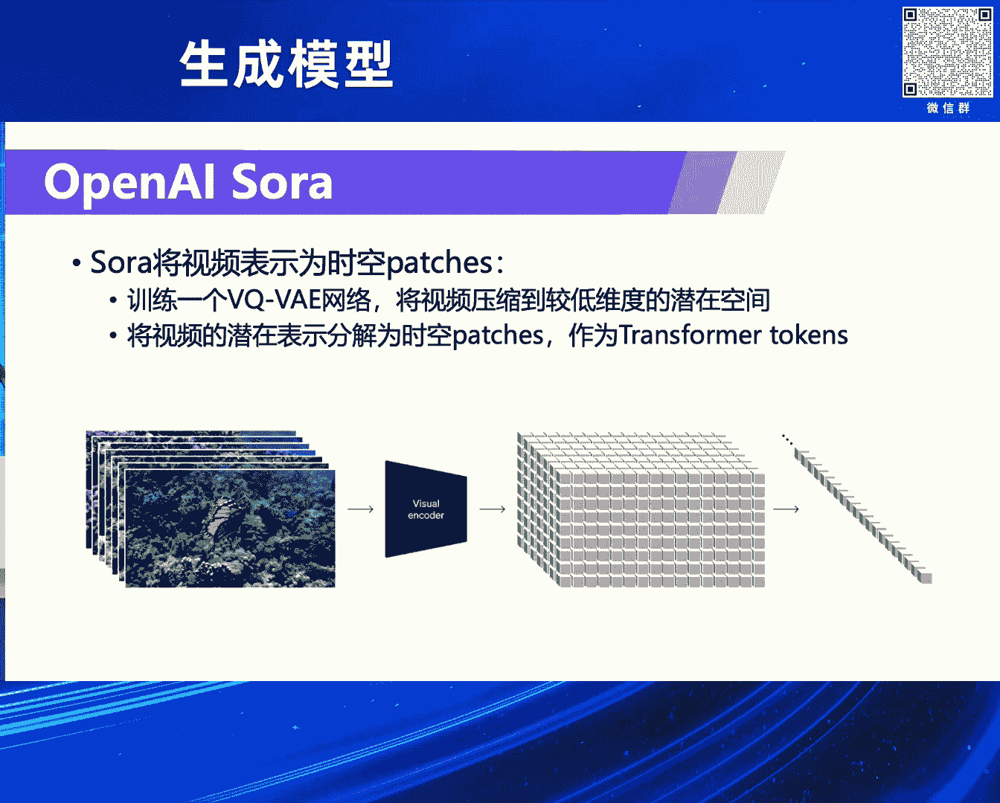

### 1. Pika
Pika是一个闭源模型，技术细节未公开。其核心思想推测是基于预训练的SD模型，额外加入时间维度的建模。它的一项关键技术是借鉴了文生3D模型中的“滑动窗口”并行计算加速方法，通过设计阈值来优化计算流程，节省算力。

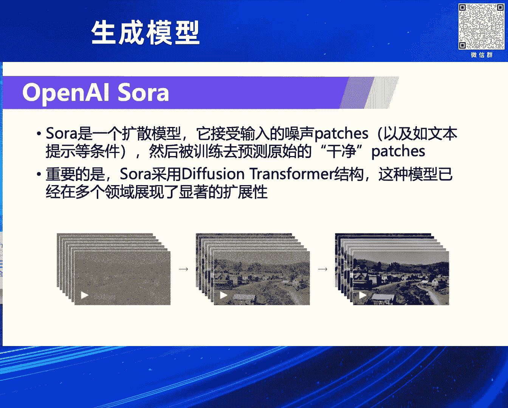

### 2. Runway Gen-2
Runway Gen-2同样未公开细节，但其前代模型Gen-1的技术已公开。Gen-1本质上是一个视频编辑模型，架构基于Stable Diffusion。其关键改进在于引入了视频的深度信息（Depth Map）作为3D条件，确保编辑后的视频与原视频在空间结构上保持一致。它在SD的2D卷积和注意力模块后，分别追加了1D的时间卷积和时间注意力层，从而引入了时间建模能力。
*   **时空卷积模块**：`Conv2D + Conv1D (Temporal)`
*   **时空注意力模块**：`Attention2D + Attention1D (Temporal)`

### 3. 开源模型对比
以下是三个重要开源模型的简介：

*   **阿里Model**：这是一个“图生视频”模型。采用两阶段生成：第一阶段根据输入图片生成低分辨率（448x256）视频；第二阶段利用超分模型将视频提升至高分辨率（如720P）。其底座是 **SD 2.1**。
*   **腾讯Model**：基于其之前的“文生视频”模型 **VideoCrafter** 改造而成，增加了图像条件输入，从而升级为“图文生视频”模型。底座同样是 **SD 2.1**。
*   **Stable Video Diffusion (SVD)**：这是目前开源领域效果最好的图生视频模型之一。它的两大改进是：
    1.  重新训练了VAE的解码器部分，在压缩/重建过程中就考虑了时间信息。
    2.  与Runway类似，在模型中加入了时间卷积和时间注意力模块，并且是**整个模型从头训练**，而非只训练新增部分，因此效果更好。

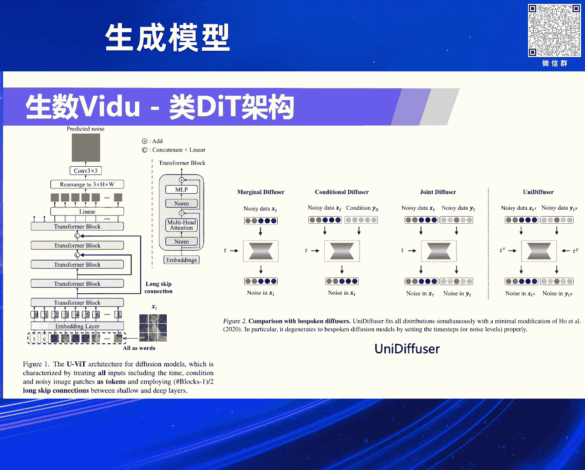

## 第四部分：时空Patch整体生成范式的最新进展 🚀

现在我们来介绍第二种，也是当前备受关注的范式——将视频作为时空Patch整体生成。

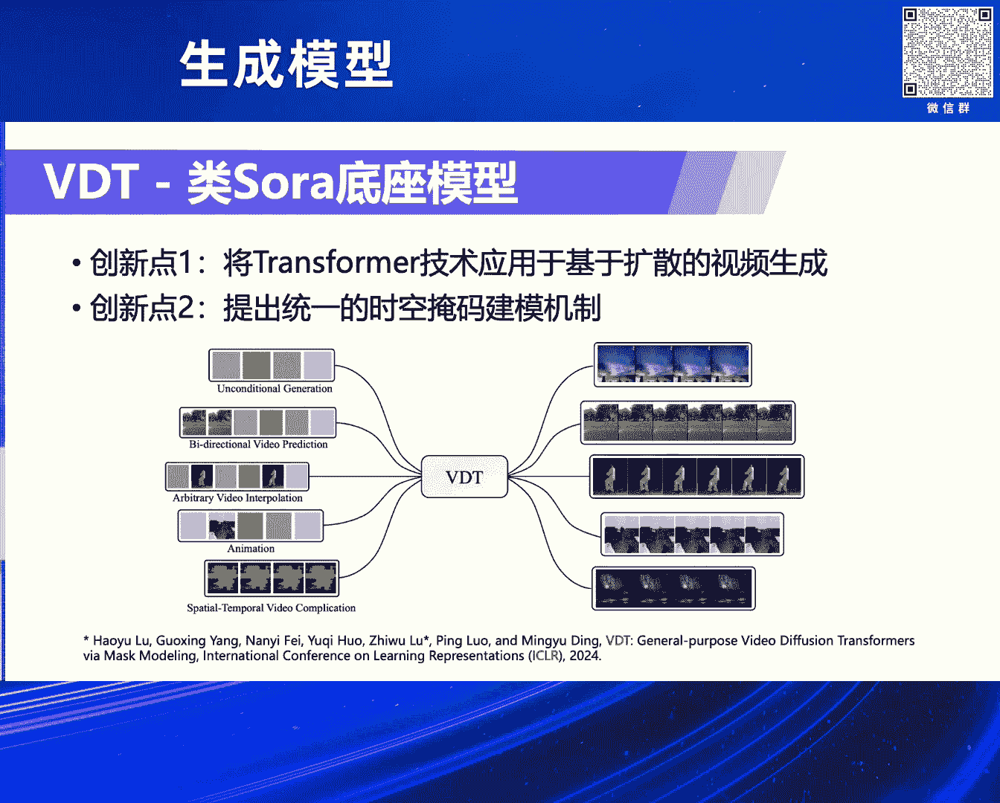

### 1. OpenAI Sora
Sora是推动该领域发展的关键模型。其核心步骤包括：
1.  **视频压缩与表示**：训练一个专门的 **ViT-VAE** 网络，将视频压缩到低维空间，并分解为3D的时空Patch（可视为Token序列）。
2.  **模型架构**：采用 **Diffusion Transformer (DiT)** 架构。这是一个扩散模型，接收带噪声的Patch和条件输入，训练目标是预测干净的Patch。OpenAI通过实验证明了该架构具有出色的可扩展性（Scaling Law），即增加模型计算量能持续提升生成质量。

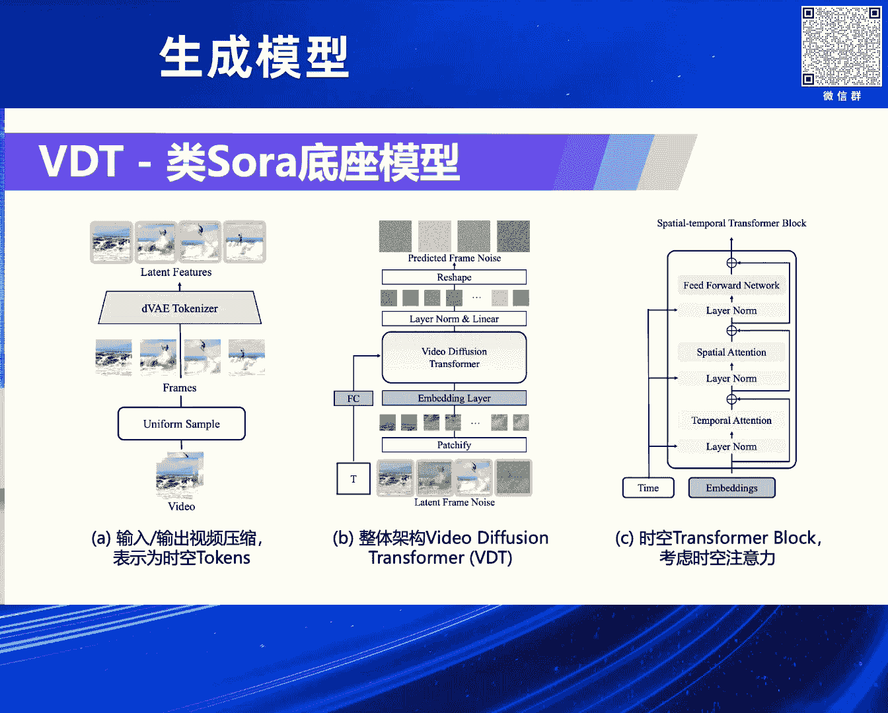

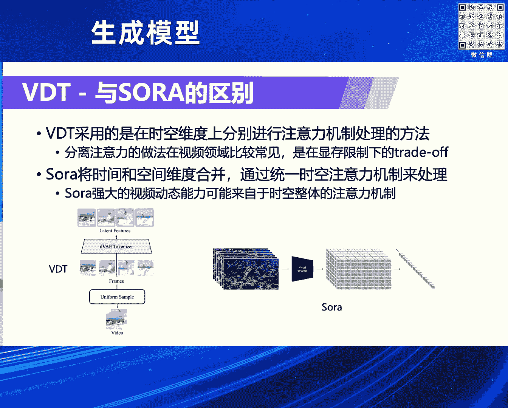

### 2. 生数科技 Video
该工作的核心思想是将图像扩散模型中的U-Net（CNN架构）替换为Transformer架构（即 **U-ViT**）。研究发现，将时间步（timestep）和文本条件（context）作为Token输入，并合理设计长跳跃连接（类似ResNet），能取得很好效果。最终在大规模数据上训练出 **U-DiT** 模型，并进一步扩展到视频生成，得到 **Video** 模型。

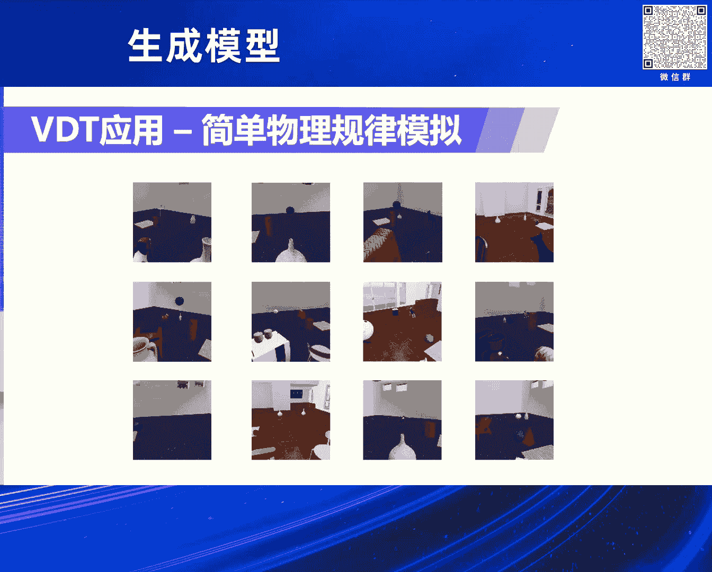

### 3. 我们的工作：VDTR
我们团队（高校）在2022年底就产生了类似Sora的想法，并于2023年5月将论文预发布在Arxiv上。我们的工作主要包括：
1.  **结合扩散与Transformer**：探索将Transformer技术应用于基于扩散模型的视频生成。
2.  **统一时空掩码建模**：提出统一的时空掩码训练方法，以覆盖各种视频生成任务。
由于算力有限，我们的设计与Sora存在两点主要差异：
*   **注意力机制**：我们采用 **时空分离的注意力** 以节省显存，而Sora使用 **3D合并的注意力**，效果更好但算力消耗大。
*   **训练任务**：我们主要聚焦于“图生视频”，因为“文生视频”需要更大量的数据才能出效果。尽管如此，我们的模型在当时已能学习到简单的物理运动规律（如加速运动）。

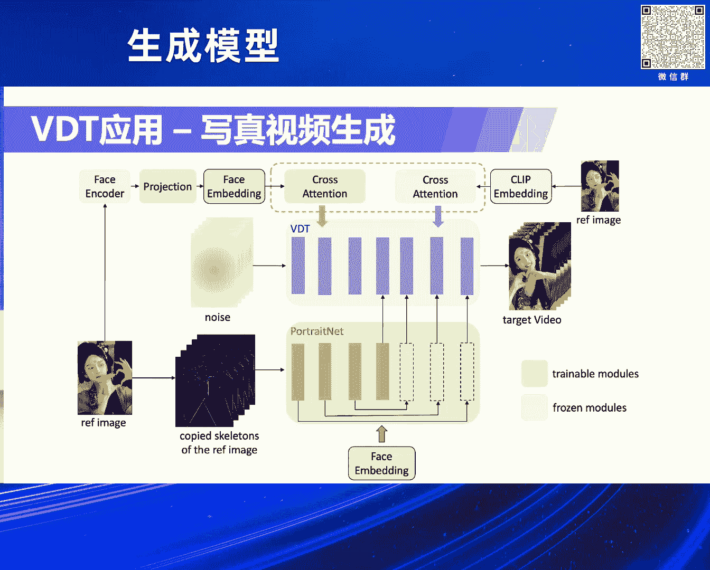

此外，我们在有限算力下选择在“人像视频生成”这一垂域进行深耕，通过加入人脸控制、人体骨架控制等技术，使生成视频在特定领域达到了商用级质量，证明了在资源受限下实现技术突破的可行性。

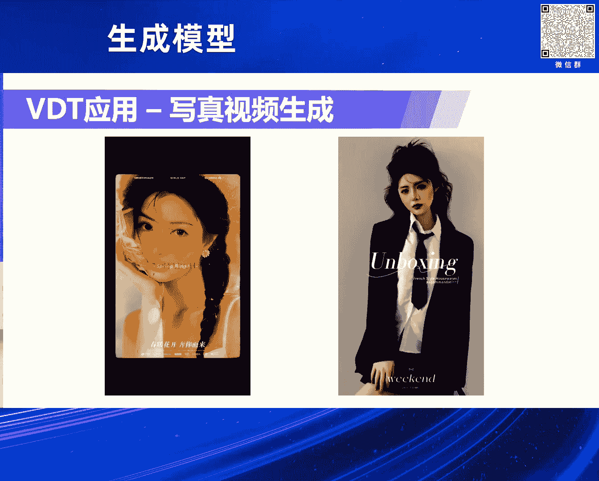

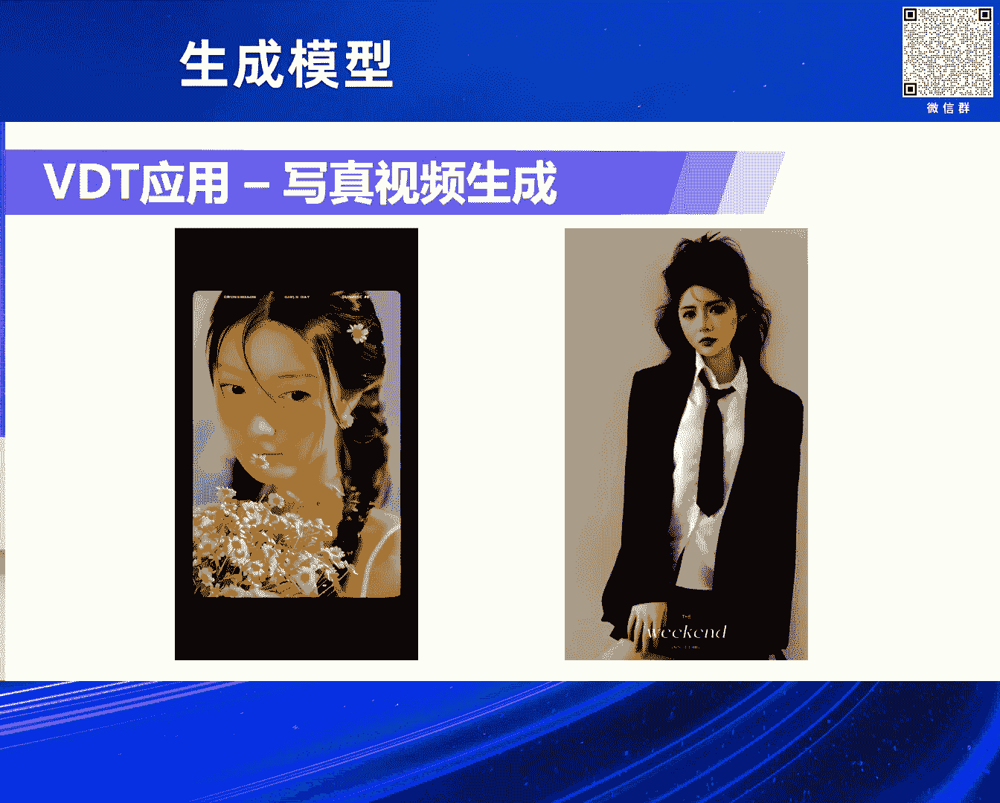

## 第五部分：未来展望与总结 🌟

最后，让我们对视频生成的未来进行展望。这些方向与开篇提出的三大挑战相呼应。

以下是未来一年可能的重要发展方向：

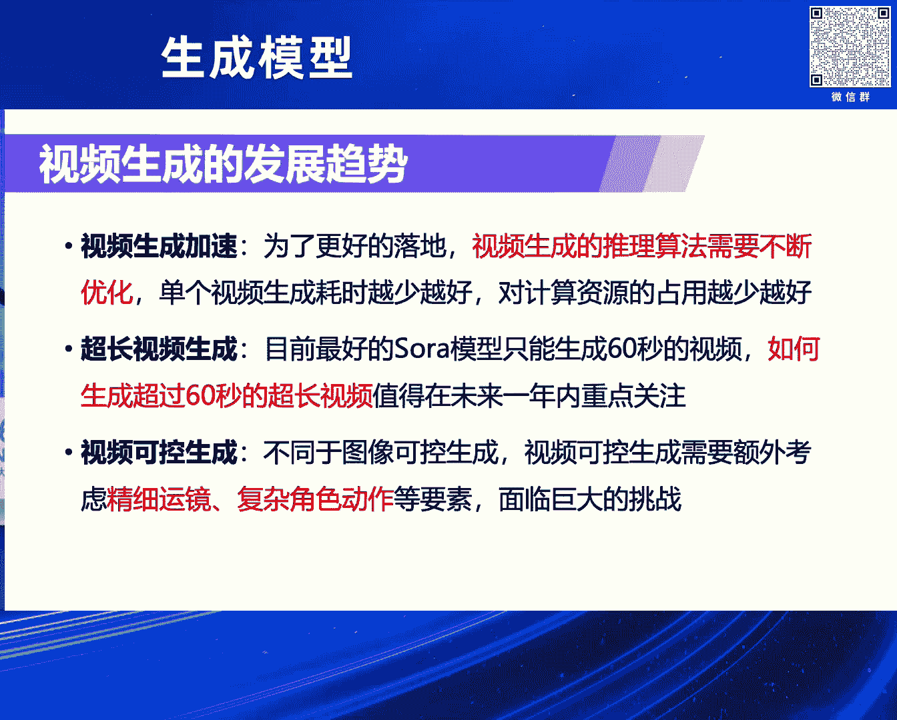

1.  **推理加速**：降低视频生成耗时，是走向商用的必经之路。推理加速技术相对更容易实现。
2.  **生成长视频**：突破生成长视频（如2分钟以上）的瓶颈。这可能不能仅依赖模型本身，还需要结合后期处理等技术。
3.  **视频可控生成**：这是普通研究者和高校团队可能更容易切入的方向。在通用大模型基础上，进行特定场景（如特定动作、镜头语言）的可控生成，所需算力相对较小，且应用前景广阔。

**本节课总结**：
本节课我们一起学习了视频生成领域的核心挑战、两种主流技术范式（基于SD的逐帧生成和时空Patch整体生成）以及各自的代表性模型（如SVD, Sora, VDTR等）。我们看到了从保证一致性、降低算力消耗到实现精细控制的发展脉络。尽管面临巨大算力门槛，但在特定垂域深耕或聚焦于可控生成等方向，依然存在重要的研究和应用机会。视频生成的道路虽远，但行则将至。