# 2024北京智源大会-生成模型---P3-Visual-Autoregressive-Modeling-Scalable-Image-Generation-via-Next-Scale-Predicti---智源社区---BV1DS411w7hz

## 概述
在本节课中，我们将学习一种全新的图像生成框架——视觉自回归建模。我们将探讨如何借鉴语言模型的成功经验，并将其应用于视觉生成领域，最终介绍一个名为“VR”的创新工作，它通过“下一代尺度预测”实现了高效、高质量的图像生成。

---

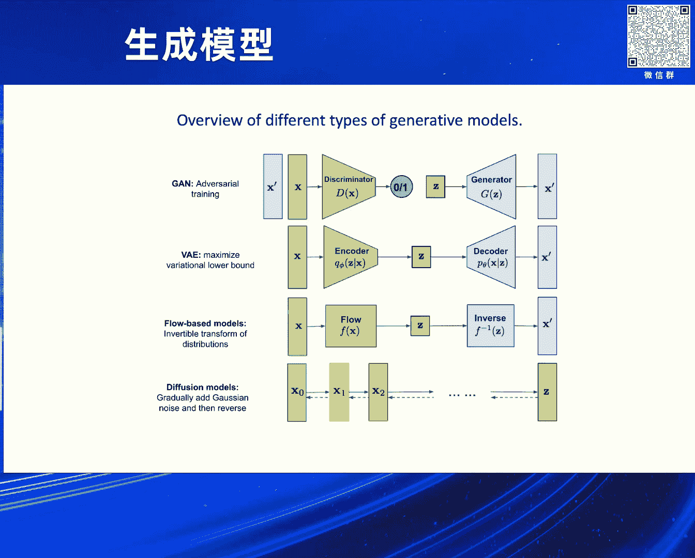

## 第一节：深度生成模型概览 🌐

首先，我们来介绍当前主流的深度生成模型。在视觉生成领域，早期的模型包括2020年之前的生成对抗网络。目前，大家非常关注基于变分自编码器或矢量量化变分自编码器的模型，以及罗老师介绍的时空块或时空特殊标记方法。此外，还有基于流的模型。从2021年开始，由OpenAI提出的扩散模型开始流行，包括贾森·霍姆的去噪扩散概率模型或宋飏老师的基于分数的模型。

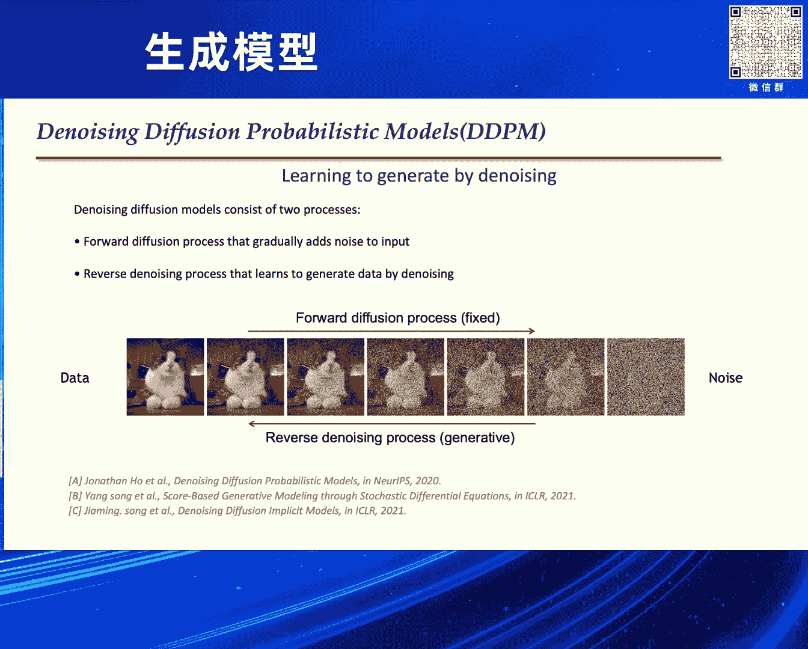

扩散模型大家应该比较清楚了，这里不再赘述。这些著名的工作包括去噪扩散概率模型、宋飏老师的基于分数的模型，以及贾明老师的去噪扩散隐式模型加速方法。我们将重点围绕自回归模型或语言模型，介绍我们探讨的一系列方法，以及从语言模型中借鉴的见解。

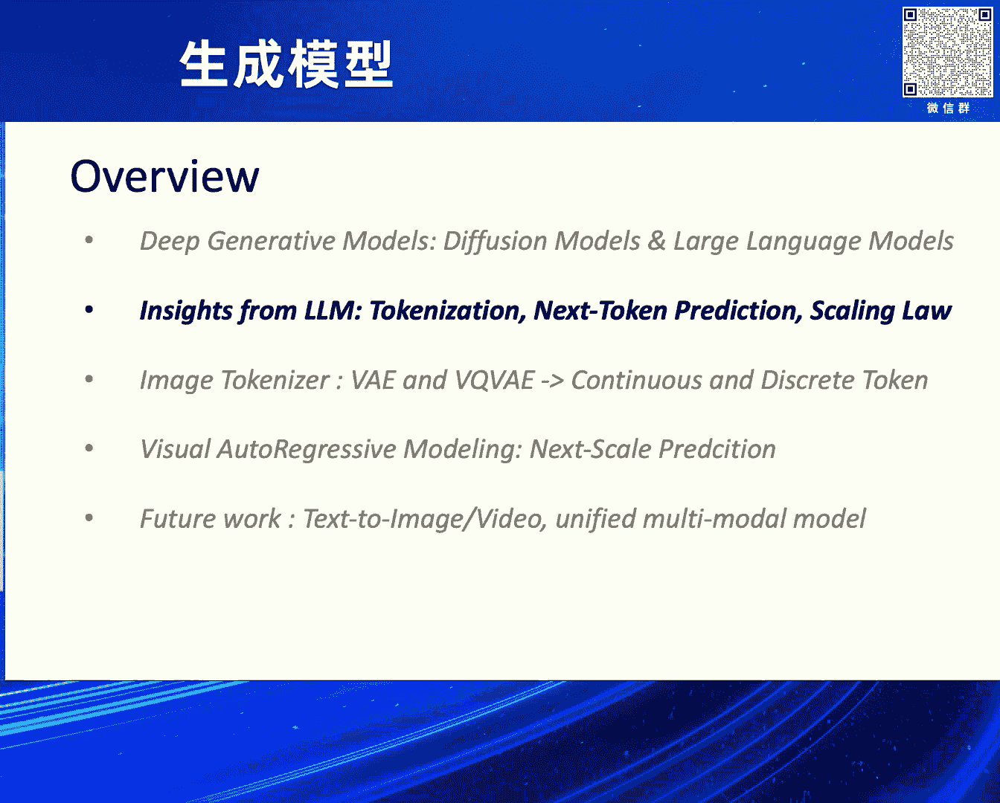

---

## 第二节：借鉴语言模型的成功经验 📚

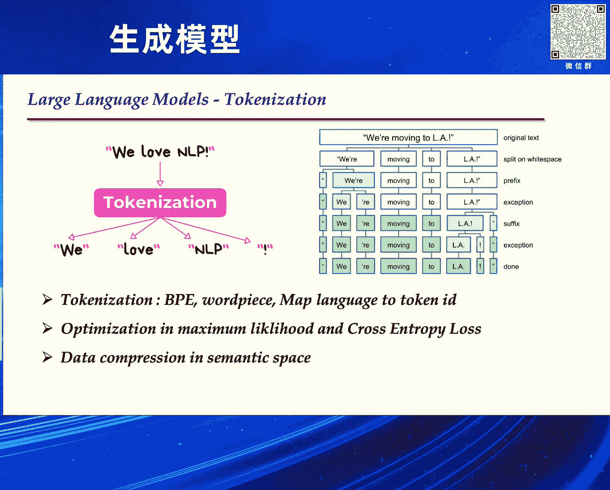

上一节我们介绍了各类生成模型，本节中我们来看看如何从语言模型中汲取成功经验，以改进视觉生成。这包括经典的标记化、下一个标记预测和缩放定律。

首先，我们来说一下像GPT这样的自回归模型是如何训练的。第一，通常需要一个标记化过程，例如字节对编码或词片切分。第二，基于这个标记化进行下一个标记预测。第三，基于这种预训练模型进行指令微调。最后，会有人类反馈强化学习来优化模型。

从语言模型的经验中，我们可以看到标记化、下一个标记预测和缩放定律是关键。有了缩放定律，结合下一个标记预测，大多数方法可以将模型规模扩大，包括扩大模型尺寸和计算量。

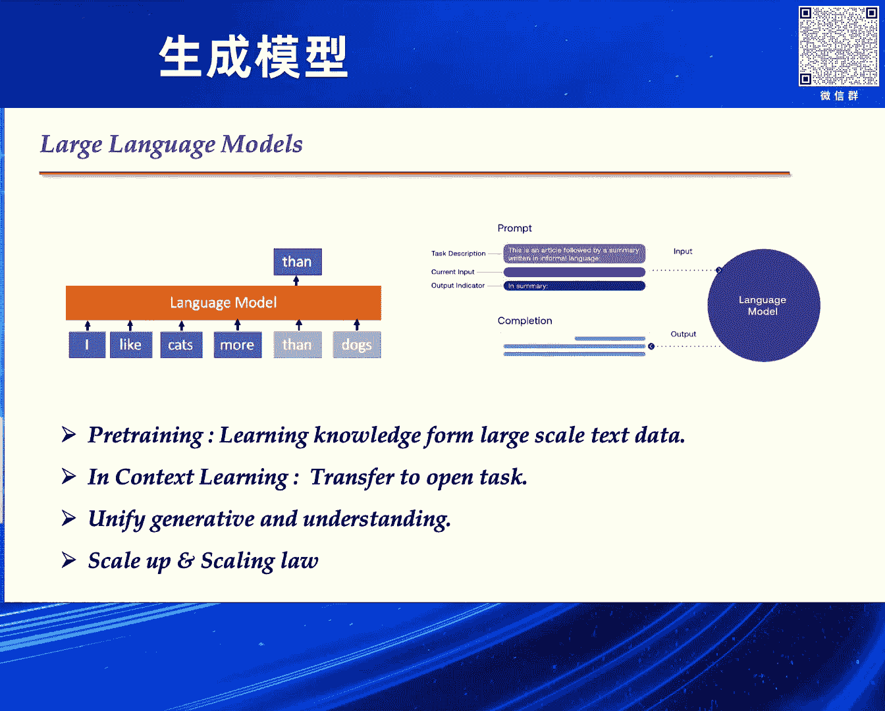

语言模型中最重要的部分是标记化，例如字节对编码或词片切分。其主要目的是将人类语言离散化。人类的语言是离散化的信息，包括我们写的字和说的话。将这些离散的语言单元化后，可以映射到标记ID。有了标记ID，就可以通过一个自监督的下一个标记预测任务，基于交叉熵损失和最大似然优化来优化整个模型。然后将整个模型规模扩大，包括使用更多的算力。

最后一点是，字节对编码或词片切分这类标记化是在语义空间上的，这与计算机视觉不同。计算机视觉中的矢量量化变分自编码器或变分自编码器更多关注底层信息，即低级信息。但自然语言处理中的这些标记化更多包含语义信息。因此，包括我们所有的视频生成或图像生成，以及未来的多模态任务，我们都更希望视觉和语义能更好地衔接。这也是计算机视觉目前尚未涌现出具有强大涌现能力的大模型的一个因素。

回到语言模型这一块，其预训练更多的是通过下一个标记预测，从大规模的文本数据中学习知识。在预训练阶段之后，它可以学到大量的语义知识，因为我们已经将文本标记映射到标记ID了。并且标记ID之间存在着分布关系。

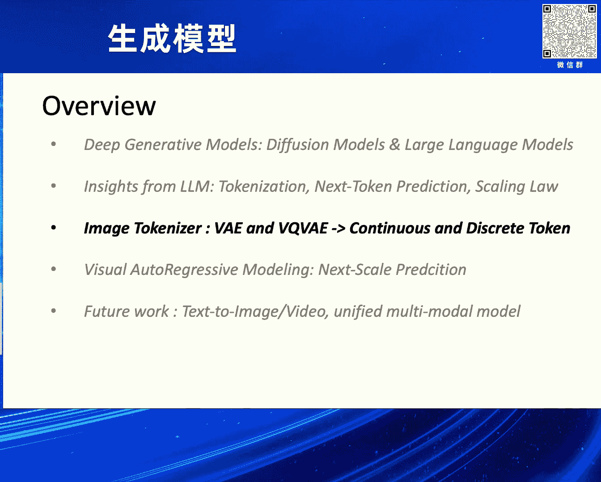

第二点是通过不同的预训练，它可以实现上下文学习。有了上下文学习之后，我们就可以将其迁移到一些开放任务上，例如进行少量样本学习或相关的新任务泛化。这也是与视觉非常不同的一个地方。因为自然语言处理中的所有任务都可以通过语言来描述和表述，但计算机视觉并非如此。计算机视觉有些离散的任务，有些连续的任务。离散的任务包括检测、分类或一些序列的离散任务。连续任务则包括分割或光流相关的任务。

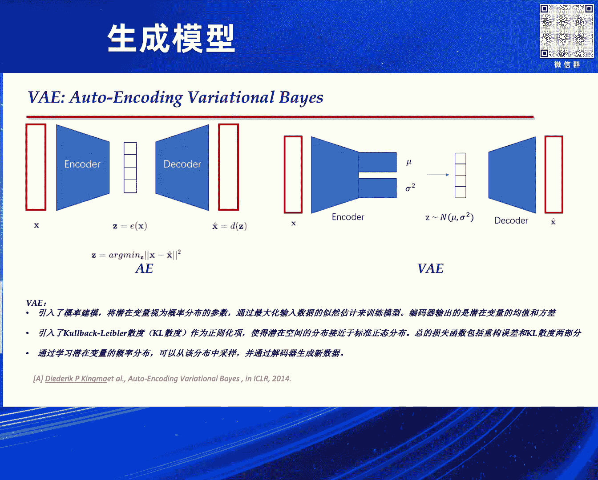

有了这一点差异，就产生了另一个极大的区别：语言这边可以通过一种统一的方式，因为语言既可以用于生成，也可以用于理解。有了语言这个桥梁，就可以统一生成和理解，但视觉目前还做不到。

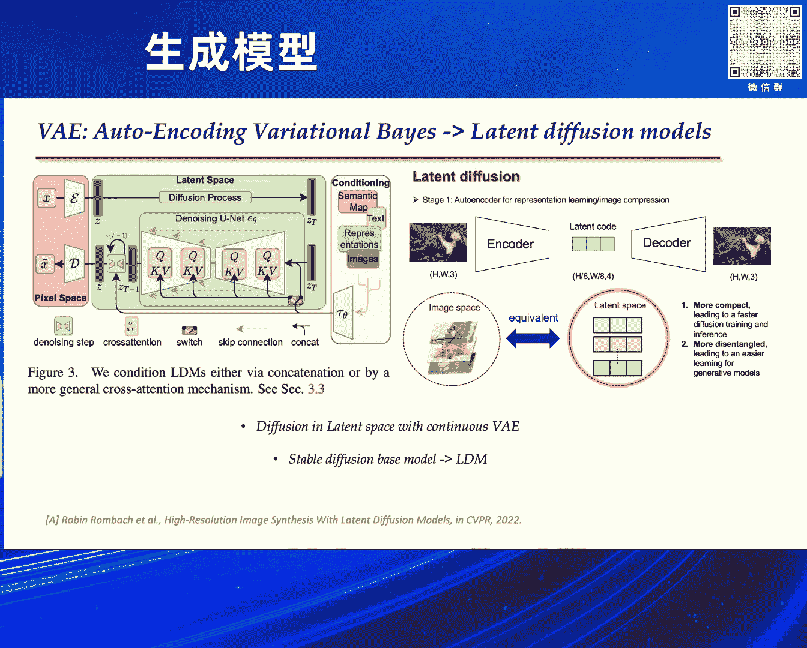

基于这几点优势，就有了语言模型的规模扩大和缩放定律等现象。

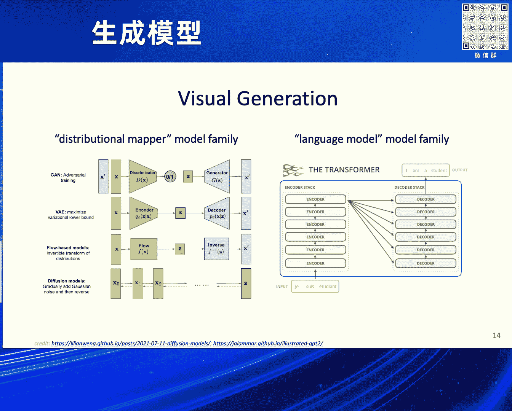

总结一下，为什么计算机视觉没有出现相关的工作？主要原因总结如下：第一，语言是人类通过几千年规律总结出来的，它具有高度的语义性和较高的信息密度，但计算机视觉则没有。计算机视觉具有更多的上下文信息，语言是一维的前后关系上下文，而计算机视觉包括二维的、时空的，还有三维或四维的。此外，专业数据有更多的模态信息，包括我们已知的视频图像像素、点云或红外信息。

自然语言处理中，可以通过一种基于上下文的预训练方式学习语义，但计算机视觉目前尚未被探讨到极致，因为计算机视觉的很多信息在底层可能没有语义。基于这些极大的不同，语言模型能够通过这样的范式，规模扩大到非常好的效果。但是计算机视觉生成这边，例如已知的文生图、文生视频，或者一些统一的深度理解任务，都没有在标记潜在空间上做到统一的生成和理解。

有了这些认识之后，我们不禁思考：如何能够借助计算机视觉特有的因素或本质，来学习语言模型这边的先进经验，包括标记化或进行语义压缩，包括我们去做一个基于上下文的、可规模扩大的预训练，以及基于标记潜在空间的生成和理解的统一。

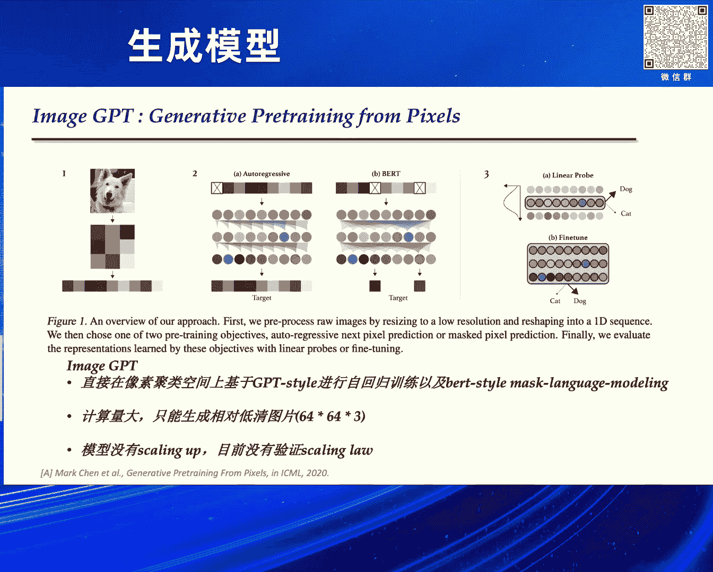

---

## 第三节：经典的图像标记化 🖼️

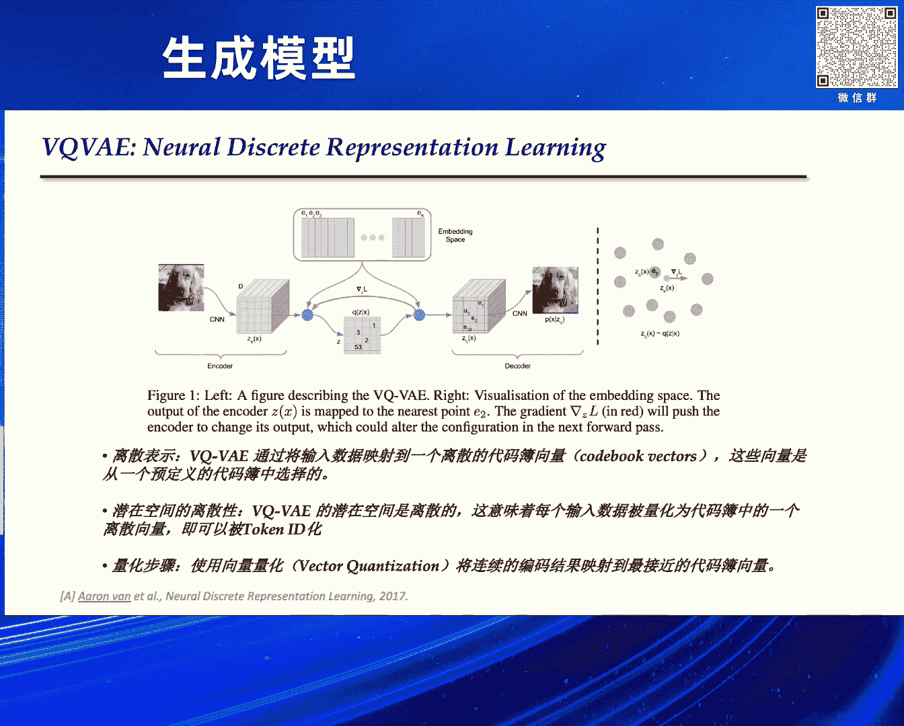

上一节我们探讨了从语言模型借鉴的经验，本节我们来看看图像领域的标记化具体应该怎么做。首先，图像领域离散和连续的标记化哪个效果更好？目前通过扩散模型这条路线来看，连续的效果似乎更好一些。但离散的最近又出现了非常多新的工作。

这些都绕不开一个工作，那就是变分自编码器。变分自编码器是2014年在ICLR上发表的一个工作。值得一提的是，它也获得了今年ICLR的时间检验奖。

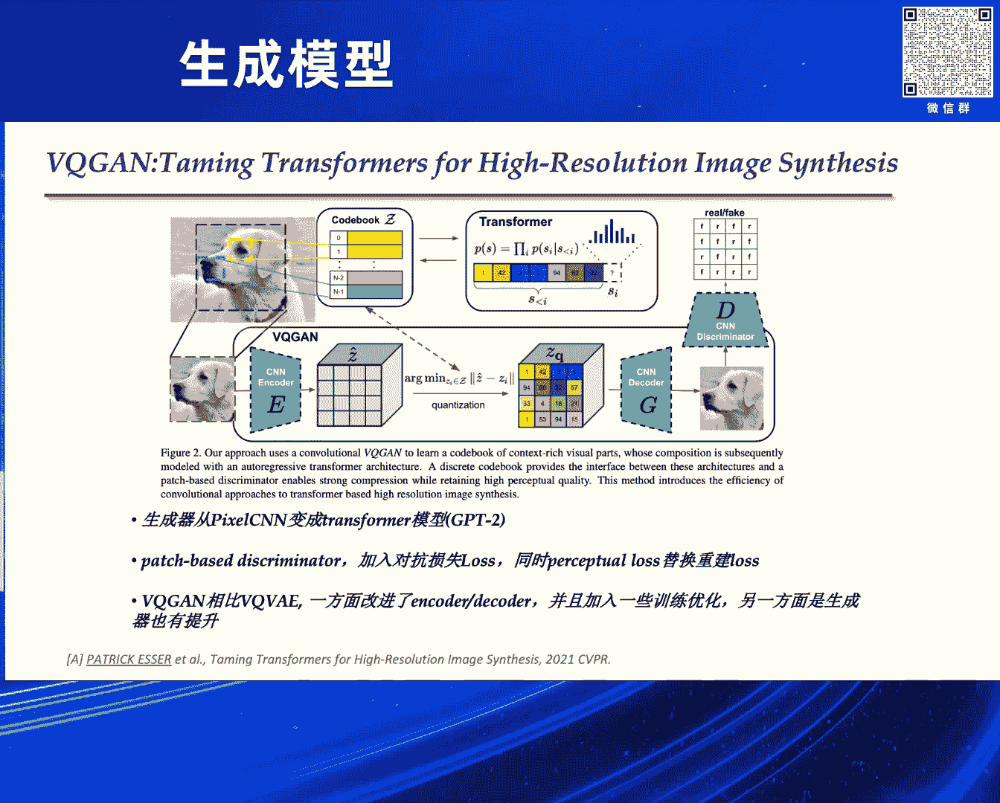

变分自编码器的思想很简单，其实就是在潜在空间上加入了KL散度约束。KL散度约束使得它能够学习，使得它从一个没有随机性的自编码器，变成了变分自编码器可以去采样，具有随机性的生成模型。

有了变分自编码器之后，就衍生出了另外一个比较有名的工作，那就是稳定扩散的前身——潜在扩散模型。潜在扩散模型就是在变分自编码器的潜在空间上进行扩散。它其实是借助了强大的连续变分自编码器表示，然后做得非常好。

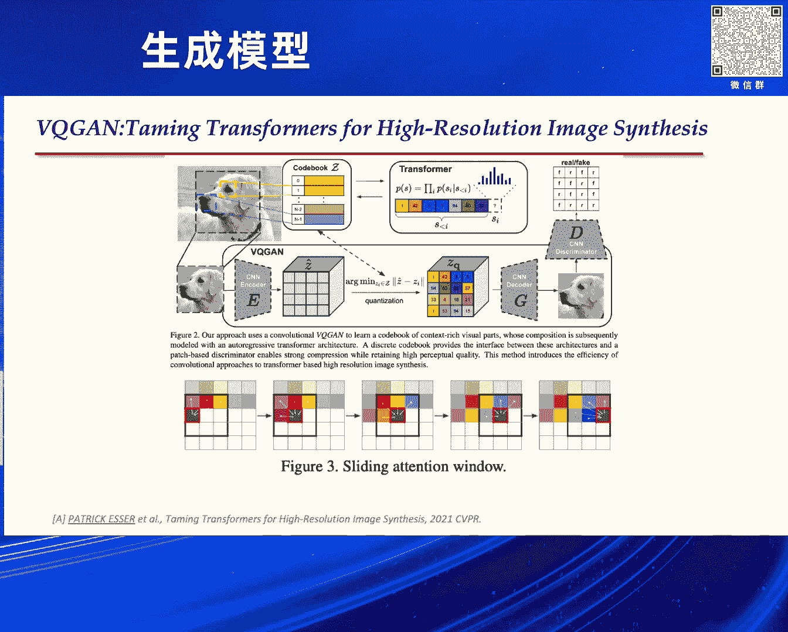

可以看到，扩散模型目前所有的工作，包括潜在扩散模型、扩散Transformer，全部用到了这种变分自编码器，尤其是从离散到连续的变分自编码器上面，进行一些扩散模型的训练。

回到我们刚刚开始说到的，我们希望是通过语言模型来做。语言模型典型的就是现在的自回归语言模型。

这一块的话，就是OpenAI在2020年有一个工作叫做图像GPT。它是在一个像素空间上做自回归的训练。它的做法是直接在像素空间上，基于像素进行聚类，然后直接基于GPT风格进行自回归训练，或者基于BERT风格进行掩码语言建模。它不仅做了生成，也做了一些下游任务的线性评估。它当时更多是做成了这样的一个预训练范式，并没有考虑更多的生成效果。这是第一点。

第二点的话，就是它当时因为在2020年，其实当时的显卡算力有限制，还有基础设施和数据的限制，所以它并没有在大规模的数据集上进行预训练，而更多是在ImageNet或者一些比较小的数据集上，比如CIFAR上面进行验证。所以它的计算量，因为它当时因为计算量的问题，所以它只能生成一些相对低清的图片，比如64x64的图片。

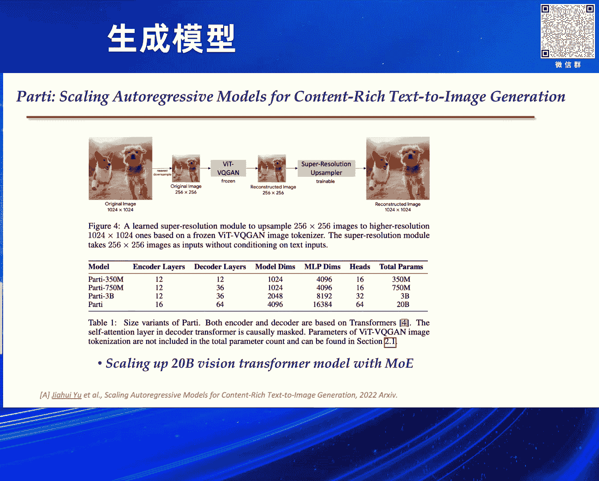

第三点的话，就是在当时还没有先驱者进行一个模型规模扩大，包括在视觉上进行规模扩大的验证。也就没有验证缩放定律能够推动后续的发展。虽然OpenAI推出了GPT系列工作，但在图像GPT上面它并没有跟进这个工作，也导致这个工作出来之后，虽然在领域内有一定的影响力，但是并没有相关更好的工作或改进。

回到我们刚刚说的标记化，它的标记化其实是在像素空间上进行聚类，并没有太多的语义。

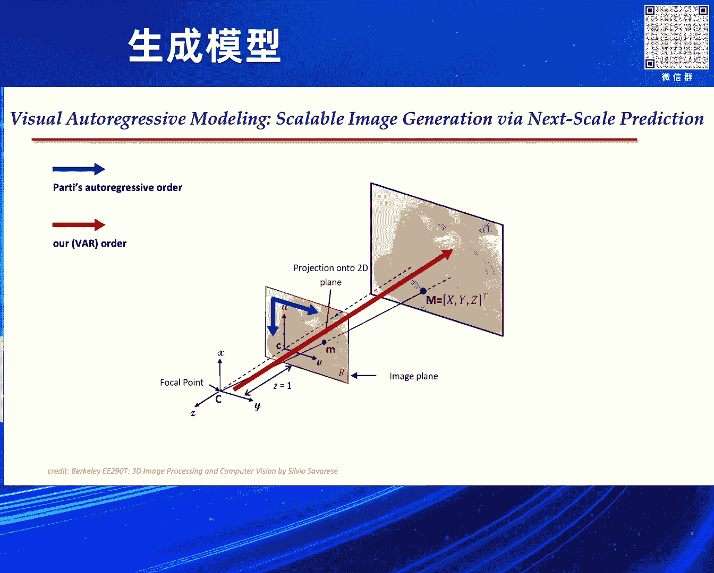

有了这样的想法之后，其实标记化最主要的一点，就是要把连续空间的特征映射到一个标记ID空间上。很自然的想法就是矢量量化变分自编码器。矢量量化变分自编码器就是将输入数据映射到一个离散的码本。这些码本是可以去更新的。这样的话，矢量量化变分自编码器在潜在空间做了量化之后，可以得到一个具体的码本ID。有了这样的一个码本ID之后，相当于一个图像就可以编码成不同的一系列码本。这个过程就和语言模型这边的字节对编码或词片切分基本是等价了，但是近乎等价，为什么说近乎呢？因为它可能语义上还差点意思。

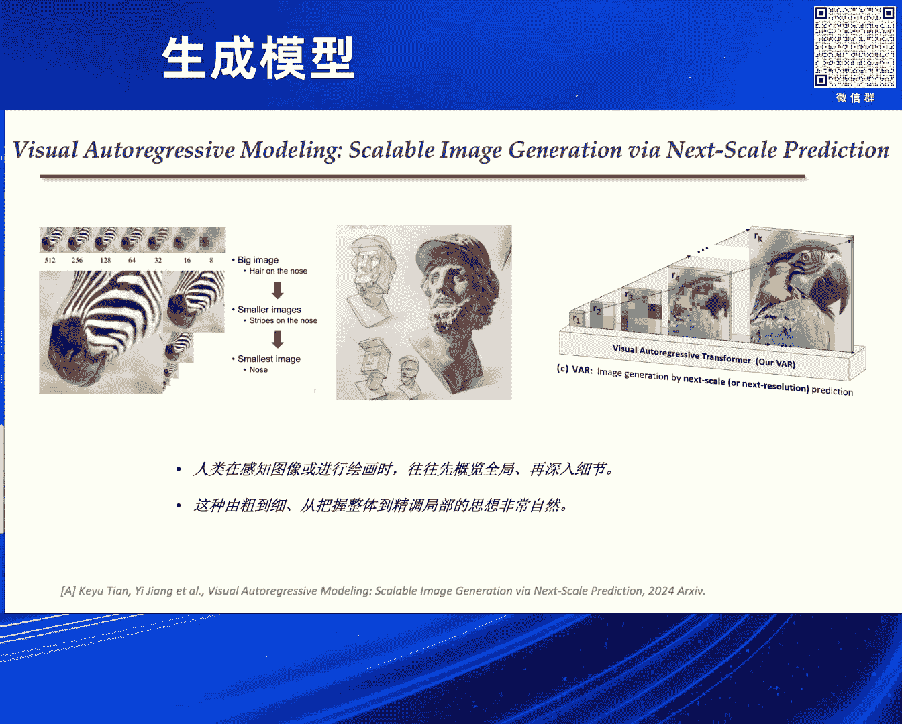

有了这样的一个标记化之后，那我们就有了语言模型优化的可能性。因为我们可以把图像从连续的空间上，映射到一个离散的码本上。那我们就可以通过一个交叉熵损失，以及去大规模优化它。

所以我们这块就回到刚刚的格局图，我们可以看到，其实在前面比较受关注的一些扩散模型或GAN前面，大家说得比较关注。但是在后面一个远处地方，其实自回归模型也渐渐受到大家关注。

这块就要介绍一个比较有名的工作。这个工作就是矢量量化生成对抗网络。矢量量化生成对抗网络是2021年CVPR的口头报告。这工作有极大的影响力。首先，它是第一个基于图像标记化加自回归Transformer来生成图像的工作。当然它没有做文生图，是做类别条件生成。基于这个框架，它就能够生成非常高清的，比如720x1080或者1080x1920这样的图像，并且它可以做下游任务的一系列操作，比如图像修复、外绘，或者是一些超分辨率相关的下游任务验证。

具体做法其实比较简单。它其实做了一些我们认为工程上的优化。首先第一点，之前的矢量量化变分自编码器，更多是在卷积这部分用的是PixelCNN。这部分的话，矢量量化生成对抗网络就把它换成了一个Transformer，GPT-2的架构。

第二点，就是说它的判别器加入了一个对抗损失，同时感知损失替换成了一个重建损失。首先，这样的话，其实第一它改善了一个矢量量化变分自编码器生成画质，因为矢量量化变分自编码器生成画质部分，有部分明显的模糊现象。所以加入了这个对抗损失之后，它的生成画质会有明显提升。

第二点，就是它又从PixelCNN换成了这种自回归Transformer架构。从而基于这些优化改进了编码器-解码器，同时改进了生成的Transformer，使得它生成有非常大的提升。但值得一提的是，矢量量化生成对抗网络并不是一个长距离的自回归模型，它更多是一个滑动窗口的，基于滑动窗口注意力去生成。基于当时算力的一些因素，所以它更没有去做这种长距离的自回归序列生成。现在语言模型这块其实大家应该可以关注一些开源的语言模型，都可以做到非常长的上下文长度。但是其实受限于当时的环境，矢量量化生成对抗网络只能做到一个滑动窗口里面生成。这就有个约束，使得它生成图像其实不能够很好的一致。并且它很难去，比如说左上角能够去和右下角去进行一系列优化。

当时的话是在一些学术基准上做了一些验证，包括类别条件的ImageNet基准。可以看到在ImageNet上的FID，它其实得到了一个明显的提升，几乎接近于一个比较早期的扩散模型的最佳模型。包括如果它加了一些拒绝采样之后，它的FID可以达到6.59，这样的效果，已经快超越了一些原始的扩散模型。

另外一个工作就是一个来自DiFMa的工作。这是来自DiFMa当时的研究员余家辉老师的一个工作。这个工作其实就是说，我看到了语言模型的一个规模扩大的效果，那我是不是可以直接放大矢量量化生成对抗网络这种框架？很显然是可以的。它的框架也比较简单，就是基于一个图像标记化，矢量量化生成对抗网络，加上一个自回归Transformer。

这个工作，其实很典型有点像OpenAI的风格，就是不停地堆算力、堆模型尺寸、堆数据。模型架构很简单，就是这个标记化加自回归这条路线。这跟语言模型几乎一模一样了。这工作是在2022年上半年提出来的，在ChatGPT受大家关注之前。在当时那个年代有人去扩大文生图模型或视觉生成模型是非常难得的，所以这工作，我认为是一个非常具有里程碑式的工作。它也是第一个把文生图模型规模扩大到200亿参数的模型，并且是把文生图做得非常有效的一个工作。当时它也是超前的思想，它用了一个混合专家模型，去做到这个200亿参数的视觉Transformer或自回归Transformer架构。它用的也是混合专家模型。随着文章中做了一些分析，随着模型尺寸变大，效果会越来越好，并且可以做到一些文本渲染的效果。所以我认为这个工作，在当时的思想非常超前。它具备了现在我们能看到的一些语言模型的非常多优势，包括混合专家模型，包括一些规模扩大，在2022年的上半年。

---

## 第四节：视觉自回归建模与下一代尺度预测 🚀

上一节我们介绍了标记化，包括视觉的矢量量化变分自编码器，以及语言模型的规模扩大和相关工作。本节我们将正式介绍我们的工作——视觉自回归建模与下一代尺度预测。我们在想，视觉这块一定要遵循自回归这条路线吗？其实自回归这个东西对视觉来说适用吗？我们也在内部不停地去探讨或思考这样的想法，于是就有了我们的这个工作。

语言模型像GPT或PaLM，是经过字节对编码之后进行下一个标记预测。像Parti这种，简单地就是一个矢量量化变分自编码器标记化之后，利用光栅顺序，也是跟语言模型一样，自上而下、自左到右的光栅顺序。但语言模型是用自回归的方法来预测下一个标记，那是因为语言有先后顺序区分，因为语言是一个一维的上下文。但视觉其实并不是这样，因为视觉我们看东西它是一个整体的，或者是整体到局部的这样一个过程。所以我们就在想，传统的图像自回归使用一种不符合人类直觉，但是符合一些计算机处理的顺序，自上而下逐行扫描这光栅顺序来预测图像标记，这个真的合理吗？这个地方可能要打个问号。

我们就在想，就像Parti这种，就是我们刚刚说的一个语言模型的全自回归生成框架。其实我们人看东西一般都是我们从远看东西，会看到一个整体的东西，然后慢慢走近，我们会看到整体的这个物体，或者是一个图像的整体的整体到一个局部的这样细节，类似逐步放大的过程。这是比较符合人类直觉的这样一个过程。

同样地，人类在感知图像或者绘画时，往往都是先概览全局，再深入细节。这种由粗到细、由整体把握到局部精调的思路是非常自然的。有了这样的想法之后，那我们就在想，能不能我们同时借鉴语言模型优势，标记化加自回归的方式，去融入计算机视觉的一些特质，包括我们刚刚说的从整体到局部的思路，那这种逐步放大的思想，就有了我们这个视觉自回归建模想法的初步。就是说我们可以去逐步地看这个图，从慢慢把图像看整体逐步放大这样的过程。

接下来会介绍具体来说我们是怎么做的。首先，像我刚刚说的，其实自回归的框架主要是两个组成，一个是标记化，第二个是它的自回归Transformer。自然地，我们也是一样的。第一阶段，就是我们需要有一个多尺度的图像标记化。为什么要多尺度呢？因为我们是从一个整体到局部的，所以这个图像标记化，必然是它把握一个单尺度到多尺度上的一个整体的描述。

第二阶段，就是说我们会有一个GPT风格的自回归模型，来生成这样的多尺度图像标记，或者多尺度的矢量量化标记。然后我们去逐步生成这样高清的标记，最后通过一个标记化解码器去还原出来。

具体来说，我们现在有两个阶段。第一个阶段，就是说我们会有一个，我们需要对图像进行一个多尺度的标记化。就是说我们对图像我们先把它转化成一个多尺度的离散标记图。比如它是一个多个，大概7到8个尺度上，举个例子。然后它在7到8个尺度上分别做标记化，这样它有个多尺度的标记图。这是第一步，离散编码。

第二步，就是我通过一些码本转化成连续的这样一个特征图，然后统一插值到最大分辨率上去求和。求和后的特征图通过一些标记化的解码器，去重建图片，并且通过重建、感知和对抗这三个损失，就我刚刚说的一个重建损失、感知损失和对抗损失来混合训练，训练这样的一个多尺度的矢量量化变分自编码器。

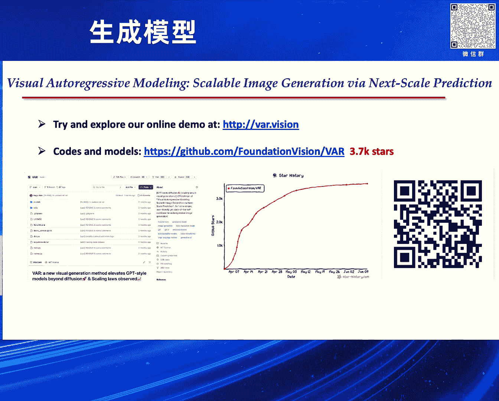

有了第一步之后，那我们就是在想，如何在视觉空间上去自回归地生成？很简单，我们一般第一步是通过一个起始标记，去预测出第一个尺度的标记图。随后每一步，视觉自回归模型都会基于历史的所有标记图，去预测下一个更大尺度的标记图。这种由粗到细精调的思想。

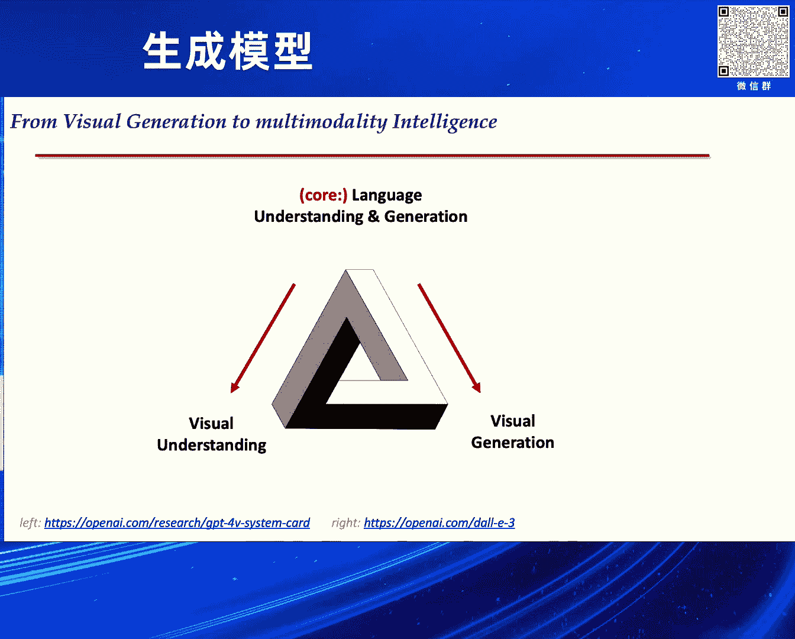

有了标记化之后，训练阶段就可以使用标准的一些交叉熵损失来监督这些标记图的概率预测。这样我们就可以看到逐步流程：先生成一个第一个尺度的标记图，然后再生成下一个尺度的标记图。注意的是，它在每个尺度上，是一个并行生成的，但是在尺度上它是一个由粗到细的注意力机制。

测试阶段的时候，就可以通过采样得到标记图，结合矢量量化变分自编码器的解码器，进行连续化的差值求和，再通过解码器最后生成完整的一个图像。当然里面有很多细节，包括我们借鉴了一个残差量化Transformer的思路，包括我们借鉴了一些扩散Transformer架构上的一些经验。

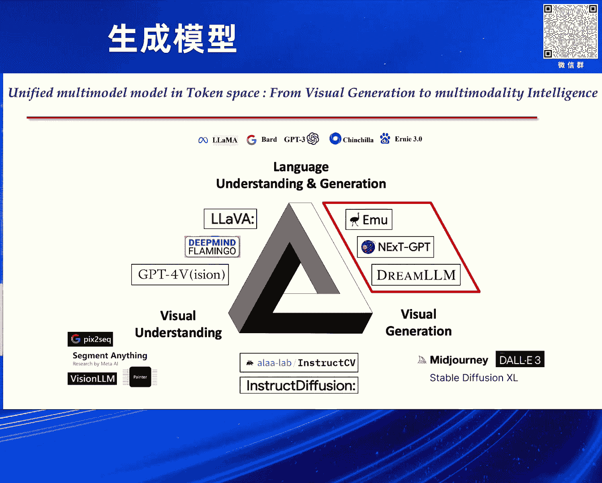

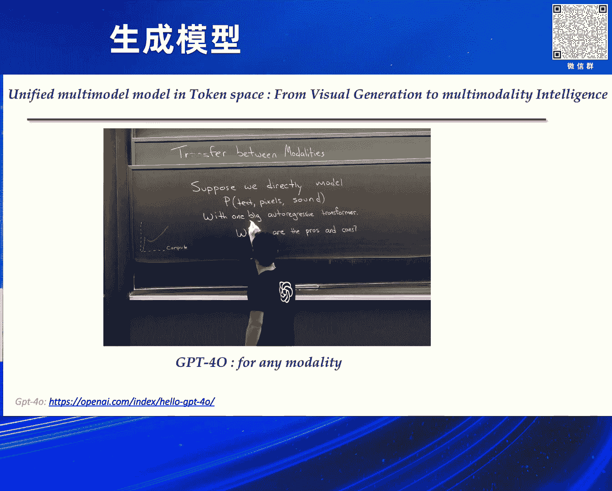

我们在标准的基准上的一个结果。首先我们可以看到标准的类别条件ImageNet基准上，我们测试了不同的模型尺寸，结果随着不同的模型尺寸扩大之后，我们的FID是逐步稳步下降的，并且我们的这个FID达到了历史最佳，比之前所有的基于扩散的模型、基于掩码预测的模型、基于自回归Transformer的模型，都达到了更好的FID，并且我们几乎快接近变分扩散模型的FID。这是第一。

第二的话，我们在标准的ImageNet 512x512的类别条件生成上达到了也不错的效果，也比之前的掩码生成式Transformer或扩散Transformer的效果更优。值得一提的是，我们的视觉自回归框架会比传统的完全依赖的自回归框架在FID上几乎提升了一个数量级。这第一点就是我们达到了最佳的performance，在ImageNet基准上。

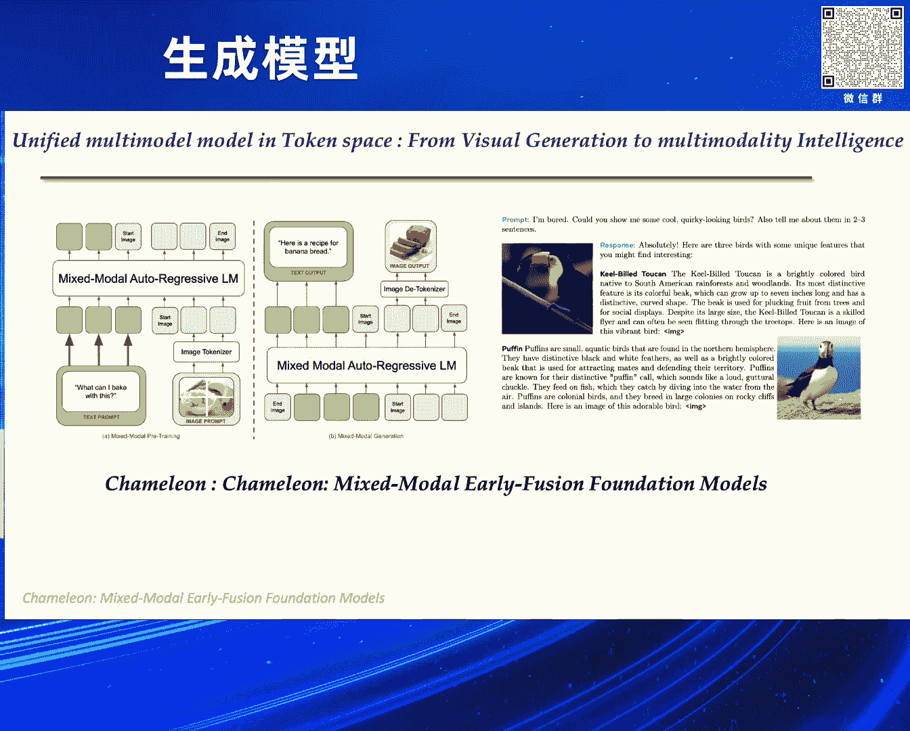

第二点我们比基础的扩散模型会更好。第三的话，就是我们是一个非常快速的模型，因为我们的生成步数比较少，所以我们实测的话在1024x1024上，如果我们优化得够好的话，可以到一到两秒生成1024x1024这样的模型。

我们也和基础的扩散Transformer或稳定扩散的基座模型做了对比。可以看到右上角，在我们的一个基准上的FID，包括我们左上角的话和不同的模型之间的FID和速度对比的一个表。我们可以看到经过规模扩大之后，视觉自回归模型可以达到一个FID。当然最新的结果我们会更好一些，它毕竟理论上的一个FID的下限要1.78，显著优于扩散Transformer当时的效果2.1。

第二就是我们的速度更快，视觉自回归模型只需要不到0.3秒就可以生成一个256x256的图像，速度的话是当时的一个原始扩散Transformer的45倍，在512上，更是扩散Transformer的一个数量级的速度。

第三的话是我们有更好的规模扩大的能力。如左图所示，扩散Transformer在大模型增长到30亿、70亿参数之后，出现饱和现象，无法靠近FID下限。所以我们做了一个视觉自回归模型上的规模扩大实验，包括它规模扩大到一个20亿的参数，性能不断地提升。

另外一点就是我们有更高效的数据利用，包括我刚提的视觉自回归模型需要350个训练周期就能超过扩散Transformer1400个训练周期的效果。

我们也验证了自回归模型上的一些缩放定律。我们验证了在验证集上的标记错误率和交叉熵损失随着我们扩大模型尺寸和计算量之后，可以得到可预测的下降。可预测是指我们呈现幂律关系或对数缩放后的线性关系。线性关系的话就是把线性相关系数达到非常高