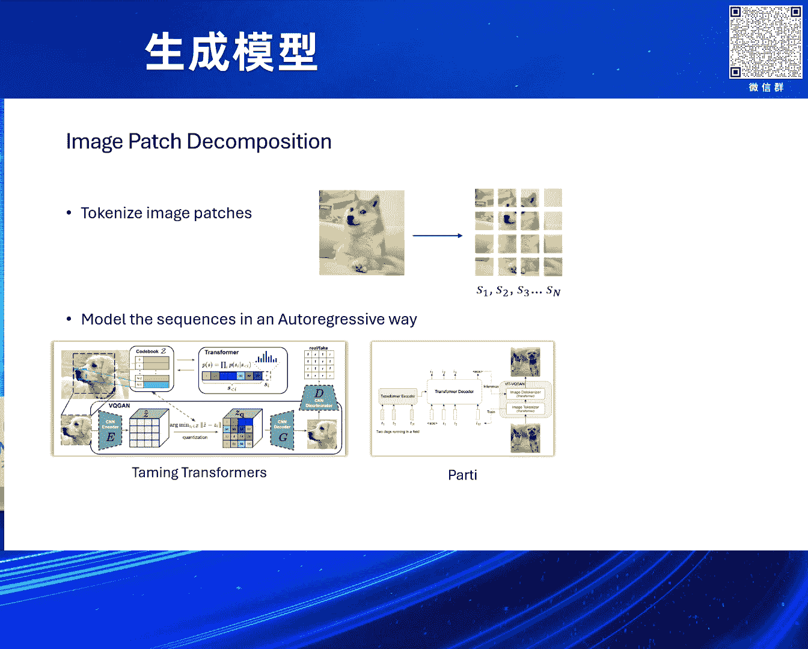
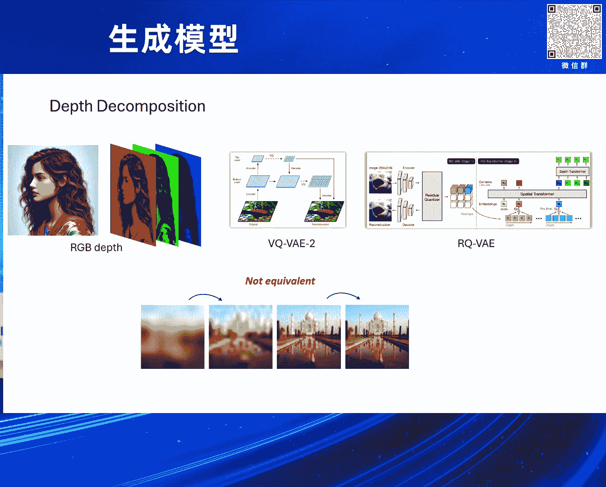
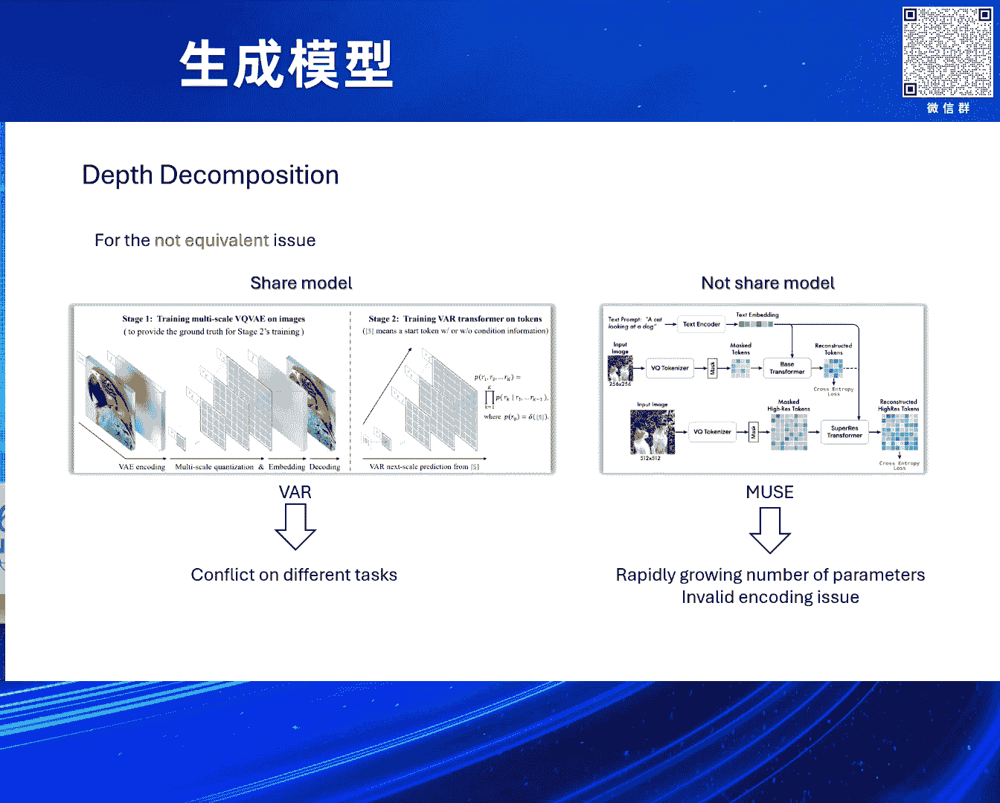
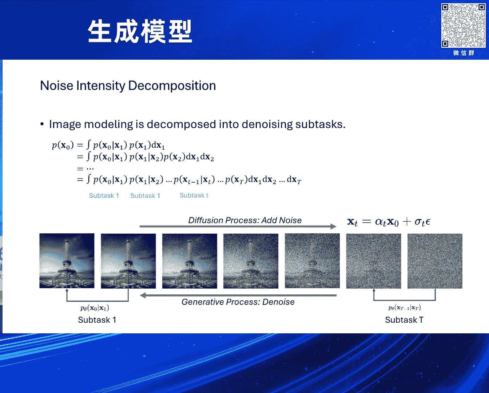
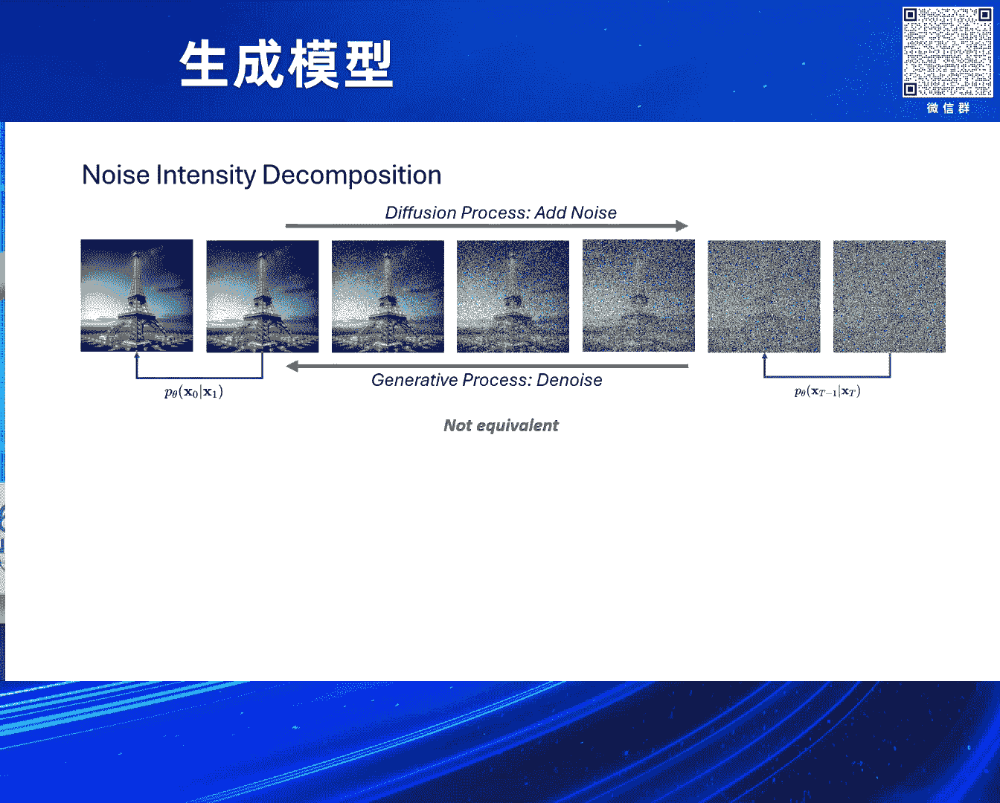
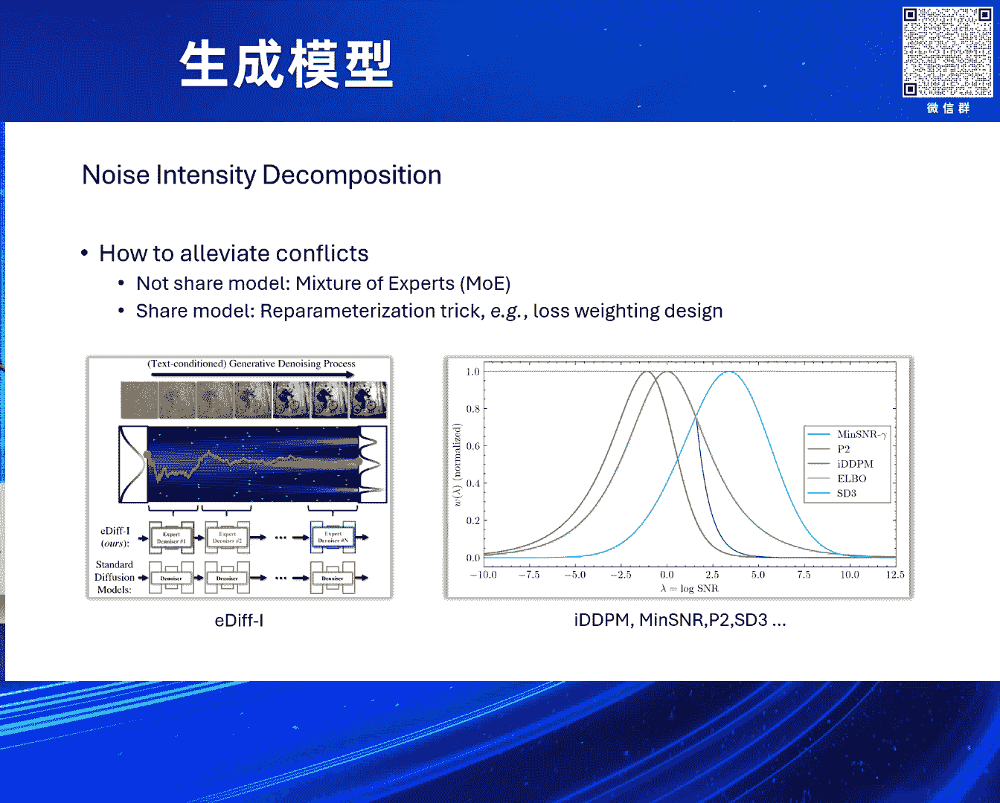
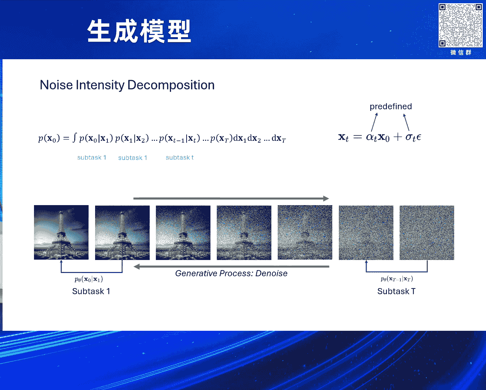
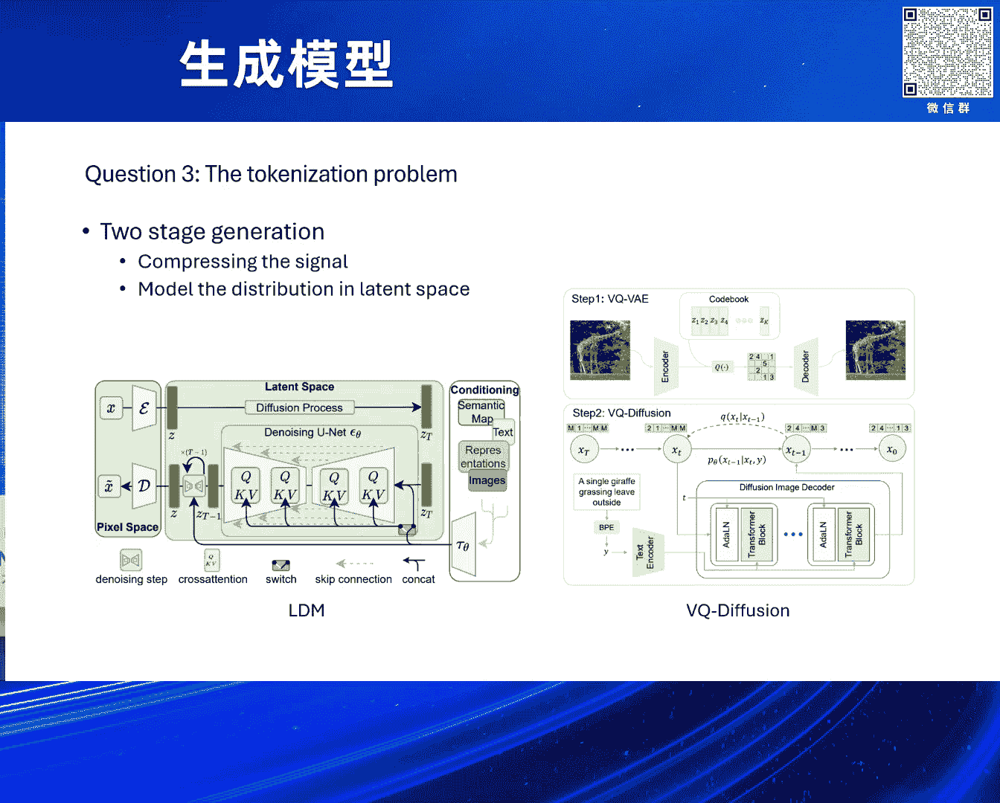
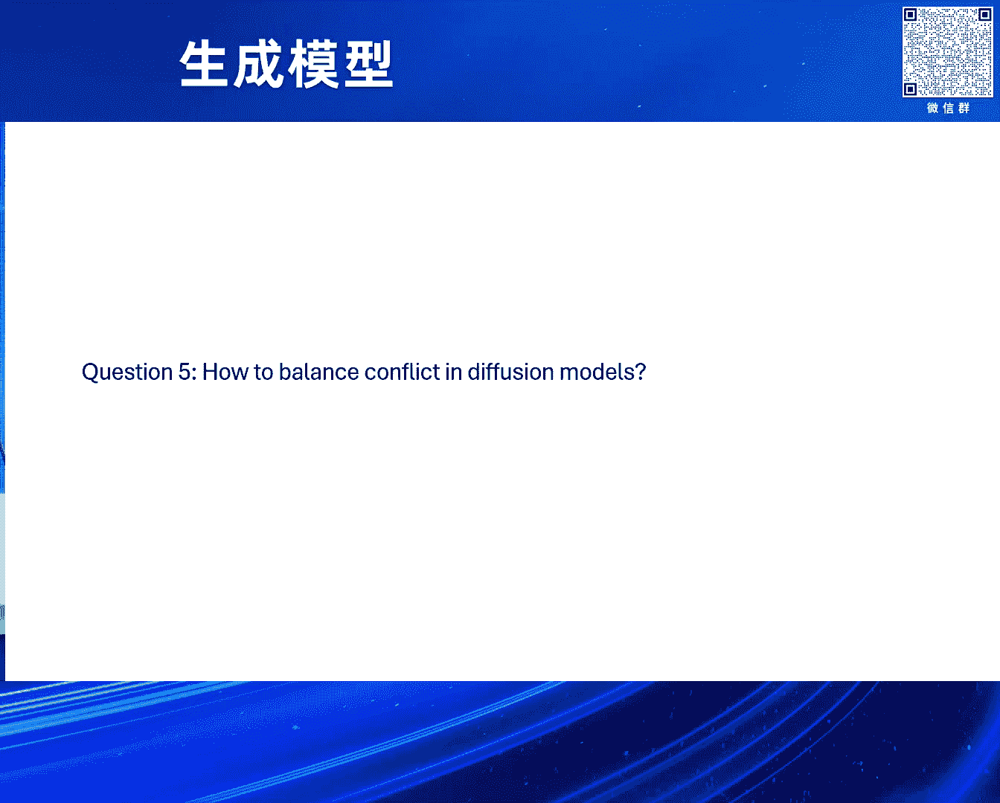

# 2024北京智源大会-生成模型---P4-视觉生成中的若干问题-古纾旸---智源社区---BV1DS411w7hz

在本节课中，我们将探讨视觉生成领域的一个核心挑战：视觉信号拆解。我们将分析为什么这是一个关键问题，回顾现有方法的局限性，并探讨可能的解决思路。

## 概述：视觉生成的核心挑战

生成模型的目标是理解用户的意图并将其转化为计算机可理解的指令，然后生成相应的内容。从流形学习的角度看，生成过程是从目标数据分布 `p_target` 中采样。然而，我们无法直接获得 `p_target`，因此需要构建一个可采样的生成分布 `p_generated`，并希望它与 `p_target` 一致。

问题在于，`p_target` 的数据分布可能极其复杂，难以拟合。因此，生成模型发展的核心就是不断提升模型的建模能力，以应对这种复杂性。从能量模型、GAN、VAE 到扩散模型，都是这一过程的体现。

## 视觉信号的拆解难题

既然单一复杂分布难以建模，一个自然的思路是将复杂问题拆分为多个简单问题。在视觉生成领域，这便引出了核心问题：**如何对视觉信号进行有效拆解？**

上一节我们介绍了问题的背景，本节中我们来看看语言领域是如何解决类似问题的。

### 语言领域的成功经验

在语言领域，数据拆解非常直观。例如，句子“我喜欢吃苹果”可以自然地按词元（token）拆分。模型的任务是进行下一个词元预测，即根据前面的词元预测后续的词元。这可以形式化地表示为，将一个复杂分布 `P(x)` 的建模任务，拆分为 `n` 个条件概率预测任务：
`P(s_i | s_1, s_2, ..., s_{i-1})`

当语料库足够大时，这些不同的预测任务之间没有冲突，甚至互相促进。这种特性可以称为**任务等价性**，它使得模型能够顺利地进行规模化扩展。

### 视觉领域的尝试与困境

受到语言模型成功的启发，视觉领域也尝试了类似的“照葫芦画瓢”方法。典型的做法是将图像分割成块（patch），然后使用自回归模型进行渐进式生成。

以下是几种代表性的视觉信号拆解方式及其面临的挑战：

*   **基于图像块的拆解**：将图像划分为网格，然后按顺序预测每个图像块。然而，不同预测任务学习的内容可能存在冲突。例如，预测连续图像块时，模型需要学习空间连续性；但预测非连续图像块时，这种连续性信息可能成为干扰。
*   **基于深度（通道）的拆解**：例如，将RGB图像的三个通道拆开建模，或使用VQ-VAE-2、RQ-VAE等方法进行层级化量化。但不同层级或通道学习的信息（如低频结构 vs. 高频细节）也可能存在冲突，导致任务不等价。
*   **基于噪声强度的拆解（扩散模型）**：使用前向扩散过程将复杂分布 `P(x_0)` 拆分为一系列从 `x_t` 到 `x_{t-1}` 的简单去噪任务。然而，研究表明，在不同噪声强度（时间步）`t` 上，模型学习到的信息也完全不同（例如，早期学习整体结构，后期学习细节），任务之间同样存在冲突。

这些冲突的根本原因在于，视觉信号的内部结构复杂，其不同维度（空间、通道、语义层级）的信息相互耦合，难以像语言那样找到一种天然、无冲突的拆解方式。

## 应对不等价拆解的现有方案

面对拆解后任务不等价的问题，目前的解决方案大致分为两类。

### 方案一：使用共享模型

即使用一个庞大的模型来同时处理所有拆解后的子任务。其思路是，只要模型容量足够大，就能“暴力”拟合所有不同的任务映射关系。

*   **代表方法**：VAR（Vision Autoregressive）模型。
*   **优点**：设计相对简单。
*   **缺点**：参数效率低。当数据分布极其复杂时，模型可能因任务冲突而难以有效学习，导致“按了葫芦起了瓢”。

### 方案二：使用非共享模型

即为不同的子任务训练专门的模型（专家）。

*   **代表方法**：EDM（使用多个专家处理不同噪声强度）。
*   **优点**：每个专家可以专注于特定任务，理论上能获得更优解。
*   **缺点**：模型参数量随任务数量线性增长，计算和存储成本高。此外，还可能面临“无效编码”问题，即某些拆解出的信号维度信息量很低。

对于扩散模型，一个关键的改进是**重参数化**。它将不同噪声强度下的输出目标统一（如都预测噪声），在一定程度上缓解了不同任务输出分布不一致带来的冲突。此外，损失函数加权设计（如Min-SNR）也被用来寻找帕累托最优方向，减少冲突。

## 寻求更优的拆解方式

既然预定义的拆解方式（如固定的噪声计划）会导致冲突，一个更根本的思路是让拆解过程本身可学习。

以下是两种学习拆解的思路：

1.  **可学习的噪声计划**：不固定前向扩散过程的参数（如 `α_t`, `σ_t`），而是用一个网络来预测它们，以期学得一种冲突更小的拆解方式。
    *   **代表工作**：Variational Diffusion Models (VDM)。
2.  **用网络学习加噪过程**：更激进地，让整个前向扩散过程（从 `x_0` 到 `x_T`）都由一个神经网络定义。
    *   **代表工作**：薛定谔桥相关方法（如Diffusion Schrödinger Bridge）。

这些方法旨在寻找对视觉信号更合理、冲突更小的拆解方式。然而，它们也面临新的挑战，例如，失去了传统扩散模型中那个简洁的加噪公式，可能会牺牲重参数化带来的好处，使得训练更加困难。

## 视觉信号的表示（Tokenization）问题

现代生成模型通常分两步：先将高维信号压缩到低维隐空间（编码），再在隐空间上进行分布建模。压缩的目的是为了降低数据分布的复杂性，使其更容易被建模。

然而，视觉信号的压缩面临一个权衡：

*   **重建质量 vs. 建模难度**：压缩过程越无损（重建质量越高），隐空间的数据分布可能越复杂、越难以建模。相反，适当的压缩损失（如通过VAE的KL散度正则化或量化）可以使隐空间分布更规整、更易于学习。
*   **通用解决方案**：丢弃信息量低的隐变量。这在语音、图像领域都有应用。例如，在灰度图像生成中，拟合5比特可能比拟合8比特效果更好。

这引出了对**变长编码**的探索，例如RQ-VAE。它通过多阶段量化实现变长编码。但实践中发现，随着量化阶段增加，后期阶段对重建质量的提升可能微乎其微，甚至出现“嵌入退化”问题，即后面增加的编码几乎无效。这再次印证了拆解的不等价性，也提示我们需要更智能的编码方式。

## 扩散模型是最大似然模型吗？

从训练、推理和评估三个角度看，扩散模型与经典的最大似然模型存在差距：

*   **训练**：理论上，扩散模型的训练目标（证据下界ELBO）与最大似然相关。但实际常用的简化损失（如预测噪声的MSE损失）以及非单调的损失加权，使其与严格的最大似然存在差距。
*   **推理**：广泛使用的**Classifier-Free Guidance** 技术，实质上是将模型预测的条件分布向先验分布的方向进行了偏移。这明确表明，纯粹的最大似然估计结果并不理想，需要额外的引导来提升样本质量。
*   **评估**：在图像生成中，负对数似然（NLL）与人类感知的图像质量关联性很弱。直接优化NLL并不能获得最好的生成结果。

一个可能的解释是，由于视觉信号拆解的不等价性，不同子任务的重要性与难度不同。最大似然训练平等对待所有子任务，而实际上那些处于中间噪声强度、最难学习的任务更需要被“照顾”。CFG在推理时的引导作用，以及评估时NLL的失效，都可能源于此。

## 总结与展望

本节课我们一起学习了视觉生成中的核心问题——**视觉信号拆解**。我们认识到：

1.  视觉信号结构复杂，难以像语言那样找到天然等价的无冲突拆解方式。
2.  现有的基于图像块、通道、噪声强度的拆解方法，其子任务之间普遍存在冲突。
3.  应对冲突有共享模型和非共享模型两种思路，但各有优劣。
4.  让拆解过程本身可学习是一个有前景的方向，但仍面临挑战。
5.  视觉信号的表示（Tokenization）需要在重建质量和建模难度之间取得平衡。
6.  扩散模型在实践中并非严格的最大似然模型，其训练、推理和评估都受到了拆解不等价性的深刻影响。

未来，如何设计出更符合视觉信号本质的、等价或冲突更小的拆解方式，将是推动视觉生成领域发展的关键。这需要我们对视觉信号的统计特性、层次化结构有更深入的理解。