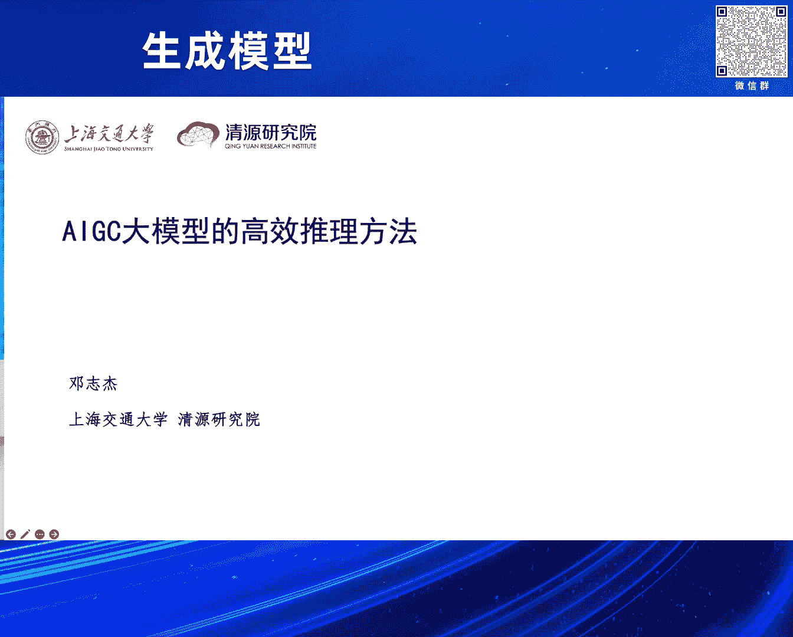

# 课程名称：大模型的高效并行推理方法 📚
## 课程编号：P5

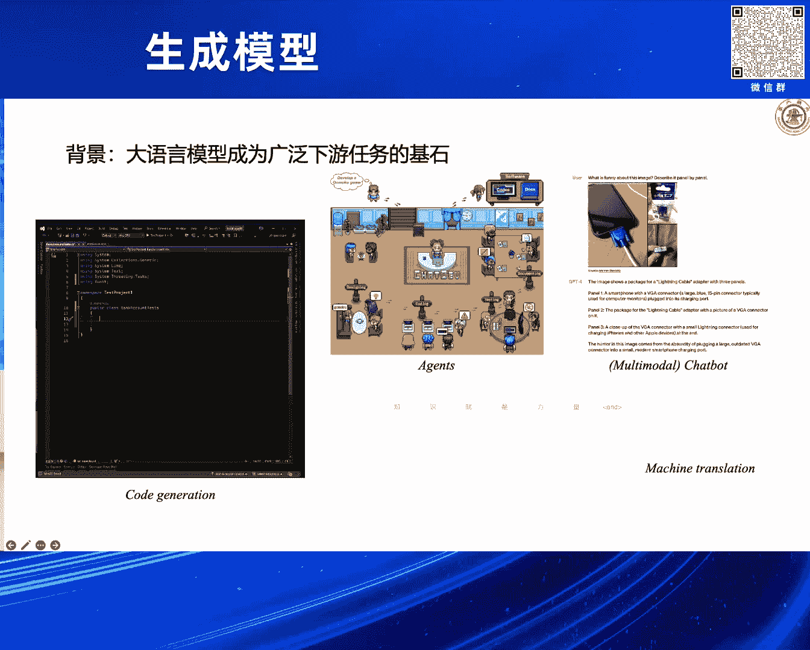

在本节课中，我们将要学习大语言模型与扩散模型在推理阶段面临的主要效率挑战，并探讨一系列旨在提升推理速度的核心技术与前沿方法。课程内容将涵盖投机解码、一致性模型、模型蒸馏等关键概念，旨在让初学者理解如何让庞大的生成式AI模型运行得更快、更高效。

---

## 概述：大模型推理的时代挑战 🤖

感谢智源组委会的邀请，让我有机会分享我们在大模型高效推理方面的一些初步工作与想法。我是邓志杰，来自上海交通大学清源研究院。

本次报告的背景是当前的时代背景。大语言模型已成为广泛现有任务的基石，激发了学术界与工业界的浓厚兴趣。

另一方面，以大型扩散模型为代表的模型在图像，尤其是视频生成上，带来了巨大的影响力和价值。典型工作包括OpenAI的SORA，以及清华与声树公司联合开发的Vidu。

我个人认为，这两类模型可以统一在AIGC大模型的架构之下。对于AIGC大模型，我们也逐渐发现了一些发展趋势。

第一个趋势是架构趋于统一。Transformer架构在大模型的使用上具有绝对的优势地位。尽管存在一些后来的挑战者，但Transformer的地位目前仍无法撼动。

在学习方式上，存在多个主流方向。一类是在语言上以`next token prediction`为代表的自回归模型。另一类是在图像上对图像做扩散建模。目前学习方式尚未统一，但未来可能有统一的趋势。

第三点是，相当一部分人仍然相信Scaling Law。Scaling Law意味着持续为模型增加算力、数据和参数量，可以带来更好的生成效果。

作为普通的研究人员或学生，我们可能也想尝试使用这些大模型。我们可以将模型下载到本地进行推理。但我们会发现面临许多挑战。

例如，早期使用3090显卡加载模型时，可能直接出现内存溢出（OOM）错误。解决加载问题后，用模型生成文本时，token会逐个缓慢输出，生成一段长回复可能需要一分钟时间。

这种低效的推理会导致非常差的用户体验。因此，我们从那时开始考虑如何解决大模型推理低效的问题。

这个问题来源于两个方面。第一个方面是模型本身越来越大，这是Scaling Law不断扩展的结果。

另一方面，从算法角度分析，我们发现大语言模型或扩散模型都依赖一个顺序推理的过程。语言模型中，生成的词是自回归地逐个输出。扩散模型中，从纯噪声出发，不断去除图像上的噪声以生成图像。这需要一个顺序的、漫长的推理过程才能完成一次生成。

这个过程会进一步放大模型自身庞大所带来的开销，导致高昂的部署成本和较差的用户体验。因此，围绕这个问题，我们做了一些相关工作，并会讨论该领域的一些新进展。

我将主要分三个方面介绍。第一个方面围绕大语言模型，考虑将其顺序推理改为并行推理。第二个方面讨论对于大型扩散模型，如何进行低步数的推理。最后会简要介绍在模型结构及缓存优化等方面的一些进展。

---

## 第一部分：大语言模型的高效解码 🚀

上一节我们介绍了大模型推理面临的通用挑战，本节中我们来看看针对大语言模型的具体优化方法。可能大家都对大语言模型的推理过程有一定了解，我在此简单回顾一下。

例如，我有一个包含三个词的提示（prompt），我想输入到某个语言模型中，让它向后生成内容。

首先，将提示输入模型，它会生成后一个词。这个阶段通常被称为**预填充阶段（Prefill Phase）**，即把提示填充到模型中。

之后是一个不断重复的过程：将刚才生成的词接到输入后面，继续生成下一个词。这个过程通常被称为**解码阶段（Decode Phase）**，它是自回归式的，逐个进行。

预填充阶段是一蹴而就、并行处理的。而解码过程何时停止，基本有两个准则：一是生成出结束符（EOS），二是达到模型的生成上限（例如2048个token）。

我们分析一下这个生成过程中的计算开销。预填充阶段是并行的，因此其时间开销相对较小。如果生成的文本很长，那么整个推理过程就会很慢，所以大部分计算开销花在解码阶段。

另一方面，在解码阶段，例如要生成“future”这个词，它会关注前面所有的词。这是Transformer中自注意力机制的特性，即将生成的词会关注前面所有的词。因此，自注意力机制的复杂度会不断提高，导致越往后生成开销越大。

解决这个问题的一个典型技术是**KV缓存（KV Cache）**，这现在已是一个标准技术。其核心思想是以空间换时间。因为在后面生成“future”或“of”时，都需要复用前面“Artificial intelligence is”这些词的计算状态。与其重复计算，不如计算一遍后，将自注意力中对应的K和V状态保存下来，后续需要时直接使用。

这样，带有KV缓存的大语言模型推理有两个主要特点。第一，预填充阶段是计算密集型的。如果提示很长，可以充分激发GPU的并行计算能力。第二，大语言模型的解码阶段是内存I/O瓶颈的。它受限于GPU内部存储（HBM）与高速计算存储之间的通信带宽，这个带宽相对较慢。

因此，真正限制大语言模型推理速度的其实是这个带宽。另一个观察是，预填充几个token所花的时间，与解码一个token的时间是差不多的。这是因为GPU的计算能力足够。

基于这两个观察，我们就在思考，能否通过某种方式降低解码阶段所需的内存I/O量。例如，生成十个词需要十次内存I/O，能否将其降为三次或两次？如果能够降低，就可以显著提高生成速度。

---

### 投机解码（Speculative Decoding）

一个典型的做法叫做**投机解码（Speculative Decoding）**，旨在实现这个目标。

它的想法是这样的：假设要生成一段关于爱好的回复。它有一个假设：要生成的所有token，并非每个都很难或有很强的语义，其中肯定有一些像“废话”或占位符一样的token。

那么，是否可以将这样的一些token放到一个小模型上去生成？这个小模型被称为**草稿模型（Draft Model）**。让这个草稿模型先对问题做出回答，生成五个或六个词。

之后，大模型用来做什么呢？大模型用来评判、判断是否要接受小模型生成的提议（proposal）。如果不接受，大模型还可以为它犯的第一个错误提供一个改正，即一个修正后的token。

这里使用的一套准则是基于**拒绝采样（Rejection Sampling）**的，有严格的理论证明可以保证，通过拒绝采样得到的token分布符合原始的自回归token分布。

大模型对小模型的提议进行验证的过程，实际上是并行验证的，这等价于做一次预填充。因此，从这个角度理解，我们将生成三个词所对应的解码阶段时间，转变为了做一次预填充的时间。一次预填充和三次解码所对应的内存I/O交换减少了三倍。

因为生成过程受内存I/O限制，所以速度理论上可以成倍提高。当然，这是理想情况。实际上我们也会碰到一些不理想的问题。

以下是投机解码工作需要满足的几个必要条件：

1.  **草稿模型必须足够小**：只有足够小，推理速度才能快。
2.  **提议长度（K）需要调整**：一次提议的词数（K）是一个可调参数。提议一个词基本没有意义，提议太长则可能前面接受的词也达不到那么长。
3.  **接受率（Acceptance Rate）要高**：小模型提议的token被大模型接受的概率要高，即小模型要能很好地“猜中”大模型的分布。

这三个因素是比较关键的。这是我们绘制的一些关于期望加速比与这些影响因子关系的示意图。

对于提议长度K，我们可以进行调参。模型大小也是我们可以设定的。其中比较关键的是提高小模型猜中大模型分布的准确率，即token接受率。

我们观察了当前投机解码的一些部署系统，发现了两个可以提高token接受率的机会。

第一个机会是，在投机解码过程中，小模型给出一个提议后，大模型会检测出它的第一个错误，并“白送”一个正确的token。这个token在投机解码中就被用来继续往后生成。但反过来想，这个信号实际上可以很好地用来帮助小模型进行校正，教导它下次不要再犯这个错误。这样，小模型就能在这个过程里不断提升自己。

第二个机会是，我们一直强调投机解码系统里有很多空闲的计算能力（FLOPs）。这些计算能力可以用来训练模型吗？

因此，我们做了这样一件事情，叫做**在线投机解码（Online Speculative Decoding, OSD）**。我们将两部分结合起来，在投机解码的过程中，进行了草稿模型的在线蒸馏。

从直观角度来说，我们做了这样一件事。做法上也非常简单：在在线服务（online serving）的过程中，不断记录小模型在哪个地方犯了错，以及大模型给它的校正是什么，用一个缓冲区（buffer）存储。每过一段时间，或者缓冲区满了之后，就运行一次蒸馏过程。

这个蒸馏过程与语言模型做教师强迫（teacher forcing）训练是差不多的。它有一个很显著的好处，我们会在实验结果中发现：假设是一个开放域（open domain）的情况，并且有一个比较稳定的查询分布（query distribution）。也就是说，用户在使用大模型时，往往倾向于询问特定范围内的问题。

例如，今天下午我在改论文，就可能一直问如何帮我修改语法错误或翻译。有的人从事金融或数学相关工作，可能会一直问数学问题。也就是说，用户会有一个比较窄的查询分布，不会像原始模型学习的分布那么大。

在这种情况下，我们的OSD就可以快速适应用户的查询分布，更好地“猜中”用户的心理。

我们首先模拟了一些在线部署的场景，例如在Spider或GSM8K等基准测试上。随着我们不断向投机解码系统发起查询、不断交互，我们模型（蓝色线表示）猜中的概率会不断提高，这符合我们做了在线蒸馏的预期。而基线（baseline）使用离线蒸馏模型，即不做在线蒸馏，其准确率就是一个比较静态稳定的值，不会提高。

在这个工作中，我们还做了一个比较有意思的探索：我们发现草稿模型不一定非得是一个，可以是多个。尤其是在一些复杂的查询分布场景下。例如，模型可能面临被多种语言的人访问，那就可以为每一种语言部署一个草稿模型。如果大家会问多个主题的问题，可以为不同的主题部署不同的小模型。

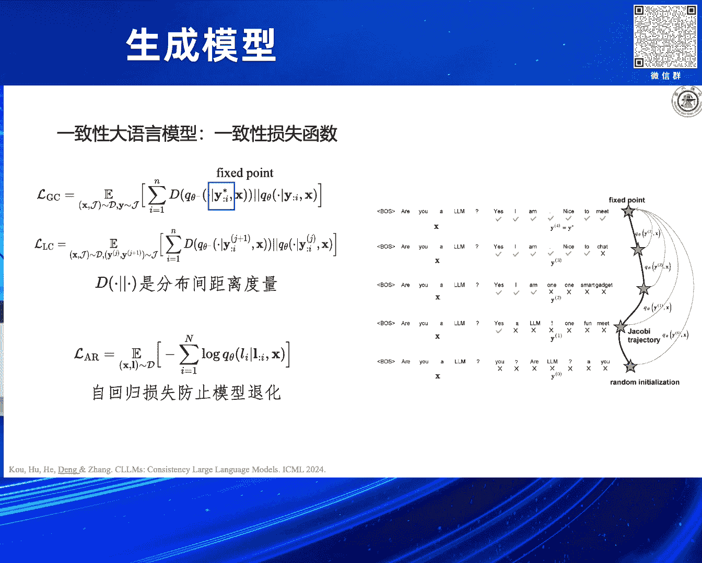

我们模拟了这样的一些场景，发现在这种混合场景下，不同草稿模型的准确率也会持续提升。最终，我们或许可以拓展为一种基于用户的路由机制，为每一个用户部署一个草稿模型，从而实现用户手机上的模型更能“猜中”该用户的心理。

当然，我们也与一些公认的基线（如Medusa）进行了比较，也可以与Medusa结合。我们做了一些观察，发现小模型对哪些词猜对的概率提升比较大呢？我们发现这与任务特别相关。

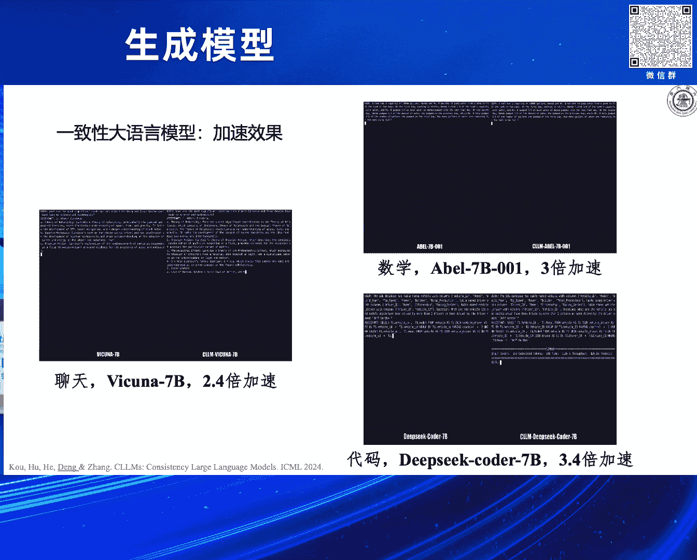

例如，Spider是一个文本到SQL语句的任务，那么能猜对的词很多就变成了“SELECT”等与任务特别相关的关键词。在GSM8K上，则很容易猜对一些数学符号。这说明小模型确实是在猜对一些信息密度可能相对较低的token，从而释放大模型的生成压力，加快生成速度。

---

### 超越自回归：并行解码的探索

在刚才的工作中，我们考虑大模型自身仍然是顺序解码器。尽管我们用了小模型，并用大模型做并行验证，但小模型和大模型在其中仍然是顺序的。这是受限于这类模型是从自回归方式中学习的。

那么我们可能有一个比较跳脱的想法：语言模型能不能一次预测出多个token？跳出刚才那种范式。当然，这里面有一些初步的探索，例如**雅可比解码（Jacobi Decoding）**。

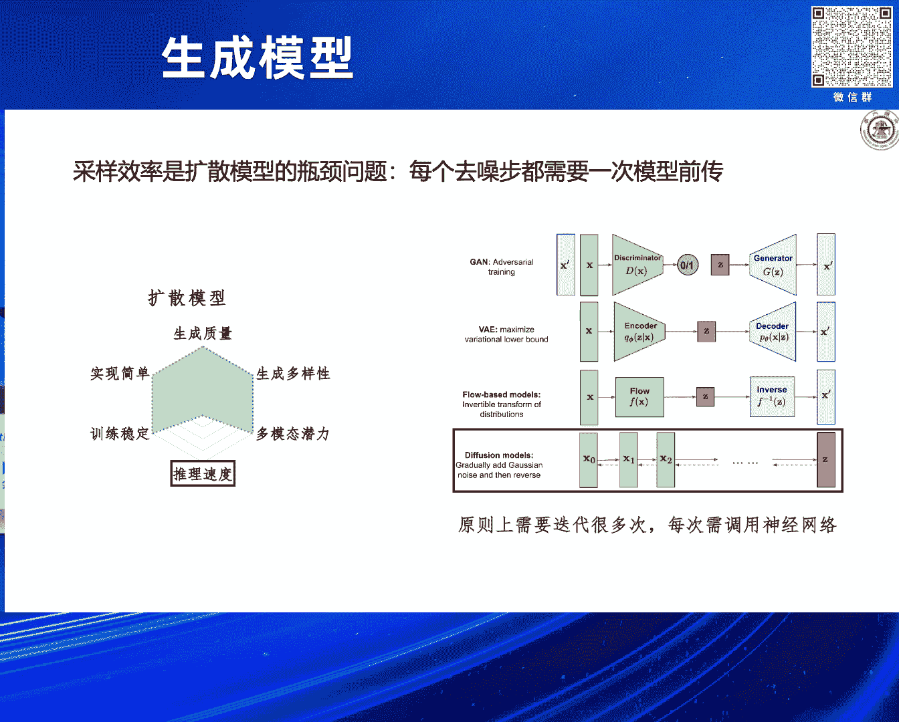

它是说什么呢？如果我们想同时从一个大语言模型里解码出N个token（N>1），那实际上等价于同时求解一个有N个方程的方程组。尽管这个方程组的第一个方程的解，第二个方程的解依赖于第一个，第三个又依赖于前两个，但我们仍然可以用并行的、不动点迭代求解器来求解。

可以从理论上证明，迭代步数可以不超过N。也就是说，要生成N个token，求解的步数可以小于等于N，并且求解出来的token严格服从我们想要的分布（例如，如果取argmax，就与贪婪解码生成的分布一致）。

这个公式可能比较晦涩，我们可以看直观的图。对于输入的一个前缀（prefix），我们先随机猜测N个token。猜出来之后，把它们一起丢到语言模型里做一次迭代，得到一个输出。输出中的token如果与输入的猜测相同，就将其固定下来。然后把剩下的、未固定的token再输入语言模型做下一次迭代。最后就会得到一个不动点。

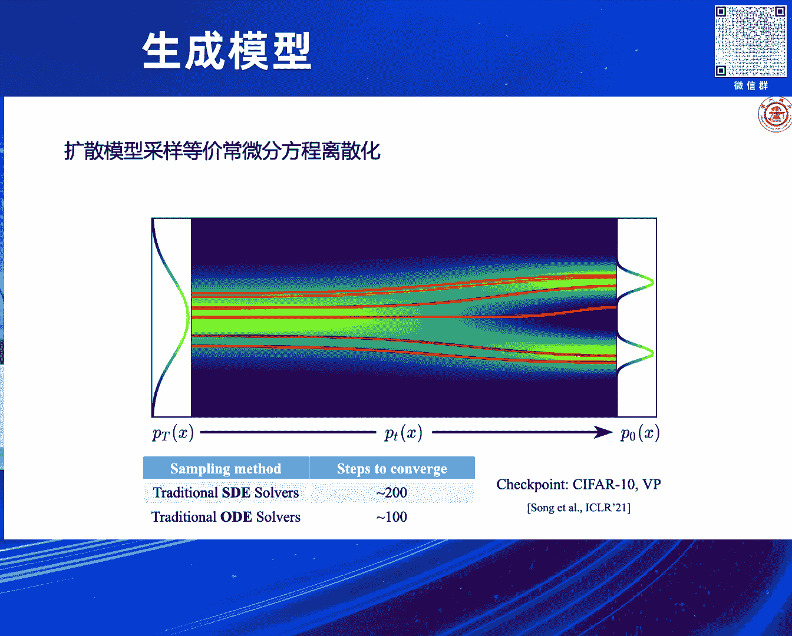

做起来其实很简单。它所用的时间类似于我们之前说的一次预填充的时间，与解码一次的时间也差不了多少，因此总时间不会引起太大开销。

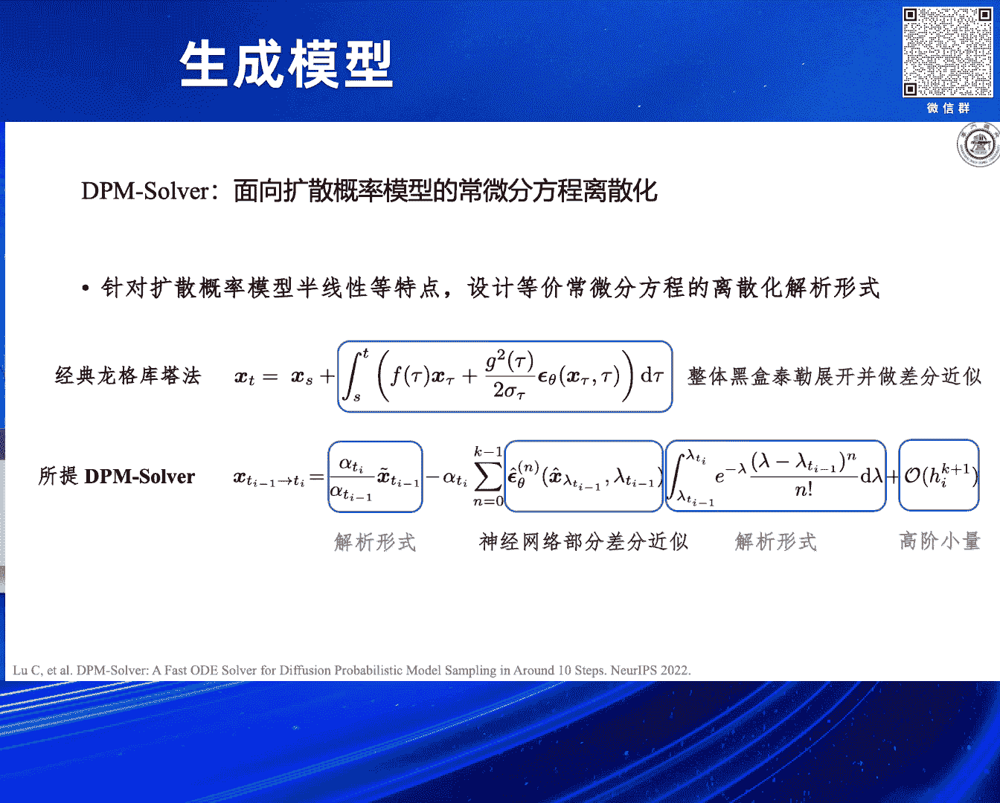

但是，2023年的一个工作发现，用这个方法相对于自回归解码只有约1.05倍的速度提升，不是很理想。原因主要在于模型在训练时没有学过如何预测多个token。例如，如果前面两个词没预测对，后面的词几乎不可能预测对，概率非常小。模型没有这个能力。

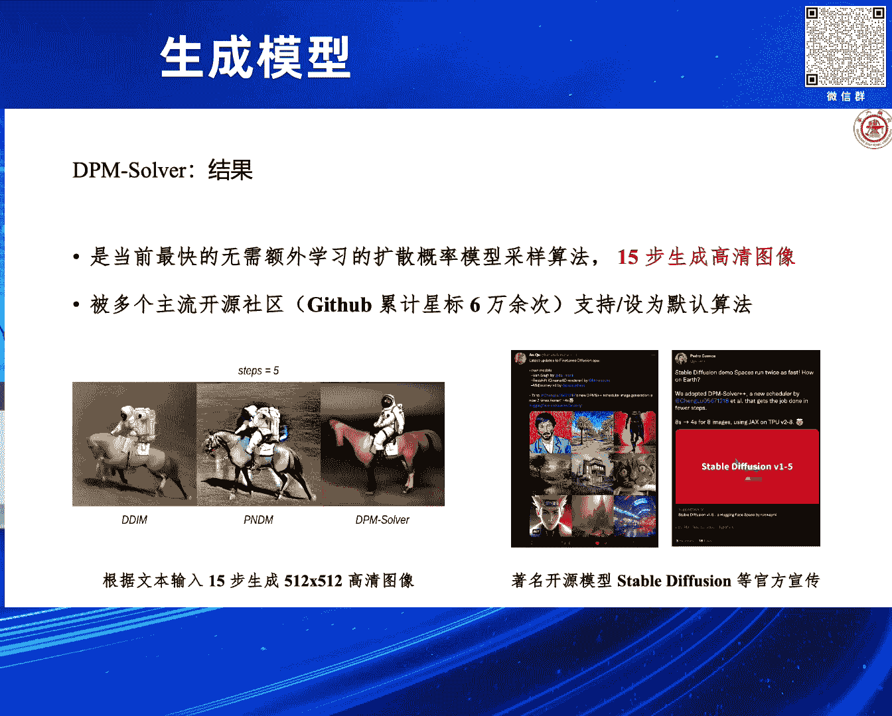

我们就想，得让模型学会这个能力，可能需要调整模型。那么，设计怎样的一种学习目标来调整模型呢？我们还是从雅可比解码这个不动点迭代的角度出发。

观察右边雅可比解码的轨迹图，它是不动点迭代的轨迹，其实很类似于扩散模型中ODE采样的轨迹。我们的终极目标，其实就是让模型直接从随机的初始化映射到最后的那个不动点，即学习这个映射。

但如果直接以这个作为损失函数去训练，是训不出来的，我们也做了一点尝试。因为这个问题太难了，一次往后猜十个词，这很难猜对。

那么我们就想有没有一些折中的方案。我们从一致性模型（Consistency Model）——也是孙杨博士做的对于扩散模型加速的工作——中得到了一些灵感。我们想，能不能把这个轨迹上的任意一个点，都映射到它的不动点上去？这样我们就可以定义一组损失函数、一组学习目标。

这一组学习目标有一个很好的性质：从最后靠近不动点的状态去预测不动点，这很简单（可能只需要预测一两个词）。但越往前（离不动点越远）越难。这就有一个从易到难的变化。这种变化对于大模型的训练来说，可以起到一定的引导作用，可能有一些课程学习的感觉。

最后，我们就用了这样的一个学习目标来训练。我们定义了两种选择来定义一致性损失函数（Consistency Loss）。一种就是我刚刚说的，直接从中间的任意一个不动点迭代状态去预测不动点。另一种则很类似于一致性模型里面的损失，即找两个相邻的不动点迭代状态，让模型对它们的预测保持一致。

但我们发现还有一个比较关键的点：需要把自回归的损失加上。如果不加上自回归损失，模型很有可能会崩塌，例如全生成出同样的一个token，或者找到一些捷径。因此需要用自回归损失来矫正它。

这是我们最终能够达到的效果。我们选了几个案例，当然也做了其他案例。基本上，对于现有的模型（如Llama或DeepSeek-Coder），拿过来简单微调一下（不需要调很久），用我们的损失函数微调后，基本可以达到2-3倍的加速，同时生成质量不会明显下降（在10%到5%以内的下降）。

这个表格里有我们系统性的比较结果，包括加速时间和性能。至多可以达到3.6倍的加速。我们知道现在市面上在大语言模型加速上比较权威的一个方法是Medusa（第二个版本）。Medusa需要对模型架构做改变（增加多个输出头），并且这些头很重，需要训练很久。而我们的方法不需要改变模型架构，只需要修改模型的训练目标即可。

在生成质量上，我们也可以达到基本不下降。例如，原始的模型在MT-Bench上是6.5分，我们微调后是6.4分，只有一点点下降。这是我们训练的开销：以预训练模型所用的token数作为基准，我们微调所消耗的token数占预训练token数的比例基本都小于0.1%到0.2%。

最后我们也分析了一下，这个一致性大语言模型带来加速的根源是什么。我们找了很多案例来看，发现主要有两个根源：
1.  **快速前向（Fast Forwarding）**：即一次可以预测对多个token。
2.  **平稳token（Stationary Token）**：在前面还有预测不对的情况下，可以提前把后面的某个词预测对。但这种情况相对于快速前向来说比较少，因为这件事确实很难。

---

## 第二部分：扩散模型的低步数推理与蒸馏 🎨

上一节我们介绍了大语言模型的相关进展，本节中我们来看看针对大型扩散模型的优化方法。扩散模型的推理慢，是因为每一个去噪步都需要一次模型前向传播。

之前大家比较关注的一个点是从设计扩散模型采样器的角度出发来加速推理。我这里引用的是李钟元老师的一个PPT。有一个视角是：扩散模型的反向SDE过程，有一个等价的常微分方程（ODE），称为概率流常微分方程。

我们发现这个常微分方程和它对应的随机微分方程（SDE），它们的边缘分布是一样的。但这个常微分方程更加平滑，这为我们在其上做快速采样提供了机会。我们可以用非常大的跳跃步长在常微分方程轨迹上行走。

因此，现在也有很多基于扩散模型的常微分方程离散化角度来做的工作。在2021年，大家发现即便用传统的ODE求解器，相对于SDE求解器也能有很大的速度提升，可以减少推理步数，例如减少两倍。

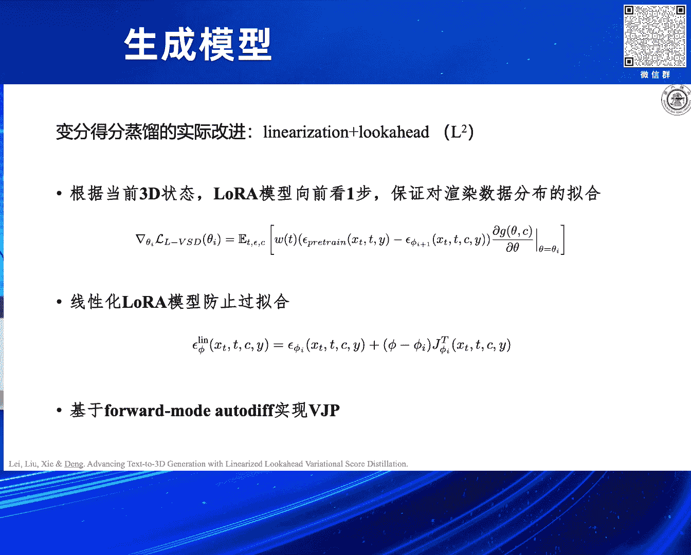

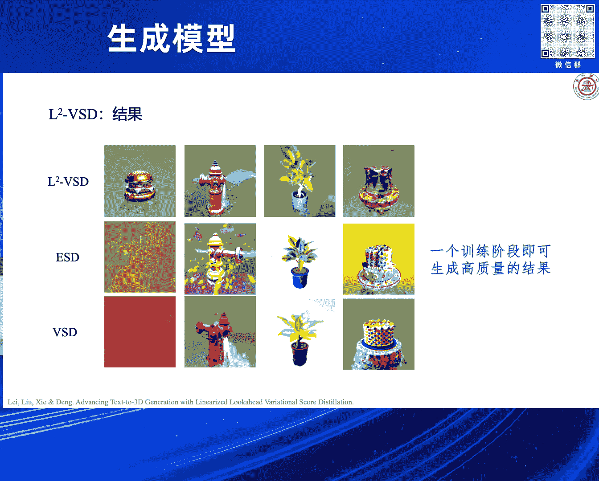

甚至，我们可以专门为扩散模型设计适合它的ODE求解器。这里面代表性的工作就是清华大学提出的**DPM-Solver**。它面向扩散概率模型的常微分方程离散化，利用了扩散概率模型半线性的特点，基于泰勒展开等技术来设计等价的常微分方程离散化的解析形式，最后再用一些差分来近似里面的计算项。

最终得到DPM-Solver。它的效果特别好，被社区广泛采用，例如主流的Stable Diffusion或ComfyUI都可能用到这个高效的采样算法。

我以DPM-Solver为代表，介绍了从采样器设计角度来加速扩散模型的方案。接下来我们会更多讨论从模型蒸馏的角度，如何实现低步数推理，加速扩散模型采样。

---

### 模型蒸馏加速法

最早出现的相关工作叫做**渐进蒸馏（Progressive Distillation）**。它很直观：假设原来需要做四步采样才能从噪声恢复出图像X，那么现在可以把中间每两步，蒸馏到另一个模型里去。直接让另一个模型基于噪声预测出两步之后的状态，或者说预测出从该状态到最终噪声的差值。

做了这样一次蒸馏过程后，就可以把四步的采样过程蒸馏为一个两步采样过程。如果再重复一次，就可以把两步蒸馏成一步。这样就可以渐进地减少扩散模型的采样时间。

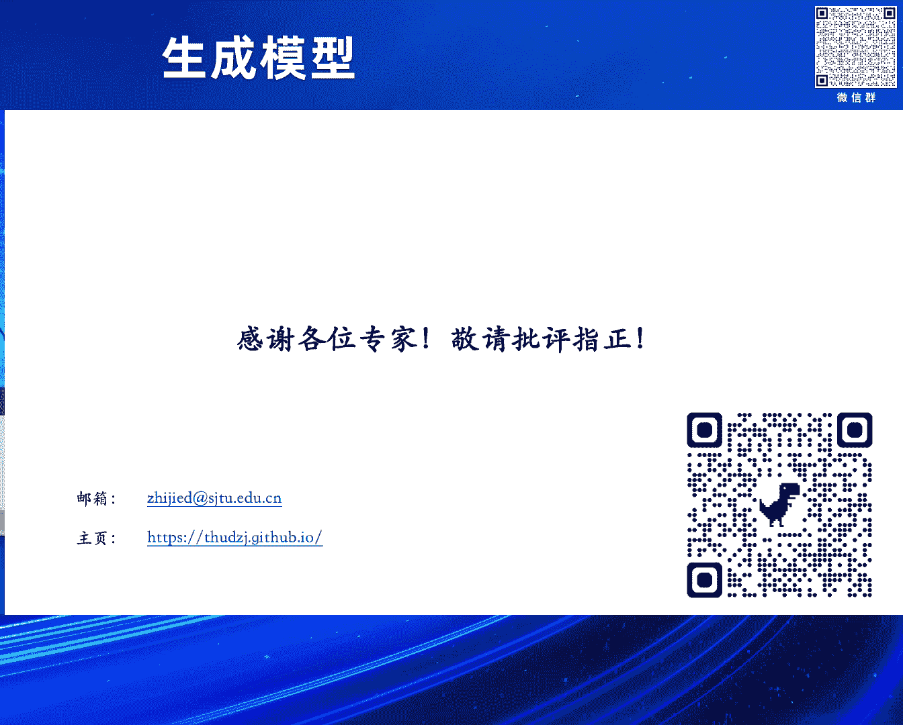

之后，CVPR 2023上的工作进一步改进了这种渐进蒸馏的方式，为其引入了