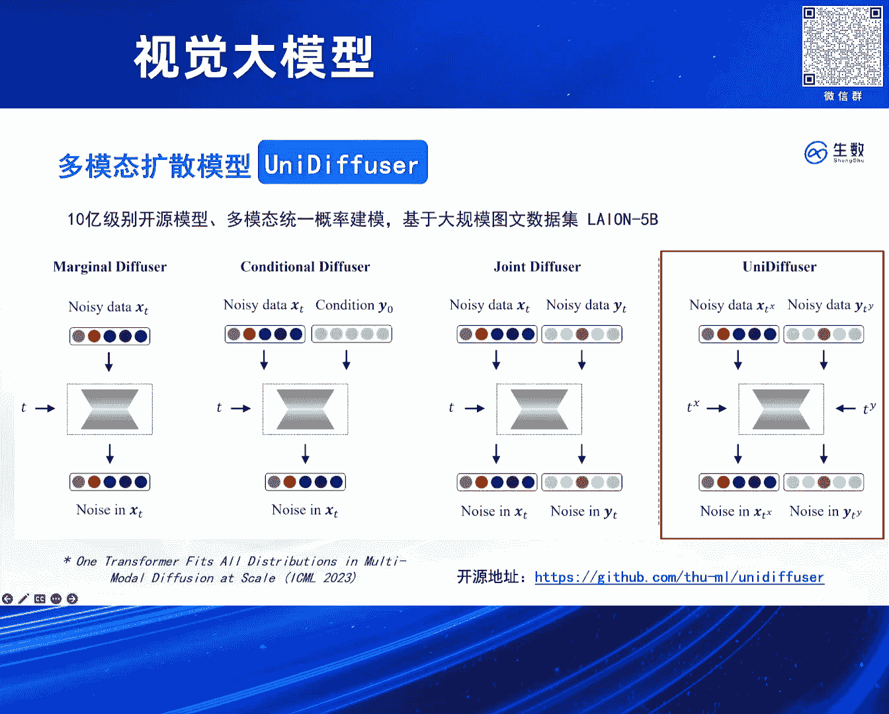
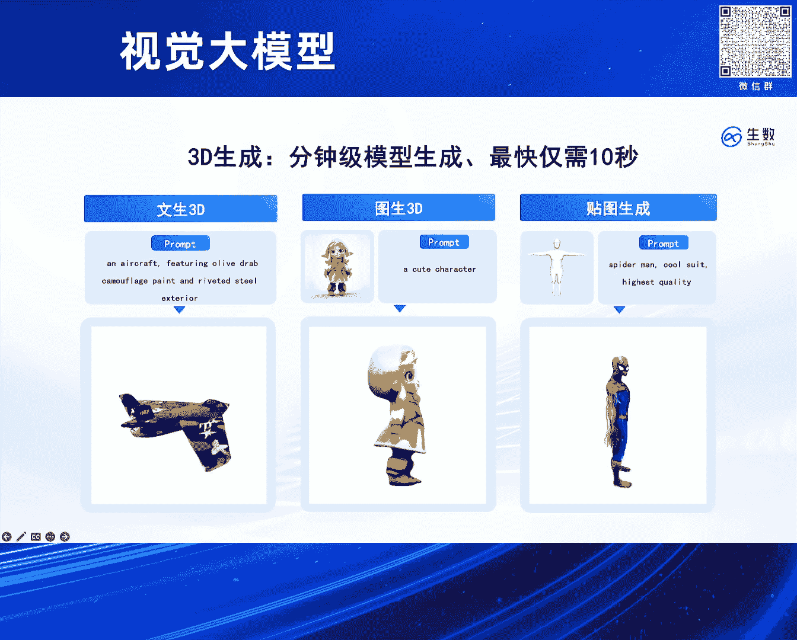
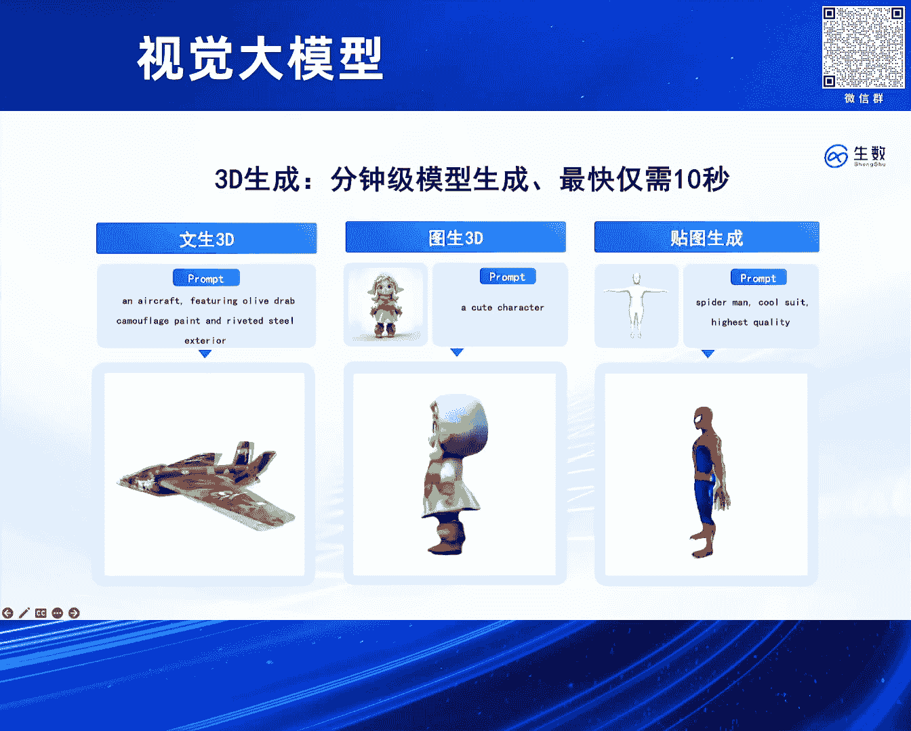

# 2024北京智源大会-视觉大模型---P3-高保真-4D-重构模型-Vidu4D-鲍-凡---智源社区---BV13x4y1t7sb

## 概述

在本节课中，我们将学习由鲍凡分享的关于生成式AI的实践，特别是视频大模型Vidu在4D内容生成方面的潜力。课程将详细介绍其底层技术架构、发展历程，并重点解析高保真4D重构模型Vidu4D的核心原理与应用。

---

## 技术路线与底层架构

上一节我们概述了课程内容，本节中我们来看看Vidu模型所基于的底层技术路线与架构。

该技术路线始于约两年前开始的UVIT架构研发。该架构比OpenAI的Sora及后续的DIT模型发表更早，是一个融合了扩散模型与Transformer的架构。

其核心思路是将图像分割成图像块（patch），对图像块添加噪声，然后使用Transformer对这些带噪声的图像块进行去噪。

我们的架构设计非常简洁。它将所有输入统一化为token序列。无论是扩散模型中的条件输入（condition），还是其独有的时间步（t），我们都进行无差别处理，统一转换为token。

**公式表示**：`输入序列 = Concat(图像Patch Tokens, 条件Tokens, 时间步Token)`

然后，我们将这些token拼接起来，送入Transformer进行处理。这种设计对Transformer架构几乎不需要任何改变。相比之下，DIT等论文中对Transformer做了不少针对扩散模型的特殊设计，例如使参数与时间相关的自适应层归一化。在我们的架构中，这些设计都没有采用。

因此，基本上可以快速地将任何一个Transformer转换成一个扩散Transformer。实验表明，这种简洁的设计效果非常好。

值得一提的是，我们也加入了一些独特的设计，例如长连接。它将底层的特征块与高层的特征块进行跨层连接，从而在训练中实现更快的收敛。这在大量实验中被验证是有效的。

---

## 大规模多模态尝试：UniDiffuser

在开发Vidu之前，我们已进行了大规模的多模态生成尝试。去年1月，我们发表了UniDiffuser工作，这是一个110亿参数的模型。

当时的目标是使用UVIT架构，构建一个统一的多模态生成式模型。该模型使用一个扩散模型，可以同时处理多个不同任务。

例如，在文本和图像模态上进行训练后，该模型能完成这两个模态之间的任意转换、各自独立的生成或联合生成。

值得一提的是，对于这个架构，我们只对扩散模型本身的Transformer部分做了最小改动。实际上，就是从单模态输入扩展到双模态输入，从单模态时间步扩展到双模态时间步，并同时预测两个模态上的噪声。

UVIT架构非常适合处理这类任务，因为它已经将所有输入统一成了序列。

当时，该架构在数据量和参数量上基本能够对标Stable Diffusion。这也首次验证了纯Transformer架构的扩散模型能够取得非常好的图像生成效果，这比Sora或最近开源的PixArt-α都要更早。

我们可以看一下将UniDiffuser架构在更高质量数据上进一步学习的效果。它支持多分辨率生成，无论是竖屏还是横屏，以及多种美学风格，都能很好地掌握。

因此，该架构在工业界和实践中被充分论证是有效的。同时，这种架构也具有非常好的语义理解能力，能够刻画提示词中的每一个细节。

基于这种架构，可以在其上搭建3D相关应用，例如纹理到3D、3D到纹理生成。这大致相当于论文中的两个环节。例如，在扩散模型基础上，使用类似VSD的蒸馏技术，可以从模型中蒸馏出3D表示。

---

## 从3D/4D工作到Vidu视频生成

除了图像模态，我们在3D和4D内容生成方面也做了不少工作。

例如，给定任意一段真实视频，可以提取其中物体的4D表示。基于这个4D表示，可以对物体进行任意编辑，这等效于对输入视频进行精确、可控的编辑。比如，将视频中的主体替换成其他小动物，或者将一只猫编辑成戴红帽子的小狗或北极熊。

并且，由于它是4D表示，可以从任意角度对其进行渲染。

除了4D物体编辑，对场景的编辑也支持得很好。这是使用高斯泼溅来表示3D场景，它具有非常好的可编辑性。可以在场景中添加或删除任意物体。例如，在这个案例中，我们可以在桌子上添加一个花瓶。其背后都是基于高斯泼溅的3D表示。

可以看到，我们在生成式建模领域有比较充足的耕耘，无论是底层的基础理论工作、网络架构工作，还是大规模工程落地实践，都有比较深厚的基础。

这些前期基础支撑了我们后续进行Vidu这个工作。Vidu是底层理论、网络架构、工程实践和数据共同作用的结果。

---

## Vidu视频模型与音频扩展

现在，大家可以看一下我们的Vidu模型。最近它已经能够支持生成32秒的视频。它是完全从头开始、一次性生成这32秒的视频。

**核心描述**：`Vidu = 基于 Diffusion Transformer 的单次长视频生成模型`

实际上，我们可以在生成的视频基础上，进一步为其添加音频模态。例如，通过视频生成音频或文本生成音频，可以为视频配上比较自然的音效。当然，我们目前的管线还是多阶段的。后续我们会探索一次性联合生成视频和音频，届时生成的音效可能会更加自然、更符合场景。

这包括画室内的场景，以及OpenAI也展示过的开车例子。我们可以进一步在这个例子的基础上，通过视频生成音频或文本生成音频的方式，为其补充背景音和汽车轰鸣声。

还有OpenAI展示过的摆满电视机的场馆例子。

---

## Vidu4D：高保真4D重构

最后，我们再提一下，在拥有Vidu这样的高质量视频模型之后，我们还能进一步做些什么。

视频生成模型具有大量真实的想象力，可以进一步增强3D/4D重建的一致性，具有作为“世界模拟器”的潜力。

这里我们想解决什么问题呢？给定一段生成的视频，我们希望提取出整段视频背后的3D表示。实际上，这种带有时序信息的3D表示就可以被称为4D（3D + 时间维度）。类似于NeRF重构，我们希望给定一段视频后，能提取出其中带有时序的3D表示。

在这个工作中，有一个核心技术叫做“动态高斯曲面”。如何理解呢？首先，我们需要对这种4D表示进行良好的建模。一种比较粗糙的方法是给每一帧一个独立的3D表示，但这显然是低效的。

因此，对于连续视频背后的3D表示，我们可以通过首帧的3D表示，加上后续每一帧的3D变化量来共同表示。这个变化量在这个场景下被称为“形变场”。

可以直观地理解为：对这个3D表示进行空间扭曲。例如，右下角那只猫在时间中发生了方向转换，我们可以用空间扭曲来表示这种变化量，这种空间扭曲在这里就被称作“形变场”。

这个4D重构技术与3D类似，包含两个基本的损失函数。

1.  **重构损失**：这个损失可以类比为NeRF中基于像素的重构。在这里，它是针对视频中每个像素点的重构。即从4D表示出发，通过体渲染渲染出预测视频，然后将预测视频与真实视频进行回归计算损失。
2.  **正则化损失**：这是关于表示本身的正则化损失。我们希望4D表示具有一些良好的性质，例如在时间上连续，在空间上平滑地分布在物体表面。因此需要一个额外的正则化损失来促进这一点。其效果是促使3D的高斯点能够比较均匀、光滑地分布在物体表面。

基于这两个损失，我们可以对3D视频进行重构。例如，左上角是一个4D表示的应用案例：输入是一段Vidu生成的视频，我们可以从中提取出4D表示（即左下角展示的、随几何变化的点云）。通过这个4D表示，可以渲染出左上角的猫。

进一步地，我们可以对这个4D表示进行任意编辑。这种编辑可以放到游戏引擎中进行手动操作，例如把一只耳朵变大、眼睛变大，然后可以进一步渲染出所需的新形态。

从Vidu4D这个工作中我们看到，视频大模型具有非常深刻的作为“世界模型”的潜力。我们可能真的能够模拟出世界上的各种物理规律，后续再结合3D或4D技术，提取出与这些物理规律相关的表示。

---

## 总结

本节课中，我们一起学习了视觉大模型Vidu及其高保真4D重构扩展Vidu4D。我们从其简洁统一的UVIT架构讲起，回顾了其在大规模多模态生成上的实践，并深入探讨了Vidu如何实现长视频生成。最后，我们重点解析了Vidu4D的核心思想：通过“动态高斯曲面”技术和重构与正则化损失，从视频中提取出带时序的4D表示，从而实现高保真的4D内容重构与编辑，展现了视频模型作为世界模拟器的巨大潜力。