# 2024北京智源大会-视觉大模型---P5-高效能个性化图像生成-程明明---智源社区---BV13x4y1t7sb

## 概述

在本节课中，我们将学习程明明教授在2024北京智源大会上分享的关于高效能个性化图像生成的研究工作。课程将涵盖三个核心部分：提升扩散模型训练效率的Mask Diffusion Transformer、实现快速个性化生成的PhotoMaker，以及生成一致性视频/连环画的Story Diffusion。我们将深入探讨这些技术如何解决当前图像生成模型在资源消耗和个性化能力方面的挑战。

---

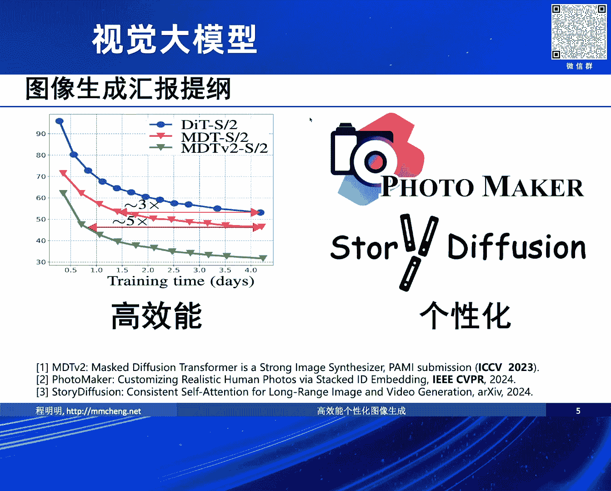

## 早期图像生成的探索

早在十多年前，研究者们就开始探索如何用文字生成图像。当时，由于缺乏强大的GPU和海量数据，这项工作非常困难。早期的尝试包括从简单的草图开始，然后通过互联网搜索图像进行合成。这类工作曾受到广泛关注，在短时间内获得了大量浏览，并获得了奖项。当然，这些早期探索在结构和方法上与现今基于扩散模型的文生图技术有巨大区别。

现今的图像生成方法，大家已经比较熟悉，基本上都是基于扩散模型。由于前面的报告已经详细介绍了扩散模型，这里不再赘述。

---

## 第一部分：高效训练 - Mask Diffusion Transformer

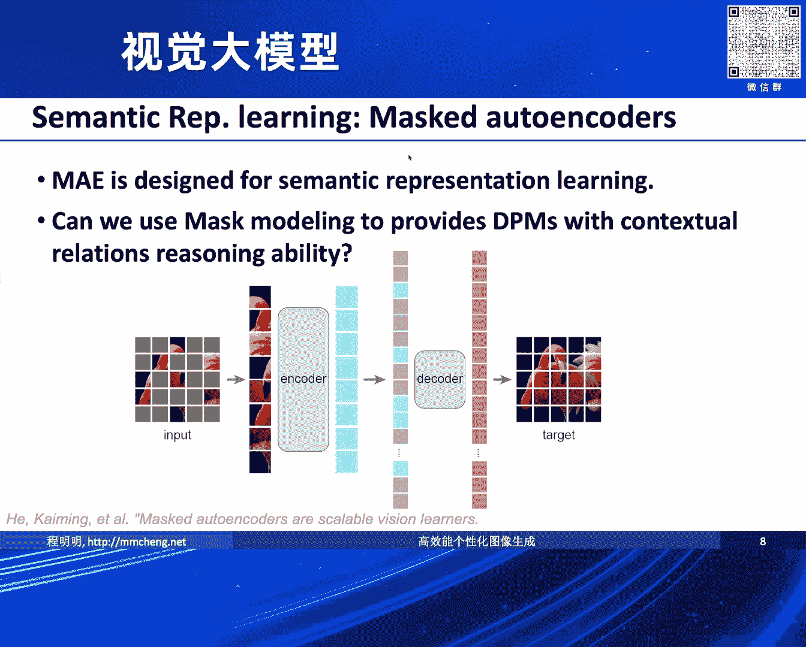

上一节我们回顾了图像生成的发展历程。本节中，我们来看看如何提升当前扩散模型的训练效率。当前基于扩散变换器的模型在训练时，对资源的消耗非常巨大。

在理解现有图像生成模型时，我们发现，许多视觉模型早期致力于学习各种表征来理解图像，而近期则更多尝试通过文字或多模态信息进行生成。理解与生成这两者应该是相互促进的。

基于扩散变换器的模型在训练生成高质量图像时，需要的迭代次数非常多。例如，在生成小狗图像时，经过多次迭代，模型虽然能处理好局部细节和噪声，但在生成结构化信息（如完整的人脸，避免缺少眼睛或鼻子）方面存在不足。这表明模型缺乏对上下文关系的建模能力。

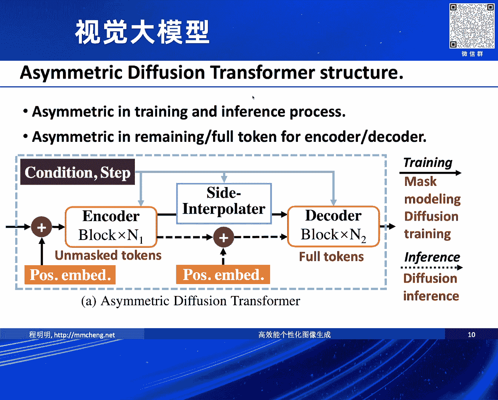

因此，我们思考：既然因为缺少这种建模能力导致训练时间很长，有没有可能强化它在这方面的能力，从而加速模型收敛？

从这个角度出发，我们考虑将掩码自编码器的能力引入进来，以强化其结构化建模能力。MAE是一种无监督的语义表征学习方法，它通过随机掩码图像的一部分，并利用未掩码的部分来恢复被掩码的区域。这种模型在学习视觉表征时，必须建模图像中不同块之间的关系。

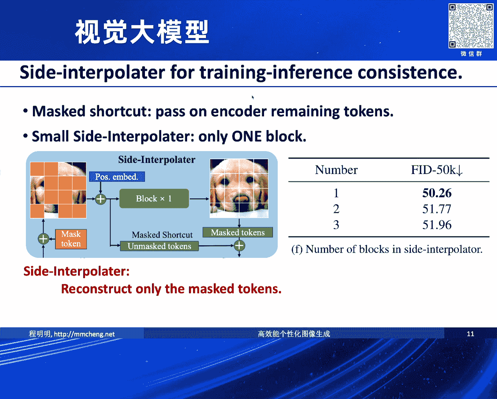

我们认为这种能力能极大地强化对块间上下文关系的建模。基于此，我们提出了一种新工作：将MAE机制引入到扩散模型的训练过程中。

我们希望，在训练过程中引入掩码建模机制，能够加速扩散模型对上下文建模的能力，进而加速模型收敛。在推理过程中，则希望这个过程尽量平顺，不额外增加推理速度。

以下是该方法的大致流程：
1.  对于一个潜变量的表达，我们应用一个掩码机制。
2.  将未被掩码的潜变量部分送入一个非对称的扩散变换器。
3.  在训练阶段，模型接收不完整的潜变量，并通过MAE机制进行推理，以加强表征间的联系。
4.  在推理阶段，模型像正常的扩散模型一样接收完整的潜变量表达，并生成图像。

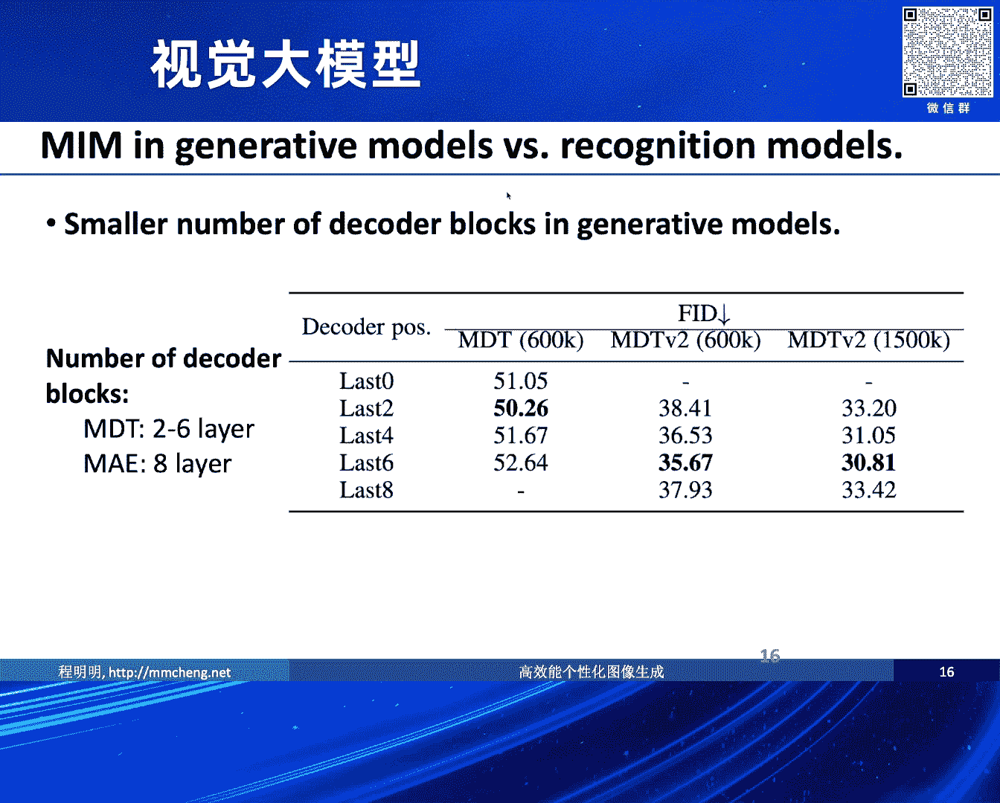

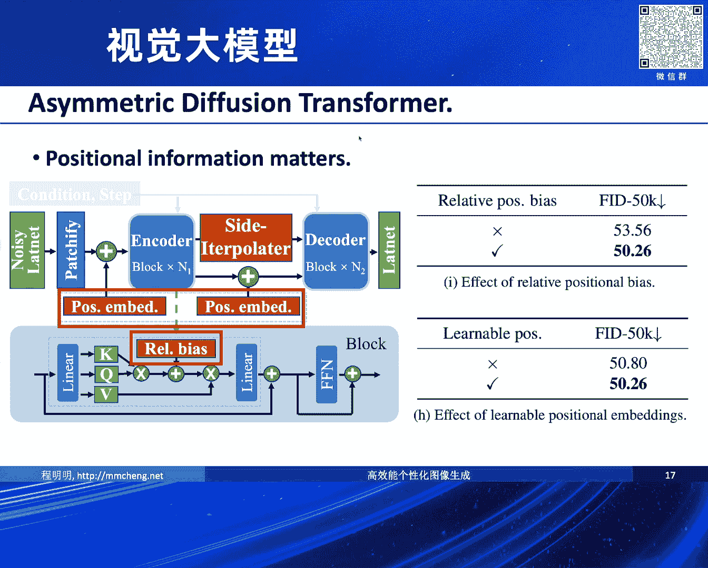

对于这个非对称扩散变换器，其主要区别在于训练和推理阶段。训练阶段需要对掩码区域进行推理。在这个过程中，我们发现重构掩码区域（称为语义解释器）不需要太多的块，一个不大的块就足以建模上下文关系，更多的是引导视觉表征在训练过程中关注其他块之间的一致信息。

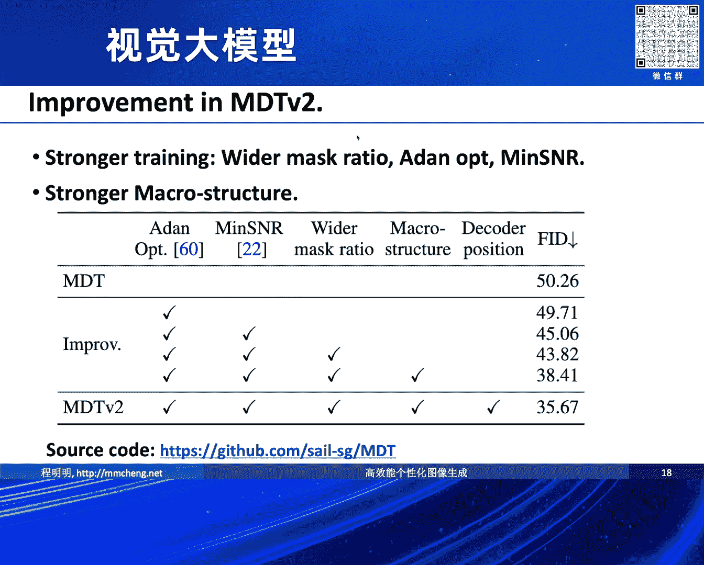

这就构成了我们所说的掩码扩散变换器工作。

---

## 引入多尺度建模

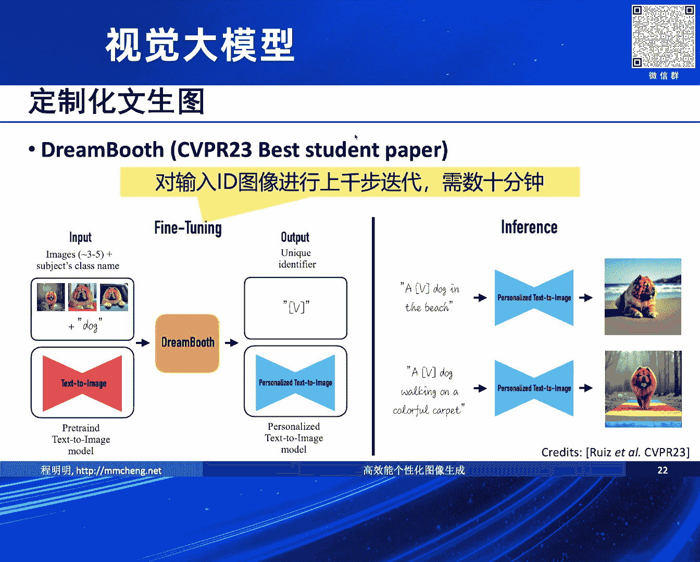

上一节我们介绍了通过引入MAE机制来加速训练。本节中，我们进一步探讨如何通过多尺度建模来增强模型能力。一提到上下文，很容易联想到视觉中的多尺度信息。理解上下文通常需要大尺度的信息。

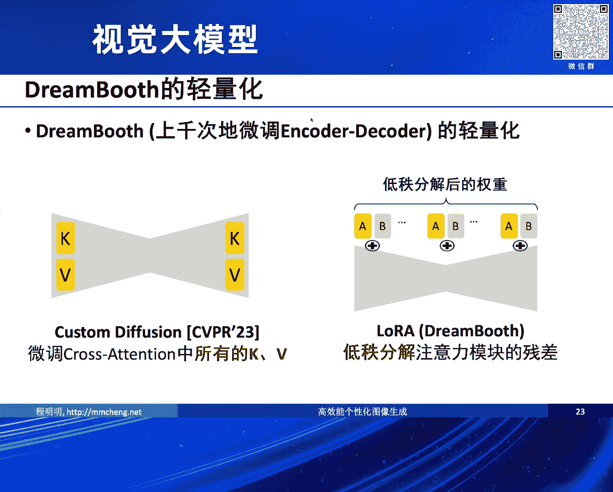

因此，我们近期对MDT模型做了进一步改进，通过跳跃连接等方式，将多尺度建模能力加入进去。加入之后，我们发现整个MDT模型相对于之前的DIT模型，在图像生成过程中的训练速度，无论是迭代次数还是实际耗时，都得到了极大提升。

具体提升如下：
*   **MDT V1版本**：相对于DIT，速度提升了约**3倍**。
*   **引入多尺度连接后**：模型的训练效率进一步提升了约**5倍**。
*   **整体而言**：要达到相同的生成质量，提速大约在**10倍**以上。

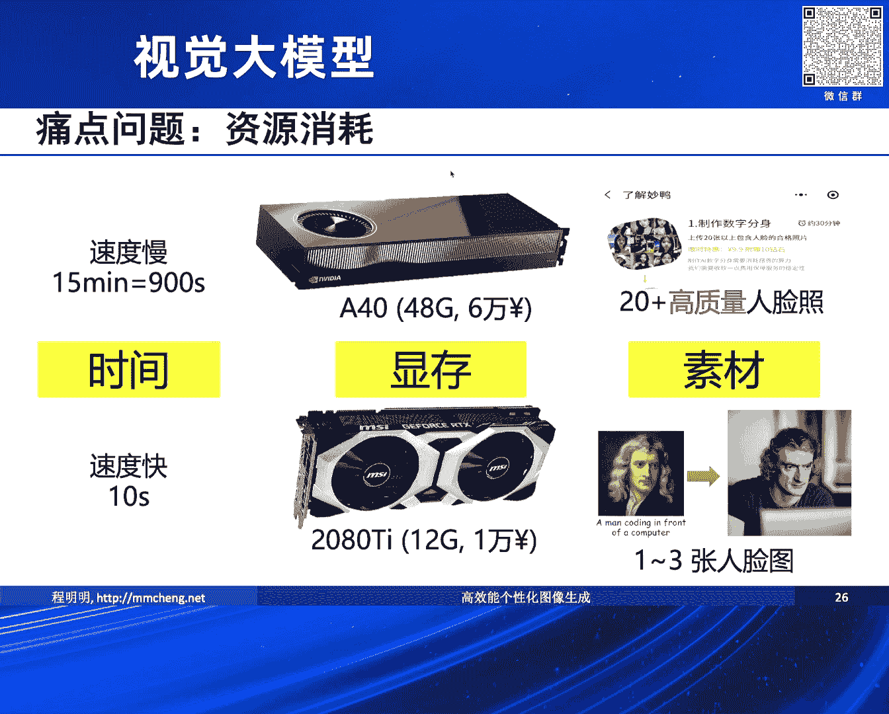

利用这个方法，我们在EMNLP 2023的“Paper with Code”图像生成任务排行榜上也取得了较高的分数，刷新了记录。

可以看到，有了掩码扩散变换器，它能在很大程度上加快模型收敛速度，将MAE的上下文建模能力与扩散模型强大的细节生成能力相结合。此外，只需要一个非常小的模型就可以完成。论文中还包含了许多关于结构设计的细节信息。

---

## 第二部分：快速个性化生成 - PhotoMaker

上一节我们探讨了如何提升模型训练效率。本节中，我们来看看图像生成的另一个关键方向：个性化。我们希望图像生成模型不仅有高质量的产出，还要有强大的个性化能力。从应用角度讲，现阶段图像生成模型可能更多服务于泛娱乐化应用，因此用户的参与感和个性化非常关键。

基于这个判断，我们今年初开源了两个工作：**PhotoMaker**（与腾讯合作）和**Story Diffusion**（与字节跳动合作）。PhotoMaker发布后非常受欢迎，一度在Hugging Face上占据自然图像生成和风格化图像生成榜单的第一和第二名。

这个工作受启发于2022年CVPR的最佳学生论文**DreamBooth**，它是一个重要的个性化图像生成工作。它需要给定少量示例图像，然后让模型生成更多与示例相关的个性化图像。然而，DreamBooth需要对整个生成模型进行微调，需要的迭代时间非常长，资源消耗大。

虽然后续有很多工作尝试加速，但只要涉及微调整个模型，时间就很难大幅缩短。这类技术在过去一段时间受到了极大关注，也催生了大量应用，例如国内的“妙鸭相机”。用户需要上传约20张高质量照片，等待约半小时才能获得定制化模型。

这些方法依然存在不少挑战，最主要的就是**资源消耗大**和**等待时间长**。我们的目标是实现用户可接受的速度，例如**10秒钟内**出结果，并且对显存消耗不大，普通消费级显卡就能运行。同时，方法对输入素材的质量要求不高。

同期，Adobe、Google等公司也有类似避免测试时优化的工作，但开源较少，且生成质量较低、姿态较单一。这类工作之所以有这些问题，是因为其输入图像和目标图像往往来自同一张图。模型从一个单一的嵌入向量中，很难区分用户想要的是人物身份、姿态，还是图像本身的风格，因此缺乏变化性，生成的姿态比较单一。

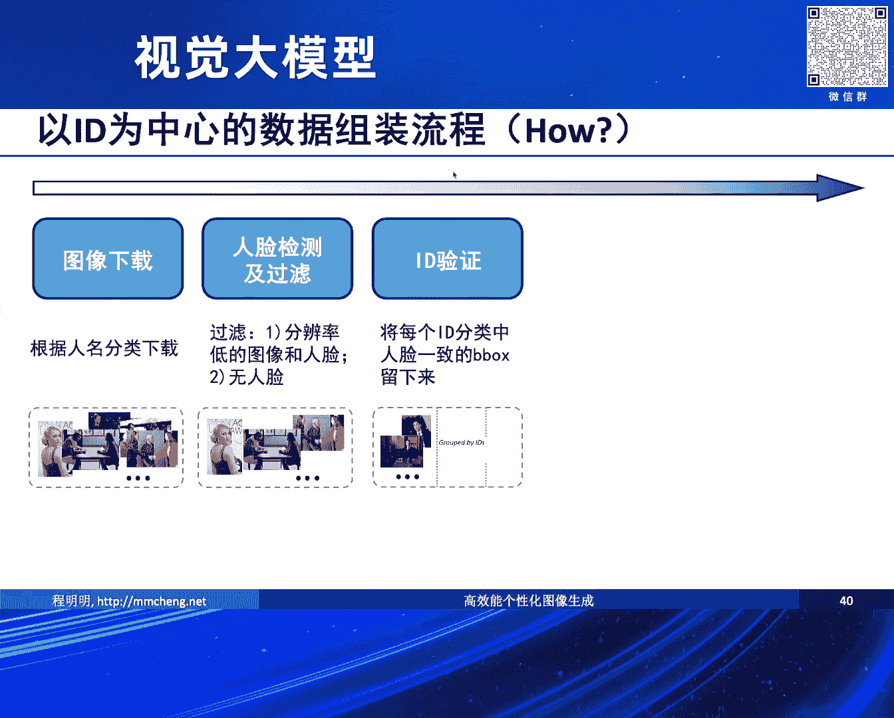

我们的方法不同之处在于：输入的不是单张图像的嵌入，而是一组图像的**堆叠ID嵌入**。我们希望模型从这组图像中关注到人物的个性化信息（如人脸属性），而不是去记忆某一张图的姿态或退化风格。这样能避免对姿态或图像退化的记忆，更多地关注人脸属性。

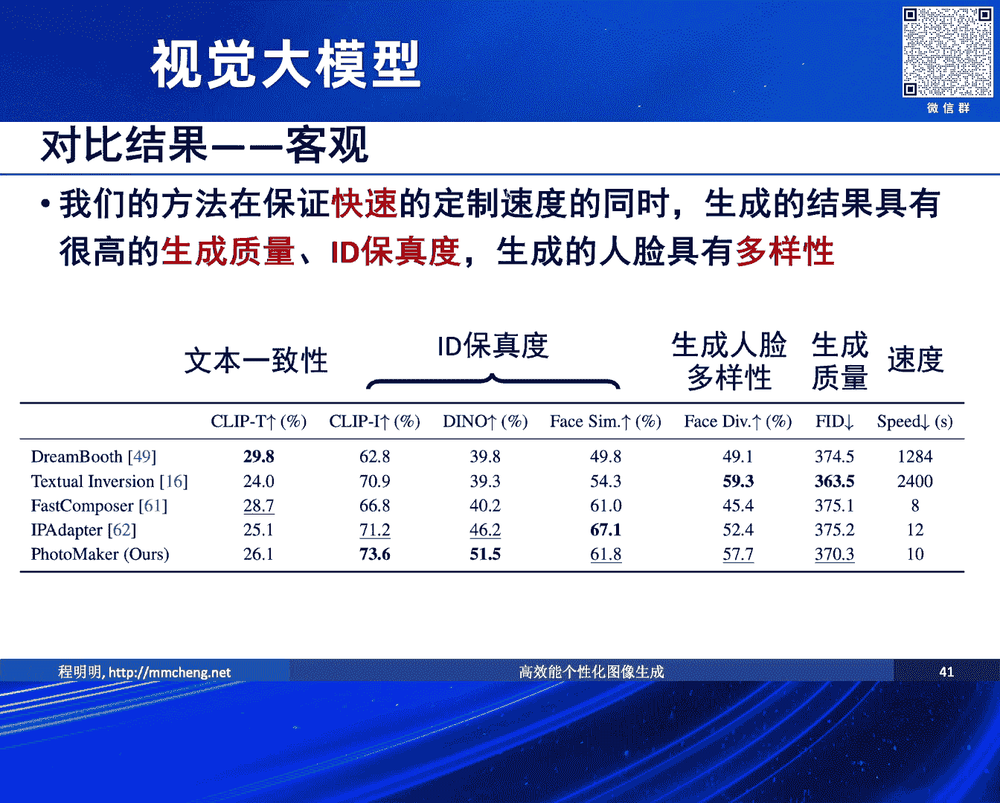

以下是该方法的核心流程：
1.  将多张输入图像送入图像编码器，提取图像嵌入。
2.  将这些图像嵌入与文本描述结合，得到一个堆叠ID嵌入。
3.  用这个堆叠ID嵌入替换掉文本中原本的视觉表征，从而影响扩散模型，而无需为每个人微调整个模型。

因此，它的速度可以得到极大提升。在测试时，甚至可以用多张图像进行不同人物ID的混合。为了训练这个模型，我们构建了一个以人物ID为中心的数据集，包含约1.3万个ID和11万张图像，用于训练模型获取人物属性的堆叠ID嵌入。

这样，我们能够在保证快速的同时，生成具有高保真度ID和丰富人脸多样性的结果。该方法对输入图像质量和清晰度没有严格限制，不会学习图像的退化信息，实验中没有发现明显的过拟合，也能进行很强的风格化生成。

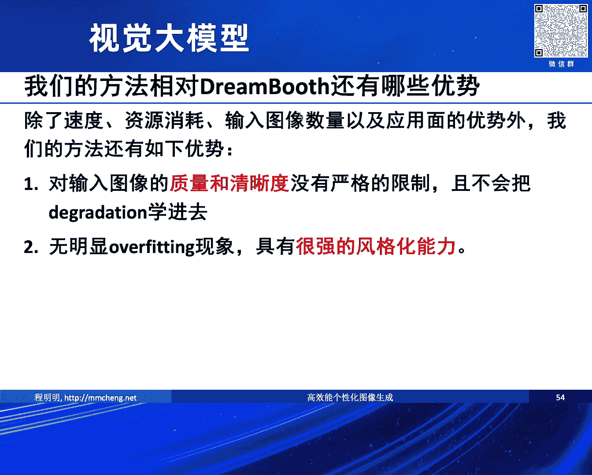

---

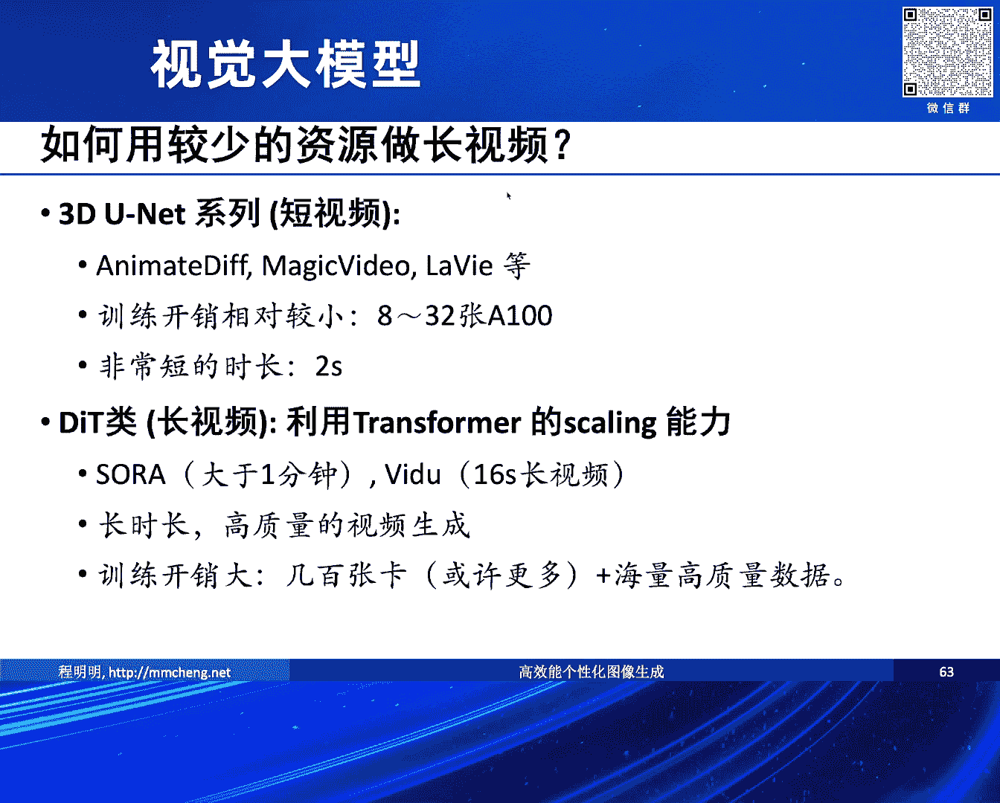

## 第三部分：一致性视频生成 - Story Diffusion

上一节我们介绍了快速个性化图像生成。本节中，我们来看看如何将这种能力扩展到视频生成。最后一个工作是Story Diffusion，我们试图生成具有一定一致性的动画或较长视频。我们的目标是**用较少的资源生成较长的视频**。

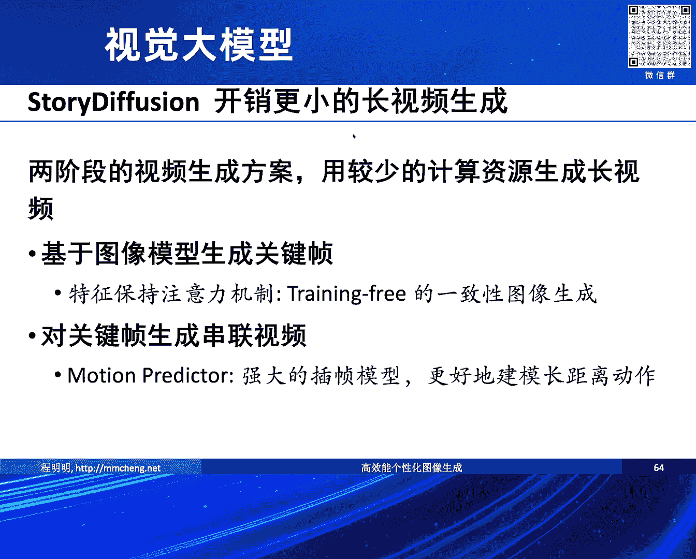

我们的大致方案是一个两阶段的视频生成流程：
1.  **生成关键帧**：首先根据一段故事文字生成一系列关键帧，这些关键帧之间需要保持高度一致性。
2.  **插帧生成视频**：将这些关键帧串联并插值，生成完整的视频。

要从关键帧串联成视频，关键帧必须具有一致性，否则人物或场景会突变，无法连贯。因此，我们需要一个强一致性的图像生成策略。同时，从关键帧到视频的插帧不仅仅是时间维度的超分，需要建模更强大的插帧能力。

具体来说：
*   **关键帧生成**：给定一段描述视频的文字，将其分割成若干句话，每句话生成一个关键帧。在此过程中，我们提出了一种**特征保持自注意力机制**，利用同期生成的其他帧的特征，使得不同帧之间具有较好的相似性和相关性。
*   **视频插帧**：即使有了相关性较好的关键帧，如果用传统基于光流的方法插帧，效果也会很差，因为图像间无法做到像素级的对应。我们提出了一种新方法叫**运动预测器**。它在语义空间中进行插值，然后将表征投射回图像空间，从而避免了对像素级对应关系的建模，能够处理幅度较大的动作变化。

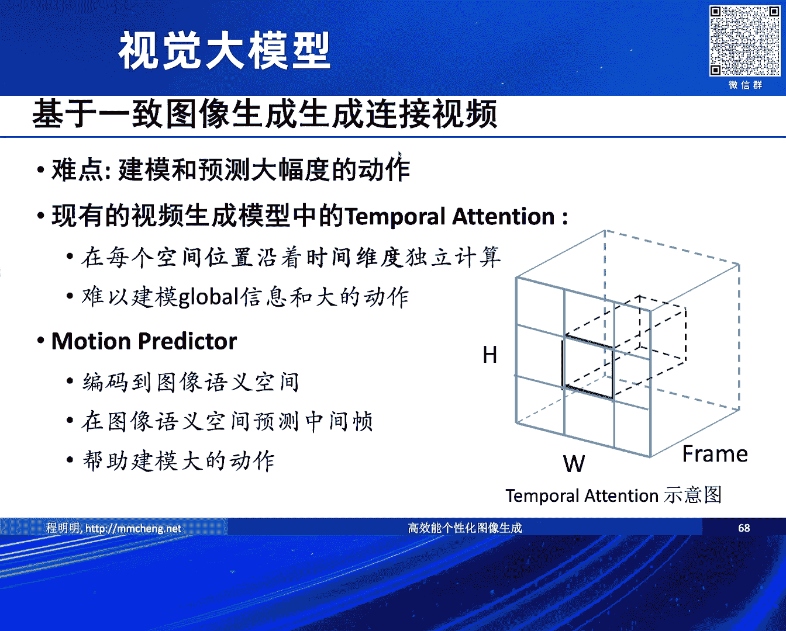

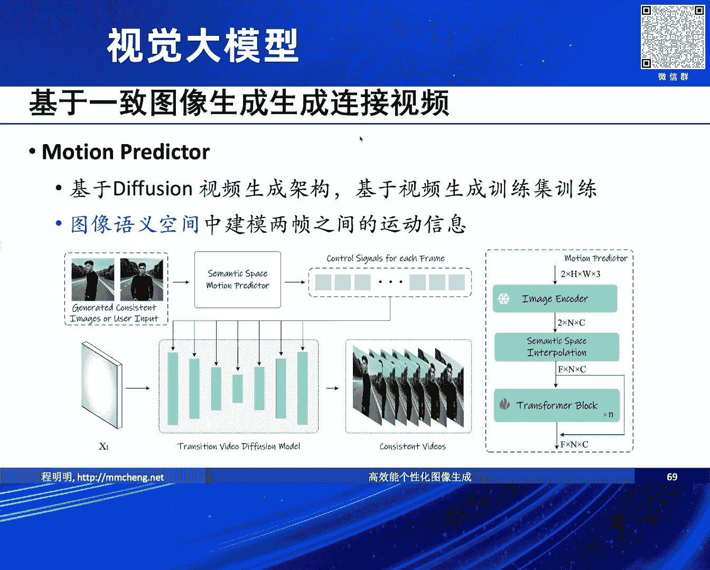

整个方法可以利用现有的许多数据进行训练。生成的结果显示，人物的动作和人脸没有大的扭曲，能够进行不错的视频生成。它可以将不同的关键帧插值成一段视频，虽然仍有不尽如人意之处（如转场中发型变化），但如果用于生成连环画，其一致性就非常出色。

这对于漫画创作等领域，有望极大地解放生产力。例如，自动为一段文字生成配套的连环画图像。

---

## 总结与展望

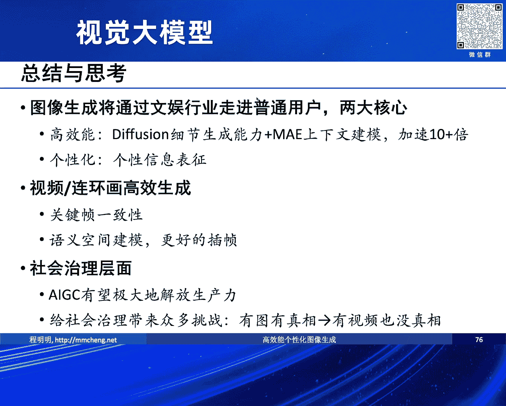

本节课中，我们一起学习了高效能个性化图像生成的三个核心工作。

1.  **Mask Diffusion Transformer**：通过引入MAE的掩码建模机制，强化了扩散模型对上下文关系的建模，显著提升了训练效率，加速可达10倍以上。
2.  **PhotoMaker**：通过堆叠ID嵌入技术，实现了无需微调、快速（秒级）的个性化图像生成，对输入图像质量要求低，且保真度高。
3.  **Story Diffusion**：通过两阶段（关键帧生成+运动预测插帧）方法，实现了用较少资源生成长度较长、一致性较好的视频或连环画。

图像生成技术正通过文娱行业走近普通用户。要广泛应用，需要解决两个核心问题：一是**高效能**，以降低计算成本；二是**个性化**，以增强用户参与感和趣味性。此外，在视频生成中还需关注**一致性**。

AIGC有望在漫画创作等领域极大解放生产力，但同时也给社会治理带来了挑战，例如深度伪造技术可能模糊真实与虚假的界限。

---
**注**：以上所有介绍的工作均已开源。