# AI与科学的共生未来-p02-国际嘉宾

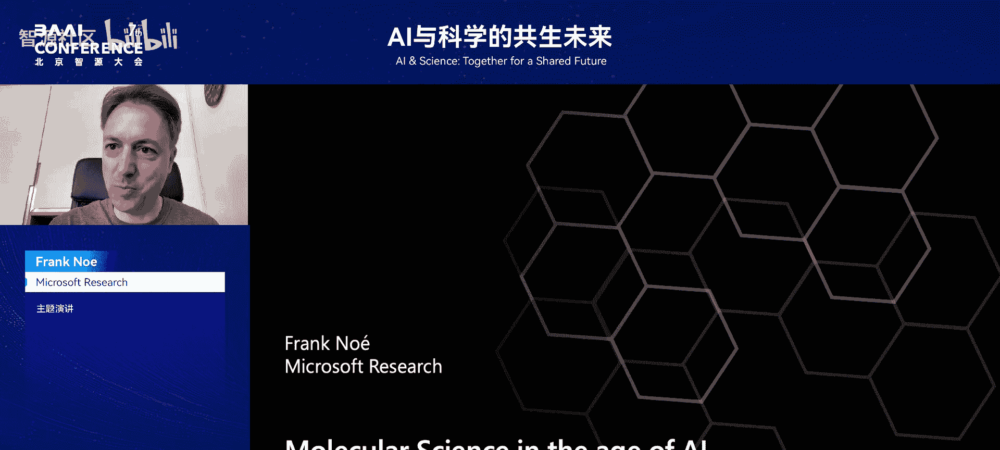

在本节课中，我们将探讨深度学习如何从一项通用技术演变为科学发现，特别是分子科学与生物物理学领域的强大工具。我们将回顾关键的技术突破，并深入理解深度学习如何解决电子结构计算和生物分子功能模拟等复杂科学问题。

## 深度学习浪潮的兴起

上一节我们介绍了AI与科学结合的宏观背景，本节中我们来看看推动这一结合的关键技术事件。深度学习如今已无处不在，但其成功依赖于几个关键节点。

以下是几个标志性事件：
*   **2011年**：AlexNet发布，这是由Geoffrey Hinton及其学生开发的第一个成功的深度学习系统，赢得了ImageNet竞赛。
*   **2013年**：NVIDIA发布了GeForce GTX Titan GPU，这标志着GPU成为进行大规模代数运算的“桌面超级计算机”，变得真正实用。
*   **2015年**：Google发布了TensorFlow，这使得深度学习技术变得易于获取，成为一股巨大的浪潮。

这些发展使深度学习迅速渗透到各个科学领域。

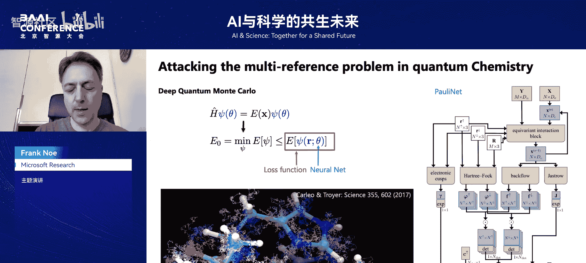

## 深度学习在分子科学中的应用

在科学领域，AI的应用常让人联想到药物发现、蛋白质设计等。然而，这些应用都建立在底层技术之上，例如分子模拟技术。分子模拟主要包含几个层次：

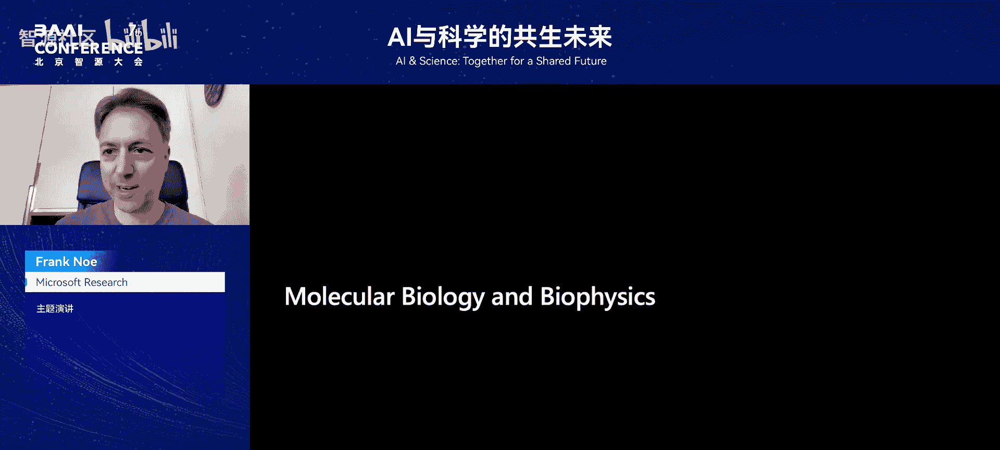

1.  **电子结构**：求解薛定谔方程以获得分子的电子状态。
2.  **力场与分子动力学**：计算原子间的相互作用力并模拟其运动。
3.  **热力学与动力学性质**：基于模拟计算分子的平均性质，这些性质与药物或材料发现息息相关。

每个领域都可以用一个核心方程来概括其本质。对于电子结构，核心是**定态薛定谔方程**：

```
Hψ = Eψ
```

其中 `H` 是哈密顿算符，`ψ` 是波函数，`E` 是能量。波函数 `ψ` 是一个复杂的高维函数，且具有反对称性（交换两个电子坐标，函数值变号），这使得精确求解非常困难。深度学习擅长寻找复杂的高维函数，因此能在此发挥作用。

2020年，研究者们首次发布了用于求解分子薛定谔方程的深度学习架构（如PauliNet和FermiNet）。这些方法并非传统意义上的从数据中学习，而是利用神经网络的优化机制，直接求解能量泛函的优化问题，从而获得了高精度的电子结构解。

如今，该领域已发展到更像机器学习：训练一个神经网络，使其能够同时预测一个分子在不同几何构型下的基态和激发态电子结构。这比传统量子化学方法（需为每个构型单独计算）的成本摊销得更低。

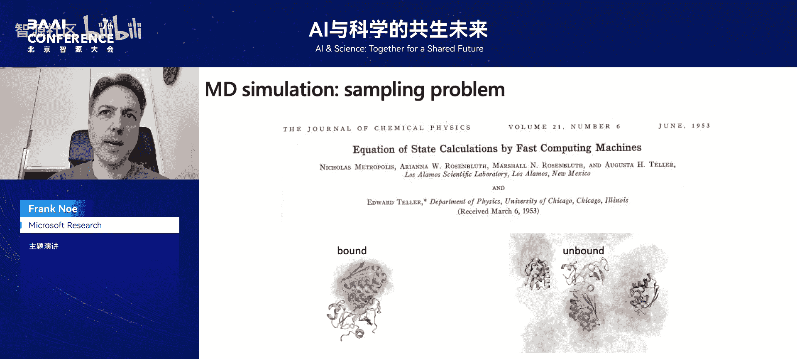

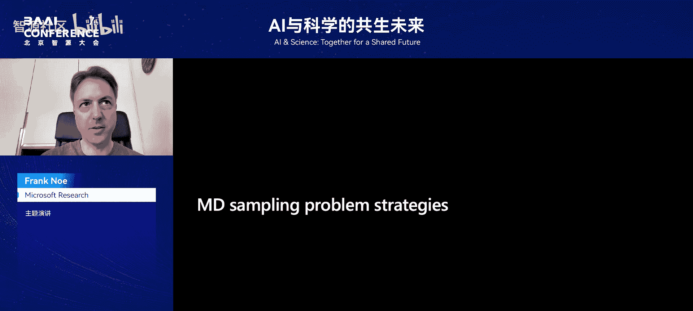

## 生物物理学：从序列、结构到功能

上一节我们探讨了深度学习在基础物理方程求解中的应用，本节中我们来看看它在更复杂的生物系统中的应用。分子生物学可粗略分为序列、结构和功能三个层面。

目前，序列和结构问题已得到较好解决：
*   **序列**：下一代测序技术已能产生海量数据（如UniProt数据库）。
*   **结构**：通过实验（X射线、冷冻电镜）和AI预测（如AlphaFold），我们已能大规模获得高精度蛋白质结构。

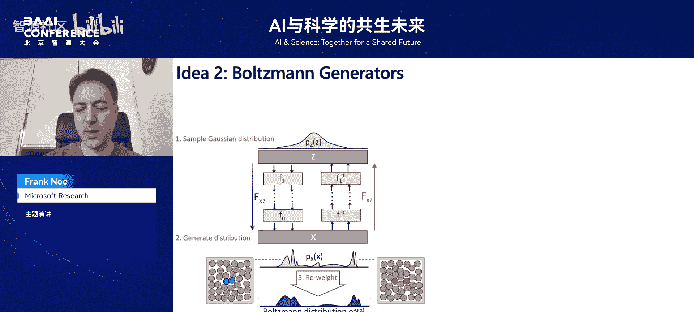

然而，对于**生物分子功能**，我们尚无类似的通用工具。这里的功能指的是分子层面的工作机制：分子有哪些不同的构象状态？会形成哪些复合物？在不同条件下，状态间转换的概率和速率是多少？如果我们能模拟这些，就能从根本上理解生物学，并更好地设计药物。

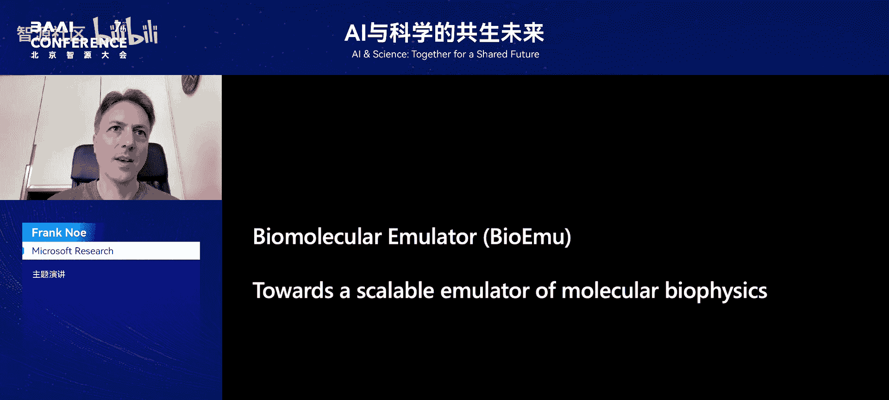

我们期望的工具是：输入目标分子（蛋白质、配体等）和实验条件（温度、pH值等），系统能预测与之相符的分子结构集合（系综），并允许我们计算相关性质（如结合亲和力）。分子动力学模拟原则上可以做到这一点，但它面临一个自1953年Metropolis提出蒙特卡洛方法以来就存在的根本问题：**采样效率极低**。

例如，模拟两个小蛋白质（Barnase和Barstar）的结合与解离过程，可能需要百万GPU年。这显然是不可扩展的。

## 加速生物分子模拟的尝试

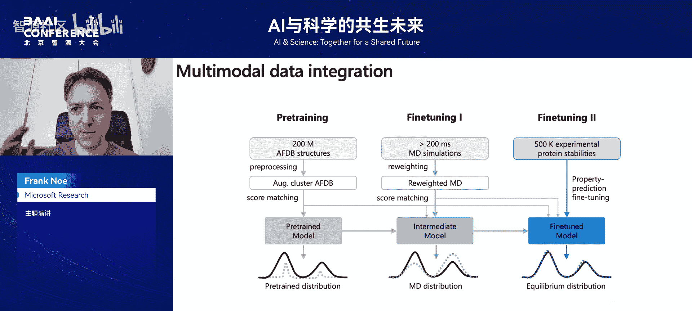

为了解决采样难题，科学家们尝试了多种方法。

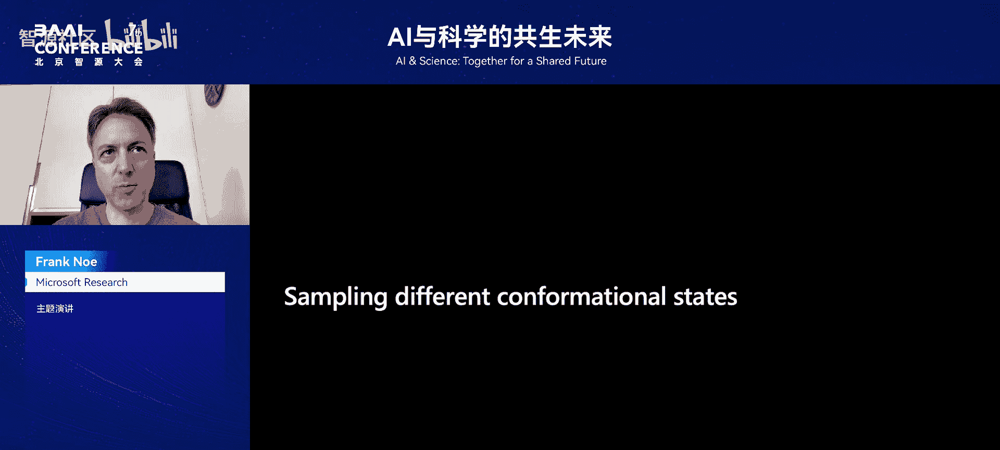

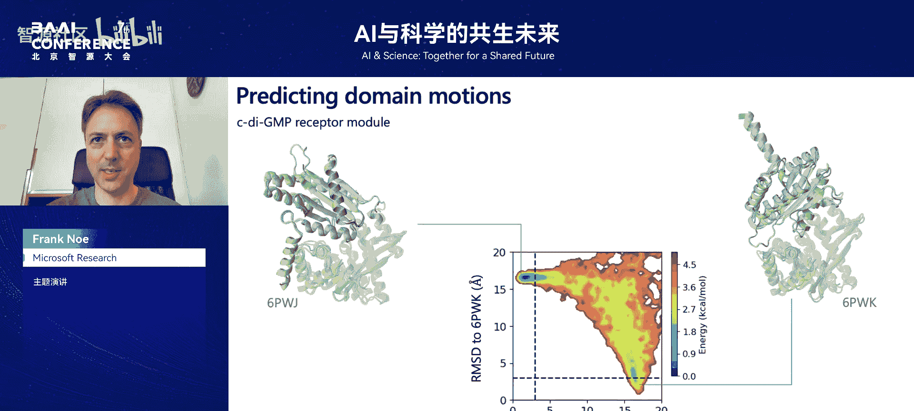

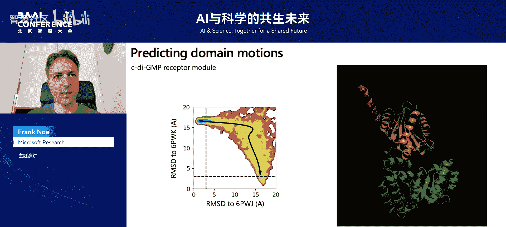

以下是两种主要思路：
*   **马尔可夫状态模型**：这是一种“分而治之”的方法。将分子的状态空间划分为子状态，通过分布式模拟学习状态间的转移概率，构建马尔可夫链，进而计算目标性质。虽然比直接模拟高效，但对于复杂系统，仍可能需要数万GPU天的计算。
*   **玻尔兹曼生成器**：这是一种深度生成方法（最初使用归一化流）。它旨在学习从潜在空间到分子构象空间的可逆映射，从而直接生成符合目标能量函数定义的平衡分布样本。理论上，它可以不依赖预先的模拟数据。但在系统规模较大时，精确匹配概率分布仍然非常困难，采样接受率会变得极低。

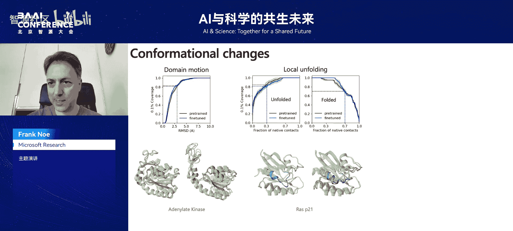

## 生物分子模拟器：一种数据驱动的经验方法


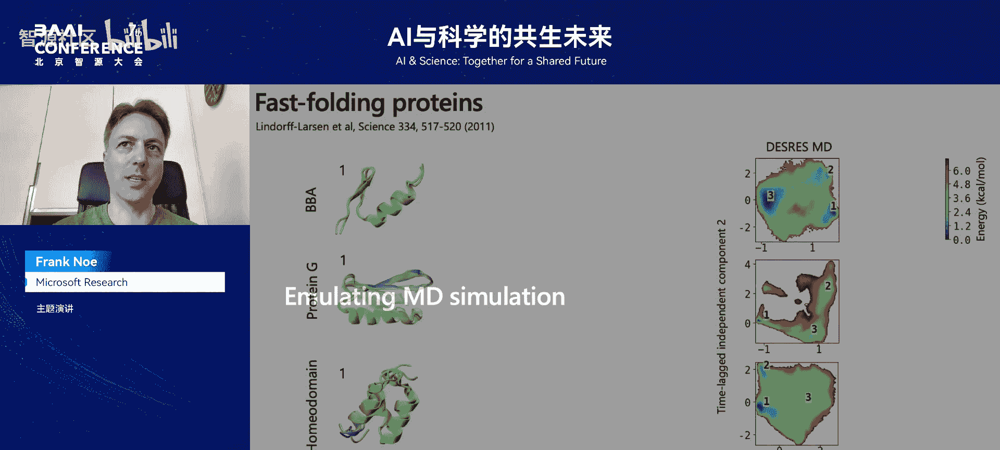

鉴于精确生成平衡分布的挑战，我们转向了一种更经验化的方法：直接从数据中学习分布。这引出了我们目前在微软研究院开发的**生物分子模拟器**项目。

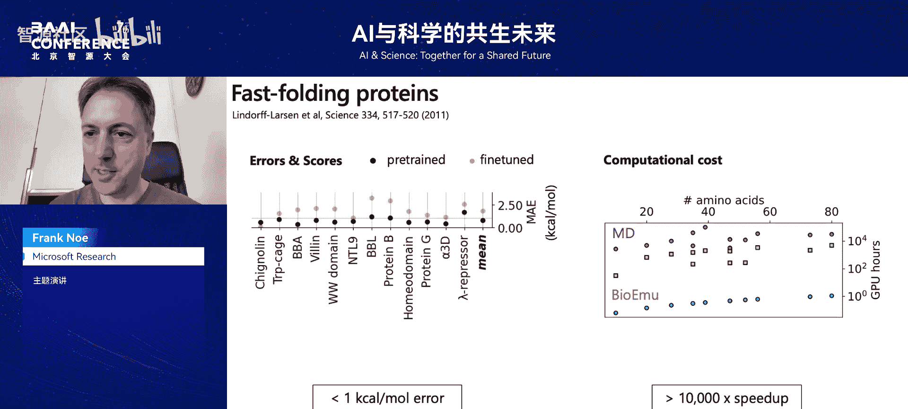

BioEmulator的基本思想是结合多种数据源训练一个扩散模型：
1.  **蛋白质序列编码**：使用AlphaFold2的Evoformer嵌入作为蛋白质的序列表示。
2.  **扩散模型**：使用图Transformer架构的扩散模型来生成分子结构。通过多次生成样本来构建系综。
3.  **分层训练策略**：
    *   **预训练**：在AlphaFold数据库上训练，但通过数据准备鼓励模型学习构象多样性。
    *   **微调（模拟数据）**：在大量分子动力学模拟轨迹（总计超过200毫秒，涉及数千种蛋白质）上微调。
    *   **微调（实验数据）**：在定量最可靠但数据量较少的实验数据（如结合亲和力、稳定性数据）上进行最终微调。

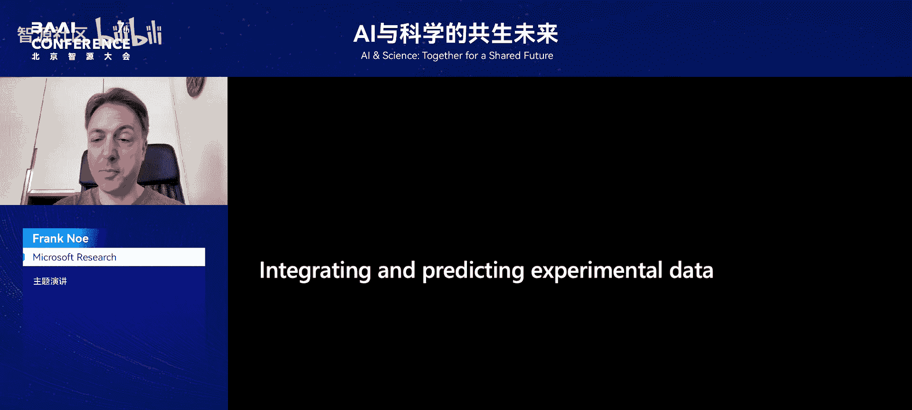

BioEmulator主要测试三个方面：
1.  **定性采样**：能否对训练集之外的蛋白质，采样出其已知的不同构象状态（如大的构象变化、局部去折叠、隐秘口袋）？
2.  **定量加速**：能否快速、准确地模拟如蛋白质折叠等过程？测试显示，对于某些系统，BioEmulator在1小时内达到的精度，需要分子动力学模拟花费1万到10万GPU小时，实现了巨大加速。
3.  **集成实验数据**：能否预测并解释实验测量值？通过一种特殊的微调方法，模型可以使其生成的分布与实验测量的平均值（如蛋白质稳定性）保持一致，并能将稳定性变化与具体的结构变化关联起来，为科学家提供有价值的机理见解。

## 总结

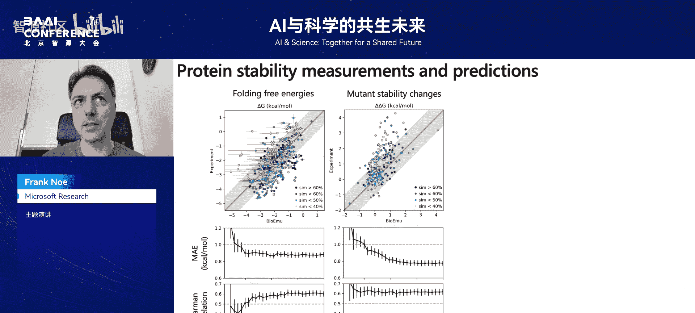

本节课中我们一起学习了深度学习如何推动科学计算的发展。我们从深度学习兴起的关键事件开始，探讨了它如何用于求解量子化学中的薛定谔方程。接着，我们聚焦于生物物理学，分析了从序列、结构到功能模拟的挑战，特别是分子动力学模拟面临的采样瓶颈。最后，我们介绍了一种新的解决方案——生物分子模拟器，它通过结合深度学习与多源数据，旨在高效、准确地预测生物分子的构象系综和功能性质，为药物发现和基础生物学研究提供了新的强大工具。