# AI与科学的共生未来-p04-AI-for-Science时代下的科研“读、算、做”智能化升级：张林峰

在本节课中，我们将学习AI for Science（AI4S）领域的发展历程与未来展望。我们将探讨AI如何从解决特定科学问题，发展到构建覆盖科研全流程“读、算、做”的智能化基础设施，并最终推动科研范式的系统性变革。

## AI for Science的早期探索：寻找“好选题” 🔍

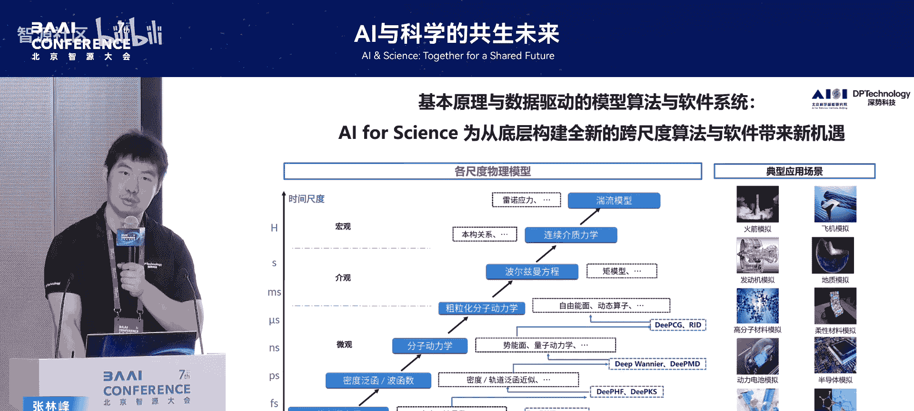

上一节我们回顾了AI4S的缘起，本节中我们来看看其早期的核心范式。AI4S的早期发展，很大程度上是寻找并攻克那些适合AI解决的“好选题”。

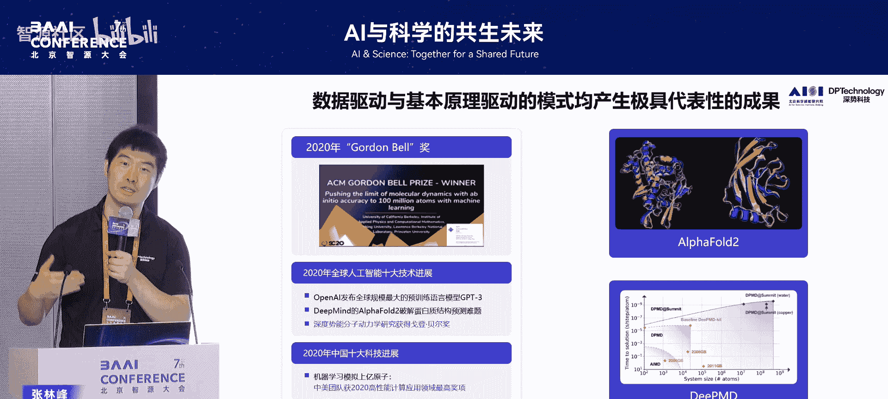

我的导师鄂维南院士在2016年指出，深度神经网络这一工具的本质是**克服维数灾难**。基于这一视角，一个从AI角度合适的科学问题应尽量具备以下三个要素：

以下是构成一个“好选题”的三个关键要素：
1.  **巨大的组合搜索空间**：问题本身非常复杂，具有很高的维度。
2.  **清晰的目标函数**：明确知道需要优化什么目标。
3.  **充足的数据或良好的模拟器**：要么拥有大量数据，要么有可靠的模拟器来生成数据。

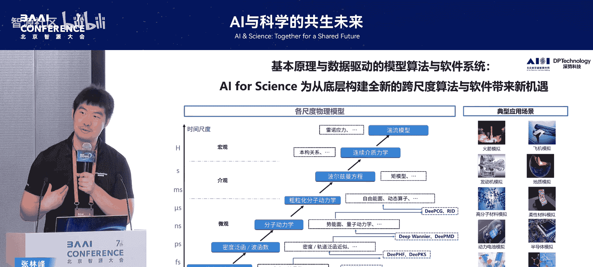

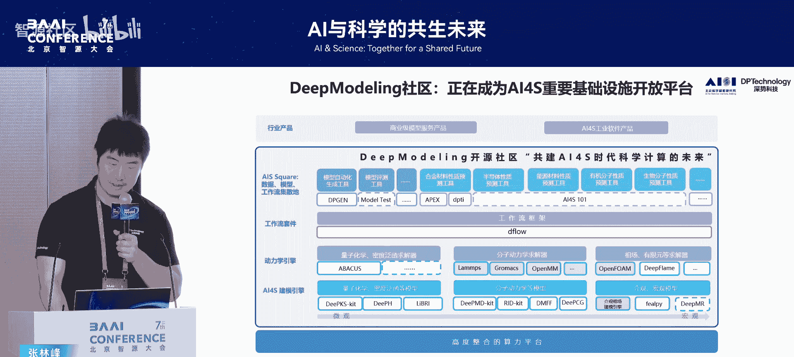

从量子力学方程求解、密度泛函理论，到分子采样和宏观连续介质力学，各个尺度的科学问题都曾面临精度与效率不可兼得的“维数灾难”。AI提供了一个统一的工具来应对这一挑战。例如，在2017年，我们将神经网络算法应用于各个尺度，特别是在原子和电子尺度进行建模，这为后续工作奠定了基础。

## 从“好选题”到范式确立：两条技术路径 🛤️

在早期探索的基础上，AI for Science领域逐渐形成了清晰的技术范式。2018年夏天，鄂维南院士和汤超院士组织的会议系统性地讨论并确立了这一领域。

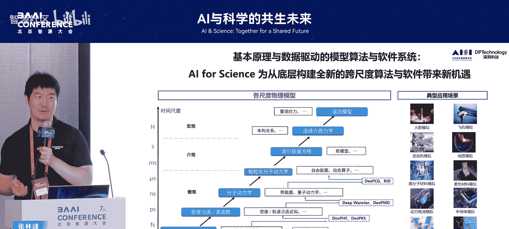

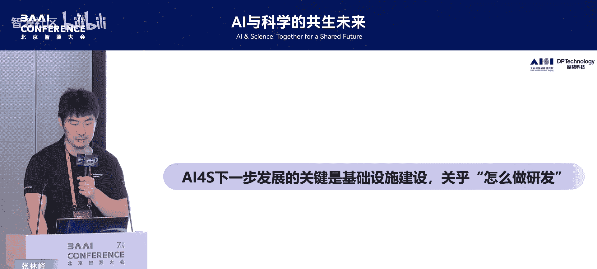

我们看到两种典型的成功路径，它们都完美契合了“好选题”的三要素：

以下是两种主要的技术实现路径：
1.  **数据驱动型**：以AlphaFold2为例。它拥有海量且标注良好的数据（21万条蛋白质序列和已解析结构），目标函数（评估结构好坏的度量）非常清晰，因此取得了突破性成功。
2.  **基本原理驱动型**：在许多科学领域，虽然现成数据不足，但存在可靠的物理模拟器。通过用模拟器生成数据，再用AI进行拟合和替代，可以构建高效的代理模型，这条路线在2020年前后也产生了广泛成果。

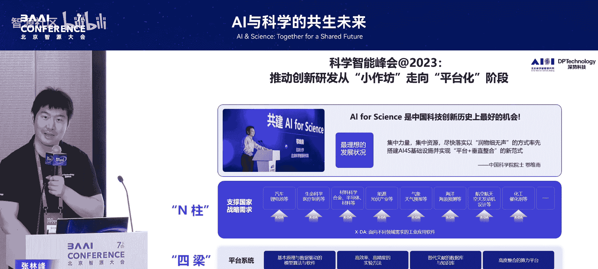

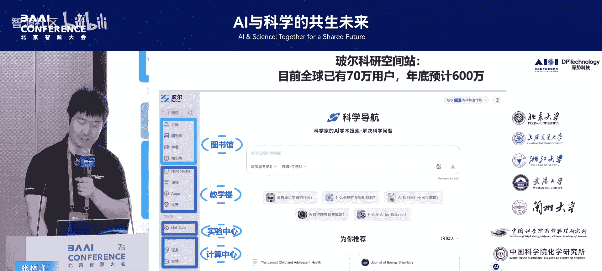

然而，“好选题”也意味着技术范式与应用结合初期的“低垂果实”。当AI4S试图走向更深的“深水区”时，大部分实际问题并不完全具备那三个理想要素。它们可能数据不足、优化目标间接模糊，或者参数空间复杂但维度并不极高，这些问题构成了AI4S深入发展的主要挑战。

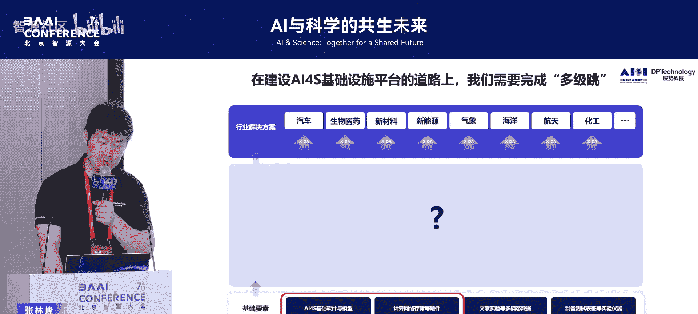

## 迈向深水区：构建系统性的基础设施 🏗️

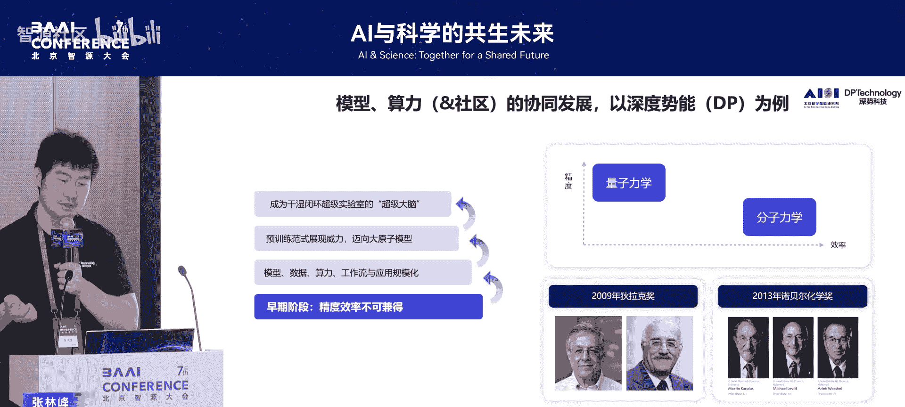

上一节我们看到了AI4S初期的成功与局限，本节中我们探讨如何系统性地突破这些局限。早期工具通过开源社区被生化环材等领域广泛采用，但更本质的问题是：AI4S的下一步该如何走？

我们认为，如同AI自身的发展依赖TensorFlow、Transformer、GPT等基础设施一样，AI4S也需要全要素统筹的基础设施，才能迸发出系统化、全面性的进展。2023年，鄂维南老师提出了支撑AI4S的“四梁八柱”：

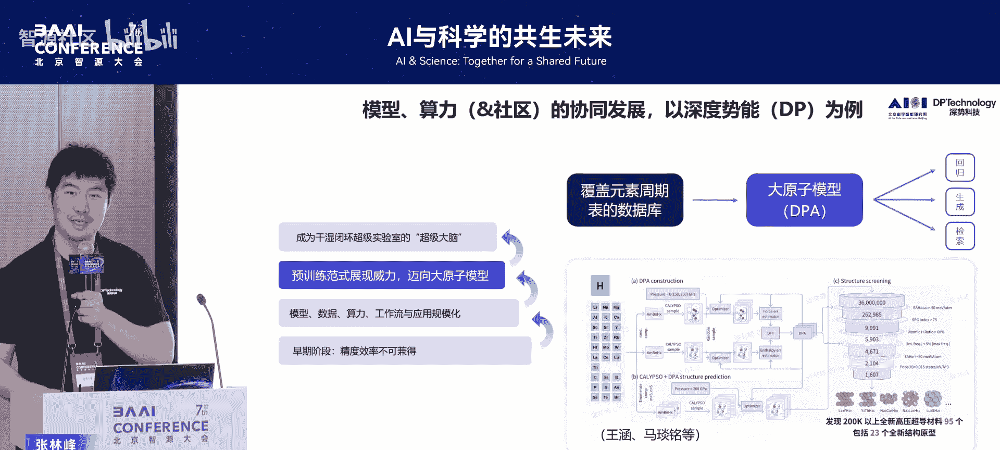

以下是AI4S基础设施的四个核心支柱：
1.  **基本原理与数据驱动的模型算法与软件**。
2.  **高效率、高精度的实验方法**。
3.  **替代文献的知识库与数据库**。
4.  **高度融合的算力**。

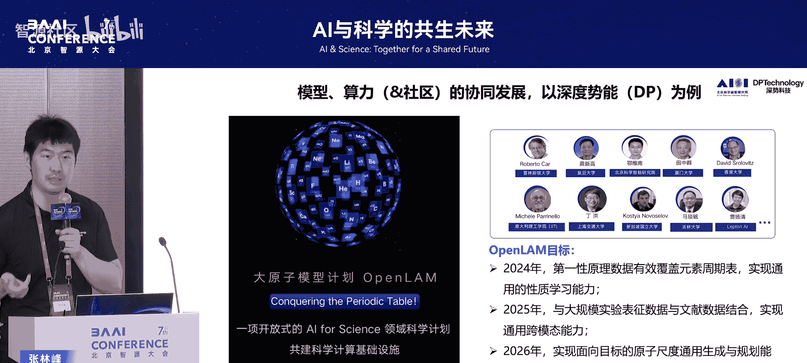

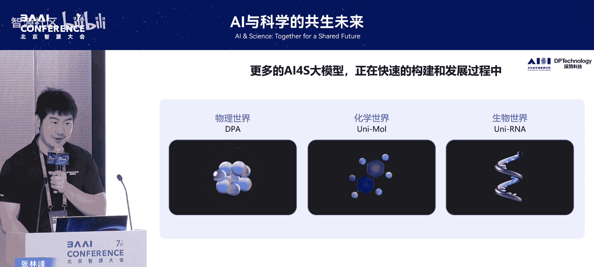

只有将这些基础设施整合起来，融入具体应用，AI4S才能进入新境界。基于此思考，我们推出了“深势科技波尔科研空间站”，它整合了图书馆（读）、教学楼（学）、实验中心（做）和计算中心（算），形成了产品化的基础设施形态。

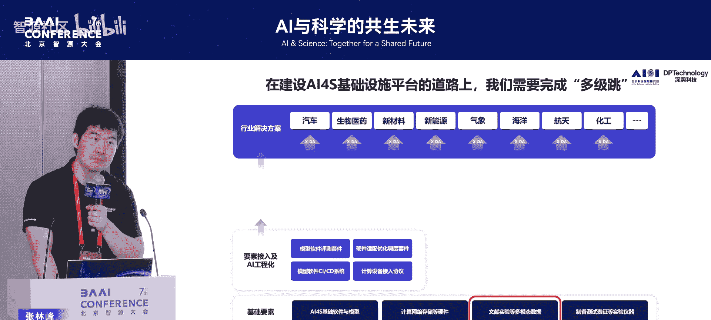

## “读”的智能化：挖掘与理解科学知识 📚

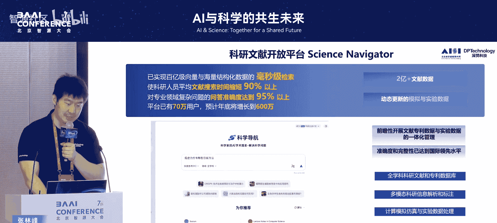

要实现AI4S的系统性落地，我们需要从“读、算、做”各个环节构建坚实的基础设施。首先，我们来看“读”——即对科学文献与多模态数据的智能化处理。

衡量一个基础设施的价值，不在于其“大”，而在于其“有用”。对于科学数据而言，真正有效地利用起来面临诸多挑战。当前，尽管存量科学文献浩如烟海，但AI模型要真正理解并利用这些知识仍非易事。问题在于，科学语料包含分子式、化学反应图谱、表格及复杂排版等特殊模态，通用模型在这些方面的理解能力尚未达到专家水平。

我们构建基础设施的路径是启动一个“专家-模型-数据”持续迭代的飞轮。以下是该飞轮的核心环节：
1.  **基础解析**：对原始科学数据进行初步处理。
2.  **专家标注**：由领域专家进行知识性的高质量标注。
3.  **模型改进**：利用标注数据持续训练和改进专用模型。

我们发布了数据挖掘与知识标注平台UniMine，致力于系统性地挖掘存量科学数据。当高质量的科学语料库构建完成后，才能训练出真正强大的科学基础大模型。这样的模型需要具备强大的多模态识别能力（包括各种科学仪器产生的特殊数据模态）和运用前沿工具进行推理的能力。

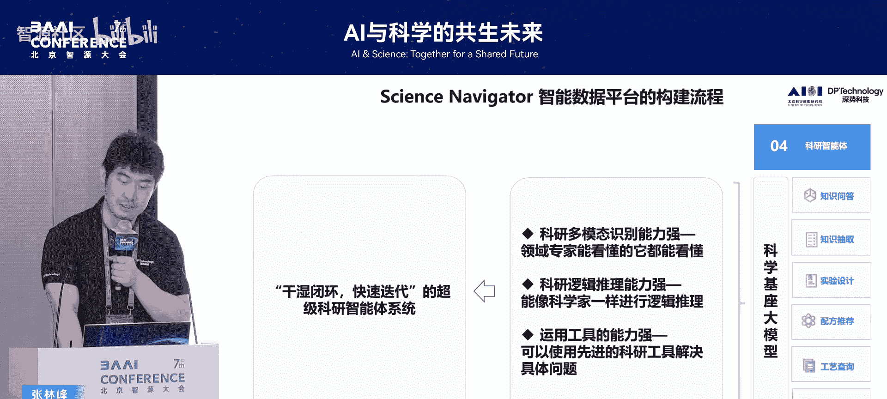

## “算”的智能化：从专用模型到统一大模型 ⚙️

在“算”的层面，AI4S的基础设施也经历了显著的演进。早期，我们主要解决精度与效率的权衡问题，例如用AI桥接量子力学计算与分子模拟，实现大规模高效模拟。

然而，要实现广泛而非点状的影响，需要更底层的基础设施。这包括高性能计算优化、科学计算代码的工程化，以及在云、超算、本地算力间的优化调度与互联，最终构建面向特定应用的工作流。

更重要的进展是**统一大模型**的出现。随着社区数据积累已近乎覆盖整个元素周期表，我们不再需要为每个应用从头生成数据、训练模型。统一的预训练模型可以批量处理多个探索任务。例如，在晶体材料搜索等领域，这种模型能一次性发现数十上百个新结构，极大提升了研发效率。

我们的发展路径规划如下：
1.  **2024年**：充分探索微观尺度的计算数据。
2.  **2025年**：与大规模实验、文献数据结合，实现原子级的通用跨模态能力。
3.  **2026年及以后**：实现更通用的设计乃至自动化的合成与测试。

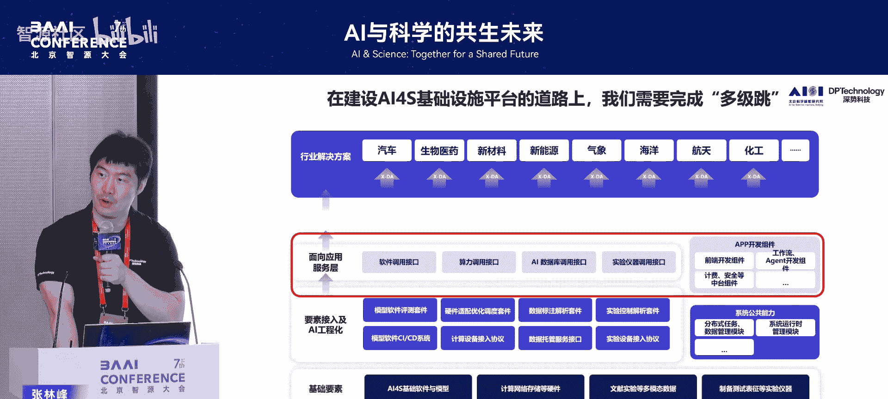

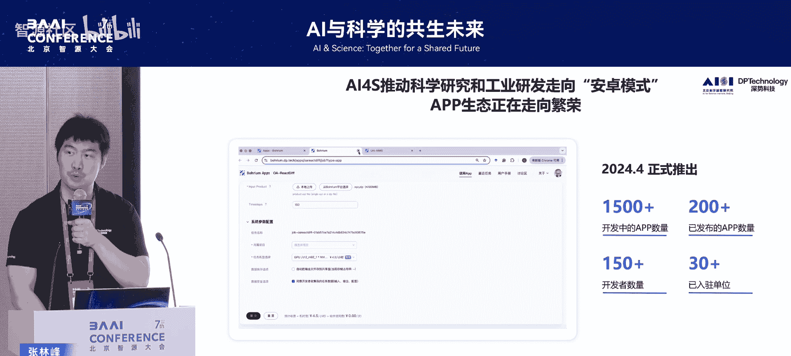

例如，Uni-Mo分子统一大模型，最初用于药物设计，后来发现其统一的原理可广泛应用于化工、光电材料、电解液等多个领域的分子设计问题。

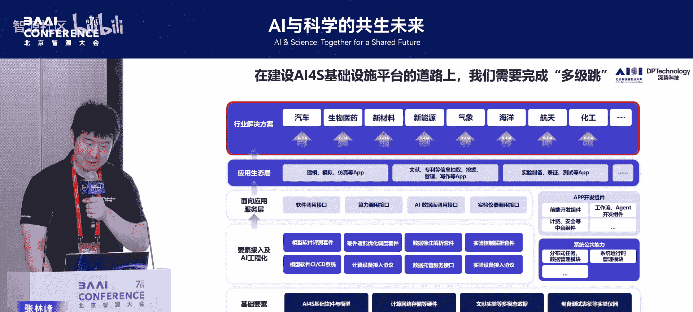

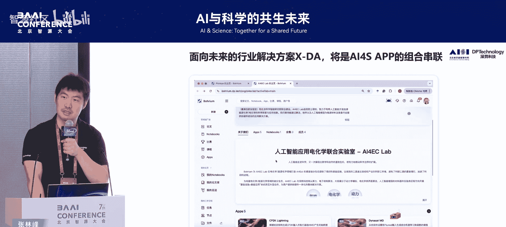

## “做”的智能化：自动化实验与研发闭环 🧪

最后，我们探讨最具挑战性的“做”——即实验的自动化与智能化。对于理论或计算背景的研究者而言，这是离实际落地最近也最关键的环节。

纯粹的模拟计算无法形成落地闭环，真正的impact必须通过实验做出来并对现实世界产生影响。因此，实现“做”的智能化是系统化突破的新命题。

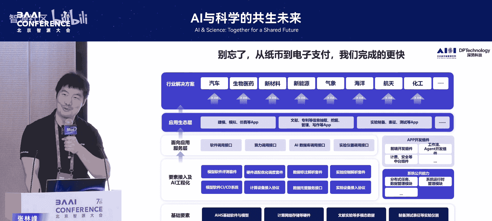

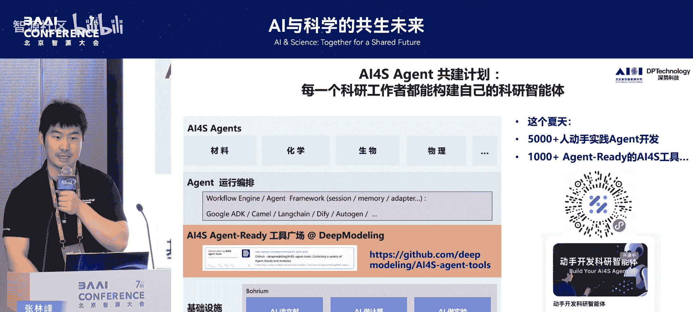

自动化智能实验室面临的核心挑战在于，科学研究是在巨大探索空间中进行高效探索，这与工厂在稳定点附近进行极致扩展的生产模式不同。要系统性地带动研发加速，需要打通三个要素：

以下是实现研发加速闭环的三个关键：
1.  **高通量**：自动化提升实验通量。
2.  **高效率**：提升单次实验的效率。
3.  **高质量反馈**：基于积累的数据，获得最优的AI反馈与决策。

为了实现不同场景、不同仪器设备的有效组合与打通，需要一个“操作系统”来连接底层硬件与上层应用。当“读、算、做”各环节的基础设施通过工程化、工具化被打通后，就能通过大模型协议封装成智能体（Agent）可用的工具，进而面向具体应用场景组合成解决方案。

## 开源共建与未来展望 🌟

上述每个环节都涉及多级跳跃和诸多瓶颈。这是否是一个道阻且长的过程？我们认为并非如此，因为必要而正确的事情是明确的，关键在于有人去执行。

许多基础性工作，如高质量数据标注，需要高阶知识且过程繁琐，但一旦打通，前后效果天壤之别。我们相信，凭借广阔的人才基础和完善的制造产业链，我们在推动AI for Industry方面具有独特优势。

一个**开源开放**的体系至关重要。我们的社区正从以软件为主，扩展到涵盖“读、算、做”的全流程。例如，我们发起“实验室突围计划”，旨在以较低成本（如几千至万元级别）帮助存量实验室打通自动化瓶颈，让更多研究者能参与到智能化研发的进程中。

AI4S当下备受关注，同时也面临许多需要突破的硬瓶颈。突破这些瓶颈后，将带来最大的可能性：推动整个科学研究与工业研发的全面转型升级，迎接“大科研时代”的到来。

---

**本节课总结**：我们一起回顾了AI for Science从早期寻找“好选题”，到确立技术范式，再到当前致力于构建覆盖科研“读、算、做”全流程智能化基础设施的发展历程。我们深入探讨了在文献挖掘、计算模拟、自动化实验各环节构建基础设施的逻辑、挑战与路径，并强调了通过开源开放、社区共建的方式，系统性地推动AI4S落地，最终实现科研范式的根本性变革。