# AI与科学的共生未来-p05-Drug-the-Whole-Genome：后AlphaFold时代的AI药物研发：兰艳艳

在本节课中，我们将学习兰艳艳研究员分享的关于后AlphaFold时代AI药物研发的最新工作。我们将了解一个名为DrugCLIP的下一代大规模药物虚拟筛选引擎，它如何利用AI技术，特别是对比学习，来加速和革新药物发现过程，并探索其对整个基因组进行药物筛选的潜力。

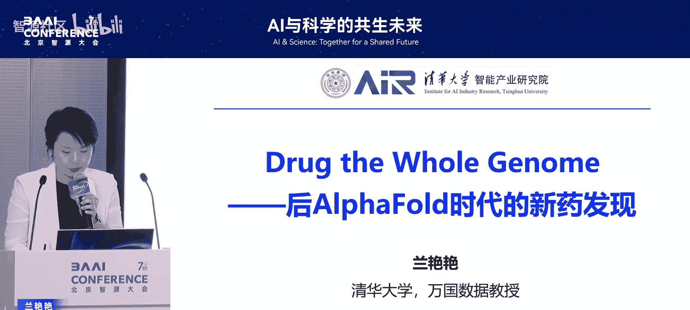

## 引言与背景

再次来到智源大会，见到许多老朋友和新朋友，令人高兴。这个会场对我而言意义特殊，因为在2019年和2021年，我们曾在这里发布“悟道”大模型。当时讨论语言模型的场景与今天AI的成熟状态不同，但那标志着中国大模型研究的起步，是令人骄傲的时刻。今天，我们看到更多具身智能的成果，作为中国AI人，我们感到自豪。

回到这个场地，我们讨论的是一个更为重要的未来议题：**AI for Science**。今天，我将介绍我和课题组自2021年以来，在AI for Science，特别是药物研发领域的一些具体研究工作。

## AI在科学领域的价值与健康计算中心

当前，AI在科学领域持续发挥重要价值，并有望引领一场新的科学革命。清华大学AI研究院与智源研究院较早致力于此领域的探索。2021年8月，我们联合成立了“健康计算联合研究中心”，旨在面向生命科学与健康产业的实际需求，发展新的人工智能核心技术，特别是在健康医疗和新药研发领域寻求突破。

经过几年研究，我们在一些关键点上取得了进展。今天，我很高兴代表联合中心发布面向药物研发的 **DrugCLIP** 模型。这是一个用于药物虚拟筛选关键步骤的下一代大规模引擎。

以下是DrugCLIP的核心特点：
*   **筛选速度**：相比传统方法，速度提升了 **10^66** 倍。
*   **筛选效果**：刷新了多个标准数据集的性能指标，并完成了在多个靶点上的实验验证。
*   **开放共享**：我们将把所有获得的数据向全球免费开放，以赋能新药研发行业。

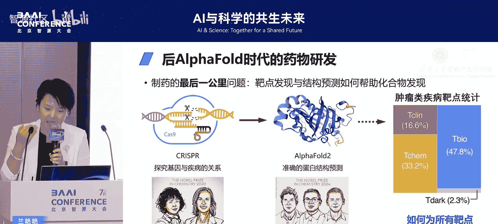

接下来，我将介绍我们为何要做这件事、如何用AI实现以及它能做什么。

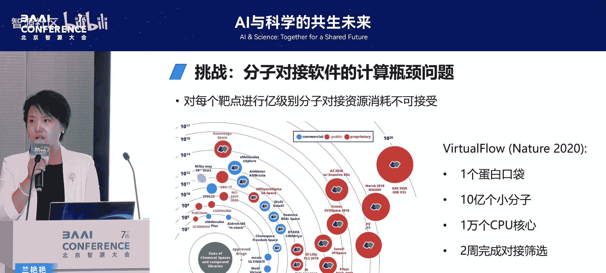

## 从AlphaFold到药物发现：机遇与挑战

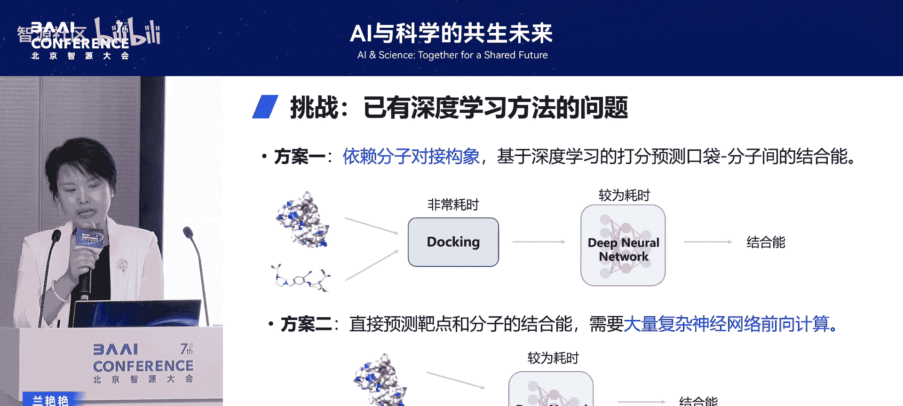

AlphaFold的出现，掀开了AI for Science的重大突破，也开启了药物研发的新时代。然而，从蛋白质结构到其功能，再到药物发现，是一个漫长且困难的过程。AlphaFold提供了巨大的可能性。

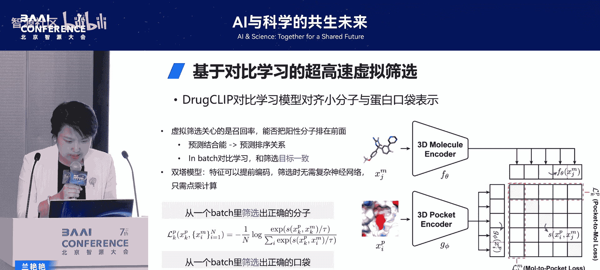

对于药物发现而言，找到并确认正确的靶点极具挑战。如果我们有非常准确的靶点，即使手段慢一些，药物研发问题也可能早已解决。因此，如何**超越现有手段，更大规模、更快地覆盖更多潜在靶点**，成为一个关键挑战。

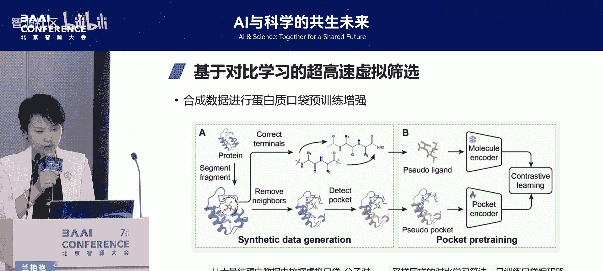

AlphaFold的出现提供了这种可能。人类基因组计划等技术让我们能探索疾病与靶点的关系。我们知道人类致病基因约有2万多种，而AlphaFold完成了一件重要的事：**它可以预测所有这些蛋白的结构**。这带来了新的机会和挑战：我们能否为所有这些可能的靶点找到有用的分子或药物？这正是我们想做的事情。

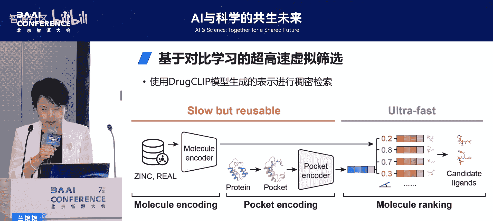

事实上，这并非新想法。早在2001年，基于结构的药物设计先驱、福泰公司的创始团队就提出了“化学基因组学”的愿景，即**为所有可能的靶点找到可行药物**。然而，经过二十多年发展，以肿瘤疾病为例，我们可能只覆盖了约40%的靶点。传统工具完成这项任务非常困难。

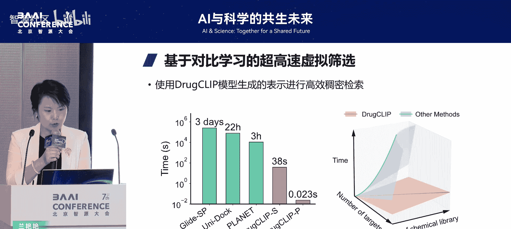

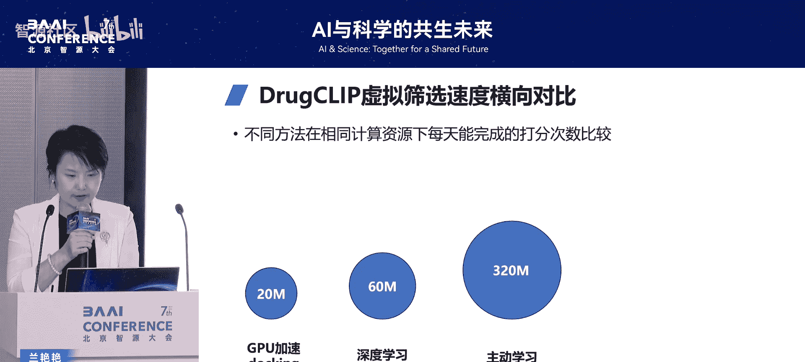

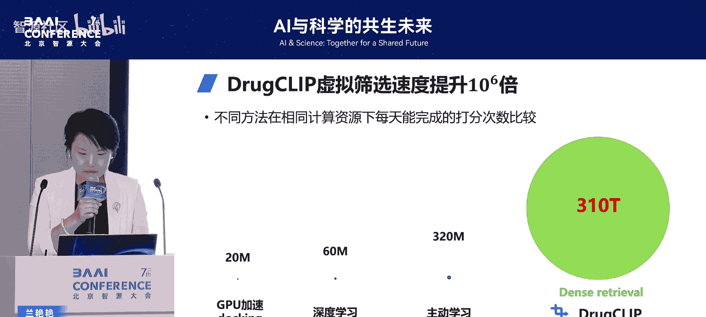

## 传统虚拟筛选的瓶颈

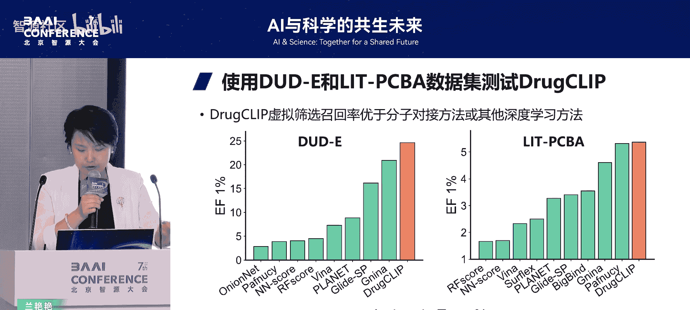

虚拟筛选最常用的方法是分子对接软件。当前最大规模的筛选工作之一是2020年发表在《自然》杂志上的 **“VirtualFlow”**。它仅针对一个蛋白口袋（靶点）筛选了17亿个小分子，使用了1万个CPU核心，耗时整整两周。

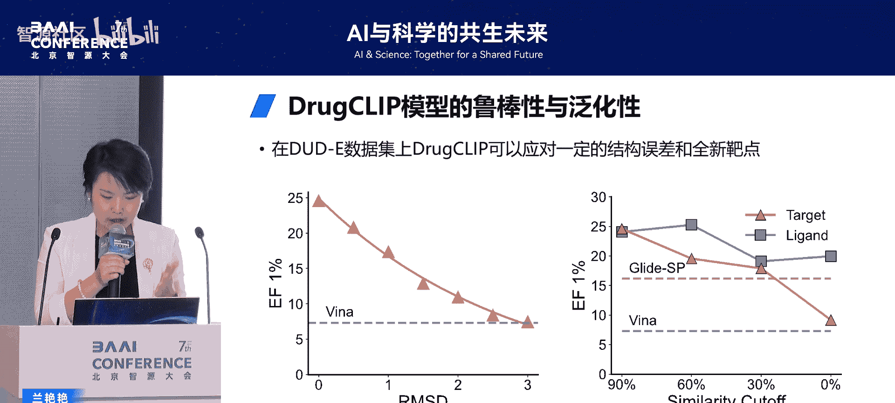

如果要筛选全部2万个靶点，大家可以想象，这将需要上百年的时间。

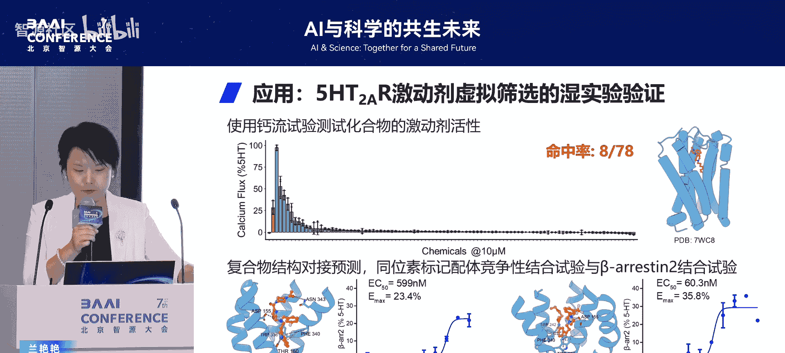

近年来，深度学习乃至大模型方案也开始应用于此问题，但仍不能满足需求。原因在于：要么严重依赖3D分子对接构象，要么仍需大量复杂的神经网络计算来预测结合能。这些挑战使得现有方法无法满足我们对大规模、快速筛选的需求。

## DrugCLIP：基于对比学习的解决方案

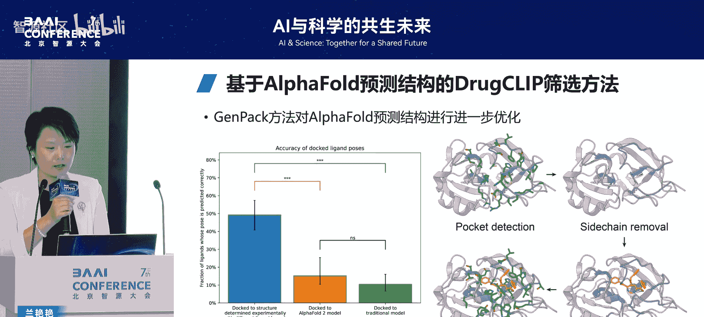

为此，我们提出了一个基于对比学习的方法。熟悉CLIP模型的朋友应该能理解我们为何取名 **DrugCLIP**。我们在图文领域有成功的经验。我们将蛋白和小分子映射到一个共同的嵌入空间，在这个空间里，通过对比学习来区分能结合与不能结合的配对。

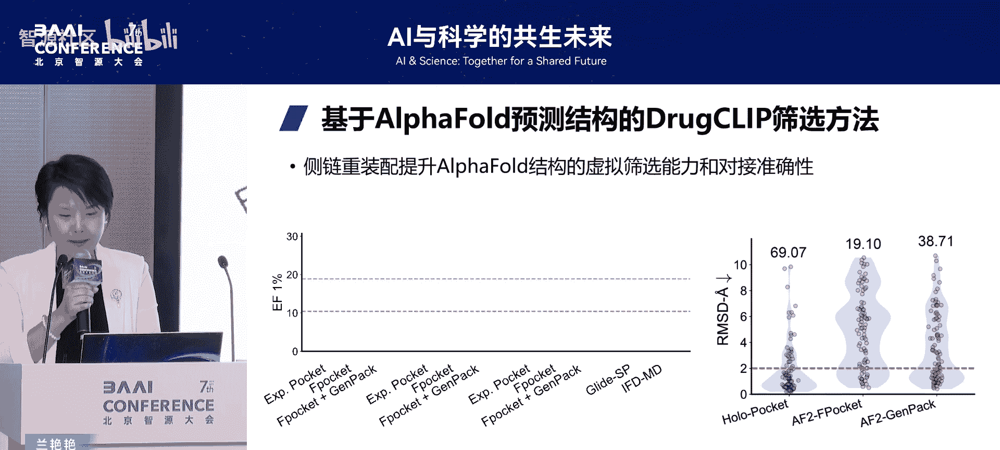

然而，仅这样做还不够。在药物领域，高质量的结合数据非常稀少，难以训练出有效的模型。在我们的方法中，我们还提出了**基于合成数据的训练策略**。例如，虽然难以获得大量真实的蛋白-小分子结合数据，但我们可以从单纯的蛋白质数据中构建许多口袋-小分子结合的配对数据。虽然模式不同，但其背后的物理规律非常相似。这使我们能够在海量的合成数据上完成模型训练，从而提高方法的效果。

由于该方法能将所有关心的蛋白和小分子都预先计算并表达在嵌入空间中，我们可以离线在大规模集群上完成计算。从而在提供筛选服务时，能以极快的速度完成筛选步骤。

## DrugCLIP的性能优势

我们来看一下速度。与传统基于对接的方法和基于深度学习的方法相比，筛选速度都有极大提升。这是因为传统方法随着规模增大会呈现指数级增长的计算需求，而我们的方法随着数目增多，**仍然保持线性级的计算复杂度**。

具体而言，在相同计算资源下，DrugCLIP能完成的打分次数大约是其他方法的 **10^66** 倍。

当然，速度快并非唯一要求，精度至关重要。我们在标准的药物筛选基准数据集 **DUD-E** 和 **DEKOIS 2.0** 上进行了评测。对比常用的商业对接软件 **Glide** 以及深度学习方法 **MONN**，DrugCLIP都取得了更好的性能。

并且，DrugCLIP在许多有噪声的靶点、新靶点以及存在一定结构误差的靶点上都表现出良好的泛化性能，这使我们能充分应对实际需求。

## 实验验证与真实案例

仅在基准数据集上取得好结果，不足以说服生命科学家或药学家。因此，我们与多个团队合作，在不同靶点上进行了实验验证。

例如，在精神疾病重要靶点 **5-HT2A** 上，我们用DrugCLIP筛选了78个小分子进行合成与实验，以接近12%的命中率获得了活性化合物，并筛选到纳摩尔级高亲和力的分子。

另外，我们与清华大学的闫创业老师团队合作，在抑郁症和多动症靶点 **NET** 上，筛选到15个高活性小分子，其中12个的活性超过了现有药物安非他酮。闫老师团队还通过冷冻电镜解析了复合物结构，显示我们筛选的化合物覆盖了重要的相互作用信息。

## 应对AlphaFold预测结构：GPACK方法

上述案例仍不能满足我们最初的愿景。对AlphaFold预测出的结构进行虚拟筛选本身就是一个大问题，因为结构稍有不准，就会导致传统对接或深度学习方法的性能大幅下降。

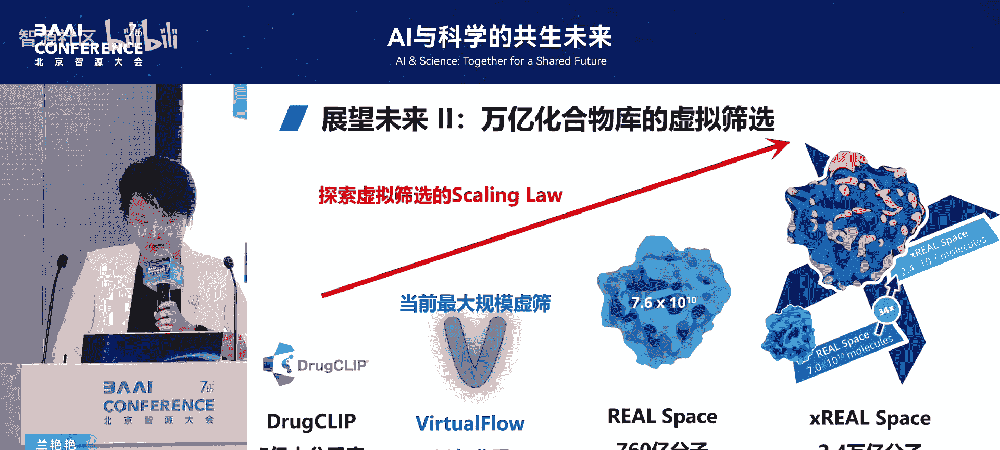

因此，在DrugCLIP基础上，我们又提出了 **GPACK** 方法。该方法通过生成式策略，对小分子构象以及整个复合物结构进行进一步的调整和优化，从而帮助找到更精准的对接或筛选结构。

实验结果表明，使用GPACK方法后，对接准确度能从19%提高到38%，提升约两倍。

有了这个方法，我们就可以真正对AlphaFold预测出的结构（即那些药企从未研究过或人类历史上从未研究过的靶点结构）进行筛选。

## 全基因组药物虚拟筛选

基于上述技术，我们致力于进行全基因组的药物虚拟筛选。我们提取了约2万个人类致病基因，用AlphaFold预测其结构，其中约1万多个置信度较高。我们在一个包含15亿个小分子的库上，用DrugCLIP完成了筛选。这应该是当前最大规模的虚拟筛选，**完成了超过10万亿次打分**。

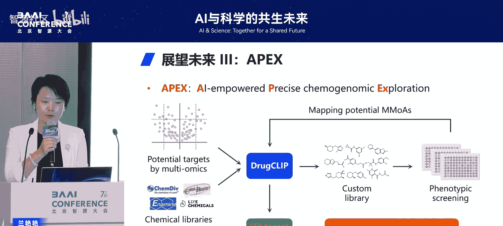

对比人类现有知识（如ChEMBL数据库），我们覆盖了大量从未研究过的靶点、蛋白家族或家族中难以研究的靶点。令人惊叹的是，如此大规模的计算，所需资源却很少。我们在8卡GPU服务器上，**一天内即可完成全部检索过程**。

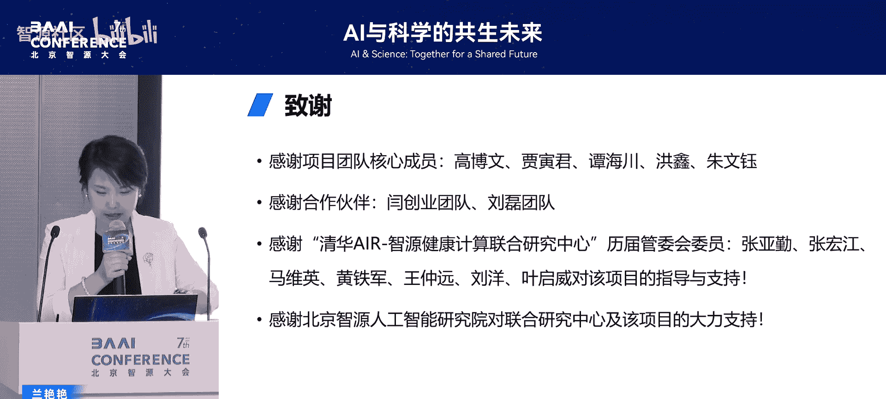

因此，我们今天正式发布这个数据库，并提供免费的在线服务。药企或实验室可以定制自己的分子库或蛋白靶点，在我们的系统上快速完成筛选。系统还支持小分子可视化、蛋白-小分子结合作用可视化及对接对比，方便药物化学专家分析结果。

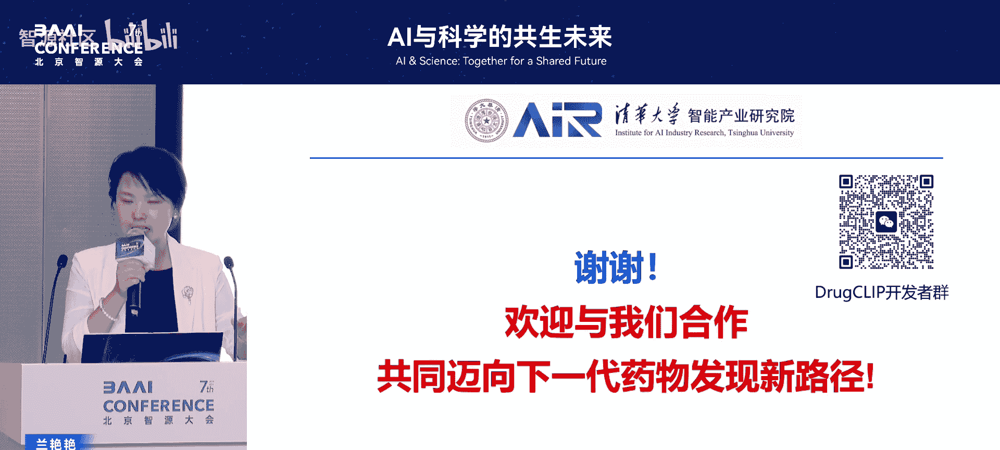

## 未来发展方向

对于DrugCLIP的未来，我认为有三个重要发展方向，能使我们更逼近“AI找到好药物”的目标：

1.  **提升预测精度，逼近物理模拟**：我们最近基于AlphaFold的预训练表示，通过不同的训练策略（如使用结合数据或竞争性训练），得到的模型结果已非常接近 **FEP**。FEP是药物发现领域非常精准的物理计算方法，但速度极慢。创造一个能接近甚至超越FEP的AI模型，是许多人的梦想，我们现在已非常接近。
2.  **探索虚拟筛选的规模定律**：在大模型领域，我们有数据规模和参数规模的缩放定律。在虚拟筛选领域，能否用AI方法穷尽当前所有可合成化合物，探索这个领域的边界？从DrugCLIP开始，我们已具备此能力。我们正探索千亿甚至万亿级别的小分子库，希望发现虚拟筛选的缩放定律，找到有价值的新分子。
3.  **构建数据驱动的闭环系统**：AI for Science不能只依赖AI。我们必须将数据驱动的方案与现实世界的反馈连接起来。就像搜索引擎或ChatGPT，当其能在线收集用户反馈并持续改进时，应用才真正成熟。药物研发也一样。我们需要将实验、临床阶段的考虑和数据前置，与AI模型共同形成一个迭代发展的闭环。例如，利用已有的组学和文献数据找到潜在靶点，用DrugCLIP为每个靶点筛选形成定制化分子库，然后利用类器官、器官芯片等更接近人体的工具进行表型筛选并获得反馈。这个反馈不仅能找到活性分子，还能通过DrugCLIP的打分，帮助我们从众多潜在靶点中找到真正的新靶点，这是最大的价值所在。之后，再进行新分子设计。

## 总结与致谢

本节课中，我们一起学习了后AlphaFold时代AI药物研发的新工具DrugCLIP。我们了解了它如何利用对比学习和合成数据训练，实现超高速、高精度的药物虚拟筛选；看到了它在实验验证和应对预测结构方面的有效性；并展望了其实现全基因组筛选以及未来通过与实验闭环结合，真正变革药物研发流程的潜力。

感谢项目团队的核心成员、合作伙伴，以及清华大学AI研究院、智源研究院健康计算联合研究中心和智源人工智能研究院的大力支持。我们希望通过免费的在线服务，赋能药物研发行业，并邀请所有对AI药物发现感兴趣的同仁共同探讨，能否创造一种AI赋能药物发现的新方式或新路径。

---
**本节课中我们一起学习了：**
*   AlphaFold为大规模药物发现带来的机遇与现有方法的瓶颈。
*   DrugCLIP模型的核心原理：基于对比学习和合成数据训练。
*   DrugCLIP在速度、精度和泛化能力上的显著优势。
*   通过实验验证和GPACK方法，证明其对真实世界问题（包括预测结构）的有效性。
*   实现全基因组虚拟筛选的愿景与成果。
*   AI药物研发未来的三个关键发展方向：精度提升、规模探索和系统闭环。