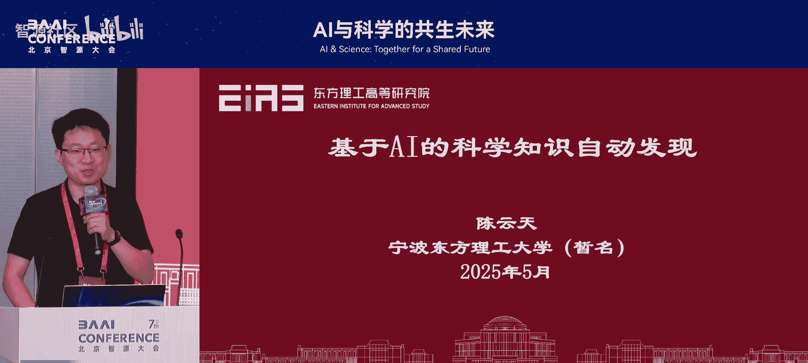
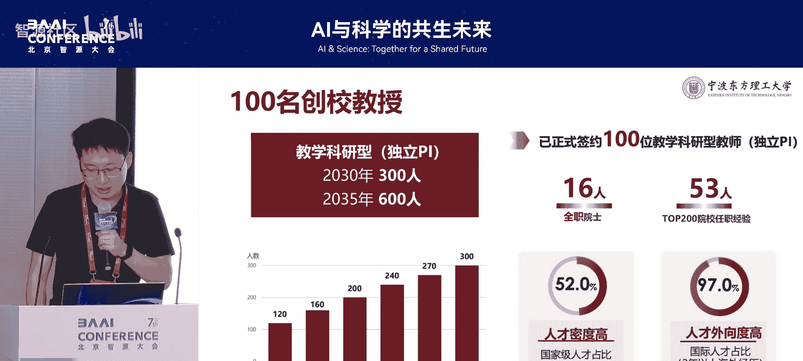
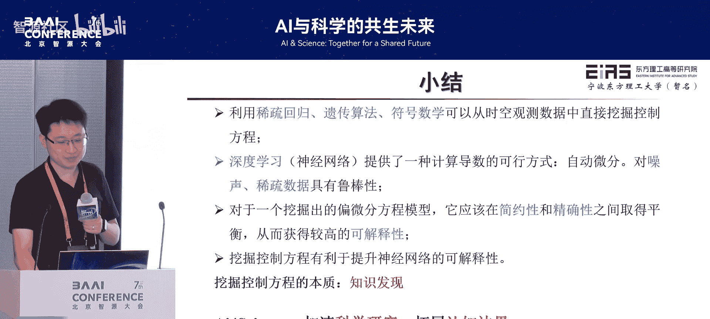

# AI与科学的共生未来-p06-基于人工智能的科学知识自动发现：陈云天

在本节课中，我们将要学习如何利用人工智能技术，从观测数据中自动发现其背后隐藏的科学规律与方程。这是一种将数据驱动方法与科学知识发现相结合的前沿研究方向。

## 科学发现的两种路径

科学发现通常遵循两种路径：归纳总结与演绎推理。一个经典的例子是开普勒通过分析第谷积累的几十年火星轨道观测数据，归纳出行星运动三大定律。随后，牛顿在此基础上通过演绎推理，推导出万有引力定律。

人工智能的优势在于加速“归纳总结”这一环节。当数据维度高、非线性强时，人脑难以处理，但人工智能模型却有可能从中发现潜在的数学规律。

## 核心问题：从数据到方程

从本质上讲，我们研究的问题非常清晰：给定一组观测数据，我们能否自动找出描述这些数据背后动态的控制方程？例如，面对一组波动数据，我们能否找到描述该波动的偏微分方程？

## 人工智能的可解释性视角

从人工智能的角度看，这个问题也是一种提升模型可解释性的方法。通常，神经网络被视为“黑箱”。如果我们能从一个神经网络的输入输出数据中，找到一个等价的数学方程作为其替代模型，那么我们就在某种意义上对这个“黑箱”进行了解释。

## 研究框架概览

我们的研究致力于融合领域知识（如物理、化学定律）与人工智能技术。这包含两个方向：
1.  **知识嵌入**：将领域知识融入AI模型，使其更准确、可靠。
2.  **知识发现**：从观测数据中提炼物理知识，如控制方程。

本节课将聚焦于第二个方向，即如何利用AI从数据中自动发现方程。

---

# 基于人工智能的科学知识自动发现：02：问题定义与挑战

上一节我们介绍了利用AI进行科学知识发现的总体动机。本节中，我们来看看这个问题的具体定义以及它所面临的核心挑战。

## 问题的两个维度

寻找隐藏方程的问题可以从两个维度来刻画其复杂性：

1.  **方程结构的复杂性**：从简单的代数方程，到常微分方程，再到复杂的偏微分方程。
2.  **方程系数的复杂性**：系数可以是常数、可以用数学函数（如 `sin(x)`）表达，甚至是无法用简单方程描述的复杂场（如地下渗流问题中的渗透率随机场）。

## 传统方法的瓶颈

早期的方法（约2005-2006年）通常采用“稀疏回归”的思路。以下是其基本步骤：
1.  预先定义一个包含所有可能函数项（如 `x`, `∂u/∂x`, `u^2` 等）的候选集。
2.  从候选集中通过稀疏回归筛选出最能拟合数据的项组合成方程。

然而，这种方法存在一个根本性局限：**它要求我们预先知道的候选集必须包含真实方程中的所有项**。如果我们面对的是一个全新的、未知的物理过程，我们根本无法构造出正确的候选集。这使得该方法只能解决我们“已知”的问题，无法真正发现“未知”。

## 方法演进的三个阶段

随着领域发展，出现了三类主要方法：

**A. 稀疏候选集方法**
即上述传统方法，其能力受限于预设的候选集。

**B. 遗传算法方法**
将方程中的每一项视为一个“基因片段”，通过遗传算法中的交叉、变异等操作，动态生成新的函数项。理论上，这种方法可以探索无限大的函数空间。但它难以处理复合函数求导、分式结构等复杂数学形式。

**C. 符号数学方法**
这种方法只需要给定基本的**运算符号**（如 `+`, `-`, `×`, `÷`, `∂`, `sin`, `^2`）和**运算对象**（如 `x`, `y`, `u`, `v` 等物理量）。只要目标方程能用这些基本元素组合而成，理论上就能被发现。这种方法能有效处理复杂结构，是我们重点介绍的方向。

---

# 基于人工智能的科学知识自动发现：03：核心方法——表示与优化

上一节我们分析了问题的挑战与方法演进。本节我们将深入核心，讲解如何通过“表示”与“优化”两个关键步骤，实现从数据中自动发现方程。

## 核心思路：表示与优化

让AI自动发现方程，需要解决两个核心问题：
1.  **表示**：如何将人类可读的数学方程，转化为AI易于理解和处理的形式。
2.  **优化**：如何在所有可能的表示中，找到最能准确描述观测数据的那一个。

符号数学方法的核心逻辑是：**将方程表示为二叉树**。二叉树是计算机科学中一种高效且通用的数据结构。

## 方程的二叉树表示

任何数学方程都可以等价地转化为一棵二叉树。我们约定：
*   **叶子节点（白色）**：代表运算对象，即物理量（如 `u`, `x`）。
*   **内部节点（彩色）**：代表运算符号。
    *   **一元运算符**：如平方 `^2`、正弦 `sin`，作用于一个对象。
    *   **二元运算符**：如加法 `+`、偏导 `∂`，需要两个对象。

**示例：方程 `∂/∂x (∂u/∂x + u^2)` 的二叉树表示**
图中二叉树与方程完全等价。通过**前序遍历**（红色箭头路径）这棵树，我们可以得到一个字符串序列：`[∂, +, ∂, u, x, ×, u, u, x]`。

**转换规则**：从左到右读取该字符串，每当一个运算符收集到所需数量的运算对象时，就用括号将其括起，形成一个新对象。最终，这个字符串能唯一地还原为数学方程。

通过这种方式，我们在**字符串**、**二叉树**和**数学方程**三者之间建立了一一对应的映射关系。这就完美解决了“表示”问题。

## 优化策略：寻找正确的二叉树

一旦方程被表示为二叉树，寻找方程的问题就转化为：**在所有可能的二叉树结构中，找到一棵能使其输出最匹配观测数据的树**。

以下是两种主要的优化方法：

**1. 遗传算法优化**
将二叉树视为“基因”，通过以下操作进行演化：
*   **交叉**：交换两棵树的部分子树。
*   **变异**：改变树中某个节点的运算符或运算对象。
*   **结构重组**：生成全新的树结构。
通过多代演化，并基于对数据拟合的“适应度”进行筛选，最终找到最优的二叉树（即方程）。

**2. 强化学习/序列生成优化**
既然方程可以表示为字符串，我们可以将其视为一个序列生成问题。模型根据当前已生成的字符序列，预测下一个最可能的字符（是运算符还是运算对象）。这种方法类似于大语言模型（如GPT）的文本生成，效率通常比遗传算法更高。

**效率的重要性**：理论上，只要给予无限时间和资源，我们总能通过穷举找到方程。因此，研究的核心挑战在于如何在**有限的时间和计算资源内**找到方程，这使得优化算法的效率至关重要。

---

# 基于人工智能的科学知识自动发现：04：应用实例与前沿探索

上一节我们介绍了通过二叉树进行表示和优化的核心方法。本节中，我们来看看这些方法在实际复杂问题中的应用，以及如何应对真实数据带来的挑战。

## 在经典问题上的验证

使用上述方法，仅向模型提供数据分布，模型可以重新发现许多已知的复杂方程，例如：
*   流体力学中的伯努利方程、Burgers方程。
*   具有分式结构的方程（如年性重力流方程）。
*   复合函数求导的方程。

模型发现的方程在数学结构上与真实方程几乎一致，仅存在微小的数值系数误差。这证明了方法的有效性。

## 发现新方程：年性重力流案例

年性重力流现象广泛存在于泥沙沉积、油气开采等领域。此前，只有描述其长期行为的方程，短期行为方程缺失。

我们的方法从数据中发现了一个新的方程，它既能描述短期行为，也兼容长期行为。更重要的是，与旧方程相比，新方程多出了一项。从物理上解释，这一项反映了“年性对扩散过程的抑制作用”，而此前的研究低估了这种作用。**这项修正并非人为设计，而是AI从数据中自动发现的。**

## 应对真实数据挑战：高噪声与稀疏数据

真实世界的观测数据往往是**高噪声**且**稀疏**的，这给方程发现带来了巨大困难。我们提出了一种名为“DISCOVER”的迭代架构来解决这个问题：

1.  **数据增强**：首先用一个神经网络去学习稀疏、带噪的原始数据。该网络可以充当数据生成器，通过插值和平滑，产生更完整、更干净的数据。
2.  **方程发现**：利用生成的数据进行方程发现。虽然初始发现的方程可能不精确，但它将高维的神经网络参数空间压缩成了低维的方程形式，提取了核心规律。
3.  **迭代优化**：将初步发现的方程反馈给数据生成器，引导其产生更好的数据；再用更好的数据去发现更精确的方程。如此循环迭代，最终能从质量很差的数据中收敛到正确的方程。

该方法在高达30%噪声的KS方程（含四阶导数，对噪声极其敏感）数据上，依然能成功发现方程。

## 拓展应用方向

基于此核心框架，研究可以拓展到多个前沿方向：

*   **发现方程组**：采用多智能体协同优化，同时发现多个相互关联的方程。
*   **结合大语言模型**：利用LLM的推理和先验知识，引导方程搜索空间，提升发现效率。我们甚至训练了一个专精于数学方程的“方程GPT”。
*   **解决实际工程问题**：
    *   **风力发电尾流建模**：发现了描述风机尾流复杂分布的新方程。
    *   **计算格林函数**：为一些原本没有已知格林函数的数学算子（如周期性赫姆霍兹算子）找到了格林函数。
    *   **材料本构关系**：在土壤水分保持曲线等领域，发现了比传统模型更优的新本构方程。
*   **化学实验自动化**：
    *   从光谱数据中发现物质浓度与光谱信号的关联方程。
    *   建立了薄层色谱实验数据与柱色谱分离参数之间的预测方程，有望减少耗时的柱色谱实验。

## 工具与影响

相关研究工具均已开源，供科研社区使用。这项工作也受到了包括《参考消息》、《南华早报》在内的主流媒体的关注和报道。

---

# 基于人工智能的科学知识自动发现：05：总结与问答

本节课中，我们一起学习了如何利用人工智能实现科学知识的自动发现。

## 内容总结

我们从科学发现的两种路径（归纳与演绎）出发，明确了AI在加速“数据归纳”方面的潜力。核心任务是**从观测数据中自动发现其背后的控制方程**。

我们分析了问题的复杂性维度和传统方法的瓶颈，并重点介绍了基于**符号数学**的解决方案。其核心是将方程**表示为二叉树**，从而将问题转化为计算机擅长的**表示**与**优化**问题。我们探讨了遗传算法和序列生成等优化策略。

进一步，我们展示了该方法在发现新方程、处理高噪声稀疏数据、以及拓展到方程组、实际工程与化学实验等领域的强大应用。最终，我们看到了一个将AI与领域知识深度融合，从数据中抽丝剥茧、发现新知的研究范式。

## 问答环节

**问：您认为OpenAI等大型AI公司在未来进行科学发现的核心算法和数据来源会是什么？如果它们都能做，科学家该做什么？**

**答**：据我所知，OpenAI目前并未重点投入这个方向。即使未来它们涉足，也必然需要与领域科学家深度合作。因为科学发现不仅仅是算法问题，更依赖于对特定领域的深刻理解（Know-how）。数据也往往来自各学科的前沿实验。短期内（如3-5年），AI公司很难独立解决所有问题。科学家的角色将更侧重于提出关键问题、设计实验、提供领域知识，并与AI工具协同，共同解读和验证发现。这是一个增强人类科学家能力，而非取代的过程。

---

**本节课中我们一起学习了基于人工智能的科学知识自动发现的全貌，从动机、方法到应用，看到了AI如何成为科学家探索未知世界的新工具。**