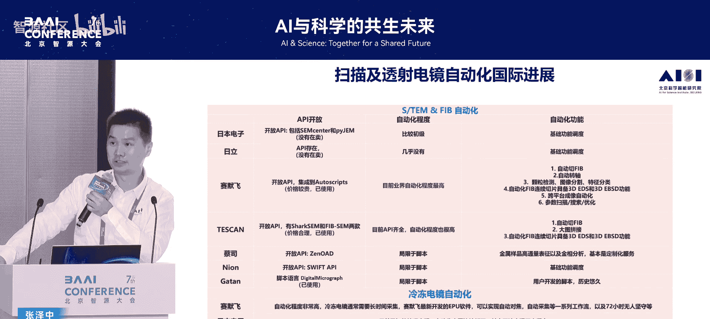
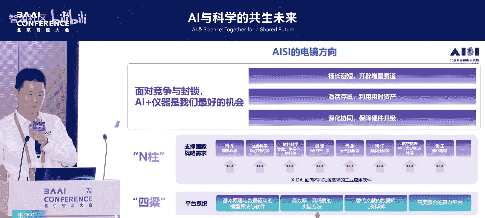
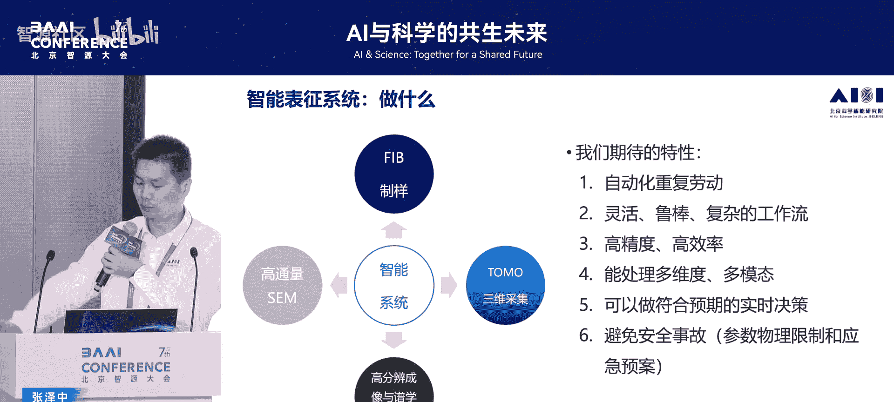
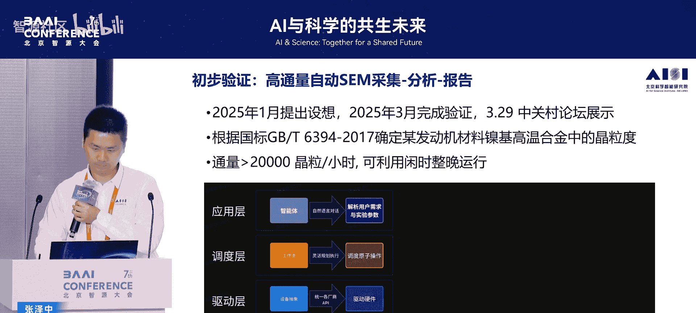

# AI与科学的共生未来-p07-从观测到智能：AI时代下的电镜表征：张泽中

在本节课中，我们将探讨AI如何赋能电子显微镜表征技术，并助力国产高端仪器的研发突围。我们将通过三个具体案例，理解电镜从观测工具到智能系统的演进，并分析AI如何成为国产仪器实现跨越式发展的关键路径。

## 概述：AI与仪器的双向奔赴

AI for Science是人工智能与科学研究的深度融合，为双方创造了前所未有的机遇。对于科研而言，AI可以加速进程，其成果能进一步赋能工业。具体到“AI+仪器”领域，这同样是一个双向促进的过程。当前，国产高端仪器正面临关键的突围时刻，而“AI+仪器”的模式被认为提供了最佳的机会窗口。

## 电镜表征的三个境界：从观测到创造

上一节我们提到了AI与仪器结合的巨大潜力。本节中，我们通过三个故事，来具体看看电镜表征技术如何从简单的观测工具，演进为能够创造新知识的智能系统。

### 境界一：作为观测工具——自动化识别与测量

最初，电镜如同一个高级相机，主要用于观测已知现象。例如，观察一个截角八面体纳米颗粒在加热过程中的动态收缩。过去，这类工作需要手动测量上万次数据点，再计算其表面积、体积和能量变化，是典型的“体力活”。

在AI时代，这个过程可以完全自动化。通过图像识别算法，系统能自动追踪颗粒尺寸变化。当积累了大量测量数据后，AI能帮助我们发现背后的物理规律。例如，分析显示该颗粒的收缩路径遵循能量最优原则：先在一个方向上收缩变为立方八面体，再保持此结构继续均匀缩小。

**核心操作**：
```python
# 伪代码示例：自动识别颗粒边缘并测量尺寸
import cv2
import numpy as np

def measure_particle_size(image):
    # 图像预处理与边缘检测
    edges = cv2.Canny(image, threshold1=50, threshold2=150)
    # 轮廓查找与筛选（假设颗粒为近似圆形）
    contours, _ = cv2.findContours(edges, cv2.RETR_EXTERNAL, cv2.CHAIN_APPROX_SIMPLE)
    # 计算等效直径等参数
    for cnt in contours:
        area = cv2.contourArea(cnt)
        equivalent_diameter = np.sqrt(4*area/np.pi)
    return equivalent_diameter
```

### 境界二：理解原理并发现新知——调控与发现新相

当我们不满足于仅仅拍照，而是深入理解电镜的成像原理和样品本身的物理化学机制时，就能用它主动发现新现象。一个例子是在铝铌合金中偶然发现的“条纹像”。

通过调节电镜的各种参数并进行系统测试，研究人员发现引入特定缺陷是调控材料相变的关键路径。不仅在薄膜中，在块体材料中也实现了这种相变。这一发现在于：铝和铌是人类研究最深入的合金体系之一，但在百年后，我们依然能在其中发现全新的相和相变路径，并且该机制具有一定的普适性。

这背后需要大量的理论计算支持，以理解缺陷在相变路径中的作用。当表征清晰地显示新相是一种在密排面上的双层结构时，我们形象地称其为“世界上最小的斑马”。理解微观结构（“构”）与宏观性能（“效”）的关系是材料学的核心。例如，在铝合金中加入微量银（~0.5%），强度可提升20-30%，效果与添加量完全不成比例。原因在于银原子偏聚在析出相的界面，从而彻底改变了合金行为。只有看清微观结构，才能理解性能变化的根源。

### 境界三：创造新工具——从底层物理出发构建新仪器

当前两个境界无法满足需求时，就需要创造新的表征工具。这要求对底层物理有深刻理解。对于电镜，核心物理之一是电子与物质的散射过程。

以**电子能量损失谱**为例。该技术曾被商业数据库垄断，且其基于40年前的计算，精度和覆盖的动量-能量空间非常有限，无法满足精准定量实验的需求。

为此，我们选择从头构建。基于狄拉克方程，我们完整考虑了相对论效应（包括轨道相对论和入射电子相对论），对所有元素的所有谱线进行了计算。新数据库在能量空间、动量空间和采样精度上都远超旧数据库。

**核心公式**（散射截面简化表示）：
\[
\frac{d^2\sigma}{d\Omega dE} \propto \frac{1}{q^4} \cdot \text{Im}[\frac{-1}{\epsilon(q, E)}]
\]
其中，\( \sigma \) 是散射截面，\( \Omega \) 是立体角，\( E \) 是能量损失，\( q \) 是动量转移，\( \epsilon(q, E) \) 是材料的介电函数。

计算结果显示，理论预测（线）与实验值（点）高度吻合。为了推动领域发展，我们将此数据库完全开源，并支持一键替换，现已集成到多个开源和商用软件中。

## 国产电镜的发展现状与AI赋能路径

上一节我们看到了电镜表征能力的三个层次。本节中，我们将视角转向国产仪器，看看其发展现状，以及AI如何为其提供“换道超车”的机遇。

### 电镜的主要类型与痛点



以下是几种普遍存在的电子显微镜及其特点：

*   **扫描电子显微镜**：将电子束汇聚成极细探针扫描样品表面，通过探测二次电子或背散射电子信号来观察物质形貌。可搭配能谱分析成分、背散射电子衍射分析晶体取向，并可进行加热、拉伸等原位实验。
    *   **痛点**：原理虽简单，但需要处理海量图像，并进行多信号同步分析，过程耗时耗力。



*   **聚焦离子束显微镜**：利用离子束对材料进行纳米级的切割、钻孔和雕刻。是半导体缺陷分析的关键设备，能精准制备出可供透射电镜观察的薄片。
    *   **痛点**：制备一个合格薄片的流程长达4-6小时，操作密集，极大限制了半导体产线的分析效率。

*   **透射电子显微镜**：在原子尺度表征物质结构、成分、缺陷、价态和电子态的终极工具。提供衍射、成像、电子能量损失谱、特征X射线等多种信号模式。
    *   **地位**：不仅是仪器本身的皇冠，也是面向半导体、冶金、化工等国家重大需求中最核心的表征仪器。

### 国产电镜的曲折历程与当前机遇



我国电镜研制史曲折而辉煌。1958年，为向国庆献礼，在72天内仿制出中型透射电镜，次年即开始自主设计。后因历史原因停产。改革开放后，因研发迭代中断，逐步落后于国外。

但近年来形势令人振奋：2018年后，国产电镜行业涌现30多家企业，其中10多家扫描电镜已投产，还有两家透射电镜（广州汇专与国仪量子合作的120千伏电镜、伯众精工的电镜）问世。未来五年是国产电镜实现历史性突破的关键期。

从市场看，中国电镜市场规模约占全球一半且持续增长。但进口单价极高（整机），出口单价极低（零件）。扫描电镜国产化已较为成功；聚焦离子束正在起步；高端透射电镜，特别是能看到原子级的球差校正电镜，仍被国外垄断。



在强调国产化的背景下，国外品牌也在加速本土化。国产厂商仅靠“国产”或“低价”标签已难以竞争，必须依靠创新发展“独门绝技”才能脱颖而出。

### AI赋能：扬长避短，换道超车

在硬件短期内难以全面赶超的情况下，“AI+仪器”提供了最佳策略：**扬智能化、自动化之长，避硬件短板之短**，为硬件发展赢得时间和空间，并激活存量资产。

具体而言，AI可以在以下四个方面赋能：

1.  **激活存量仪器**：大量进口高端电镜高度依赖人工操作，夜间常处于闲置状态，是国有资产浪费。通过AI实现自动化，可充分利用闲时，同时为AI模型生产海量训练数据。
2.  **赋能关键子系统**：在自动化控制、图像处理、数据分析等软件和子系统上发力，实现顺畅的升级路径，逐步向高端整机迈进。
3.  **布局未来能力**：瞄准**散射物理**、**定量算法**（底层能力）、**自动化**（切换赛道）和**电子光学**（补齐短板）四个方向，共同推动仪器高端化与智能化。
4.  **构建创新生态**：通过开放开源，与学术界、产业界共建，培养人才，形成良性循环。

## AI自动化表征的具体实践

上一节我们勾勒了AI赋能的宏观蓝图。本节中，我们深入几个具体案例，看看自动化如何在实际的电镜工作流中落地。

以下是AI自动化在电镜表征中的几个重点应用方向：

*   **高通量SEM图像采集与分析**：通过API调用电镜底层控制，上层搭载大语言模型，实现用自然语言对话驱动电镜按指定参数和模式拍照，并自动分析数据、生成符合国标的报告。初步验证已实现整晚无人值守高通量运行。
*   **智能聚焦离子束样品制备**：传统FIB流程固化，无法应对复杂情况。我们结合国产FIB设备，开发智能自动化系统。其核心挑战在于：
    1.  **流程复杂**：包含约12个子流程，前序步骤的微小偏差会导致后续失败。
    2.  **三维认知**：操作员能在脑中完成二维图像到三维结构的转换，但AI模型需专门训练。
    3.  **材料工艺依赖**：对于叠层芯片等复杂样品，工艺需实时调整。
    4.  **数据成本高昂**：制备一个样品需4-6小时，高价值数据极难获取。
    *   **解决方案**：开发三维工艺模拟与可视化系统，根据切削参数生成三维模型及任意视角的二维图像，用于算法开发和测试，降低对实体样机的依赖。
*   **三维电镜断层扫描模拟与自动化**：电镜图像是三维物体的二维投影。为加快三维数据自动采集算法的开发，我们构建了包含“样品-样品台-相机”的**三维模拟沙盒**，每个组件可独立运动，极大加快了开发进程，并已在实体电镜上完成初步验证。
*   **高分辨成像优化与矫正**：在高分辨成像中，自动对焦和图像畸变矫正至关重要。我们结合AI（如贝叶斯优化模型）自动优化成像条件。对于电镜自身抖动导致的图像畸变，开发了矫正算法。矫正后，同一数据能更清晰地揭示原子级结构（如铝原子）。
    *   **最终目标**：实现原子级结构的定量化提取，并与第一性原理计算结合，直接预测材料的物理性质，打通“观测-计算-预测”的全链条。

## 人才培养与生态建设

技术的突破离不开人才的支撑。在课堂中难以教授复杂的电镜搭建，因此我们选择**扫描隧道显微镜**作为教学平台。它原理相对简单（基于隧道电流），却能达到原子级分辨率，且成本极低（每个小组搭建成本可控制在5000元以内）。

目前已有多个小组完成硬件搭建，进入软硬件联调阶段，核心挑战在于将皮安级的微弱信号放大至可探测范围。下一步目标是接入智能体，将其改造为低成本的智能电镜教学平台。

## 总结与展望

本节课中，我们一起学习了以下内容：

1.  **电镜表征的三重境界**：从作为被动的观测工具（自动化测量），到主动理解原理并发现新现象（调控与发现新相），最终到能够从底层物理出发创造新仪器（构建EELS数据库）。
2.  **国产电镜的现状与挑战**：国产电镜正处于历史性突破的前夜，但在高端整机、关键子系统（如球差校正器、先进谱仪）方面仍存在短板，需要依靠创新突围。
3.  **AI的核心赋能作用**：“AI+仪器”是扬长避短的关键策略，通过自动化、智能化激活存量仪器、赋能软件开发、布局未来能力，为硬件追赶赢得时间。
4.  **自动化实践案例**：在高通量SEM、智能FIB制样、三维断层扫描自动化、高分辨成像优化等方面，AI已展现出巨大潜力，能够处理复杂工作流，提升效率与精度。
5.  **人才培养与生态**：通过低成本STM教学平台培养人才，并以开放开源的心态共建生态，是可持续发展的基础。

当前，北京已发布高端仪器行动计划，这不仅是“AI”与“仪器”的双向奔赴，也是“AI+仪器”与区域发展的双向奔赴。我们相信，凭借年轻的力量、开放的心态和持续的技术创新，AI必将在国产高端科学仪器的崛起之路上发挥核心贡献。